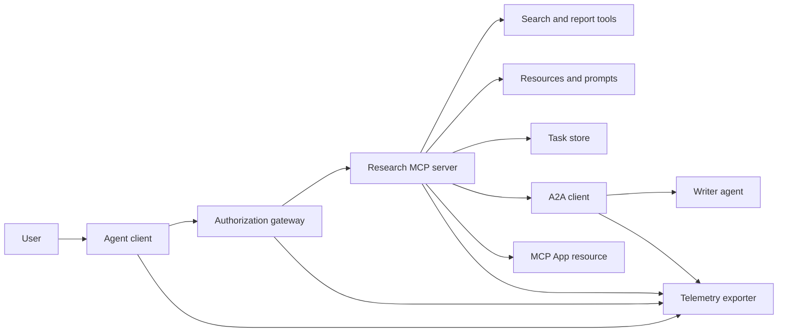
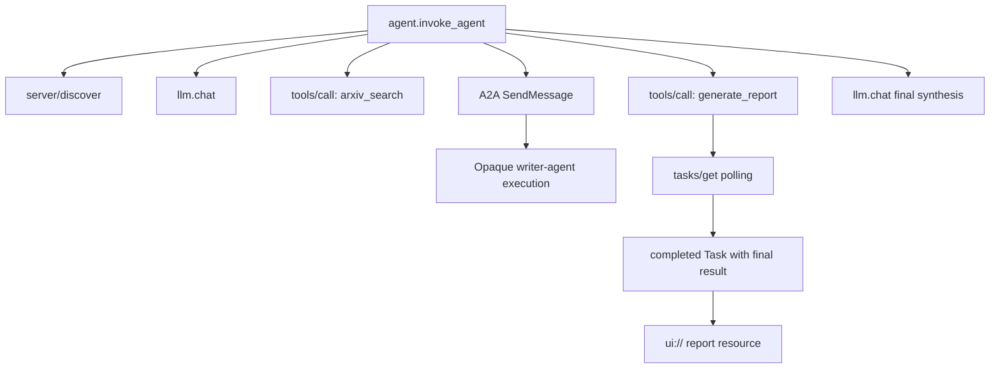
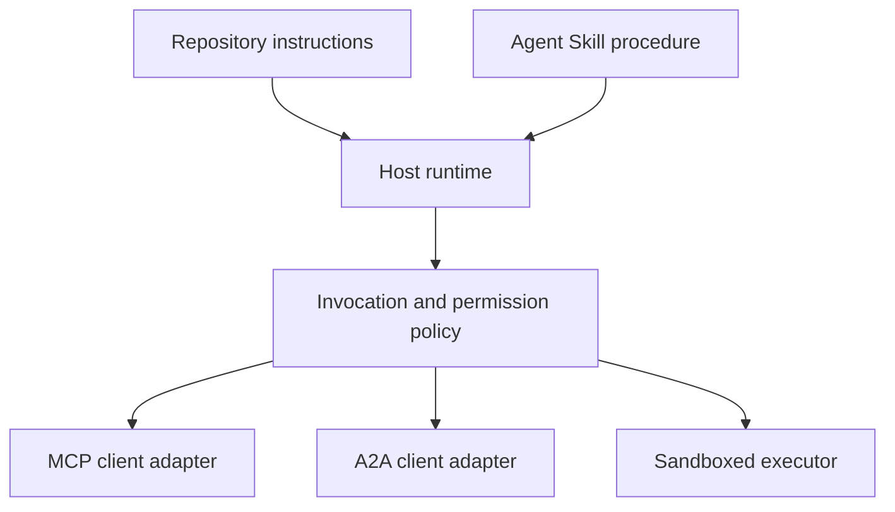

# الحجر الرئيسي: النظام البيئي للأدوات التي لا تملك جنسية

> نظام وكيل الإنتاج هو مجموعة من الحدود ، وليس كومة من الميزات. هذه الحجر النهائي يفصل محاكاة عملية قابلة للقراءة من عملاء البروتوكول ، وخادم التأذن ، صندوق الرمل ، ومصدر التلفاز الذي لا يزال يحتاج إلى نشر حقيقي.

**Type:** Build
**Languages:** Python (stdlib, in-process simulation)
**Prerequisites:** Phase 13 · 01 through 22, using MCP revision `2026-07-28`
**Time:** ~120 minutes

## أهداف التعلم

- إعداد دعوات الأدوات، نتائج تشكيلة المهام، العمل المفوض، UI الموارد، سياسة التأخيص، وتتبع السجلات في تدفق واحد.
- تحمل إصدار بروتوكول ، هوية العميل ، والقدرات على كل MCP طلب بدلاً من الاعتماد على جلسة اتصال.
- اكتشف خادم قبل استخدامها وتعمل على العمل الطويل من خلال التوسع الرسمي للمهام.
- التمييز بين محاكاة على شكل بروتوكول من MCP, A2A, OAuthأو OpenTelemetry التنفيذ
- خريط كل حدود محاكاة إلى مكون الإنتاج الذي يجب استبداله.
- إبق `AGENTS.md`, مهارات العميل , مُعدّلات وقت التشغيل , الأدوات , وسياسة الأمن في أدوارهم الصحيحة
- شرح أي ادعاءات يمكن التحقق منها من الناتج المحلي والتي تحتاج إلى اختبارات التكامل الحي.

## المشكلة

تصميم نظام بحث وتقرير. يطلب المستخدم ورق على بروتوكولات الوكيل. يقوم النظام بالبحث في كتالوج ورقية، ويمنح التلخص، ويمنح تقرير، ويرجع UI المورد، وتسجيل المسار من خلال النظام.

هذه الجملة تخفي عدة عقود مستقلة:

- مخطط أداة يستهدف النموذج
- ملف طلب غير تابع للدولة وعقد اكتشاف الخادم
- قرار البوابة للفاعل والطاق و هوية الأداة
- عقد تشغيل طويل الأمد؛
- بروتوكول التفويض؛
- جسر من مضيف إلى تطبيق
- التكاثر والصادرة
- إجراءات تشغيل قابلة لإعادة الاستخدام.

`code/main.py` يبقي تلك الحدود مرئية مع العادي Python وظائف و قاموس لا يفتح وسيلة نقل arXiv، أداء OAuth، اتصل A2A الخادم، إرسال MCP تطبيق أو تصدير التلفاز. وهذا يجعل من السهل تفتيش تدفق التحكم دون تقديم محاكاة كخدمة متوافقة.

## المفهوم

### الهدف الهدف



الهندسة المعمارية هي تركيب مفاهيمي لنمطات البروتوكول العامة. إنها ليست ادعاءً عن الداخلية الخاصة لأي منتج.

### أثر الهدف



في تنفيذ حقيقي، كل هوب ينتشر سياق آثار. OpenTelemetry الاتفاقيات النطاقية التي تدعمها إصدار الأدوات المختار. لا يثبت معرف البصمات المشترك وحده أن الأصل أو التصدير أو استهلاك الخلفية صحيح.

### السطحات الحالية للبروتوكول

استخدم أسماء الطرق التي حددتها البروتوكول الحالي، وليس أسماء تتذكر من مسودة قديمة:

| الحدود | السطح الحالي | ما يحتاكه الحجر الرئيسي |
|---|---|---|
| MCP الاكتشاف | إلزامية `server/discover` | وظيفة مباشرة تعيد الإصدارات والقدرات و هوية الخادم |
| MCP السياق الطلب | الإصدار والقدرات و هوية العميل في كل `params._meta` | بيانات المطلوب الجديدة تم إرسالها إلى كل مكالمة محاكاة |
| MCP دعوة الأداة | `tools/call` | مباشرة Python إرسال الوظيفة |
| MCP إجراءات استطلاع | `io.modelcontextprotocol/tasks` مع `tasks/get` | مسدس عمل يليه مهمة اكتملت تحمل نتيجة نهائية |
| A2A التفويض | `SendMessage` في gRPC و JSON-RPC; `POST /message:send` في HTTP+JSON | فترة واحدة متضخمة بدون مكالمة عن بعد أو تأخير اصطناعي |
| MCP التطبيقات التي تدعو إلى أداة الخادم | `app.callServerTool({ name, arguments })` | (إنجليزية) HTML حبل بدون جسر حي |
| OAuth الإذن | خادم التصريح، البيانات المعدنية الموارد المحمية، تأكيد الجمهور ومدى التطبيق | البحث عن الرمز التجاري والعضوية في نطاق |
| OpenTelemetry | SDK، المروج والمصدر والجمع أو الخلفية | قاموسات فترة الذاكرة |

أسماء البروتوكولات هي الطبقة الأولى فقط. يجب أن تقوم اختبارات الإنتاج بتنظيم التسلسل وفشل التصديق والإلغاء والوقت والإعادة المحاولات وتوافق النسخ عبر الأسلاك الحقيقية.

### بدون جنسية MCP تغير حدود التكامل

الإصلاح `2026-07-28` يزيل جلسات البروتوكول `initialize` / `notifications/initialized` يضغط يدك. `Mcp-Session-Id`كل طلب يحمل هذه المساحات الاسمية `_meta` الحقول:

```json
{
  "io.modelcontextprotocol/protocolVersion": "2026-07-28",
  "io.modelcontextprotocol/clientCapabilities": {
    "extensions": {
      "io.modelcontextprotocol/tasks": {}
    }
  },
  "io.modelcontextprotocol/clientInfo": {
    "name": "capstone-client",
    "version": "1.0.0"
  }
}
```

يجب على الخادم تنفيذ `server/discover`. استخدام النتائج العادية `resultType: "complete"`؛ استخدامات مسدس المهمة `resultType: "task"`كل نتيجة يجب أن تحدد الخادم في `_meta.io.modelcontextprotocol/serverInfo`.

تمديد المهام `tasks/get`, `tasks/update`و `tasks/cancel`أداة قد تعود أولاً `resultType: "task"`; `tasks/get` نفسها تعود `resultType: "complete"`، والكمل `Task` يحتوي النتيجة النهائية `tasks/result` و `tasks/list` الأساليب ليست جزءا من التوسيع الحالي. يجب على العميل الإعلان عن `io.modelcontextprotocol/tasks` في نفس الطلب الذي قد يتلقى مسدسة المهمة. إذا لم يفعل ذلك، يعود الخادم `-32021` مع `requiredCapabilities` على شكل كائن لا يتوفر على قدرة العميل، بما في ذلك `extensions.io.modelcontextprotocol/tasks`.

### وضعية الأمن

النشر المقصود يستخدم الدفاع العميق:

- OAuth الموافقة مع PKCE عندما يطلب ذلك نوع العميل؛
- التزاماً بالموارد والجمهور للوصول إلى رموز الوصول المصدرة؛
- البوابة RBAC التي تحقق من الأداة والمدى المطلوب؛
- الإثباتات المتقدمة التي تمت احتفاظها خارج سياق النموذج المرئي؛
- إشارة تصفية الأدوات المثبتة أو المراجعة؛
- مراجعة قاعدة الثانية لمعلومات غير موثوق بها والبيانات الحساسة والإجراءات التالية؛
- صندوق رمل تنفيذ يتم فرضه على نظام الملفات والعملية والشبكة والتصريحات والحدود الموارد خارج المهارة.

ينفذ الديمو رموز ثابتة فقط، وتحققات النطاق، وتصفيح الهاشز. هو مفيد لتدفق السياسات، وليس التحقق من الأمن.

### المهارات هي الإجراءات وليس النقل

يمكن لمهارة العميل أن تخبر الوقت المباشر كيفية تنفيذ سير العمل البحث، أي أدوات العقود تتوقع، أي أدلة أن توفر، ومتى تتوقف. MCP الخادم موجود، إقامة A2A التوافق، أو نطاقات المنحة، أو إنشاء صندوق رمل.



أرسل دليل المهارات الكامل عندما تشير الإجراءات إلى ملفات المرافق. الفن السطحي في هذه الحجر الأساسي القديم هو خطة مسار، وليس دليل على أن مضيف يحافظ على مجموعة محمولة. الدروس 24 إلى 27 بناء واختبار دورة حياة مجموعة كاملة.

### البيانات المتحركة في المقرر هي مُعدّل محلي

الكاتلوج الدراسي ومركز التثبيت يدرك الملفات السطحية المسمى `skill-*.md`، ولكن هذه هي اتفاقية مخزن بدلا من عقد حزمة المهارات العميل المحمولة. قراءة المواد الأمامية الحد الأدنى لديهم فقط مفاتيح المستوى العلوي. هذا الدروس يبقي حقل الهوية المحمولة وحقل الكتالوج الدراسي على نفس المستوى:

```yaml
---
name: ecosystem-blueprint
description: Produce a full Phase 13 ecosystem architecture for a product need.
version: "1.0.0"
phase: "13"
lesson: "23"
tags: [mcp, capstone, ecosystem, architecture, a2a, otel]
---
```

`name` و `description` هي حقل الهوية المحمولة. `version`, `phase`, `lesson`و `tags` هي امتدادات الكتالوجية الخاصة بالدورة. `tags` كقائمة متواصلة `--tag capstone` يمكن أن تتطابق مع ذلك.

مهارة دليل محمولة قد تستخدم اختياري `metadata` خريطة لبيانات التوسع ذات قيمة سلسلة. هذا لا يجعل `metadata` يمكن تبادلها مع مخطط الكتالوج هذا المخبز. إذا كان هذا الملف مسطح تعيش `version` أو `tags` أدناه `metadata`، يفرض المصفح الحد الأدنى هذه المفاتيح المقطوعة ، ويستسجل الكتالوج نسخة فارغة ، و لا يمكن تصفية العلامات العلامة العثور على الفن. مضيف الإنتاج يجب أن تستخدم خزانة YAML يبحثون ويمتدّعون مخططاتهم الموثقة الخاصة بهم.

### المحاكاة مقابل الإنتاج

| الطبقة | `code/main.py` | استبدال الإنتاج | الدليل المطلوب |
|---|---|---|---|
| اكتشاف | `server_discover()` + ثابتة `TOOLS` | `server/discover` يليها " الوعي بالخلف " `tools/list` | النصوص السلكية، والترتيب التحديدي، وتصديق النظام |
| التحقق | قاموس مفتاح الرمز | OAuth التصريح والتحقق من المصادقة على خادم الموارد | اختبارات المصدر والجمهور ومدى التطبيق والانتهاء من الصلاحية والفشل |
| الإذن | عضوية النطاق | سياسة البوابة المرتبطة بالجهاز الفاعل والأداة والهدف والمستأجر | السماح وإرفض حالات المراجعة |
| البحث | أجهزة ورق ثابتة | البحث API أو MCP الخادم | اختبارات مصدر المصدومة والتصنيف والخطأ |
| المهام | المقبض المحلي بالإضافة إلى الفورية `tasks/get` | مستدامة `io.modelcontextprotocol/tasks` متجر مع `tasks/get`, `tasks/update`, `tasks/cancel`و TTL | اختبارات الانتقال إلى الحالة، وإدخال، وإلغاء، وإعادة التأهيل |
| التفويض | النوم بالإضافة إلى المدة المضطربة | A2A بطاقة العميل والوكيل عن بعد | اختبارات العقد، وقتاً طويلاً، وإعادة المحاولة، والضبابية |
| التطبيق | HTML السلسلة URI | MCP الموارد التطبيقات `App` الجسر | CSP، الإذن ، دعوة الأدوات ، واختبارات المتصفح |
| التلفاز | قائمة في الذاكرة | OTel SDK والمصدر | إيصال المجمع وتصريحات الأبوة |
| صندوق الرمال | لا يوجد | المُنفذ المعزول الذي يُجبر على الاستضافة | اختبارات الهروب والخروج والسرية ومحدودية الموارد |

هذه الجدول هو حدود التسليم. إدارة محلية خضراء تؤكد المحاكاة فقط.

### خريطة المرحلة 13

| الدروس | المساهمة |
|---|---|
| 01-05 | واجهات الأدوات، الدعوات، الخطط، النتائج المهيكلة، والتحقق من التحقق من التحقق من التحقق من التحقق |
| 06-14 | بدون جنسية MCP طلبات الغلافات، اكتشاف، النقل، الموارد، الإشارات، التوسعات، والتطبيقات |
| 15-18 | دفاعات التسمم OAuth، البوابات، السجلات، ووحدة الإنتاج |
| 19 | A2A تفويض الرسالة والمهام |
| 20 | OpenTelemetry GenAI تصميم العثور |
| 21 | التوجيه من مقدم النموذج |
| 22 | عقد مهارات محمولة وحدود وقت التشغيل |

```figure
t3-capstone-chain
```

## بناءها

أطلقوا الحزام في العملية:

```bash
cd phases/13-tools-and-protocols/23-capstone-tool-ecosystem
python3 code/main.py
```

فحص خمسة أشياء:

1. `server/discover` الإعلانات الإصلاح `2026-07-28` ومدّة المهام
2. (أليس) تستطيع قراءة وتوليد تقرير بينما يتم رفض مكالمة (بوب) المكتوبة
3. كل فترة محلية في مسار واحد للموسيقي يشارك في تعريف واحد وتسجيلات تعريفات فترة الأب.
4. البيان يبدأ كمسؤولية مهمة `tasks/get` يعود مهمة اكتملت النتيجة النهائية تحتوي على نص و `ui://` الإشارة
5. يظل الكاتب المفوض غير مرئي لأن الموسيقي يسجل فقط المدى الحدودي.
6. لا يوجد أي دعوى إنتاجية على اتصال الشبكة OAuth حدث تبادل، صادرة المجموعة، عرض المتصفح، أو تنفيذ صندوق الرمل.

النص يبدأ مرتين، لذلك ينتج اثنين من أثر الجذر. إدخالات التدقيق هي عملية محلية وإعادة تعيين في التشغيل التالي.

## استخدمها

دعم طبقة واحدة في كل مرة:

1. استبدال `server_discover()` و قائمة الأدوات الثابتة مع حقيقية `server/discover` و `tools/list` إرسال الإصدار والهوية والقدرات في كل طلب
2. استبدال الرموز الثابتة بخادم تصريح وتحقق المصادقة الموارد المحمية.
3. تنفيذ `io.modelcontextprotocol/tasks` التوسع والاختبار `tasks/get`, `tasks/update`, `tasks/cancel`، وقت وقف TTL، وإعادة تشغيل التعافي . لا تضيف `tasks/result` أو `tasks/list`.
4. استبدل قاعدة التفويض بـ A2A العميل الذي يحل بطاقة العميل ويرسل رسالة
5. قم ببناء التطبيق مع المسؤول SDK ويدعو أدوات الخادم من خلال `app.callServerTool`.
6. تمتد التصدير إلى جمع اختبار وتؤكد الأصل عند المستلم.
7. إشغال أداة وتنفيذ النص داخل عقد صندوق الرمل من الدروس 26.
8. حزم الإجراء كحزمة إداري كاملة ومر بوابة إطلاق الدروس 27.

كل ترقية تحتاج إلى اختبار تكامل يعبر الحدود الجديدة. لا تتمحى اختبارات السياسة المستوى السفلي عندما يصبح السلك حقيقي.

## أرسله

هذا الدرس يُنتج `outputs/skill-ecosystem-blueprint.md`، وهو متجر دورة واحد متكرر. يطلب بنية صفحة واحدة تغطي البدائيات والأمن والوكالة والمتنقلات والحزمة، والخطر التشغيلي الصعب. يتم ممارسة حقل الكتالوج على مستوى الأعلى من قبل الكتالوج الحقيقي للمخزن والمتصفحات المثبتة.

ولأن هذا ليس مجموعة من المجلدات، فإنه لا يمكن أن يحمل الإشارات، والنصوص، والأصول، أو تصميمات تقييم. استخدم شكل الحزمة من الدروس 22 و 24 إلى 27 عند نشر مهارة قابلة للاستعمال خارج هذه الدورة.

## التمارين

1. أركض `code/main.py`.حقائق منفصلة أثبتت بالإنتاج من ادعاءات الإنتاج التي لا تزال بحاجة إلى دليل على التكامل.
2. إضافة آخر خلفية ثابتة وتحديد قاعدة التصادم لعددين من الأدوات ذات الاسم نفسه. ثم استبدل كل من القوائم مع حقيقية `tools/list` مكالمات
3. استبدل مخطط الكاتب A2A سجل بطاقة العميل، طلب الرسالة، مسار التوقف، والشئ المرجع.
4. إضافة مخزن المهام الذي يتجاوز إعادة تشغيل العملية. إثبات العميل يمكن استئناف مع `tasks/get`, الاحترام `pollIntervalMs`، وقراءة النتيجة النهائية للمهمة المكتملة دون `tasks/result`.
5. بناء الحد الأدنى MCP التطبيق والتحقق `app.callServerTool` في متصفح مع قيود CSP والإذن المبرر
6. تصدير المكاسب المثبتة عبر OTel SDK إلى جمع محلي. تأكيد الإيصالات، وتعريفات البحث، والآباء، وحالة الخطأ.
7. اكتب `AGENTS.md` لقيود الصيانة على مستوى المكتبة ومجموعة مهارات منفصلة لإجراء البحث القابل لإعادة الاستخدام. شرح لماذا لا يمنح أي من الملفات سلطة الأدوات.

## الشروط الرئيسية

| المدة | ما يقوله الناس | ما يعنيه هذا في الواقع |
|---|---|---|
| كابستون | "كل شيء متصل" | إدماج مرحلي يظل حدوده المثبتة والحية واضحة |
| محاكاة على شكل بروتوكول | "إنه في الأساس MCP" | البيانات المحلية والمكالمات التي تشبه بروتوكول دون تنفيذ عقدها السلكي |
| تمديد المهام | "تصل طويل الأدوات" | اختيارية `io.modelcontextprotocol/tasks` دورة الحياة مع الهوية الدائمة، والمسحات، وإدخال العملاء، والنتيجة النهائية، والإلغاء |
| حدود المكشف | "الوكيل الآخر يتعامل مع الأمر" | يرى المدعو الواجهة والملفات المعلنة، وليس التفكير الخاص أو الحالة الداخلية |
| مُعدّل وقت التشغيل | "التكامل المهني" | رمز المضيف الذي يقوم بتخريط الإجراءات المحمولة إلى اكتشاف، ودعوة، والأدوات، والسياسة، والسياق |
| دليل على الاندماج | "لقد مر" | نسخة، أو أداة، أو ملاحظة من جانب المستلم يثبت أن الحدود الحقيقية قد تم عبورها |

## المزيد من القراءة

- [MCP المواصفات 2026-07-28](https://modelcontextprotocol.io/specification/2026-07-28) لطلبات غير تابعة للولاية، والاكتشافات، والأدوات، والإذن، وسلوك النقل.
- [MCP 2026-07-28 تغييرات رئيسية](https://modelcontextprotocol.io/specification/2026-07-28/changelog) لإزالة جلسة، البيانات المعدنية حسب الطلب، MRTR، التوسعات، والإحباطات.
- [MCP تمديد المهام](https://tasks.extensions.modelcontextprotocol.io/specification/draft/tasks) لـ `tasks/get`, `tasks/update`, `tasks/cancel`ونتائج النهائية التي تمت بقيامها بمهمات نهائية.
- [MCP التطبيقات SDK](https://github.com/modelcontextprotocol/ext-apps/blob/main/docs/overview.md) لـ `App` و `app.callServerTool`.
- [A2A البروتوكول](https://a2a-protocol.org/latest/) للكارطات العميلة، وتسليم الرسائل، والمهام، والقطع الأثرية، والترقل.
- [OpenTelemetry GenAI الاتفاقيات النطاقية](https://opentelemetry.io/docs/specs/semconv/gen-ai/) لـ"تعاقد" و"تعاقد"
- [مواصفات مهارات العميل](https://agentskills.io/specification) بالنسبة لعقد الحزمة المحمولة المستخدمة في الطبقة الإجرائية.
