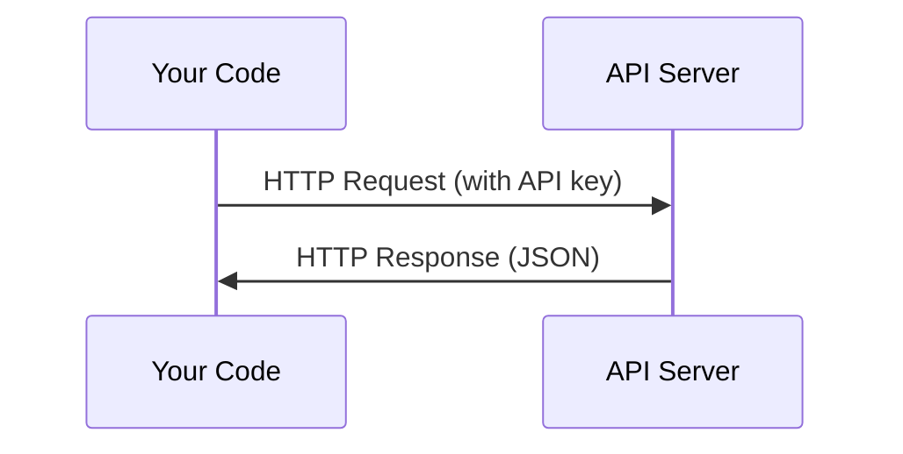

# APIs & Keys

> हर AI API एक ही तरीके से काम करता हैः एक अनुरोध भेजें, एक प्रतिक्रिया प्राप्त करें. विवरण बदलते हैं, पैटर्न नहीं करता है.

**Type:** Build
**Languages:** Python, TypeScript
**Prerequisites:** Phase 0, Lesson 01
**Time:** ~30 minutes

## सीखने के लक्ष्य

- स्टोर API पर्यावरण चर का सुरक्षित रूप से उपयोग करने वाले कुंजी और `.env` फ़ाइलें
- एक बनाओ LLM API दोनों का उपयोग कर कॉल Anthropic Python SDK और कच्चे HTTP
- तुलना करें SDK-based और कच्चे HTTP डिबगिंग के लिए अनुरोध/उत्तर प्रारूप
- सामान्य पहचान और संभाल API प्रमाणीकरण और दर सीमाओं सहित त्रुटियां

## समस्या

चरण 11 से शुरू, आप कॉल करेंगे LLM APIs (Anthropic, OpenAIचरण 13-16 में आप एजेंटों का निर्माण करेंगे जो इन का उपयोग करते हैं APIs लूप में. आपको यह जानना होगा कि कैसे API कुंजी काम करते हैं, उन्हें सुरक्षित रूप से कैसे संग्रहीत करें, और अपनी पहली API फोन करें।

## अवधारणा



हर API कॉल में हैः
1. एक अंत बिंदु (URL)
2. एक API कुंजी (प्रमाणन)
3. अनुरोध निकाय (आप क्या चाहते हैं)
4. एक प्रतिक्रिया शरीर (आप क्या वापस मिलता है)

```figure
s0-secret-inject
```

## इसे बनाओ

### चरण 1: स्टोर करें API कुंजी सुरक्षित

कभी नहीं डाल API कोड में कुंजी। पर्यावरण चर का उपयोग करें।

```bash
export ANTHROPIC_API_KEY="sk-ant-..."
export OPENAI_API_KEY="sk-..."
```

या एक `.env` फ़ाइल (इसका जोड़ें `.gitignore`):

```
ANTHROPIC_API_KEY=sk-ant-...
OPENAI_API_KEY=sk-...
```

### चरण 2: पहला API कॉल (Python)

```python
import os

import anthropic

client = anthropic.Anthropic()

MODEL = os.environ.get("LLM_MODEL", "claude-sonnet-5")

response = client.messages.create(
    model=MODEL,
    max_tokens=256,
    messages=[{"role": "user", "content": "What is a neural network in one sentence?"}]
)

print(response.content[0].text)
```

`LLM_MODEL` चुनता है Anthropic मॉडल आईडी, और डिफ़ॉल्ट समय पर नहीं Sonnet उपनाम है। अन्य प्रदाताओं (OpenAI, गूगल, और अन्य) एक ही पैटर्न की एक कुंजी के साथ एक मॉडल आईडी का पालन करें, लेकिन प्रत्येक अपने SDK, एंडपॉइंट, और अनुरोध/उत्तर योजना।

### चरण 3: पहला API कॉल (TypeScript)

```typescript
import Anthropic from "@anthropic-ai/sdk";

const client = new Anthropic();

const MODEL = process.env.LLM_MODEL ?? "claude-sonnet-5";

const response = await client.messages.create({
  model: MODEL,
  max_tokens: 256,
  messages: [{ role: "user", content: "What is a neural network in one sentence?" }],
});

console.log(response.content[0].text);
```

### चरण 4: कच्चा HTTP (नहीं SDK)

```python
import os
import urllib.request
import json

url = "https://api.anthropic.com/v1/messages"
headers = {
    "Content-Type": "application/json",
    "x-api-key": os.environ["ANTHROPIC_API_KEY"],
    "anthropic-version": "2023-06-01",
}
body = json.dumps({
    "model": os.environ.get("LLM_MODEL", "claude-sonnet-5"),
    "max_tokens": 256,
    "messages": [{"role": "user", "content": "What is a neural network in one sentence?"}],
}).encode()

req = urllib.request.Request(url, data=body, headers=headers, method="POST")
with urllib.request.urlopen(req) as resp:
    result = json.loads(resp.read())
    print(result["content"][0]["text"])
```

यह है कि क्या SDKs कच्चे को समझने के लिए HTTP कॉल डिबगिंग में मदद करता है।

## इसका प्रयोग करें

इस कोर्स के लिएः

| API | जब आप की जरूरत है | मुक्त स्तर |
|-----|-----------------|-----------|
| Anthropic (Claude) | चरण 11-16 (एजेंट, उपकरण) | पंजीकरण पर 5 डॉलर का क्रेडिट |
| OpenAI | चरण 11 (समान) | पंजीकरण पर 5 डॉलर का क्रेडिट |
| गले लगाते हुए चेहरा | चरण 4-10 (मॉडल, डेटासेट) | निःशुल्क |

आपको अभी उन सभी की जरूरत नहीं है, उन्हें जब पाठ की आवश्यकता होगी, तब सेट करें।

## इसे भेजें

इस पाठ से उत्पन्न होता हैः
- `outputs/prompt-api-troubleshooter.md` - सामान्य निदान API त्रुटियाँ

## व्यायाम

1. एक प्राप्त करें Anthropic API कुंजी और अपनी पहली बनाने API कॉल
2. कच्चे को आज़माएं HTTP संस्करण और प्रतिक्रिया प्रारूप की तुलना SDK संस्करण
3. जानबूझकर गलत उपयोग करें API कुंजी और त्रुटि संदेश पढ़ें

## प्रमुख शर्तें

| अवधि | लोग क्या कहते हैं | इसका क्या मतलब है |
|------|----------------|----------------------|
| API कुंजी | "पॉसवर्ड के लिए API" | एक अद्वितीय स्ट्रिंग जो आपके खाते की पहचान करती है और अनुरोधों को अधिकृत करती है |
| दर सीमा | "वे मुझे थूक रहे हैं" | दुरुपयोग को रोकने और निष्पक्ष उपयोग सुनिश्चित करने के लिए प्रति मिनट/घंटे अधिकतम अनुरोध |
| टोकन | "एक शब्द" (में API संदर्भ) | बिलिंग इकाईः इनपुट और आउटपुट टोकन को अलग से गिना और चार्ज किया जाता है |
| स्ट्रीमिंग | "रियल टाइम प्रतिक्रियाएं" | पूरी प्रतिक्रिया की प्रतीक्षा करने के बजाय शब्द-शब्द प्रतिक्रिया प्राप्त करना |
