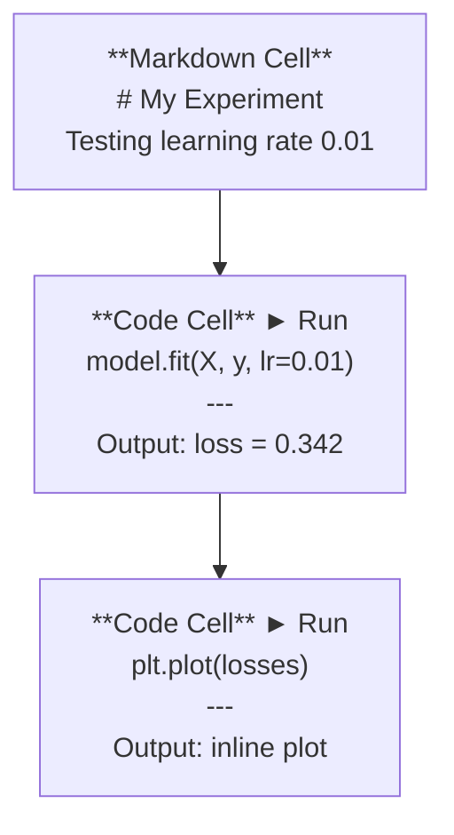
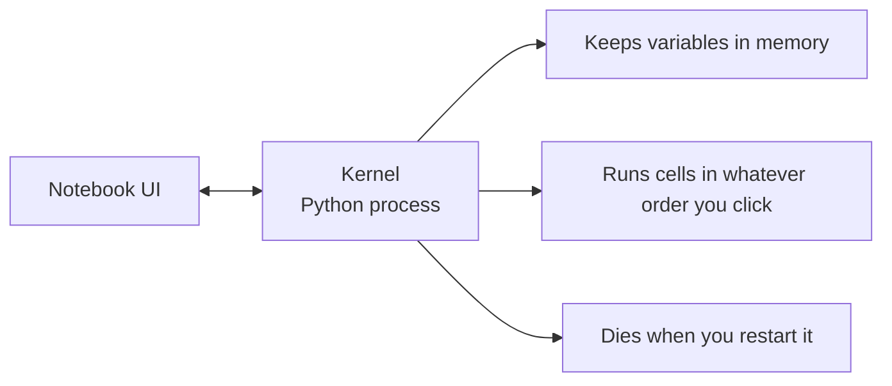

# ज्यूपिटर नोटबुक

> नोटबुक प्रयोगशाला बेंच हैं AI आप यहां प्रोटोटाइप, फिर उत्पादन में काम करने के लिए स्थानांतरित.

**Type:** Build
**Languages:** Python
**Prerequisites:** Phase 0, Lesson 01
**Time:** ~30 minutes

## सीखने के लक्ष्य

- स्थापना और प्रक्षेपण JupyterLab, Jupyter Notebook, या VS Jupyter विस्तार के साथ कोड
- जादू कमांड का उपयोग करें (`%timeit`, `%%time`, `%matplotlib inline`) इनलाइन को बेंचमार्क करने और दृश्यमान बनाने के लिए
- नोटबुक और स्क्रिप्ट का उपयोग कब करना है, इसका अंतर करें और "नोटबुक में खोजें, स्क्रिप्ट में जहाज करें" कार्यप्रवाह लागू करें
- सामान्य नोटबुक फंदे की पहचान करें और उनसे बचेंः अनियमित निष्पादन, छिपा हुआ राज्य और मेमोरी लीक

## समस्या

हर AI कागज, ट्यूटोरियल, और Kaggle प्रतियोगिता Jupyter नोटबुक का उपयोग करता है. वे आप टुकड़ों में कोड चला सकते हैं, इनलाइन आउटपुट देखने, स्पष्टीकरण के साथ कोड मिश्रण, और तेजी से पुनरावृत्ति. यदि आप सीखने की कोशिश करते हैं AI नोटबुक के बिना, आप बिना कागज के गणित होमवर्क कर रहे हैं।

लेकिन नोटबुक में असली जाल हैं. लोग उन्हें हर चीज के लिए उपयोग करते हैं, जिसमें वे भयानक हैं। नोटबुक का उपयोग कब करना है और स्क्रिप्ट का उपयोग कब करना है यह जानना आपको बाद में बुराई के सपने से बचाएगा।

## अवधारणा

नोटबुक कोशिकाओं की एक सूची है। प्रत्येक कोशिका या तो कोड या पाठ है।



नाभिक एक है Python जब आप एक सेल चलाते हैं, तो यह कोड को कर्नेल को भेजता है, जो इसे निष्पादित करता है और परिणाम वापस भेजता है। सभी कोशिकाओं एक ही कर्नेल साझा करते हैं, इसलिए चर कोशिकाओं के बीच बनी रहती हैं।



"जो भी आदेश आप क्लिक करें" भाग सुपर पावर और पैर बंदूक दोनों है।

```figure
s0-cell-order
```

## इसे बनाओ

### चरण 1: अपना इंटरफ़ेस चुनें

तीन विकल्प, एक प्रारूपः

| इंटरफेस | स्थापित करें | सबसे अच्छा के लिए |
|-----------|---------|----------|
| JupyterLab | `pip install jupyterlab` तो `jupyter lab` | पूर्ण IDE अनुभव, कई टैब, फ़ाइल ब्राउज़र, टर्मिनल |
| ज्यूपिटर नोटबुक | `pip install notebook` तो `jupyter notebook` | सरल, हल्का, एक समय में एक नोटबुक |
| VS कोड | "ज्यूपिटर" विस्तार स्थापित करें | पहले से ही अपने संपादक में, git एकीकरण, डिबगिंग |

तीनों एक ही पढ़ते और लिखते हैं `.ipynb` फ़ाइल. आप जो चाहें चुनें. JupyterLab सबसे आम है AI काम पर।

```bash
pip install jupyterlab
jupyter lab
```

### चरण 2: महत्वपूर्ण कीबोर्ड शॉर्टकट

आप दो मोड में काम करते हैं। `Escape` कमांड मोड के लिए (बाएं ओर नीला पट्टी), `Enter` संपादन मोड (ग्रीन बार) के लिए।

**कमांड मोड (सबसे अधिक इस्तेमाल किया):**

| कुंजी | कार्रवाई |
|-----|--------|
| `Shift+Enter` | सेल चलाओ, अगले पर जाएँ |
| `A` | ऊपर से सेल डालें |
| `B` | नीचे की सेल डालें |
| `DD` | सेल को हटाएँ |
| `M` | मार्कडाउन में परिवर्तित करें |
| `Y` | कोड में परिवर्तित करें |
| `Z` | सेल को रद्द करना |
| `Ctrl+Shift+H` | सभी शॉर्टकट दिखाएँ |

**संपादन मोडः**

| कुंजी | कार्रवाई |
|-----|--------|
| `Tab` | स्वचालित रूप से पूरा करें |
| `Shift+Tab` | फ़ंक्शन हस्ताक्षर दिखाएँ |
| `Ctrl+/` | टिप्पणी को टगल करें |

`Shift+Enter` यह वह है जिसका आप दिन में एक हजार बार उपयोग करेंगे. पहले इसे सीखें.

### चरण 3: कोशिका प्रकार

**कोड सेल** दौड़ना Python और आउटपुट दिखाएँः

```python
import numpy as np
data = np.random.randn(1000)
data.mean(), data.std()
```

आउटपुटः `(0.0032, 0.9987)`

**मार्कडाउन कोशिकाएँ** स्वरूपित पाठ प्रस्तुत करें. उन्हें आप क्या कर रहे हैं और क्यों दस्तावेज करने के लिए उपयोग करें. हेडर समर्थन, बोल्ड, इटालिक, LaTeX गणित (`$E = mc^2$`), तालिकाएँ और चित्र।

### चरण 4: जादूई आदेश

ये नहीं हैं Pythonवे Jupyter विशिष्ट आदेश हैं जो शुरू होते हैं `%` (लाइन जादू) या `%%` (सेल जादू)

**अपना कोड टाइमः**

```python
%timeit np.random.randn(10000)
```

आउटपुटः `45.2 us +/- 1.3 us per loop`

```python
%%time
model.fit(X_train, y_train, epochs=10)
```

आउटपुटः `Wall time: 2.34 s`

`%timeit` कोड कई बार चलाता है और औसत। `%%time` इसे एक बार चलाता है। `%timeit` माइक्रोबेन्चमार्क के लिए, `%%time` प्रशिक्षण रन के लिए।

**इनलाइन प्लॉट सक्षम करेंः**

```python
%matplotlib inline
```

हर `plt.plot()` या `plt.show()` अब सीधे नोटबुक में प्रस्तुत करता है।

**नोटबुक को छोड़ने के बिना पैकेज स्थापित करेंः**

```python
!pip install scikit-learn
```

इन `!` पूर्ववर्ती किसी भी शेल कमांड चलाता है।

**पर्यावरण चरों की जांच करेंः**

```python
%env CUDA_VISIBLE_DEVICES
```

### चरण 5: रिच आउटपुट इनलाइन प्रदर्शित करें

नोटबुक ऑटो सेल में अंतिम अभिव्यक्ति प्रदर्शित करते हैं. लेकिन आप इसे नियंत्रित कर सकते हैंः

```python
import pandas as pd

df = pd.DataFrame({
    "model": ["Linear", "Random Forest", "Neural Net"],
    "accuracy": [0.72, 0.89, 0.94],
    "training_time": [0.1, 2.3, 45.6]
})
df
```

यह एक स्वरूपित प्रस्तुत करता है HTML एक मेज, एक पाठ डिंप नहीं.

```python
import matplotlib.pyplot as plt

plt.figure(figsize=(8, 4))
plt.plot([1, 2, 3, 4], [1, 4, 2, 3])
plt.title("Inline Plot")
plt.show()
```

इस कारण से नोटबुक हावी हैं AI आप डेटा, प्लॉट और कोड को एक साथ देखते हैं।

चित्रों के लिएः

```python
from IPython.display import Image, display
display(Image(filename="architecture.png"))
```

### चरण 6: गूगल कोलाब

कोलाब एक मुक्त Jupyter नोटबुक है बादल में. यह आपको एक देता है GPU, पूर्व-स्थापित पुस्तकालयों, और गूगल ड्राइव एकीकरण. कोई सेटअप की आवश्यकता नहीं है.

1. जाओ [colab.research.google.com](https://colab.research.google.com)
2. किसी भी अपलोड करें `.ipynb` इस पाठ्यक्रम से फ़ाइल
3. Runtime > Change चलना समय type > T4 GPU (free)

स्थानीय ज्युपीटर से कोलाब अंतरः
- सत्रों के बीच फ़ाइलें नहीं बनी रहती हैं (ड्राइव या डाउनलोड पर सहेजें)
- पूर्व स्थापितः नम्पी, पांडा, मैटप्लोटलिब, मशाल, टेन्सॉर्फ्लो, स्क्लेयर
- `from google.colab import files` फ़ाइलों को अपलोड/डाउनलोड करने के लिए
- `from google.colab import drive; drive.mount('/content/drive')` निरंतर भंडारण के लिए
- 90 मिनट की निष्क्रियता के बाद सत्रों का समय (मुक्त स्तर)

## इसका प्रयोग करें

### नोटबुक बनाम स्क्रिप्टः कब कौन सा उपयोग करें

| नोटबुक का उपयोग | स्क्रिप्ट का उपयोग करें |
|-------------------|-----------------|
| डेटा सेट की खोज | प्रशिक्षण पाइपलाइन |
| एक मॉडल का प्रोटोटाइप बनाना | पुनः प्रयोज्य उपयोगिताएं |
| परिणामों का दृश्य | कुछ भी के साथ `if __name__` |
| अपने काम की व्याख्या करना | एक कार्यक्रम पर चलती कोड |
| त्वरित प्रयोग | उत्पादन कोड |
| पाठ्यक्रम अभ्यास | पैकेज और पुस्तकालय |

नियमः **नोटबुक में खोजें, स्क्रिप्ट में जहाज**.

एक सामान्य कार्यप्रवाह AI:
1. नोटबुक में डेटा खोजें
2. नोटबुक में अपना मॉडल प्रोटोटाइप
3. एक बार यह काम करता है, कोड स्थानांतरित करने के लिए `.py` फ़ाइलें
4. उन आयात `.py` आगे के प्रयोगों के लिए फ़ाइलों को नोटबुक में वापस

### आम जाल

**आदेश से बाहर निष्पादन.** आप सेल 5 चलाते हैं, फिर सेल 2 और सेल 7। नोटबुक आपकी मशीन पर काम करता है लेकिन टूट जाता है जब कोई इसे ऊपर से नीचे चलाता है। Kernel > Restart साझा करने से पहले सभी को चलाएं।

**छिपा हुआ राज्य।** आप एक सेल को हटा देते हैं लेकिन यह परिवर्तनीय अभी भी स्मृति में है। नोटबुक साफ दिखता है लेकिन एक भूत सेल पर निर्भर करता है। फिक्सः नियमित रूप से कर्नेल को पुनरारंभ करें।

**स्मृति लीक.** 4GB डेटा सेट लोड करना, एक मॉडल को प्रशिक्षित करना, एक और डेटा सेट लोड करना. कुछ भी मुक्त नहीं होता है. ठीकः `del variable_name` और `gc.collect()`, या कर्नेल को पुनरारंभ करें.

## इसे भेजें

इस पाठ से उत्पन्न होता हैः
- `outputs/prompt-notebook-helper.md` नोटबुक समस्याओं को डिबग करने के लिए

## व्यायाम

1. खुला JupyterLab, एक नोटबुक बनाएं, और उपयोग करें `%timeit` 100,000 यादृच्छिक संख्याओं की सरणी बनाने के लिए सूची समझ बनाम numpy की तुलना करने के लिए
2. एक नोटबुक बनाएं जिसमें मार्कडाउन और कोड दोनों कोशिकाएं हों CSV, एक डेटा फ्रेम प्रदर्शित करता है, और एक चार्ट का पता लगाता है. Kernel > Restart & Run सभी यह ऊपर से नीचे काम करता है की पुष्टि करने के लिए
3. कोड ले लो `code/notebook_tips.py`, इसे एक कोलाब नोटबुक में पेस्ट करें, और इसे एक मुक्त के साथ चलाएं GPU

## प्रमुख शर्तें

| अवधि | लोग क्या कहते हैं | इसका क्या मतलब है |
|------|----------------|----------------------|
| कर्नेल | "मेरे कोड को चलाने वाली चीज" | एक अलग Python प्रक्रिया जो कोशिकाओं को निष्पादित करती है और मेमोरी में चर को रखती है |
| सेल | "एक कोड ब्लॉक" | नोटबुक में स्वतंत्र रूप से चलाने योग्य इकाई, कोड या मार्कडाउन |
| जादू कमांड | "जुपीटर ट्रिक्स" | विशेष आदेशों के साथ `%` या `%%` जो नोटबुक वातावरण को नियंत्रित करते हैं |
| `.ipynb` | "नोटबुक फ़ाइल" | A JSON कोशिकाओं, आउटपुट और मेटाडेटा युक्त फ़ाइल। IPython नोटबुक |

## आगे पढ़ना

- [JupyterLab डॉक्स](https://jupyterlab.readthedocs.io/) पूर्ण विशेषता सेट के लिए
- [गूगल कोलाब FAQ](https://research.google.com/colaboratory/faq.html) कोलाब विशिष्ट सीमाओं और विशेषताओं के लिए
- [28 ज्युपिटर नोटबुक टिप्स](https://www.dataquest.io/blog/jupyter-notebook-tips-tricks-shortcuts/) बिजली प्रयोक्ता शॉर्टकट के लिए
