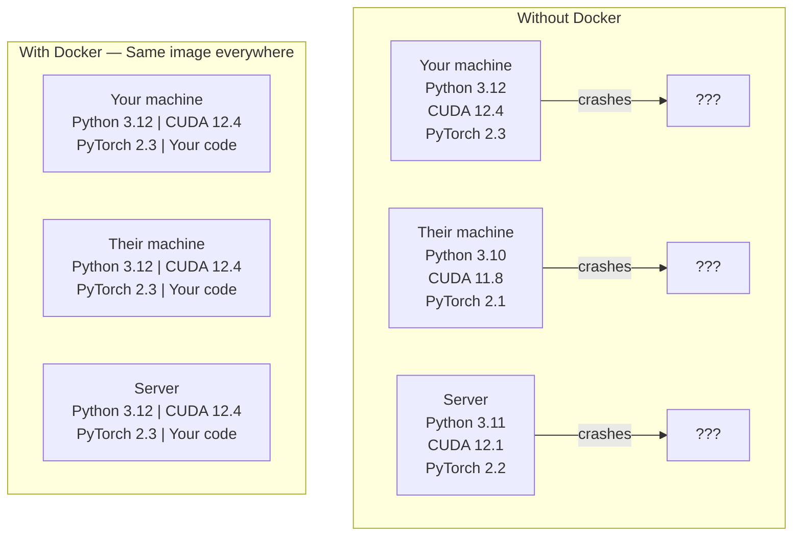

# Docker के लिए AI

> कंटेनरों से "मेरी मशीन पर काम" अतीत की बात बन जाती है।

**Type:** Build
**Languages:** Docker
**Prerequisites:** Phase 0, Lessons 01 and 03
**Time:** ~60 minutes

## सीखने के लक्ष्य

- एक निर्माण GPU-enabled Docker छवि के साथ CUDA, PyTorchऔर AI एक Dockerफ़ाइल से पुस्तकालय
- कंटेनर पुनर्निर्माणों में मॉडलों, डेटासेट और कोड को बनाए रखने के लिए मात्रा के रूप में होस्ट निर्देशिकाएं माउंट करें
- कॉन्फ़िगर करें NVIDIA कंटेनर टूलकिट को उजागर करने के लिए GPUs कंटेनरों के अंदर
- बहु-सेवा ऑर्केस्ट्रेट AI applications (inference server + vector database) using Docker रचना

## समस्या

आप अपने लैपटॉप पर एक मॉडल को प्रशिक्षित किया PyTorch 2.3, CUDA 12.4, and Python 3.12 आपके सहकर्मी ने PyTorch 2.1, CUDA 11.8, and Python 3.10 आपका मॉडल उनके मशीन पर दुर्घटनाग्रस्त हो गया है.

AI परियोजनाओं निर्भरता की दुःस्वप्न हैं. एक विशिष्ट स्टैक में शामिल हैं Python, PyTorch, CUDA चालक, cuDNN, सिस्टम स्तर सी पुस्तकालयों, और विशेष पैकेज जैसे फ्लैश-एटीएन जो सटीक संकलक संस्करणों की आवश्यकता है. Docker यह सब एक छवि में पैक करता है जो हर जगह समान रूप से चलता है।

## अवधारणा

Docker यह आपके कोड, रनटाइम, लाइब्रेरी और सिस्टम टूल को एक अलग इकाई में लपेटता है जिसे कंटेनर कहा जाता है. इसे एक हल्के आभासी मशीन के रूप में सोचें, सिवाय इसके कि यह होस्ट साझा करता है OS अपने स्वयं के चलाने के बजाय, यह सेकंड में शुरू होता है मिनटों के बजाय.



### क्यों AI परियोजनाओं की आवश्यकता Docker अधिकतर

1. **GPU चालक नाजुक हैं।** CUDA 12.4 कोड पर नहीं चल रहा है CUDA 11.8. Docker अलग करता है CUDA होस्ट साझा करते समय कंटेनर के अंदर टूलकिट GPU चालक के माध्यम से NVIDIA कंटेनर टूलकिट।

2. **मॉडल वजन बड़े हैं।** एक 7B पैरामीटर मॉडल 14 है GB में fp16. आप इसे हर बार पुनर्निर्माण करते समय पुनः डाउनलोड नहीं करना चाहते हैं। Docker मात्रा आप मेजबान से मॉडल निर्देशिका को माउंट करने के लिए अनुमति देता है।

3. **मल्टी-सर्विस आर्किटेक्चर आम हैं।** एक वास्तविक AI आवेदन केवल एक Python यह एक निष्कर्ष सर्वर है, एक वेक्टर डेटाबेस के लिए RAG, शायद एक वेब फ्रंटेंड. Docker इन सभी को एक कमांड के साथ संगीतबद्ध करें।

### प्रमुख शब्दावली

| अवधि | इसका क्या अर्थ है |
|------|---------------|
| छवि | एक केवल-पढ़ने टेम्पलेट. आपका नुस्खा. एक Docker फ़ाइल से बनाया गया. |
| कंटेनर | एक चलती छवि का एक उदाहरण. |
| डॉकरफ़ाइल | एक छवि बनाने के लिए निर्देश। |
| मात्रा | निरंतर भंडारण जो जीवित रहता है कंटेनर फिर से शुरू होता है। |
| डॉकर-संयोजन | बहु-कंटेनर अनुप्रयोगों को परिभाषित करने के लिए एक उपकरण YAML. |

### कंटेनर में आम पैटर्न AI

```
Dev Container
  Full toolkit. Editor support. Jupyter. Debugging tools.
  Used during development and experimentation.

Training Container
  Minimal. Just the training script and dependencies.
  Runs on GPU clusters. No editor, no Jupyter.

Inference Container
  Optimized for serving. Small image. Fast cold start.
  Runs behind a load balancer in production.
```

```figure
s0-image-layers
```

## इसे बनाओ

### चरण 1: स्थापित करें Docker

```bash
# macOS
brew install --cask docker
open /Applications/Docker.app

# Ubuntu
curl -fsSL https://get.docker.com | sh
sudo usermod -aG docker $USER
# Log out and back in for group change to take effect
```

सत्यापित करेंः

```bash
docker --version
docker run hello-world
```

### चरण 2: स्थापित करें NVIDIA कंटेनर टूलकिट (Linux के साथ NVIDIA GPU)

यह अनुमति देता है Docker कंटेनरों अपने GPU. macOS और Windows (WSL2) उपयोगकर्ता इस पर छूट सकते हैं; Docker डेस्कटॉप हैंडल GPU उन प्लेटफार्मों पर अलग तरह से गुजरना।

```bash
distribution=$(. /etc/os-release;echo $ID$VERSION_ID)
curl -fsSL https://nvidia.github.io/libnvidia-container/gpgkey | sudo gpg --dearmor -o /usr/share/keyrings/nvidia-container-toolkit-keyring.gpg
curl -s -L https://nvidia.github.io/libnvidia-container/$distribution/libnvidia-container.list | \
    sed 's#deb https://#deb [signed-by=/usr/share/keyrings/nvidia-container-toolkit-keyring.gpg] https://#g' | \
    sudo tee /etc/apt/sources.list.d/nvidia-container-toolkit.list

sudo apt-get update
sudo apt-get install -y nvidia-container-toolkit
sudo nvidia-ctk runtime configure --runtime=docker
sudo systemctl restart docker
```

परीक्षण GPU कंटेनर के अंदर पहुंचः

```bash
docker run --rm --gpus all nvidia/cuda:12.4.1-base-ubuntu22.04 nvidia-smi
```

यदि आप अपने GPU जानकारी, उपकरण किट काम कर रहा है.

### चरण 3: मूल चित्रों को समझें

सही आधार छवि चुनने डिबगिंग के घंटे बचाता है।

```
nvidia/cuda:12.4.1-devel-ubuntu22.04
  Full CUDA toolkit. Compilers included.
  Use for: building packages that need nvcc (flash-attn, bitsandbytes)
  Size: ~4 GB

nvidia/cuda:12.4.1-runtime-ubuntu22.04
  CUDA runtime only. No compilers.
  Use for: running pre-built code
  Size: ~1.5 GB

pytorch/pytorch:2.6.0-cuda12.4-cudnn9-runtime
  PyTorch pre-installed on top of CUDA.
  Use for: skipping the PyTorch install step
  Size: ~6 GB

python:3.12-slim
  No CUDA. CPU only.
  Use for: inference on CPU, lightweight tools
  Size: ~150 MB
```

### चरण 4: एक डॉकरफ़ाइल लिखें AI विकास

यहाँ डॉकर फ़ाइल है `code/Dockerfile`. . . . . . . . . . . . . . . . . . . . . . . . . . . . . . . . . . . . . . . . . . . . . . . . . . . . . . . . . . . . . . . . . . . . . . . . . . . . . . . . . . . . . . . . . . . . . . . . . . . . . . . . . . . . . . . . . . . . . . . . . . . . . . . . . . . . . . . . . . . . . . . . . . . . . . . . . . . . . . . . . . . . . . . . . . . . . . . . . . . . . . . . . . . . . . . . . . . . . . . . . . . . . . . . . . . . . . . . . . . . . . . . . . . . . . . . . . . . . . . . . . . . . . . . . . . . . . . . . . . . . . . . . . . . . . . . . . . . . . . . . . . . . . . . . . . . . . . . . . . . . . . . . . . . . . . . . . . . . . . . . . . . . . . . . . . . . . . . . . . . . . . . . . . . . . . . . . . . . . . . . . . . . . . . . . . . . . . . . . . . . . . . . . . . . . . . . . . . . . . . . . . . . . . . . . . . . . . . . . . . . . . . . . . . . . . . . . . . . . . . . . . . . . . . . . . . . . . . . . . . . . . . . . . . . . . . . . . . . . . . . . . . . . . . . . . . . . . . . . . . . . . . . . . . . . .

```dockerfile
FROM nvidia/cuda:12.4.1-devel-ubuntu22.04

ENV DEBIAN_FRONTEND=noninteractive
ENV PYTHONUNBUFFERED=1

RUN apt-get update && apt-get install -y --no-install-recommends \
    software-properties-common \
    git \
    curl \
    build-essential \
    && add-apt-repository -y ppa:deadsnakes/ppa \
    && apt-get update && apt-get install -y --no-install-recommends \
    python3.12 \
    python3.12-venv \
    python3.12-dev \
    && rm -rf /var/lib/apt/lists/*

RUN update-alternatives --install /usr/bin/python python /usr/bin/python3.12 1

RUN curl -sSL https://raw.githubusercontent.com/pypa/get-pip/3b73145063be545b649ad9ca83ea8da5fc915a4f/public/get-pip.py -o /tmp/get-pip.py \
    && echo "a341e1a43e38001c551a1508a73ff23636a11970b61d901d9a1cad2a18f57055  /tmp/get-pip.py" | sha256sum -c - \
    && python /tmp/get-pip.py \
    && rm /tmp/get-pip.py \
    && update-alternatives --install /usr/bin/pip pip /usr/local/bin/pip3.12 1

RUN python -m pip install --no-cache-dir --upgrade pip setuptools wheel

RUN python -m pip install --no-cache-dir \
    torch==2.6.0+cu124 \
    torchvision==0.21.0+cu124 \
    torchaudio==2.6.0+cu124 \
    --index-url https://download.pytorch.org/whl/cu124

RUN python -m pip install --no-cache-dir \
    numpy \
    pandas \
    scikit-learn \
    matplotlib \
    jupyter \
    transformers \
    datasets \
    accelerate \
    safetensors

WORKDIR /workspace

VOLUME ["/workspace", "/models"]

EXPOSE 8888

CMD ["python"]
```

इसे बनाओः

```bash
docker build -t ai-dev -f phases/00-setup-and-tooling/07-docker-for-ai/code/Dockerfile .
```

यह पहली बार कुछ समय लगता है (डाउनलोड करने के लिए CUDA base image + PyTorch) बाद के निर्माण में कैश परतों का उपयोग किया जाता है।

इसे चलाओः

```bash
docker run --rm -it --gpus all \
    -v $(pwd):/workspace \
    -v ~/models:/models \
    ai-dev python -c "import torch; print(f'PyTorch {torch.__version__}, CUDA: {torch.cuda.is_available()}')"
```

कंटेनर के अंदर Jupyter चलाएं:

```bash
docker run --rm -it --gpus all \
    -v $(pwd):/workspace \
    -v ~/models:/models \
    -p 8888:8888 \
    ai-dev jupyter notebook --ip=0.0.0.0 --port=8888 --no-browser --allow-root
```

### चरण 5: डेटा और मॉडल के लिए वॉल्यूम म्यूटेशन

वॉल्यूम माउंट महत्वपूर्ण हैं AI काम. उनके बिना, अपने 14 GB कंटेनर बंद होने पर मॉडल डाउनलोड गायब हो जाते हैं।

```bash
# Mount your code
-v $(pwd):/workspace

# Mount a shared models directory
-v ~/models:/models

# Mount datasets
-v ~/datasets:/data
```

अपने प्रशिक्षण स्क्रिप्ट के अंदर, सवार पथ से लोडः

```python
from transformers import AutoModel

model = AutoModel.from_pretrained("/models/llama-7b")
```

मॉडल आपके होस्ट फ़ाइल सिस्टम पर रहता है. आप फिर से डाउनलोड किए बिना कंटेनर को जितनी बार आप चाहते हैं पुनर्निर्माण.

### चरण 6: Docker मल्टी-सर्विस के लिए रचना AI एप्लिकेशन

एक वास्तविक RAG आवेदन एक अनुमान सर्वर और एक वेक्टर डेटाबेस की आवश्यकता होती है। Docker एक ही आदेश के साथ दोनों रन को जोड़ें।

देखिये `code/docker-compose.yml`:

```yaml
services:
  ai-dev:
    build:
      context: .
      dockerfile: Dockerfile
    deploy:
      resources:
        reservations:
          devices:
            - driver: nvidia
              count: all
              capabilities: [gpu]
    volumes:
      - ../../../:/workspace
      - ~/models:/models
      - ~/datasets:/data
    ports:
      - "8888:8888"
    stdin_open: true
    tty: true
    command: jupyter notebook --ip=0.0.0.0 --port=8888 --no-browser --allow-root

  qdrant:
    image: qdrant/qdrant:v1.12.5
    ports:
      - "6333:6333"
      - "6334:6334"
    volumes:
      - qdrant_data:/qdrant/storage

volumes:
  qdrant_data:
```

सब कुछ शुरू करेंः

```bash
cd phases/00-setup-and-tooling/07-docker-for-ai/code
docker compose up -d
```

अब अपने AI डेव कंटेनर वेक्टर डेटाबेस पर पहुँच सकते हैं `http://qdrant:6333` सेवा नाम से। Docker कम्पोज स्वचालित रूप से साझा नेटवर्क बनाता है।

कनेक्शन को अंदर से परीक्षण करें AI कंटेनर:

```python
from qdrant_client import QdrantClient

client = QdrantClient(host="qdrant", port=6333)
print(client.get_collections())
```

सब कुछ बंद करो:

```bash
docker compose down
```

जोड़ें `-v` qdrant मात्रा को भी हटाने के लिएः

```bash
docker compose down -v
```

### चरण 7: उपयोगी Docker आदेशों के लिए AI काम

```bash
# List running containers
docker ps

# List all images and their sizes
docker images

# Remove unused images (reclaim disk space)
docker system prune -a

# Check GPU usage inside a running container
docker exec -it <container_id> nvidia-smi

# Copy a file from container to host
docker cp <container_id>:/workspace/results.csv ./results.csv

# View container logs
docker logs -f <container_id>
```

## इसका प्रयोग करें

अब आपके पास एक पुनरुत्पादित है AI विकास पर्यावरण. इस पाठ्यक्रम के शेष के लिएः

- उपयोग `docker compose up` अपने डेवलपर वातावरण और वेक्टर डेटाबेस को एक साथ शुरू करने के लिए
- अपने कोड, मॉडल और डेटा को मात्रा में जोड़ें ताकि पुनर्निर्माण के बीच कुछ भी खो न जाए
- जब एक पाठ के लिए एक नई आवश्यकता होती है Python पैकेज, इसे Docker फ़ाइल में जोड़ें और पुनर्निर्माण
- अपने Docker फ़ाइल को टीम के साथ साझा करें। उन्हें बिल्कुल एक ही वातावरण मिलता है।

### नहीं GPU?

हटाएँ `--gpus all` ध्वज और NVIDIA डिप्लोय ब्लॉक. कंटेनर अभी भी काम करता है CPU-based सबक। PyTorch अनुपस्थिति का पता लगाता है CUDA और वापस गिर जाता है CPU स्वचालित रूप से।

## व्यायाम

1. Dockerfile बनाकर चलाएं `python -c "import torch; print(torch.__version__)"` कंटेनर के अंदर
2. डॉकर-संयोजन स्टैक शुरू करें और Qdrant पहुँच योग्य है की पुष्टि करें AI कंटेनर `http://qdrant:6333/collections`
3. जोड़ें `flask` Docker फ़ाइल में, पुनर्निर्माण, और एक सरल चलाने API पोर्ट 5000 पर सर्वर. पोर्ट के साथ नक्शा `-p 5000:5000`
4. छवि आकार को मापें `docker images`. . मूल छवि से स्विच करने की कोशिश करें `devel` करने के लिए `runtime` और आकारों की तुलना करें

## प्रमुख शर्तें

| अवधि | लोग क्या कहते हैं | इसका क्या मतलब है |
|------|----------------|----------------------|
| कंटेनर | "हल्का वजन VM" | होस्ट कर्नेल का उपयोग करके एक अलग प्रक्रिया, जिसमें अपनी फ़ाइल प्रणाली और नेटवर्क है |
| छवि परत | "छोटे कदम" | प्रत्येक डॉकरफ़ाइल निर्देश एक परत बनाता है। अपरिवर्तित परतें कैश की जाती हैं, इसलिए पुनर्निर्माण तेजी से होते हैं। |
| NVIDIA कंटेनर टूलकिट | "GPU में Docker" | एक रनटाइम हुक जो मेजबान को उजागर करता है GPUs कंटेनरों के माध्यम से `--gpus` ध्वज |
| वॉल्यूम माउंट | "साझा फ़ोल्डर" | कंटेनर में मेजबान पर एक निर्देशिका मैप की गई है। कंटेनर बंद होने के बाद परिवर्तन जारी रहते हैं। |
| मूल छवि | "शुरुआती बिंदु" | इन `FROM` छवि जो आपके Dockerfile के ऊपर बनाती है. यह निर्धारित करता है कि क्या पूर्व स्थापित है. |
