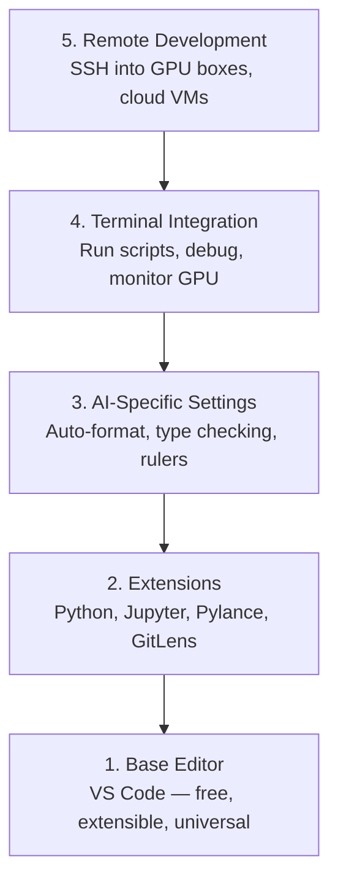

# संपादक सेटअप

> अपने संपादक अपने सह पायलट है. इसे एक बार कॉन्फ़िगर तो यह अपने रास्ते में रहने के लिए और अपने वजन खींचने शुरू होता है.

**Type:** Build
**Languages:** --
**Prerequisites:** Phase 0, Lesson 01
**Time:** ~20 minutes

## सीखने के लक्ष्य

- स्थापित करें VS आवश्यक विस्तारों के साथ कोड Python, ज्यूपिटर, लिंटिंग और रिमोट SSH
- स्वरूपण-बचत, प्रकार की जांच, और नोटबुक आउटपुट स्क्रॉल के लिए कॉन्फ़िगर करें AI कार्यप्रवाह
- रिमोट सेट करें SSH रिमोट पर कोड संपादित करने और डिबग करने के लिए GPU मशीनें जैसे वे स्थानीय हैं
- संपादक विकल्पों (क्रसर, विंडसर्फ, नीओविम) और उनके व्यापार के लिए मूल्यांकन AI काम

## समस्या

आप अपने संपादक के अंदर हजारों घंटे लिखते रहेंगे Python, नोटबुक चलाने, डिबगिंग प्रशिक्षण लूप, और SSH-ing में GPU एक गलत कॉन्फ़िगर किए गए संपादक हर सत्र को घर्षण में बदल देता हैः कोई ऑटो-कंपलीट नहीं, कोई टाइप सुझाव नहीं, कोई इनलाइन त्रुटियां नहीं, मैनुअल स्वरूपण, और एक clunky टर्मिनल वर्कफ़्लो।

सही सेटअप में 20 मिनट लगते हैं, इसे छोड़ने से आपको हर दिन 20 मिनट लगते हैं।

## अवधारणा

एक AI इंजीनियरिंग संपादक सेटअप के लिए पांच चीजों की जरूरत हैः



```figure
s0-lsp-roundtrip
```

## इसे बनाओ

### चरण 1: स्थापित करें VS कोड

VS कोड अनुशंसित संपादक है. यह निः शुल्क है, हर पर चलाया जाता है OS, पहली श्रेणी के Jupyter नोटबुक समर्थन है, और विस्तार पारिस्थितिकी तंत्र आप के लिए आवश्यक सब कुछ कवर करता है AI काम पर।

इसे डाउनलोड करें [code.visualstudio.com](https://code.visualstudio.com/).

टर्मिनल से सत्यापित करेंः

```bash
code --version
```

यदि `code` पर नहीं पाया गया है macOS, खुला VS कोड, प्रेस `Cmd+Shift+P`, "शेल कमांड" टाइप करें, और "इंस्टॉल कोड" कमांड में चुनें PATH".

### चरण 2: आवश्यक एक्सटेंशन स्थापित करें

एकीकृत टर्मिनल खोलें VS कोड (`` Ctrl+` `` प्रत्येक मंच पर) और उन विस्तारों को स्थापित करें जो महत्वपूर्ण हैं AI कार्यः

```bash
code --install-extension ms-python.python
code --install-extension ms-python.vscode-pylance
code --install-extension ms-toolsai.jupyter
code --install-extension eamodio.gitlens
code --install-extension ms-vscode-remote.remote-ssh
code --install-extension ms-python.debugpy
code --install-extension ms-python.black-formatter
code --install-extension charliermarsh.ruff
```

प्रत्येक व्यक्ति क्या करता हैः

| विस्तार | क्यों |
|-----------|-----|
| Python | भाषा समर्थन, वर्चुअल एनवी डिटेक्शन, रन/डिबग |
| पिलानस | त्वरित प्रकार की जांच, स्वतः पूर्णता, आयात संकल्प |
| ज्यूपिटर | अंदर नोटबुक चलाएँ VS कोड, चर खोजक |
| GitLens | देखो कौन क्या बदल गया, इनलाइन गिट दोष |
| रिमोट SSH | रिमोट पर फ़ोल्डर खोलें GPU बॉक्स जैसे स्थानीय हो |
| डिबग | चरण-दर-चरण डिबगिंग के लिए Python |
| ब्लैक फॉर्मेट | सहेजें पर स्वचालित स्वरूपण, लगातार शैली |
| रफ | तेजी से लपटना, आम गलतियों को पकड़ता है |

फ़ाइल `code/.vscode/extensions.json` इस पाठ में सिफारिशों की पूरी सूची है. जब आप परियोजना फ़ोल्डर खोलें, VS कोड उन्हें स्थापित करने के लिए आप के लिए प्रेरित करेगा.

### चरण 3: सेटिंग्स को कॉन्फ़िगर करें

सेटिंग्स से कॉपी करें `code/.vscode/settings.json` इस पाठ में, या उन्हें मैन्युअल रूप से लागू करने के लिए `Settings > Open Settings (JSON)`.

के लिए कुंजी सेटिंग्स AI कार्यः

```jsonc
{
    "python.analysis.typeCheckingMode": "basic",
    "editor.formatOnSave": true,
    "editor.rulers": [88, 120],
    "notebook.output.scrolling": true,
    "files.autoSave": "afterDelay"
}
```

ये क्यों मायने रखते हैंः

- **बुनियादी पर प्रकार की जांच**: आप चलाने से पहले गलत तर्क प्रकार पकड़ता है. टेन्सर आकार असंगतियों और गलत पर डिबगिंग समय बचाता है API पैरामीटर।
- **सहेजें पर प्रारूपित करें**कभी भी फिर से स्वरूपण के बारे में नहीं सोचें। काला इसे संभालता है।
- **88 और 120 पर शासक**: ब्लैक 88 पर लपेटता है। 120 मार्कर दिखाता है कि डॉक्यूमेंट्री स्ट्रिंग और कमेंट्स बहुत लंबे हो रहे हैं।
- **नोटबुक आउटपुट स्क्रॉल**: ट्रेनिंग लूप्स हजारों लाइनें प्रिंट करती हैं. बिना स्क्रॉल किए, आउटपुट पैनल विस्फोट होता है।
- **ऑटो-सेव**आप सहेजने के लिए भूल जाएगा. आपका प्रशिक्षण स्क्रिप्ट पुराने कोड चलाएगा. ऑटो सहेजने इससे बचाता है.

### चरण 4: टर्मिनल एकीकरण

VS कोड के एकीकृत टर्मिनल है जहां आप प्रशिक्षण स्क्रिप्ट चलाते हैं, मॉनिटर GPUs, और पर्यावरण का प्रबंधन करें।

इसे ठीक से सेट करेंः

```jsonc
{
    "terminal.integrated.defaultProfile.osx": "zsh",
    "terminal.integrated.defaultProfile.linux": "bash",
    "terminal.integrated.fontSize": 13,
    "terminal.integrated.scrollback": 10000
}
```

उपयोगी शॉर्टकटः

| कार्रवाई | macOS | Linux/Windows |
|--------|-------|---------------|
| टर्मिनल टूल | `` Ctrl+` `` | `` Ctrl+` `` |
| नया टर्मिनल | `` Ctrl+Shift+` `` | `` Ctrl+Shift+` `` |
| विभाजित टर्मिनल | `Cmd+\` | `Ctrl+Shift+5` |

स्प्लिट टर्मिनल उपयोगी हैंः एक आपकी स्क्रिप्ट चलाने के लिए, एक निगरानी के लिए GPU के साथ `nvidia-smi -l 1` या `watch -n 1 nvidia-smi`.

### चरण 5: दूरस्थ विकास (SSH में GPU बक्से)

यह सबसे महत्वपूर्ण विस्तार है AI आप दूरस्थ मशीनों (क्लाउड) पर प्रशिक्षण चलाएंगे। VMs, प्रयोगशाला सर्वर, लैम्ब्डा, वास्ट.एआई) दूरस्थ SSH आप रिमोट फ़ाइल सिस्टम खोलने, फ़ाइलों को संपादित, टर्मिनल चलाने, और डिबग जैसे सब कुछ स्थानीय था अनुमति देता है।

सेटअपः

1. रिमोट स्थापित करें SSH विस्तार (चरण 2 में किया गया)
2. प्रेस `Ctrl+Shift+P` (या `Cmd+Shift+P`), प्रकार "रिमोट-SSH: होस्ट से कनेक्ट करें".
3. प्रवेश करें `user@your-gpu-box-ip`.
4. VS कोड अपने सर्वर घटक को दूरस्थ मशीन पर स्वचालित रूप से स्थापित करता है।

पासवर्ड रहित पहुँच के लिए, सेटअप करें SSH कुंजीः

```bash
ssh-keygen -t ed25519 -C "your-email@example.com"
ssh-copy-id user@your-gpu-box-ip
```

मेजबान जोड़ें `~/.ssh/config` सुविधा के लिएः

```
Host gpu-box
    HostName 203.0.113.50
    User ubuntu
    IdentityFile ~/.ssh/id_ed25519
    ForwardAgent yes
```

अब `Remote-SSH: Connect to Host > gpu-box` तुरंत कनेक्ट करता है।

## विकल्प

### कर्सर

[cursor.com](https://cursor.com) एक है VS अंतर्निहित कोड फोर्क AI कोड उत्पादन. यह एक ही विस्तार पारिस्थितिकी तंत्र और सेटिंग्स प्रारूप का उपयोग करता है. यदि आप Cursor का उपयोग करते हैं, तो इस सब कुछ अभी भी इस पाठ में लागू होता है. एक ही आयात `settings.json` और `extensions.json`.

### विंडसर्फ

[windsurf.com](https://windsurf.com) एक और है AI-first VS कोड फोर्क. एक ही कहानीः एक ही एक्सटेंशन, एक ही सेटिंग्स प्रारूप, एक ही रिमोट SSH समर्थन।

### वीम/नियोवम

यदि आप पहले से ही Vim या Neovim का उपयोग कर रहे हैं और इसमें उत्पादक हैं, तो वहां रहें। AI Python कार्यः

- **पायरात** या **पिलस** प्रकार की जांच के लिए (मेसन या मैनुअल स्थापना के माध्यम से)
- **nvim-lspconfig** भाषा सर्वर एकीकरण के लिए
- **ज्यूपिटर-विम** या **पिघल-नव** नोटबुक की तरह निष्पादन के लिए
- **telescope.nvim** फ़ाइल/सिंबल खोज के लिए
- **कोई-एलएस.एनवीएम** स्वरूपण/लिनिंग के लिए काले और रफ के साथ

यदि आप पहले से ही Vim का उपयोग नहीं करते हैं, तो अभी शुरू न करें। सीखने की वक्र सीखने के साथ प्रतिस्पर्धा करेगी AI इंजीनियरिंग। उपयोग VS कोड.

## इसका प्रयोग करें

इस सेटअप के साथ, आपके दैनिक कार्यप्रवाह की तरह दिखता हैः

1. परियोजना फ़ोल्डर खोलें VS कोड (या रिमोट के माध्यम से कनेक्ट करें SSH एक GPU बक्सा) ।
2. लिखें Python संपादक में ऑटो-पूर्ण, टाइप सुझाव, और इनलाइन त्रुटियों के साथ।
3. Jupyter विस्तार के साथ लाइन में Jupyter नोटबुक चलाएं।
4. प्रशिक्षण स्क्रिप्ट के लिए एकीकृत टर्मिनल का उपयोग करें, `uv pip install`और GPU निगरानी।
5. परिवर्तनों की समीक्षा करें GitLens प्रतिबद्धता करने से पहले।

## व्यायाम

1. स्थापित करें VS चरण 2 में सूचीबद्ध कोड और सभी विस्तार
2. कॉपी `settings.json` इस पाठ से अपने VS कोड कॉन्फ़िग
3. एक खोलें Python फ़ाइल और सत्यापित करें कि Pylance सहेजने पर टाइप सुझाव और काले प्रारूप दिखाता है
4. यदि आपके पास रिमोट मशीन तक पहुंच है, तो रिमोट सेट करें SSH और उस पर एक फ़ोल्डर खोलें

## प्रमुख शर्तें

| अवधि | लोग क्या कहते हैं | इसका क्या मतलब है |
|------|----------------|----------------------|
| LSP | "स्वचालित इंजन" | भाषा सर्वर प्रोटोकॉलः भाषा-विशिष्ट सर्वर से प्रकार की जानकारी, पूर्णता और निदान प्राप्त करने के लिए संपादकों के लिए एक मानक |
| पिलानस | " Python प्लगइन" | माइक्रोसॉफ्ट Python टाइप जांच के लिए Pyright का उपयोग कर भाषा सर्वर और IntelliSense |
| रिमोट SSH | "सर्वर पर काम कर रहा है" | VS कोड विस्तार जो एक दूरस्थ मशीन पर एक हल्के सर्वर चलाता है और स्ट्रीम करता है UI अपने स्थानीय संपादक को |
| सहेजें पर प्रारूपित करें | "ऑटो-सुंदर" | संपादक एक स्वरूपक चलाता है (ब्लैक, Ruff) हर बार आप सहेजने, तो कोड शैली हमेशा सुसंगत है |
