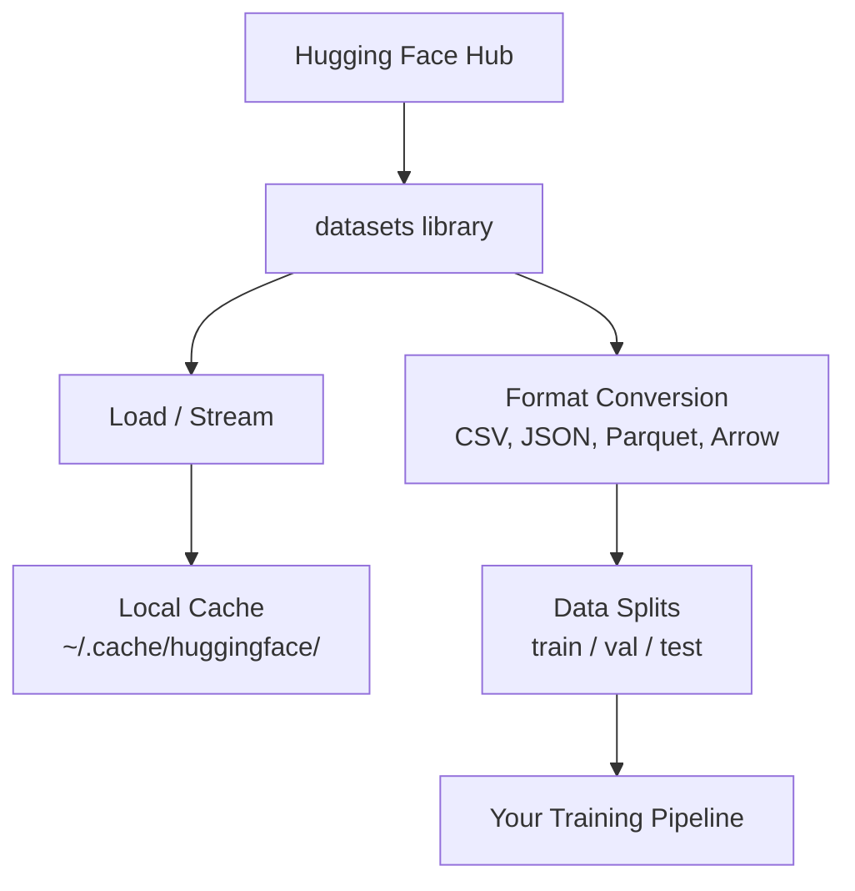

# डेटा प्रबंधन

> डेटा ही ईंधन है, आप इसे कैसे प्रबंधित करते हैं, यह निर्धारित करता है कि आप कितनी तेजी से चलते हैं।

**Type:** Build
**Language:** Python
**Prerequisites:** Phase 0, Lesson 01
**Time:** ~45 minutes

## सीखने के लक्ष्य

- गले लगाना चेहरा का उपयोग करके लोड, स्ट्रीम और कैश डेटा सेट `datasets` पुस्तकालय
- परिवर्तित करें CSV, JSON, पार्केट, और तीर प्रारूपों और उनके व्यापारिक समझाने
- फिक्स्ड रैंडम बीज के साथ पुनरावर्ती ट्रेन/वैलिडेशन/टेस्ट स्प्लिट बनाएं
- बड़े मॉडल और डेटासेट फ़ाइलों का प्रबंधन `.gitignore`, Git LFSया DVC

## समस्या

हर AI परियोजना डेटा के साथ शुरू होती है. आपको डेटा सेट ढूंढने, उन्हें डाउनलोड करने, उन्हें प्रारूपों के बीच परिवर्तित करने, उन्हें प्रशिक्षण और मूल्यांकन के लिए विभाजित करने और उन्हें संस्करण करने की आवश्यकता है ताकि प्रयोग पुनः उत्पन्न हो सकें। यह हर बार मैन्युअल रूप से करना धीमा और त्रुटि-संवेदनशील है। आपको एक दोहराए जाने योग्य कार्यप्रवाह की आवश्यकता है।

## अवधारणा



गले लगाते चेहरा `datasets` पुस्तकालय डेटा लोड करने के लिए मानक तरीका है AI यह डाउनलोड, कैशिंग, प्रारूप रूपांतरण, और बॉक्स से बाहर स्ट्रीमिंग को संभालता है।

```figure
s0-data-pipeline
```

## इसे बनाओ

### चरण 1: डेटासेट लाइब्रेरी स्थापित करें

```bash
pip install datasets huggingface_hub
```

### चरण 2: डेटा सेट लोड करें

```python
from datasets import load_dataset

dataset = load_dataset("stanfordnlp/imdb")
print(dataset)
print(dataset["train"][0])
```

यह डाउनलोड करता है IMDB फिल्म समीक्षा डेटासेट. पहली डाउनलोड के बाद, यह कैश से लोड करता है `~/.cache/huggingface/datasets/`.

### चरण 3: बड़े डेटासेट स्ट्रीम करें

कुछ डेटासेट डिस्क पर फिट होने के लिए बहुत बड़े होते हैं। स्ट्रीमिंग उन्हें पूरी चीज डाउनलोड किए बिना पंक्ति-पैक लोड करता है।

```python
dataset = load_dataset("wikimedia/wikipedia", "20220301.en", split="train", streaming=True)

for i, example in enumerate(dataset):
    print(example["title"])
    if i >= 4:
        break
```

स्ट्रीमिंग आपको एक `IterableDataset`. आप पंक्तियों को संसाधित करते हैं जैसे वे आते हैं. मेमोरी उपयोग डेटासेट के आकार के बावजूद निरंतर रहता है.

### चरण 4: डेटासेट प्रारूप

इन `datasets` आप अपनी पाइपलाइन की जरूरतों के आधार पर अन्य प्रारूपों में परिवर्तित कर सकते हैं।

```python
dataset = load_dataset("stanfordnlp/imdb", split="train")

dataset.to_csv("imdb_train.csv")
dataset.to_json("imdb_train.json")
dataset.to_parquet("imdb_train.parquet")
```

प्रारूप तुलनाः

| प्रारूप | आकार | गति पढ़ें | सबसे अच्छा के लिए |
|--------|------|-----------|----------|
| CSV | बड़ा | धीमी गति से | मानव पठनीयता, सांख्यिकीय पत्रक |
| JSON | बड़ा | धीमी गति से | APIs, घोंसले हुए डेटा |
| पार्केट | छोटा | जल्दी | विश्लेषण, स्तंभ प्रश्न |
| तीर | छोटा | सबसे तेज़ | स्मृति में प्रसंस्करण (क्या `datasets` आंतरिक उपयोग) |

के लिए AI काम पर, पार्केट सबसे अच्छा भंडारण प्रारूप है. तीर वह है कि आप स्मृति में काम करते हैं. CSV और JSON विनिमय के लिए हैं।

### चरण 5: डेटा विभाजन

हर ML परियोजना को तीन भागों की आवश्यकता हैः

- **ट्रेन**: मॉडल इससे सीखता है (आमतौर पर 80%)
- **वैधता**प्रशिक्षण के दौरान प्रगति की जांच करें (आमतौर पर 10%)
- **परीक्षण**: प्रशिक्षण पूरा होने के बाद अंतिम मूल्यांकन (आमतौर पर 10%)

कुछ डेटा सेट पूर्व-विभाजित होते हैं, जब वे नहीं करते हैं, उन्हें स्वयं विभाजित करेंः

```python
dataset = load_dataset("stanfordnlp/imdb", split="train")

split = dataset.train_test_split(test_size=0.2, seed=42)
train_val = split["train"].train_test_split(test_size=0.125, seed=42)

train_ds = train_val["train"]
val_ds = train_val["test"]
test_ds = split["test"]

print(f"Train: {len(train_ds)}, Val: {len(val_ds)}, Test: {len(test_ds)}")
```

हमेशा एक बीज को पुनः उत्पन्न करने के लिए सेट करें। एक ही बीज हर बार एक ही विभाजन पैदा करता है।

### चरण 6: डाउनलोड और कैश मॉडल

मॉडल बड़ी फ़ाइलें हैं। `huggingface_hub` पुस्तकालय डाउनलोड और कैशिंग संभालता है।

```python
from huggingface_hub import hf_hub_download, snapshot_download

model_path = hf_hub_download(
    repo_id="sentence-transformers/all-MiniLM-L6-v2",
    filename="config.json"
)
print(f"Cached at: {model_path}")

model_dir = snapshot_download("sentence-transformers/all-MiniLM-L6-v2")
print(f"Full model at: {model_dir}")
```

मॉडल कैश करने के लिए `~/.cache/huggingface/hub/`एक बार डाउनलोड किया जाता है, वे तुरंत बाद में रन पर लोड.

### चरण 7: बड़ी फ़ाइलों को संभालें

मॉडल वजन और बड़े डेटा सेट को git में नहीं जाना चाहिए। तीन विकल्पः

**विकल्प A: .gitignore (सबसे सरल)**

```
*.bin
*.safetensors
*.pt
*.onnx
data/*.parquet
data/*.csv
models/
```

**विकल्प बी: Git LFS (जीटी में बड़ी फ़ाइलों को ट्रैक)**

```bash
git lfs install
git lfs track "*.bin"
git lfs track "*.safetensors"
git add .gitattributes
```

Git LFS अपने रेपो में पॉइंटर और एक अलग सर्वर पर वास्तविक फ़ाइलों को स्टोर करता है। GitHub आपको 1 देता है GB मुक्त.

**विकल्प सी: DVC (डेटा संस्करण नियंत्रण)**

```bash
pip install dvc
dvc init
dvc add data/training_set.parquet
git add data/training_set.parquet.dvc data/.gitignore
git commit -m "Track training data with DVC"
```

DVC छोटे बनाता है `.dvc` आपके डेटा की ओर इशारा करने वाली फाइलें। S3, GCS, या किसी अन्य रिमोट स्टोरेज बैक-एंड.

| दृष्टिकोण | जटिलता | सबसे अच्छा के लिए |
|----------|-----------|----------|
| . गिटignore | कम | व्यक्तिगत परियोजनाएं, डाउनलोड किए गए डेटा आप फिर से प्राप्त कर सकते हैं |
| Git LFS | मध्यम | git के माध्यम से मॉडल वजन साझा करने वाली टीमें |
| DVC | उच्च | पुनः प्रयोज्य प्रयोग, बड़े डेटा सेट, टीम |

इस कोर्स के लिए, `.gitignore` पर्याप्त है। DVC जब आप मशीनों के बीच सटीक प्रयोगों को पुनः पेश करने की जरूरत है।

### चरण 8: भंडारण पैटर्न

**स्थानीय भंडारण** ~10 से कम डेटा सेट के लिए काम करता है GB. इन HF कैश स्वचालित रूप से इस को संभालता है।

**क्लाउड स्टोरेज** यह किसी भी बड़ी या मशीनों के बीच साझा की गई चीज़ के लिए हैः

```python
import os

local_path = os.path.expanduser("~/.cache/huggingface/datasets/")

# s3_path = "s3://my-bucket/datasets/"
# gcs_path = "gs://my-bucket/datasets/"
```

DVC के साथ एकीकृत S3 और GCS सीधेः

```bash
dvc remote add -d myremote s3://my-bucket/dvc-store
dvc push
```

इस कोर्स के लिए, स्थानीय भंडारण पर्याप्त है। जब आप दूरस्थ पर बारीक- GPU उदाहरण।

## इस कोर्स में इस्तेमाल किए गए डेटासेट

| डेटासेट | शिक्षा | आकार | क्या सिखाता है |
|---------|---------|------|----------------|
| IMDB | टोकनकरण, वर्गीकरण | 84 MB | पाठ वर्गीकरण की मूल बातें |
| WikiText | भाषा मॉडलिंग | 181 MB | अगले टोकन भविष्यवाणी |
| SQuAD | QA प्रणाली | 35 MB | प्रश्न उत्तर, अवधि |
| सामान्य क्रॉल (उपसमूह) | सम्मिलित | भिन्नताएँ | बड़े पैमाने पर पाठ प्रसंस्करण |
| MNIST | दृष्टि की मूल बातें | 21 MB | छवि वर्गीकरण मूल बातें |
| COCO (subset) | बहुआयामी | भिन्नताएँ | छवि-पाठ जोड़े |

हर पाठ में आपको क्या चाहिए, इसकी जानकारी दी जाती है।

## इसका प्रयोग करें

सब कुछ काम करता है की पुष्टि करने के लिए उपयोगिता स्क्रिप्ट चलाएंः

```bash
python code/data_utils.py
```

यह एक छोटा सा डेटा सेट डाउनलोड करता है, उसे परिवर्तित करता है, उसे विभाजित करता है, और सारांश प्रिंट करता है।

## इसे भेजें

इस पाठ से उत्पन्न होता हैः
- `code/data_utils.py` - पुनः प्रयोज्य डेटा लोड और कैशिंग उपयोगिता
- `outputs/prompt-data-helper.md` - किसी कार्य के लिए सही डेटा सेट खोजने के लिए शीघ्र

## व्यायाम

1. लोड करें `glue` डेटासेट के साथ `mrpc` पहले 5 उदाहरणों को कॉन्फ़िगर और निरीक्षण करें
2. स्ट्रीम `c4` डेटासेट और गणना करें कि आप 10 सेकंड में कितने उदाहरणों को संसाधित कर सकते हैं
3. एक डेटासेट को पार्केट में परिवर्तित करें और फ़ाइल आकार की तुलना CSV
4. एक निश्चित बीज के साथ 70/15/15 ट्रेन/वैल/टेस्ट स्प्लिट बनाएं और आकारों की जांच करें

## प्रमुख शर्तें

| अवधि | लोग क्या कहते हैं | इसका क्या मतलब है |
|------|----------------|----------------------|
| डेटासेट विभाजित | "शिक्षण डेटा" | एक नामित उपसमूह (ट्रेन/वॉल/टेस्ट) जो कि परीक्षण के विभिन्न चरणों में प्रयोग किया जाता है ML जीवन चक्र |
| स्ट्रीमिंग | "लज़ी से लोड करें" | पूर्ण डेटासेट डाउनलोड किए बिना दूरस्थ स्रोत से डेटा पंक्ति-पंक्ति प्रसंस्करण |
| पार्केट | "संपीड़ित CSV" | विश्लेषणात्मक क्वेरी और भंडारण दक्षता के लिए अनुकूलित स्तंभ फ़ाइल प्रारूप |
| तीर | "फास्ट डेटाफ्रेम" | शून्य प्रतिलिपि पढ़ने के लिए डेटासेट लाइब्रेरी द्वारा आंतरिक रूप से उपयोग किया जाने वाला स्मृति में स्तंभ प्रारूप |
| Git LFS | "Git बड़ी फाइलों के लिए" | एक एक्सटेंशन जो संस्करण नियंत्रण में पॉइंटर को बनाए रखते हुए git repo के बाहर बड़ी फ़ाइलों को संग्रहीत करता है |
| DVC | "Git डेटा के लिए" | डेटा सेट और मॉडल के लिए एक संस्करण नियंत्रण प्रणाली जो क्लाउड स्टोरेज के साथ एकीकृत होती है |
| कैश | "अभी डाउनलोड किया गया है" | पहले से प्राप्त किए गए डेटा की स्थानीय प्रति, डिफ़ॉल्ट रूप से ~/.cache/huggingface/ पर संग्रहीत |
