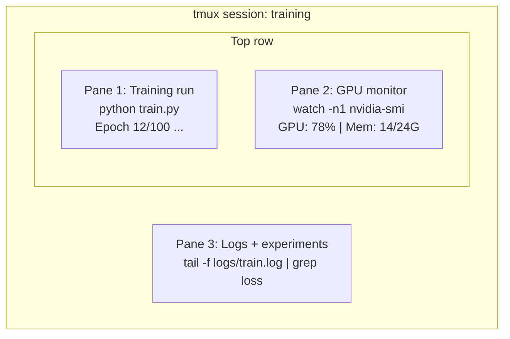

# टर्मिनल और शेल

> टर्मिनल है जहां AI इंजीनियरों को जीवित. यहाँ आरामदायक हो जाओ.

**Type:** Learn
**Languages:** --
**Prerequisites:** Phase 0, Lesson 01
**Time:** ~35 minutes

## सीखने के लक्ष्य

- पाइपिंग का उपयोग करें, रीडायरेक्ट करें, और `grep` कमांड लाइन से प्रशिक्षण लॉग को फ़िल्टर और संसाधित करने के लिए
- एक साथ प्रशिक्षण के लिए कई पैनलों के साथ निरंतर tmux सत्र बनाएं और GPU निगरानी
- निगरानी प्रणाली और GPU संसाधनों के साथ `htop`, `nvtop`और `nvidia-smi`
- स्थानीय और दूरस्थ मशीनों के बीच फ़ाइलों का स्थानांतरण SSH, `scp`और `rsync`

## समस्या

आप किसी भी संपादक की तुलना में अधिक समय टर्मिनल में खर्च करेंगे. GPU निगरानी, लॉग की पूर्ति, दूरस्थ SSH सत्र, पर्यावरण प्रबंधन। AI काम के प्रवाह को खोल से छूता है. अगर आप धीमी यहाँ, आप हर जगह धीमी हैं.

यह सबक उन अंतिम कौशल को कवर करता है जो महत्वपूर्ण हैं AI काम नहीं है, यूनिक्स का कोई इतिहास नहीं है, कोई गहरी गोता नहीं है Bash स्क्रिप्टिंग में. बस आप क्या जरूरत है.

## अवधारणा



तीन चीजें एक साथ चल रही हैं एक टर्मिनल. आप अलग हो सकते हैं, घर जाना, SSH वापस अंदर, और फिर से संलग्न. प्रशिक्षण चल रहा है.

```figure
s0-shell-pipeline
```

## इसे बनाओ

### चरण 1: अपनी शैल को जानें

जांचें कि आप किस गोले को चला रहे हैं:

```bash
echo $SHELL
```

अधिकांश प्रणाली उपयोग `bash` या `zsh`दोनों ठीक काम करते हैं. इस पाठ्यक्रम में आदेश दोनों में काम करते हैं.

जाननी चाहिए कि क्या है

```bash
# Move around
cd ~/projects/ai-engineering-from-scratch
pwd
ls -la

# History search (most useful shortcut you'll learn)
# Ctrl+R then type part of a previous command
# Press Ctrl+R again to cycle through matches

# Clear terminal
clear   # or Ctrl+L

# Cancel a running command
# Ctrl+C

# Suspend a running command (resume with fg)
# Ctrl+Z
```

### चरण 2: पाइपिंग और रीडायरेक्ट

पाइपिंग कमांड को एक साथ जोड़ती है. इस तरह आप लॉग, फिल्टर आउटपुट और श्रृंखला उपकरण को संसाधित करते हैं। आप इसे लगातार उपयोग करेंगे।

```bash
# Count how many times "loss" appears in a log
cat train.log | grep "loss" | wc -l

# Extract just the loss values from training output
grep "loss:" train.log | awk '{print $NF}' > losses.txt

# Watch a log file update in real time, filtering for errors
tail -f train.log | grep --line-buffered "ERROR"

# Sort experiments by final accuracy
grep "final_accuracy" results/*.log | sort -t= -k2 -n -r

# Redirect stdout and stderr to separate files
python train.py > output.log 2> errors.log

# Redirect both to the same file
python train.py > train_full.log 2>&1
```

तीन पुनर्निर्देशन आप की जरूरत हैः

| प्रतीक | यह क्या करता है |
|--------|-------------|
| `>` | फ़ाइल में stdout लिखें (ओवरराइट) |
| `>>` | फ़ाइल में stdout जोड़ें |
| `2>` | फ़ाइल में stderr लिखें |
| `2>&1` | स्टड्रू को उसी स्थान पर भेजें जहां स्टड्रू |
| `\|` | एक कमांड से स्टड आउट को अगले कमांड में भेजें |

### चरण 3: पृष्ठभूमि प्रक्रियाएं

प्रशिक्षण में घंटों लगते हैं, आप अपना टर्मिनल हर समय खुला नहीं रखना चाहते।

```bash
# Run in background (output still goes to terminal)
python train.py &

# Run in background, immune to hangup (closing terminal won't kill it)
nohup python train.py > train.log 2>&1 &

# Check what's running in background
jobs
ps aux | grep train.py

# Bring a background job to foreground
fg %1

# Kill a background process
kill %1
# or find its PID and kill that
kill $(pgrep -f "train.py")
```

अंतर `&`, `nohup`और `screen`/`tmux`:

| विधि | टर्मिनल के पास जीवित है? | क्या आप इसे फिर से जोड़ सकते हैं? |
|--------|-------------------------|---------------|
| `command &` | नहीं | नहीं |
| `nohup command &` | हाँ | नहीं (लॉग फ़ाइल की जांच करें) |
| `screen` / `tmux` | हाँ | हाँ |

कुछ मिनट से अधिक समय के लिए, Tmux का प्रयोग करें।

### चरण 4: tmux

tmux आप कई पैनलों के साथ निरंतर टर्मिनल सत्र बनाने के लिए अनुमति देता है. यह प्रशिक्षण रन के प्रबंधन के लिए सबसे उपयोगी उपकरण है.

```bash
# Install
# macOS
brew install tmux
# Ubuntu
sudo apt install tmux

# Start a named session
tmux new -s training

# Split horizontally
# Ctrl+B then "

# Split vertically
# Ctrl+B then %

# Navigate between panes
# Ctrl+B then arrow keys

# Detach (session keeps running)
# Ctrl+B then d

# Reattach
tmux attach -t training

# List sessions
tmux ls

# Kill a session
tmux kill-session -t training
```

एक विशिष्ट AI कार्यप्रवाह सत्रः

```bash
tmux new -s train

# Pane 1: start training
python train.py --epochs 100 --lr 1e-4

# Ctrl+B, " to split, then run GPU monitor
watch -n1 nvidia-smi

# Ctrl+B, % to split vertically, tail the logs
tail -f logs/experiment.log

# Now detach with Ctrl+B, d
# SSH out, go get coffee, come back
# tmux attach -t train
```

### चरण 5: htop और nvtop के साथ निगरानी

```bash
# System processes (better than top)
htop

# GPU processes (if you have NVIDIA GPU)
# Install: sudo apt install nvtop (Ubuntu) or brew install nvtop (macOS)
nvtop

# Quick GPU check without nvtop
nvidia-smi

# Watch GPU usage update every second
watch -n1 nvidia-smi

# See which processes are using the GPU
nvidia-smi --query-compute-apps=pid,name,used_memory --format=csv
```

`htop` कुंजी बंधन आप उपयोग करेंगेः
- `F6` या `>` स्तंभ द्वारा क्रमबद्ध करने के लिए (मेमोरी लीक खोजने के लिए स्मृति द्वारा क्रमबद्ध)
- `F5` पेड़ दृश्य को स्विच करने के लिए (देखें बच्चे प्रक्रियाएं)
- `F9` किसी प्रक्रिया को मारने के लिए
- `/` प्रक्रिया नाम की खोज करने के लिए

### चरण 6: SSH दूरस्थ के लिए GPU बक्से

जब तुम एक बादल किराए पर लेते हो GPU (लम्ब्डा, RunPod, Vast.ai), आप के माध्यम से कनेक्ट SSH.

```bash
# Basic connection
ssh user@gpu-box-ip

# With a specific key
ssh -i ~/.ssh/my_gpu_key user@gpu-box-ip

# Copy files to remote
scp model.pt user@gpu-box-ip:~/models/

# Copy files from remote
scp user@gpu-box-ip:~/results/metrics.json ./

# Sync a whole directory (faster for many files)
rsync -avz ./data/ user@gpu-box-ip:~/data/

# Port forward (access remote Jupyter/TensorBoard locally)
ssh -L 8888:localhost:8888 user@gpu-box-ip
# Now open localhost:8888 in your browser

# SSH config for convenience
# Add to ~/.ssh/config:
# Host gpu
#     HostName 192.168.1.100
#     User ubuntu
#     IdentityFile ~/.ssh/gpu_key
#
# Then just:
# ssh gpu
```

### चरण 7: उपयोगी उपनाम AI काम

अपने `~/.bashrc` या `~/.zshrc`:

```bash
source phases/00-setup-and-tooling/10-terminal-and-shell/code/shell_aliases.sh
```

या आप चाहते हैं कि जो कॉपी.

```bash
# GPU status at a glance
alias gpu='nvidia-smi --query-gpu=index,name,utilization.gpu,memory.used,memory.total,temperature.gpu --format=csv,noheader'

# Kill all Python training processes
alias killtraining='pkill -f "python.*train"'

# Quick virtual environment activate
alias ae='source .venv/bin/activate'

# Watch training loss
alias watchloss='tail -f logs/*.log | grep --line-buffered "loss"'
```

देखिये `code/shell_aliases.sh` पूरी सेट के लिए.

### चरण 8: आम AI टर्मिनल पैटर्न

ये व्यवहार में बार-बार सामने आते हैंः

```bash
# Run training, log everything, notify when done
python train.py 2>&1 | tee train.log; echo "DONE" | mail -s "Training complete" you@email.com

# Compare two experiment logs side by side
diff <(grep "accuracy" exp1.log) <(grep "accuracy" exp2.log)

# Find the largest model files (clean up disk space)
find . -name "*.pt" -o -name "*.safetensors" | xargs du -h | sort -rh | head -20

# Download a model from Hugging Face
wget https://huggingface.co/model/resolve/main/model.safetensors

# Untar a dataset
tar xzf dataset.tar.gz -C ./data/

# Count lines in all Python files (see how big your project is)
find . -name "*.py" | xargs wc -l | tail -1

# Check disk space (training data fills disks fast)
df -h
du -sh ./data/*

# Environment variable check before training
env | grep -i cuda
env | grep -i torch
```

## इसका प्रयोग करें

यहाँ है जब प्रत्येक उपकरण इस पाठ्यक्रम के दौरान खेल में आता हैः

| उपकरण | जब आप इसका उपयोग करते हैं |
|------|----------------|
| म्यूजिक | Every training run (Phases 3+) |
| `tail -f` + `grep` | प्रशिक्षण लॉग की निगरानी |
| `nohup` / `&` | त्वरित पृष्ठभूमि कार्य |
| `htop` / `nvtop` | धीमी प्रशिक्षण डिबगिंग, OOM त्रुटियाँ |
| SSH + `rsync` | बादल पर काम करना GPUs |
| Piping + redirects | प्रसंस्करण प्रयोग के परिणाम |
| उपनाम | दोहराए जाने वाले आदेशों पर समय की बचत |

## व्यायाम

1. tmux स्थापित करें, तीन पैनलों के साथ एक सत्र बनाएं, और चलाएं `htop` एक में, `watch -n1 date` एक और में, और एक Python तीसरे में स्क्रिप्ट.
2. उपनाम जोड़ें `code/shell_aliases.sh` अपने खोल कॉन्फ़िगर करने और लोड `source ~/.zshrc` (या `~/.bashrc`).
3. एक नकली प्रशिक्षण लॉग बनाने के साथ `for i in $(seq 1 100); do echo "epoch $i loss: $(echo "scale=4; 1/$i" | bc)"; sleep 0.1; done > fake_train.log` और फिर उपयोग करें `grep`, `tail`और `awk` केवल हानि मानों को निकालने के लिए।
4. एक स्थापित करें SSH किसी सर्वर के लिए कॉन्फ़िग प्रविष्टि जिसे आप एक्सेस (या उपयोग) करते हैं `localhost` संश्लेषण का अभ्यास करने के लिए) ।

## प्रमुख शर्तें

| अवधि | लोग क्या कहते हैं | इसका क्या मतलब है |
|------|----------------|----------------------|
| शेल | "टर्मिनल" | प्रोग्राम जो आपकी कमांडों (बश, zsh, मछली) की व्याख्या करता है |
| म्यूजिक | "टर्मिनल मल्टीप्लेक्सर" | एक कार्यक्रम जो आपको एक विंडो के भीतर कई टर्मिनल सत्र चलाने और अलग करने/पुनः संलग्न करने की अनुमति देता है |
| पाइप | "बार की बात" | इन `\|` ऑपरेटर जो एक कमांड के आउटपुट को दूसरे कमांड को इनपुट के रूप में भेजता है |
| PID | "प्रक्रिया ID" | प्रत्येक चलती प्रक्रिया को सौंपा गया एक अद्वितीय संख्या, जिसका उपयोग इसे निगरानी या मारने के लिए किया जाता है |
| नहीं है | "हंगअप नहीं" | एक आदेश है कि हैंगअप संकेत के प्रति प्रतिरोधी चलाता है, इसलिए टर्मिनल बंद करने से यह मार नहीं जाएगा |
| SSH | "सर्वर से कनेक्ट करना" | सुरक्षित शेल, रिमोट मशीन पर कमांड चलाने के लिए एक एन्क्रिप्टेड प्रोटोकॉल |
