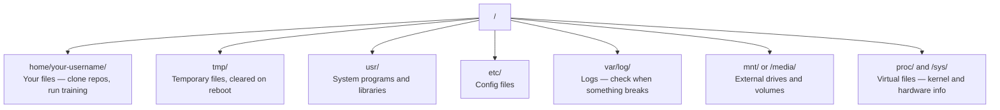

# Linux के लिए AI

> अधिकांश AI चलती है Linuxआपको फंसने से बचने के लिए पर्याप्त जानने की जरूरत है।

**Type:** Learn
**Languages:** --
**Prerequisites:** Phase 0, Lesson 01
**Time:** ~30 minutes

## सीखने के लक्ष्य

- नेविगेट करें Linux फ़ाइल प्रणाली और कमांड लाइन से आवश्यक फ़ाइल संचालन करते हैं
- फ़ाइल अनुमतियों का प्रबंधन `chmod` और `chown` "अनुमति अस्वीकृत" त्रुटियों को हल करने के लिए
- सिस्टम पैकेज स्थापित करें `apt` और एक नया GPU के लिए बॉक्स AI काम
- पहचानें macOS-to-Linux दूरस्थ मशीनों पर काम करने वाले डेवलपर्स को आमतौर पर परेशान करने वाले मतभेद

## समस्या

आप विकसित करने के लिए macOS या Windowsलेकिन जब आप SSH बादल में GPU बॉक्स, एक Lambda उदाहरण किराए पर, या एक स्पिन अप EC2 मशीन, आप उबंटू में उतरते हैं टर्मिनल आपका एकमात्र इंटरफ़ेस है. कोई खोजक नहीं है, कोई एक्सप्लोरर नहीं है, कोई GUI. यदि आप फ़ाइल प्रणाली नेविगेट नहीं कर सकते हैं, पैकेज स्थापित करें, और कमांड लाइन से प्रक्रियाओं का प्रबंधन, आप निष्क्रिय के लिए भुगतान करने के लिए फंस गए हैं GPU घंटे गुगल में "एक फ़ाइल में कैसे अनज़िप करने के लिए Linux."

यह एक जीवित रहने का गाइड है. यह ठीक से कवर करता है कि आप एक दूरस्थ पर काम करने की जरूरत है Linux मशीन के लिए AI काम पर. और कुछ नहीं.

## फ़ाइल सिस्टम लेआउट

Linux एक ही जड़ के नीचे सब कुछ व्यवस्थित करता है `/`. . कोई नहीं है `C:\` या `/Volumes`. . . निर्देशिकाओं आप वास्तव में स्पर्श करेंगेः



आपका घर निर्देशिका है `~` या `/home/your-username`लगभग सब कुछ आप यहाँ होता है.

## आवश्यक आज्ञाएँ

ये 15 कमांड हैं जो कि 95% को कवर करते हैं जो आप एक रिमोट पर करेंगे GPU बॉक्स।

### घूमना

```bash
pwd                         # Where am I?
ls                          # What's here?
ls -la                      # What's here, including hidden files with details?
cd /path/to/dir             # Go there
cd ~                        # Go home
cd ..                       # Go up one level
```

### फ़ाइलें और निर्देशिकाएँ

```bash
mkdir my-project            # Create a directory
mkdir -p a/b/c              # Create nested directories in one shot

cp file.txt backup.txt      # Copy a file
cp -r src/ src-backup/      # Copy a directory (recursive)

mv old.txt new.txt          # Rename a file
mv file.txt /tmp/           # Move a file

rm file.txt                 # Delete a file (no trash, it's gone)
rm -rf my-dir/              # Delete a directory and everything inside
```

`rm -rf` प्रवेश करने से पहले पथ की दो बार जांच करें।

### फ़ाइलें पढ़ना

```bash
cat file.txt                # Print entire file
head -20 file.txt           # First 20 lines
tail -20 file.txt           # Last 20 lines
tail -f log.txt             # Follow a log file in real time (Ctrl+C to stop)
less file.txt               # Scroll through a file (q to quit)
```

### खोज

```bash
grep "error" training.log           # Find lines containing "error"
grep -r "learning_rate" .           # Search all files in current directory
grep -i "cuda" config.yaml          # Case-insensitive search

find . -name "*.py"                 # Find all Python files under current dir
find . -name "*.ckpt" -size +1G     # Find checkpoint files larger than 1GB
```

## अनुमति

में हर फ़ाइल Linux आप इस पर चला जाएगा जब स्क्रिप्ट निष्पादित नहीं होगा या आप एक निर्देशिका में लिखने के लिए नहीं कर सकते.

```bash
ls -l train.py
# -rwxr-xr-- 1 user group 2048 Mar 19 10:00 train.py
#  ^^^             owner permissions: read, write, execute
#     ^^^          group permissions: read, execute
#        ^^        everyone else: read only
```

सामान्य सुधार:

```bash
chmod +x train.sh           # Make a script executable
chmod 755 deploy.sh         # Owner: full, others: read+execute
chmod 644 config.yaml       # Owner: read+write, others: read only

chown user:group file.txt   # Change who owns a file (needs sudo)
```

जब कुछ कहता है "अनुमति अस्वीकार कर दी गई है", यह लगभग हमेशा एक अनुमतियों का मुद्दा है। `chmod +x` या `sudo` ज्यादातर मामलों को ठीक करेगा।

## पैकेज प्रबंधन (अनुकूलित)

उबंटू का उपयोग `apt`यह है कि कैसे आप सिस्टम स्तर पर सॉफ्टवेयर स्थापित करते हैं.

```bash
sudo apt update             # Refresh the package list (always do this first)
sudo apt install -y htop    # Install a package (-y skips confirmation)
sudo apt install -y build-essential  # C compiler, make, etc. Needed by many Python packages
sudo apt install -y tmux    # Terminal multiplexer (keep sessions alive after disconnect)

apt list --installed        # What's installed?
sudo apt remove htop        # Uninstall
```

आप एक नए पर स्थापित करने के लिए आम पैकेज GPU बक्साः

```bash
sudo apt update && sudo apt install -y \
    build-essential \
    git \
    curl \
    wget \
    tmux \
    htop \
    unzip \
    python3-venv
```

## उपयोगकर्ता और sudo

आप आमतौर पर एक नियमित उपयोगकर्ता के रूप में लॉग इन कर रहे हैं. कुछ संचालन रूट (प्रशासक) पहुंच की आवश्यकता है.

```bash
whoami                      # What user am I?
sudo command                # Run a single command as root
sudo su                     # Become root (exit to go back, use sparingly)
```

बादल पर GPU उदाहरण के लिए, आप आमतौर पर एकमात्र उपयोगकर्ता हैं और पहले से ही sudo पहुँच है. सब कुछ रूट के रूप में नहीं चलाना. केवल जरूरत पड़ने पर sudo का उपयोग करें.

## प्रक्रियाएँ और प्रणाली

जब आपका प्रशिक्षण लटका हुआ है, या आप जांच करने की जरूरत है कि क्या चल रहा हैः

```bash
htop                        # Interactive process viewer (q to quit)
ps aux | grep python        # Find running Python processes
kill 12345                  # Gracefully stop process with PID 12345
kill -9 12345               # Force kill (use when graceful doesn't work)
nvidia-smi                  # GPU processes and memory usage
```

systemd सेवाओं (बैकग्राउंड डेमोन) का प्रबंधन करता है. आप इसका उपयोग करेंगे यदि आप inference सर्वर चलाते हैंः

```bash
sudo systemctl start nginx          # Start a service
sudo systemctl stop nginx           # Stop it
sudo systemctl restart nginx        # Restart it
sudo systemctl status nginx         # Check if it's running
sudo systemctl enable nginx         # Start automatically on boot
```

## डिस्क स्थान

GPU बॉक्स में अक्सर डिस्क स्थान सीमित होता है। मॉडल और डेटा सेट इसे तेजी से भरते हैं।

```bash
df -h                       # Disk usage for all mounted drives
df -h /home                 # Disk usage for /home specifically

du -sh *                    # Size of each item in current directory
du -sh ~/.cache             # Size of your cache (pip, huggingface models land here)
du -sh /data/checkpoints/   # Check how big your checkpoints are

# Find the biggest space hogs
du -h --max-depth=1 / 2>/dev/null | sort -hr | head -20
```

सामान्य अंतरिक्ष बचतकर्ताः

```bash
# Clear pip cache
pip cache purge

# Clear apt cache
sudo apt clean

# Remove old checkpoints you don't need
rm -rf checkpoints/epoch_01/ checkpoints/epoch_02/
```

## नेटवर्किंग

आप मॉडल डाउनलोड, फ़ाइलें स्थानांतरित, और टैप APIs कमांड लाइन से।

```bash
# Download files
wget https://example.com/model.bin                   # Download a file
curl -O https://example.com/data.tar.gz              # Same thing with curl
curl -s https://api.example.com/health | python3 -m json.tool  # Hit an API, pretty-print JSON

# Transfer files between machines
scp model.bin user@remote:/data/                     # Copy file to remote machine
scp user@remote:/data/results.csv .                  # Copy file from remote to local
scp -r user@remote:/data/checkpoints/ ./local-dir/   # Copy directory

# Sync directories (faster than scp for large transfers, resumes on failure)
rsync -avz --progress ./data/ user@remote:/data/
rsync -avz --progress user@remote:/results/ ./results/
```

उपयोग `rsync` समाप्त `scp` यह केवल स्थानांतरण बदल गया बाइट्स और संभालता है टूट कनेक्शन.

## सत्रों को जीवित रखें

जब आप SSH एक रिमोट बॉक्स में, अपने लैपटॉप बंद करने के लिए अपने प्रशिक्षण रन को मारता है।

```bash
tmux new -s train           # Start a new session named "train"
# ... start your training, then:
# Ctrl+B, then D            # Detach (training keeps running)

tmux ls                     # List sessions
tmux attach -t train        # Reattach to session

# Inside tmux:
# Ctrl+B, then %            # Split pane vertically
# Ctrl+B, then "            # Split pane horizontally
# Ctrl+B, then arrow keys   # Switch between panes
```

हमेशा Tmux के अंदर लंबे प्रशिक्षण काम करते हैं.

## WSL2 के लिए Windows उपयोगकर्ता

अगर आप पर हैं Windows, WSL2 आपको एक असली देता है Linux दोहरी बूटिंग के बिना पर्यावरण।

```bash
# In PowerShell (admin)
wsl --install -d Ubuntu-24.04

# After restart, open Ubuntu from Start menu
sudo apt update && sudo apt upgrade -y
```

WSL2 एक असली चलाता है Linux इस सबक में सब कुछ अंदर काम करता है. Windows फ़ाइलें पर हैं `/mnt/c/Users/YourName/` अंदर से WSL.

GPU के साथ काम करता है NVIDIA ड्राइवरों पर स्थापित Windows पक्ष. स्थापना Windows NVIDIA चालक (नहीं Linux एक) और CUDA अंदर उपलब्ध होगा WSL2.

## गॉचस: macOS करने के लिए Linux

चीजें जो आपको ठोकर खाएगी अगर आप से आ रहे हैं macOS:

| macOS | Linux | नोट्स |
|-------|-------|-------|
| `brew install` | `sudo apt install` | कभी-कभी अलग-अलग पैकेज नाम। `brew install htop` vs `sudo apt install htop` काम करता है, लेकिन `brew install readline` vs `sudo apt install libreadline-dev` नहीं है। |
| `open file.txt` | `xdg-open file.txt` | लेकिन आप एक नहीं होगा GUI एक रिमोट बॉक्स पर। `cat` या `less`. |
| `pbcopy` / `pbpaste` | उपलब्ध नहीं | क्लिपबोर्ड से पाइप नहीं है SSH. |
| `~/.zshrc` | `~/.bashrc` | macOS zsh के लिए डिफ़ॉल्ट। अधिकांश Linux सर्वर बैश का उपयोग करते हैं। |
| `/opt/homebrew/` | `/usr/bin/`, `/usr/local/bin/` | द्विआधारी विभिन्न स्थानों पर रहते हैं। |
| `sed -i '' 's/a/b/' file` | `sed -i 's/a/b/' file` | macOS sed के बाद एक खाली स्ट्रिंग की जरूरत है `-i`. Linux नहीं है। |
| केस-असंवेदनशील फाइल सिस्टम | केस सेन्सिटिव फाइल सिस्टम | `Model.py` और `model.py` पर दो अलग-अलग फाइलें हैं Linux. |
| रेखा अंत `\n` | रेखा अंत `\n` | वही है, लेकिन Windows उपयोग `\r\n`, जो बैश स्क्रिप्ट तोड़ता है. `dos2unix` ठीक करने के लिए. |

## त्वरित संदर्भ कार्ड

```
Navigation:     pwd, ls, cd, find
Files:          cp, mv, rm, mkdir, cat, head, tail, less
Search:         grep, find
Permissions:    chmod, chown, sudo
Packages:       apt update, apt install
Processes:      htop, ps, kill, nvidia-smi
Services:       systemctl start/stop/restart/status
Disk:           df -h, du -sh
Network:        curl, wget, scp, rsync
Sessions:       tmux new/attach/detach
```

```figure
s0-process-fork
```

## व्यायाम

1. SSH किसी भी Linux मशीन (या खुली) WSL2एक परियोजना फ़ोल्डर बनाएं, इसके अंदर तीन खाली फ़ाइलें बनाएँ `touch`, फिर उन्हें सूचीबद्ध करें `ls -la`.
2. स्थापित करें `htop` apt के साथ, इसे चलाएं, और पहचानें कि कौन सी प्रक्रिया सबसे अधिक स्मृति का उपयोग कर रही है।
3. एक Tmux सत्र शुरू, चल `sleep 300` अंदर, अलग, सूची सत्र, और फिर से संलग्न.
4. उपयोग `df -h` उपलब्ध डिस्क स्थान की जांच करने के लिए, फिर उपयोग करें `du -sh ~/.cache/*` अपने कैश में जगह ले रहा है क्या खोजने के लिए.
5. अपने स्थानीय मशीन से एक फ़ाइल को दूरस्थ एक पर स्थानांतरित करें `scp`, फिर उसी स्थानांतरण के साथ `rsync` और अनुभव की तुलना करें।
