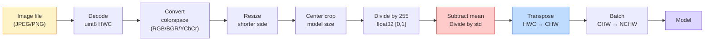
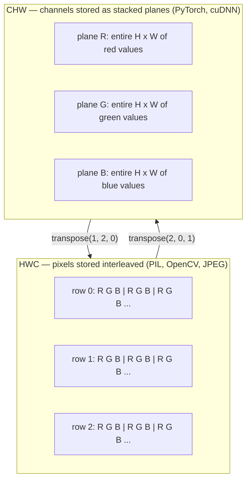

# छवि मूल बातें  पिक्सेल, चैनल, रंग स्थान

> एक छवि प्रकाश के नमूने का एक tensor है. हर दृष्टि मॉडल आप कभी भी उपयोग करेंगे इस एक तथ्य से शुरू होता है.

**Type:** Build
**Languages:** Python
**Prerequisites:** Phase 1 Lesson 12 (Tensor Operations), Phase 3 Lesson 11 (Intro to PyTorch)
**Time:** ~45 minutes

## सीखने के लक्ष्य

- यह समझाएं कि एक निरंतर दृश्य कैसे पिक्सेल में विवश हो जाता है और नमूना/क्वांटिकेशन निर्णय प्रत्येक डाउनस्ट्रीम मॉडल पर सीमा क्यों निर्धारित करते हैं
- चित्रों को पढ़ें, स्लाइस करें और जांचें NumPy सरणी और धाराप्रवाह स्विच के बीच HWC और CHW लेआउट
- परिवर्तित करें RGB, ग्रे स्केल, HSVऔर YCbCr और हर रंग स्थान क्यों मौजूद है की पुष्टि
- पिक्सेल स्तर पर पूर्व प्रसंस्करण (सामान्य, मानकीकृत, आकार बदलना, चैनल-पहला) को ठीक उसी तरह लागू करें जैसा कि पूर्व प्रशिक्षित किया गया है PyTorch दृष्टि मॉडल इसकी उम्मीद करते हैं

## समस्या

हर कागज आप पढ़ेंगे, हर पूर्व-प्रशिक्षित वजन आप डाउनलोड करेंगे, हर दृष्टि API आप कॉल करेगा इनपुट के एक विशिष्ट एन्कोडिंग मानता है. पास एक `uint8` छवि जहां मॉडल चाहता है `float32` और यह अभी भी चलेंगे और चुपचाप कचरा पैदा करेंगे। BGR एक नेटवर्क पर प्रशिक्षित RGB और सटीकता दस अंक गिर जाता है. एक मॉडल चैनल - अंतिम इनपुट जब यह चैनल की उम्मीद करता है - पहले और पहली conv परत ऊंचाई को एक सुविधा चैनल के रूप में व्यवहार करता है. यह सब एक त्रुटि नहीं डालता है. यह सिर्फ अपने मीट्रिक को बर्बाद करता है और आप एक सप्ताह की खोज में बिताते हैं एक बग है कि आप फ़ाइल लोड करने के तरीके में रहता है.

एक घुमाव जटिल नहीं है एक बार जब आप जानते हैं कि यह क्या पर स्लाइड कर रहा है। कठिन भाग यह है कि "एक छवि" एक कैमरा के लिए अलग चीजें मतलब है, एक JPEG डिसीडर, PIL, OpenCV, मशाल दृष्टि, और एक CUDA प्रत्येक स्टैक के अपने अक्ष क्रम, बाइट रेंज, और चैनल सम्मेलन है. एक दृष्टि इंजीनियर जो इन सीधे जहाजों टूट पाइपलाइन नहीं रख सकते हैं.

इस सबक की नींव तय है ताकि बाकी चरण उस पर निर्माण कर सकते हैं. अंत तक आप जानते होंगे कि पिक्सेल क्या है, क्यों एक पिक्सेल के बजाय तीन संख्याएं हैं, क्या "सामान्यकरण के साथ ImageNet आंकड़े" वास्तव में करता है, और कैसे दो या तीन लेआउट के बीच स्थानांतरित करने के लिए कि इस चरण में हर अन्य पाठ पर विचार करेगा.

## अवधारणा

### एक नज़र में पूरी प्रीप्रोसेसिंग पाइपलाइन

प्रत्येक उत्पादन दृष्टि प्रणाली एक ही क्रम में परिवर्तनीय परिवर्तन है. एक कदम गलत हो जाता है और मॉडल यह प्रशिक्षित किया गया था की तुलना में एक अलग इनपुट देखता है.



लाल और नीले दो बक्से 80% मौन विफलताओं के लिए रहते हैंः मानककरण की कमी और गलत लेआउट।

### एक पिक्सेल एक नमूना है, एक वर्ग नहीं

कैमरा सेंसर छोटे डिटेक्टरों के ग्रिड पर उतरने वाले फोटॉन की गिनती करता है। प्रत्येक डिटेक्टर सेकंड के एक अंश के लिए प्रकाश को एकीकृत करता है और उस पर कितने फोटॉन के साथ अनुपात में एक वोल्टेज उत्सर्जित करता है। सेंसर फिर उस वोल्टेज को एक पूर्णांक में विघटित करता है। एक डिटेक्टर एक पिक्सेल बन जाता है।

```
Continuous scene                 Sensor grid                     Digital image
(infinite detail)                (H x W detectors)               (H x W integers)

    ~~~~~                        +--+--+--+--+--+                 210 198 180 155 120
   ~   ~   ~                     |  |  |  |  |  |                 205 195 178 152 118
  ~ light ~      ---->           +--+--+--+--+--+     ---->       200 190 175 150 115
   ~~~~~                         |  |  |  |  |  |                 195 185 170 148 112
                                 +--+--+--+--+--+                 188 180 165 145 108
```

इस चरण में दो विकल्प होते हैं और वे नीचे की ओर सब कुछ पर छत तयः

- **स्थानिक नमूनाकरण** यह तय करता है कि दृश्य के डिग्री के प्रति कितने डिटेक्टर हैं। बहुत कम, और किनारे जगे हुए हो जाते हैं (अलिज़िंग) । बहुत अधिक, और भंडारण और गणना विस्फोट।
- **तीव्रता क्वांटिज़ेशन** यह तय करता है कि वोल्टेज को कितनी बारीकी से बुकेट किया जाता है। 8 बिट्स 256 स्तर देता है और प्रदर्शन के लिए मानक है। 10, 12, 16 बिट्स चिकनी ग्रेडिएंट और चिकित्सा इमेजिंग के लिए सामग्री देते हैं, HDR, और कच्चे सेंसर पाइपलाइनों.

पिक्सेल एक रंगीन वर्ग नहीं है जिसमें क्षेत्रफल है. यह एक मात्र माप है. जब आप आकार बदलते हैं या घूमते हैं, तो आप उस माप ग्रिड को फिर से नमूना दे रहे हैं।

### तीन चैनल क्यों

एक डिटेक्टर पूरे दृश्यमान स्पेक्ट्रम पर फोटॉन गिनता है जो ग्रे स्केल है। रंग प्राप्त करने के लिए, सेंसर लाल, हरे और नीले फिल्टर के एक मोज़ेक के साथ ग्रिड को कवर करता है। डेमोसाइक करने के बाद, प्रत्येक स्थानिक स्थान में तीन पूर्णांक हैंः लाल-फिल्टर्ड डिटेक्टर की प्रतिक्रिया, हरे-फिल्टर्ड और नीले-फिल्टर्ड पास में। ये तीन पूर्णांक एक पिक्सेल की संख्या हैं। RGB तीन टुकड़े।

```
One pixel in memory:

    (R, G, B) = (210, 140, 30)   <- reddish-orange

An H x W RGB image:

    shape (H, W, 3)     stored as   H rows of W pixels of 3 values
                                    each in [0, 255] for uint8
```

तीन जादू नहीं है। गहराई कैमरे एक Z चैनल जोड़ते हैं। उपग्रह इन्फ्रारेड और पराबैंगनी बैंड जोड़ते हैं। चिकित्सा स्कैन अक्सर एक चैनल (एक्स-रे, CT) या कई (हाइपरस्पेक्ट्रल) । चैनल की संख्या अंतिम अक्ष है; कंव परतें इसके पार मिश्रण करना सीखती हैं।

### दो लेआउट सम्मेलनः HWC और CHW

एक ही tensor, दो क्रम. हर पुस्तकालय एक चुनता है.

```
HWC (height, width, channels)           CHW (channels, height, width)

   W ->                                    H ->
  +-----+-----+-----+                     +-----+-----+
H |R G B|R G B|R G B|                   C |R R R R R R|
| +-----+-----+-----+                   | +-----+-----+
v |R G B|R G B|R G B|                   v |G G G G G G|
  +-----+-----+-----+                     +-----+-----+
                                          |B B B B B B|
                                          +-----+-----+

   PIL, OpenCV, matplotlib,              PyTorch, most deep learning
   almost every image file on disk       frameworks, cuDNN kernels
```

CHW क्योंकि convolution kernels H और W के पार स्लाइड करते हैं। चैनल अक्ष को पहले रखने का मतलब है कि प्रत्येक kernel प्रत्येक चैनल पर एक आसन्न 2D विमान देखता है, जो साफ वेक्टरलाइज़ करता है। डिस्क प्रारूपों को बनाए रखने के लिए HWC क्योंकि यह एक सेंसर से स्कैन लाइनों के बाहर कैसे मिलता है.

एक पंक्ति रूपांतरण आप एक हजार बार टाइप करेंगेः

```
img_chw = img_hwc.transpose(2, 0, 1)      # NumPy
img_chw = img_hwc.permute(2, 0, 1)        # PyTorch tensor
```

स्मृति लेआउट, दृश्यमानः



### बाइट रेंज और dtype

तीन महामहिमों में प्रमुखता हैः

| सम्मेलन | प्रकार | सीमा | जहां आप इसे देखते हैं |
|------------|-------|-------|------------------|
| कच्चे | `uint8` | [0, 255] | डिस्क पर फ़ाइलें, PIL, OpenCV आउटपुट |
| सामान्यीकृत | `float32` | [0.0, 1.0] | बाद में `img.astype('float32') / 255` |
| मानक | `float32` | लगभग [-2, +2] | औसत घटाकर और std से विभाजित करने के बाद |

कन्भ्यूशनल नेटवर्क को मानक इनपुट पर प्रशिक्षित किया गया था। ImageNet आंकड़े `mean=[0.485, 0.456, 0.406]`, `std=[0.229, 0.224, 0.225]` तीनों चैनलों का पूर्ण पर अंकगणितीय औसत और मानक विचलन है ImageNet प्रशिक्षण सेट, [0, 1] सामान्य पिक्सल पर गणना की गई। कच्चे भोजन `uint8` एक मॉडल में जो मानक तैरने की उम्मीद करता है, लागू दृष्टि में सबसे आम मौन विफलता है।

### रंग स्थान और वे क्यों मौजूद हैं

RGB यह कैप्चर प्रारूप है लेकिन यह हमेशा मॉडल के लिए सबसे उपयोगी प्रतिनिधित्व नहीं होता है।

```
 RGB               HSV                       YCbCr / YUV

 R red             H hue (angle 0-360)       Y luminance (brightness)
 G green           S saturation (0-1)        Cb chroma blue-yellow
 B blue            V value/brightness (0-1)  Cr chroma red-green

 Linear to         Separates color from      Separates brightness from
 sensor output     brightness. Useful for    color. JPEG and most video
                   color thresholding, UI    codecs compress the chroma
                   sliders, simple filters   channels harder because the
                                             human eye is less sensitive
                                             to chroma detail than to Y.
```

अधिकांश आधुनिक के लिए CNNs तुम खिलाओ RGB. आप अन्य स्थानों से मिलते हैं जबः

- **HSV** शास्त्रीय CV कोड, रंग आधारित विभाजन, सफेद संतुलन।
- **YCbCr** पढ़ना JPEG आंतरिक, वीडियो पाइपलाइन, सुपर-रिज़ॉल्यूशन मॉडल जो केवल Y पर काम करते हैं।
- **ग्रे स्केल** — OCR, दस्तावेज मॉडल, किसी भी मामले में जहां रंग संकेत की बजाय परेशानी चर है।

ग्रेस्केल से RGB एक वजन राशि है, औसत नहीं, क्योंकि मानव आंख लाल या नीले रंग की तुलना में हरे रंग की अधिक संवेदनशील हैः

```
Y = 0.299 R + 0.587 G + 0.114 B       (ITU-R BT.601, the classic weights)
```

### पहलू अनुपात, आकार परिवर्तन और अंतराल

प्रत्येक मॉडल में एक निश्चित इनपुट आकार है (224x224 अधिकांश के लिए) ImageNet आपके चित्र शायद ही कभी मेल खाते हैं. तीन आकार विकल्प जो मायने रखते हैंः

- **छोटी तरफ का आकार बदला जाए, फिर केंद्र की फसल काटें** मानक ImageNet नुस्खा. पहलू अनुपात को बनाए रखता है, किनारे पिक्सेल की एक पट्टी फेंक देता है.
- **आकार बदलना और पैड करना** पहलू अनुपात और प्रत्येक पिक्सेल को संरक्षित करता है, काले बार जोड़ता है। OCR.
- **लक्ष्य पर सीधे आकार बदलें** छवि को बढ़ाता है। सस्ता, ज्यामिति को विकृत करता है, कई वर्गीकरण कार्यों के लिए ठीक है।

इंटरपोलेशन विधि तय करती है कि मध्यवर्ती पिक्सल कैसे गणना की जाती है जब नया ग्रिड पुराने ग्रिड के साथ संरेखित नहीं होता हैः

```
Nearest neighbour     fastest, blocky, only choice for masks/labels
Bilinear              fast, smooth, default for most image resizing
Bicubic               slower, sharper on upscaling
Lanczos               slowest, best quality, used for final display
```

अंगूठे का नियमः प्रशिक्षण के लिए द्विआधारी, आप देखेंगे संपत्ति के लिए द्विआधारी या लैंचोस, सबसे निकटतम के लिए कुछ भी जिसमें पूर्णांक वर्ग शामिल है IDs.

```figure
conv-output-size
```

## इसे बनाओ

### चरण 1: एक छवि टेन्सर बनाएं और इसकी आकार की जांच करें

एक निर्धारात्मक सिंथेटिक छवि के साथ शुरू करें ताकि पहली प्रयोगशाला केवल NumPy. फ़ाइल डिकोडिंग एक अलग सीमा हैः एक बार एक JPEG या PNG डिकोडर रिटर्न RGB बाइट्स, नीचे प्रत्येक tensor ऑपरेशन एक ही है.

```python
import numpy as np

def synthetic_rgb(h=128, w=192, seed=0):
    rng = np.random.default_rng(seed)
    yy, xx = np.meshgrid(np.linspace(0, 1, h), np.linspace(0, 1, w), indexing="ij")
    r = (np.sin(xx * 6) * 0.5 + 0.5) * 255
    g = yy * 255
    b = (1 - yy) * xx * 255
    rgb = np.stack([r, g, b], axis=-1) + rng.normal(0, 6, (h, w, 3))
    return np.clip(rgb, 0, 255).astype(np.uint8)

arr = synthetic_rgb()

print(f"type:   {type(arr).__name__}")
print(f"dtype:  {arr.dtype}")
print(f"shape:  {arr.shape}     # (H, W, C)")
print(f"min:    {arr.min()}")
print(f"max:    {arr.max()}")
print(f"pixel at (0, 0): {arr[0, 0]}")
```

अपेक्षित उत्पादनः `shape: (H, W, 3)`, `dtype: uint8`, सीमा `[0, 255]`. यह कैनोनिक डिकोड प्रतिनिधित्व है चाहे बाइट्स कैमरा से आए, एक छवि डिकोडर, या इस सिंथेटिक जनरेटर से.

### चरण 2: विभाजन चैनल और पुनर्गठन लेआउट

अलग से R, G, B निकालें, फिर परिवर्तित करें HWC करने के लिए CHW के लिए PyTorch.

```python
R = arr[:, :, 0]
G = arr[:, :, 1]
B = arr[:, :, 2]
print(f"R shape: {R.shape}, mean: {R.mean():.1f}")
print(f"G shape: {G.shape}, mean: {G.mean():.1f}")
print(f"B shape: {B.shape}, mean: {B.mean():.1f}")

arr_chw = arr.transpose(2, 0, 1)
print(f"\nHWC shape: {arr.shape}")
print(f"CHW shape: {arr_chw.shape}")
```

तीन ग्रे स्केल विमान, एक प्रति चैनल. CHW केवल अक्षों को फिर से क्रमबद्ध करता है; जब मेमोरी लेआउट इसे अनुमति देता है तो डेटा कॉपी सख्ती से आवश्यक नहीं है।

### चरण 3: ग्रेस्केल और HSV रूपांतरण

वजन-समा ग्रे स्केल, फिर एक मैनुअल RGB-to-HSV.

```python
def rgb_to_grayscale(rgb):
    weights = np.array([0.299, 0.587, 0.114], dtype=np.float32)
    return (rgb.astype(np.float32) @ weights).astype(np.uint8)

def rgb_to_hsv(rgb):
    rgb_f = rgb.astype(np.float32) / 255.0
    r, g, b = rgb_f[..., 0], rgb_f[..., 1], rgb_f[..., 2]
    cmax = np.max(rgb_f, axis=-1)
    cmin = np.min(rgb_f, axis=-1)
    delta = cmax - cmin

    h = np.zeros_like(cmax)
    mask = delta > 0
    argmax = np.argmax(rgb_f, axis=-1)
    rmax = mask & (argmax == 0)
    gmax = mask & (argmax == 1)
    bmax = mask & (argmax == 2)
    h[rmax] = ((g[rmax] - b[rmax]) / delta[rmax]) % 6
    h[gmax] = ((b[gmax] - r[gmax]) / delta[gmax]) + 2
    h[bmax] = ((r[bmax] - g[bmax]) / delta[bmax]) + 4
    h = h * 60.0

    s = np.divide(delta, cmax, out=np.zeros_like(delta), where=cmax > 0)
    v = cmax
    return np.stack([h, s, v], axis=-1)

gray = rgb_to_grayscale(arr)
hsv = rgb_to_hsv(arr)
print(f"gray shape: {gray.shape}, range: [{gray.min()}, {gray.max()}]")
print(f"hsv   shape: {hsv.shape}")
print(f"hue range: [{hsv[..., 0].min():.1f}, {hsv[..., 0].max():.1f}] degrees")
print(f"sat range: [{hsv[..., 1].min():.2f}, {hsv[..., 1].max():.2f}]")
print(f"val range: [{hsv[..., 2].min():.2f}, {hsv[..., 2].max():.2f}]")
```

Hue [0, 1] में डिग्री, संतृप्ति और मूल्य में आता है। OpenCV `hsv_full` सम्मेलन।

### चरण 4: इसे सामान्य बनाएं, मानक बनाएं और इसे उलट दें

कच्चे बाइट से सटीक tensor एक पूर्व प्रशिक्षित पर जाएं ImageNet मॉडल उम्मीद करता है, तो वापस.

```python
mean = np.array([0.485, 0.456, 0.406], dtype=np.float32)
std = np.array([0.229, 0.224, 0.225], dtype=np.float32)

def preprocess_imagenet(rgb_uint8):
    x = rgb_uint8.astype(np.float32) / 255.0
    x = (x - mean) / std
    x = x.transpose(2, 0, 1)
    return x

def deprocess_imagenet(chw_float32):
    x = chw_float32.transpose(1, 2, 0)
    x = x * std + mean
    x = np.clip(x * 255.0, 0, 255).astype(np.uint8)
    return x

x = preprocess_imagenet(arr)
print(f"preprocessed shape: {x.shape}     # (C, H, W)")
print(f"preprocessed dtype: {x.dtype}")
print(f"preprocessed mean per channel:  {x.mean(axis=(1, 2)).round(3)}")
print(f"preprocessed std  per channel:  {x.std(axis=(1, 2)).round(3)}")

roundtrip = deprocess_imagenet(x)
max_diff = np.abs(roundtrip.astype(int) - arr.astype(int)).max()
print(f"roundtrip max pixel diff: {max_diff}    # should be 0 or 1")
```

प्रति चैनल औसत शून्य के करीब होना चाहिए, std एक के करीब। पूर्व-प्रक्रिया/अप्रक्रिया जोड़ी ठीक वही है जो प्रत्येक टॉर्चvision `transforms.Normalize` कॉल हुड के नीचे कर रहा है।

### चरण 5: खरोंच से आकार बदलें

निकटतम पड़ोसी गोल प्रत्येक आउटपुट निर्देशांक एक स्रोत पिक्सेल के लिए। द्विआधारी अंतराल चार आसपास के पिक्सेल को ढूंढता है और उन्हें दूरी से मिलाता है। नीचे दोनों कार्यान्वयन अंत बिंदु-समझाने वाले निर्देशांक का उपयोग करते हैं ताकि पहला और अंतिम स्रोत पिक्सेल तय रहें।

```python
def resize_coordinates(source_length, target_length):
    if target_length == 1:
        return np.zeros(1, dtype=np.float32)
    return np.linspace(0, source_length - 1, target_length, dtype=np.float32)

def nearest_resize(image, target_height, target_width):
    y = np.rint(resize_coordinates(image.shape[0], target_height)).astype(int)
    x = np.rint(resize_coordinates(image.shape[1], target_width)).astype(int)
    return image[y[:, None], x[None, :]]

def bilinear_resize(image, target_height, target_width):
    y = resize_coordinates(image.shape[0], target_height)
    x = resize_coordinates(image.shape[1], target_width)
    y0 = np.floor(y).astype(int)
    x0 = np.floor(x).astype(int)
    y1 = np.minimum(y0 + 1, image.shape[0] - 1)
    x1 = np.minimum(x0 + 1, image.shape[1] - 1)
    wy = (y - y0)[:, None, None]
    wx = (x - x0)[None, :, None]

    source = image.astype(np.float32)
    top = source[y0[:, None], x0[None, :]] * (1 - wx)
    top += source[y0[:, None], x1[None, :]] * wx
    bottom = source[y1[:, None], x0[None, :]] * (1 - wx)
    bottom += source[y1[:, None], x1[None, :]] * wx
    result = top * (1 - wy) + bottom * wy
    return np.clip(np.rint(result), 0, 255).astype(image.dtype)

target_height = arr.shape[0] * 3
target_width = arr.shape[1] * 3
nearest = nearest_resize(arr, target_height, target_width)
bilinear = bilinear_resize(arr, target_height, target_width)

def local_roughness(x):
    gy = np.diff(x.astype(float), axis=0)
    gx = np.diff(x.astype(float), axis=1)
    return float(np.abs(gy).mean() + np.abs(gx).mean())

for name, out in [("nearest", nearest), ("bilinear", bilinear)]:
    print(f"{name:>8}  shape={out.shape}  roughness={local_roughness(out):6.2f}")
```

निकटतम कठोरता पर उच्चतम स्कोर करता है क्योंकि यह कठिन किनारों को बनाए रखता है। द्विआधारी अधिक चिकनी है क्योंकि प्रत्येक नए पिक्सेल प्रत्येक अक्ष पर दो स्थितियों को मिलाता है। चलाने योग्य साथी एक कैटमुल-रोम घन नाभिक के साथ प्रत्येक अक्ष में चार पड़ोसी पर एक ही अलग करने योग्य विचार को बढ़ाता है, फिर एक छवि पुस्तकालय के बिना तीन परिणाम प्रिंट करता है।

## इसका प्रयोग करें

PyTorch बैच, डिवाइस-जागरूक टेंसर पर एक ही संचालन करता है। नीचे दिए गए कोड छोटे पक्ष का आकार बदलता है, एक केंद्र फसल लेता है, प्रत्येक चैनल को मानकीकृत करता है, और NCHW एक पूर्व प्रशिक्षित मॉडल अपेक्षाओं के लिए tensor.

```python
import torch
import torch.nn.functional as F

image_hwc = torch.from_numpy(synthetic_rgb(256, 320))
batch = image_hwc.permute(2, 0, 1).unsqueeze(0).float() / 255.0

height, width = batch.shape[-2:]
scale = 256 / min(height, width)
resized_height = round(height * scale)
resized_width = round(width * scale)
batch = F.interpolate(
    batch,
    size=(resized_height, resized_width),
    mode="bilinear",
    align_corners=False,
    antialias=True,
)

top = (resized_height - 224) // 2
left = (resized_width - 224) // 2
batch = batch[:, :, top:top + 224, left:left + 224]

mean = torch.tensor([0.485, 0.456, 0.406]).view(1, 3, 1, 1)
std = torch.tensor([0.229, 0.224, 0.225]).view(1, 3, 1, 1)
batch = (batch - mean) / std

print(f"tensor dtype: {batch.dtype}")
print(f"batched shape: {tuple(batch.shape)}")
print(f"per-channel mean: {batch.mean(dim=(0, 2, 3)).tolist()}")
print(f"per-channel std:  {batch.std(dim=(0, 2, 3)).tolist()}")
```

चार चरणों में, इस सटीक क्रम मेंः बाइट्स को तैरने और स्वैप में परिवर्तित करें HWC करने के लिए NCHW, छोटे पक्ष को आकार 256 करने के लिए, एक 224x224 केंद्र फसल ले, और फिर घटाने ImageNet उस क्रम को उलट कर मौन रूप से मॉडल तक पहुँचने वाला परिवर्तन होता है।

## इसे भेजें

इस पाठ से उत्पन्न होता हैः

- `outputs/prompt-vision-preprocessing-audit.md` एक संकेत जो किसी भी मॉडल कार्ड या डेटासेट कार्ड को सटीक पूर्व-प्रसंस्करण अपरिवर्तकों की एक चेकलिस्ट में बदल देता है जिसे एक टीम को मानना चाहिए।
- `outputs/skill-image-tensor-inspector.md` एक कौशल जो किसी भी छवि-आकार के टेंसर या सरणी को देखते हुए dtype, लेआउट, रेंज, और यह कच्चा, सामान्य या मानकीकृत दिखता है या नहीं, रिपोर्ट करता है।

## व्यायाम

1. **(Easy)** एक 2x2 बनाएँ RGB `uint8` चार अलग अलग रंगों के साथ सरणी. परिवर्तित HWC करने के लिए CHW और वापस, दोनों आकारों को प्रिंट, और साबित करने के लिए यात्रा वापस हर मूल्य को संरक्षित करता है।
2. **(Medium)** लिखें `standardize(img, mean, std)` और इसके विपरीत जो एक साथ गुजरते हैं `roundtrip_max_diff <= 1` किसी भी पर परीक्षण uint8 आपकी फ़ंक्शन्स को एक ही छवि पर काम करना चाहिए HWC और एक बैच में NCHW एक ही कॉल के साथ.
3. **(Hard)** एक 3-चैनल ले लो ImageNet-standardized tensor और इसे एक 1x1 conv के माध्यम से चलाएं जो एक वजन मिश्रण सीखता है RGB ग्रे पैमाने पर एक एकल चैनल में। `[0.299, 0.587, 0.114]`, उन्हें फ्रीज, और जाँच आउटपुट अपने मैनुअल से मेल खाता है `rgb_to_grayscale` क्या अन्य क्लासिक रंग-स्थान परिवर्तन 1x1 घुमाव के रूप में लिखा जा सकता है?

## प्रमुख शर्तें

| अवधि | लोग क्या कहते हैं | इसका क्या मतलब है |
|------|----------------|----------------------|
| पिक्सेल | "एक रंगीन वर्ग" | एक ग्रिड स्थान पर प्रकाश तीव्रता का एक नमूना  रंग के लिए तीन अंक, ग्रे स्केल के लिए एक |
| चैनल | "रंग" | एक समानांतर स्थानिक ग्रिड में से एक छवि टेंसर में ढेर; अंतिम अक्ष में HWC, में पहले CHW |
| HWC / CHW | "आकार" | एक छवि टेन्सर के लिए अक्ष क्रम; डिस्क और PIL उपयोग HWC, PyTorch और cuDNN उपयोग CHW |
| सामान्यीकरण | "छवि को स्केल करें" | 255 से विभाजित करें ताकि पिक्सल [0, 1] में रहते हैं  आवश्यक लेकिन पर्याप्त नहीं |
| मानकीकरण | "शून्य केंद्र" | औसत घटाएं और प्रति चैनल std से विभाजित करें ताकि इनपुट वितरण मॉडल पर प्रशिक्षित किया गया है |
| ग्रे स्केल रूपांतरण | "केनेलों का औसत" | एक संकेतक के साथ एक भारित राशि 0.299/0.587/0.114 जो मानव प्रकाश की धारणा से मेल खाती है |
| अंतराल | "पिक्सल का आकार कैसे बदलें" | नियम जो आउटपुट मानों का निर्णय करता है जब नई ग्रिड पुरानी के साथ संरेखित नहीं होती है  लेबल के लिए निकटतम, प्रशिक्षण के लिए द्विआधारी, प्रदर्शन के लिए द्विआधारी |
| पहलू अनुपात | "उच्चता से चौड़ाई" | "आकार और पैड" और "आकार और खिंचाव" में अंतर करने वाला अनुपात |

## आगे पढ़ना

- [चार्ल्स पॉइंटन  रंगों की अंतरिक्ष यात्रा](https://poynton.ca/PDFs/Guided_tour.pdf) रंगों की इतनी जगहें क्यों हैं और उनमें से प्रत्येक का महत्व कब है, इसका सबसे स्पष्ट तकनीकी उपचार
- [PyTorch दृष्टि दस्तावेजों को बदल देती है](https://pytorch.org/vision/stable/transforms.html) आप वास्तव में उत्पादन में बनाने के लिए परिवर्तन के पूरे पाइपलाइन
- [कैसे JPEG कार्य (कोल्ट) McAnlis)](https://www.youtube.com/watch?v=F1kYBnY6mwg) क्रोमा उप-सैंपलिंग का तेज दृश्य दौरा, DCT, और क्यों JPEG कोड YCbCr बजाय RGB
- [ImageNet पूर्व प्रसंस्करण सम्मेलन (टोरच विजन मॉडल)](https://pytorch.org/vision/stable/models.html) सत्य का स्रोत `mean=[0.485, 0.456, 0.406]` और क्यों हर मॉडल चिड़ियाघर में यह उम्मीद है
