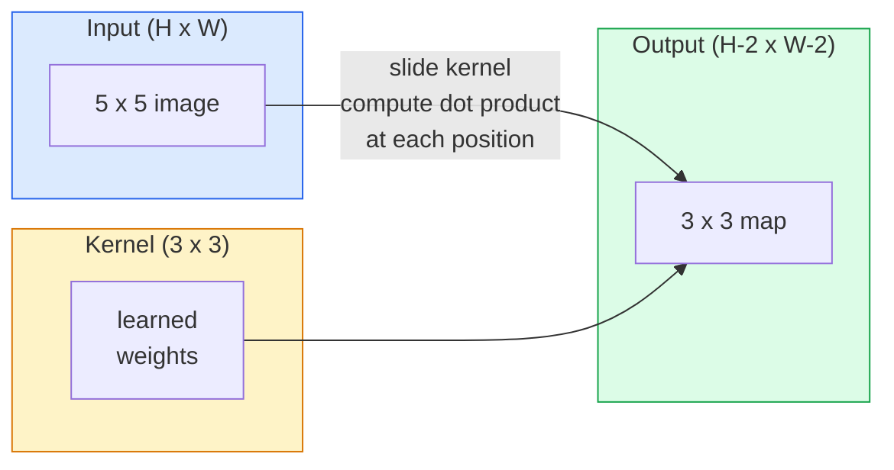
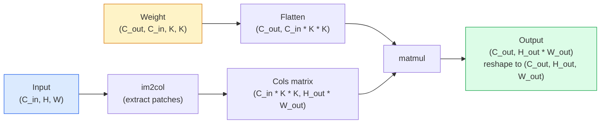

# खरोंच से घुमाव

> एक घुमाव एक छोटी घनी परत है जिसे आप एक छवि पर स्लाइड करते हैं, प्रत्येक स्थान पर एक ही वजन साझा करते हैं।

**Type:** Build
**Languages:** Python
**Prerequisites:** Phase 3 (Deep Learning Core), Phase 4 Lesson 01 (Image Fundamentals)
**Time:** ~75 minutes

## सीखने के लक्ष्य

- केवल उपयोग कर खरोंच से 2D घुमाव लागू करें NumPy, जिसमें नेस्टेड-लुप संस्करण और वेक्टरिज़ेड संस्करण शामिल है `im2col` संस्करण
- इनपुट आकार, कर्नेल आकार, पैडिंग और स्टेड के किसी भी संयोजन के लिए आउटपुट स्थानिक आकार की गणना करें, और इस पर तर्क दें `(H - K + 2P) / S + 1` सूत्र
- हाथ से डिजाइन किए गए कर्नेल (एज, ब्लर, शार्प, सोबेल) और समझाएं कि प्रत्येक सक्रियण पैटर्न क्यों उत्पन्न करता है
- स्टैक को एक फीचर एक्सट्रैक्टर में घुमाएं और स्टैक की गहराई को रिसेप्टिव फील्ड के आकार से जोड़ें

## समस्या

224x224 पर पूरी तरह से जुड़े एक परत RGB प्रति न्यूरॉन प्रति छवि 224 * 224 * 3 = 150,528 इनपुट वजन की आवश्यकता होगी। 1,000 इकाइयों के साथ एक छिपी हुई परत पहले से ही 150 मिलियन पैरामीटर है  इससे पहले कि आप कुछ भी उपयोगी सीख लिया है। इससे भी बदतर, उस परत में यह धारणा नहीं है कि ऊपर बाएं और नीचे दाएं कुत्ते एक ही पैटर्न हैं। यह प्रत्येक पिक्सेल स्थिति को स्वतंत्र मानता है, जो छवियों के लिए बिल्कुल गलत हैः एक बिल्ली को तीन पिक्सेल से अनुवाद करने से नेटवर्क को अवधारणा को फिर से सीखने के लिए मजबूर नहीं होना चाहिए।

एक छवि मॉडल की जरूरत है दो गुण हैं **अनुवाद समरूपता** (आउटपुट परिवर्तन होता है जब इनपुट परिवर्तन होता है) और **पैरामीटर साझा करना** घने परतों आपको कोई भी नहीं देता है. घुमाव आपको दोनों मुफ्त में देता है.

यह एक ही ऑपरेशन है जो शक्ति प्रदान करता है JPEG संपीड़न, फोटोशॉप में गौशियन धुंधलापन, औद्योगिक दृष्टि में किनारे का पता लगाने, और हर ऑडियो फिल्टर कभी भी शिप किया गया है. कारण CNNs वर्चस्व ImageNet 2012 से 2020 तक यह है कि संभलता डेटा के लिए सही पूर्ववर्ती है जहां निकटतम मान संबंधित हैं और एक ही पैटर्न कहीं भी दिखाई दे सकता है।

## अवधारणा

### एक नाभिक, स्लाइडिंग

2D संभलने में एक छोटा वजन मैट्रिक्स होता है जिसे कर्नेल (या फ़िल्टर) कहा जाता है, इसे इनपुट पर स्लाइड करता है, और प्रत्येक स्थान पर तत्व-बुद्धिमान उत्पादों का योग गणना करता है। यह योग एक आउटपुट पिक्सेल बन जाता है।



5x5 इनपुट पर एक ठोस 3x3 उदाहरण (कोई पैडिंग नहीं, चरण 1):

```
Input X (5 x 5):                Kernel W (3 x 3):

  1  2  0  1  2                   1  0 -1
  0  1  3  1  0                   2  0 -2
  2  1  0  2  1                   1  0 -1
  1  0  2  1  3
  2  1  1  0  1

The kernel slides across every valid 3 x 3 window. Output Y is 3 x 3:

 Y[0,0] = sum( W * X[0:3, 0:3] )
 Y[0,1] = sum( W * X[0:3, 1:4] )
 Y[0,2] = sum( W * X[0:3, 2:5] )
 Y[1,0] = sum( W * X[1:4, 0:3] )
 ... and so on
```

यह एक सूत्र **साझा वजन, स्थान, स्लाइडिंग विंडो** यह पूरी बात है. बाकी सब कुछ लेखांकन है.

### आउटपुट आकार सूत्र

इनपुट स्थानिक आकार को देखते हुए `H`, कर्नेल आकार `K`, पैडिंग `P`, कदम `S`:

```
H_out = floor( (H - K + 2P) / S ) + 1
```

याद रखें, आप इसे वास्तुकला के अनुसार दर्जनों बार गणना करेंगे।

| परिदृश्य | H | K | P | S | बाहर |
|----------|---|---|---|---|-------|
| वैध कंव, बिना पैडिंग | 32 | 3 | 0 | 1 | 30 |
| समान कंघी (आकार को बनाए रखता है) | 32 | 3 | 1 | 1 | 32 |
| 2 द्वारा डाउनसैम्पल | 32 | 3 | 1 | 2 | 16 |
| पूल 2x2 | 32 | 2 | 0 | 2 | 16 |
| बड़ा रिसेप्टिव फील्ड | 32 | 7 | 3 | 2 | 16 |

"एक ही पैडिंग" का अर्थ है P चुनें ताकि H_out == H जब S == 1. क्यार्य के लिए, यह P = (K - 1) / 2 है। यही कारण है कि 3x3 कर्नेल  पर प्रभुत्व रखते हैं। वे सबसे छोटे क्यार्य कर्नेल हैं जिनके पास अभी भी एक केंद्र है।

### पद्दा

बिना पैडिंग के, प्रत्येक घुमाव सुविधा मानचित्र को छोटा करता है। उनमें से 20 को ढेर करें और आपकी 224x224 छवि 184x184 हो जाती है, जो सीमा पर गणना को बर्बाद करती है और शेष कनेक्शन को जटिल करती है जिन्हें मिलान के आकार की आवश्यकता होती है।

```
Zero padding (P = 1) on a 5 x 5 input:

  0  0  0  0  0  0  0
  0  1  2  0  1  2  0
  0  0  1  3  1  0  0
  0  2  1  0  2  1  0       Now the kernel can centre on pixel
  0  1  0  2  1  3  0       (0, 0) and still have three rows and
  0  2  1  1  0  1  0       three columns of values to multiply.
  0  0  0  0  0  0  0
```

अभ्यास में मिलने वाले मोडः `zero` (सबसे आम), `reflect` (कक्षा को दर्पण, जनरेटिव मॉडल में कठोर सीमाओं से बचता है), `replicate` (कप्पी किनारे), `circular` (चौकली के साथ लपेटकर, टोरोइडल समस्याओं में इस्तेमाल किया जाता है) ।

### कदम

स्टेड स्लाइड का स्टेप आकार है। `stride=1` डिफ़ॉल्ट है। `stride=2` अंतरिक्ष आयामों को आधा करता है और एक के अंदर नीचे नमूना करने का एक क्लासिक तरीका है CNN बिना एक अलग पूलिंग परत  हर आधुनिक वास्तुकला (ResNet, ConvNeXt, MobileNet) मैक्स-पूल के बजाय कहीं पर कदम-कन्वेव का उपयोग करता है।

```
Stride 1 on a 5 x 5 input, 3 x 3 kernel:

  starts: (0,0) (0,1) (0,2)        -> output row 0
          (1,0) (1,1) (1,2)        -> output row 1
          (2,0) (2,1) (2,2)        -> output row 2

  Output: 3 x 3

Stride 2 on the same input:

  starts: (0,0) (0,2)              -> output row 0
          (2,0) (2,2)              -> output row 1

  Output: 2 x 2
```

### कई इनपुट चैनल

वास्तविक छवियों में तीन चैनल हैं. एक 3x3 संकुचन पर एक RGB इनपुट वास्तव में एक 3x3x3 मात्रा हैः प्रत्येक इनपुट चैनल के लिए एक 3x3 स्लाइस. प्रत्येक स्थानिक स्थिति पर, आप गुणा और सभी तीन स्लाइस पर योग और एक पूर्वाग्रह जोड़ते हैं.

```
Input:   (C_in,  H,  W)        3 x 5 x 5
Kernel:  (C_in,  K,  K)        3 x 3 x 3 (one kernel)
Output:  (1,     H', W')       2D map

For a layer that produces C_out output channels, you stack C_out kernels:

Weight:  (C_out, C_in, K, K)   e.g. 64 x 3 x 3 x 3
Output:  (C_out, H', W')       64 x 3 x 3

Parameter count: C_out * C_in * K * K + C_out   (the + C_out is biases)
```

यह अंतिम पंक्ति है कि आप एक मॉडल की योजना बनाते समय गणना करेंगे. एक 64-चैनल 3x3 इनपुट पर एक 3-चैनल इनपुट पर एक conv है `64 * 3 * 3 * 3 + 64 = 1,792` पैरामीटर. सस्ते.

### इन im2col चाल

घोंसले हुए लूप को पढ़ना आसान है लेकिन धीमा। GPUs एक बड़ी मैट्रिक्स के एक कॉलम में इनपुट के प्रत्येक रिसेप्टिव-फील्ड विंडो को सपाट करना, kernel को एक पंक्ति में सपाट करना, और पूरा convolution एक एकल matmul बन जाता है।



प्रत्येक उत्पादन conv कार्यान्वयन इस प्लस कैश-टाइलिंग ट्रिक्स (प्रत्यक्ष conv, Winograd, FFT बड़े कर्नल के लिए conv) समझें im2col और आप मूल को समझते हैं।

### रिसेप्टिव फ़ील्ड

एक एकल 3x3 कन्व 9 इनपुट पिक्सल को देखता है। दो 3x3 कन्व को स्टैक करें और दूसरी परत में एक न्यूरॉन 5x5 इनपुट पिक्सल को देखता है। तीन 3x3 कन्व 7x7 देते हैं। सामान्य तौर परः

```
RF after L stacked K x K convs (stride 1) = 1 + L * (K - 1)

With strides:   RF grows multiplicatively with stride along each layer.
```

पूरे कारण "3x3 सभी तरह से नीचे" काम करता है (VGG, ResNet, ConvNeXt) यह है कि दो 3x3 कन्वेव एक 5x5 कन्वेव के समान इनपुट क्षेत्र को देखते हैं लेकिन कम पैरामीटर और बीच में एक अतिरिक्त गैर-रेखीयता के साथ।

```figure
convolution-kernel
```

## इसे बनाओ

### चरण 1: सरणी को पैड करें

सबसे छोटी आदिम से शुरू करेंः एक फ़ंक्शन जो H x W सरणी के चारों ओर शून्य के साथ पैड करता है।

```python
import numpy as np

def pad2d(x, p):
    if p == 0:
        return x
    h, w = x.shape[-2:]
    out = np.zeros(x.shape[:-2] + (h + 2 * p, w + 2 * p), dtype=x.dtype)
    out[..., p:p + h, p:p + w] = x
    return out

x = np.arange(9).reshape(3, 3)
print(x)
print()
print(pad2d(x, 1))
```

ट्रेलिंग-अक्षों की चाल `x.shape[:-2]` मतलब एक ही फ़ंक्शन पर काम करता है `(H, W)`, `(C, H, W)`या `(N, C, H, W)` बिना संशोधन के।

### चरण 2: 2D घुमावदार लूप के साथ घोंसले

संदर्भ कार्यान्वयन धीमा, लेकिन स्पष्ट है। `torch.nn.functional.conv2d` सिद्धांत रूप में नहीं।

```python
def conv2d_naive(x, w, b=None, stride=1, padding=0):
    c_in, h, w_in = x.shape
    c_out, c_in_w, kh, kw = w.shape
    assert c_in == c_in_w

    x_pad = pad2d(x, padding)
    h_out = (h + 2 * padding - kh) // stride + 1
    w_out = (w_in + 2 * padding - kw) // stride + 1

    out = np.zeros((c_out, h_out, w_out), dtype=np.float32)
    for oc in range(c_out):
        for i in range(h_out):
            for j in range(w_out):
                hs = i * stride
                ws = j * stride
                patch = x_pad[:, hs:hs + kh, ws:ws + kw]
                out[oc, i, j] = np.sum(patch * w[oc])
        if b is not None:
            out[oc] += b[oc]
    return out
```

चार घोंसले हुए लूप (आउटपुट चैनल, पंक्ति, स्तंभ, प्लस अप्रत्यक्ष योग C_in, kh, kw) यह जमीन सत्य है आप हर तेजी से कार्यान्वयन के खिलाफ जांच करेंगे।

### चरण 3: एक हाथ से डिज़ाइन किए गए कर्नेल के साथ सत्यापित करें

एक ऊर्ध्वाधर सोबेल कर्नेल बनाएं, इसे एक सिंथेटिक स्टेप इमेज पर लागू करें, और ऊर्ध्वाधर किनारे को चमकते हुए देखें।

```python
def synthetic_step_image():
    img = np.zeros((1, 16, 16), dtype=np.float32)
    img[:, :, 8:] = 1.0
    return img

sobel_x = np.array([
    [[-1, 0, 1],
     [-2, 0, 2],
     [-1, 0, 1]]
], dtype=np.float32)[None]

x = synthetic_step_image()
y = conv2d_naive(x, sobel_x, padding=1)
print(y[0].round(1))
```

कॉलम 7 पर बड़े सकारात्मक मानों की उम्मीद करें (बाएं से दाएं चमक में वृद्धि) और अन्य जगहों पर शून्य। यह एकल प्रिंट आपके दिमाग की जाँच है कि गणित सही है।

### चरण 4: im2col

इनपुट में प्रत्येक कर्नेल आकार की खिड़की को मैट्रिक्स के स्तंभ में परिवर्तित करें। `C_in=3, K=3`, प्रत्येक स्तंभ 27 संख्याओं है।

```python
def im2col(x, kh, kw, stride=1, padding=0):
    c_in, h, w = x.shape
    x_pad = pad2d(x, padding)
    h_out = (h + 2 * padding - kh) // stride + 1
    w_out = (w + 2 * padding - kw) // stride + 1

    cols = np.zeros((c_in * kh * kw, h_out * w_out), dtype=x.dtype)
    col = 0
    for i in range(h_out):
        for j in range(w_out):
            hs = i * stride
            ws = j * stride
            patch = x_pad[:, hs:hs + kh, ws:ws + kw]
            cols[:, col] = patch.reshape(-1)
            col += 1
    return cols, h_out, w_out
```

यह अभी भी एक Python लूप, लेकिन अब भारी उठाने एक एकल वेक्टरized matmul होगा।

### चरण 5: त्वरित कन्विट im2col + matmul

चार गुना लूप को एक मैट्रिक्स गुणन से प्रतिस्थापित करें।

```python
def conv2d_im2col(x, w, b=None, stride=1, padding=0):
    c_out, c_in, kh, kw = w.shape
    cols, h_out, w_out = im2col(x, kh, kw, stride, padding)
    w_flat = w.reshape(c_out, -1)
    out = w_flat @ cols
    if b is not None:
        out += b[:, None]
    return out.reshape(c_out, h_out, w_out)
```

सटीकता जांचः दोनों कार्यान्वयनों को चलाएं और तुलना करें।

```python
rng = np.random.default_rng(0)
x = rng.normal(0, 1, (3, 16, 16)).astype(np.float32)
w = rng.normal(0, 1, (8, 3, 3, 3)).astype(np.float32)
b = rng.normal(0, 1, (8,)).astype(np.float32)

y_naive = conv2d_naive(x, w, b, padding=1)
y_im2col = conv2d_im2col(x, w, b, padding=1)

print(f"max abs diff: {np.max(np.abs(y_naive - y_im2col)):.2e}")
```

`max abs diff` आसपास होना चाहिए `1e-5` अंतर फ्लोटिंग-पॉइंट संचय क्रम है, बग नहीं है।

### चरण 6: हाथ से डिज़ाइन किए गए खजाने का एक बैंक

पांच फिल्टर जो दिखाते हैं कि एक एकल कन्वि लेयर किसी भी प्रशिक्षण से पहले क्या व्यक्त कर सकता है।

```python
KERNELS = {
    "identity": np.array([[0, 0, 0], [0, 1, 0], [0, 0, 0]], dtype=np.float32),
    "blur_3x3": np.ones((3, 3), dtype=np.float32) / 9.0,
    "sharpen": np.array([[0, -1, 0], [-1, 5, -1], [0, -1, 0]], dtype=np.float32),
    "sobel_x": np.array([[-1, 0, 1], [-2, 0, 2], [-1, 0, 1]], dtype=np.float32),
    "sobel_y": np.array([[-1, -2, -1], [0, 0, 0], [1, 2, 1]], dtype=np.float32),
}

def apply_kernel(img2d, kernel):
    x = img2d[None].astype(np.float32)
    w = kernel[None, None]
    return conv2d_im2col(x, w, padding=1)[0]
```

किसी भी ग्रे स्केल छवि पर लागू, धुंधला नरम, तेज बढ़ जाती है किनारों, सोबेल-एक्स ऊर्ध्वाधर किनारों को प्रकाश देता है, सोबेल-वाई क्षैतिज किनारों को प्रकाश देता है। ये बिल्कुल पैटर्न हैं कि *पहले* में प्रशिक्षित कंव परत AlexNet और VGG आखिरकार सीखना  क्योंकि एक अच्छा छवि मॉडल को किनारे और ब्लेब डिटेक्टर की आवश्यकता होती है कोई फर्क नहीं पड़ता कि बाद में क्या कार्य आता है।

## इसका प्रयोग करें

PyTorchहै `nn.Conv2d` उसी ऑपरेशन को ऑटोग्रेड के साथ समाहित करता है, CUDA खजूर, और cuDNN आकार अर्थशास्त्र समान है।

```python
import torch
import torch.nn as nn

conv = nn.Conv2d(in_channels=3, out_channels=64, kernel_size=3, stride=1, padding=1)
print(conv)
print(f"weight shape: {tuple(conv.weight.shape)}   # (C_out, C_in, K, K)")
print(f"bias shape:   {tuple(conv.bias.shape)}")
print(f"param count:  {sum(p.numel() for p in conv.parameters())}")

x = torch.randn(8, 3, 224, 224)
y = conv(x)
print(f"\ninput  shape: {tuple(x.shape)}")
print(f"output shape: {tuple(y.shape)}")
```

स्वैप `padding=1` के लिए `padding=0` और आउटपुट 222x222 तक गिर जाता है। `stride=1` के लिए `stride=2` और यह 112x112 तक गिर जाता है. वही सूत्र जो आपने ऊपर याद किया है.

## इसे भेजें

इस पाठ से उत्पन्न होता हैः

- `outputs/prompt-cnn-architect.md` एक संकेत जो इनपुट आकार, पैरामीटर बजट और लक्ष्य प्राप्त क्षेत्र को देखते हुए, एक स्टैक का डिजाइन करता है `Conv2d` प्रत्येक चरण में सही K/S/P के साथ परतें।
- `outputs/skill-conv-shape-calculator.md` एक कौशल जो नेटवर्क स्पेसिफिकेशन परत के द्वारा परत से गुजरता है और प्रत्येक ब्लॉक के लिए आउटपुट आकार, रिसेप्टिव फ़ील्ड और पैरामीटर गिनती देता है।

## व्यायाम

1. **(Easy)** 128x128 ग्रे स्केल इनपुट और एक ढेर दिया `[Conv3x3(s=1,p=1), Conv3x3(s=2,p=1), Conv3x3(s=1,p=1), Conv3x3(s=2,p=1)]`, प्रत्येक परत पर आउटपुट स्थानिक आकार और रिसेप्टिव क्षेत्र की गणना करें। PyTorch `nn.Sequential` नकली वाहक।
2. **(Medium)** विस्तार `conv2d_naive` और `conv2d_im2col` एक `groups` तर्क. दिखाओ कि `groups=C_in=C_out` एक गहराई के अनुसार घुमाव को पुनः प्रस्तुत करता है और इसकी पैरामीटर गिनती है `C * K * K` इसके बजाय `C * C * K * K`.
3. **(Hard)** पीछे की ओर पारित करने का कार्यान्वयन `conv2d_im2col` हाथ सेः आउटपुट की ग्रेडिएंट को देखते हुए, `x` और `w`. `torch.autograd.grad` एक ही इनपुट और वजन पर। im2col है `col2im`, और यह ओवरलैप खिड़कियों को जमा करना होगा.

## प्रमुख शर्तें

| अवधि | लोग क्या कहते हैं | इसका क्या मतलब है |
|------|----------------|----------------------|
| घुमाव | "फिल्टर को स्लाइड करना" | एक सीखने योग्य बिंदु उत्पाद जो सभी स्थानों पर साझा वजन के साथ लागू होता है; गणितीय रूप से एक क्रॉस-संदर्भ, लेकिन हर कोई इसे संकुचन कहता है |
| कर्नेल / फ़िल्टर | "विशेषताओं का पता लगाने वाला" | आकार का एक छोटा वजन टेंसर (C_in, K, K) जिसका इनपुट विंडो के साथ डॉट उत्पाद एक आउटपुट पिक्सेल उत्पन्न करता है |
| कदम | "आप कितनी दूर कूदते हैं" | क्रमिक कर्नेल प्लेसमेंट के बीच चरण आकार; चरण 2 प्रत्येक स्थानिक आयाम को आधा करता है |
| पद्दा | "कक्षाओं पर शून्य" | इनपुट के आसपास अतिरिक्त मान जोड़े गए ताकि कर्नेल सीमा पिक्सल पर केंद्रित हो सके; `same` पैडिंग आउटपुट आकार को इनपुट आकार के बराबर रखता है |
| रिसेप्टिव फ़ील्ड | "निरोग कितना देखता है" | मूल इनपुट का पैच जिस पर एक दी गई आउटपुट सक्रियण निर्भर करता है, गहराई और कदम के साथ बढ़ता है |
| im2col | " GEMM चाल" | प्रत्येक रिसेप्टिव विंडो को कॉलम में फिर से व्यवस्थित करना ताकि कन्वॉल्यूशन एक बड़ी मैट्रिक्स बन जाए प्रत्येक फास्ट कन्वॉल कर्नेल के कोर को गुणा करें |
| गहराई के अनुसार | "एक कर्नेल प्रति चैनल" | एक con के साथ `groups == C_in`, प्रत्येक आउटपुट चैनल को केवल उसके मेल खाने वाले इनपुट चैनल से गणना करना; MobileNet और ConvNeXt |
| अनुवाद समरूपता | "इन में बदलाव, बाहर बदलाव" | संपत्ति जो k पिक्सल द्वारा इनपुट को स्थानांतरित करने से k पिक्सल द्वारा आउटपुट को स्थानांतरित करता है; साझा भार के साथ मुफ्त में आता है |

## आगे पढ़ना

- [गहन शिक्षा के लिए घुमावदार अंकगणित का मार्गदर्शक (Dumoulin & Visin, 2016)](https://arxiv.org/abs/1603.07285) पैडिंग/स्टेड/डिलेशन के अंतिम आरेख जो प्रत्येक कोर्स चुपचाप कॉपी करता है
- [CS231n: दृश्य पहचान के लिए संभलती तंत्रिका नेटवर्क](https://cs231n.github.io/convolutional-networks/) मूल सहित कैनोनिक व्याख्यान नोट्स im2col स्पष्टीकरण
- [नोटिस ConvNet (फास्ट.ai)](https://nbviewer.org/github/fastai/fastbook/blob/master/13_convolutions.ipynb) एक नोटबुक जो मैनुअल कन्वॉल्यूशन से प्रशिक्षित अंक वर्गीकरण तक चलता है
- [के लिए रिसेप्टिव फील्ड अंकगणित CNNs (डंग हा द हीन)](https://distill.pub/2019/computing-receptive-fields/) रिसेप्टिव फ़ील्ड गणनाओं का पेपर-गुणवत्ता इंटरैक्टिव व्याख्याता
