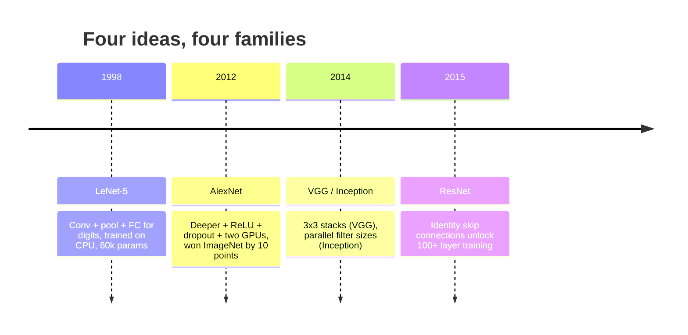
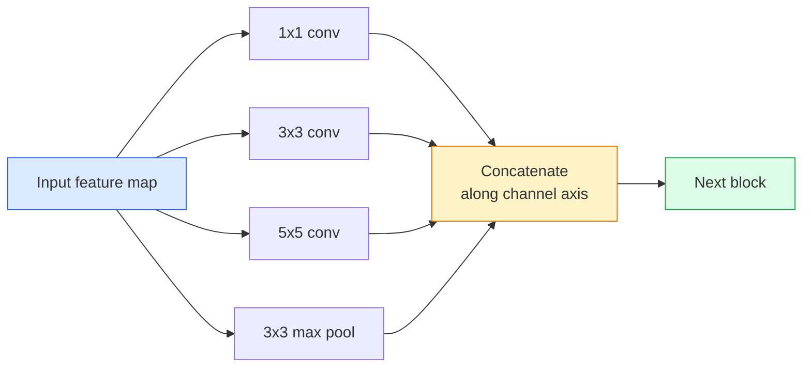
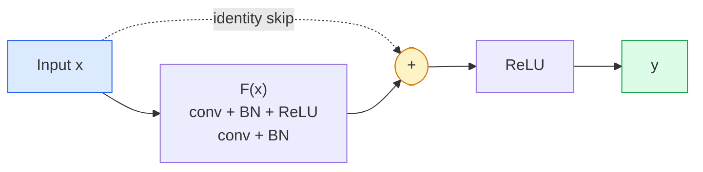

# CNNs — LeNet करने के लिए ResNet

> हर प्रमुख CNN पिछले तीस वर्षों के एक ही अनुसूची है गैर-रेखीयता एक नए विचार के साथ नीचे नमूना नुस्खा।

**Type:** Learn + Build
**Languages:** Python
**Prerequisites:** Phase 3 Lesson 11 (PyTorch), Phase 4 Lesson 01 (Image Fundamentals), Phase 4 Lesson 02 (Convolutions from Scratch)
**Time:** ~75 minutes

## सीखने के लक्ष्य

- वास्तुशिल्प वंश का पता लगाएं LeNet-5 -> AlexNet -> VGG -> Inception -> ResNet और प्रत्येक परिवार द्वारा योगदान दिया गया एक नया विचार बताएं
- कार्यान्वयन LeNet-5, एक VGG-style ब्लॉक, और एक ResNet BasicBlock में PyTorch, प्रत्येक 40 रेखाओं से कम
- समझाएँ कि शेष कनेक्शन 1,000 परतों के नेटवर्क को अयोग्य से अत्याधुनिक क्यों बनाते हैं
- आधुनिक रीढ़ की हड्डी (ResNet-18, ResNet-50) और स्रोत को देखने से पहले इसके आउटपुट आकार, रिसेप्टिव क्षेत्र और पैरामीटर की गिनती की भविष्यवाणी करें

## समस्या

2011 में, सबसे अच्छा ImageNet वर्गीकरणकर्ता ने शीर्ष-5 की सटीकता के बारे में 74% स्कोर किया। 2012 में AlexNet 2015 में ResNet कोई नया डेटा नहीं। GPU निर्माण. लाभ वास्तुकला विचारों से आया. एक काम करने वाले दृष्टि इंजीनियर को यह जानना होगा कि कौन सा विचार किस कागज से आया क्योंकि 2026 में आप जो भी उत्पादन रीढ़ की हड्डी भेजते हैं वह उन ही टुकड़ों का एक पुनर्मिलन है  और क्योंकि विचार स्थानांतरित होते रहते हैंः समूहबद्ध कन्वर्स से चला गया CNNs ट्रांसफार्मर के लिए, शेष कनेक्शन से चला गया ResNet हर एक के लिए LLM मौजूदा बैच नॉर्मलाइजेशन फैलाव मॉडल में रहता है।

इन नेटवर्क का अध्ययन करने के लिए आप एक आम गलती के खिलाफ भी प्रतिरक्षा देते हैंः जब एक LeNet-sized नेटवर्क समस्या का समाधान होगा। MNIST एक ResNet. प्रत्येक परिवार के स्केलिंग वक्र को जानने से आपको पता चलता है कि उस पर कहां बैठना है।

## अवधारणा

### चार विचार जिन्होंने दृष्टि को बदल दिया



शास्त्रीय दृष्टि में कुछ भी इस तरह से महत्वपूर्ण नहीं था कि इन चार कूदने.

### LeNet-5 (1998)

यान LeCunयह एक आंक पहचानकर्ता है. 60,000 मापदंडों. दो conv-पूल ब्लॉक, दो पूरी तरह से जुड़े परतों, टैन सक्रियण. यह टेम्पलेट प्रत्येक परिभाषित किया CNN विरासतः

```
input (1, 32, 32)
  conv 5x5 -> (6, 28, 28)
  avg pool 2x2 -> (6, 14, 14)
  conv 5x5 -> (16, 10, 10)
  avg pool 2x2 -> (16, 5, 5)
  flatten -> 400
  dense -> 120
  dense -> 84
  dense -> 10
```

आधुनिक दुनिया में जो कुछ भी एक CNN बारी बारी घुमाव और नीचे नमूना फ़ीडिंग एक छोटे से वर्गीकरण सिर  है LeNet अधिक परतों, बड़े चैनलों, और बेहतर सक्रियण के साथ।

### AlexNet (2012)

तीन परिवर्तन जो एक साथ टूट गए ImageNet:

1. **ReLU** टैन के बजाय ग्रेडिएंट गायब हो जाते हैं। प्रशिक्षण छह गुना तेज होता है।
2. **छोड़ना** नियमितता एक परत बन जाती है, एक चाल नहीं।
3. **गहराई और चौड़ाई**. पांच कंव परतें, तीन घने परतें, 60M पैरामीटर, दो पर प्रशिक्षित GPUs मॉडल के साथ उन्हें पार विभाजित.

कागज के आंकड़ा 2 अभी भी दिखाता है GPU यह समानांतर एक हार्डवेयर हल था, वास्तुकला की जानकारी नहीं  लेकिन ऊपर दिए गए तीन विचार अभी भी आपके द्वारा उपयोग किए जाने वाले प्रत्येक मॉडल में हैं।

### VGG (2014)

VGG पूछाः क्या होता है अगर आप केवल 3x3 घुमाव का उपयोग करें और आप गहराई में जाना?

```
stack:   conv 3x3 -> conv 3x3 -> pool 2x2
repeat:  16 or 19 conv layers
```

दो 3x3 कन्वर्स एक 5x5 कन्वर्स के समान 5x5 इनपुट क्षेत्र को देखते हैं लेकिन कम पैरामीटर (2*9*C^2 = 18C^2 बनाम 25*C^2) और एक अतिरिक्त ReLU बीच में। VGG इस अवलोकन को एक संपूर्ण वास्तुकला में बदल दिया। सरलता  एक ब्लॉक प्रकार, दोहराया  यह सब कुछ के लिए संदर्भ बिंदु बना दिया जो बाद में आया।

लागत: 138 मिलियन पैरामीटर, प्रशिक्षण में धीमा, अनुमान लगाने में महंगा।

### स्थापना (2014, उसी वर्ष)

गूगल का जवाब था "मुझे किस नाभिक का आकार इस्तेमाल करना चाहिए? " सभी समानान्तर रूप से।



प्रत्येक शाखा चैनल मिश्रण के लिए 1x1 , स्थानीय बनावट के लिए 3x3 , बड़े पैटर्न के लिए 5x5 , शिफ्ट-इनवैरेंट सुविधाओं के लिए एकजुट करने के लिए विशेषज्ञता प्रदान करती है और कॉनकेट अगले परत को चुनने देता है जो भी शाखा उपयोगी है। शुरुआत v1 प्रत्येक शाखा के अंदर 1x1 घुमावदार के रूप में एक बोतल गला के रूप में पैरामीटर गिनती को स्वस्थ रखने के लिए इस्तेमाल किया।

### अवसाद समस्या

2015 तक, VGG-19 काम किया और VGG-32 यह एक अच्छा तरीका है कि एक अच्छी तरह से अनुकूलित वजन को कम करने के लिए एक अच्छा तरीका है क्योंकि प्रत्येक परत में ग्रेडिएंट घटता है।

```
Plain deep network:
  y = f_L( f_{L-1}( ... f_1(x) ... ) )

Gradient wrt early layer:
  dL/dW_1 = dL/dy * df_L/df_{L-1} * ... * df_2/df_1 * df_1/dW_1

Each multiplicative term has magnitude roughly (weight magnitude) * (activation gain).
Stack 100 of them with gains < 1 and the gradient is effectively zero.
```

VGG 19 परतों पर काम किया क्योंकि बैच मानक (एक साथ प्रकाशित) सक्रियण को अच्छी तरह से रखा गया था।

### ResNet (2015)

वह, झांग, रेन, सन ने एक बदलाव प्रस्तावित किया जो सब कुछ ठीक करता हैः

```
standard block:   y = F(x)
residual block:   y = F(x) + x
```

इन `+ x` मतलब कि परत हमेशा ड्राइविंग के द्वारा कुछ भी नहीं करने का विकल्प चुन सकता है `F(x)` शून्य के लिए एक 1,000 परत ResNet अब अधिकतम 1 परत नेटवर्क के रूप में बुरा है, क्योंकि प्रत्येक अतिरिक्त ब्लॉक एक क्षुल्लक भागने के लिए है। इस गारंटी के साथ, अनुकूलक हर ब्लॉक बनाने के लिए तैयार है *थोड़ा* उपयोगी  और थोड़ा उपयोगी, 100 बार ढेर, अत्याधुनिक है।



ब्लॉक के दो संस्करण हर जगह दिखाई देते हैंः

- **BasicBlock** (ResNet-18, ResNet-34): दो 3x3 कन्वर्स, दोनों के चारों ओर छोड़ दें।
- **बोतल की गर्दन** (ResNet-50, -101, -152): 1x1 नीचे, 3x3 मध्य, 1x1 ऊपर, ट्रिओ के चारों ओर छोड़ दें। सस्ता जब चैनल गिनती उच्च है।

जब जहाज को एक डाउनसैम्पल पार करना होगा (stride=2), पहचान पथ को 1x1 से प्रतिस्थापित किया जाता है stride=2 आकारों के अनुरूप करने के लिए कन्विट करें।

### क्यों अवशिष्ट दृष्टि से परे महत्वपूर्ण हैं

यह विचार वास्तव में छवि वर्गीकरण के बारे में नहीं था। यह "अपनी उंगलियों के पार से गहरे नेटवर्क को बदलने के बारे में था और उम्मीद है कि ग्रेडिएंट जीवित रहेंगे" एक विश्वसनीय, स्केलेबल इंजीनियरिंग उपकरण में। प्रत्येक ट्रांसफार्मर के बारे में आप अगले चरण के बारे में पढ़ेंगे प्रत्येक ब्लॉक में बिल्कुल एक ही स्किप कनेक्शन है। बिना ResNet, वहाँ कोई नहीं है GPT.

```figure
pooling
```

## इसे बनाओ

### चरण 1: LeNet-5

एक न्यूनतम, वफादार LeNet. आधुनिकता के लिए एकमात्र अनुदान यह है कि हम उपयोग `nn.CrossEntropyLoss` मूल गौसी कनेक्शन के बजाय नीचे धारा.

```python
import torch
import torch.nn as nn
import torch.nn.functional as F

class LeNet5(nn.Module):
    def __init__(self, num_classes=10):
        super().__init__()
        self.conv1 = nn.Conv2d(1, 6, kernel_size=5)
        self.conv2 = nn.Conv2d(6, 16, kernel_size=5)
        self.pool = nn.AvgPool2d(2)
        self.fc1 = nn.Linear(16 * 5 * 5, 120)
        self.fc2 = nn.Linear(120, 84)
        self.fc3 = nn.Linear(84, num_classes)

    def forward(self, x):
        x = self.pool(torch.tanh(self.conv1(x)))
        x = self.pool(torch.tanh(self.conv2(x)))
        x = torch.flatten(x, 1)
        x = torch.tanh(self.fc1(x))
        x = torch.tanh(self.fc2(x))
        return self.fc3(x)

net = LeNet5()
x = torch.randn(1, 1, 32, 32)
print(f"output: {net(x).shape}")
print(f"params: {sum(p.numel() for p in net.parameters()):,}")
```

अपेक्षित उत्पादनः `output: torch.Size([1, 10])`, `params: 61,706`यह पूरी संख्या वर्गीकरण है जो आधुनिक दृष्टि की शुरुआत की।

### चरण 2: ए VGG ब्लॉक

एक पुनः प्रयोज्य ब्लॉकः दो 3x3 कन्वर्स, ReLU, बैच मानक, मैक्स पूल.

```python
class VGGBlock(nn.Module):
    def __init__(self, in_c, out_c):
        super().__init__()
        self.conv1 = nn.Conv2d(in_c, out_c, kernel_size=3, padding=1)
        self.bn1 = nn.BatchNorm2d(out_c)
        self.conv2 = nn.Conv2d(out_c, out_c, kernel_size=3, padding=1)
        self.bn2 = nn.BatchNorm2d(out_c)
        self.pool = nn.MaxPool2d(2)

    def forward(self, x):
        x = F.relu(self.bn1(self.conv1(x)))
        x = F.relu(self.bn2(self.conv2(x)))
        return self.pool(x)

class MiniVGG(nn.Module):
    def __init__(self, num_classes=10):
        super().__init__()
        self.stack = nn.Sequential(
            VGGBlock(3, 32),
            VGGBlock(32, 64),
            VGGBlock(64, 128),
        )
        self.head = nn.Sequential(
            nn.AdaptiveAvgPool2d(1),
            nn.Flatten(),
            nn.Linear(128, num_classes),
        )

    def forward(self, x):
        return self.head(self.stack(x))

net = MiniVGG()
x = torch.randn(1, 3, 32, 32)
print(f"output: {net(x).shape}")
print(f"params: {sum(p.numel() for p in net.parameters()):,}")
```

तीन VGG ब्लॉक पर CIFAR-sized इनपुट, एक अनुकूलन पूल, एक रैखिक परत. ~ 290k पैरामीटर. CIFAR-10.

### चरण 3: ए ResNet BasicBlock

मुख्य निर्माण ब्लॉक ResNet-18 और ResNet-34.

```python
class BasicBlock(nn.Module):
    def __init__(self, in_c, out_c, stride=1):
        super().__init__()
        self.conv1 = nn.Conv2d(in_c, out_c, kernel_size=3, stride=stride, padding=1, bias=False)
        self.bn1 = nn.BatchNorm2d(out_c)
        self.conv2 = nn.Conv2d(out_c, out_c, kernel_size=3, stride=1, padding=1, bias=False)
        self.bn2 = nn.BatchNorm2d(out_c)
        if stride != 1 or in_c != out_c:
            self.shortcut = nn.Sequential(
                nn.Conv2d(in_c, out_c, kernel_size=1, stride=stride, bias=False),
                nn.BatchNorm2d(out_c),
            )
        else:
            self.shortcut = nn.Identity()

    def forward(self, x):
        out = F.relu(self.bn1(self.conv1(x)))
        out = self.bn2(self.conv2(out))
        out = out + self.shortcut(x)
        return F.relu(out)
```

`bias=False` कन्वि लेयर पर बैच-नॉर्म कन्वेंशन है BNबीटा पैरामीटर पहले से ही पूर्वाग्रह को संभालता है, तो कन्वि पूर्वाग्रह भी ले जाने के लिए एक अपशिष्ट है। `shortcut` केवल जब कदम या चैनल की संख्या बदलती है तो वास्तविक कन्वे की आवश्यकता होती है; अन्यथा यह एक नो-ऑप पहचान है।

### चरण 4: एक छोटा ResNet

चार समूहों को ढेर BasicBlocks काम करने के लिए ResNet के लिए CIFAR-sized इनपुट।

```python
class TinyResNet(nn.Module):
    def __init__(self, num_classes=10):
        super().__init__()
        self.stem = nn.Sequential(
            nn.Conv2d(3, 32, kernel_size=3, stride=1, padding=1, bias=False),
            nn.BatchNorm2d(32),
            nn.ReLU(inplace=True),
        )
        self.layer1 = self._make_group(32, 32, num_blocks=2, stride=1)
        self.layer2 = self._make_group(32, 64, num_blocks=2, stride=2)
        self.layer3 = self._make_group(64, 128, num_blocks=2, stride=2)
        self.layer4 = self._make_group(128, 256, num_blocks=2, stride=2)
        self.head = nn.Sequential(
            nn.AdaptiveAvgPool2d(1),
            nn.Flatten(),
            nn.Linear(256, num_classes),
        )

    def _make_group(self, in_c, out_c, num_blocks, stride):
        blocks = [BasicBlock(in_c, out_c, stride=stride)]
        for _ in range(num_blocks - 1):
            blocks.append(BasicBlock(out_c, out_c, stride=1))
        return nn.Sequential(*blocks)

    def forward(self, x):
        x = self.stem(x)
        x = self.layer1(x)
        x = self.layer2(x)
        x = self.layer3(x)
        x = self.layer4(x)
        return self.head(x)

net = TinyResNet()
x = torch.randn(1, 3, 32, 32)
print(f"output: {net(x).shape}")
print(f"params: {sum(p.numel() for p in net.parameters()):,}")
```

चार समूहों में से प्रत्येक दो ब्लॉक. चरण 2 समूहों की शुरुआत में 2, 3, 4. चैनल गिनती प्रत्येक डाउनसैम्पल पर दोगुना। लगभग 2.8M पैरामीटर। यह मानक नुस्खा है जो साफ पैमाने तक ResNet-152.

### चरण 5: पैरामीटर-टू-फ़ंक्शन दक्षता की तुलना करें

तीनों नेटवर्क के माध्यम से एक ही इनपुट चलाएं और पैरामीटर गिनती की तुलना करें।

```python
def summary(name, net, x):
    y = net(x)
    params = sum(p.numel() for p in net.parameters())
    print(f"{name:12s}  input {tuple(x.shape)} -> output {tuple(y.shape)}  params {params:>10,}")

x = torch.randn(1, 3, 32, 32)
summary("LeNet5",     LeNet5(),       torch.randn(1, 1, 32, 32))
summary("MiniVGG",    MiniVGG(),      x)
summary("TinyResNet", TinyResNet(),   x)
```

तीन मॉडल, तीन युग, पैरामीटर गिनती में तीन परिमाण के आदेश. CIFAR-10 सटीकता, आप लगभग की जरूरत हैः LeNet 60%, MiniVGG 89%, TinyResNet कुछ प्रशिक्षण काल के बाद 93%।

## इसका प्रयोग करें

`torchvision.models` कॉल हस्ताक्षर परिवारों में समान है, जो बिल्कुल रीढ़ की हड्डी अमूर्तता का बिंदु है।

```python
from torchvision.models import resnet18, ResNet18_Weights, vgg16, VGG16_Weights

r18 = resnet18(weights=ResNet18_Weights.IMAGENET1K_V1)
r18.eval()

print(f"ResNet-18 params: {sum(p.numel() for p in r18.parameters()):,}")
print(r18.layer1[0])
print()

v16 = vgg16(weights=VGG16_Weights.IMAGENET1K_V1)
v16.eval()
print(f"VGG-16   params: {sum(p.numel() for p in v16.parameters()):,}")
```

ResNet-18 11.7M पैरामीटर है। VGG-16 138M है। समान ImageNet शीर्ष-1 सटीकता (69.8% बनाम 71.6%) । शेष कनेक्शन आपको 12x पैरामीटर दक्षता जीतने के लिए खरीदते हैं। यही कारण है कि ResNet 2016 से लेकर ViT 2021 में आया और अभी भी वास्तविक दुनिया में तैनाती पर हावी है जहां कंप्यूटिंग एक बाधा है।

स्थानांतरण सीखने के लिए, नुस्खा हमेशा एक ही हैः लोड पूर्व प्रशिक्षित, रीढ़ को फ्रीज, वर्गीकरण सिर की जगह।

```python
for p in r18.parameters():
    p.requires_grad = False
r18.fc = nn.Linear(r18.fc.in_features, 10)
```

तीन पंक्तियों. अब आप एक 10 वर्ग है CIFAR वर्गीकरणकर्ता जो प्रतिनिधित्वों को विरासत में देता है ImageNet भुगतान किया गया।

## इसे भेजें

इस पाठ से उत्पन्न होता हैः

- `outputs/prompt-backbone-selector.md` एक संकेत जो सही चुनता है CNN परिवार (LeNet/VGG/ResNet/MobileNet/ConvNeXt) एक कार्य, डेटासेट का आकार और गणना बजट।
- `outputs/skill-residual-block-reviewer.md` एक कौशल जो एक PyTorch मॉड्यूल और ध्वज स्किप कनेक्शन त्रुटियां (चरण परिवर्तन पर शॉर्टकट गायब, शॉर्टकट सक्रियण क्रम, BN जोड़ने के सापेक्ष स्थान) ।

## व्यायाम

1. **(Easy)** हाथ से गणना पैरामीटर `TinyResNet` एक परत के द्वारा। `sum(p.numel() for p in net.parameters())`. पैरामीटर बजट का अधिकांश हिस्सा कहां जाता है  convs, BN, या वर्गीकरण प्रमुख?
2. **(Medium)** बोतल गले ब्लॉक (1x1 -> 3x3 -> 1x1 स्किप के साथ) को लागू करें और इसका उपयोग एक ResNet-50-style नेटवर्क के लिए CIFAR. तुलना करें `TinyResNet`.
3. **(Hard)** स्किप कनेक्शन को हटा दें `BasicBlock`, 34 ब्लॉक "सादा" नेटवर्क और 34 ब्लॉक को प्रशिक्षित करें ResNet पर CIFAR-10 10 युगों के लिए प्रत्येक। दोनों के लिए प्लॉट प्रशिक्षण हानि बनाम युग। Figure 1 परिणाम को पुनः प्रस्तुत करें जहां सादा गहरा नेटवर्क अपने पतले जुड़वां की तुलना में उच्च हानि के लिए अभिसरण करता है।

## प्रमुख शर्तें

| अवधि | लोग क्या कहते हैं | इसका क्या मतलब है |
|------|----------------|----------------------|
| रीढ़ की हड्डी | "मॉडल" | घुमावदार ब्लॉक का ढेर जो कार्य हेड में फ़ीड सुविधा मानचित्र उत्पन्न करता है |
| शेष कनेक्शन | "जंप कनेक्शन" | `y = F(x) + x`; अनुकूलक को F को शून्य पर सेट करके पहचान सीखने देता है, जो कि मनमाने गहराई को प्रशिक्षित करता है |
| BasicBlock | "एक स्किप के साथ दो 3x3 कन्वर्स" | इन ResNet-18/34 निर्माण ब्लॉक:BN-ReLU-conv-BN-add-ReLU |
| बोतल की गर्दन | 1x1 नीचे, 3x3, 1x1 ऊपर" | इन ResNet-50/101/152 ब्लॉक; उच्च चैनल गिनती पर सस्ता क्योंकि 3x3 कम चौड़ाई पर चलता है |
| अव्यवस्था की समस्या | "गहरे से भी बदतर है" | पिछले ~ 20 सादे कन्वर्ट परतें, प्रशिक्षण और परीक्षण त्रुटि दोनों में वृद्धि; शेष कनेक्शन द्वारा हल किया गया, अधिक डेटा द्वारा नहीं |
| स्टेम | "पहली परत" | प्रारंभिक conv जो 3-चैनल इनपुट को आधार सुविधा चौड़ाई में परिवर्तित करता है; आमतौर पर 7x7 चरण 2 के लिए ImageNet, 3x3 चरण 1 के लिए CIFAR |
| सिर | "वर्गीकरणकर्ता" | अंतिम रीढ़ की हड्डी ब्लॉक के बाद की परतेंः अनुकूलन पूल, सपाट, रैखिक ((s) |
| स्थानांतरण सीखना | "अभ्यासित वजन" | एक प्रशिक्षण पर एक रीढ़ की हड्डी लोड ImageNet और अपने काम पर केवल सिर को ठीक-ठाक करने के लिए |

## आगे पढ़ना

- [छवि पहचान के लिए गहरी अवशिष्ट सीखना (He et al., 2015)](https://arxiv.org/abs/1512.03385)  ResNet कागज; हर आंकड़ा अध्ययन करने लायक है
- [बहुत गहरे संवर्धन नेटवर्क (सिमोनिया और ज़िसरमैन, 2014)](https://arxiv.org/abs/1409.1556)  VGG कागज; अभी भी "क्यों 3x3" के लिए सबसे अच्छा संदर्भ
- [ImageNet गहन के साथ वर्गीकरण CNNs (Krizhevsky et al., 2012)](https://papers.nips.cc/paper_files/paper/2012/hash/c399862d3b9d6b76c8436e924a68c45b-Abstract.html) — AlexNet; कागज जो हाथ से बने फीचर युग का अंत करता है
- [कन्व्होल्यूशन के साथ गहरी जा रही (Szegedy et al., 2014)](https://arxiv.org/abs/1409.4842) आरंभ v1; समानांतर फ़िल्टर विचार जो अभी भी दृष्टि परिवर्तनकों में दिखाई देता है
