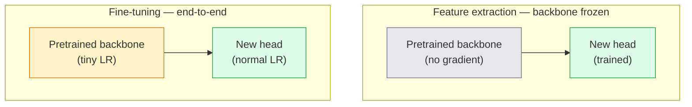

# स्थानांतरण सीखना और ठीक से समायोजित करना

> किसी और ने एक लाख खर्च किए GPU आप अपने स्वयं के प्रशिक्षण से पहले उन सुविधाओं को उधार लेना चाहिए।

**Type:** Build
**Languages:** Python
**Prerequisites:** Phase 4 Lesson 03 (CNNs), Phase 4 Lesson 04 (Image Classification)
**Time:** ~75 minutes

## सीखने के लक्ष्य

- सूक्ष्म-ट्यूनिंग से सुविधा निकासी को अलग करें और डेटासेट आकार, डोमेन दूरी और गणना बजट के आधार पर सही चुनें
- पूर्व प्रशिक्षित रीढ़ की हड्डी को लोड करें, इसके वर्गीकरण सिर को प्रतिस्थापित करें, और केवल सिर को 20 से कम लाइनों में एक काम करने वाली बेसलाइन पर प्रशिक्षित करें
- विभेदकारी सीखने की दर वाले परतों को धीरे-धीरे मुक्त करें ताकि प्रारंभिक सामान्य सुविधाओं को देर से कार्य-विशिष्ट अद्यतनों की तुलना में छोटे अपडेट प्राप्त हों
- तीन आम विफलताओं का निदान करेंः विशेषताएं बहुत अधिक से बहती हैं LR जमे हुए टुकड़ों पर, BN आंकड़े छोटे डेटा सेट पर गिर, और आपदाजनक भूल

## समस्या

प्रशिक्षण ए ResNet-50 पर ImageNet लगभग 2,000 की लागत GPU-hours. बहुत कम टीमों के पास वह बजट है जो वे भेजते हैं प्रत्येक कार्य के लिए जो लगभग हर टीम वास्तव में जहाज है एक पूर्व प्रशिक्षित रीढ़ की हड्डी के साथ एक नया सिर कुछ सौ या कुछ हज़ार कार्य-विशिष्ट छवियों पर प्रशिक्षित है।

यह एक शॉर्टकट नहीं है. किसी भी के पहले कन्वर्ट ब्लॉक ImageNet-trained CNN अगले कुछ ब्लॉक बनावट और सरल मोजूद सीखते हैं। मध्य ब्लॉक ऑब्जेक्ट भागों को सीखते हैं। अंतिम ब्लॉक संयोजन सीखते हैं जो 1,000 की तरह दिखने लगते हैं ImageNet श्रेणी. उस पदानुक्रम का पहला 90% लगभग अपरिवर्तित चिकित्सा इमेजिंग, औद्योगिक निरीक्षण, उपग्रह डेटा और अन्य सभी दृष्टि कार्यों में स्थानांतरित होता है  क्योंकि प्रकृति के पास किनारों और बनावटों का सीमित शब्दावली है। अंतिम 10% वास्तव में आप क्या प्रशिक्षण देते हैं।

स्थानांतरण सही पाने के लिए तीन बग आप के लिए इंतजार कर रहे हैंः बहुत उच्च सीखने की दर के साथ पूर्व प्रशिक्षित सुविधाओं को नष्ट करना, सूचना मॉडल को भूख से मारना बहुत अधिक ठंढकर, और BatchNormचल रही आंकड़े एक छोटे से डेटा सेट की ओर बहते हैं कि नेटवर्क के बाकी कभी नहीं सीखा है. यह सबक उनमें से प्रत्येक उद्देश्य से चलता है.

## अवधारणा

### विशेषता निकासी बनाम बारीक समायोजन

दो व्यवस्थाएं, जो कि आप पूर्व प्रशिक्षित सुविधाओं पर कितना भरोसा करते हैं और आपके पास कितना डेटा है।



अंगूठे के नियमः

| डेटासेट आकार | डोमेन दूरी | नुस्खा |
|--------------|-----------------|--------|
| < 1k चित्र | निकट ImageNet | फ्रीज रीढ़ की हड्डी, ट्रेन सिर केवल |
| 1k-10k | निकट | पहले 2-3 चरणों को ठंढें, शेष को ठीक से समायोजित करें |
| 10k-100k | कोई भी | भेदभाव के साथ फाइन-ट्यून अंत-से-अंत LR |
| 100k+ | दूर | सब कुछ ठीक से समायोजित करें; यदि डोमेन पर्याप्त दूर है तो खरोंच से प्रशिक्षण पर विचार करें |

"अभी तक ImageNet" लगभग प्राकृतिक का मतलब है RGB वस्तु-जैसी सामग्री वाली तस्वीरें। CT स्कैन, उपग्रह छवियों, और सूक्ष्मदर्शी दूर डोमेन हैं  सुविधाओं अभी भी मदद करते हैं, लेकिन आप अधिक परतों को अनुकूलित करने की जरूरत होगी.

### ठंढने का काम क्यों होता है

इन ImageNet विशेषताएं CNN इन आंकड़ों को लगभग हर दृश्य क्षेत्र में स्थिर है जिसे एक मानव नामित कर सकता है। यही कारण है कि एक मॉडल पर प्रशिक्षित ImageNet और शून्य शॉट पर मूल्यांकन किया CIFAR-10 केवल एक नए रैखिक सिर (कोई रीढ़ की हड्डी को ठीक करने के लिए) के साथ 80% से अधिक सटीकता तक पहुँचता है। सिर इस कार्य के लिए पहले से ही सीखे गए लक्षणों में से कौन सा वजन करना सीख रहा है।

### भेदभावपूर्ण सीखने की दरें

जब आप डिफ्रॉज करते हैं, तो शुरुआती परतों को देर से परतों की तुलना में धीमी गति से प्रशिक्षित करना चाहिए। शुरुआती परतों में सामान्य विशेषताएं एन्कोड होती हैं जिन्हें आप संरक्षित करना चाहते हैं; देर से परतों में कार्य-विशिष्ट संरचना को एन्कोड किया जाता है जिसे आपको बहुत आगे बढ़ने की आवश्यकता होती है।

```
Typical recipe:

  stage 0 (stem + first group): lr = base_lr / 100    (mostly fixed)
  stage 1:                       lr = base_lr / 10
  stage 2:                       lr = base_lr / 3
  stage 3 (last backbone group): lr = base_lr
  head:                          lr = base_lr  (or slightly higher)
```

में PyTorch यह सिर्फ पैरामीटर समूहों की एक सूची है जो ऑप्टिमाइज़र को पारित किया गया है. एक मॉडल, पांच सीखने की दर, शून्य अतिरिक्त कोड.

### इन BatchNorm समस्या

BN परतें पकड़ `running_mean` और `running_var` बफर जो कि पर गणना की गई थी ImageNet. यदि आपके कार्य में पिक्सल का वितरण अलग है  अलग प्रकाश व्यवस्था, अलग सेंसर, अलग रंग स्थान  ये बफर गलत हैं। प्राथमिकता के क्रम में तीन विकल्पः

1. **के साथ ठीक से ट्यून BN ट्रेन मोड में।** छोड़ दो BN कार्य डेटा सेट मध्यम आकार (>= 5k उदाहरण) है तो डिफ़ॉल्ट विकल्प।
2. **ठंढना BN मूल्यांकन मोड में।** रखो ImageNet सही जब आपका डेटा सेट इतना छोटा है कि BNचलती औसत शोर होगा.
3. **प्रतिस्थापन BN के साथ GroupNorm.** यह गतिशील औसत की समस्या को पूरी तरह से दूर करता है। इसका उपयोग पता लगाने और खंडन रीढ़ की हड्डी में किया जाता है जहां बैच आकार प्रति बैच GPU बहुत छोटा है।

यह गलत हो गया है चुपचाप 5-15% की सटीकता को टैंक करता है।

### सिर का डिज़ाइन

वर्गीकरण सिर 1-3 रैखिक परतों के साथ एक वैकल्पिक ड्रॉपआउट है. प्रत्येक टॉर्चविजन रीढ़ की हड्डी एक डिफ़ॉल्ट सिर भेजता है जिसे आप बदलते हैंः

```
backbone.fc = nn.Linear(backbone.fc.in_features, num_classes)          # ResNet
backbone.classifier[1] = nn.Linear(..., num_classes)                    # EfficientNet, MobileNet
backbone.heads.head = nn.Linear(..., num_classes)                       # torchvision ViT
```

छोटे डेटासेट के लिए, एक ही रैखिक परत आमतौर पर पर्याप्त है। एक छिपी हुई परत जोड़ना (रेखात्मक -> ReLU -> ड्रॉपआउट -> रैखिक) तब मदद करता है जब कार्य वितरण रीढ़ की हड्डी के प्रशिक्षण वितरण से अधिक दूर होता है।

### परत-बुद्धिमान LR क्षय

भेदभाव का एक सुचारू संस्करण LR आधुनिक सूक्ष्म-सूचना में प्रयोग किया जाता है (BEiT, DINOv2, ViT-B चरणों में परतों को समूहित करने के बजाय, प्रत्येक परत को थोड़ा छोटा LR उसके ऊपर की तुलना मेंः

```
lr_layer_k = base_lr * decay^(L - k)
```

साथ decay = 0.75 और L = 12 ट्रांसफार्मर ब्लॉक, पहली ब्लॉक ट्रेनें `0.75^11 ≈ 0.04x` सिर की LR. ट्रांसफार्मर के लिए अधिक मायने रखता है CNNs, जहां चरण-समूह LRs आमतौर पर पर्याप्त हैं।

### क्या मूल्यांकन किया जाना चाहिए

स्थानांतरण-शिक्षा रन दो संख्याओं की आवश्यकता है आप एक खरोंच रन पर ट्रैक नहीं करेंगेः

- **केवल पूर्व प्रशिक्षित सटीकता** सिर की सटीकता के साथ रीढ़ की हड्डी को जमे हुए. यह आपका मंजिल है.
- **ठीक से समायोजित सटीकता** एक ही मॉडल अंत से अंत तक प्रशिक्षण के बाद। यह आपकी छत है।

यदि ठीक से ट्यून किया गया है, तो केवल पूर्व-शिक्षित से कम है, तो आपके पास सीखने की दर या BN हमेशा दोनों प्रिंट करें।

```figure
transfer-learning
```

## इसे बनाओ

### चरण 1: पूर्व प्रशिक्षित रीढ़ की हड्डी को लोड करें और उसकी जांच करें

```python
import torch
import torch.nn as nn
from torchvision.models import resnet18, ResNet18_Weights

backbone = resnet18(weights=ResNet18_Weights.IMAGENET1K_V1)
print(backbone)
print()
print("classifier head:", backbone.fc)
print("feature dim:", backbone.fc.in_features)
```

`ResNet18` इसमें चार चरण हैं (`layer1..layer4`) प्लस एक स्टेम और एक `fc` प्रत्येक टॉर्च विजन वर्गीकरण रीढ़ की हड्डी एक समान संरचना है।

### चरण 2: सुविधा निकासी  सब कुछ जमे, सिर की जगह

```python
def make_feature_extractor(num_classes=10):
    model = resnet18(weights=ResNet18_Weights.IMAGENET1K_V1)
    for p in model.parameters():
        p.requires_grad = False
    model.fc = nn.Linear(model.fc.in_features, num_classes)
    return model

model = make_feature_extractor(num_classes=10)
trainable = sum(p.numel() for p in model.parameters() if p.requires_grad)
frozen = sum(p.numel() for p in model.parameters() if not p.requires_grad)
print(f"trainable: {trainable:>10,}")
print(f"frozen:    {frozen:>10,}")
```

केवल `model.fc` रीढ़ की हड्डी एक जमे हुए सुविधाओं निकालने है।

### चरण 3: भेदभावपूर्ण सूक्ष्म समायोजन

एक उपयोगिता जो चरण-विशिष्ट सीखने की दरों के साथ पैरामीटर समूहों का निर्माण करती है।

```python
def discriminative_param_groups(model, base_lr=1e-3, decay=0.3):
    stages = [
        ["conv1", "bn1"],
        ["layer1"],
        ["layer2"],
        ["layer3"],
        ["layer4"],
        ["fc"],
    ]
    groups = []
    for i, names in enumerate(stages):
        lr = base_lr * (decay ** (len(stages) - 1 - i))
        params = [p for n, p in model.named_parameters()
                  if any(n.startswith(k) for k in names)]
        if params:
            groups.append({"params": params, "lr": lr, "name": "_".join(names)})
    return groups

model = resnet18(weights=ResNet18_Weights.IMAGENET1K_V1)
model.fc = nn.Linear(model.fc.in_features, 10)
for p in model.parameters():
    p.requires_grad = True

groups = discriminative_param_groups(model)
for g in groups:
    print(f"{g['name']:>10s}  lr={g['lr']:.2e}  params={sum(p.numel() for p in g['params']):>8,}")
```

`decay=0.3` प्रत्येक चरण की गति अगले चरण की गति के 30% है। `fc` प्राप्त `base_lr`, `layer4` प्राप्त `0.3 * base_lr`, `conv1` प्राप्त `0.3^5 * base_lr ≈ 0.00243 * base_lr`. अत्यधिक ध्वनि; अनुभवजन्य रूप से यह काम करता है.

### चरण 4: BatchNorm संभाल

ठंड में सहायता BN अपने वजन को फ्रीज किए बिना आंकड़े चलाते हैं।

```python
def freeze_bn_stats(model):
    for m in model.modules():
        if isinstance(m, (nn.BatchNorm1d, nn.BatchNorm2d, nn.BatchNorm3d)):
            m.eval()
            for p in m.parameters():
                p.requires_grad = False
    return model
```

आप सेट के बाद इसे कॉल `model.train()` हर युग की शुरुआत में। `model.train()` प्रशिक्षण मोड में सब कुछ बारी; यह केवल के लिए इसे उलटता है BN परतें।

### चरण 5: एक न्यूनतम अंत-से-अंत बारीक-ट्यूनिंग लूप

```python
from torch.optim import SGD
from torch.utils.data import DataLoader
from torch.optim.lr_scheduler import CosineAnnealingLR
import torch.nn.functional as F

def fine_tune(model, train_loader, val_loader, device, epochs=5, base_lr=1e-3, freeze_bn=False):
    model = model.to(device)
    groups = discriminative_param_groups(model, base_lr=base_lr)
    optimizer = SGD(groups, momentum=0.9, weight_decay=1e-4, nesterov=True)
    scheduler = CosineAnnealingLR(optimizer, T_max=epochs)

    for epoch in range(epochs):
        model.train()
        if freeze_bn:
            freeze_bn_stats(model)
        tr_loss, tr_correct, tr_total = 0.0, 0, 0
        for x, y in train_loader:
            x, y = x.to(device), y.to(device)
            logits = model(x)
            loss = F.cross_entropy(logits, y, label_smoothing=0.1)
            optimizer.zero_grad()
            loss.backward()
            optimizer.step()
            tr_loss += loss.item() * x.size(0)
            tr_total += x.size(0)
            tr_correct += (logits.argmax(-1) == y).sum().item()
        scheduler.step()

        model.eval()
        va_total, va_correct = 0, 0
        with torch.no_grad():
            for x, y in val_loader:
                x, y = x.to(device), y.to(device)
                pred = model(x).argmax(-1)
                va_total += x.size(0)
                va_correct += (pred == y).sum().item()
        print(f"epoch {epoch}  train {tr_loss/tr_total:.3f}/{tr_correct/tr_total:.3f}  "
              f"val {va_correct/va_total:.3f}")
    return model
```

उपरोक्त नुस्खा के साथ पांच युग CIFAR-10 लेता है `ResNet18-IMAGENET1K_V1` ~ 70% शून्य-शॉट रैखिक जांच सटीकता से ~ 93% ठीक से समायोजित सटीकता तक। सिर अकेले रीढ़ की हड्डी को कभी छूने के बिना 86% के आसपास प्लेटो होगा।

### चरण 6: क्रमिक रूप से फ्रीजिंग

एक समय सारिणी जो अंत से शुरू तक प्रत्येक युग के एक चरण को मुक्त करती है। कुछ अतिरिक्त युगों की कीमत पर विचलन को कम करती है।

```python
def progressive_unfreeze_schedule(model):
    stages = ["layer4", "layer3", "layer2", "layer1"]
    yielded = set()

    def start():
        for p in model.parameters():
            p.requires_grad = False
        for p in model.fc.parameters():
            p.requires_grad = True

    def unfreeze(epoch):
        if epoch < len(stages):
            name = stages[epoch]
            yielded.add(name)
            for n, p in model.named_parameters():
                if n.startswith(name):
                    p.requires_grad = True
            return name
        return None

    return start, unfreeze
```

कॉल `start()` पहले युग से पहले एक बार। `unfreeze(epoch)` प्रत्येक युग की शुरुआत में अनुकूलक को फिर से बनाएं जब भी प्रशिक्षित पैरामीटर का सेट बदलता है, अन्यथा जमे हुए पैरामीटर अभी भी कैश किए गए क्षणों को पकड़ते हैं जो इसे भ्रमित करते हैं।

## इसका प्रयोग करें

अधिकांश वास्तविक कार्यों के लिए, `torchvision.models` जब आप उन समस्याओं का सामना करते हैं जिन्हें पुस्तकालय डिफ़ॉल्ट नहीं ठीक कर सकते हैं तो ऊपर की भारी मशीनरी मायने रखती है।

```python
from torchvision.models import resnet50, ResNet50_Weights

model = resnet50(weights=ResNet50_Weights.IMAGENET1K_V2)
model.fc = nn.Linear(model.fc.in_features, num_classes)
optimizer = torch.optim.AdamW(model.parameters(), lr=1e-4, weight_decay=1e-4)
```

उत्पादन स्तर के दो अन्य चूकः

- `timm` जहाजों ~ 800 एक लगातार के साथ पूर्व प्रशिक्षित दृष्टि रीढ़ की हड्डी API (`timm.create_model("resnet50", pretrained=True, num_classes=10)`) टॉर्चविजन चिड़ियाघर के बाहर किसी भी बारीक- बारीक धुन के लिए, यह मानक है।
- ट्रांसफार्मर के लिए, `transformers.AutoModelForImageClassification.from_pretrained(name, num_labels=N)` आपको देता है ViT / BEiT / DeiT पाठ मॉडल के समान लोड करने की अर्थशास्त्र के साथ।

## इसे भेजें

इस पाठ से उत्पन्न होता हैः

- `outputs/prompt-fine-tune-planner.md` एक प्रॉम्प्ट जो डेटासेट आकार, डोमेन दूरी और कंप्यूटिंग बजट के आधार पर फीचर-एक्सट्रैक्शन बनाम प्रगतिशील बनाम एंड-टू-एंड फाइन-ट्यूनिंग चुनता है।
- `outputs/skill-freeze-inspector.md` एक कौशल जो, एक PyTorch मॉडल, रिपोर्ट जो पैरामीटर प्रशिक्षित कर सकते हैं, जो BatchNorm परतें मूल्यांकन मोड में हैं, और क्या अनुकूलक वास्तव में प्रशिक्षित पैरामीटर खिलाया जा रहा है.

## व्यायाम

1. **(Easy)** ट्रेन ए `ResNet18` एक रैखिक जांच (मस्तिष्क जमे हुए) के रूप में और एक ही सिंथेटिक पर पूर्ण बारीक-CIFAR डेटासेट. दोनों सटीकताओं को एक साथ रिपोर्ट करें. बताएं कि कौन सा अंतर आपको सुविधाओं को स्थानांतरित करने के लिए अच्छा बताता है और कौन सा आपको बताता है कि वे नहीं करते हैं।
2. **(Medium)** जानबूझकर बग दर्ज करेंः सेट `base_lr = 1e-1` सिर के बजाय रीढ़ की हड्डी पर। दिखाएं प्रशिक्षण हानि विस्फोट, फिर लागू करके ठीक `discriminative_param_groups` सहायक. रिकॉर्ड LR जिसमें प्रत्येक चरण भिन्नता शुरू होता है।
3. **(Hard)** एक चिकित्सा इमेजिंग डेटासेट लें (जैसे CheXpert-small, PatchCamelyonया HAM10000) और तीन व्यवस्थाओं की तुलना करें: ImageNet-pretrained जमे हुए रीढ़ + रैखिक सिर; ImageNet-pretrained (ग) स्क्रैच प्रशिक्षण. प्रत्येक के लिए सटीकता और गणना लागत की रिपोर्ट करें. किस डेटासेट आकार पर स्क्रैच प्रशिक्षण प्रतिस्पर्धी हो जाता है?

## प्रमुख शर्तें

| अवधि | लोग क्या कहते हैं | इसका क्या मतलब है |
|------|----------------|----------------------|
| विशेषता निकासी | "मुश्किल और ट्रेन सिर" | रीढ़ की हड्डी पैरामीटर जमे हुए, केवल नए वर्गीकरण सिर ग्रेडिएंट प्राप्त करता है |
| ठीक से समायोजित करना | "अंत से अंत तक प्रशिक्षण" | सभी मापदंडों को प्रशिक्षित किया जा सकता है, आमतौर पर बहुत छोटे के साथ LR स्क्रैच प्रशिक्षण से |
| भेदभाव LR | "छोटे LR प्रारंभिक परतों के लिए" | अनुकूलन पैरामीटर समूह जहां प्रारंभिक चरण LR देर से चरण का अंश है LR |
| परत-बुद्धिमान LR क्षय | "समील LR ग्रिडिएंट" | प्रति परत LR क्षय^(L - k द्वारा गुणा किया गया); ट्रांसफार्मर फाइन-ट्यून्स में आम |
| विनाशकारी भूलना | "मॉडल खो गया ImageNet" | बहुत अधिक LR नए कार्य संकेत को सीखने से पहले पूर्व प्रशिक्षित सुविधाओं को ओवरराइट करता है |
| BN सांख्यिकीय बहाव | "मौत से दौड़ना गलत है" | BatchNorm वर्तमान कार्य से भिन्न वितरण पर गणना की गई run_mean/var, मौन रूप से सटीकता को नुकसान पहुंचाता है |
| रैखिक जांच | "मुश्किल रीढ़ + रैखिक सिर" | पूर्व-प्रशिक्षित विशेषताओं का मूल्यांकन  जमे हुए प्रतिनिधित्व के ऊपर सर्वोत्तम रैखिक वर्गीकरण की सटीकता |
| विनाशकारी पतन | "सब कुछ एक वर्ग की भविष्यवाणी करता है" | एक के साथ ठीक से ट्यून करने पर होता है LR सिर से उतार-चढ़ाव स्थिर होने से पहले सुविधाओं को नष्ट करने के लिए पर्याप्त उच्च |

## आगे पढ़ना

- [गहरे तंत्रिका नेटवर्क में विशेषताएं कितनी स्थानांतरित हो सकती हैं? (योसिनस्की और अन्य, 2014)](https://arxiv.org/abs/1411.1792) कागज जो कि गुणों के पार लेयर ट्रांसफरबिलिटी को मात्राबद्ध करता है
- [सार्वभौमिक भाषा मॉडल सूक्ष्म समायोजन (ULMFiT, हॉवर्ड एंड रुडर, 2018)](https://arxiv.org/abs/1801.06146) मूल भेदभाव LR / प्रगतिशील विरंजन विधि; विचार सीधे दृष्टि में स्थानांतरित
- [समय पर दस्तावेज](https://huggingface.co/docs/timm) आधुनिक दृष्टि रीढ़ की हड्डी के लिए संदर्भ और सटीक ठीक-ठीक डिफ़ॉल्ट वे प्रशिक्षित किया गया था
- [रैखिक जांच मूल्यांकन के लिए एक सरल ढांचा (Kornblith et al., 2019)](https://arxiv.org/abs/1805.08974) रैखिक जांच की सटीकता क्यों मायने रखती है और इसे सही ढंग से कैसे रिपोर्ट किया जाए
