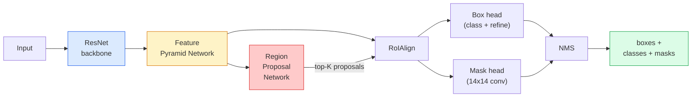

# इंस्टेंस सेगमेंट  मास्क R-CNN

> एक फास्टर आर- में एक छोटी सी मास्क शाखा जोड़ेंCNN और आप उदाहरण विभाजन है. कठिन हिस्सा है RoIAlign, और यह लगता है की तुलना में कठिन है.

**Type:** Build + Learn
**Languages:** Python
**Prerequisites:** Phase 4 Lesson 06 (YOLO), Phase 4 Lesson 07 (U-Net)
**Time:** ~75 minutes

## सीखने के लक्ष्य

- मास्क का पता लगाएंCNN वास्तुकला अंत-से-अंतः रीढ़ की हड्डी, FPN, RPN, RoIAlign, बॉक्स सिर, मास्क सिर
- कार्यान्वयन RoIAlign खरोंच से और क्यों समझाएं RoIPool अब उपयोग नहीं किया जाता है
- मशाल दृष्टि का उपयोग करें `maskrcnn_resnet50_fpn_v2` उत्पादन-गुणवत्ता वाले इंस्टेंट मास्क के लिए पूर्व-प्रशिक्षित मॉडल और इसका आउटपुट प्रारूप सही ढंग से पढ़ें
- ठीक-ठीक मास्क आर-CNN बॉक्स और मास्क हेड को बदलकर और रीढ़ की हड्डी को जमे हुए रखकर एक छोटे से कस्टम डेटासेट पर

## समस्या

अर्थिक विभाजन आपको प्रति वर्ग एक मुखौटा देता है। इंस्टैंस सेगमेंटेशन आपको प्रति वस्तु एक मुखौटा देता है, भले ही दो वस्तुएं एक वर्ग साझा करें। व्यक्तियों की गिनती, फ्रेमों के पार ट्रैकिंग, और चीजों (एक दीवार में प्रत्येक ईंट का सीमांकन बॉक्स, माइक्रोस्कोप छवि में प्रत्येक सेल) मापने के लिए सभी उदाहरण सेगमेंटेशन की आवश्यकता होती है।

मुखौटा आर-CNN (He et al., 2017) ने इस समस्या को हल किया है कि इंस्टेंट सेगमेंट को डिटेक्शन प्लस-ए-मास्क के रूप में रीफ्रेम किया गया है। डिजाइन इतना साफ था कि अगले पांच वर्षों तक लगभग हर इंस्टेंट सेगमेंट पेपर एक मास्क आर-CNN संस्करण, और टॉर्चविजन कार्यान्वयन अभी भी छोटे से मध्यम डेटा सेट के लिए उत्पादन डिफ़ॉल्ट है।

कठिन इंजीनियरिंग समस्या नमूनाकरण हैः आप एक प्रस्ताव बॉक्स से एक निश्चित आकार की विशेषता क्षेत्र कैसे काटते हैं जिसका कोन पिक्सेल सीमाओं के साथ संरेखित नहीं है? mAP हर जगह अंक। RoIAlign जवाब है।

## अवधारणा

### वास्तुकला



पांच टुकड़े समझने के लिएः

1. **रीढ़ की हड्डी** — ResNet-50 या ResNet-101 प्रशिक्षित ImageNet. चरण 4, 8, 16, 32 में फीचर मैप्स की पदानुक्रम उत्पन्न करता है।
2. **FPN (विशेषता पिरामिड नेटवर्क)** शीर्ष-डाउन + साइडल कनेक्शन जो प्रत्येक स्तर सी चैनलों को अर्थिक समृद्ध सुविधाएं देते हैं। FPN वस्तु के आकार से मेल खाने वाला स्तर।
3. **RPN (क्षेत्र प्रस्ताव नेटवर्क)** एक छोटा सा कन्विल हेड जो हर एंकर स्थिति में "क्या यहां कोई वस्तु है? " और "मैं बॉक्स को कैसे परिष्कृत करूं? " का अनुमान लगाता है। प्रति छवि ~ 1000 प्रस्ताव उत्पन्न करता है।
4. **RoIAlign** किसी भी बॉक्स से किसी भी पर किसी निश्चित आकार (जैसे 7x7) फीचर पैच का नमूना लें FPN द्विआधारी नमूनाकरण, कोई मात्रा नहीं।
5. **सिर** दो परत बॉक्स हेड जो बॉक्स को परिष्कृत करता है और एक वर्ग चुनता है, प्लस एक छोटा सा कन्विट हेड जो एक आउटपुट देता है `28x28` प्रत्येक प्रस्ताव के लिए द्विआधारी मुखौटा।

### क्यों RoIAlignनहीं RoIPool

मूल फास्ट आर-CNN इस्तेमाल किया गया RoIPool, जो एक प्रस्ताव बॉक्स को एक ग्रिड में विभाजित करता है, प्रत्येक सेल में अधिकतम विशेषता लेता है, और सभी निर्देशांक को पूर्णांक में गोल करता है। यह गोल करना इनपुट पिक्सेल निर्देशांक से विशेषता मानचित्र को एक पूर्ण विशेषता मानचित्र पिक्सेल तक गलत तरीके से संरेखित करता है  एक 224x224 छवि पर छोटा है, जब विशेषता मानचित्र चरण 32 है।

```
RoIPool:
  box (34.7, 51.3, 98.2, 142.9)
  round -> (34, 51, 98, 142)
  split grid -> round each cell boundary
  misalignment accumulates at every step

RoIAlign:
  box (34.7, 51.3, 98.2, 142.9)
  sample at exact float coordinates using bilinear interpolation
  no rounding anywhere
```

RoIAlign मास्क उठाते हैं AP 3-4 अंक पर COCO स्थानीयकरण के बारे में परवाह करने वाले प्रत्येक डिटेक्टर अब इसका उपयोग करते हैं YOLOv7 सेग, RT-DETR, Mask2Former एक ही तरह से।

### इन RPN एक पैराग्राफ में

सुविधा मानचित्र की प्रत्येक स्थिति पर, विभिन्न आकारों और आकारों के K एंकर बॉक्स रखें। प्रत्येक एंकर के लिए वस्तुत्व स्कोर और एंकर को बेहतर फिट होने वाले बॉक्स में बदलने के लिए एक प्रतिगमन ऑफसेट की भविष्यवाणी करें। शीर्ष ~ 1,000 बॉक्स स्कोर के अनुसार रखें, लागू करें NMS पर IoU 0.7, और सिर पर जीवित लोगों को सौंप. RPN अपने स्वयं के मिनी-लॉस के साथ प्रशिक्षित है  संरचना के समान YOLO पाठ 6 से हानि, केवल दो वर्गों के साथ (वस्तु / कोई वस्तु नहीं) ।

### मुखौटा सिर

प्रत्येक प्रस्ताव के लिए (इसके बाद RoIAlign) मुखौटा सिर एक छोटा है FCN: चार 3x3 convs, एक 2x deconv, एक अंतिम 1x1 conv जो उत्पादन करता है `num_classes` आउटपुट चैनल `28x28` केवल पूर्वानुमानित वर्ग के अनुरूप चैनल रखा जाता है; दूसरों को अनदेखा किया जाता है। यह वर्गीकरण से मुखौटा भविष्यवाणी को अलग करता है।

अंतिम द्विआधारी मुखौटा बनाने के लिए प्रस्ताव के मूल पिक्सेल आकार के लिए 28x28 मुखौटा को ऊपर नमूना दें।

### घाटे

मुखौटा आर-CNN चार घाटे जोड़े गए हैं:

```
L = L_rpn_cls + L_rpn_box + L_box_cls + L_box_reg + L_mask
```

- `L_rpn_cls`, `L_rpn_box` वस्तुत्व + बॉक्स प्रतिगमन RPN प्रस्तावों के लिए।
- `L_box_cls` सिर के वर्गीकरणकर्ता पर (C+1) वर्गों (ग्राउंड सहित) पर क्रॉस-एंट्रोपी।
- `L_box_reg` चिकनी L1 सिर के बॉक्स की परिष्करण पर।
- `L_mask` 28x28 मास्क आउटपुट पर प्रति पिक्सेल द्विआधारी क्रॉस-एंट्रोपी।

प्रत्येक हानि का अपना डिफ़ॉल्ट वजन होता है; मशाल दृष्टि कार्यान्वयन उन्हें कंस्ट्रक्टर तर्क के रूप में उजागर करता है।

### आउटपुट प्रारूप

`torchvision.models.detection.maskrcnn_resnet50_fpn_v2` प्रति छवि एक डिक्ट की सूची देता हैः

```
{
    "boxes":  (N, 4) in (x1, y1, x2, y2) pixel coordinates,
    "labels": (N,) class IDs, 0 = background so indices are 1-based,
    "scores": (N,) confidence scores,
    "masks":  (N, 1, H, W) float masks in [0, 1] — threshold at 0.5 for binary,
}
```

मास्क पहले से ही पूर्ण छवि संकल्प है. 28x28 सिर उत्पादन आंतरिक रूप से ऊपर नमूना किया गया है.

```figure
cv3-roialign-sampling
```

## इसे बनाओ

### चरण 1: RoIAlign खरोंच से

यह मास्क आर का एक घटक हैCNN यह कोड के रूप में समझने के लिए सरल है कि गद्य के रूप में.

```python
import torch
import torch.nn.functional as F

def roi_align_single(feature, box, output_size=7, spatial_scale=1 / 16.0):
    """
    feature: (C, H, W) single-image feature map
    box: (x1, y1, x2, y2) in original image pixel coordinates
    output_size: side of the output grid (7 for box head, 14 for mask head)
    spatial_scale: reciprocal of the feature map stride
    """
    C, H, W = feature.shape
    x1, y1, x2, y2 = [c * spatial_scale - 0.5 for c in box]
    bin_w = (x2 - x1) / output_size
    bin_h = (y2 - y1) / output_size

    grid_y = torch.linspace(y1 + bin_h / 2, y2 - bin_h / 2, output_size)
    grid_x = torch.linspace(x1 + bin_w / 2, x2 - bin_w / 2, output_size)
    yy, xx = torch.meshgrid(grid_y, grid_x, indexing="ij")

    gx = 2 * (xx + 0.5) / W - 1
    gy = 2 * (yy + 0.5) / H - 1
    grid = torch.stack([gx, gy], dim=-1).unsqueeze(0)
    sampled = F.grid_sample(feature.unsqueeze(0), grid, mode="bilinear",
                            align_corners=False)
    return sampled.squeeze(0)
```

प्रत्येक संख्या एक द्विआधारी नमूना स्थिति पर है. कोई गोल, कोई मात्रा, कोई गिरावट gradients नहीं.

### चरण 2: टॉर्चविजन की तुलना करें RoIAlign

```python
from torchvision.ops import roi_align

feature = torch.randn(1, 16, 50, 50)
boxes = torch.tensor([[0, 10, 20, 100, 90]], dtype=torch.float32)  # (batch_idx, x1, y1, x2, y2)

ours = roi_align_single(feature[0], boxes[0, 1:].tolist(), output_size=7, spatial_scale=1/4)
theirs = roi_align(feature, boxes, output_size=(7, 7), spatial_scale=1/4, sampling_ratio=1, aligned=True)[0]

print(f"shape ours:   {tuple(ours.shape)}")
print(f"shape theirs: {tuple(theirs.shape)}")
print(f"max|diff|:    {(ours - theirs).abs().max().item():.3e}")
```

साथ `sampling_ratio=1` और `aligned=True`, दोनों अंदर से मेल खाते हैं `1e-5`.

### चरण 3: एक पूर्व प्रशिक्षित मास्क लोड करेंCNN

```python
import torch
from torchvision.models.detection import maskrcnn_resnet50_fpn_v2, MaskRCNN_ResNet50_FPN_V2_Weights

model = maskrcnn_resnet50_fpn_v2(weights=MaskRCNN_ResNet50_FPN_V2_Weights.DEFAULT)
model.eval()
print(f"params: {sum(p.numel() for p in model.parameters()):,}")
print(f"classes (including background): {len(model.roi_heads.box_predictor.cls_score.out_features * [0])}")
```

46 एम पैरामीटर, 91 वर्ग (COCO) पहला वर्ग (ID 0) पृष्ठभूमि है; मॉडल वास्तव में पता लगाने के लिए सब कुछ id 1 से शुरू होता है।

### चरण 4: निष्कर्ष निकालें

```python
with torch.no_grad():
    x = torch.randn(3, 400, 600)
    predictions = model([x])
p = predictions[0]
print(f"boxes:  {tuple(p['boxes'].shape)}")
print(f"labels: {tuple(p['labels'].shape)}")
print(f"scores: {tuple(p['scores'].shape)}")
print(f"masks:  {tuple(p['masks'].shape)}")
```

मास्क टेन्सर आकार है `(N, 1, H, W)`प्रति वस्तु द्विआधारी मास्क प्राप्त करने के लिए 0.5 पर सीमाः

```python
binary_masks = (p['masks'] > 0.5).squeeze(1)  # (N, H, W) boolean
```

### चरण 5: कस्टम वर्ग गणना के लिए सिर स्विच

सामान्य ठीक करने की विधिः रीस्पाइन का पुनः उपयोग, FPNऔर RPN; दो वर्गीकरण प्रमुखों को प्रतिस्थापित करें।

```python
from torchvision.models.detection.faster_rcnn import FastRCNNPredictor
from torchvision.models.detection.mask_rcnn import MaskRCNNPredictor

def build_custom_maskrcnn(num_classes):
    model = maskrcnn_resnet50_fpn_v2(weights=MaskRCNN_ResNet50_FPN_V2_Weights.DEFAULT)
    in_features = model.roi_heads.box_predictor.cls_score.in_features
    model.roi_heads.box_predictor = FastRCNNPredictor(in_features, num_classes)
    in_features_mask = model.roi_heads.mask_predictor.conv5_mask.in_channels
    hidden_layer = 256
    model.roi_heads.mask_predictor = MaskRCNNPredictor(in_features_mask, hidden_layer, num_classes)
    return model

custom = build_custom_maskrcnn(num_classes=5)
print(f"custom cls_score.out_features: {custom.roi_heads.box_predictor.cls_score.out_features}")
```

`num_classes` पृष्ठभूमि वर्ग शामिल करना चाहिए, इसलिए 4 वस्तु वर्गों के साथ डेटासेट का उपयोग करता है `num_classes=5`.

### चरण 6: प्रशिक्षण की आवश्यकता न होने वाली चीज़ों को ठंढें

छोटे डेटा सेट पर, रीढ़ की हड्डी और FPN. केवल RPN वस्तु + प्रतिगमन और दोनों सिर सीखते हैं।

```python
def freeze_backbone_and_fpn(model):
    # torchvision Mask R-CNN packs the FPN inside `model.backbone` (as
    # `model.backbone.fpn`), so iterating `model.backbone.parameters()` covers
    # both the ResNet feature layers and the FPN lateral/output convs.
    for p in model.backbone.parameters():
        p.requires_grad = False
    return model

custom = freeze_backbone_and_fpn(custom)
trainable = sum(p.numel() for p in custom.parameters() if p.requires_grad)
print(f"trainable after freeze: {trainable:,}")
```

500 चित्र डेटासेट पर यह अभिसरण और अति-अनुकूलन के बीच का अंतर है।

## इसका प्रयोग करें

मास्क आर के लिए पूर्ण प्रशिक्षण लूपCNN मशाल दृष्टि में 40 पंक्तियों है और कार्यों के बीच सार्थक रूप से नहीं बदलता  डेटा सेट और जाने के बीच आदान-प्रदान।

```python
def train_step(model, images, targets, optimizer):
    model.train()
    loss_dict = model(images, targets)
    losses = sum(loss for loss in loss_dict.values())
    optimizer.zero_grad()
    losses.backward()
    optimizer.step()
    return {k: v.item() for k, v in loss_dict.items()}
```

इन `targets` सूची में प्रति छवि के साथ लेख होना चाहिए `boxes`, `labels`और `masks` (जैसे `(num_instances, H, W)` मॉडल प्रशिक्षण के दौरान चार नुकसान का एक डिक्ट और मूल्यांकन के दौरान भविष्यवाणियों की एक सूची लौटाता है, `model.training`.

इन `pycocotools` मूल्यांकनकर्ता का उत्पादन mAP@IoU=0.5:0.95 बॉक्स और मास्क दोनों के लिए; आपको यह जानने के लिए दोनों संख्याओं की आवश्यकता है कि क्या बॉक्स हेड या मास्क हेड बोतल की गर्दन है।

## इसे भेजें

इस पाठ से उत्पन्न होता हैः

- `outputs/prompt-instance-vs-semantic-router.md` एक प्रम्प्ट जो तीन प्रश्न पूछता है और उदाहरण बनाम अर्थिक बनाम पैनप्टिक प्लस सटीक मॉडल चुनता है।
- `outputs/skill-mask-rcnn-head-swapper.md` एक कौशल जो किसी भी मशाल दृष्टि का पता लगाने मॉडल पर सिर बदलने के लिए कोड की 10 पंक्तियों को उत्पन्न करता है, नई `num_classes`.

## व्यायाम

1. **(Easy)** अपनी जाँच करें RoIAlign विरोध `torchvision.ops.roi_align` 100 यादृच्छिक बक्से पर. अधिकतम पूर्ण अंतर रिपोर्ट. यह भी चलाएं RoIPool (पूर्व-2017 व्यवहार) और सीमा के पास बक्से पर यह ~ 1-2 फीचर-मैप पिक्सल से भिन्न होता है दिखाएं।
2. **(Medium)** ठीक-ठीक `maskrcnn_resnet50_fpn_v2` 50 चित्रों के कस्टम डेटासेट पर (किसी भी दो वर्गः गुब्बारे, मछली, गड्ढे, लोगो) रीढ़ की हड्डी को फ्रीज, 20 युगों के लिए ट्रेन, रिपोर्ट मास्क AP@0.5.
3. **(Hard)** मास्क आर-CNNएक मास्क सिर के साथ जो 28x28 के बजाय 56x56 पर भविष्यवाणी करता है। mAP@IoU=0.75 before और बाद में। समझाएं कि लाभ (या अभाव) अपेक्षित सीमा-सटीकता / स्मृति व्यापार-बदला से क्यों मेल खाता है।

## प्रमुख शर्तें

| अवधि | लोग क्या कहते हैं | इसका क्या मतलब है |
|------|----------------|----------------------|
| मुखौटा आर-CNN | "डिटेक्शन प्लस मास्क" | तेजी से आर-CNN + a small FCN सिर जो प्रति प्रस्ताव प्रति वर्ग 28x28 मास्क की भविष्यवाणी करता है |
| FPN | "विशेषता पिरामिड" | ऊपर-नीचे + साइडल कनेक्शन जो प्रत्येक चरण स्तर सी के लिए अर्थिक रूप से समृद्ध सुविधाओं के चैनल देते हैं |
| RPN | "क्षेत्र प्रस्तावक" | एक छोटा सा कन्भ हेड जो प्रति छवि ~ 1000 वस्तु/नॉन-ऑब्जेक्ट प्रस्ताव उत्पन्न करता है |
| RoIAlign | "गैर-गोल फसल" | किसी भी फ्लोट-संदिग्ध बॉक्स से निश्चित आकार की विशेषता ग्रिड का द्विआधारी नमूना |
| RoIPool | "2017 से पहले की फसल" | उसी उद्देश्य के लिए RoIAlign लेकिन गोल बॉक्स निर्देशांक; अप्रचलित |
| मुखौटा AP | "उत्पादक mAP" | मास्क से गणना की गई औसत सटीकता IoU बक्से के बजाय IoU; COCO उदाहरण विभाजन मीट्रिक |
| बाइनरी मास्क हेड | "प्रति वर्ग मुखौटा" | प्रत्येक प्रस्ताव के लिए प्रति वर्ग एक द्विआधारी मुखौटा का अनुमान लगाता है; केवल पूर्वानुमानित वर्ग का चैनल रखा जाता है |
| पृष्ठभूमि कक्षा | "क्लास 0" | "कोई वस्तु" वर्ग; वास्तविक वर्गों के लिए सूचकांक 1 से शुरू होते हैं |

## आगे पढ़ना

- [मुखौटा आर-CNN (He et al., 2017)](https://arxiv.org/abs/1703.06870) पेपर; धारा 3 RoIAlign महत्वपूर्ण पढ़ना है
- [FPN: फीचर पिरामिड नेटवर्क (Lin et al., 2017)](https://arxiv.org/abs/1612.03144)  FPN कागज; हर आधुनिक डिटेक्टर इसका उपयोग करता है
- [मशाल दृष्टि मास्क आर-CNN ट्यूटोरियल](https://pytorch.org/tutorials/intermediate/torchvision_tutorial.html) सूक्ष्म समायोजन लूप के लिए संदर्भ
- [Detectron2 मॉडल चिड़ियाघर](https://github.com/facebookresearch/detectron2/blob/main/MODEL_ZOO.md) लगभग प्रत्येक डिटेक्शन और सेगमेंटेशन वेरिएंट के लिए प्रशिक्षित वजन के साथ उत्पादन कार्यान्वयन
