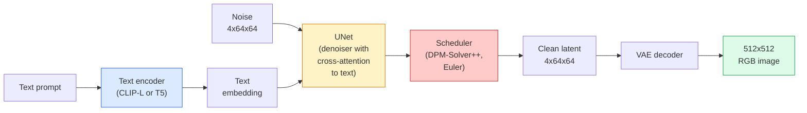

# स्थिर विसारण  वास्तुकला और ठीक-ठीक समायोजन

> स्थिर विसारण एक DDPM जो एक पूर्व प्रशिक्षित के लटके स्थान में चलता है VAE, क्रॉस-अटेंशन के माध्यम से पाठ पर संचालित, त्वरित निर्धारक के साथ नमूना ODE समाधानकर्ता, और वर्गीकरणकर्ता मुक्त मार्गदर्शन द्वारा निर्देशित।

**Type:** Learn + Use
**Languages:** Python
**Prerequisites:** Phase 4 Lesson 10 (Diffusion), Phase 7 Lesson 02 (Self-Attention)
**Time:** ~75 minutes

## सीखने के लक्ष्य

- एक स्थिर विसारण पाइपलाइन के पांच टुकड़ों का पता लगाएंः VAE, पाठ एन्कोडर, यू-नेट, शेड्यूलर, सुरक्षा परीक्षक  और उनमें से प्रत्येक वास्तव में क्या करता है
- लटेंट विसारण और 4x64x64 लटेंट स्थान (3x512x512 छवि के बजाय) में प्रशिक्षण से गुणवत्ता हानि के बिना गणना 48 गुना कम क्यों होती है, इसकी व्याख्या करें
- उपयोग `diffusers` चित्र उत्पन्न करने, छवि-से-छवि चलाने, इनपेंटिंग करने और ControlNet-guided पीढ़ी
- ठीक-ठीक स्थिर विसारण LoRA एक छोटे से कस्टम डेटासेट पर लोड करें LoRA अनुमान पर एडाप्टर

## समस्या

प्रशिक्षण ए DDPM सीधे 512x512 पर RGB प्रत्येक प्रशिक्षण कदम एक यू-नेट के माध्यम से वापस props जो 3 देखता हैx512x512 = 786,432 input valuesस्थिर विसारण 1.5 (रिलीज़ 2022), पिक्सेल-स्थान विसारण के बारे में 256 की आवश्यकता होगी GPU-months प्रशिक्षण और प्रति छवि 10-30 सेकंड पर एक उपभोक्ता पर GPU.

ट्रिक जो ओपन वेट टेक्स्ट-टू-इमेज को व्यावहारिक बना दिया **लटेंट फैलाव** (रॉम्बाच तथा अन्य, CVPR 2022) ट्रेन ए VAE जो एक 3x512x512 छवि को एक 4x64x64 लटेंट Tensor और वापस मैप करता है, तो उस लटेंट अंतरिक्ष में फैलाव करें. गणना ड्रॉप द्वारा `(3*512*512)/(4*64*64) = 48x`. नमूनाकरण एक ही पर दशकों से सेकंड से दो सेकंड से कम हो जाता है GPU.

लगभग हर आधुनिक छवि-उत्पादन मॉडल SDXL, SD3, FLUX, HunyuanDiT, Wan-Video  एक लटेंट विसारण मॉडल है जो ऑटोकोडर, डेनोइज़र (U-Net या DiT), और पाठ की स्थिति। स्थिर विसारण सीखें और आप टेम्पलेट सीख चुके हैं।

## अवधारणा

### पाइपलाइन



- **VAE** ठंढ ऑटोकोडर। एन्कोडर छवि को लटेंट्स में बदल देता है (उपयोग किया जाता है img2img डिकोडर लटेंट्स को एक छवि में वापस बदल देता है।
- **पाठ एन्कोडर** — CLIP पाठ एन्कोडर (SD 1.x/2.x), CLIP-L + CLIP-G (SDXL), या T5-XXL (SD3/FLUX) टोकन एम्बेडमेंट का एक अनुक्रम उत्पन्न करता है।
- **U-Net** डेनोइज़र. इसमें क्रॉस-एटेंशन लेयर हैं जो हर रिज़ॉल्यूशन लेवल पर एम्बेडेड टेक्स्ट के लिए लटेंट से आते हैं।
- **अनुसूचक** नमूना लेने का एल्गोरिथ्म (DDIM, यूलर, DPM-Solver++) सिग्मा चुनता है, मिश्रण भविष्यवाणी शोर वापस लटेंट में.
- **सुरक्षा जांचकर्ता** वैकल्पिक NSFW / आउटपुट छवि पर अवैध सामग्री फ़िल्टर।

### वर्गीकरण मुक्त मार्गदर्शन (CFG)

सादा पाठ कंडीशनिंग सीखता है `epsilon_theta(x_t, t, c)` हर एक फ़रमान के लिए `c`. CFG एक ही नेटवर्क के साथ ट्रेनों `c` 10% समय में गिरावट (एक खाली एम्बेडिंग द्वारा प्रतिस्थापित) दी गई, एक एकल मॉडल जो सशर्त और अवशर्त शोर दोनों की भविष्यवाणी करता है। निष्कर्ष परः

```
eps = eps_uncond + w * (eps_cond - eps_uncond)
```

`w` मार्गदर्शन पैमाने है। `w=0` बिना शर्त है, `w=1` स्पष्ट रूप से शर्त है, `w>1` विविधता की कीमत पर "उत्पाद को शीघ्रता पर अधिक संचालित" करने की ओर धक्का देता है। SD डिफ़ॉल्ट है `w=7.5`.

CFG यह कारण है कि पाठ-से-छवि उत्पादन की गुणवत्ता पर काम करता है। इसके बिना, आउटपुट को कमजोर रूप से पूर्वाग्रह से प्रेरित करता है; इसके साथ, प्रॉम्प्ट हावी होते हैं।

### लटेंट स्पेस ज्यामिति

इन VAE4-चैनल लटेंट सिर्फ एक संपीड़ित छवि नहीं है। यह एक बहुविध है जहां अंकगणित लगभग अर्थिक संपादन से मेल खाता है (प्रोम्प्ट इंजीनियरिंग + इंटरपोलेशन दोनों यहां रहते हैं), और जहां प्रसार यू-नेट को अपने पूरे मॉडलिंग बजट को खर्च करने के लिए प्रशिक्षित किया गया है। एक यादृच्छिक 4x64x64 लटेंट को डिकोड करने से एक यादृच्छिक दिखने वाली छवि नहीं होती है  यह कचरा पैदा करती है, क्योंकि केवल लटेंट्स का एक विशिष्ट उप-विविधता वैध छवियों को डिकोड करती है।

दो परिणाम:

1. **Img2img** = छवि को लटेंट में एन्कोड करें, आंशिक शोर जोड़ें, डेनोइज़र चलाएं, डिकोड करें। छवि संरचना जीवित रहती है क्योंकि एन्कोडिंग लगभग उलटनीय है; प्रॉम्प्ट के आधार पर सामग्री बदलती है।
2. **पेंटिंग** = समान img2img लेकिन डीनोइज़र केवल छिपे हुए क्षेत्रों को अपडेट करता है; अनमास्केड क्षेत्रों को एन्कोडेड लटेंट में रखा जाता है।

### यू-नेट वास्तुकला

इन SD यू-नेट एक बड़ा संस्करण है TinyUNet पाठ 10 से तीन अतिरिक्त के साथः

- **ट्रांसफार्मर ब्लॉक** प्रत्येक स्थानिक संकल्प पर, स्वयं-विचार + पाठ एम्बेडिंग पर पार-विचार शामिल है।
- **समय सम्मिलित करना** द्वारा MLP सिनोसॉइडल एन्कोडिंग पर।
- **कनेक्शन को छोड़ें** एक संगत संकल्प पर एन्कोडर और डिकोडर के बीच।

कुल मापदंडों में SD 1.5: ~860M. SDXL: ~2.6B. FLUXपारम में कूद ज्यादातर ध्यान परतों में होता है।

### LoRA ठीक से ट्यूनिंग

स्थिर विसारण की पूर्ण सूक्ष्म समायोजन की आवश्यकता 20+ GB के VRAM और 860M मापदंडों को अद्यतन करता है। LoRA (कम रैंक अनुकूलन) आधार मॉडल को जमे रखता है और ध्यान परतों में छोटे रैंक-विघटन मैट्रिक्स इंजेक्ट करता है। LoRA के लिए एडाप्टर SD आमतौर पर 10-50 होता है MB, एक उपभोक्ता पर 10-60 मिनट में ट्रेनें GPU, और एक ड्रॉप-इन संशोधन के रूप में निष्कर्ष समय पर लोड करता है।

```
Original: W_q : (d_in, d_out)   frozen
LoRA:     W_q + alpha * (A @ B)   where A : (d_in, r), B : (r, d_out)

r is typically 4-32.
```

LoRA यह है कि लगभग हर समुदाय की बारीक-टीप वितरित किया जाता है। CivitAI और गले लगाने वाले चेहरे में लाखों लोग हैं।

### कार्यक्रम आप देखेंगे

- **DDIM** निर्धारक, ~50 कदम, सरल।
- **यूलर पूर्वज** स्टोकास्टिक, 30-50 कदम, थोड़ा अधिक रचनात्मक नमूने।
- **DPM-Solver++ 2 एम कार्रास** निर्धारक, 20-30 कदम, उत्पादन डिफ़ॉल्ट।
- **LCM / TCD / टर्बो** स्थिरता मॉडल और डिस्टिल किए गए वेरिएंट; कुछ गुणवत्ता की कीमत पर 1-4 कदम।

शेड्यूलर स्विचिंग एक पंक्ति परिवर्तन है `diffusers` और कभी कभी किसी भी पुनर्व्यवस्था के बिना नमूना समस्याओं को ठीक करता है।

```figure
cv3-latent-compression
```

## इसे बनाओ

इस पाठ में उपयोग किया जाता है `diffusers` अंत से अंत के बजाय नए सिरे से स्थिर विसारण का निर्माण करें।VAE, पाठ एन्कोडर, यू-नेट, शेड्यूलर) अपने स्वयं के पाठ के विषय हैं; यहाँ लक्ष्य उत्पादन के साथ धाराप्रवाहता है API.

### चरण 1: पाठ से छवि

```python
import torch
from diffusers import StableDiffusionPipeline

pipe = StableDiffusionPipeline.from_pretrained(
    "runwayml/stable-diffusion-v1-5",
    torch_dtype=torch.float16,
).to("cuda")

image = pipe(
    prompt="a dog riding a skateboard in tokyo, studio ghibli style",
    guidance_scale=7.5,
    num_inference_steps=25,
    generator=torch.Generator("cuda").manual_seed(42),
).images[0]
image.save("dog.png")
```

`float16` आधा VRAM बिना किसी दृश्यमान गुणवत्ता हानि के। `num_inference_steps=25` डिफ़ॉल्ट के साथ DPM-Solver++ जुआ `num_inference_steps=50` के साथ DDIM.

### चरण 2: शेड्यूलर को बदलें

```python
from diffusers import DPMSolverMultistepScheduler, EulerAncestralDiscreteScheduler

pipe.scheduler = DPMSolverMultistepScheduler.from_config(pipe.scheduler.config)
pipe.scheduler = EulerAncestralDiscreteScheduler.from_config(pipe.scheduler.config)
```

अनुसूचक राज्य U-नेट वजन से अलग है. आप पर प्रशिक्षण कर सकते हैं DDPM और किसी भी शेड्यूलर के साथ नमूना।

### चरण 3: छवि-प्रति छवि

```python
from diffusers import StableDiffusionImg2ImgPipeline
from PIL import Image

img2img = StableDiffusionImg2ImgPipeline.from_pretrained(
    "runwayml/stable-diffusion-v1-5",
    torch_dtype=torch.float16,
).to("cuda")

init_image = Image.open("dog.png").convert("RGB").resize((512, 512))
out = img2img(
    prompt="a dog riding a skateboard, oil painting",
    image=init_image,
    strength=0.6,
    guidance_scale=7.5,
).images[0]
```

`strength` यह है कि डीनोइज़िंग से पहले कितना शोर जोड़ना है (0.0 = अपरिवर्तित, 1.0 = पूर्ण पुनर्जनन) ।

### चरण 4: पेंटिंग

```python
from diffusers import StableDiffusionInpaintPipeline

inpaint = StableDiffusionInpaintPipeline.from_pretrained(
    "runwayml/stable-diffusion-inpainting",
    torch_dtype=torch.float16,
).to("cuda")

image = Image.open("dog.png").convert("RGB").resize((512, 512))
mask = Image.open("dog_mask.png").convert("L").resize((512, 512))

out = inpaint(
    prompt="a cat",
    image=image,
    mask_image=mask,
    guidance_scale=7.5,
).images[0]
```

मास्क में सफेद पिक्सल पुनर्जनन के लिए क्षेत्र हैं. काले पिक्सल संरक्षित हैं.

### चरण 5: LoRA लोड

```python
pipe.load_lora_weights("sayakpaul/sd-lora-ghibli")
pipe.fuse_lora(lora_scale=0.8)

image = pipe(prompt="a village square in ghibli style").images[0]
```

`lora_scale` नियंत्रण बल; 0.0 = कोई प्रभाव नहीं, 1.0 = पूर्ण प्रभाव। `fuse_lora` गति के लिए जगह में वजन में एडाप्टर बेक करता है, लेकिन swapping रोकता है। `pipe.unfuse_lora()` एक अलग एडाप्टर लोड करने से पहले।

### चरण 6: LoRA प्रशिक्षण (स्केच)

वास्तविक LoRA प्रशिक्षण जीवन में `peft` या `diffusers.training`. . . . . . . . . . . . . . . . . . . . . . . . . . . . . . . . . . . . . . . . . . . . . . . . . . . . . . . . . . . . . . . . . . . . . . . . . . . . . . . . . . . . . . . . . . . . . . . . . . . . . . . . . . . . . . . . . . . . . . . . . . . . . . . . . . . . . . . . . . . . . . . . . . . . . . . . . . . . . . . . . . . . . . . . . . . . . . . . . . . . . . . . . . . . . . . . . . . . . . . . . . . . . . . . . . . . . . . . . . . . . . . . . . . . . . . . . . . . . . . . . . . . . . . . . . . . . . . . . . . . . . . . . . . . . . . . . . . . . . . . . . . . . . . . . . . . . . . . . . . . . . . . . . . . . . . . . . . . . . . . . . . . . . . . . . . . . . . . . . . . . . . . . . . . . . . . . . . . . . . . . . . . . . . . . . . . . . . . . . . . . . . . . . . . . . . . . . . . . . . . . . . . . . . . . . . . . . . . . . . . . . . . . . . . . . . . . . . . . . . . . . . . . . . . . . . . . . . . . . . . . . . . . . . . . . . . . . . . . . . . . . . . . . . . . . . . . . . . . . . . . . . . . . . . . . .

```python
# Pseudocode
for step, batch in enumerate(dataloader):
    images, prompts = batch
    latents = vae.encode(images).latent_dist.sample() * 0.18215

    t = torch.randint(0, num_train_timesteps, (batch_size,))
    noise = torch.randn_like(latents)
    noisy_latents = scheduler.add_noise(latents, noise, t)

    text_emb = text_encoder(tokenizer(prompts))

    pred_noise = unet(noisy_latents, t, text_emb)  # LoRA weights injected here

    loss = F.mse_loss(pred_noise, noise)
    loss.backward()
    optimizer.step()
```

केवल LoRA मैट्रिक्स ग्रेडिएंट प्राप्त करते हैं; आधार यू-नेट, VAEबैच आकार 1 और ग्रेडिएंट चेकपोइंटिंग के साथ यह 8 में फिट बैठता है GB के VRAM.

## इसका प्रयोग करें

उत्पादन में, आप वास्तव में जो निर्णय लेते हैंः

- **मॉडल परिवार**: SD 1.5 ओपन सोर्स समुदाय के फाइन-ट्यून्स के लिए, SDXL उच्च निष्ठा के लिए, SD3 / FLUX अत्याधुनिक और सख्त लाइसेंसिंग आवश्यकताओं के लिए।
- **अनुसूचक**: DPM-Solver++ 20 से 30 कदम के लिए 2M Karras, LCM-LoRA जब विलंबता 1 से कम हो।
- **सटीकता**: `float16` 4080/4090 पर, `bfloat16` पर A100 और नए, `int8` (मार्फत `bitsandbytes` या `compel`) जब VRAM यह तंग है.
- **कंडीशनिंग**: सादा पाठ कार्य करता है; अधिक मजबूत नियंत्रण के लिए, जोड़ें ControlNet (कैन, गहराई, मुद्रा) बेस पाइपलाइन के शीर्ष पर.

बैच पीढ़ी के लिए, `AUTO1111` / `ComfyUI` उत्पादन के लिए सामुदायिक उपकरण हैं APIs, `diffusers` + `accelerate` या `optimum-nvidia` के साथ TensorRT संकलन।

## इसे भेजें

इस पाठ से उत्पन्न होता हैः

- `outputs/prompt-sd-pipeline-planner.md` एक संकेत जो चुनता है SD 1.5 / SDXL / SD3 / FLUX साथ ही समय निर्धारित करने वाला और सटीकता लटेंसी बजट, निष्ठा लक्ष्य और लाइसेंसिंग प्रतिबंध को देखते हुए।
- `outputs/skill-lora-training-setup.md` एक कौशल जो एक पूर्ण लिखता है LoRA कस्टम डेटासेट के लिए प्रशिक्षण कॉन्फ़िग जिसमें कैप्शन, रैंक, बैच आकार और सीखने की दर शामिल है।

## व्यायाम

1. **(Easy)** के साथ एक ही संकेत उत्पन्न करें `guidance_scale` में `[1, 3, 5, 7.5, 10, 15]`. चित्र कैसे बदलता है, इसका वर्णन करें. कलाकृतियों का मार्गदर्शन मूल्य क्या है?
2. **(Medium)** किसी भी असली तस्वीर लें, इसे पार करें `StableDiffusionImg2ImgPipeline` पर `strength` में `[0.2, 0.4, 0.6, 0.8, 1.0]`. . किस ताकत शैली बदलते हुए रचना को संरक्षित करता है? 1.0 पूरी तरह से इनपुट को अनदेखा क्यों करता है?
3. **(Hard)** ट्रेन ए LoRA एक ही विषय (एक पालतू जानवर, एक लोगो, एक चरित्र) की 10-20 छवियों पर और उन विषय के साथ नए दृश्य उत्पन्न करें। LoRA इनपुट छवियों के लिए अति-अनुकूलन के बिना सर्वोत्तम पहचान संरक्षण का उत्पादन करने वाले रैंक और प्रशिक्षण चरण।

## प्रमुख शर्तें

| अवधि | लोग क्या कहते हैं | इसका क्या मतलब है |
|------|----------------|----------------------|
| लातेंट फैलाव | "लटेंट में विरक्तता" | पूरे को चलाएं DDPM में VAE पिक्सेल स्थान (3x512x512) के बजाय लटते स्थान (4x64x64); 48x कम्प्यूटिंग बचत |
| VAE पैमाने का कारक | "0.18215" | निरंतर जो पुनरावृत्ति VAEकच्चे लटेंट लगभग इकाई भिन्नता; हर में हार्ड कोड SD पाइपलाइन |
| वर्गीकरणकर्ता मुक्त मार्गदर्शन | "CFG" | शोर की सशर्त और असीमित भविष्यवाणियों को मिलाएं; सबसे प्रभावशाली एकल निष्कर्ष बटन |
| अनुसूचक | "सैम्पलर" | एल्गोरिथ्म जो शोर + मॉडल भविष्यवाणियों को एक denoised लटेंट ट्रैक्टोरिया में बदल देता है |
| LoRA | "कम श्रेणी के एडाप्टर" | रैंक-विघटन मैट्रिक्स जो आधार भार को छूने के बिना ध्यान परतों को ठीक से समायोजित करते हैं |
| पार ध्यान | "टेक्स्ट-इमेज पर ध्यान दें" | लटेंट टोकन से टेक्स्ट टोकन तक ध्यान; प्रत्येक यू-नेट स्तर पर त्वरित जानकारी इंजेक्ट करता है |
| ControlNet | "संरचना कंडीशनिंग" | एक अलग से प्रशिक्षित एडाप्टर जो स्टीयरिंग करता है SD अतिरिक्त इनपुट (कैन, गहराई, आसन, खंडन) के साथ |
| DPM-Solver++ | "डिफ़ॉल्ट शेड्यूलर" | द्वितीय क्रम की निर्धारक ODE 2026 में कम चरणों की गिनती (20-30) पर सबसे अच्छी गुणवत्ता |

## आगे पढ़ना

- [लातेंट विसारण के साथ उच्च-रिज़ॉल्यूशन छवि संश्लेषण (रोम्बाच एट अल., 2022)](https://arxiv.org/abs/2112.10752) स्थिर विसारक कागज; जिसमें प्रत्येक अपघटन शामिल है जो डिजाइन को उचित ठहराती है
- [वर्गीकरणकर्ता मुक्त प्रसार मार्गदर्शन (Ho & Salimans, 2022)](https://arxiv.org/abs/2207.12598)  CFG कागज
- [LoRA: बड़े भाषा मॉडल के निम्न-रैंक अनुकूलन (Hu et al., 2021)](https://arxiv.org/abs/2106.09685) — LoRA था NLP-first; यह स्थानांतरित कर दिया गया SD लगभग कोई परिवर्तन नहीं
- [विसारक प्रलेखन](https://huggingface.co/docs/diffusers) प्रत्येक संदर्भ के लिए SD / SDXL / SD3 / FLUX पाइपलाइन
