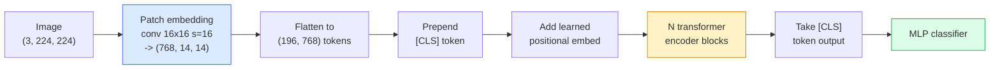

# दृष्टि परिवर्तनक (ViT)

> छवि को पैच में काटें, प्रत्येक पैच को एक शब्द के रूप में देखें, एक मानक ट्रांसफार्मर चलाएं. पीछे मत देखो.

**Type:** Build
**Languages:** Python
**Prerequisites:** Phase 7 Lesson 02 (Self-Attention), Phase 4 Lesson 04 (Image Classification)
**Time:** ~45 minutes

## सीखने के लक्ष्य

- न्यूनतम बनाने के लिए पैच एम्बेडिंग, सीखे गए स्थिति एम्बेडिंग, वर्ग टोकन और ट्रांसफार्मर एन्कोडर ब्लॉक को खरोंच से लागू करें ViT
- क्यों बताएँ ViT माना गया था कि जब तक DeiT और MAE अन्यथा सिद्ध
- तुलना करें ViT, स्विन, और ConvNeXt अपने वास्तुशिल्प पूर्वजों पर (कोई नहीं, स्थानीय खिड़की ध्यान, कन्व्ह रीढ़ की हड्डी)
- एक पूर्व प्रशिक्षित ठीक-ठीक ViT एक छोटे से डेटासेट पर उपयोग `timm` और मानक रैखिक-संड / बारीक-ट्यूनिंग नुस्खा

## समस्या

एक दशक तक, संकुचन कंप्यूटर दृष्टि के पर्याय था। CNNs दोसोविट्स्की और अन्य (2020) ने दिखाया कि सपाट छवि पैचों पर लागू एक साधारण ट्रांसफार्मर, बिना किसी घुमावदार मशीन के, सबसे अच्छा मेल या हरा सकता है CNNs पैमाने पर।

यह पकड़ "मात्रा पर" थी। ViT पर ImageNet-1k खो गया ResNet. ViT पूर्व प्रशिक्षित ImageNet-21k या JFT-300M फिर ठीक से सुसंगत ImageNet-1k इस निष्कर्ष पर आया कि ट्रांसफार्मरों में उपयोगी पूर्वानुमानों की कमी थी लेकिन पर्याप्त डेटा से उन्हें सीख सकते थे।DeiT, MAE, DINO) ने दिखाया कि सही प्रशिक्षण व्यंजनों के साथ  मजबूत वृद्धि, आत्म-निरीक्षण पूर्व प्रशिक्षण, डिस्टिलिशन ViTs छोटे डेटा पर भी ठीक प्रशिक्षण।

2026 तक, शुद्ध CNNs किनारे उपकरणों पर अभी भी प्रतिस्पर्धी हैं (ConvNeXt सबसे मजबूत है), लेकिन ट्रांसफार्मर बाकी सब कुछ पर हावी हैंः खंडन (Mask2Former, SegFormer), पता लगाने (DETR, RT-DETR), बहुआयामी (CLIP, SigLIP), वीडियो (VideoMAE, VJEPA) । ViT ब्लॉक संरचना को जानने के लिए एक है।

## अवधारणा

### पाइपलाइन



सात चरणों. पैच -> टोकन -> ध्यान -> वर्गीकरण. प्रत्येक संस्करण (DeiT, स्विन, ConvNeXt, MAE पूर्व प्रशिक्षण) में से एक या दो को बदल देता है और बाकी को अकेला छोड़ देता है।

### पैच एम्बेडिंग

पहला कन्भ रहस्य है. कर्नेल आकार 16, चरण 16, तो एक 224x224 छवि 16x16 पैचों की 14x14 ग्रिड बन जाती है, प्रत्येक 768-dim एम्बेडिंग के लिए प्रक्षेपित। यह एकल कन्भ दोनों पैच करता है और रैखिक रूप से प्रोजेक्ट करता है।

```
Input:  (3, 224, 224)
Conv (3 -> 768, k=16, s=16, no padding):
Output: (768, 14, 14)
Flatten spatial: (196, 768)
```

196 patches = 196 प्रत्येक टोकन का विशेषता आयाम 768 है (ViT-B), 1024 (ViT-L), या 1280 (ViT-H).

### वर्ग टोकन

एक एकल सीखा वेक्टर अनुक्रम के लिए तैयार किया गयाः

```
tokens = [CLS; patch_1; patch_2; ...; patch_196]   shape (197, 768)
```

N ट्रांसफार्मर ब्लॉक के बाद, `[CLS]` आउटपुट वैश्विक छवि प्रतिनिधित्व है। वर्गीकरण सिर केवल इस एक वेक्टर पढ़ता है।

### स्थितिगत सम्मिलन

ट्रांसफार्मर में स्थानिक स्थिति का कोई अंतर्निहित विचार नहीं है। प्रत्येक टोकन में एक सीखा वेक्टर जोड़ेंः

```
tokens = tokens + learned_pos_embedding   (also shape (197, 768))
```

एम्बेडिंग मॉडल का एक पैरामीटर है; ग्रेडिएंट आधारित प्रशिक्षण इसे 2D छवि संरचना के अनुकूल बनाता है। सिनोसाइडल 2D विकल्प मौजूद हैं लेकिन अभ्यास में शायद ही कभी उपयोग किए जाते हैं।

### ट्रांसफार्मर एन्कोडर ब्लॉक

मानक, बहु-मुख्य आत्म-विचार, MLP, अवशिष्ट कनेक्शन, पूर्व-LayerNorm.

```
x = x + MSA(LN(x))
x = x + MLP(LN(x))

MLP is two-layer with GELU: Linear(d -> 4d) -> GELU -> Linear(4d -> d)
```

ViT-B/16 इन ब्लॉक के 12 स्टैक, प्रत्येक में 12 ध्यान सिर, कुल 86M पैरामीटर के साथ।

### क्यों पूर्व-LN

प्रारंभिक ट्रांसफार्मर पोस्ट-LN (`x = LN(x + sublayer(x))`) और बिना वार्मिंग के 6-8 परतों के बाद प्रशिक्षण के लिए संघर्ष किया।LN (`x = x + sublayer(LN(x))`) गहरे नेटवर्क को गर्म किए बिना स्थिर रूप से ट्रेन करता है। ViT और हर आधुनिक LLM उपयोग करता हैLN.

### पैच आकार का व्यापार-बदला

- 16x16 patches -> 196 tokens, standard.
- 32x32 पैच -> 49 टोकन, तेज लेकिन कम संकल्प.
- 8x8 पैच -> 784 टोकन, ठीक लेकिन O(n^2) ध्यान लागत पैमाने बुरी तरह से.

बड़ा patches = fewer tokens = faster लेकिन कम स्थानिक विवरण. SwinV2 पदानुक्रमिक खिड़कियों में 4x4 पैच का उपयोग करता है।

### DeiTप्रशिक्षण के लिए नुस्खा ViT पर ImageNet-1k

मूल ViT आवश्यक JFT-300M पीटने के लिए CNNs. DeiT (टौव्रोन एट अल, 2020) प्रशिक्षित ViT-B 81.8% तक शीर्ष-1 पर ImageNet-1k केवल चार परिवर्तनों के साथः

1. भारी वृद्धिः RandAugment, मिश्रण, CutMix, यादृच्छिक मिटाने.
2. स्टोकास्टिक गहराई (प्रशिक्षण के दौरान पूरी ब्लॉक को यादृच्छिक रूप से गिरा दें) ।
3. दोहराया गया बढ़ाव (एक बैच पर 3 बार एक ही छवि का नमूना लिया गया) ।
4. एक से डिस्टिलिशन CNN शिक्षक (वैकल्पिक, सटीकता को और बढ़ाता है) ।

हर आधुनिक ViT प्रशिक्षण नुस्खा से आता है DeiT.

### स्विन बनाम ConvNeXt

- **स्विन** (Liu et al., 2021)  खिड़की आधारित ध्यान. प्रत्येक ब्लॉक एक स्थानीय खिड़की के भीतर भाग लेता है; बारी-बारी से ब्लॉक खिड़की को खिड़की के माध्यम से जानकारी मिश्रण करने के लिए स्थानांतरित करते हैं। CNN-like ध्यान ऑपरेटर को बनाए रखते हुए स्थानिकता पूर्व।
- **ConvNeXt** (Liu et al., 2022)  पुनः डिजाइन CNN जो स्विन के वास्तुकला विकल्पों (गहनता convs, LayerNorm, GELUउन्होंने दिखाया कि अंतर "ध्यान बनाम संभल" नहीं है बल्कि "आधुनिक प्रशिक्षण नुस्खा + वास्तुकला" है।

2026 में, ConvNeXt-V2 और स्विन-V2 दोनों उत्पादन-ग्रेड हैं; सही विकल्प आपके निष्कर्ष स्टैक पर निर्भर करता है (ConvNeXt (अर्थात, यह एक अच्छी तरह से तैयार करने के लिए बेहतर है) और पूर्व प्रशिक्षण corpus.

### MAE पूर्व प्रशिक्षण

मास्क ऑटोकोडर (He et al., 2022): यादृच्छिक रूप से 75% पैचों को मास्क करें, एन्कोडर को केवल दृश्यमान 25% को संसाधित करने के लिए प्रशिक्षित करें, एन्कोडर के आउटपुट से मास्क किए गए पैचों को पुनर्निर्माण करने के लिए एक छोटे से डिकोडर को प्रशिक्षित करें। प्री-ट्रेनिंग के बाद, डिकोडर को त्याग दें और एन्कोडर को ठीक से ट्यून करें।

MAE करता है ViT प्रशिक्षण ImageNet-1k अकेले, हिट SOTA, और वर्तमान डिफ़ॉल्ट स्व-निरीक्षण नुस्खा है।

```figure
batchnorm-inference
```

## इसे बनाओ

### चरण 1: पैच एम्बेडिंग

```python
import torch
import torch.nn as nn

class PatchEmbedding(nn.Module):
    def __init__(self, in_channels=3, patch_size=16, dim=192, image_size=64):
        super().__init__()
        assert image_size % patch_size == 0
        self.proj = nn.Conv2d(in_channels, dim, kernel_size=patch_size, stride=patch_size)
        num_patches = (image_size // patch_size) ** 2
        self.num_patches = num_patches

    def forward(self, x):
        x = self.proj(x)
        return x.flatten(2).transpose(1, 2)
```

एक कन्वि, एक फ्लैट, एक ट्रांसपोज. यह पूरी छवि-से-टोकन कदम है.

### चरण 2: ट्रांसफार्मर ब्लॉक

पूर्व-LN, बहु-मुख्य आत्म-विचार, MLP के साथ GELU, अवशिष्ट कनेक्शन।

```python
class Block(nn.Module):
    def __init__(self, dim, num_heads, mlp_ratio=4, dropout=0.0):
        super().__init__()
        self.ln1 = nn.LayerNorm(dim)
        self.attn = nn.MultiheadAttention(dim, num_heads, dropout=dropout, batch_first=True)
        self.ln2 = nn.LayerNorm(dim)
        self.mlp = nn.Sequential(
            nn.Linear(dim, dim * mlp_ratio),
            nn.GELU(),
            nn.Dropout(dropout),
            nn.Linear(dim * mlp_ratio, dim),
            nn.Dropout(dropout),
        )

    def forward(self, x):
        a, _ = self.attn(self.ln1(x), self.ln1(x), self.ln1(x), need_weights=False)
        x = x + a
        x = x + self.mlp(self.ln2(x))
        return x
```

`nn.MultiheadAttention` सिरों में विभाजन, स्केल बिंदु उत्पाद, और आउटपुट प्रक्षेपण को संभालता है। `batch_first=True` तो आकार हैं `(N, seq, dim)`.

### चरण 3: ViT

```python
class ViT(nn.Module):
    def __init__(self, image_size=64, patch_size=16, in_channels=3,
                 num_classes=10, dim=192, depth=6, num_heads=3, mlp_ratio=4):
        super().__init__()
        self.patch = PatchEmbedding(in_channels, patch_size, dim, image_size)
        num_patches = self.patch.num_patches
        self.cls_token = nn.Parameter(torch.zeros(1, 1, dim))
        self.pos_embed = nn.Parameter(torch.zeros(1, num_patches + 1, dim))
        self.blocks = nn.ModuleList([
            Block(dim, num_heads, mlp_ratio) for _ in range(depth)
        ])
        self.ln = nn.LayerNorm(dim)
        self.head = nn.Linear(dim, num_classes)
        nn.init.trunc_normal_(self.pos_embed, std=0.02)
        nn.init.trunc_normal_(self.cls_token, std=0.02)

    def forward(self, x):
        x = self.patch(x)
        cls = self.cls_token.expand(x.size(0), -1, -1)
        x = torch.cat([cls, x], dim=1)
        x = x + self.pos_embed
        for blk in self.blocks:
            x = blk(x)
        x = self.ln(x[:, 0])
        return self.head(x)

vit = ViT(image_size=64, patch_size=16, num_classes=10, dim=192, depth=6, num_heads=3)
x = torch.randn(2, 3, 64, 64)
print(f"output: {vit(x).shape}")
print(f"params: {sum(p.numel() for p in vit.parameters()):,}")
```

लगभग 2.8M पैरामीटर  एक छोटा सा ViT पर ट्रीट करने योग्य CPU. वास्तविक ViT-B 86M है; उसी वर्ग की परिभाषा के साथ `dim=768, depth=12, num_heads=12`.

### चरण 4: मानसिकता जांच  एकल छवि निष्कर्ष

```python
logits = vit(torch.randn(1, 3, 64, 64))
print(f"logits: {logits}")
print(f"probs:  {logits.softmax(-1)}")
```

त्रुटि के बिना चलना चाहिए. संभावनाओं का योग 1 है.

## इसका प्रयोग करें

`timm` जहाजों को ViT के साथ संस्करण ImageNet पूर्व-प्रशिक्षित वजन. एक पंक्तिः

```python
import timm

model = timm.create_model("vit_base_patch16_224", pretrained=True, num_classes=10)
```

`timm` 2026 में दृष्टि परिवर्तनकों के लिए उत्पादन डिफ़ॉल्ट है। ViT, DeiT, स्विन, स्विन...V2, ConvNeXt, ConvNeXt-V2, MaxViT, MViT, EfficientFormer, और उसी के तहत अन्य दर्जनों API.

बहु-मॉडल कार्य के लिए (छवि + पाठ), `transformers` जहाज CLIP, SigLIP, BLIP-2, LLaVA. उन सभी में छवि एन्कोडर एक है ViT संस्करण।

## इसे भेजें

इस पाठ से उत्पन्न होता हैः

- `outputs/prompt-vit-vs-cnn-picker.md` एक संकेत जो एक के बीच चयन करता है ViT, एक ConvNeXt, या डेटासेट आकार, गणना और निष्कर्ष स्टैक के आधार पर एक स्विन।
- `outputs/skill-vit-patch-and-pos-embed-inspector.md` एक कौशल जो एक ViTपैच एम्बेडिंग और स्थितित्मक एम्बेडिंग के आकार मॉडल की अपेक्षित अनुक्रम लंबाई से मेल खाते हैं, सबसे आम पोर्टिंग बग को पकड़ते हैं।

## व्यायाम

1. **(Easy)** छोटे से माध्यम से आगे जाने के लिए प्रत्येक मध्यवर्ती tensor के आकार प्रिंट ViT पुष्टिः इनपुट `(N, 3, 64, 64)` -> patches `(N, 16, 192)` -> के साथ CLS `(N, 17, 192)` -> classifier input `(N, 192)` -> output `(N, num_classes)`.
2. **(Medium)** एक पूर्व प्रशिक्षित ठीक-ठीक `timm` ViT-S- 16 पर सिंथेटिक-CIFAR पाठ 4 से डेटासेट की तुलना करें ResNet-18 प्रशिक्षण समय और अंतिम सटीकता की रिपोर्ट करें।
3. **(Hard)** कार्यान्वयन MAE छोटे बच्चों के लिए पूर्व प्रशिक्षण ViT: 75% पैचों को मास्क करें, एन्कोडर को प्रशिक्षित करें + मास्क किए गए पैचों को पुनर्निर्माण करने के लिए एक छोटा डिकोडर। पूर्व-प्रशिक्षण और उसके बाद सिंथेटिक डेटा पर रैखिक-सॉन्ड सटीकता का मूल्यांकन करें।

## प्रमुख शर्तें

| अवधि | लोग क्या कहते हैं | इसका क्या मतलब है |
|------|----------------|----------------------|
| पैच एम्बेडिंग | "पहली conv" | कर्नेल के साथ एक कन्वर्ट size = stride = पैच आकार; छवि को टोकन एम्बेडमेंट की एक ग्रिड में बदल देता है |
| वर्ग टोकन | "[CLS]" | टोकन अनुक्रम के लिए पूर्वनिर्धारित एक सीखा वेक्टर; इसका अंतिम आउटपुट वैश्विक छवि प्रतिनिधित्व है |
| स्थितिगत सम्मिलन | "शिक्षित पोस" | एक सीखा वेक्टर प्रत्येक टोकन में जोड़ा गया ताकि ट्रांसफार्मर जानता है कि प्रत्येक पैच कहां से आया था |
| पूर्व-LN | "LayerNorm उपपरत से पहले" | स्थिर ट्रांसफार्मर संस्करणः `x + sublayer(LN(x))` इसके बजाय `LN(x + sublayer(x))` |
| बहु-मुख ध्यान | "समान ध्यान" | मानक ट्रांसफार्मर ध्यान संख्या_head स्वतंत्र उप-स्थानों में विभाजित, बाद में concatenated |
| ViT-B/16 | "बेस, पैच 16" | कैनोनिक आकारः dim=768, depth=12, heads=12, patch_size=16, image=224~ 86M पैराम |
| DeiT | "डेटा-कुशल ViT" | ViT प्रशिक्षित ImageNet-1k अकेले मजबूत वृद्धि के साथ; सिद्ध बड़े पूर्व प्रशिक्षण डेटासेट सख्ती से आवश्यक नहीं हैं |
| MAE | "मास्किंग ऑटोकोडर" | आत्म-निरीक्षण पूर्व प्रशिक्षणः 75% पैचों का मुखौटा, पुनर्निर्माण; प्रमुख ViT पूर्व प्रशिक्षण नुस्खा |

## आगे पढ़ना

- [एक छवि 16x16 शब्दों के लायक है (डोसोविट्स्की और अन्य, 2020)](https://arxiv.org/abs/2010.11929)  ViT कागज
- [DeiT: डेटा-कुशल छवि ट्रांसफार्मर (टौव्रोन एट अल, 2020)](https://arxiv.org/abs/2012.12877) कैसे प्रशिक्षित करें ViT पर ImageNet-1k अकेले
- [मास्क ऑटोकोडर स्केलेबल विजन लर्निंग हैं (He et al., 2022)](https://arxiv.org/abs/2111.06377) — MAE पूर्व प्रशिक्षण
- [समय पर दस्तावेज](https://huggingface.co/docs/timm) प्रत्येक दृष्टि परिवर्तनक के लिए संदर्भ जिसे आप उत्पादन में उपयोग करेंगे
