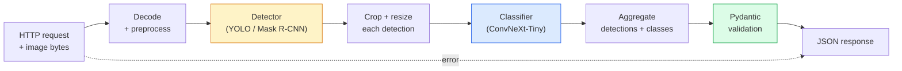

# एक पूर्ण दृष्टि पाइपलाइन का निर्माण करें  कैपस्टोन

> एक उत्पादन दृष्टि प्रणाली मॉडल और नियमों की एक श्रृंखला है जो डेटा अनुबंधों से सिलाई जाती है। टुकड़े पहले से ही इस चरण में हैं; कैपस्टोन उन्हें अंत से अंत तक एक साथ जोड़ता है।

**Type:** Build
**Languages:** Python
**Prerequisites:** Phase 4 Lessons 01-15
**Time:** ~120 minutes

## सीखने के लक्ष्य

- एक उत्पादन दृष्टि पाइपलाइन डिजाइन करें जो वस्तुओं का पता लगाता है, उन्हें वर्गीकृत करता है, और संरचित उत्सर्जन करता है JSON हर असफलता पथ से निपटने के साथ
- एक डिटेक्टर को प्लग करें (मास्क आर-CNN या YOLO), एक वर्गीकरणकर्ता (ConvNeXt-Tiny), और एक सेवा में डेटा अनुबंध (Pydantic)
- अंत-से-अंत पाइपलाइन का बेंचमार्क करें और पहला बोतल गला (आमतौर पर पूर्व प्रसंस्करण, फिर डिटेक्टर) की पहचान करें
- न्यूनतम जहाज FastAPI सेवा जो छवि अपलोड को स्वीकार करती है, पाइपलाइन चलाती है, और वर्गीकरण के साथ पता लगाने को लौटाती है

## समस्या

व्यक्तिगत दृष्टि मॉडल उपयोगी हैं; दृष्टि उत्पाद उनकी श्रृंखलाएं हैं। खुदरा शेल्फ ऑडिट एक डिटेक्टर प्लस एक उत्पाद वर्गीकरण प्लस एक मूल्य निर्धारण है।OCR पाइपलाइन. स्वायत्त ड्राइविंग एक 2D डिटेक्टर प्लस एक 3D डिटेक्टर प्लस एक सेगमेंटर प्लस एक ट्रैकर प्लस एक प्लानर है. एक चिकित्सा प्री-स्क्रीन एक सेगमेंटर प्लस एक क्षेत्र वर्गीकरण प्लस एक चिकित्सक है UI.

उन श्रृंखलाओं को तार करना है कि एक अलग करता है भाग है ML एक उत्पाद से प्रोटोटाइप। मॉडल के बीच प्रत्येक इंटरफ़ेस बग के लिए एक नया स्थान है। प्रत्येक निर्देशांक परिवर्तन, हर सामान्यीकरण, हर मास्क आकार परिवर्तन एक चुप विफलता उम्मीदवार है। एक पाइपलाइन अपने सबसे कमजोर इंटरफ़ेस के रूप में मजबूत है।

इस कपास्टोन न्यूनतम व्यवहार्य पाइपलाइन सेट करता हैः पता लगाने + वर्गीकरण + संरचित आउटपुट + एक सेवा परत। चरण 4 स्लॉट में बाकी सब कुछ इस कंकाल मेंः स्वैप मास्क R-CNN के लिए YOLOv8, एक जोड़ें OCR सिर, एक खंड शाखा जोड़ें, एक ट्रैकर जोड़ें। वास्तुकला स्थिर है; टुकड़े प्लग करने योग्य हैं।

## अवधारणा

### पाइपलाइन



दो मॉडल चरण महंगे हैं, जबकि पांच अन्य चरणों में कीड़े रहते हैं।

### Pydantic के साथ डेटा अनुबंध

प्रत्येक मॉडल सीमा एक टाइप वस्तु बन जाती है, जिससे चुपचाप विफलताएं जोर से होती हैं।

```
Detection(
    box: tuple[float, float, float, float],   # (x1, y1, x2, y2), absolute pixels
    score: float,                              # [0, 1]
    class_id: int,                             # from detector's label map
    mask: Optional[list[list[int]]],           # RLE-encoded if present
)

PipelineResult(
    image_id: str,
    detections: list[Detection],
    classifications: list[Classification],
    inference_ms: float,
)
```

जब एक डिटेक्टर बॉक्स वापस वापस `(cx, cy, w, h)` इसके बजाय `(x1, y1, x2, y2)`, Pydantic की सत्यापन सीमा पर विफल रहता है और आप तुरंत पता लगाने के बजाय एक डाउनस्ट्रीम फसल डिबग जो चुपचाप रिक्त क्षेत्रों को वापस देता है।

### जहां विलंबता जाती है

लगभग हर दृष्टि पाइपलाइन में तीन सत्य हैं:

1. **पूर्व प्रसंस्करण अक्सर सबसे बड़ा एकल ब्लॉक होता है।** डिकोडिंग JPEGs, रंग स्थानों को परिवर्तित करना, आकार बदलना  ये हैं CPU-bound और भूलना आसान है।
2. **डिटेक्टर हावी है GPU समय।** 70 से 90 प्रतिशत GPU समय पता लगाने के आगे पास में है।
3. **प्रसंस्करण के बाद (NMS, RLE कोड/डिकोड) पर सस्ता है GPU, महंगी पर CPU.** हमेशा वास्तविक लक्ष्य के साथ प्रोफ़ाइल.

वितरण को जानना ही अनुकूलन को प्राथमिकता सूची में बदल देता है।

### विफलता मोड

- **खाली पता लगाने** रिक्त सूची लौटाएं, दुर्घटनाग्रस्त न हों। लॉग.
- **सीमा से बाहर के बक्से** कटौती से पहले छवि आकार को क्लैंप करें।
- **छोटी-छोटी फसलों** वर्गीकरण के न्यूनतम इनपुट से छोटे बॉक्स के लिए वर्गीकरण छोड़ दें।
- **भ्रष्ट अपलोड** 400 प्रतिक्रिया के साथ एक विशिष्ट त्रुटि कोड, 500 नहीं।
- **नमूना लोड विफलता** सेवा शुरू करने पर विफलता, पहले अनुरोध पर नहीं।

एक उत्पादन पाइपलाइन इन सभी को बिना सामान्य लेखन के संभालती है `try/except` हर असफलता को एक नामित कोड और एक प्रतिक्रिया मिलती है।

### बैचिंग

एक उत्पादन सेवा कई ग्राहकों की सेवा करती है। अनुरोधों के बीच बैचिंग डिटेक्शन और वर्गीकरण पारगमन को गुणा करता है। व्यापारः एक बैच भरने की प्रतीक्षा करने से अतिरिक्त विलंबता। विशिष्ट सेटअपः 20ms तक के अनुरोध एकत्र करें, बैच एक साथ करें, प्रक्रिया करें, प्रतिक्रियाएं वितरित करें। `torchserve` और `triton` यह मूल रूप से करें; अनुमानित लोड के साथ छोटी सेवाएं अपने स्वयं के माइक्रो-बैचर को रोल करें।

```figure
v4-vision-pipeline
```

## इसे बनाओ

### चरण 1: डेटा अनुबंध

```python
from pydantic import BaseModel, Field
from typing import List, Optional, Tuple

class Detection(BaseModel):
    box: Tuple[float, float, float, float]
    score: float = Field(ge=0, le=1)
    class_id: int = Field(ge=0)
    mask_rle: Optional[str] = None


class Classification(BaseModel):
    detection_index: int
    class_id: int
    class_name: str
    score: float = Field(ge=0, le=1)


class PipelineResult(BaseModel):
    image_id: str
    detections: List[Detection]
    classifications: List[Classification]
    inference_ms: float
```

कोड के पांच सेकंड किसी भी गंभीर पाइपलाइन पर डिबगिंग के एक घंटे बचाता है।

### चरण 2: न्यूनतम पाइपलाइन वर्ग

```python
import time
import numpy as np
import torch
from PIL import Image

class VisionPipeline:
    def __init__(self, detector, classifier, class_names,
                 device="cpu", min_crop=32):
        self.detector = detector.to(device).eval()
        self.classifier = classifier.to(device).eval()
        self.class_names = class_names
        self.device = device
        self.min_crop = min_crop

    def preprocess(self, image):
        """
        image: PIL.Image or np.ndarray (H, W, 3) uint8
        returns: CHW float tensor on device
        """
        if isinstance(image, Image.Image):
            image = np.asarray(image.convert("RGB"))
        tensor = torch.from_numpy(image).permute(2, 0, 1).float() / 255.0
        return tensor.to(self.device)

    @torch.no_grad()
    def detect(self, image_tensor):
        return self.detector([image_tensor])[0]

    @torch.no_grad()
    def classify(self, crops):
        if len(crops) == 0:
            return []
        batch = torch.stack(crops).to(self.device)
        logits = self.classifier(batch)
        probs = logits.softmax(-1)
        scores, cls = probs.max(-1)
        return list(zip(cls.tolist(), scores.tolist()))

    def run(self, image, image_id="anonymous"):
        t0 = time.perf_counter()
        tensor = self.preprocess(image)
        det = self.detect(tensor)

        crops = []
        detections = []
        valid_indices = []
        for i, (box, score, cls) in enumerate(zip(det["boxes"], det["scores"], det["labels"])):
            x1, y1, x2, y2 = [max(0, int(b)) for b in box.tolist()]
            x2 = min(x2, tensor.shape[-1])
            y2 = min(y2, tensor.shape[-2])
            detections.append(Detection(
                box=(x1, y1, x2, y2),
                score=float(score),
                class_id=int(cls),
            ))
            if (x2 - x1) < self.min_crop or (y2 - y1) < self.min_crop:
                continue
            crop = tensor[:, y1:y2, x1:x2]
            crop = torch.nn.functional.interpolate(
                crop.unsqueeze(0),
                size=(224, 224),
                mode="bilinear",
                align_corners=False,
            )[0]
            crops.append(crop)
            valid_indices.append(i)

        class_preds = self.classify(crops)

        classifications = []
        for valid_idx, (cls_id, cls_score) in zip(valid_indices, class_preds):
            classifications.append(Classification(
                detection_index=valid_idx,
                class_id=int(cls_id),
                class_name=self.class_names[cls_id],
                score=float(cls_score),
            ))

        return PipelineResult(
            image_id=image_id,
            detections=detections,
            classifications=classifications,
            inference_ms=(time.perf_counter() - t0) * 1000,
        )
```

प्रत्येक इंटरफ़ेस टाइप किया जाता है. प्रत्येक विफलता पथ एक विशिष्ट हैंडलिंग निर्णय है.

### चरण 3: एक डिटेक्टर और एक वर्गीकरण तार

```python
from torchvision.models.detection import maskrcnn_resnet50_fpn_v2
from torchvision.models import convnext_tiny

# Use ImageNet-pretrained weights for a realistic pipeline without training
detector = maskrcnn_resnet50_fpn_v2(weights="DEFAULT")
classifier = convnext_tiny(weights="DEFAULT")
class_names = [f"imagenet_class_{i}" for i in range(1000)]

pipe = VisionPipeline(detector, classifier, class_names)

# Smoke test with a synthetic image
test_image = (np.random.rand(400, 600, 3) * 255).astype(np.uint8)
result = pipe.run(test_image, image_id="demo")
print(result.model_dump_json(indent=2)[:500])
```

### चरण 4: FastAPI सेवा

```python
from fastapi import FastAPI, UploadFile, HTTPException
from io import BytesIO

app = FastAPI()
pipe = None  # initialised on startup

@app.on_event("startup")
def load():
    global pipe
    detector = maskrcnn_resnet50_fpn_v2(weights="DEFAULT").eval()
    classifier = convnext_tiny(weights="DEFAULT").eval()
    pipe = VisionPipeline(detector, classifier, class_names=[f"c{i}" for i in range(1000)])

@app.post("/detect")
async def detect_endpoint(file: UploadFile):
    if file.content_type not in {"image/jpeg", "image/png", "image/webp"}:
        raise HTTPException(status_code=400, detail="unsupported image type")
    data = await file.read()
    try:
        img = Image.open(BytesIO(data)).convert("RGB")
    except Exception:
        raise HTTPException(status_code=400, detail="cannot decode image")
    result = pipe.run(img, image_id=file.filename or "upload")
    return result.model_dump()
```

दौड़ने के साथ `uvicorn main:app --host 0.0.0.0 --port 8000`. . . `curl -F 'file=@dog.jpg' http://localhost:8000/detect`.

### चरण 5: पाइपलाइन को बेंचमार्क करें

```python
import time

def benchmark(pipe, num_runs=20, image_size=(400, 600)):
    img = (np.random.rand(*image_size, 3) * 255).astype(np.uint8)
    pipe.run(img)  # warm up

    stages = {"preprocess": [], "detect": [], "classify": [], "total": []}
    for _ in range(num_runs):
        t0 = time.perf_counter()
        tensor = pipe.preprocess(img)
        t1 = time.perf_counter()
        det = pipe.detect(tensor)
        t2 = time.perf_counter()
        crops = []
        for box in det["boxes"]:
            x1, y1, x2, y2 = [max(0, int(b)) for b in box.tolist()]
            x2 = min(x2, tensor.shape[-1])
            y2 = min(y2, tensor.shape[-2])
            if (x2 - x1) >= pipe.min_crop and (y2 - y1) >= pipe.min_crop:
                crop = tensor[:, y1:y2, x1:x2]
                crop = torch.nn.functional.interpolate(
                    crop.unsqueeze(0), size=(224, 224), mode="bilinear", align_corners=False
                )[0]
                crops.append(crop)
        pipe.classify(crops)
        t3 = time.perf_counter()
        stages["preprocess"].append((t1 - t0) * 1000)
        stages["detect"].append((t2 - t1) * 1000)
        stages["classify"].append((t3 - t2) * 1000)
        stages["total"].append((t3 - t0) * 1000)

    for stage, times in stages.items():
        times.sort()
        print(f"{stage:12s}  p50={times[len(times)//2]:7.1f} ms  p95={times[int(len(times)*0.95)]:7.1f} ms")
```

सामान्य आउटपुट CPU: प्रीप्रोसेस ~3 एमएस, 300-500 एमएस का पता लगाएं, 20-40 एमएस, कुल 350-550 एमएस वर्गीकृत करें। GPU, पता लगाने 20-40 ms है और पूर्व प्रक्रिया + वर्गीकृत करने के लिए अपेक्षाकृत अधिक मायने शुरू कर दिया है।

## इसका प्रयोग करें

उत्पादन टेम्पलेट एक ही संरचना में अभिसरण करते हैं, और इसके अतिरिक्तः

- **मॉडल संस्करण** हमेशा उत्तर में मॉडल नाम और वजन हैश को लॉग करें।
- **अनुरोध पर पता लगाने IDs** प्रत्येक अनुरोध के लिए प्रत्येक चरण का समय रिकॉर्ड करें ताकि आप धीमी प्रतिक्रियाओं को चरणों के साथ जोड़ सकें।
- **पतन पथ** यदि वर्गीकरणकर्ता समय समाप्त हो जाता है, तो पूरी मांग को विफल करने के बजाय बिना वर्गीकरण के पता लगाने को लौटाएं।
- **सुरक्षा फ़िल्टर** — NSFW / PII फ़िल्टर वर्गीकरण के बाद, प्रतिक्रिया सेवा छोड़ने से पहले चलाया जाता है।
- **बैच अंत बिंदु** एक `/detect_batch` छवि सूची को स्वीकार करना URLs बड़े पैमाने पर प्रसंस्करण के लिए।

उत्पादन सेवा के लिए, `torchserve`, `Triton Inference Server`और `BentoML` बैचिंग, संस्करण, मीट्रिक, और स्वास्थ्य जांच को संभालते हैं। `FastAPI` सीधे प्रोटोटाइप और छोटे पैमाने पर उत्पादों के लिए ठीक है।

## इसे भेजें

इस पाठ से उत्पन्न होता हैः

- `outputs/prompt-vision-service-shape-reviewer.md` एक संकेत जो अनुबंध/उत्तर आकार उल्लंघन के लिए विजन सेवा के कोड की समीक्षा करता है और पहले टूटने वाले बग का नाम देता है।
- `outputs/skill-pipeline-budget-planner.md` एक कौशल जो लक्ष्य विलंबता और पारगम्यता को देखते हुए, पाइपलाइन के प्रत्येक चरण के लिए एक समय बजट आवंटित करता है और यह दर्शाता है कि किस चरण को अपना बजट सबसे पहले याद आएगा।

## व्यायाम

1. **(Easy)** किसी भी खुले डेटासेट से 10 छवियों पर पाइपलाइन चलाएं। प्रति चरण औसत समय और प्रति छवि पता लगाने की गणना का वितरण रिपोर्ट करें।
2. **(Medium)** मास्क आउटपुट फ़ील्ड जोड़ें `Detection` और इसे कोड के रूप में RLE. सत्यापित करें JSON 10 वस्तुओं की छवि के लिए भी 1MB से नीचे रहता है।
3. **(Hard)** वर्गीकरणकर्ता के सामने एक माइक्रो-बैचर जोड़ेंः 10 एमएस तक की फसलें एकत्र करें, उन्हें एक में वर्गीकृत करें GPU कॉल, प्रति अनुरोध परिणामों को रिटर्न करें. प्रति सेकंड 5 समवर्ती अनुरोधों पर संचलन वृद्धि और अतिरिक्त विलंबता मापें.

## प्रमुख शर्तें

| अवधि | लोग क्या कहते हैं | इसका क्या मतलब है |
|------|----------------|----------------------|
| पाइपलाइन | "प्रणाली" | प्रत्येक जोड़ी के बीच टाइप इंटरफ़ेस के साथ पूर्व प्रसंस्करण, निष्कर्ष और पोस्ट प्रसंस्करण चरणों की एक क्रमबद्ध श्रृंखला |
| डेटा अनुबंध | "अनुसूची" | Pydantic / dataclass परिभाषाओं कि प्रत्येक चरण इनपुट और आउटपुट अनुरूप है; सीमा पर एकीकरण बग पकड़ता है |
| पूर्व प्रसंस्करण | "मॉडल से पहले" | डिकोडिंग, रंग रूपांतरण, आकार बदलने, सामान्यीकरण; आमतौर पर सबसे बड़ा CPU समय सिंक |
| प्रसंस्करण के बाद | "मॉडल के बाद" | NMS, मास्क आकार, सीमा, RLE कोड; सस्ते पर GPU, महंगी पर CPU |
| माइक्रोबैचर | "फिर आगे इकट्ठा करें" | एक एग्रीगेटर जो कई अनुरोधों के लिए एक निश्चित विंडो का इंतजार करता है, एक एकल बैच फॉरवर्ड पास चलाता है |
| निशान ID | "अनुरोध पहचान पत्र" | प्रति अनुरोध पहचानकर्ता प्रत्येक चरण में लॉग इन किया गया है ताकि धीमी अनुरोधों को अंत से अंत तक ट्रैक किया जा सके |
| विफलता कोड | "नाम त्रुटि" | सामान्य 500 के बजाय विफलता वर्ग के लिए विशिष्ट त्रुटि कोड; क्लाइंट रीट्री लॉजिक सक्षम करता है |
| स्वास्थ्य जांच | "सजावानता जांच" | सस्ते अंत बिंदु जो रिपोर्ट करता है कि क्या सेवा जवाब दे सकता है; लोड बैलेंसर इस पर भरोसा करते हैं |

## आगे पढ़ना

- [पूर्ण स्टैक गहन सीखने  मॉडल तैनाती](https://fullstackdeeplearning.com/course/2022/lecture-5-deployment/) उत्पादन का कैनोनिक अवलोकन ML तैनाती
- [BentoML डॉक्स](https://docs.bentoml.com) बैचिंग, वर्शनिंग और मेट्रिक्स के साथ सेवा ढांचे
- [टर्चसेरव डॉक्स](https://pytorch.org/serve/) — PyTorchआधिकारिक सेवा पुस्तकालय
- [NVIDIA ट्रिटन इन्फरेंस सर्वर](https://developer.nvidia.com/triton-inference-server) बैचिंग और मल्टी-मॉडल समर्थन के साथ उच्च आउटपुट सेवा
