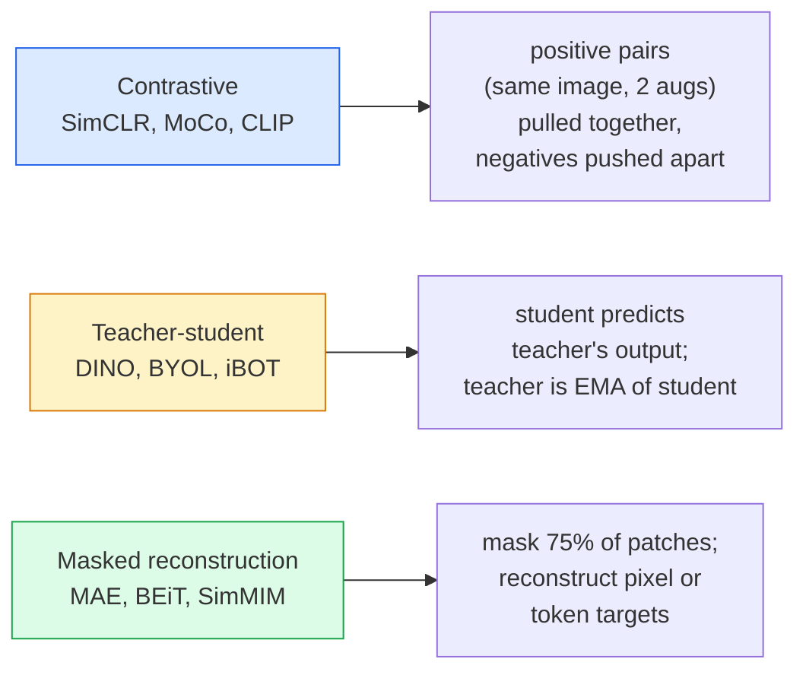

# आत्म-निरीक्षण दृष्टि SimCLR, DINO, MAE

> लेबल पर्यवेक्षित दृष्टि का बोतल गला है। आत्म-नियंत्रित पूर्व प्रशिक्षण उन्हें हटा देता हैः 100 मिलियन लेबल रहित छवियों से दृश्य विशेषताएं सीखें, 10 हजार लेबल वाले पर बारीकी से ट्यून करें।

**Type:** Learn + Build
**Languages:** Python
**Prerequisites:** Phase 4 Lesson 04 (Image Classification), Phase 4 Lesson 14 (ViT)
**Time:** ~75 minutes

## सीखने के लक्ष्य

- तीन प्रमुख स्व-निरीक्षण परिवारों का पता लगाएंSimCLR), शिक्षक-छात्रा (DINO), मास्क पुनर्निर्माण (MAE)  और प्रत्येक के अनुकूलन का वर्णन करें
- एक InfoNCE खरोंच से नुकसान और समझाएं कि 512 के बैच का काम क्यों होता है लेकिन 32 के बैच का विफलता क्यों होती है
- क्यों बताएँ MAE' 75% की मास्किंग अनुपात स्वैच्छिक नहीं है और यह कैसे अलग है BERTपाठ के लिए 15% है
- उपयोग DINOv2 या MAE ImageNet रैखिक जांच और शून्य शॉट निकासी के लिए चेकपोइंट

## समस्या

पर्यवेक्षण ImageNet एक और भी महत्वपूर्ण बात यह है कि एक व्यक्ति को एक दूसरे के साथ एक दूसरे के साथ एक दूसरे के साथ एक दूसरे के साथ एक दूसरे के साथ एक दूसरे के साथ एक दूसरे के साथ एक दूसरे के साथ एक दूसरे के साथ एक दूसरे के साथ एक दूसरे के साथ एक दूसरे के साथ एक दूसरे के साथ एक दूसरे के साथ एक दूसरे के साथ एक दूसरे के साथ एक दूसरे के साथ एक दूसरे के साथ एक दूसरे के साथ एक दूसरे के साथ एक दूसरे के साथ एक दूसरे के साथ एक दूसरे के साथ एक दूसरे के साथ एक दूसरे के साथ एक दूसरे के साथ एक दूसरे के साथ एक दूसरे के साथ एक दूसरे के साथ एक दूसरे के साथ एक दूसरे के साथ एक दूसरे के साथ एक दूसरे के साथ एक दूसरे के साथ एक दूसरे के साथ एक दूसरे के साथ एक दूसरे के साथ एक दूसरे के साथ एक दूसरे के साथ एक दूसरे के साथ एक दूसरे के साथ एक दूसरे के साथ एक दूसरे के साथ एक दूसरे के साथ एक दूसरे के साथ एक दूसरे के साथ एक दूसरे के साथ एक दूसरे के साथ एक दूसरे के साथ एक दूसरे के साथ एक दूसरे के साथ एक दूसरे के साथ एक दूसरे के साथ एक दूसरे के साथ एक दूसरे के साथ एक दूसरे के साथ एक दूसरे के साथ एक दूसरे के साथ एक दूसरे के साथ एक दूसरे के साथ एक दूसरे के साथ एक दूसरे के साथ एक दूसरे के साथ एक दूसरे के साथ एक दूसरे के साथ एक दूसरे के साथ एक साथ एक दूसरे के साथ एक दूसरे के साथ एक साथ एक दूसरे के साथ एक दूसरे के साथ एक साथ एक दूसरे के साथ एक साथ एक दूसरे के साथ एक साथ एक दूसरे के साथ एक साथ एक दूसरे के साथ एक साथ एक साथ एक दूसरे के साथ एक साथ एक दूसरे के साथ एक साथ एक साथ एक साथ एक दूसरे के साथ एक साथ एक साथ एक साथ एक दूसरे के साथ एक साथ एक साथ एक साथ एक साथ एक साथ एक साथ एक साथ एक साथ एक साथ एक साथ एक साथ एक साथ एक साथ एक साथ एक साथ एक साथ एक साथ एक साथ एक साथ एक साथ एक साथ एक साथ एक साथ एक साथ एक साथ एक साथ एक साथ एक साथ एक साथ एक साथ एक साथ एक साथ एक साथ एक साथ एक साथ एक साथ एक साथ एक साथ एक साथ एक साथ एक साथ एक साथ एक साथ एक साथ एक साथ एक साथ एक साथ एक साथ एक साथ एक साथ एक साथ एक साथ एक साथ एक साथ एक साथ एक साथ एक साथ एक साथ एक साथ एक साथ एक साथ एक साथ एक साथ एक साथ एक साथ एक साथ एक साथ एक साथ एक साथ एक साथ एक साथ एक साथ एक साथ एक साथ एक साथ एक साथ एक साथ एक साथ एक साथ YouTube फ्रेम, वेब क्रॉल, वेबकैम फुटेज, उपग्रह स्वीप  और फिर एक छोटे लेबल सेट पर ठीक-ठीक?

आत्म-निरीक्षण सीखने का उत्तर है। ViT प्रशिक्षित LAION या JFT पर्यवेक्षण में पहुंचता है या पीटा जाता है ImageNet यह निगरानी पूर्व प्रशिक्षण की तुलना में डाउनस्ट्रीम कार्यों (डिटेक्शन, खंडन, गहराई) को बेहतर रूप से स्थानांतरित करता है। DINOv2 (मेटा, 2023) और MAE (मेटा, 2022) स्थानांतरित दृष्टि सुविधाओं के लिए वर्तमान उत्पादन डिफ़ॉल्ट हैं।

अवधारणात्मक बदलाव यह है कि बहाना कार्य  वह चीज जो मॉडल को करने के लिए प्रशिक्षित किया गया है  डाउनस्ट्रीम कार्य नहीं होना चाहिए। इससे मॉडल को उपयोगी विशेषताएं सीखने को मजबूर किया जाता है। ग्रे स्केल की छवियों के रंग की भविष्यवाणी करें, छवियों को घुमाएं और मॉडल से घूर्णन को वर्गीकृत करने के लिए कहें, पैचों को मास्क करें और उन्हें पुनर्निर्माण करें  सभी काम किया है। इस पैमाने के तीन दृष्टिकोण विपरीत सीखने, शिक्षक-छात्रा डिस्टिलिशन और मास्क पुनर्निर्माण हैं।

## अवधारणा

### तीन परिवार



### विपरीत शिक्षा (SimCLR)

एक छवि लें, दो यादृच्छिक वृद्धि करें, दो दृश्य प्राप्त करें। दोनों को एक ही एन्कोडर और एक प्रोजेक्शन हेड के माध्यम से फ़ीड करें। एक नुकसान को कम करें जो कहता है "ये दो एम्बेडमेंट करीब होना चाहिए" और "यह एम्बेडमेंट बैच में हर अन्य छवि के एम्बेडमेंट से दूर होना चाहिए।"

```
Loss for positive pair (z_i, z_j) among 2N views per batch:

   L_ij = -log( exp(sim(z_i, z_j) / tau) / sum_k in batch \ {i} exp(sim(z_i, z_k) / tau) )

sim = cosine similarity
tau = temperature (0.1 standard)
```

यह है InfoNCE इसमें प्रति सकारात्मक कई नकारात्मक आवश्यकता होती है, इसलिए बैच आकार मायने रखता है SimCLR 512-8192 की जरूरत है। MoCo बैच आकार से नकारात्मक गणना को अलग करने के लिए पिछले बैचों की गति कतार शुरू की गई।

### शिक्षक-छात्रा (DINO)

एक ही वास्तुकला वाले दो नेटवर्कः छात्र और शिक्षक। शिक्षक एक घातीय चलती औसत है (EMAदोनों चित्र के विस्तारित दृश्य देखते हैं। छात्र का उत्पादन शिक्षक के  स्पष्ट नकारात्मकताओं से मेल खाने के लिए प्रशिक्षित किया जाता है।

```
loss = CE( student_output(view_1),  teacher_output(view_2) )
     + CE( student_output(view_2),  teacher_output(view_1) )

teacher_weights = m * teacher_weights + (1 - m) * student_weights   (m ≈ 0.996)
```

"एक स्थिर की भविष्यवाणी" करने के लिए यह क्यों नहीं गिरता हैः शिक्षक का आउटपुट केंद्रित (प्रति आयाम औसत घटाएं) और तेज (छोटे तापमान से विभाजित करें) है। केंद्रित एक आयाम को हावी होने से रोकता है; तेज आउटपुट को समान रूप से गिरने से रोकता है।

DINO क्या है DINOv2 142M क्यूरेट की गई छवियों पर स्केल अप। SOTA शून्य शॉट दृश्य निकासी और घने भविष्यवाणी के लिए।

### मुखौटा पर पुनर्निर्माण (MAE)

एक के 75% पैच का मास्क ViT इनपुट. केवल दृश्यमान 25% को एन्कोडर के माध्यम से पारित करें। एक छोटा डिकोडर एन्कोडर के आउटपुट प्लस मास्क टोकन को मास्क किए गए स्थानों पर प्राप्त करता है, और मास्क किए गए पैच के पिक्सेल को पुनर्निर्माण करने के लिए प्रशिक्षित होता है।

```
Encoder:  visible 25% of patches -> features
Decoder:  features + mask tokens at masked positions -> reconstructed pixels
Loss:     MSE between reconstructed and original pixels on masked patches only
```

प्रमुख डिजाइन विकल्प जो करते हैं MAE कार्यः

- **75% मास्क अनुपात** उच्च. एन्कोडर को अर्थिक विशेषताएं सीखने के लिए मजबूर करता है; 25% का पुनर्निर्माण लगभग तुच्छ होगा (पड़ोसी पिक्सल इतने सहसंबंधित हैं कि एक CNN इसे नाखून कर सकते हैं) ।
- **असिममित एन्कोडर/डेकोडर** बड़े ViT एन्कोडर केवल दृश्यमान पैच देखता है; एक छोटे से डिकोडर (8 परत, 512-dim) पुनर्निर्माण संभालता है। 3x सरल से तेज पूर्व प्रशिक्षण BEiT.
- **पिक्सेल-स्थान पुनर्निर्माण लक्ष्य** सरल से BEiT' का टोकन लक्ष्य है और बेहतर काम करता है पर ViT.

पूर्व प्रशिक्षण के बाद, डिकोडर को फेंक दें।

### 75% क्यों नहीं 15%

BERT 15% टोकन को कवर करता है। MAE अंतर सूचना घनत्व है।

- प्राकृतिक भाषा में प्रति टोकन उच्च एंट्रॉपी है. 15% टोकन की भविष्यवाणी करना अभी भी कठिन है क्योंकि प्रत्येक मुखौटा स्थिति में कई व्यवहार्य पूर्णताएं हैं।
- छवि पैच में कम एंट्रॉपी होती है  एक अनमास्क पड़ोस अक्सर मास्क पैच के पिक्सल को लगभग सटीक रूप से निर्धारित करता है। भविष्यवाणी करने के लिए अर्थिक समझ की आवश्यकता होती है, आपको आक्रामक रूप से मास्क करना होगा।

75% पर्याप्त उच्च है कि सरल स्थानिक निष्कर्षण कार्य को हल नहीं कर सकता है; एन्कोडर को छवि सामग्री का प्रतिनिधित्व करना चाहिए।

### रैखिक जांच मूल्यांकन

स्व-निरीक्षण पूर्व प्रशिक्षण के बाद, मानक मूल्यांकन एक **रैखिक जांच**: एन्कोडर को फ्रीज करें, ऊपर एक एकल रैखिक वर्गीकरण को चालू करें ImageNet लेबल. रिपोर्ट शीर्ष-1 सटीकता.

- SimCLR ResNet-50: ~71% (2020)
- DINO ViT-S/16: ~77% (2021)
- MAE ViT-L/16: ~76% (2022)
- DINOv2 ViT-g/14: ~86% (2023)

रैखिक जांच सुविधा गुणवत्ता का शुद्ध उपाय है; बारीक-बारी से समायोजित करने से आमतौर पर 2-5 अंक जोड़ते हैं लेकिन सिर को फिर से प्रशिक्षित करने के प्रभाव में भी मिश्रण होता है।

```figure
data-augmentation
```

## इसे बनाओ

### चरण 1: दो दृश्य वृद्धि पाइपलाइन

```python
import torch
import torchvision.transforms as T

two_view_train = lambda: T.Compose([
    T.RandomResizedCrop(96, scale=(0.2, 1.0)),
    T.RandomHorizontalFlip(),
    T.ColorJitter(0.4, 0.4, 0.4, 0.1),
    T.RandomGrayscale(p=0.2),
    T.ToTensor(),
])


class TwoViewDataset(torch.utils.data.Dataset):
    def __init__(self, base):
        self.base = base
        self.aug = two_view_train()

    def __len__(self):
        return len(self.base)

    def __getitem__(self, i):
        img, _ = self.base[i]
        v1 = self.aug(img)
        v2 = self.aug(img)
        return v1, v2
```

प्रत्येक __प्राप्त करें__ एक ही छवि के दो बढ़े हुए दृश्य लौटाता है; लेबल की आवश्यकता नहीं है।

### चरण 2: InfoNCE हानि

```python
import torch.nn.functional as F

def info_nce(z1, z2, tau=0.1):
    """
    z1, z2: (N, D) L2-normalised embeddings of paired views
    """
    N, D = z1.shape
    z = torch.cat([z1, z2], dim=0)  # (2N, D)
    sim = z @ z.T / tau              # (2N, 2N)

    mask = torch.eye(2 * N, dtype=torch.bool, device=z.device)
    sim = sim.masked_fill(mask, float("-inf"))

    targets = torch.cat([torch.arange(N, 2 * N), torch.arange(0, N)]).to(z.device)
    return F.cross_entropy(sim, targets)
```

L2-normalise कॉल करने से पहले एम्बेड। `tau=0.1` है SimCLR default; कम नुकसान को तेज बनाता है और अधिक नकारात्मक की आवश्यकता होती है।

### चरण 3: मानसिक स्वास्थ्य जांच InfoNCE

```python
z1 = F.normalize(torch.randn(16, 32), dim=-1)
z2 = z1.clone()
loss_same = info_nce(z1, z2, tau=0.1).item()
z2_random = F.normalize(torch.randn(16, 32), dim=-1)
loss_random = info_nce(z1, z2_random, tau=0.1).item()
print(f"InfoNCE with identical pairs:  {loss_same:.3f}")
print(f"InfoNCE with random pairs:     {loss_random:.3f}")
```

समान जोड़े कम हानि (बड़े बैच और ठंडे तापमान के लिए 0 के करीब) देना चाहिए। यादृच्छिक जोड़े 16 जोड़े बैच के साथ log(2N-1) = ~log(31) = ~3.4 देना चाहिए।

### चरण 4: MAE-style मुखौटा

```python
def random_mask_indices(num_patches, mask_ratio=0.75, seed=0):
    g = torch.Generator().manual_seed(seed)
    n_keep = int(num_patches * (1 - mask_ratio))
    perm = torch.randperm(num_patches, generator=g)
    visible = perm[:n_keep]
    masked = perm[n_keep:]
    return visible.sort().values, masked.sort().values


num_patches = 196
visible, masked = random_mask_indices(num_patches, mask_ratio=0.75)
print(f"visible: {len(visible)} / {num_patches}")
print(f"masked:  {len(masked)} / {num_patches}")
```

एक दिए गए बीज के लिए सरल, तेज़ और निर्धारक। MAE इस पर बैचिंग और प्रति नमूना मास्क रखना।

## इसका प्रयोग करें

DINOv2 2026 में उत्पादन मानक हैः

```python
import torch
from transformers import AutoImageProcessor, AutoModel

processor = AutoImageProcessor.from_pretrained("facebook/dinov2-base")
model = AutoModel.from_pretrained("facebook/dinov2-base")
model.eval()

# Per-image embeddings for zero-shot retrieval
with torch.no_grad():
    inputs = processor(images=[pil_image], return_tensors="pt")
    outputs = model(**inputs)
    embedding = outputs.last_hidden_state[:, 0]  # CLS token
```

768-डिम एम्बेडिंग आधुनिक छवि पुनर्प्राप्ति, घने पत्राचार और शून्य-शॉट ट्रांसफर पाइपलाइन की रीढ़ है। डाउनस्ट्रीम कार्य पर ठीक-ठीक ट्यूनिंग के लिए शायद ही कभी एक रैखिक सिर से अधिक की आवश्यकता होती है।

छवि-पाठ एम्बेड के लिए, SigLIP या OpenCLIP बराबर है; MAE-style fine-tuning, the `timm` प्रतिपूर्ति जहाजों प्रत्येक MAE चेकपॉइंट।

## इसे भेजें

इस पाठ से उत्पन्न होता हैः

- `outputs/prompt-ssl-pretraining-picker.md` एक संकेत जो चुनता है SimCLR / MAE / DINOv2 डेटासेट आकार, गणना और डाउनस्ट्रीम कार्य को देखते हुए।
- `outputs/skill-linear-probe-runner.md` किसी भी ठंडे एन्कोडर + लेबल वाले डेटासेट के लिए रैखिक-सॉन्ड मूल्यांकन लिखने का कौशल।

## व्यायाम

1. **(Easy)** यह सत्यापित करें InfoNCE हानि गिरती है जब आप अच्छी तरह से संरेखित एम्बेड के लिए तापमान कम और बढ़ जाती है जब आप कम तापमान के लिए यादृच्छिक एम्बेड के लिए. एक भूखंड उत्पन्न `tau in [0.05, 0.1, 0.2, 0.5]` हानि के विरुद्ध।
2. **(Medium)** कार्यान्वयन DINO-style केंद्र बफर. दिखाएं कि केंद्र के बिना, छात्र कुछ युगों के भीतर एक निरंतर वेक्टर में गिर जाता है.
3. **(Hard)** ट्रेन MAE पर CIFAR-100 उपयोग करके TinyUNet 10, 50 और 200 युगों पर रैखिक जांच सटीकता रिपोर्ट। दिखाएं कि एक MAE-pretrained रैखिक जांच एक ही 1,000 छवि उपसमूह पर खरोंच से पर्यवेक्षित रैखिक जांच से बेहतर है।

## प्रमुख शर्तें

| अवधि | लोग क्या कहते हैं | इसका क्या मतलब है |
|------|----------------|----------------------|
| आत्म-निरीक्षण | "लेबल मुक्त" | एक बहाना कार्य जो बिना लेबल वाले डेटा से उपयोगी प्रतिनिधित्व उत्पन्न करता है |
| प्रीटेक्स्ट कार्य | "नकली कार्य" | इस दौरान इस्तेमाल किया गया उद्देश्य SSL (पचों का पुनर्निर्माण, मैच दृश्य); पूर्व प्रशिक्षण के बाद फेंक दिया गया |
| रैखिक जांच | "मुश्किल एन्कोडर + रैखिक सिर" | मानक SSL मूल्यांकनः केवल जमे हुए गुणों के ऊपर रैखिक वर्गीकरण को प्रशिक्षित करें |
| InfoNCE | "विपक्षीय नुकसान" | कोसिन समानताओं पर सॉफ्टमैक्स; सकारात्मक जोड़ी लक्ष्य वर्ग है, अन्य सभी नकारात्मक हैं |
| EMA शिक्षक | "आसमान शिक्षक" | शिक्षक जिसका वजन छात्र के गतिशील औसत का एक घातक है; BYOL, MoCo, DINO |
| मुखौटा अनुपात | "% पैच छिपा हुआ" | दौरान छिपे हुए पैच का अंश MAE; दृष्टि के लिए 75%, पाठ के लिए 15% |
| प्रतिनिधित्व का पतन | "स्थायी आउटपुट" | SSL विफलता जहां एन्कोडर सभी इनपुट के लिए एक निरंतर वेक्टर आउटपुट करता है; केंद्र, तेज या नकारात्मक द्वारा रोका जाता है |
| DINOv2 | "उत्पादन SSL रीढ़ की हड्डी" | मेटा की 2023 स्व-निरीक्षण ViT2026 में सबसे मजबूत सामान्य प्रयोजन छवि सुविधाएँ |

## आगे पढ़ना

- [SimCLR (चेन और अन्य, 2020)](https://arxiv.org/abs/2002.05709) विपरीत सीखने का संदर्भ
- [DINO (कारोन एट अल., 2021)](https://arxiv.org/abs/2104.14294) गति, केन्द्रितता, तेज करने वाले शिक्षक-छात्रा
- [MAE (He et al., 2022)](https://arxiv.org/abs/2111.06377) मास्क ऑटोकोडर प्री ट्रेनिंग ViT
- [DINOv2 (Oquab et al., 2023)](https://arxiv.org/abs/2304.07193) स्व-निरीक्षण ViT उत्पादन की विशेषताओं के लिए
