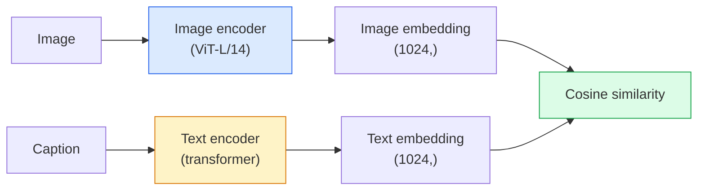

# खुले वक्साकुलर दृष्टि CLIP

> एक छवि एन्कोडर और एक पाठ एन्कोडर को एक साथ प्रशिक्षित करें ताकि मिलान (छवि, कैप्शन) जोड़े साझा स्थान में एक ही बिंदु पर लैंड करें। यही पूरी चाल है।

**Type:** Build + Use
**Languages:** Python
**Prerequisites:** Phase 4 Lesson 14 (ViT), Phase 4 Lesson 17 (Self-Supervised)
**Time:** ~45 minutes

## सीखने के लक्ष्य

- समझाएँ CLIPदो टावर वास्तुकला और विपरीत प्रशिक्षण उद्देश्य
- पूर्व प्रशिक्षित का उपयोग करें CLIP (या SigLIP) बिना किसी कार्य-विशिष्ट प्रशिक्षण के शून्य शॉट वर्गीकरण के लिए
- शून्य शॉट वर्गीकरण को खरोंच से लागू करेंः कोड वर्ग प्रम्प्ट, कॉसिन समानता की गणना करें, argmax लें
- अंतर करना CLIP, SigLIP, OpenCLIPऔर LLaVA/LLaMA-vision मॉडल  2026 में प्रत्येक के लिए क्या है

## समस्या

पारंपरिक वर्गीकरण बंद-वाक्यपुस्तकः एक 1000-वर्ग ImageNet मॉडल केवल 1000 लेबल का अनुमान लगा सकता है। हर नई श्रेणी के लिए लेबल डेटा और एक पुनः प्रशिक्षित सिर की आवश्यकता होती है।

CLIP (राडफोर्ड तथा अन्य, OpenAI 2021) ने दिखाया कि वेब से स्क्रैप किए गए 400M (छवि, कैप्शन) जोड़े पर प्रशिक्षण एक मॉडल का उत्पादन करता है जो निष्कर्ष पर किसी भी सेट में वर्गीकृत कर सकता है, शुद्ध रूप से प्राकृतिक भाषा में वर्णित है। आप इसे एक वाक्य लिखकर एक नया वर्ग देते हैं।

यह क्षमता  शून्य शॉट स्थानांतरण  है कि क्यों हर आधुनिक दृष्टि प्रणाली एक के साथ शुरू होता है CLIP-family नियंत्रण बिंदु। पता लगाने (भूमि पर उतरना) DINO, OWL-ViT), खंडन (CLIPSeg, SAM), रिट्रीब्यू, सामग्री मॉडरेशन, VLMs, और पाठ-से-छवि पीढ़ी सभी पर निर्माण CLIP-style संयुक्त एम्बेडमेंट।

## अवधारणा

### दो टावर



दोनों एन्कोडर एक ही एम्बेडिंग आयाम (512 के लिए) के लिए एक रैखिक प्रक्षेपण के साथ समाप्त होते हैं CLIP-B/32, 1024 के लिए CLIP-L/14). L2-normalise और कॉसिन समानता की गणना करें।

### उद्देश्य

N (छवि, उपशीर्षक) जोड़े के एक बैच को देखते हुए, एक NxN समानता मैट्रिक्स. दोनों एन्कोडर को प्रशिक्षित करें ताकि विकर्ण (मिलते हुए जोड़े) में उच्च समानता हो और विकर्ण (गैर-मिलते) में कम समानता हो।

```
sim_matrix = image_embeddings @ text_embeddings.T / tau

loss_i2t = cross_entropy(sim_matrix,       targets=arange(N))
loss_t2i = cross_entropy(sim_matrix.T,     targets=arange(N))
loss = (loss_i2t + loss_t2i) / 2
```

सममित क्योंकि छवि-से-पाठ और पाठ-से-चित्र दोनों को काम करना चाहिए। `tau` (तापमान) आमतौर पर एक स्केलर पैरामीटर के रूप में सीखा जाता है, 0.07 पर शुरू किया जाता है।

### SigLIP: बेहतर हानि

SigLIP (Zhai et al., 2023) ने softmax को प्रति जोड़ी sigmoid से बदल दियाः

```
loss = mean over pairs of log(1 + exp(-y_ij * sim_ij))
y_ij = +1 if matching, -1 otherwise
```

प्रति जोड़ी हानि बैच स्तर की सामान्यीकरण को समाप्त करती है जो CLIP आवश्यकता है। SigLIP छोटे बैच आकार और मैचों पर या उससे अधिक की ट्रेनें बेहतर CLIP समान आंकड़ों पर।

### शून्य शॉट वर्गीकरण

प्रशिक्षित CLIP:

1. प्रत्येक वर्ग के लिए, एक प्रॉम्प्ट लिखेंः "एक {class} की तस्वीर"।
2. पाठ एन्कोडर के साथ सभी वर्ग प्रॉम्प्ट को एन्कोड -> `T` आकार (सी, डी)
3. परीक्षण छवि को एन्कोड करें -> `I` आकार (1, डी)
4. Similarity = `I @ T.T` आकार (1, C)
5. Argmax -> predicted class.

त्वरित इंजीनियरिंग मामलों. OpenAI प्रकाशित 80 शीघ्र टेम्पलेट्स ImageNet ("एक {} की तस्वीर", "एक {} की एक धुंधली तस्वीर", "एक {} का एक स्केच", ...) एक अतिरिक्त 1-3% शीर्ष-1 सटीकता के लिए प्रत्येक वर्ग के लिए सभी टेम्पलेट्स के एम्बेडमेंट का औसत।

### कहाँ CLIP-style 2026 में मॉडल का उपयोग किया जाएगा

- **शून्य शॉट वर्गीकरण** प्रत्यक्ष उपयोग।
- **छवि पुनर्प्राप्ती** सभी छवियों को एक बार एन्कोड करें, निष्कर्ष पर क्वेरी एम्बेड करें।
- **पाठ-संशोधित पता लगाना** जमीनीकरण DINO, OWL-ViT एक को लपेटें CLIP एक डिटेक्टर के चारों ओर एक पाठ टॉवर.
- **पाठ-संरचित खंडन** — CLIPSeg; SAM पाठ शीघ्र इनपुट का उपयोग करता है CLIP.
- **VLMs** — LLaVA, Qwen-VL, InternVL तार ए CLIP-family एक दृष्टि एन्कोडर में LLM.
- **पाठ-चित्र जन** स्थिर विसारण, DALL-E 3 शर्त CLIP पाठ एम्बेडमेंट।

एक बार जब आपके पास एक साझा एम्बेडिंग स्पेस हो जाता है, तो प्रत्येक दृष्टि + भाषा कार्य दूरी गणना बन जाता है।

```figure
clip-contrastive
```

## इसे बनाओ

### चरण 1: दो टावरों का छोटा मॉडल

वास्तविक CLIP है ViT इस सबक के लिए टावर छोटे हैं MLPs पूर्व-उत्कर्षण सुविधाओं पर ताकि प्रशिक्षण संकेत पर दिखाई दे CPU.

```python
import torch
import torch.nn as nn
import torch.nn.functional as F


class TwoTower(nn.Module):
    def __init__(self, img_in=128, txt_in=64, emb=64):
        super().__init__()
        self.image_proj = nn.Sequential(nn.Linear(img_in, 128), nn.ReLU(), nn.Linear(128, emb))
        self.text_proj = nn.Sequential(nn.Linear(txt_in, 128), nn.ReLU(), nn.Linear(128, emb))
        self.logit_scale = nn.Parameter(torch.ones([]) * 2.6592)  # ln(1/0.07)

    def forward(self, img_feats, txt_feats):
        i = F.normalize(self.image_proj(img_feats), dim=-1)
        t = F.normalize(self.text_proj(txt_feats), dim=-1)
        return i, t, self.logit_scale.exp()
```

दो अनुमान, साझा-अंधेरा उत्पादन, सीखा तापमान. वास्तविक के रूप में एक ही आकार CLIP API.

### चरण 2: विपरीत हानि

```python
def clip_loss(image_emb, text_emb, logit_scale):
    N = image_emb.size(0)
    sim = logit_scale * image_emb @ text_emb.T
    targets = torch.arange(N, device=sim.device)
    l_i = F.cross_entropy(sim, targets)
    l_t = F.cross_entropy(sim.T, targets)
    return (l_i + l_t) / 2
```

सममित, उच्च। logit_scale = sharper softmax = more आत्मविश्वास लेकिन अस्थिरता का खतरा।

### चरण 3: शून्य-शॉट वर्गीकरण

```python
@torch.no_grad()
def zero_shot_classify(model, image_feats, class_text_feats, class_names):
    """
    image_feats:      (N, img_in)
    class_text_feats: (C, txt_in)   one averaged embedding per class
    """
    i = F.normalize(model.image_proj(image_feats), dim=-1)
    t = F.normalize(model.text_proj(class_text_feats), dim=-1)
    sim = i @ t.T
    pred = sim.argmax(dim=-1)
    return [class_names[p] for p in pred.tolist()]
```

यह एक उत्पादन के साथ उपयोग की जाने वाली सटीक शून्य शॉट प्रक्रिया है CLIP चेकपॉइंट।

### चरण 4: मानसिक स्वास्थ्य जांच

```python
torch.manual_seed(0)
model = TwoTower()

img = torch.randn(8, 128)
txt = torch.randn(8, 64)
i, t, scale = model(img, txt)
loss = clip_loss(i, t, scale)
print(f"batch size: {i.size(0)}   loss: {loss.item():.3f}")
```

हानि के करीब होना चाहिए `log(N) = log(8) = 2.08` एक यादृच्छिक रूप से शुरू मॉडल के लिए  सममित क्रॉस-एंट्रोपी लक्ष्य जब कोई संरचना अभी तक नहीं सीखा गया है।

## इसका प्रयोग करें

OpenCLIP 2026 में सामुदायिक डिफ़ॉल्ट हैः

```python
import open_clip
import torch
from PIL import Image

model, _, preprocess = open_clip.create_model_and_transforms("ViT-B-32", pretrained="laion2b_s34b_b79k")
tokenizer = open_clip.get_tokenizer("ViT-B-32")

image = preprocess(Image.open("dog.jpg")).unsqueeze(0)
text = tokenizer(["a photo of a dog", "a photo of a cat", "a photo of a car"])

with torch.no_grad():
    image_features = model.encode_image(image)
    text_features = model.encode_text(text)
    image_features = image_features / image_features.norm(dim=-1, keepdim=True)
    text_features = text_features / text_features.norm(dim=-1, keepdim=True)
    probs = (100.0 * image_features @ text_features.T).softmax(dim=-1)

print(probs)
```

SigLIP नया है, छोटे पैमाने पर बेहतर ट्रेन करता है, और नए काम के लिए पसंद किया जाता हैः `google/siglip-base-patch16-224`. दोनों जहाजों को गले लगा रहा है.

## इसे भेजें

इस पाठ से उत्पन्न होता हैः

- `outputs/prompt-zero-shot-class-picker.md` एक प्रॉम्प्ट जो शून्य शॉट के लिए वर्ग टेम्पलेट्स डिजाइन करता है CLIP वर्गों की सूची और एक डोमेन दिया गया है।
- `outputs/skill-image-text-retriever.md` किसी भी छवि के साथ एक छवि एम्बेडिंग सूचकांक बनाने का कौशल CLIP चेकपॉइंट, पाठ द्वारा क्वेरी और छवि द्वारा क्वेरी का समर्थन करता है।

## व्यायाम

1. **(Easy)** पूर्व प्रशिक्षित का उपयोग करें OpenCLIP ViT-B/32 और शून्य शॉट वर्गीकरण पर CIFAR-10 80 टेम्पलेट प्रॉम्प्ट सेट के साथ। रिपोर्ट शीर्ष-1 सटीकता; यह लगभग 85-90% होना चाहिए।
2. **(Medium)** एक ही टेम्पलेट पर एकल टेम्पलेट ("एक {} की एक तस्वीर") बनाम 80 टेम्पलेट औसत एम्बेडमेंट की तुलना करें CIFAR-10 कार्य. अंतर को मात्राबद्ध करें और समझाएं कि टेम्पलेट्स क्यों मदद करते हैं।
3. **(Hard)** शून्य शॉट छवि पुनर्प्राप्ति सूचकांक बनाएंः 1,000 छवियों को एम्बेड करें CLIP, एक निर्माण FAISS अनुक्रमणिका, प्राकृतिक भाषा विवरण के साथ क्वेरी. रिपोर्ट रिकवरी रिकॉल@5 के लिए 20 पकड़े क्वेरी आप हाथ से लिखते हैं.

## प्रमुख शर्तें

| अवधि | लोग क्या कहते हैं | इसका क्या मतलब है |
|------|----------------|----------------------|
| दो-टावर | "डबल एन्कोडर" | साझा-डिम प्रोजेक्शन हेड में समाप्त होने वाले अलग छवि और पाठ एन्कोडर |
| शून्य शॉट | "कार्य-विशिष्ट प्रशिक्षण नहीं" | केवल पाठ द्वारा निर्णायक रूप से वर्णित वर्गों में वर्गीकृत करें; कोई लेबल नहीं छुआ गया |
| तापमान / logit_scale | "ताऊ" | सीखा स्केलर जो सॉफ्टमैक्स से पहले समानता मैट्रिक्स को स्केल करता है |
| शीघ्र टेम्पलेट | "एक {} की एक तस्वीर" | कक्षाओं के नामों के आसपास प्राकृतिक भाषा के रैपर; कई टेम्पलेट्स का औसत शून्य शॉट सटीकता को बढ़ाता है |
| CLIP | "छवि+पाठ मॉडल" | 2021 का OpenAI मॉडल; 2026 में क्षेत्र की शब्दावली |
| SigLIP | "सिग्मोइड CLIP" | प्रति जोड़ी सिग्मोइड के लिए सॉफ्टमैक्स स्वैप; छोटे बैचों पर बेहतर ट्रेनें |
| OpenCLIP | "खुले प्रजनन" | सामुदायिक प्रशिक्षण CLIP पर भिन्नताएँ LAIONखुले स्रोत पाइपलाइनों के लिए उत्पादन डिफ़ॉल्ट |
| VLM | "दृष्टि भाषा मॉडल" | A CLIP-family एन्कोडर प्लस एक LLM, चित्रों के बारे में प्रश्नों का उत्तर देने के लिए प्रशिक्षित |

## आगे पढ़ना

- [CLIP: प्राकृतिक भाषा पर्यवेक्षण से स्थानांतरित दृश्य मॉडल सीखना (राडफोर्ड एट अल, 2021)](https://arxiv.org/abs/2103.00020)
- [SigLIP: भाषा-छवि पूर्व-शिक्षण के लिए सिग्मोइड हानि (Zhai et al., 2023)](https://arxiv.org/abs/2303.15343)
- [OpenCLIP](https://github.com/mlfoundations/open_clip) सामुदायिक कोडबेस
- [DINOv2 vs CLIP vs MAE: एक विशेषता तुलना](https://huggingface.co/blog/dinov2) — HF साथ-साथ उपयोग के मामले के साथ गाइड
