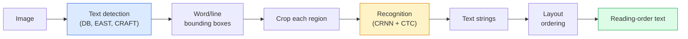

# OCR & दस्तावेज समझ

> OCR यह एक तीन चरणों वाला पाइपलाइन है  पाठ बक्से का पता लगाएं, वर्णों को पहचानें, फिर उन्हें बिछाएं। OCR प्रणाली इन चरणों को फिर से क्रमबद्ध करती है या उन्हें मिला देती है।

**Type:** Learn + Use
**Languages:** Python
**Prerequisites:** Phase 4 Lesson 06 (Detection), Phase 7 Lesson 02 (Self-Attention)
**Time:** ~45 minutes

## सीखने के लक्ष्य

- शास्त्रीय का पता लगाएं OCR पाइपलाइन (डिटेक्ट -> पहचान -> लेआउट) और आधुनिक अंत-से-अंत विकल्प (डोनट, Qwen-VL-OCR)
- कार्यान्वयन CTC (संलग्नक के समय वर्गीकरण) क्रम से क्रम के लिए हानि OCR प्रशिक्षण
- उपयोग PaddleOCR या EasyOCR बिना प्रशिक्षण के उत्पादन दस्तावेज विश्लेषण के लिए
- अंतर करना OCR, लेआउट पार्सिंग, और दस्तावेज़ समझ  और प्रत्येक कार्य के लिए सही उपकरण चुनें

## समस्या

पाठ से भरे चित्र हर जगह हैंः रसीदें, चालान, IDsउन से संरचनात्मक डेटा निकालना  न केवल वर्ण, बल्कि "यह कुल राशि है"  उच्चतम मूल्य वाले लागू दृष्टि समस्याओं में से एक है।

क्षेत्र तीन कौशल परतों में विभाजित हैः

1. **OCR उचित**: पिक्सेल को पाठ में बदल दें।
2. **लेआउट पार्सिंग**समूह OCR क्षेत्रों में आउटपुट (शीर्षक, शरीर, तालिका, हेडर) ।
3. **दस्तावेज समझ**: लेआउट से संरचित फ़ील्ड ("इंवॉइस_टोटल = $42.50") निकालें।

प्रत्येक परत में शास्त्रीय और आधुनिक दृष्टिकोण होते हैं, और "मुझे एक छवि से पाठ चाहिए" और "मुझे इस रसीद से कुल राशि चाहिए" के बीच का अंतर अधिकांश टीमों की कल्पना से बड़ा है।

## अवधारणा

### शास्त्रीय पाइपलाइन



- **पाठ का पता लगाना** प्रति पंक्ति या प्रति शब्द चतुर्भुज उत्पन्न करता है।
- **मान्यता** प्रत्येक क्षेत्र को एक निश्चित ऊंचाई तक फसलें, एक CNN + BiLSTM + CTC एक चरित्र अनुक्रम उत्पन्न करने के लिए।
- **लेआउट** पढ़ने के क्रम को पुनर्निर्माण करता है (लैटिन के लिए शीर्ष से नीचे, बाएं से दाएं; अरबी, जापानी के लिए अलग) ।

### CTC एक पैराग्राफ में

OCR पहचान एक निश्चित लंबाई के फीचर मैप से चर लंबाई का अनुक्रम उत्पन्न करती है। CTC (Graves et al., 2006) आप वर्ण स्तर संरेखण के बिना यह प्रशिक्षण देता है. मॉडल प्रत्येक समय चरण पर एक वितरण (शब्द + खाली) पर आउटपुट करता है; CTC नुकसान सभी संरेखणों पर हाशिए पर रखता है जो पुनरावृत्तियों को मिलाकर रिक्त स्थानों को हटाने के बाद लक्ष्य पाठ तक कम हो जाते हैं।

```
raw output: "h h h _ _ e e l l _ l l o _ _"
after merge repeats and remove blanks: "hello"
```

CTC कारण है CRNN 2015 में काम किया और अभी भी अधिकांश उत्पादन को ट्रेन करता है OCR 2026 में मॉडल।

### आधुनिक अंत-से-अंत मॉडल

- **डोनट** (किम एट अल., 2022)  ए ViT एन्कोडर + एक पाठ डिकोडर; एक छवि पढ़ता है और उत्सर्जन JSON कोई पाठ डिटेक्टर, कोई लेआउट मॉड्यूल नहीं।
- **TrOCR** — ViT + लाइन स्तर के लिए ट्रांसफार्मर डिकोडर OCR.
- **Qwen-VL-OCR / InternVL** पूर्ण दृष्टि भाषा मॉडल OCR जटिल दस्तावेजों पर 2026 तक सर्वोत्तम सटीकता।
- **PaddleOCR** शास्त्रीय DB + CRNN एक परिपक्व उत्पादन पैकेज में पाइपलाइन; अभी भी ओपन सोर्स वर्कहॉर्स।

अंत-से-अंत मॉडल को अधिक डेटा और गणना की आवश्यकता होती है लेकिन बहु-चरण पाइपलाइनों के त्रुटि संचय को छोड़ दें।

### लेआउट पार्सिंग

संरचित दस्तावेजों के लिए, एक लेआउट डिटेक्टर चलाएं (LayoutLMv3, DocLayNet) जो प्रत्येक क्षेत्र को लेबल करता हैः शीर्षक, अनुच्छेद, आकृति, तालिका, पाद लेख। पढ़ने के क्रम में फिर "क्षेत्रों के माध्यम से लेआउट क्रम में दोहराया जाता है, संगतता" हो जाता है।

फॉर्म के लिए उपयोग **कुंजी-मूल्य निकासी** मॉडल (दृश्य-समृद्ध दस्तावेजों के लिए डोनट, LayoutLMv3 वे छवि + पता लगाया पाठ + स्थानों को ले और संरचित कुंजी-मूल्य जोड़े की भविष्यवाणी करते हैं।

### मूल्यांकन मेट्रिक्स

- **वर्ण त्रुटि दर (CER)** लेवेंसस्टीन दूरी / संदर्भ लंबाई। निचला बेहतर है। उत्पादन लक्ष्यः < 2% स्वच्छ स्कैन पर।
- **वर्ड त्रुटि दर (WER)** शब्द स्तर पर भी यही।
- **F1 संरचित क्षेत्रों पर** प्रमुख मूल्य के कार्यों के लिए; `{invoice_total: 42.50}` सही दिखाई देता है।
- **दूरी को संपादित करें JSON** अंत से अंत तक दस्तावेज़ विश्लेषण के लिए; डोनट पेपर ने रूख संपादन दूरी को सामान्य बनाया।

```figure
cv3-ctc-collapse
```

## इसे बनाओ

### चरण 1: CTC loss + greedy decoder

```python
import torch
import torch.nn as nn
import torch.nn.functional as F


def ctc_loss(log_probs, targets, input_lengths, target_lengths, blank=0):
    """
    log_probs:      (T, N, C) log-softmax over vocab including blank at index 0
    targets:        (N, S) int targets (no blanks)
    input_lengths:  (N,) per-sample time steps used
    target_lengths: (N,) per-sample target length
    """
    return F.ctc_loss(log_probs, targets, input_lengths, target_lengths,
                      blank=blank, reduction="mean", zero_infinity=True)


def greedy_ctc_decode(log_probs, blank=0):
    """
    log_probs: (T, N, C) log-softmax
    returns: list of index sequences (blanks removed, repeats merged)
    """
    preds = log_probs.argmax(dim=-1).transpose(0, 1).cpu().tolist()
    out = []
    for seq in preds:
        decoded = []
        prev = None
        for idx in seq:
            if idx != prev and idx != blank:
                decoded.append(idx)
            prev = idx
        out.append(decoded)
    return out
```

`F.ctc_loss` उपयोग करता है कुशल CuDNN लोभी डिकोडर एक बीम खोज से सरल है और आमतौर पर 1% के भीतर CER यह है।

### चरण 2: छोटा CRNN पहचानकर्ता

न्यूनतम CNN + BiLSTM पंक्ति के लिए OCR.

```python
class TinyCRNN(nn.Module):
    def __init__(self, vocab_size=40, hidden=128, feat=32):
        super().__init__()
        self.cnn = nn.Sequential(
            nn.Conv2d(1, feat, 3, 1, 1), nn.BatchNorm2d(feat), nn.ReLU(inplace=True),
            nn.MaxPool2d(2),
            nn.Conv2d(feat, feat * 2, 3, 1, 1), nn.BatchNorm2d(feat * 2), nn.ReLU(inplace=True),
            nn.MaxPool2d(2),
            nn.Conv2d(feat * 2, feat * 4, 3, 1, 1), nn.BatchNorm2d(feat * 4), nn.ReLU(inplace=True),
            nn.MaxPool2d((2, 1)),
            nn.Conv2d(feat * 4, feat * 4, 3, 1, 1), nn.BatchNorm2d(feat * 4), nn.ReLU(inplace=True),
            nn.MaxPool2d((2, 1)),
        )
        self.rnn = nn.LSTM(feat * 4, hidden, bidirectional=True, batch_first=True)
        self.head = nn.Linear(hidden * 2, vocab_size)

    def forward(self, x):
        # x: (N, 1, H, W)
        f = self.cnn(x)                # (N, C, H', W')
        f = f.mean(dim=2).transpose(1, 2)  # (N, W', C)
        h, _ = self.rnn(f)
        return F.log_softmax(self.head(h).transpose(0, 1), dim=-1)  # (W', N, vocab)
```

निश्चित ऊंचाई इनपुट (द CNN अधिकतम पूल ऊंचाई से 1) चौड़ाई समय आयाम है CTC.

### चरण 3: सिंथेटिक OCR

अंत-से-अंत धुएं परीक्षण के लिए काले-से-सफेद अंक स्ट्रिंग उत्पन्न करें।

```python
import numpy as np

def synthetic_line(text, height=32, char_width=16):
    W = char_width * len(text)
    img = np.ones((height, W), dtype=np.float32)
    for i, c in enumerate(text):
        x = i * char_width
        shade = 0.0 if c.isalnum() else 0.5
        img[6:height - 6, x + 2:x + char_width - 2] = shade
    return img


def build_batch(strings, vocab):
    H = 32
    W = 16 * max(len(s) for s in strings)
    imgs = np.ones((len(strings), 1, H, W), dtype=np.float32)
    target_lengths = []
    targets = []
    for i, s in enumerate(strings):
        imgs[i, 0, :, :16 * len(s)] = synthetic_line(s)
        ids = [vocab.index(c) for c in s]
        targets.extend(ids)
        target_lengths.append(len(ids))
    return torch.from_numpy(imgs), torch.tensor(targets), torch.tensor(target_lengths)


vocab = ["_"] + list("0123456789abcdefghijklmnopqrstuvwxyz")
imgs, targets, lengths = build_batch(["hello", "world"], vocab)
print(f"images: {imgs.shape}   targets: {targets.shape}   lengths: {lengths.tolist()}")
```

एक वास्तविक OCR डेटासेट फ़ॉन्ट, शोर, घूर्णन, धुंधलापन और रंग जोड़ता है। ऊपर पाइपलाइन समान है।

### चरण 4: प्रशिक्षण स्केच

```python
model = TinyCRNN(vocab_size=len(vocab))
opt = torch.optim.Adam(model.parameters(), lr=1e-3)

for step in range(200):
    strings = ["abc" + str(step % 10)] * 4 + ["xyz" + str((step + 1) % 10)] * 4
    imgs, targets, target_lens = build_batch(strings, vocab)
    log_probs = model(imgs)  # (W', 8, vocab)
    input_lens = torch.full((8,), log_probs.size(0), dtype=torch.long)
    loss = ctc_loss(log_probs, targets, input_lens, target_lens, blank=0)
    opt.zero_grad(); loss.backward(); opt.step()
```

इस क्षुल्लक सिंथेटिक डेटा पर 200 चरणों पर नुकसान ~ 3 से ~ 0.2 तक गिरना चाहिए।

## इसका प्रयोग करें

तीन उत्पादन मार्गः

- **PaddleOCR** परिपक्व, तेज, बहुभाषी। एक पंक्ति का उपयोगः `paddleocr.PaddleOCR(lang="en").ocr(image_path)`.
- **EasyOCR** — Python- देशी, बहुभाषी, PyTorch रीढ़ की हड्डी।
- **टेसरेक्ट** शास्त्रीय; अभी भी पुराने स्कैन किए गए दस्तावेजों के लिए उपयोगी है जब मॉडल संघर्ष करते हैं।

डॉक्यूमेंट्स को एंड-टू-एंड पार्स करने के लिए डोनट या एक VLM:

```python
from transformers import DonutProcessor, VisionEncoderDecoderModel

processor = DonutProcessor.from_pretrained("naver-clova-ix/donut-base-finetuned-cord-v2")
model = VisionEncoderDecoderModel.from_pretrained("naver-clova-ix/donut-base-finetuned-cord-v2")
```

रिसीव, चालान और दोहराए जाने योग्य संरचना वाले फॉर्म के लिए, डोनट को ठीक से ट्यून करें। OCR तर्क के साथ, VLM जैसे Qwen-VL-OCR वर्तमान डिफ़ॉल्ट है।

## इसे भेजें

इस पाठ से उत्पन्न होता हैः

- `outputs/prompt-ocr-stack-picker.md` एक संकेत है कि Tesseract चुनता है / PaddleOCR डोनट VLM-OCR दस्तावेज़ प्रकार, भाषा और संरचना को दिया गया है।
- `outputs/skill-ctc-decoder.md` एक कौशल जो लालची और बीम-खोज लिखता है CTC लंबाई सामान्यीकरण सहित खरोंच से डिकोडर।

## व्यायाम

1. **(Easy)** प्रशिक्षण TinyCRNN 500 चरणों के लिए 5 अंकों के यादृच्छिक संख्यात्मक स्ट्रिंग पर रिपोर्ट CER एक लम्बे सेट पर
2. **(Medium)** लालची डिकोडिंग को बीम सर्च से बदल दें (beam_width=5) रिपोर्ट CER डेल्टा. किस इनपुट पर बीम खोज जीतता है?
3. **(Hard)** उपयोग PaddleOCR 20 रसीदों, निकासी लाइन वस्तुओं और गणना के सेट पर F1 {item_name, price} जोड़े के लिए हाथ से लेबल ग्राउंड सत्य के खिलाफ।

## प्रमुख शर्तें

| अवधि | लोग क्या कहते हैं | इसका क्या मतलब है |
|------|----------------|----------------------|
| OCR | "पिक्सल से पाठ" | छवि क्षेत्रों को वर्ण अनुक्रम में बदलना |
| CTC | "निर्विवाद हानि" | समय-चरण लेबल के बिना अनुक्रम मॉडल को प्रशिक्षित करने वाला नुकसान; संरेखण पर हाशिए पर |
| CRNN | "शास्त्रीय OCR मॉडल" | Conv feature extractor + BiLSTM + CTC; 2015 की बेज लाइन अभी भी उत्पादन में उपयोग की जाती है |
| डोनट | "अंत से अंत तक OCR" | ViT एन्कोडर + पाठ डिकोडर; उत्सर्जन JSON सीधे छवि से |
| लेआउट पार्सिंग | "क्षेत्रों को खोजें" | दस्तावेज़ में शीर्षक/तालिका/चित्र/अनुच्छेद क्षेत्रों का पता लगाना और लेबल लगाना |
| पढ़ने का क्रम | "पाठ अनुक्रम" | मान्यता प्राप्त क्षेत्रों को एक वाक्य में क्रमबद्ध करना; लैटिन के लिए तुच्छ, मिश्रित लेआउट के लिए तुच्छ नहीं |
| CER / WER | "त्रुटि दर" | वर्ण या शब्द क्षुद्रता पर लेवेंसस्टाइन दूरी / संदर्भ लंबाई |
| VLM-OCR | "LLM जो पढ़ता है" | दृष्टि भाषा का मॉडल जिसे प्रशिक्षित या प्रेरित किया गया है OCR कार्य; वर्तमान SOTA जटिल दस्तावेजों पर |

## आगे पढ़ना

- [CRNN (Shi et al., 2015)](https://arxiv.org/abs/1507.05717) मूल CNN+RNN+CTC वास्तुकला
- [CTC (Graves et al., 2006)](https://www.cs.toronto.edu/~graves/icml_2006.pdf) मूल CTC कागज; एल्गोरिथम विचारों से घने पैक
- [डोनट (किम एट अल., 2022)](https://arxiv.org/abs/2111.15664) — OCR-free दस्तावेज समझ ट्रांसफार्मर
- [PaddleOCR](https://github.com/PaddlePaddle/PaddleOCR) ओपन सोर्स उत्पादन OCR स्टैक
