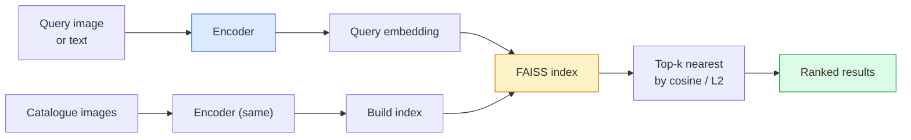

# छवि पुनर्प्राप्ति और मीट्रिक सीखने

> एक रिकवरी प्रणाली में अंतरिक्ष को एम्बेड करने में दूरी के आधार पर उम्मीदवारों को रैंक किया जाता है। मीट्रिक सीखने उस अंतरिक्ष को आकार देने का अनुशासन है ताकि दूरी का मतलब आप क्या चाहते हैं।

**Type:** Build
**Languages:** Python
**Prerequisites:** Phase 4 Lesson 14 (ViT), Phase 4 Lesson 18 (CLIP)
**Time:** ~45 minutes

## सीखने के लक्ष्य

- त्रिपुला, विपरीत और प्रॉक्सी आधारित मीट्रिक सीखने के नुकसान की व्याख्या करें और किसी दिए गए डेटासेट के लिए सही एक चुनें
- कार्यान्वयन L2-normalisation और कॉसिन समानता को सही ढंग से और "एक ही आइटम" और "एक ही वर्ग" के बीच अंतर का लेखांकन
- एक निर्माण FAISS अनुक्रमणिका, पाठ और छवि द्वारा इसे क्वेरी, और याद करने के लिए रिपोर्ट याद@K एक बाहर रखा क्वेरी सेट के लिए
- उपयोग DINOv2, CLIPऔर SigLIP के रूप में ऑफ-द-शेल्फ एम्बेडिंग रीढ़ की हड्डी और पता है जब प्रत्येक जीत

## समस्या

उत्पादन दृष्टि में पुनः प्राप्ति हर जगह हैः दोहरी पहचान, रिवर्स छवि खोज, दृश्य खोज ("समान उत्पादों को ढूंढें"), चेहरे की पुनः पहचान, व्यक्ति की पुनः पहचानID उत्पाद प्रश्न हमेशा एक ही हैः "इस क्वेरी छवि को देखते हुए, मेरी सूची को रैंक करें।"

दो डिजाइन निर्णय पूरे सिस्टम को आकार देते हैं। एम्बेडिंग  कौन सा मॉडल वेक्टर उत्पन्न करता है। सूचकांक  पैमाने पर निकटतम पड़ोसियों को कैसे ढूंढें। दोनों 2026 में वस्तु हैं (DINOv2 सम्मिलन के लिए, FAISS सूचकांक के लिए), जो पट्टी को बढ़ाता हैः कठिन भाग परिभाषित कर रहा है *क्या समान है* अपने आवेदन के लिए, फिर एम्बेडिंग अंतरिक्ष को आकार देने के लिए ताकि दूरी मेल खाती है.

यह आकार देना मीट्रिक सीखने है। यह एक छोटा लेकिन उच्च लीवरिंग अनुशासन है।

## अवधारणा

### एक नज़र में प्राप्त करना



### चार हार परिवार

| हानि | आवश्यकताएँ | पेशेवर | विपक्ष |
|------|----------|------|------|
| **विपरीत** | (anchor, positive) + negatives | सरल, किसी भी जोड़ी लेबल के साथ काम करता है | बहुत से नकारात्मकताओं के बिना धीमी गति से अभिसरण |
| **त्रिपुरा** | (anchor, positive, negative) | सहज; प्रत्यक्ष मार्जिन नियंत्रण | हार्ड-ट्रिप्लेट खनन महंगा है |
| **NT-Xent / InfoNCE** | Pairs + batch-mined negatives | बड़े बैचों के लिए पैमाना | बड़े बैच या गति कतार की आवश्यकता होती है |
| **प्रॉक्सी आधारित (ProxyNCA)** | केवल वर्ग लेबल | तेजी से, स्थिर, कोई खनन नहीं | छोटे डेटा सेट पर प्रॉक्सी के लिए ओवरफिट कर सकते हैं |

अधिकांश उत्पादन उपयोग मामलों के लिए, एक पूर्व-प्रशिक्षित रीढ़ की हड्डी के साथ शुरू करें और केवल एक मीट्रिक-लर्निंग बारीक-ट्यूनिंग जोड़ें यदि शेल्फ-ऑफ-द-शेल्फ एम्बेडमेंट आपके परीक्षण सेट पर खराब प्रदर्शन करते हैं।

### औपचारिक रूप से त्रिभुज हानि

```
L = max(0, ||f(a) - f(p)||^2 - ||f(a) - f(n)||^2 + margin)
```

लंगर खींचें `a` सकारात्मक के निकट `p`, नकारात्मक से दूर धक्का `n`, के साथ `margin` तीन-छवि संरचना किसी भी समानता क्रम के लिए सामान्यीकरण।

खनन विषयः आसान त्रिगुट (`n` पहले से ही दूर `a`) शून्य हानि का योगदान देते हैं; केवल हार्ड ट्रिपल नेटवर्क को पढ़ाते हैं।`n` से अधिक `p` लेकिन मार्जिन के भीतर) 2016 है FaceNet नुस्खा और अभी भी हावी है।

### कॉसिन समानता बनाम L2

दो मीट्रिक, दो सम्मेलनः

- **कॉसिन**: वेक्टरों के बीच कोण। आवश्यकताएँ L2-normalised सम्मिलित करना।
- **L2**: यूक्लिडियन दूरी. कच्चे या सामान्यीकृत एम्बेडेड पर काम करता है, लेकिन आमतौर पर L2-normalised + squared L2.

अधिकांश आधुनिक जाल के लिए दोनों समान हैंः `||a - b||^2 = 2 - 2 cos(a, b)` जब `||a|| = ||b|| = 1`. उस सम्मेलन को चुनें जो आपके एम्बेडिंग प्रशिक्षण से मेल खाता हो; उन्हें चुपचाप मिलाकर "सभी से करीब" का अर्थ बदल जाता है।

### याद@के

मानक निकासी मीट्रिकः

```
recall@K = fraction of queries where at least one correct match is in the top K results
```

रिपोर्ट recall@1, @5, @10 साथ में। एक recall@10 0.95 से ऊपर है और recall@1 0.5 से नीचे है इसका मतलब है कि एम्बेडिंग स्पेस में सही संरचना है लेकिन रैंकिंग शोर है  लंबे समय तक ठीक-ट्यून या एक फिर से रैंकिंग चरण का प्रयास करें।

डुप्लिकेट डिटेक्शन के लिए, सटीकता @ K अधिक मायने रखता है क्योंकि प्रत्येक झूठी सकारात्मक उपयोगकर्ता द्वारा दिखाई देने वाली गलती है। दृश्य खोज के लिए, recall@ K उत्पाद संकेत है।

### FAISS एक पैराग्राफ में

फेसबुक AI समानता खोज. निकटतम पड़ोसी खोज के लिए वास्तविक पुस्तकालय. तीन सूचकांक विकल्पः

- `IndexFlatIP` / `IndexFlatL2` क्रूर बल, सटीक, कोई प्रशिक्षण. ~ 1M वेक्टर तक का उपयोग करें.
- `IndexIVFFlat` K कोशिकाओं में विभाजन, केवल निकटतम कुछ कोशिकाओं की खोज करें.
- `IndexHNSW` ग्राफ आधारित, कई क्वेरी के लिए सबसे तेज, बड़े सूचकांक आकार।

100k वेक्टर के लिए आप शायद चाहते हैं `IndexFlatIP` कॉसिन समानता पर. 10M के लिए आप चाहते हैं `IndexIVFFlat`. उत्पाद मात्रा के साथ 100M+ के लिए (`IndexIVFPQ`).

### इंस्टेंस लेवल बनाम कैटेगरी लेवल रिट्रीव

एक ही नाम के साथ दो बहुत अलग समस्याएंः

- **श्रेणी स्तर** "मेरी सूची में बिल्लियों को खोजें". वर्ग-सशर्त समानता; शेल्फ से बाहर CLIP / DINOv2 एम्बेड अच्छी तरह से काम करते हैं।
- **इंस्टेंस लेवल** "खोजें *यह उत्पाद* "एक ही वर्ग के दृश्य रूप से समान वस्तुओं के बीच बारीकी से भेदभाव की आवश्यकता है; शेल्फ से बाहर एम्बेडेड कम प्रदर्शन; मीट्रिक सीखने के मामलों के साथ बारीकी से समायोजित करना।

मॉडल चुनने से पहले हमेशा पूछें कि आप किस एक को हल कर रहे हैं।

```figure
metric-embedding
```

## इसे बनाओ

### चरण 1: त्रिप्लट हानि

```python
import torch
import torch.nn.functional as F

def triplet_loss(anchor, positive, negative, margin=0.2):
    d_ap = F.pairwise_distance(anchor, positive, p=2)
    d_an = F.pairwise_distance(anchor, negative, p=2)
    return F.relu(d_ap - d_an + margin).mean()
```

एक लाइन. काम करता है पर L2-normalised या कच्चे एम्बेडेड।

### चरण 2: अर्ध-कठिन खनन

एम्बेडमेंट्स और लेबल के बैच को देखते हुए, प्रत्येक एंकर के लिए सबसे कठिन अर्ध-कठिन नकारात्मक खोजें।

```python
def semi_hard_negatives(emb, labels, margin=0.2):
    dist = torch.cdist(emb, emb)
    same_class = labels[:, None] == labels[None, :]
    diff_class = ~same_class
    N = emb.size(0)

    positives = dist.clone()
    positives[~same_class] = float("-inf")
    positives.fill_diagonal_(float("-inf"))
    pos_idx = positives.argmax(dim=1)

    semi_hard = dist.clone()
    semi_hard[same_class] = float("inf")
    d_ap = dist[torch.arange(N), pos_idx].unsqueeze(1)
    semi_hard[dist <= d_ap] = float("inf")
    neg_idx = semi_hard.argmin(dim=1)

    fallback_mask = semi_hard[torch.arange(N), neg_idx] == float("inf")
    if fallback_mask.any():
        hardest = dist.clone()
        hardest[same_class] = float("inf")
        neg_idx = torch.where(fallback_mask, hardest.argmin(dim=1), neg_idx)
    return pos_idx, neg_idx
```

प्रत्येक एंकर को वर्ग में सबसे कठिन सकारात्मक और अर्ध-कठोर नकारात्मक मिलता है जो सकारात्मक से आगे है लेकिन मार्जिन के भीतर है।

### चरण 3: याद करें

```python
def recall_at_k(query_emb, gallery_emb, query_labels, gallery_labels, k=1):
    sim = query_emb @ gallery_emb.T
    _, top_k = sim.topk(k, dim=-1)
    matches = (gallery_labels[top_k] == query_labels[:, None]).any(dim=-1)
    return matches.float().mean().item()
```

आंतरिक उत्पाद पर शीर्ष-के L2-normalised प्रतिमाओं के लिए एक औसत अनुपात की रिपोर्ट कम से कम एक सही पड़ोसी के साथ।

### चरण 4: इसे एक साथ रखना

```python
import torch
import torch.nn as nn
from torch.optim import Adam

class Encoder(nn.Module):
    def __init__(self, in_dim=128, emb_dim=64):
        super().__init__()
        self.net = nn.Sequential(
            nn.Linear(in_dim, 128), nn.ReLU(),
            nn.Linear(128, emb_dim),
        )

    def forward(self, x):
        return F.normalize(self.net(x), dim=-1)

torch.manual_seed(0)
num_classes = 6
protos = F.normalize(torch.randn(num_classes, 128), dim=-1)

def sample_batch(bs=32):
    labels = torch.randint(0, num_classes, (bs,))
    x = protos[labels] + 0.15 * torch.randn(bs, 128)
    return x, labels

enc = Encoder()
opt = Adam(enc.parameters(), lr=3e-3)

for step in range(200):
    x, y = sample_batch(32)
    emb = enc(x)
    pos_idx, neg_idx = semi_hard_negatives(emb, y)
    loss = triplet_loss(emb, emb[pos_idx], emb[neg_idx])
    opt.zero_grad(); loss.backward(); opt.step()
```

कुछ सौ चरणों के बाद एम्बेडिंग क्लस्टर प्रति वर्ग एक क्लस्टर बनाते हैं।

## इसका प्रयोग करें

2026 में उत्पादन स्टैकः

- **DINOv2 + FAISS** सामान्य प्रयोजन के दृश्य निकासी। शेल्फ से काम करता है।
- **CLIP + FAISS** जब प्रश्न पाठ हैं।
- **ठीक से ट्यून DINOv2 + FAISS** उदाहरण स्तर पर पुनः प्राप्ति, चेहरे की पुनः प्राप्तिID, फैशन, ई-कॉमर्स.
- **मिल्भस / वेविएट / क्यूड्रेंट** प्रबंधित वेक्टर DB चारों ओर के लिफाफे FAISS या HNSW.

के लिए SOTA उदाहरण प्राप्त, नुस्खा हैः DINOv2 रीढ़ की हड्डी, एक एम्बेडिंग सिर जोड़ें, एक ट्रिपलट या InfoNCE उदाहरण-लेबल जोड़े पर हानि, सूचकांक में FAISS.

## इसे भेजें

इस पाठ से उत्पन्न होता हैः

- `outputs/prompt-retrieval-loss-picker.md` एक संकेत जो त्रिभुज चुनता है / InfoNCE / ProxyNCA एक दी गई पुनर्प्राप्ति समस्या के लिए।
- `outputs/skill-recall-at-k-runner.md` एक कौशल जो ट्रेन/वॉल/गैलरी विभाजन और उचित डेटा अनुबंध के साथ recall@K के लिए एक स्वच्छ मूल्यांकन हर्नस लिखता है।

## व्यायाम

1. **(Easy)** ऊपर के खिलौना उदाहरण चलाओ. PCA प्रशिक्षण से पहले और बाद में छह समूहों के गठन को देखने के लिए।
2. **(Medium)** एक जोड़ें ProxyNCA हानि कार्यान्वयनः प्रति वर्ग एक सीखा "प्रॉक्सी", कॉसिन समानता पर मानक क्रॉस-एंट्रोपी। खिलौना डेटा पर अभिसरण गति बनाम तिपाई हानि की तुलना करें।
3. **(Hard)** 1,000 ले लो ImageNet सत्यापन छवियों, एम्बेड के साथ DINOv2 द्वारा HuggingFace, एक निर्माण FAISS फ्लैट इंडेक्स, और याद करने के लिए रिपोर्ट {1, 5, 10} के साथ एक ही छवियों के साथ पूछताछ (हमें 1.0) और के साथ एक लंबे समय तक विभाजित ImageNet मूल सत्य के रूप में लेबल.

## प्रमुख शर्तें

| अवधि | लोग क्या कहते हैं | इसका क्या मतलब है |
|------|----------------|----------------------|
| मीट्रिक सीखने | "अंतरिक्ष को आकार दें" | एक एन्कोडर को प्रशिक्षित करने के लिए ताकि इसकी आउटपुट स्पेस में दूरी लक्ष्य समानता को दर्शाए |
| त्रिभुज हानि | "ट्राई और धक्का" | L = max(0, d(a, p) - d(a, n) + मार्जिन); कैनोनिक मीट्रिक-लर्निंग हानि |
| अर्ध-कठिन खनन | "उपयोगी नकारात्मक" | नकारात्मक अंक सकारात्मक अंक से आगे हैं, लेकिन मार्जिन के भीतर हैं; अनुभवजन्य रूप से सबसे सूचनात्मक |
| प्रॉक्सी आधारित हानि | "वर्ग प्रोटोटाइप" | प्रति वर्ग एक सीखा प्रॉक्सी; समानता-से-प्रॉक्सी पर क्रॉस-एंट्रोपी; कोई जोड़ी खनन नहीं |
| याद@के | "टॉप-के हिट रेट" | शीर्ष K में कम से कम एक सही परिणाम के साथ प्रश्नों का अंश |
| इंस्टेंस रिट्रीव | "इस चीज़ को ढूंढो" | बारीक-खानी मिलान; शेल्फ पर उपलब्ध सुविधाएं आमतौर पर खराब प्रदर्शन करती हैं |
| FAISS | " NN पुस्तकालय" | फेसबुक का निकटतम पड़ोसी पुस्तकालय; सटीक और अनुमानित सूचकांक का समर्थन करता है |
| HNSW | "ग्राफ इंडेक्स" | पदानुक्रमिक नौवहन योग्य छोटी दुनिया; तेजी से अनुमानित NN छोटे मेमोरी ओवरहेड के साथ |

## आगे पढ़ना

- [FaceNet: चेहरे की पहचान के लिए एक एकीकृत एम्बेडिंग (Schroff et al., 2015)](https://arxiv.org/abs/1503.03832) त्रिपुट हानि / अर्ध-कठिन खनन कागज
- [व्यक्ति की पुनः पहचान के लिए ट्रिपलट हानि की रक्षा में (हरमन्स एट अल, 2017)](https://arxiv.org/abs/1703.07737) त्रिपुराण सूक्ष्म समायोजन के लिए व्यावहारिक मार्गदर्शिका
- [FAISS दस्तावेज](https://github.com/facebookresearch/faiss/wiki) प्रत्येक सूचकांक, प्रत्येक व्यापार-बदला
- [SMoT: मीट्रिक लर्निंग टैक्सोनोमी (किम एट अल., 2021)](https://arxiv.org/abs/2010.06927) आधुनिक घाटे और उनके संबंध का सर्वेक्षण
