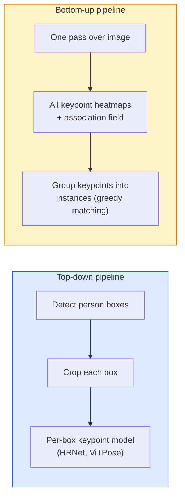

# कुंजी बिंदु का पता लगाना और स्थिति अनुमान

> एक आसन क्रमबद्ध कुंजी बिंदुओं का एक सेट है एक कुंजी बिंदु डिटेक्टर एक हीटमैप रेग्रेसर है बाकी सब कुछ लेखांकन है।

**Type:** Build
**Languages:** Python
**Prerequisites:** Phase 4 Lesson 06 (Detection), Phase 4 Lesson 07 (U-Net)
**Time:** ~45 minutes

## सीखने के लक्ष्य

- ऊपर-नीचे और नीचे-ऊपर स्थिति अनुमान को अलग करें और प्रत्येक का उपयोग कब किया जाता है, यह बताएं
- प्रति कुंजी बिंदु गॉसियन लक्ष्य के साथ K कुंजी बिंदुओं के लिए रिग्रेशन हीटमैप और निष्कर्षण पर कुंजी बिंदु निर्देशांक निकालें
- भाग संबंध क्षेत्र स्पष्ट करें (PAFs) और नीचे-ऊपर पाइपलाइनों कैसे उदाहरणों में कुंजी बिंदुओं को जोड़ती हैं
- उपयोग MediaPipe पोज या MMPose उत्पादन की कुंजी बिंदु अनुमान के लिए और उनके आउटपुट प्रारूप को समझें

## समस्या

मुख्य बिंदु कार्यों के कई नाम हैंः मानव मुद्रा (17 शरीर जोड़), चेहरे के लैंडमार्क (68 या 478 अंक), हाथ (21 अंक), जानवरों के लैंडमार्क, रोबोट वस्तुओं के लैंडमार्क, चिकित्सा शरीर रचना के लैंडमार्क। उनमें से प्रत्येक एक ही संरचना साझा करता हैः किसी वस्तु पर K विवश बिंदुओं का पता लगाएं और उनके (x, y) निर्देशांक आउटपुट करें।

आसन अनुमान गति कैप्चर, फिटनेस ऐप, खेल विश्लेषण, इशारा नियंत्रण, एनीमेशन, AR 2D मामला परिपक्व है; 3D मुद्रा (एक ही कैमरे से दुनिया के निर्देशांक में संयुक्त स्थिति का अनुमान लगाना) वर्तमान अनुसंधान सीमा है।

इंजीनियरिंग का सवाल पैमाने है. एक छवि, एक व्यक्ति का आसन 20ms की समस्या है. 30 fps पर भीड़ में बहु व्यक्ति का आसन विभिन्न वास्तुकलाओं के साथ एक अलग समस्या है।

## अवधारणा

### ऊपर-नीचे बनाम नीचे-ऊपर



- **ऊपर से नीचे** पहले लोगों का पता लगाएं, फिर प्रत्येक फसल पर प्रति व्यक्ति की कुंजी बिंदु मॉडल चलाएं। उच्चतम सटीकता; लोगों की संख्या के साथ रैखिक रूप से मापें।
- **नीचे से ऊपर** एक आगे पास सभी कुंजी बिंदुओं के साथ एक संघ क्षेत्र की भविष्यवाणी करता है; उन्हें समूहबद्ध करें। भीड़ के आकार के बावजूद निरंतर समय।

ऊपर से नीचे (HRNet, ViTPose) सटीकता के लिए अग्रणी है; नीचे-ऊपर (OpenPose, HigherHRNet) भीड़भाड़ वाली दृश्यों के लिए आउटपुट लीडर है।

### हीटमैप रिग्रेशन

पीछे हटने के बजाय `(x, y)` सीधे, भविष्यवाणी `H x W` एक Gaussian ब्लाब के साथ प्रत्येक कुंजी बिंदु के लिए गर्मी नक्शा सही स्थान पर केंद्रित.

```
target[k, y, x] = exp(-((x - cx_k)^2 + (y - cy_k)^2) / (2 sigma^2))
```

निष्कर्ष पर, प्रत्येक हीटमैप का argmax पूर्वानुमानित कुंजी बिंदु स्थान है।

क्यों हीटमैप प्रत्यक्ष प्रतिगमन से बेहतर काम करते हैंः नेटवर्क की स्थानिक संरचना (conv सुविधा मानचित्र) प्राकृतिक रूप से स्थानिक आउटपुट के साथ संरेखित होती है। गौशियन लक्ष्य भी नियमित करते हैं  एक छोटी स्थानिकरण त्रुटि शून्य के बजाय एक छोटा नुकसान पैदा करती है।

### उपपिक्सेल स्थानिकरण

Argmax पूर्णांक निर्देशांक देता है। उप-पिक्सेल सटीकता के लिए, argmax और उसके पड़ोसियों के लिए एक पैराबॉल को फिट करके परिष्कृत करें, या प्रसिद्ध ऑफसेट का उपयोग करें `(dx, dy) = 0.25 * (heatmap[y, x+1] - heatmap[y, x-1], ...)` दिशा।

### भाग आत्मीयता क्षेत्र (PAFs)

OpenPoseनीचे-ऊपर संबद्धता के लिए चाल। प्रत्येक जोड़ी के लिए जुड़े कुंजी बिंदुओं (जैसे बाएं कंधे से बाएं कोहनी) के लिए, एक 2-चैनल क्षेत्र का अनुमान लगाएं जो इकाई वेक्टर को एक से दूसरे की ओर इंगित करता है। एक कंधे को उसके कोहनी से जोड़ने के लिए, एकीकृत करें PAF उम्मीदवार जोड़े को जोड़ने वाली रेखा के साथ; उच्चतम समावेशी जोड़ी के साथ मेल खाता है।

```
For each connection (limb):
  PAF channels: 2 (unit vector x, y)
  Line integral: sum over sample points of (PAF . line_direction)
  Higher integral = stronger match
```

सुरुचिपूर्ण और प्रति व्यक्ति फसल के बिना मनमाने भीड़ आकार के लिए पैमाने पर।

### COCO कुंजी बिंदु

मानक शरीर-उपस्थिति डेटासेटः प्रति व्यक्ति 17 कुंजी बिंदु, PCK (सही कुंजी बिंदुओं का प्रतिशत) और OKS (ऑब्जेक्ट कुंजी बिंदु समानता) माप के रूप में। OKS का कुंजी बिंदु एनालॉग है IoU और क्या है COCO mAP@OKS रिपोर्ट।

### 2D बनाम 3D

- **2 डी पोज** छवि निर्देशांक; उत्पादन गुणवत्ता पर हल (MediaPipe, HRNet, ViTPose).
- **3 डी मुद्रा** दुनिया/कैमरा समन्वय; अभी भी सक्रिय अनुसंधान। सामान्य दृष्टिकोणः
  - एक छोटे से के साथ 3D 2D भविष्यवाणियों को ऊपर उठाने MLP (VideoPose3D).
  - छवि से प्रत्यक्ष 3D प्रतिगमन (PyMAF, MHFormer).
  - बहुदृश्य सेटिंग्स (CMU पनोप्टिक) के लिए जमीनी सत्य.

```figure
cv3-pose-heatmap
```

## इसे बनाओ

### चरण 1: गौशियन हीटमैप लक्ष्य

```python
import numpy as np
import torch

def gaussian_heatmap(size, cx, cy, sigma=2.0):
    yy, xx = np.meshgrid(np.arange(size), np.arange(size), indexing="ij")
    return np.exp(-((xx - cx) ** 2 + (yy - cy) ** 2) / (2 * sigma ** 2)).astype(np.float32)

hm = gaussian_heatmap(64, 32, 32, sigma=2.0)
print(f"peak: {hm.max():.3f} at ({hm.argmax() % 64}, {hm.argmax() // 64})")
```

एक चैनल अक्ष के साथ ढेर किए गए प्रति कुंजी बिंदु हीटमैप पूर्ण लक्ष्य टेंसर प्रदान करते हैं।

### चरण 2: छोटा कुंजी बिंदु सिर

यू-नेट शैली मॉडल जो K हीटमैप चैनलों को आउटपुट करता है।

```python
import torch.nn as nn
import torch.nn.functional as F

class TinyKeypointNet(nn.Module):
    def __init__(self, num_keypoints=4, base=16):
        super().__init__()
        self.down1 = nn.Sequential(nn.Conv2d(3, base, 3, 2, 1), nn.ReLU(inplace=True))
        self.down2 = nn.Sequential(nn.Conv2d(base, base * 2, 3, 2, 1), nn.ReLU(inplace=True))
        self.mid = nn.Sequential(nn.Conv2d(base * 2, base * 2, 3, 1, 1), nn.ReLU(inplace=True))
        self.up1 = nn.ConvTranspose2d(base * 2, base, 2, 2)
        self.up2 = nn.ConvTranspose2d(base, num_keypoints, 2, 2)

    def forward(self, x):
        h1 = self.down1(x)
        h2 = self.down2(h1)
        h3 = self.mid(h2)
        u1 = self.up1(h3)
        return self.up2(u1)
```

इनपुट `(N, 3, H, W)`, आउटपुट `(N, K, H, W)`. . प्रति पिक्सेल हानि है MSE गौसी के लक्ष्यों के खिलाफ।

### चरण 3: इन्फरेंस  कुंजी बिंदु निर्देशांक निकालें

```python
def heatmap_to_coords(heatmaps):
    """
    heatmaps: (N, K, H, W)
    returns:  (N, K, 2) float coordinates in image pixels
    """
    N, K, H, W = heatmaps.shape
    hm = heatmaps.reshape(N, K, -1)
    idx = hm.argmax(dim=-1)
    ys = (idx // W).float()
    xs = (idx % W).float()
    return torch.stack([xs, ys], dim=-1)

coords = heatmap_to_coords(torch.randn(2, 4, 32, 32))
print(f"coords: {coords.shape}")  # (2, 4, 2)
```

उप-पिक्सेल परिष्करण के लिए, argmax के आसपास इंटरपोलेट करें।

### चरण 4: सिंथेटिक कुंजी बिंदु डेटासेट

सरलः एक सफेद कैनवास पर चार बिंदुओं को खींचें और उन्हें भविष्यवाणी करना सीखें।

```python
def make_synthetic_sample(size=64):
    img = np.ones((3, size, size), dtype=np.float32)
    rng = np.random.default_rng()
    kps = rng.integers(8, size - 8, size=(4, 2))
    for cx, cy in kps:
        img[:, cy - 2:cy + 2, cx - 2:cx + 2] = 0.0
    hms = np.stack([gaussian_heatmap(size, cx, cy) for cx, cy in kps])
    return img, hms, kps
```

एक छोटे से मॉडल के लिए एक मिनट में सीखने के लिए पर्याप्त आसान है।

### चरण 5: प्रशिक्षण

```python
model = TinyKeypointNet(num_keypoints=4)
opt = torch.optim.Adam(model.parameters(), lr=3e-3)

for step in range(200):
    batch = [make_synthetic_sample() for _ in range(16)]
    imgs = torch.from_numpy(np.stack([b[0] for b in batch]))
    hms = torch.from_numpy(np.stack([b[1] for b in batch]))
    pred = model(imgs)
    # Upsample pred to full resolution
    pred = F.interpolate(pred, size=hms.shape[-2:], mode="bilinear", align_corners=False)
    loss = F.mse_loss(pred, hms)
    opt.zero_grad(); loss.backward(); opt.step()
```

## इसका प्रयोग करें

- **MediaPipe पोज** गूगल का उत्पादन स्थिति अनुमानक; जहाज WebGL + मोबाइल रनटाइम 10ms से कम विलंबता के साथ।
- **MMPose** (OpenMMLab)  व्यापक अनुसंधान कोडबेस; प्रत्येक SOTA पूर्व प्रशिक्षित वजन के साथ वास्तुकला।
- **YOLOv8-pose** एकल आगे के पास के साथ सबसे तेज वास्तविक समय बहु-व्यक्ति मुद्रा।
- **ट्रांसफार्मर HumanDPT / PoseAnything** खुले शब्दावली के लिए नए दृष्टि-भाषा दृष्टिकोण (किसी भी वस्तु, किसी भी कुंजी बिंदु सेट) ।

## इसे भेजें

इस पाठ से उत्पन्न होता हैः

- `outputs/prompt-pose-stack-picker.md` एक संकेत जो चुनता है MediaPipe / YOLOv8-pose / HRNet / ViTPose विलंबता, भीड़ का आकार, और 2D बनाम 3D आवश्यकता को देखते हुए।
- `outputs/skill-heatmap-to-coords.md` एक कौशल जो प्रत्येक उत्पादन मुद्रा मॉडल द्वारा उपयोग किए जाने वाले उप-पिक्सेल हीटमैप-टू-कोऑर्डिनेट रूटीन को लिखता है।

## व्यायाम

1. **(Easy)** कृत्रिम 4-बिंदु डेटासेट पर छोटे कुंजी बिंदु मॉडल को प्रशिक्षित करें। रिपोर्ट औसत L2 200 चरणों के बाद पूर्वानुमानित और सही कुंजी बिंदुओं के बीच त्रुटि।
2. **(Medium)** उप-पिक्सेल परिष्करण जोड़ेंः argmax स्थिति को देखते हुए, पड़ोसी पिक्सेल से x और y के साथ 1D पैराबॉल फिट करें। सटीकता वृद्धि बनाम पूर्णांक argmax रिपोर्ट करें।
3. **(Hard)** एक 2 व्यक्ति सिंथेटिक डेटासेट बनाएं जहां प्रत्येक छवि 4 कुंजी बिंदु पैटर्न के दो उदाहरण दिखाता है। PAFs जो भविष्यवाणी करते हैं कि किस कुंजी बिंदु का किस उदाहरण से संबंध है, और मूल्यांकन करते हैं OKS.

## प्रमुख शर्तें

| अवधि | लोग क्या कहते हैं | इसका क्या मतलब है |
|------|----------------|----------------------|
| मुख्य बिंदु | "एक ऐतिहासिक स्थल" | किसी वस्तु पर एक विशिष्ट क्रमबद्ध बिंदु (संयोजन, कोने, विशेषता) |
| पोज | "स्थला" | एक उदाहरण से संबंधित कुंजी बिंदुओं का क्रमबद्ध सेट |
| ऊपर से नीचे | "डिटेक्ट तो पोज" | दो चरणों की पाइपलाइनः व्यक्ति डिटेक्टर + प्रति फसल कुंजी बिंदु मॉडल; उच्चतम सटीकता |
| नीचे से ऊपर | "पहले पोजीशन, बाद में ग्रुप" | एकल-पास सभी कुंजी बिंदु भविष्यवाणी + समूह; भीड़ आकार में निरंतर समय |
| गर्मी का नक्शा | "गॉसियन लक्ष्य" | सही स्थान पर शिखर के साथ प्रति कुंजी बिंदु H x W टेंसर; पसंदीदा प्रतिगमन लक्ष्य |
| PAF | "अंशतः निकटता का क्षेत्र" | 2-चैनल इकाई वेक्टर फ़ील्ड कोडिंग limb दिशाओं; उदाहरणों में कुंजी बिंदुओं को समूहीकृत करने के लिए उपयोग किया जाता है |
| OKS | "किप पॉइंट IoU" | वस्तु की मुख्य बिंदु समानता; COCO पोज के लिए मेट्रिक |
| HRNet | "उच्च-रिज़ॉल्यूशन नेट" | प्रमुख शीर्ष-डाउन कुंजी बिंदु वास्तुकला; पूरे में उच्च-रिज़ॉल्यूशन सुविधाओं को संरक्षित करता है |

## आगे पढ़ना

- [OpenPose (Cao et al., 2017)](https://arxiv.org/abs/1812.08008) नीचे-ऊपर के साथ PAFs; अभी भी दृष्टिकोण का सबसे अच्छा लेखन
- [HRNet (Sun et al., 2019)](https://arxiv.org/abs/1902.09212) ऊपर से नीचे की संदर्भ वास्तुकला
- [ViTPose (Xu et al., 2022)](https://arxiv.org/abs/2204.12484) सादा ViT एक पोज रीढ़ की हड्डी के रूप में; वर्तमान SOTA कई बेंचमार्क पर
- [MediaPipe पोज](https://developers.google.com/mediapipe/solutions/vision/pose_landmarker) उत्पादन वास्तविक समय में स्थिति; 2026 में सबसे तेजी से तैनात स्टैक
