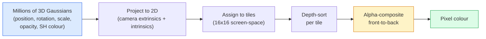

# 3 डी गॉसियन स्प्लेटिंग स्क्रैच से

> एक दृश्य 3D Gaussians के लाखों के बादल है. प्रत्येक एक स्थिति, अभिविन्यास, पैमाने, अस्पष्टता, और एक रंग है कि देखने की दिशा पर निर्भर करता है. उन्हें rasterise, वापस props के माध्यम से rasterisation, किया.

**Type:** Build
**Languages:** Python
**Prerequisites:** Phase 4 Lesson 13 (3D Vision & NeRF), Phase 1 Lesson 12 (Tensor Operations), Phase 4 Lesson 10 (Diffusion basics optional)
**Time:** ~90 minutes

## सीखने के लक्ष्य

- समझाएँ कि 3D गौशियन स्प्लैटिंग की जगह क्यों ली गई NeRF 2026 में फोटोरियलिस्टिक 3 डी पुनर्निर्माण के लिए उत्पादन डिफ़ॉल्ट के रूप में
- प्रति गॉसियन पैरामीटर (स्थिति, घूर्णन चतुर्भुज, पैमाने, अस्पष्टता, गोलाकार सामंजस्य रंग, वैकल्पिक विशेषता) और प्रत्येक में कितने फ्लोट योगदान करते हैं, बताएं
- 2 डी गौशियन स्प्लेटिंग रास्टराइज़र को खरोंच से लागू करें `alpha` रचना, फिर दिखाएं कि कैसे 3D मामले एक ही लूप में परियोजनाओं
- उपयोग `nerfstudio`, `gsplat`या `SuperSplat` 20-50 तस्वीरों से एक दृश्य को पुनर्निर्माण करने और निर्यात करने के लिए `KHR_gaussian_splatting` glTF विस्तार या OpenUSD 26.03 `UsdVolParticleField3DGaussianSplat` योजना

## समस्या

A NeRF एक दृश्य के रूप में भंडारण एक वजन MLP. प्रत्येक रेंडर पिक्सेल सैकड़ों है MLP प्रशिक्षण में घंटों लगते हैं, रेंडर में सेकंड लगते हैं, और वजन को संपादित नहीं किया जा सकता है।

3 डी गौशियन स्प्लाटिंग (केर्बल, कोपानस, लेमकुलेर, ड्रेटकीस, SIGGRAPH एक दृश्य 3 डी गौसीन्स का एक स्पष्ट सेट है. रेंडरिंग है GPU 100+ fps पर रास्टरीकरण। प्रशिक्षण मिनट लेता है। संपादन सीधा हैः गौसी के एक उपसमूह का अनुवाद करें और आप कुर्सी को स्थानांतरित कर दिया है। 2026 तक क्रोनोस समूह ने एक glTF गौसीय स्प्लैट्स के लिए विस्तार, OpenUSD 26.03 एक गौशियन स्प्लेट स्कीम भेजता है, Zillow और Apartments.com उनके साथ रियल एस्टेट का निर्माण करते हैं, और 3D पुनर्निर्माण पर अधिकांश नए शोध पत्र 3DGS के मूल विचार के संस्करण हैं।

मानसिक मॉडल सरल है, गणित में पर्याप्त चल रहे भाग हैं कि अधिकांश परिचय रास्टरीकरण से शुरू होते हैं और प्रोजेक्शन और गोलाकार सामंजस्यों से आगे बढ़ते हैं। यह सबक पूरी चीज बनाता है  पहले 2D संस्करण, फिर 3D विस्तार।

## अवधारणा

### एक गौशियन क्या ले जाता है

एक 3 डी गौशियन अंतरिक्ष में इन गुणों के साथ एक पैरामीटर ब्लेब हैः

```
position         mu         (3,)    centre in world coordinates
rotation         q          (4,)    unit quaternion encoding orientation
scale            s          (3,)    log-scales per axis (exponentiated at render time)
opacity          alpha      (1,)    post-sigmoid opacity [0, 1]
SH coefficients  c_lm       (3 * (L+1)^2,)   view-dependent colour
```

घूर्णन + पैमाने 3x3 सह-परिवर्तन का निर्माण करेंः `Sigma = R S S^T R^T`. यह 3 डी में गौशियन का आकार है. गोलाकार सामंजस्य दृश्य दिशा के साथ रंग बदलने देता है  दर्पण हाइलाइट्स, सूक्ष्म चमक, दृश्य-निर्भर चमक  बिना प्रति दृश्य बनावट को संग्रहीत किए। SH डिग्री 3 आपको प्रति रंग चैनल 16 गुणांक मिलता है, केवल रंग के लिए 48 फ्लोट्स प्रति गौशियन।

एक दृश्य में आमतौर पर 1-5 मिलियन गौसी होते हैं। प्रत्येक स्टोर लगभग 60 फ्लोट (3 + 4 + 3 + 1 + 48 + मिक्स) होता है। MB पांच मिलियन-गॉसियन दृश्य के लिए  प्रति बिंदु बनावट के साथ समकक्ष बिंदु बादल से बहुत छोटा है, और एक से छोटे के आकार का आदेश NeRFहै MLP उच्च संकल्प पर वजन पुनः प्रस्तुत किया गया।

### रेसटेरिज़ेशन, न कि रे मार्चिंग



पांच कदम, सभी GPU-friendly. नहीं MLP प्रति पिक्सेल प्रश्न. एक एकल RTX 3080 Ti 147 fps पर 6 मिलियन स्प्लैट देता है।

### प्रक्षेपण चरण

3 डी दुनिया की स्थिति में Gaussian `mu` 3D सह-विवर्तन के साथ `Sigma` स्क्रीन की स्थिति में 2D Gaussian के लिए परियोजनाओं `mu'` 2D सह-विवर्तन के साथ `Sigma'`:

```
mu' = project(mu)
Sigma' = J W Sigma W^T J^T          (2 x 2)

W = viewing transform (rotation + translation of camera)
J = Jacobian of the perspective projection at mu'
```

2D Gaussian के पदचिह्न एक दीर्घवृत्त है जिसका अक्षों के स्ववेक्टर हैं `Sigma'`उस दीर्घवृत्त के अंदर प्रत्येक पिक्सेल Gaussian का योगदान प्राप्त करता है, द्वारा वजन `exp(-0.5 * (p - mu')^T Sigma'^-1 (p - mu'))`.

### अल्फा-संयोजन नियम

एक पिक्सेल के लिए, इसे कवर करने वाले गौसीयन को सामने से पीछे (या उल्टे सूत्र के साथ बराबर सामने से पीछे) क्रमबद्ध किया जाता है। 1980 के दशक के बाद से प्रत्येक अर्ध-पारदर्शी रास्टरर के समान समीकरण के साथ रंग का निर्माण किया गया हैः

```
C_pixel = sum_i alpha_i * T_i * c_i

T_i = prod_{j < i} (1 - alpha_j)       transmittance up to i
alpha_i = opacity_i * exp(-0.5 * d^T Sigma'^-1 d)   local contribution
c_i = eval_SH(SH_i, view_direction)    view-dependent colour
```

यह है **समान समीकरण NeRF' के वॉल्यूमट्रिक रेंडर**एक किरण के साथ घने नमूने के बजाय गौसी के स्पष्ट दुर्लभ सेट पर। NeRF दोनों ही रेडिएंस फील्ड समीकरण को एकीकृत कर रहे हैं।

### यह अंतर क्यों है

प्रत्येक कदम  प्रक्षेपण, टाइल असाइनमेंट, अल्फा रचना, SH मूल्यांकन  Gaussian मापदंडों के संबंध में अंतर करने योग्य है। ग्राउंड-सत्य छवि को देखते हुए, गणना रेंडर पिक्सेल हानि, rasteriser के माध्यम से बैकप्रॉप, सभी अद्यतन `(mu, q, s, alpha, c_lm)` लगभग 30,000 पुनरावृत्ति से अधिक Gaussians अपनी सही स्थिति, पैमाने, और रंग खोजने के लिए.

### घनत्व और काटने

गॉसियन के एक निश्चित सेट में एक जटिल दृश्य शामिल नहीं हो सकता है। प्रशिक्षण में दो अनुकूलन तंत्र शामिल हैंः

- **क्लोन** एक Gaussian अपनी वर्तमान स्थिति पर जब इसकी ग्रेडिएंट परिमाण उच्च है लेकिन इसके पैमाने छोटे है  पुनर्निर्माण अधिक विवरण की जरूरत है यहाँ।
- **विभाजित** एक बड़े पैमाने पर गौशियन दो छोटे लोगों में विभाजित जब इसकी ग्रेडिएंट उच्च है  एक बड़ा गौशियन क्षेत्र में फिट होने के लिए बहुत चिकनी है।
- **पुआल** गौसीन जिनके अस्पष्टता एक सीमा से नीचे गिरती है  वे योगदान नहीं कर रहे हैं।

घनत्व प्रत्येक N पुनरावृत्ति में चलता है। एक दृश्य आमतौर पर ~ 100k प्रारंभिक गौसी (बीज से उत्पन्न) से बढ़ता है SfM प्रशिक्षण के अंत में 1-5M तक।

### एक पैराग्राफ में गोलाकार सामंजस्य

दृश्य-निर्भर रंग एक फ़ंक्शन है `c(direction)` यूनिट गोला पर. गोलाकार सामंजस्य गोला के Fourier आधार हैं. डिग्री पर ट्रंक `L` और आप प्राप्त `(L+1)^2` एक नए दृश्य के लिए रंग का मूल्यांकन सीखने के बीच एक बिंदु उत्पाद है SH देखने की दिशा में मूल्यांकन किए गए गुणांक और आधार। डिग्री 0 = एक coefficient = constant colour. Degree 3 = 16 coefficients = enough to capture Lambertian shading, specular, और हल्के प्रतिबिंब। SD गौशियन स्प्लैटिंग पेपर डिफ़ॉल्ट रूप से डिग्री 3 का उपयोग करते हैं।

### 2026 उत्पादन स्टैक

```
1. Capture         smartphone / DJI drone / handheld scanner
2. SfM / MVS       COLMAP or GLOMAP derives camera poses + sparse points
3. Train 3DGS      nerfstudio / gsplat / inria official / PostShot (~10-30 min on RTX 4090)
4. Edit            SuperSplat / SplatForge (clean floaters, segment)
5. Export          .ply -> glTF KHR_gaussian_splatting or .usd (OpenUSD 26.03)
6. View            Cesium / Unreal / Babylon.js / Three.js / Vision Pro
```

### 4D और जनरेटिव वेरिएंट

- **4 डी गौशियन स्प्लैटिंग** गौसीन्स समय के कार्य हैं; वॉल्यूमेट्रिक वीडियो (सुपरमैन 2026, A$) के लिए उपयोग किया जाता हैAP रॉकी की "हेलीकॉप्टर") ।
- **जनरेटिव स्पॉट** पाठ-से-स्प्लैट मॉडल (वर्ल्ड लैब्स द्वारा मार्बल) जो पूरे दृश्यों को पगलाते हैं।
- **3 डी गौशियन अमूर्त परिवर्तन** — NVIDIA NuRecस्वायत्त ड्राइविंग सिमुलेशन के लिए एक संस्करण।

```figure
cv3-gaussian-splat
```

## इसे बनाओ

### चरण 1: एक 2D गौशियन

हम पहले एक 2D rasteriser बनाने. 3D मामले को इसे करने के लिए नीचे गिरावट के बाद प्रोजेक्शन.

```python
import torch
import torch.nn as nn
import torch.nn.functional as F


def eval_2d_gaussian(means, covs, points):
    """
    means:  (G, 2)      centres
    covs:   (G, 2, 2)   covariance matrices
    points: (H, W, 2)   pixel coordinates
    returns: (G, H, W)  density at every pixel for every Gaussian
    """
    G = means.size(0)
    H, W, _ = points.shape
    flat = points.view(-1, 2)
    inv = torch.linalg.inv(covs)
    diff = flat[None, :, :] - means[:, None, :]
    d = torch.einsum("gpi,gij,gpj->gp", diff, inv, diff)
    density = torch.exp(-0.5 * d)
    return density.view(G, H, W)
```

`einsum` क्या वर्गिक रूप `diff^T Sigma^-1 diff` प्रत्येक (गॉसियन, पिक्सेल) जोड़े के लिए।

### चरण 2: 2 डी स्प्लैटिंग रास्टरीज़र

2D में गहराई का कोई मतलब नहीं है, इसलिए हम आदेश के लिए एक Gaussian per-शिक्षित स्केल का उपयोग.

```python
def rasterise_2d(means, covs, colours, opacities, depths, image_size):
    """
    means:     (G, 2)
    covs:      (G, 2, 2)
    colours:   (G, 3)
    opacities: (G,)     in [0, 1]
    depths:    (G,)     per-Gaussian scalar used for ordering
    image_size: (H, W)
    returns:   (H, W, 3) rendered image
    """
    H, W = image_size
    yy, xx = torch.meshgrid(
        torch.arange(H, dtype=torch.float32, device=means.device),
        torch.arange(W, dtype=torch.float32, device=means.device),
        indexing="ij",
    )
    points = torch.stack([xx, yy], dim=-1)

    densities = eval_2d_gaussian(means, covs, points)
    alphas = opacities[:, None, None] * densities
    alphas = alphas.clamp(0.0, 0.99)

    order = torch.argsort(depths)
    alphas = alphas[order]
    colours_sorted = colours[order]

    T = torch.ones(H, W, device=means.device)
    out = torch.zeros(H, W, 3, device=means.device)
    for i in range(means.size(0)):
        a = alphas[i]
        out += (T * a)[..., None] * colours_sorted[i][None, None, :]
        T = T * (1.0 - a)
    return out
```

तेजी से नहीं  एक वास्तविक कार्यान्वयन टाइल आधारित का उपयोग करता है CUDA kernels  लेकिन सही गणित और पूरी तरह से अंतर योग्य.

### चरण 3: एक प्रशिक्षित 2D स्प्लैट दृश्य

```python
class Splats2D(nn.Module):
    def __init__(self, num_splats=128, image_size=64, seed=0):
        super().__init__()
        g = torch.Generator().manual_seed(seed)
        H, W = image_size, image_size
        self.means = nn.Parameter(torch.rand(num_splats, 2, generator=g) * torch.tensor([W, H]))
        self.log_scale = nn.Parameter(torch.ones(num_splats, 2) * math.log(2.0))
        self.rot = nn.Parameter(torch.zeros(num_splats))  # single angle in 2D
        self.colour_logits = nn.Parameter(torch.randn(num_splats, 3, generator=g) * 0.5)
        self.opacity_logit = nn.Parameter(torch.zeros(num_splats))
        self.depth = nn.Parameter(torch.rand(num_splats, generator=g))

    def covs(self):
        s = torch.exp(self.log_scale)
        c, si = torch.cos(self.rot), torch.sin(self.rot)
        R = torch.stack([
            torch.stack([c, -si], dim=-1),
            torch.stack([si, c], dim=-1),
        ], dim=-2)
        S = torch.diag_embed(s ** 2)
        return R @ S @ R.transpose(-1, -2)

    def forward(self, image_size):
        covs = self.covs()
        colours = torch.sigmoid(self.colour_logits)
        opacities = torch.sigmoid(self.opacity_logit)
        return rasterise_2d(self.means, covs, colours, opacities, self.depth, image_size)
```

`log_scale`, `opacity_logit`और `colour_logits` यह सभी निर्बंधित पैरामीटर हैं जो रेंडर समय पर सही सक्रियण के माध्यम से मैप किए गए हैं। यह प्रत्येक 3DGS कार्यान्वयन के लिए मानक पैटर्न है।

### चरण 4: लक्ष्य छवि के लिए 2D Gaussians फिट

```python
import math
import numpy as np

def make_target(size=64):
    yy, xx = np.meshgrid(np.arange(size), np.arange(size), indexing="ij")
    img = np.zeros((size, size, 3), dtype=np.float32)
    # Red circle
    mask = (xx - 20) ** 2 + (yy - 20) ** 2 < 10 ** 2
    img[mask] = [1.0, 0.2, 0.2]
    # Blue square
    mask = (np.abs(xx - 45) < 8) & (np.abs(yy - 40) < 8)
    img[mask] = [0.2, 0.3, 1.0]
    return torch.from_numpy(img)


target = make_target(64)
model = Splats2D(num_splats=64, image_size=64)
opt = torch.optim.Adam(model.parameters(), lr=0.05)

for step in range(200):
    pred = model((64, 64))
    loss = F.mse_loss(pred, target)
    opt.zero_grad(); loss.backward(); opt.step()
    if step % 40 == 0:
        print(f"step {step:3d}  mse {loss.item():.4f}")
```

200 से अधिक चरणों में 64 गौसी दोनों आकारों में बस जाते हैं। यह स्पष्ट ज्यामितीय आदिम पर ग्रेडिएंट-डिसेन्शन का पूरा विचार है।

### चरण 5: 2D से 3D तक

3 डी विस्तार एक ही लूप बनाए रखता है।

1. प्रतिगौसियन घूर्णन एक एकल कोण के बजाय एक चतुर्भुज है।
2. सह-अंतर `R S S^T R^T` के साथ `R` क्वाटरनियन से निर्मित और `S = diag(exp(log_scale))`.
3. प्रक्षेपण `(mu, Sigma) -> (mu', Sigma')` पर परिप्रेक्ष्य प्रक्षेपण के कैमरा बाहरी और जैकोबियन का उपयोग करता है `mu`.
4. रंग एक गोलाकार-समन्वय विस्तार बन जाता है; इसे देखने की दिशा में मूल्यांकन करें।
5. गहराई-सरट वास्तविक कैमरा-स्पेस z से है सीखने वाले स्केलर के बजाय।

प्रत्येक उत्पादन कार्यान्वयन (`gsplat`, `inria/gaussian-splatting`, `nerfstudio`) पर यह ठीक यही करता है GPU टाइल आधारित CUDA खजूर।

### चरण 6: गोलाकार सामंजस्य का मूल्यांकन

इन SH आधार स्तर 3 तक प्रत्येक चैनल के लिए 16 शब्द है। मूल्यांकनः

```python
def eval_sh_degree_3(sh_coeffs, dirs):
    """
    sh_coeffs: (..., 16, 3)   last dim is RGB channels
    dirs:      (..., 3)       unit vectors
    returns:   (..., 3)
    """
    C0 = 0.282094791773878
    C1 = 0.488602511902920
    C2 = [1.092548430592079, 1.092548430592079,
          0.315391565252520, 1.092548430592079,
          0.546274215296039]
    x, y, z = dirs[..., 0], dirs[..., 1], dirs[..., 2]
    x2, y2, z2 = x * x, y * y, z * z
    xy, yz, xz = x * y, y * z, x * z

    result = C0 * sh_coeffs[..., 0, :]
    result = result - C1 * y[..., None] * sh_coeffs[..., 1, :]
    result = result + C1 * z[..., None] * sh_coeffs[..., 2, :]
    result = result - C1 * x[..., None] * sh_coeffs[..., 3, :]

    result = result + C2[0] * xy[..., None] * sh_coeffs[..., 4, :]
    result = result + C2[1] * yz[..., None] * sh_coeffs[..., 5, :]
    result = result + C2[2] * (2.0 * z2 - x2 - y2)[..., None] * sh_coeffs[..., 6, :]
    result = result + C2[3] * xz[..., None] * sh_coeffs[..., 7, :]
    result = result + C2[4] * (x2 - y2)[..., None] * sh_coeffs[..., 8, :]

    # degree 3 terms omitted here for brevity; full 16-coefficient version in the code file
    return result
```

सीखा `sh_coeffs` इस Gaussian के लिए "हर दिशा में रंग" स्टोर करें. रेंडर समय आप वर्तमान दृश्य दिशा के खिलाफ मूल्यांकन और एक 3 वेक्टर मिलता है RGB.

## इसका प्रयोग करें

वास्तविक 3DGS कार्य के लिए, उपयोग करें `gsplat` (मेटा) या `nerfstudio`:

```bash
pip install nerfstudio gsplat
ns-download-data example
ns-train splatfacto --data path/to/data
```

`splatfacto` यह तंत्रिका स्टूडियो के 3DGS ट्रेनर है. दौड़ 10-30 मिनट पर लेता है RTX 4090 एक विशिष्ट दृश्य के लिए.

2026 में महत्वपूर्ण निर्यात विकल्पः

- `.ply` कच्चे गौसीन क्लाउड (पोर्टेबल, सबसे बड़ी फ़ाइल) ।
- `.splat` — PlayCanvas / SuperSplat क्वांटिज़्ड प्रारूप।
- glTF `KHR_gaussian_splatting` क्रोनोस मानक, जो दर्शकों के बीच पोर्टेबल है (फरवरी 2026 RC).
- OpenUSD `UsdVolParticleField3DGaussianSplat` — USD-native, के लिए NVIDIA ओम्निवर्स और विजन प्रो पाइपलाइन।

4D / गतिशील दृश्यों के लिए, `4DGS` और `Deformable-3DGS` समय के साथ भिन्न साधनों और अस्पष्टताओं के साथ एक ही मशीनरी का विस्तार करें।

## इसे भेजें

इस पाठ से उत्पन्न होता हैः

- `outputs/prompt-3dgs-capture-planner.md` एक संकेत जो किसी दिए गए दृश्य प्रकार के लिए कैप्चर सत्र (फोटो की संख्या, कैमरा पथ, प्रकाश व्यवस्था) की योजना बनाता है।
- `outputs/skill-3dgs-export-router.md` एक कौशल जो सही निर्यात प्रारूप चुनता है (`.ply` / `.splat` / glTF / USD) नीचे प्रवाह दर्शक या इंजन को दिया गया।

## व्यायाम

1. **(Easy)** एक अलग सिंथेटिक छवि पर ऊपर 2D स्प्लैट ट्रेनर चलाएं। `num_splats` में `[16, 64, 256]` और भूखंड MSE प्रति चरण प्रति चरण प्रति चरण प्रति चरण प्रति चरण प्रति चरण प्रति चरण प्रति चरण प्रति चरण प्रति चरण प्रति चरण प्रति चरण प्रति चरण प्रति चरण प्रति चरण प्रति चरण प्रति चरण प्रति चरण प्रति चरण प्रति चरण प्रति चरण प्रति चरण प्रति चरण प्रति चरण प्रति चरण प्रति चरण प्रति चरण प्रति चरण प्रति चरण प्रति चरण प्रति चरण प्रति चरण प्रति चरण प्रति चरण प्रति चरण प्रति चरण प्रति चरण प्रति चरण प्रति चरण प्रति चरण प्रति चरण प्रति चरण प्रति चरण प्रति चरण प्रति चरण प्रति चरण प्रति चरण प्रति चरण प्रति चरण प्रति चरण प्रति चरण प्रति चरण प्रति चरण प्रति चरण प्रति चरण प्रति चरण प्रति चरण प्रति चरण प्रति चरण प्रति चरण प्रति चरण प्रति चरण प्रति चरण प्रति चरण प्रति चरण प्रति चरण प्रति चरण प्रति चरण प्रति चरण प्रति चरण प्रति चरण प्रति चरण प्रति चरण प्रति चरण प्रति चरण प्रति चरण प्रति चरण प्रति चरण प्रति चरण प्रति चरण प्रति चरण प्रति चरण प्रति चरण प्रति चरण प्रति चरण प्रति चरण प्रति चरण प्रति चरण प्रति चरण प्रति चरण प्रति चरण प्रति चरण प्रति चरण प्रति चरण प्रति चरण प्रति चरण प्रति चरण प्रति चरण प्रति चरण प्रति चरण प्रति चरण प्रति चरण प्रति चरण प्रति चरण प्रति प्रति चरण प्रति चरण प्रति चरण प्रति चरण प्रति चरण प्रति चरण प्रति प्रति प्रति चरण प्रति चरण प्रति चरण प्रति प्रति प्रति प्रति चरण प्रति चरण प्रति प्रति प्रति चरण प्रति प्रति चरण प्रति प्रति प्रति चरण प्रति प्रति प्रति चरण प्रति प्रति प्रति प्रति चरण प्रति प्रति चरण प्रति प्रति प्रति प्रति प्रति प्रति प्रति चरण प्रति प्रति प्रति प्रति प्रति प्रति प्रति प्रति चरण प्रति प्रति प्रति प्रति प्रति प्रति प्रति प्रति प्रति प्रति प्रति प्रति प्रति प्रति चरण प्रति प्रति प्रति प्रति प्रति प्रति प्रति प्रति चरण प्रति प्रति प्रति प्रति प्रति प्रति प्रति प्रति प्रति प्रति प्रति प्रति प्रति प्रति प्रति प्रति चरण प्रति प्रति प्रति प्रति प्रति प्रति प्रति प्रति प्रति चरण प्रति प्रति प्रति प्रति प्रति प्रति प्रति प्रति प्रति प्रति प्रति प्रति चरण प्रति प्रति प्रति प्रति प्रति प्रति प्रति प्रति प्रति प्रति प्रति प्रति प्रति प्रति चरण प्रति प्रति प्रति प्रति प्रति प्रति प्रति प्रति प्रति प्रति प्रति प्रति प्रति प्रति प्रति प्रति प्रति प्रति प्रति प्रति प्रति प्रति प्रति प्रति प्रति प्रति प्रति प्रति प्रति प्रति प्रति प्रति प्रति प्रति प्रति प्रति प्रति प्रति प्रति प्रति प्रति प्रति प्रति प्रति प्रति प्रति प्रति प्रति प्रति प्रति प्रति प्रति प्रति प्रति प्रति प्रति प्रति प्रति प्रति प्रति प्रति प्रति प्रति प्रति प्रति प्रति प्रति प्रति प्रति प्रति प्रति प्रति प्रति प्रति प्रति प्रति प्रति प्रति प्रति प्रति प्रति प्रति प्रति प्रति प्रति प्रति प्रति प्रति प्रति प्रति प्रति प्रति प्रति प्रति प्रति प्रति प्रति प्रति प्रति प्रति प्रति प्रति प्रति प्रति प्रति प्रति प्रति प्रति प्रति प्रति प्रति प्रति प्रति प्रति प्रति प्रति प्रति प्रति प्रति प्रति प्रति प्रति प्रति प्रति प्रति प्रति प्रति प्रति प्रति प्रति प्रति प्रति प्रति प्रति प्रति प्रति प्रति प्रति प्रति प्रति प्रति प्रति प्रति प्रति प्रति प्रति प्रति प्रति प्रति प्रति प्रति प्रति प्रति प्रति प्रति प्रति
2. **(Medium)** 2 डी रास्टराइज़र को प्रति-गॉसियन समर्थन के लिए बढ़ाएं RGB एक डिग्री-2 हार्मोनिक के माध्यम से एक स्केलर "दृष्टिकोण कोण" पर निर्भर रंगों। लक्ष्य छवियों की एक जोड़ी पर प्रशिक्षित करें और मॉडल दोनों को पुनः बनाता है।
3. **(Hard)** क्लोन `nerfstudio` और ट्रेन `splatfacto` किसी भी दृश्य की 20 तस्वीरों पर कब्जा करें जो आपके पास है (डस्क, संयंत्र, चेहरा, कमरा) glTF `KHR_gaussian_splatting` और इसे एक दर्शक में खोलें (Three.js) `GaussianSplats3D`, SuperSplat, Babylon.js V9) प्रशिक्षण समय, गौसी की संख्या और प्रतिफल की गई संख्या की रिपोर्ट करें।

## प्रमुख शर्तें

| अवधि | लोग क्या कहते हैं | इसका क्या मतलब है |
|------|----------------|----------------------|
| 3DGS | "गौसियन स्प्लैट्स" | स्पष्ट दृश्य प्रतिनिधित्व के रूप में लाखों 3D Gaussians के साथ प्रति Gaussian स्थिति, घूर्णन, पैमाने, अस्पष्टता, SH रंग |
| सह-अंतर | "गौसियन का आकार" | `Sigma = R S S^T R^T`; एक गौशियन की अभिविन्यास और एनिसोट्रॉपिक स्केल |
| अल्फा कम्पोजिटिंग | "बैक-टू-फ्रंट मिश्रण" | समान समीकरण NeRF' की मात्रा रेंडर, अब एक स्पष्ट दुर्लभ सेट पर |
| घनत्व | "क्लोन और विभाजित" | जहां पुनर्निर्माण के लिए उपयुक्त नहीं है, नए गौसीयनों का अनुकूलन |
| कटाई | "कम अस्पष्टता को हटा दें" | प्रशिक्षण के दौरान लगभग शून्य अस्पष्टता के लिए गिर गया है जो Gaussians हटा दें |
| गोलाकार हार्मोनिक्स | "दृश्य-निर्भर रंग" | गोले पर फ़ूरियर आधार; देखने की दिशा के कार्य के रूप में रंग को संग्रहीत करता है |
| स्पाटफैक्टो | "नेरफस्टूडियो के 3DGS" | 2026 में 3DGS प्रशिक्षण के लिए सबसे आसान मार्ग |
| `KHR_gaussian_splatting` | "glTF मानक" | क्रोनोस 2026 विस्तार जो 3DGS को दर्शक और इंजनों के बीच पोर्टेबल बनाता है |

## आगे पढ़ना

- [वास्तविक समय में रेडिएंस फील्ड रेंडरिंग के लिए 3 डी गौशियन स्प्लैटिंग (Kerbl et al., SIGGRAPH 2023)](https://repo-sam.inria.fr/fungraph/3d-gaussian-splatting/) मूल कागज
- [gsplat (मेटा/नेर्फ़स्टुडियो)](https://github.com/nerfstudio-project/gsplat) उत्पादन की गुणवत्ता CUDA रास्टर
- [nerfstudio स्प्लैटफैक्टो](https://docs.nerf.studio/nerfology/methods/splat.html) संदर्भ प्रशिक्षण नुस्खा
- [Khronos KHR_gaussian_splatting विस्तार](https://github.com/KhronosGroup/glTF/blob/main/extensions/2.0/Khronos/KHR_gaussian_splatting/README.md) 2026 पोर्टेबल प्रारूप
- [OpenUSD 26.03 जारी करने के नोट](https://openusd.org/release/) — `UsdVolParticleField3DGaussianSplat` योजना
- [THE FUTURE 3 डी गॉसियन स्प्लैटिंग की स्थिति 2026](https://www.thefuture3d.com/blog-0/2026/4/4/state-of-gaussian-splatting-2026) उद्योग का अवलोकन
