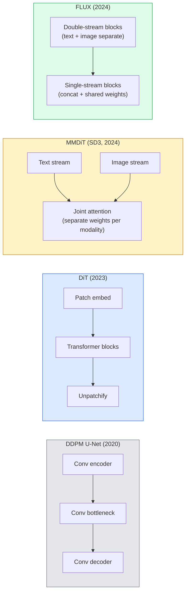

# विसारण ट्रांसफार्मर और सुधारित प्रवाह

> यू-नेट प्रसार का रहस्य नहीं है. इसे एक ट्रांसफार्मर के साथ बदलें, शोर कार्यक्रम को एक सीधी रेखा प्रवाह के लिए बदलें, और अचानक आप SD3, FLUX, और हर 2026 पाठ-चित्र मॉडल.

**Type:** Learn + Build
**Languages:** Python
**Prerequisites:** Phase 4 Lesson 10 (Diffusion DDPM), Phase 4 Lesson 14 (ViT), Phase 7 Lesson 02 (Self-Attention)
**Time:** ~75 minutes

## सीखने के लक्ष्य

- यू-नेट से विकास का पता लगाएं DDPM (पाठ 10) से डिफ्यूजन ट्रांसफार्मर (DiT), MMDiT (SD3), और एकल+डबल स्ट्रीम DiT (FLUX)
- सुधारित प्रवाह की व्याख्या करेंः शोर और डेटा के बीच एक सीधी रेखा की प्रक्षेपवक्र में मॉडल 1000 के बजाय 20 चरणों में नमूना क्यों ले सकते हैं
- एक छोटी सी लागू करें DiT ब्लॉक और एक सुधारित प्रवाह प्रशिक्षण लूप, दोनों 100 लाइनों से नीचे
- मॉडल के भिन्नताएँ (SD3, FLUX.1-dev, FLUX.1-schnell, Z-Image, Qwen-आर्किटेक्चर, पैरामीटर गिनती और लाइसेंसिंग द्वारा

## समस्या

पाठ 10 एक DDPM इस नुस्खा ने 2020-2023 में वर्चस्व हासिल कियाः यू-नेट + बीटा शेड्यूल + शोर-पूर्वानुमान हानि। इसने स्थिर विसार 1.5 और 2.1 और DALL-E 2.

2026 तक हर अत्याधुनिक पाठ-चित्र मॉडल इसे पार कर गया है। FLUX, SD4, Z-Image, Qwen- छवि, Hunyuan-Image  कोई भी यू-नेट का उपयोग नहीं करते हैं। वे विसारण ट्रांसफार्मर का उपयोग करते हैं (DiT). SD3 और FLUX और भी विनिमय DDPM संशोधित प्रवाह के लिए शोर कार्यक्रम, जो शोर से डेटा तक के मार्ग को सीधा करता है और सुसंगतता या डिस्टिल किए गए संस्करणों के साथ 1-4 चरणों में निष्कर्ष निकालने की अनुमति देता है।

बदलाव महत्वपूर्ण है क्योंकि यह कारण है कि विसारक आधारित छवि उत्पादन नियंत्रण योग्य, शीघ्र-सटीक हो गया (SD3/SD4 हल पाठ रेंडर) और उत्पादन-जलद DiT + सुधारित प्रवाह 2026 जनरेटिव-इमेज स्टैक को समझ रहा है।

## अवधारणा

### यू-नेट से ट्रांसफार्मर तक



- **DiT** (पीबल्स और Xie, 2023)  यू-नेट को एक ViT-like लटेंट पैच पर ट्रांसफार्मर। अनुकूलन परत मानक के माध्यम से कंडीशनिंग (AdaLN).
- **MMDiT** (SD3, Esser et al., 2024)  दो धाराओं के लिए अलग वजन के साथ पाठ और छवि टोकन जो एक संयुक्त ध्यान साझा करते हैं।
- **FLUX** (ब्लैक फॉरेस्ट लैब्स, 2024)  पहले N ब्लॉक डबल स्ट्रीम जैसे SD3, बाद में ब्लॉक उच्च गहराई पर दक्षता के लिए एक-कटा और वजन साझा (एकल-प्रवाह) ।
- **Z-Image** (2025)  एक कुशल एकल प्रवाह DiT 6B मापदंडों पर जो "सभी कीमत पर पैमाने" को चुनौती देता है।

### एक पैराग्राफ में सुधारित प्रवाह

DDPM आगे की प्रक्रिया को शोर के रूप में परिभाषित करता है SDE जहां `x_t` यह एक दूसरे के लिए एक बहुत ही महत्वपूर्ण विषय है। SDE, 1000 छोटे कदमों से हल किया गया।

सुधारित प्रवाह एक परिभाषित करता है **सीधी रेखा** स्वच्छ डेटा और शुद्ध शोर के बीच अंतरालः

```
x_t = (1 - t) * x_0 + t * epsilon,     t in [0, 1]
```

गति की भविष्यवाणी करने के लिए एक नेटवर्क को प्रशिक्षित करें `v_theta(x_t, t) = epsilon - x_0` स्वच्छ डेटा से शोर तक सीधे मार्ग के साथ आगे की दिशा (`dx_t/dt`) नमूना लेने के दौरान, आप इस गति को पीछे की ओर एकीकृत करते हैं शोर से डेटा की ओर कदम उठाने के लिए। ODE एक सीधी रेखा के बहुत करीब है, इसलिए नमूना लेने के लिए कम समावेशी चरणों की आवश्यकता है।

SD3 यह कहते हैं **सुधारित प्रवाह मिलान**. FLUX, Z-Image, और अधिकांश 2026 मॉडल एक ही उद्देश्य का उपयोग करते हैं। विशिष्ट निष्कर्षः 20-30 एयूलर चरण (निर्धारक) बनाम 50+ DDIM पुराने में कदम DDPM रेजिम. डिस्टिल / टर्बो / त्वरण / LCM वेरिएंट इसे 1-4 कदम तक ले जाते हैं।

### AdaLN कंडीशनिंग

DiTs समय चरण और वर्ग/पाठ पर शर्त **अनुकूलन परत मानदंड**भविष्यवाणी `scale` और `shift` कंडीशनिंग वेक्टर से और उन्हें लागू करने के बाद LayerNorm. बहुत साफ से FiLM-style यू-नेट में मॉड्यूलेशन और प्रत्येक आधुनिक में डिफ़ॉल्ट DiT.

```
cond -> MLP -> (scale, shift, gate)
norm(x) * (1 + scale) + shift, then residual add * gate
```

### पाठ एन्कोडर में SD3 और FLUX

- **SD3** तीन पाठ एन्कोडर का उपयोग करता हैः दो CLIP models + T5-XXL. सम्मिलित सामग्री को संश्लेषित किया गया और पाठ कंडीशनिंग के रूप में छवि धारा में डाला गया।
- **FLUX** एक का उपयोग करता है CLIP-L + T5-XXL.
- **Qwen- छवि / Z- छवि** वेरिएंट अपने स्वयं के इन-हाउस पाठ एन्कोडर का उपयोग करते हैं जो उनके आधार के साथ संरेखित होते हैं LLMs.

पाठ एन्कोडर क्यों का एक बड़ा हिस्सा है SD3/FLUX संकेतों के बारे में तर्क इतना बेहतर SD1.5. T5-XXL अकेले 4.7B पैराम है।

### वर्गीकरणकर्ता मुक्त मार्गदर्शन अभी भी लागू है

सुधारित प्रवाह नमूना बदलता है, न कि कंडीशनिंग। वर्गीकरण मुक्त मार्गदर्शन (प्रशिक्षण के दौरान 10% संभावना के साथ ड्रॉप पाठ, निष्कर्ष पर सशर्त और असीमित भविष्यवाणियों को मिलाएं) सुधारित प्रवाह के साथ समान रूप से काम करता है। अधिकांश 2026 मॉडल मार्गदर्शन पैमाने का उपयोग करते हैं 3.5-5  से कम SD1.57.5 है क्योंकि सुधारित प्रवाह मॉडल डिफ़ॉल्ट रूप से संकेतों को अधिक सख्ती से पालन करते हैं।

### सुसंगतता, टर्बो, शनेल, LCM

एक ही विचार के लिए चार नामः धीमी गति से कई चरणों के मॉडल को तेजी से कुछ चरणों के मॉडल में डिस्टिल करें।

- **LCM (लैटिनेंट कॉर्सिसेन्स मॉडल)** एक छात्र को प्रशिक्षित करें जो अंतिम परीक्षा का अनुमान लगाता है `x_0` किसी भी मध्यवर्ती से `x_t` एक कदम में।
- **SDXL टर्बो / FLUX शीघ्र** 1-4 चरणों के मॉडल विरोधी विसारण डिस्टिलिशन के साथ प्रशिक्षित।
- **SD टर्बो** — OpenAI-style लटेंट विसारण के लिए अनुकूलित अनुरूपता मॉडल।

किसी भी नए मॉडल जहाजों का उत्पादन सेवा एक "पूर्ण गुणवत्ता" चेकपोस्ट और एक "टर्बो / त्वरित" संस्करण दोनों के साथ होता है। शनेल ("जर्मन में तेजी से", ब्लैक फॉरेस्ट लैब्स की सम्मेलन) 1-4 चरणों में चलता है और वास्तविक समय पाइपलाइनों में फिट बैठता है।

### 2026 में मॉडल परिदृश्य

| मॉडल | आकार | वास्तुकला | लाइसेंस |
|-------|------|--------------|---------|
| Stable Diffusion 3 Medium | 2B | MMDiT | SAI समुदाय |
| Stable Diffusion 3.5 Large | 8B | MMDiT | SAI समुदाय |
| FLUX.1-dev | 12B | Double + Single Stream DiT | गैर वाणिज्यिक |
| FLUX.1-schnell | 12B | समान, डिस्टिल | अपाचे 2.0 |
| FLUX.2 | — | पुनरावृत्त FLUX.1 | मिश्रित |
| Z-Image | 6B | S3-DiT (स्केलेबल सिंगल स्ट्रीम) | अनुमत |
| Qwen- छवि | ~20B | DiT + Qwen पाठ टॉवर | अपाचे 2.0 |
| Hunyuan-Image-3.0 | ~80B | DiT | अनुसंधान |
| SD4 टर्बो | 3B | DiT + distillation | SAI वाणिज्यिक |

FLUX.1-schnell 2026 ओपन सोर्स डिफ़ॉल्ट है। Z-Image दक्षता नेता है। FLUX.2 और SD4 वर्तमान गुणवत्ता युक्तियाँ हैं।

### इस चरण की बदलाव का महत्व क्यों है

DDPM + U-Net worked. DiT + rectified flow works **बेहतर, तेज़ और स्वच्छता से अधिक**. संक्रमण से समानांतर है RNNs में ट्रांसफार्मर के लिए NLPएक ही समस्या को हल किया, लेकिन ट्रांसफार्मर पैमाने पर और अब हावी है। DiT-shaped एक संकेतक और आमतौर पर एक सही प्रवाह लक्ष्य। DDPM अब यह मुख्य रूप से शैक्षिक है (पाठ 10) ।

```figure
cv3-rectified-flow
```

## इसे बनाओ

### चरण 1: ए DiT के साथ ब्लॉक AdaLN

```python
import torch
import torch.nn as nn


class AdaLNZero(nn.Module):
    """
    Adaptive LayerNorm with a gate. Predicts (scale, shift, gate) from the conditioning.
    Init such that the whole block starts as identity ("zero init").
    """

    def __init__(self, dim, cond_dim):
        super().__init__()
        self.norm = nn.LayerNorm(dim, elementwise_affine=False)
        self.mlp = nn.Linear(cond_dim, dim * 3)
        nn.init.zeros_(self.mlp.weight)
        nn.init.zeros_(self.mlp.bias)

    def forward(self, x, cond):
        scale, shift, gate = self.mlp(cond).chunk(3, dim=-1)
        h = self.norm(x) * (1 + scale.unsqueeze(1)) + shift.unsqueeze(1)
        return h, gate.unsqueeze(1)


class DiTBlock(nn.Module):
    def __init__(self, dim=192, heads=3, mlp_ratio=4, cond_dim=192):
        super().__init__()
        self.adaln1 = AdaLNZero(dim, cond_dim)
        self.attn = nn.MultiheadAttention(dim, heads, batch_first=True)
        self.adaln2 = AdaLNZero(dim, cond_dim)
        self.mlp = nn.Sequential(
            nn.Linear(dim, dim * mlp_ratio),
            nn.GELU(),
            nn.Linear(dim * mlp_ratio, dim),
        )

    def forward(self, x, cond):
        h, gate1 = self.adaln1(x, cond)
        a, _ = self.attn(h, h, h, need_weights=False)
        x = x + gate1 * a
        h, gate2 = self.adaln2(x, cond)
        x = x + gate2 * self.mlp(h)
        return x
```

`AdaLNZero` पहचान मानचित्रण के रूप में शुरू होता है क्योंकि इसके MLP प्रशिक्षण पहचान से ब्लॉक को दूर धकेलता है; यह गहराई से ट्रांसफार्मर विसारण मॉडल को नाटकीय रूप से स्थिर करता है।

### चरण 2: एक छोटा सा DiT

```python
def timestep_embedding(t, dim):
    import math
    half = dim // 2
    freqs = torch.exp(-math.log(10000) * torch.arange(half, device=t.device) / half)
    args = t[:, None].float() * freqs[None]
    return torch.cat([args.sin(), args.cos()], dim=-1)


class TinyDiT(nn.Module):
    def __init__(self, image_size=16, patch_size=2, in_channels=3, dim=96, depth=4, heads=3):
        super().__init__()
        self.patch_size = patch_size
        self.num_patches = (image_size // patch_size) ** 2
        self.patch = nn.Conv2d(in_channels, dim, kernel_size=patch_size, stride=patch_size)
        self.pos = nn.Parameter(torch.zeros(1, self.num_patches, dim))
        self.time_mlp = nn.Sequential(
            nn.Linear(dim, dim * 2),
            nn.SiLU(),
            nn.Linear(dim * 2, dim),
        )
        self.blocks = nn.ModuleList([DiTBlock(dim, heads, cond_dim=dim) for _ in range(depth)])
        self.norm_out = nn.LayerNorm(dim, elementwise_affine=False)
        self.head = nn.Linear(dim, patch_size * patch_size * in_channels)

    def forward(self, x, t):
        n = x.size(0)
        x = self.patch(x)
        x = x.flatten(2).transpose(1, 2) + self.pos
        t_emb = self.time_mlp(timestep_embedding(t, self.pos.size(-1)))
        for blk in self.blocks:
            x = blk(x, t_emb)
        x = self.norm_out(x)
        x = self.head(x)
        return self._unpatchify(x, n)

    def _unpatchify(self, x, n):
        p = self.patch_size
        h = w = int(self.num_patches ** 0.5)
        x = x.view(n, h, w, p, p, -1).permute(0, 5, 1, 3, 2, 4).reshape(n, -1, h * p, w * p)
        return x
```

### चरण 3: सुधारित प्रवाह प्रशिक्षण

```python
import torch.nn.functional as F

def rectified_flow_train_step(model, x0, optimizer, device):
    model.train()
    x0 = x0.to(device)
    n = x0.size(0)
    t = torch.rand(n, device=device)
    epsilon = torch.randn_like(x0)
    x_t = (1 - t[:, None, None, None]) * x0 + t[:, None, None, None] * epsilon

    target_velocity = epsilon - x0
    pred_velocity = model(x_t, t)

    loss = F.mse_loss(pred_velocity, target_velocity)
    optimizer.zero_grad()
    loss.backward()
    optimizer.step()
    return loss.item()
```

तुलना करें DDPMशोर-पूर्वानुमान हानि (पाठ 10): एक ही संरचना, अलग लक्ष्य। शोर की भविष्यवाणी करने के बजाय `epsilon`, हम भविष्यवाणी करते हैं **गति** `epsilon - x_0`, जो डेटा से ध्वनि को सीधे रेखा अंतराल के साथ इंगित करता है।

### चरण 4: एयूलर नमूना

सुधारित प्रवाह एक है ODE. यूलर की विधि सबसे सरल है और एक अच्छी तरह से प्रशिक्षित सुधारित प्रवाह मॉडल के लिए, 20+ चरणों पर उच्च-क्रम के समाधानों के समान ही सटीक है।

```python
@torch.no_grad()
def rectified_flow_sample(model, shape, steps=20, device="cpu"):
    model.eval()
    x = torch.randn(shape, device=device)
    dt = 1.0 / steps
    t = torch.ones(shape[0], device=device)
    for _ in range(steps):
        v = model(x, t)
        x = x - dt * v
        t = t - dt
    return x
```

20 कदम। एक प्रशिक्षित मॉडल पर यह 1000 कदम के बराबर नमूने उत्पन्न करता है DDPM.

### चरण 5: अंत-से-अंत धुएं परीक्षण

```python
import numpy as np

def synthetic_blobs(num=200, size=16, seed=0):
    rng = np.random.default_rng(seed)
    out = np.zeros((num, 3, size, size), dtype=np.float32)
    yy, xx = np.meshgrid(np.arange(size), np.arange(size), indexing="ij")
    for i in range(num):
        cx, cy = rng.uniform(4, size - 4, size=2)
        r = rng.uniform(2, 4)
        mask = (xx - cx) ** 2 + (yy - cy) ** 2 < r ** 2
        colour = rng.uniform(-1, 1, size=3)
        for c in range(3):
            out[i, c][mask] = colour[c]
    return torch.from_numpy(out)
```

ट्रेन ए `TinyDiT` 500 कदम के बाद, नमूना आउटपुट रंग के हल्के धब्बे की तरह दिखना चाहिए।

## इसका प्रयोग करें

वास्तविक छवि उत्पादन के लिए FLUX / SD3 / Z-Image, `diffusers` और हर एक के लिए एक एकजुट नौका है API:

```python
from diffusers import FluxPipeline, StableDiffusion3Pipeline
import torch

pipe = FluxPipeline.from_pretrained(
    "black-forest-labs/FLUX.1-schnell",
    torch_dtype=torch.bfloat16,
).to("cuda")

out = pipe(
    prompt="a golden retriever surfing a tsunami, hyperrealistic, studio lighting",
    guidance_scale=0.0,           # schnell was trained without CFG
    num_inference_steps=4,
    max_sequence_length=256,
).images[0]
out.save("surf.png")
```

तीन पंक्तियों. `FLUX.1-schnell` चार चरणों में. मॉडल आईडी के लिए स्विच `black-forest-labs/FLUX.1-dev` उच्च गुणवत्ता के लिए 20-30 कदम के साथ CFG.

के लिए SD3:

```python
pipe = StableDiffusion3Pipeline.from_pretrained(
    "stabilityai/stable-diffusion-3.5-large",
    torch_dtype=torch.bfloat16,
).to("cuda")
out = pipe(prompt, guidance_scale=3.5, num_inference_steps=28).images[0]
```

## इसे भेजें

इस पाठ से उत्पन्न होता हैः

- `outputs/prompt-dit-model-picker.md` बीच में चुनें SD3, FLUX.1-dev, FLUX.1-schnell, Z-Image, SD4 टर्बो गुणवत्ता, विलंबता और लाइसेंस प्रतिबंधों को दिया।
- `outputs/skill-rectified-flow-trainer.md` एक पूर्ण प्रशिक्षण लूप के साथ सही प्रवाह के लिए लिखता है AdaLN DiT और एयूलर नमूनाकरण।

## व्यायाम

1. **(Easy)** प्रशिक्षण TinyDiT सिंथेटिक ब्लोब डेटासेट पर 500 चरणों के लिए ऊपर। 10, 20 और 50 एयूलर चरणों के साथ उत्पादित नमूनों की तुलना करें।
2. **(Medium)** पाठ को अनुकूलित करने के लिए एक सीखा वर्ग एम्बेडिंग को समय एम्बेडिंग के साथ जोड़ें (10 रंग के अनुसार "वर्ग" ब्लेब) वर्ग 0, 5 और 9 के साथ नमूना और रंग मेल खाने की पुष्टि करें।
3. **(Hard)** फ्रेचेट दूरी की गणना करें (FID (प्रोक्सी) के बीच में सुधारित प्रवाह से उत्पन्न नमूने और DDPM एक ही आकार के नेटवर्क के संस्करणों को एक ही डेटा पर प्रशिक्षित किया गया है।

## प्रमुख शर्तें

| अवधि | लोग क्या कहते हैं | इसका क्या मतलब है |
|------|----------------|----------------------|
| DiT | "विसारक ट्रांसफार्मर" | ट्रांसफार्मर जो यू-नेट को फैलाव डीनोइज़र के रूप में बदलता है; पैच किए गए लटेंट पर संचालित होता है |
| AdaLN | "अनुकूली परत मानदंड" | सीखे गए पैमाने, शिफ्ट, गेट के माध्यम से समय चरण/पाठ अनुकूलन LayerNorm; हर आधुनिक में मानक DiT |
| MMDiT | "बहु-मोडल DiT (SD3)" | पाठ और छवि टोकन के लिए अलग वजन प्रवाह जो एक संयुक्त आत्म-विचार साझा करते हैं |
| एकल-प्रवाह / डबल-प्रवाह | "FLUX चाल" | पहले N ब्लॉक डबल स्ट्रीम (मोडलिटी के अनुसार अलग-अलग वजन), बाद में ब्लॉक एकल स्ट्रीम (कॉन्कट + साझा वजन) के लिए दक्षता |
| सुधारित प्रवाह | "सीधी रेखा शोर-टू-डेटा" | डेटा और शोर के बीच रैखिक अंतराल; नेटवर्क गति की भविष्यवाणी करता है; कम ODE निष्कर्ष निकालने के लिए आवश्यक कदम |
| गति लक्ष्य | "इप्सिलन - x_0" | सुधारित प्रवाह में प्रतिगमन लक्ष्य; स्वच्छ डेटा से शोर तक के बिंदु |
| CFG मार्गदर्शन | "वर्गीकरणकर्ता मुक्त मार्गदर्शन" | सशर्त और अशर्त भविष्यवाणियों को मिलाएं; अभी भी सुधारित प्रवाह मॉडल में प्रयोग किया जाता है |
| शनेल / टर्बो / LCM | "१-४ चरण का डिस्टिलिशन" | पूर्ण गुणवत्ता वाले मॉडल से दस्तकारी छोटे चरणों के संस्करण; वास्तविक समय में उत्पादन |

## आगे पढ़ना

- [ट्रांसफार्मर के साथ स्केलेबल डिफ्यूजन मॉडल (पीबल्स एंड एक्सी, 2023)](https://arxiv.org/abs/2212.09748)  DiT कागज
- [स्केलिंग सुधारित प्रवाह ट्रांसफार्मर (एसर एट अल., SD3 कागज)](https://arxiv.org/abs/2403.03206) — MMDiT और पैमाने पर सुधारित प्रवाह
- [FLUX.1 मॉडल कार्ड और तकनीकी रिपोर्ट (ब्लैक फॉरेस्ट लैब्स)](https://huggingface.co/black-forest-labs/FLUX.1-dev) डबल + सिंगल स्ट्रीम विवरण
- [Z-Image: कुशल छवि पीढ़ी फाउंडेशन मॉडल (2025)](https://arxiv.org/html/2511.22699v1) एकल प्रवाह DiT 6B पर
- [विसारण के डिजाइन स्थान को स्पष्ट करना (करस एट अल., 2022)](https://arxiv.org/abs/2206.00364) प्रत्येक विसारण डिजाइन व्यापार-बंद के लिए संदर्भ
- [लटेंट कॉन्सिस्टेंस मॉडल (Luo et al., 2023)](https://arxiv.org/abs/2310.04378) कैसे LCM-LoRA आपको 4 चरणों का निष्कर्ष देता है
