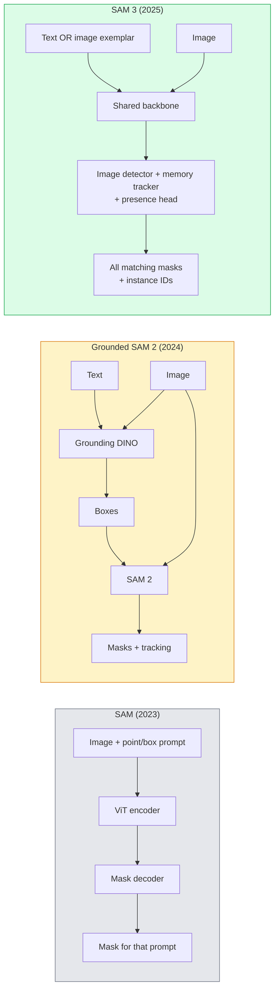

# SAM 3 और खुले वक्साकुलर विभाजन

> एक मॉडल को एक पाठ संकेत और एक छवि दें और प्रत्येक मिलान वस्तु के लिए मास्क प्राप्त करें। SAM 3 ने इसे एक एकल आगे पास बनाया।

**Type:** Use + Build
**Languages:** Python
**Prerequisites:** Phase 4 Lesson 07 (U-Net), Phase 4 Lesson 08 (Mask R-CNN), Phase 4 Lesson 18 (CLIP)
**Time:** ~60 minutes

## सीखने के लक्ष्य

- अंतर करना SAM (केवल दृश्य संकेत), आधार SAM / SAM 2 (detector + SAM), तथा SAM 3 (प्रोम्प्टबल कॉन्सेप्ट सेगमेंट के माध्यम से मूल पाठ प्रमाणीकरण)
- व्याख्या कीजिए SAM 3 वास्तुकलाः साझा रीढ़ + छवि डिटेक्टर + मेमोरी आधारित वीडियो ट्रैकर + उपस्थिति सिर + डिस्कॉपल डिटेक्टर-ट्रैकर डिजाइन
- चेहरे को गले लगाओ `transformers` SAM पाठ-उत्प्रेरित पता लगाने, खंडन और वीडियो ट्रैकिंग के लिए 3 एकीकरण
- बीच चुनें SAM 3, Grounded SAM 2, YOLO-Worldऔर SAM-MI विलंबता, अवधारणा जटिलता और तैनाती लक्ष्य पर आधारित

## समस्या

2023 SAM एक दृश्य-मात्र-प्रशंसित मॉडल थाः आप एक बिंदु पर क्लिक करें या एक बॉक्स आकर्षित करें और यह एक मुखौटा वापस आ जाता है। DINO) के लिए बॉक्स बनाने के लिए, फिर SAM प्रत्येक को विभाजित करने के लिए। SAM यह एक पाइपलाइन में बदल गया, लेकिन यह दो जमे हुए मॉडल का एक झटका था जिसमें त्रुटि का एक अपरिहार्य संचय था।

SAM 3 (मेटा, नवम्बर 2025, ICLR 2026) ने कैस्केड को ढह दिया। यह एक छोटा संज्ञा वाक्यांश या छवि उदाहरण को शीघ्र के रूप में स्वीकार करता है और सभी मेल खाने वाले मास्क और उदाहरण को वापस करता है IDs एक आगे पास में। **शीघ्र अवधारणा विभाजन (PCS)**. मार्च 2026 में ऑब्जेक्ट मल्टीप्लेक्स अपडेट के साथ संयुक्त (SAM 3.1), यह एक ही अवधारणा के कई उदाहरणों को वीडियो के माध्यम से कुशलतापूर्वक ट्रैक करता है।

यह सबक संरचनात्मक बदलाव के बारे में है। 2D Seg, डिटेक्शन और टेक्स्ट-इमेज ग्राउंडिंग एक मॉडल में विलय हो गए हैं। उत्पादन प्रश्न अब "मैं किस पाइपलाइन को एक साथ चेन करता हूं" नहीं है, बल्कि "कौन से प्रम्प्टेबल मॉडल मेरे उपयोग के मामले को अंत से अंत तक संभालता है। "

## अवधारणा

### तीनों पीढ़ियों



### शीघ्र अवधारणा विभाजन

"कन्सेप्ट प्रॉम्प्ट" एक छोटा संज्ञा है (`"yellow school bus"`, `"striped red umbrella"`, `"hand holding a mug"`) या छवि उदाहरण। मॉडल अवधारणा से मेल खाने वाली छवि के प्रत्येक उदाहरण के लिए विभाजन मुखौटे देता है, साथ ही एक अद्वितीय उदाहरण ID प्रति मैच।

यह क्लासिक दृश्य-उत्प्रेरणा से भिन्न है SAM तीन प्रकार से:

1. कोई प्रति-उदाहरण प्रलोभन आवश्यक नहीं  एक पाठ प्रलोभन सभी मैचों को वापस करता है.
2. खुली शब्दावली  अवधारणा प्राकृतिक भाषा में वर्णनीय कुछ भी हो सकती है।
3. प्रति संकेत एक मास्क के बजाय एक ही समय में कई उदाहरणों को लौटाता है।

### मुख्य वास्तुकला के टुकड़े

- **साझा रीढ़ की हड्डी** एक एकल ViT डिटेक्टर हेड और मेमोरी आधारित ट्रैकर दोनों से पढ़ते हैं।
- **उपस्थिति सिर** यह अनुमान लगाता है कि क्या अवधारणा छवि में मौजूद है। "क्या यह यहाँ है? " से "यह कहां है? " को अलग करता है। यह अनुपस्थित अवधारणाओं पर झूठे सकारात्मक को कम करता है।
- **डिस्कॉर्प्ड डिटेक्टर-ट्रैकर** छवि स्तर पर पता लगाने और वीडियो स्तर पर ट्रैकिंग के अलग-अलग सिर हैं ताकि वे हस्तक्षेप न करें।
- **स्मृति बैंक** वीडियो ट्रैकिंग के लिए फ्रेमों पर प्रति-उदाहरण सुविधाओं को स्टोर करता है (एक ही तंत्र SAM 2 प्रयोग किया गया)

### बड़े पैमाने पर प्रशिक्षण

SAM 3 पर प्रशिक्षित किया गया था **4 मिलियन अद्वितीय अवधारणाएं** डेटा इंजन द्वारा उत्पन्न किया गया है जो पुनरावृत्त रूप से उपयोग करके टिप्पणी और सुधार करता है AI + मानव समीक्षा. **SA-CO बेंचमार्क** इसमें 270 हजार अद्वितीय अवधारणाएं हैं, जो पिछले बेंचमार्क से 50 गुना अधिक हैं। SAM 3 मानव प्रदर्शन का 75-80% तक पहुंचता है SA-CO और छवि + वीडियो पर मौजूदा प्रणालियों को दोहराता है PCS.

### SAM 3.1 वस्तु बहुपद

मार्च 2026 अद्यतनः **वस्तु बहुपद** एक ही अवधारणा के कई उदाहरणों को एक साथ ट्रैक करने के लिए एक साझा-स्मृति तंत्र की शुरूआत करता है। पहले, N उदाहरणों को ट्रैक करने का मतलब था N अलग-अलग मेमोरी बैंकों। मल्टीप्लेक्स प्रति-उदाहरण क्वेरी के साथ एक साझा मेमोरी में गिर जाता है। परिणामः सटीकता का त्याग किए बिना काफी तेजी से बहु-वस्तु ट्रैकिंग।

### जहां जमीन SAM 2026 में अभी भी मायने रखता है

- जब आपको एक विशिष्ट खुली शब्दावली डिटेक्टर की आवश्यकता होती है तो (DINO-X, फ्लोरेंस-2).
- जब SAM 3 लाइसेंस (गॉट पर HF) एक अवरोधक है।
- जब आप अधिक नियंत्रण की जरूरत है की तुलना में डिटेक्टर सीमा SAM 3 exposes.
- डिटेक्टर घटक पर अनुसंधान/अब्लेशन कार्य के लिए।

मॉड्यूलर पाइपलाइनों के लिए अभी भी एक जगह है। SAM 3 सरल उत्तर है।

### YOLO-World vs SAM 3

- **YOLO-World** केवल खुले शब्दावली डिटेक्टर (कोई मास्क नहीं) । वास्तविक समय। जब आपको उच्च फ़ीपीएस पर बॉक्स की आवश्यकता होती है तो सबसे अच्छा।
- **SAM 3** पूर्ण खंडन + ट्रैकिंग। धीमी लेकिन अधिक समृद्ध आउटपुट।

उत्पादन विभाजनः YOLO-World केवल तेज पता लगाने वाले पाइपलाइनों के लिए (रोबोटिक नेविगेशन, तेज डैशबोर्ड), SAM 3 मास्क या ट्रैकिंग की आवश्यकता वाले किसी भी चीज़ के लिए।

### SAM-MI दक्षता

SAM-MI (2025-2026) सम्बोधन SAMमुख्य विचारः

- **स्परपॉइंट प्रवर्तन** घने संकेतों के बजाय कुछ अच्छी तरह से चुने गए बिंदुओं का उपयोग करता है; डिकोडर कॉल को 96% कम करता है।
- **पतली मुखौटा संश्लेषण** कच्चे मास्क भविष्यवाणियों को एक तेज मास्क में मिलाता है।
- **डिस्कॉपल मास्क इंजेक्शन** डिकोडर को पुनः चलाने के बजाय पूर्व-कंप्यूटेड मास्क सुविधाएँ प्राप्त होती हैं।

परिणामः ~1.6x गति Grounded-SAM खुले शब्दावली के संदर्भ मानकों पर।

### तीनों मॉडल के लिए आउटपुट प्रारूप

सभी समान सामान्य संरचना (बॉक्स + लेबल + स्कोर + मास्क + IDs), जो उपयोगी है  आपकी पाइपलाइन डाउनस्ट्रीम को किस मॉडल पर चलाया गया है, पर शाखा नहीं करनी है।

```figure
cv3-open-vocab
```

## इसे बनाओ

### चरण 1: शीघ्र निर्माण

एक सहायक बनाएँ जो उपयोगकर्ता वाक्य को सूची में बदल देता है SAM यह सीमा है जहां "उपयोगकर्ता ने टाइप किया" "मोडेल का उपभोग" से मिलता है।

```python
def split_concepts(sentence):
    """
    Heuristic splitter for multi-concept prompts.
    Returns list of short noun phrases.
    """
    for sep in [",", ";", "and", "or", "&"]:
        if sep in sentence:
            parts = [p.strip() for p in sentence.replace("and ", ",").split(",")]
            return [p for p in parts if p]
    return [sentence.strip()]

print(split_concepts("cats, dogs and balloons"))
```

SAM 3 प्रति आगे की उत्तीर्णता एक अवधारणा स्वीकार करता है; बहु-धारणा प्रश्नों के लिए, लूप या बैच उन्हें स्वीकार करते हैं।

### चरण 2: पोस्ट प्रोसेसिंग सहायक

घुमाओ SAM 3 के कच्चे आउटपुट की एक साफ सूची में पता लगाने जो हमारे चरण 4 पाठ 16 पाइपलाइन अनुबंध के अनुरूप है।

```python
from dataclasses import dataclass
from typing import List

@dataclass
class ConceptDetection:
    concept: str
    instance_id: int
    box: tuple          # (x1, y1, x2, y2)
    score: float
    mask_rle: str       # run-length encoded


def rle_encode(binary_mask):
    flat = binary_mask.flatten().astype("uint8")
    runs = []
    prev, count = flat[0], 0
    for v in flat:
        if v == prev:
            count += 1
        else:
            runs.append((int(prev), count))
            prev, count = v, 1
    runs.append((int(prev), count))
    return ";".join(f"{v}x{c}" for v, c in runs)
```

RLE उच्च संकल्प मास्क के लिए भी प्रतिक्रिया उपयोगी भार छोटे रखता है। SAM 2, SAM 3, Grounded SAM 2.

### चरण 3: एक एकीकृत खुले-वाक्यांश विभाजन इंटरफ़ेस

जो भी बैकेंड आप है लपेटें (SAM 3, Grounded SAM 2, YOLO-World + SAM 2) एक ही विधि के पीछे। आपके डाउनस्ट्रीम कोड में बैकएंड के साथ कोई बदलाव नहीं होता है।

```python
from abc import ABC, abstractmethod
import numpy as np

class OpenVocabSeg(ABC):
    @abstractmethod
    def detect(self, image: np.ndarray, concept: str) -> List[ConceptDetection]:
        ...


class StubOpenVocabSeg(OpenVocabSeg):
    """
    Deterministic stub used for pipeline testing when real models are not loaded.
    """
    def detect(self, image, concept):
        h, w = image.shape[:2]
        return [
            ConceptDetection(
                concept=concept,
                instance_id=0,
                box=(w * 0.2, h * 0.3, w * 0.5, h * 0.8),
                score=0.89,
                mask_rle="0x100;1x50;0x200",
            ),
            ConceptDetection(
                concept=concept,
                instance_id=1,
                box=(w * 0.55, h * 0.25, w * 0.85, h * 0.75),
                score=0.74,
                mask_rle="0x80;1x40;0x220",
            ),
        ]
```

असली `SAM3OpenVocabSeg` उपवर्ग को लपेटा जाएगा `transformers.Sam3Model` और `Sam3Processor`.

### चरण 4: चेहरे को गले लगाना SAM 3 उपयोग (संदर्भ)

वास्तविक मॉडल के लिए, `transformers` समावेशीकरणः

```python
from transformers import Sam3Processor, Sam3Model
import torch

processor = Sam3Processor.from_pretrained("facebook/sam3")
model = Sam3Model.from_pretrained("facebook/sam3").eval()

inputs = processor(images=pil_image, return_tensors="pt")
inputs = processor.set_text_prompt(inputs, "yellow school bus")

with torch.no_grad():
    outputs = model(**inputs)

masks = processor.post_process_masks(
    outputs.masks, inputs.original_sizes, inputs.reshaped_input_sizes
)
boxes = outputs.boxes
scores = outputs.scores
```

एक संकेत, सभी मैच एक ही कॉल में वापस आ गया।

### चरण 5: आधारभूत बातों का आकलन करें SAM 2 आपको मुफ्त में दिया

एक ईमानदार बेंचमार्कः जब आप ग्राउंड की जगह लेते हैं तो क्या होता है SAM 2 with SAM 3 एक वास्तविक पाइपलाइन में?

- विलंबता: SAM 3 एक आगे पास बचाता है (कोई अलग डिटेक्टर नहीं) लेकिन मॉडल स्वयं अधिक भारी है; आमतौर पर नेट-न्यूट्रल या थोड़ा गति अप।
- सटीकता: SAM 3 दुर्लभ या रचनात्मक अवधारणाओं ("स्ट्रिप रेड छाता") पर काफी बेहतर।
- लचीलापनः जमीनी SAM 2 आपको डिटेक्टरों को स्वैप करने देता है (DINO-X, फ्लोरेंस-2 , ग्राउंडिंग DINO 1.5); SAM 3 एक ही है।

निष्कर्षः SAM 3 2026 के लिए डिफ़ॉल्ट ओपन-वोकैबल सेग है। SAM 2 अभी भी सही जवाब है जब आप डिटेक्टर लचीलापन या अलग लाइसेंस शर्तों की जरूरत है।

## इसका प्रयोग करें

उत्पादन के तैनाती के पैटर्नः

- **वास्तविक समय में टिप्पणी** — SAM 3 + CVATलेबल-जैसे-पाठ-प्रोम्प्ट सुविधा। एनोटेटर लेबल नाम चुनते हैं; SAM प्रत्येक मेल खाने वाले उदाहरण के लिए 3 पूर्व-लेबल। समीक्षा और सुधार.
- **वीडियो विश्लेषण** — SAM 3.1 बहु-वस्तु ट्रैकिंग के लिए ऑब्जेक्ट मल्टीप्लेक्स; मेमोरी आधारित ट्रैकर को फ़ीड फ्रेम।
- **रोबोटिक्स** — SAM 3 खुले स्वर में हेरफेर के लिए ("लाल कप उठाओ"); एक योजना आदिम के रूप में चलाया जाता है।
- **चिकित्सा इमेजिंग** — SAM चिकित्सा अवधारणाओं पर ठीक से समायोजित; HF.

अल्ट्रालिटिक लिपियाँ SAM 3 में Python पैकेजः

```python
from ultralytics import SAM

model = SAM("sam3.pt")
results = model(image_path, prompts="yellow school bus")
```

एक ही इंटरफ़ेस के रूप में YOLO और SAM 2.

## इसे भेजें

इस पाठ से उत्पन्न होता हैः

- `outputs/prompt-open-vocab-stack-picker.md` एक संकेत जो चुनता है SAM 3 / आधारभूत SAM 2 / YOLO-World / SAM-MI विलंबता, अवधारणा जटिलता और लाइसेंसिंग पर आधारित है।
- `outputs/skill-concept-prompt-designer.md` एक कौशल जो उपयोगकर्ता के बयानों को अच्छी तरह से तैयार करने में मदद करता है SAM 3 अवधारणाओं के संकेत (विभाजन, असंगति, पतन) ।

## व्यायाम

1. **(Easy)** दौड़ें SAM 3 पर 10 चित्रों के साथ अवधारणा संकेत आप चुनते हैं. SAM 2 + Grounding DINO 1.5 एक ही चित्रों पर रिपोर्ट करें कि प्रत्येक मॉडल में कौन से अवधारणाएं चूक गई हैं।
2. **(Medium)** एक "क्लिक करने के लिए शामिल करें / क्लिक करने के लिए बाहर निकालें" बनाएं UI ऊपर SAM 3: एक पाठ प्रम्प्ट उम्मीदवार उदाहरणों को लौटाता है; उपयोगकर्ता क्लिक करता है जो सकारात्मक के रूप में गिनती करते हैं। JSON.
3. **(Hard)** ठीक-ठीक SAM 3 पर एक कस्टम अवधारणा सेट (जैसे 5 प्रकार के इलेक्ट्रॉनिक घटकों) प्रत्येक 20 लेबल छवियों के साथ। शून्य शॉट की तुलना करें SAM 3 एक ही परीक्षण सेट पर; माप मास्क IoU सुधार।

## प्रमुख शर्तें

| अवधि | लोग क्या कहते हैं | इसका क्या मतलब है |
|------|----------------|----------------------|
| खुले शब्दावली विभाजन | "टेक्स्ट सेगमेंट" | प्राकृतिक भाषा में वर्णित वस्तुओं के लिए मास्क का उत्पादन करें, न कि एक निश्चित लेबल सेट |
| PCS | "उत्पादक अवधारणा विभाजन" | SAM 3 का मुख्य कार्य  एक संज्ञा-वक्त या छवि उदाहरण दिया गया है, सभी मिलान उदाहरणों को खंडित करें |
| अवधारणा शीघ्र | "पाठ प्रविष्टि" | संक्षिप्त संज्ञा वाक्यांश या छवि उदाहरण; पूर्ण वाक्य नहीं |
| उपस्थिति सिर | "क्या यह यहाँ है? | SAM 3 मॉड्यूल जो यह तय करता है कि क्या अवधारणा स्थानिकरण से पहले छवि में मौजूद है |
| SA-CO | "SAM 3 बेंचमार्क" | 270K-concept open-vocabulary segmentation benchmark; पहले के open-vocabulary benchmarks से 50 गुना बड़ा |
| वस्तु बहुपद | "SAM 3.1 अद्यतन" | साझा स्मृति बहु-वस्तु ट्रैकिंग; कई उदाहरणों का त्वरित संयुक्त ट्रैकिंग |
| जमीनी SAM 2 | "मॉड्यूलर पाइपलाइन" | Detector + SAM 2 कैस्केड; जब डिटेक्टर स्वैप मायने रखता है तो अभी भी प्रासंगिक |
| SAM-MI | "प्रभावी SAM संस्करण" | जमीनी स्तर पर 1.6x गति के लिए मास्क इंजेक्शनSAM |

## आगे पढ़ना

- [SAM 3: अवधारणाओं के साथ कुछ भी सेगमेंट (arXiv 2511.16719)](https://arxiv.org/abs/2511.16719)
- [SAM 3.1 ऑब्जेक्ट मल्टीप्लेक्स (मेटा) AI, मार्च 2026](https://ai.meta.com/blog/segment-anything-model-3/)
- [SAM 3 गले लगाना चेहरा पर मॉडल पृष्ठ](https://huggingface.co/facebook/sam3)
- [जमीनी SAM 2 ट्यूटोरियल (PyImageSearch)](https://pyimagesearch.com/2026/01/19/grounded-sam-2-from-open-set-detection-to-segmentation-and-tracking/)
- [अल्ट्रालिटिक्स SAM 3 docs](https://docs.ultralytics.com/models/sam-3/)
- [SAM3-Iनिर्देश-जागरूक SAM (arXiv 2512.04585)](https://arxiv.org/abs/2512.04585)
