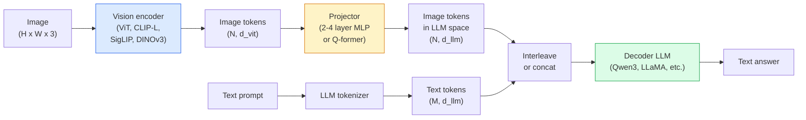

# दृष्टि-भाषा मॉडल ViT-MLP-LLM पैटर्न

> एक दृष्टि एन्कोडर एक छवि को टोकन में परिवर्तित करता है। MLP प्रोजेक्टर उन टोकन को LLMएक भाषा मॉडल बाकी करता है। यह पैटर्न ViT-MLP-LLM प्रत्येक उत्पादन VLM 2026 में।

**Type:** Learn + Use
**Languages:** Python
**Prerequisites:** Phase 4 Lesson 14 (ViT), Phase 4 Lesson 18 (CLIP), Phase 7 Lesson 02 (Self-Attention)
**Time:** ~75 minutes

## सीखने के लक्ष्य

- यह बताएँ ViT-MLP-LLM वास्तुकला और समझाएं कि तीनों घटकों में से प्रत्येक क्या योगदान देता है
- तुलना करें Qwen3-VL, InternVL3.5, LLaVA-Nextऔर GLM-4.6V पैरामीटर की गिनती, संदर्भ लंबाई और बेंचमार्क प्रदर्शन पर
- समझाएँ DeepStack: क्यों बहुस्तरीय ViT विशेषताओं एक एकल अंतिम परत सुविधा की तुलना में दृष्टि-भाषा संरेखण को बेहतर संपीड़ित
- उपाय VLM क्रॉस-मोडल त्रुटि दर के साथ उत्पादन में भ्रम (CMER) और संकेत पर कार्य करें

## समस्या

CLIP (चरण 4 पाठ 18) आपको छवियों और पाठ के लिए एक साझा एम्बेडिंग स्थान देता है, जो शून्य शॉट वर्गीकरण और पुनर्प्राप्ति के लिए पर्याप्त है। यह "इस छवि में कितने लाल कारें हैं? " का जवाब नहीं दे सकता है क्योंकि CLIP यह केवल समानताओं को स्कोर करता है।

दृष्टि-भाषा मॉडल (VLMs) — Qwen3-VL, InternVL3.5, LLaVA-Next, GLM-4.6V बोल्ट ए CLIP-family एक पूर्ण भाषा मॉडल में छवि एन्कोडर। मॉडल एक छवि और एक प्रश्न को देखता है और एक उत्तर उत्पन्न करता है। 2026 में ओपन सोर्स VLMs प्रतिद्वंद्वी या हरा GPT-5 और Gemini-2.5- बहुआयामी बेंचमार्क पर प्रो (MMMU, MMBench, DocVQA, ChartQA, MathVista, OSWorld).

टुकड़ों का त्रिकोण (ViT, प्रोजेक्टर, LLM) मानक है। मॉडल के बीच अंतर ViT, कौन सा प्रोजेक्टर, जो LLMएक बार जब आप पैटर्न को समझते हैं, किसी भी घटक को बदलना यांत्रिक है।

## अवधारणा

### इन ViT-MLP-LLM वास्तुकला



1. **दृष्टि एन्कोडर** पूर्व प्रशिक्षित ViT (CLIP-L/14, SigLIP, DINOv3, या एक ठीक से ट्यून संस्करण) पैच टोकन उत्पन्न करता है।
2. **प्रोजेक्टर** एक छोटा मॉड्यूल (2-4 परतें) MLP, या एक Q-पूर्व) जो दृश्य टोकन को LLMयह है जहां सबसे अधिक बारीक-बारी से समायोजित होता है।
3. **LLM** केवल डेकोडर भाषा मॉडल (Qwen3, Llama, Mistral, GLM, InternLM) दृश्य + पाठ टोकन को क्रमशः पढ़ता है, पाठ उत्पन्न करता है।

इन तीनों टुकड़ों को सिद्धांत रूप में प्रशिक्षित किया जा सकता है। LLM ज्यादातर ठंढ रहते हैं जबकि प्रोजेक्टर सस्ते के लिए संकेत के कुछ अरबों पैरामीटर को ट्रेन करता है।

### DeepStack

वैनिला प्रोजेक्शन केवल अंतिम उपयोग करता है ViT परत। DeepStack (Qwen3-VL) कई से नमूने विशेषताएं ViT गहरे परतों में उच्च स्तरीय अर्थशास्त्र होता है; कम परतों में बारीक- बारीक स्थानिक और बनावट संबंधी जानकारी होती है। LLM "छवि में क्या है" (सैमैंटिक्स) और "कहां ठीक है" (स्थानिक ग्राउंडिंग) के बीच अंतर को बंद करता है।

### तीन प्रशिक्षण चरण

आधुनिक VLMs चरणों में ट्रेनः

1. **संरेखण** जमे हुए ViT और LLM. केवल छवि-कैप्शन जोड़े पर प्रोजेक्टर को प्रशिक्षित करें। प्रोजेक्टर को भाषा स्थान में दृष्टि स्थान का नक्शा बनाना सिखाता है।
2. **पूर्व प्रशिक्षण** सब कुछ मुक्त करें। बड़े पैमाने पर इंटरलेटेड छवि-पाठ डेटा (500M+ जोड़े) पर प्रशिक्षित करें। मॉडल के दृश्य ज्ञान का निर्माण करता है।
3. **निर्देशों को सुसंगत करना** क्यूरेट किए गए (छवि, प्रश्न, उत्तर) ट्रिपल पर बारीक- बारीक ट्यूनिंग। बातचीत व्यवहार और कार्य प्रारूप सिखाता है। यह एक "दृष्टि-जागरूक" बनाता है LM"एक उपयोगी सहायक में।

अधिकांश LoRA एक छोटे लेबल वाले डेटासेट के साथ चरण 3 लक्ष्य को ठीक करने के लिए।

### मॉडल परिवार तुलना (शुरुआती 2026)

| मॉडल | पाराम | दृष्टि एन्कोडर | LLM | संदर्भ | ताकतें |
|-------|--------|----------------|-----|---------|-----------|
| Qwen3-VL-235B-A22B (MoE) | 235B (22B सक्रिय) | कस्टम ViT + DeepStack | Qwen3 | 256K | सामान्य SOTA, GUI एजेंट |
| Qwen3-VL-30B-A3B (MoE) | 30B (3B सक्रिय) | कस्टम ViT + DeepStack | Qwen3 | 256K | छोटा MoE वैकल्पिक |
| Qwen3-VL-8B (dense) | 8B | कस्टम ViT | Qwen3 | 128K | उत्पादन घनत्व डिफ़ॉल्ट |
| InternVL3.5-38B | 38B | InternViT-6B | Qwen3 + GPT-OSS | 128K | मजबूत MMBench / MMVet |
| InternVL3.5-241B-A28B | 241B (28B सक्रिय) | InternViT-6B | Qwen3 | 128K | प्रतिस्पर्धी GPT-4o |
| LLaVA-Next 72B | 72B | SigLIP | Llama-3 | 32K | खुला, ठीक करने में आसान |
| GLM-4.6V | ~70B | कस्टम | GLM | 64K | ओपन सोर्स, मजबूत OCR |
| MiniCPM-V-2.6 | 8B | SigLIP | MiniCPM | 32K | किनारे के अनुकूल |

### दृश्य एजेंट

Qwen3-VL-235B शीर्ष वैश्विक प्रदर्शन पर पहुंचता है OSWorld एक बेंचमार्क **दृश्यमान पदार्थ** जो संचालित GUIs (डेस्कटॉप, मोबाइल, वेब) मॉडल एक स्क्रीनशॉट देखता है, समझता है UI, और क्रियाओं (क्लिक, टाइप, स्क्रॉल) जारी करता है। उपकरण के साथ संयुक्त, यह सामान्य डेस्कटॉप कार्यों पर लूप बंद करता है। यह है कि सबसे 2026 "AI PC"डेमो हुड के नीचे चल रहे हैं।

### Agentic capabilities + RoPE वैरिएंट

VLMs जानना आवश्यक है **जब** एक फ्रेम एक वीडियो में है। Qwen3-VL T- से विकसित हुआRoPE (समय पर घूर्णन स्थिति सम्मिलित) से **पाठ आधारित समय संरेखण** वीडियो फ्रेम के साथ परस्पर स्पष्ट समय टिकट पाठ टोकन. मॉडल "`<timestamp 00:32>` फ्रेम, शीघ्र" और समय संबंधी संबंधों के बारे में तर्क कर सकते हैं।

### संरेखण समस्या

क्रॉल किए गए डेटासेट में 12% छवि-पाठ जोड़े में चित्र में पूरी तरह से आधार नहीं दिए गए विवरण होते हैं। VLM इस पर प्रशिक्षित चुपचाप hallucinate करने के लिए सीखता है  वस्तुओं का निर्माण, गलत संख्याओं को पढ़ने, संबंध का आविष्कार। उत्पादन में यह प्रमुख विफलता मोड है।

Skywork.ai ने **क्रॉस-मोडल त्रुटि दर (CMER)** इसे ट्रैक करने के लिएः

```
CMER = fraction of outputs where the text confidence is high but the image-text similarity (via a CLIP-family checker) is low
```

उच्च CMER इसका मतलब है कि मॉडल आत्मविश्वास से बातें बता रहा है जो छवि में आधारित नहीं है। CMER और इसे उत्पादन के रूप में व्यवहार करना KPI यह "मॉडल को ठीक करने" की नहीं है बल्कि "मार्ग उच्च-CMER मानव समीक्षा के लिए आउटपुट"

### साथ ठीक से ट्यूनिंग LoRA / QLoRA

70B का पूर्ण सूक्ष्म-ट्यूनिंग VLM अधिकांश टीमों के लिए पहुंच से बाहर है। LoRA (श्रेणी 16-64) ध्यान + प्रोजेक्टर परतों पर, या QLoRA 4-बिट बेस वजन के साथ, एक एकल पर फिट A100 / H100. लागत: 5,000-50,000 उदाहरण, गणना में $100-$5,000, 2-10 घंटे का प्रशिक्षण।

### स्थानिक तर्क अभी भी कमजोर है

वर्तमान VLMs स्थानिक तर्क बेंचमार्क (ऊपर-नीचे, बाएं-दाएं, गिनती, दूरी) पर 50-60% अंक प्राप्त करें। यदि आपका उपयोग मामला "कौन सी वस्तु किस के ऊपर है" पर निर्भर करता है, तो भारी मात्रा में मान्य करें  सामान्य VLM प्रदर्शन मानव से नीचे है.VLM शुद्ध स्थानिक कार्यों के लिए विकल्पः एक विशेष कुंजी बिंदु / स्थिति अनुमानक, एक गहराई मॉडल, या बॉक्स ज्यामिति के बाद प्रसंस्करण के साथ एक पता लगाने मॉडल।

```figure
v4-vlm-projector
```

## इसे बनाओ

### चरण 1: प्रोजेक्टर

भाग आप सबसे अधिक बार प्रशिक्षित करेंगे. 2-4 परत MLP के साथ GELU.

```python
import torch
import torch.nn as nn


class Projector(nn.Module):
    def __init__(self, vit_dim=768, llm_dim=4096, hidden=4096):
        super().__init__()
        self.net = nn.Sequential(
            nn.Linear(vit_dim, hidden),
            nn.GELU(),
            nn.Linear(hidden, llm_dim),
        )

    def forward(self, x):
        return self.net(x)
```

इनपुट एक है `(N_patches, d_vit)` टोकन टेंसर. आउटपुट है `(N_patches, d_llm)`. . . LLM प्रत्येक आउटपुट पंक्ति को केवल एक और टोकन के रूप में व्यवहार करता है।

### चरण 2: इकट्ठा करें ViT-MLP-LLM अंत से अंत तक

न्यूनतम के लिए आगे पास की कंकाल VLM. वास्तविक कोड उपयोग `transformers`; यह अवधारणागत रूपरेखा है।

```python
class MinimalVLM(nn.Module):
    def __init__(self, vit, projector, llm, image_token_id):
        super().__init__()
        self.vit = vit
        self.projector = projector
        self.llm = llm
        self.image_token_id = image_token_id  # placeholder token in text prompt

    def forward(self, image, input_ids, attention_mask):
        # 1. vision features
        vision_tokens = self.vit(image)                     # (B, N_patches, d_vit)
        vision_embeds = self.projector(vision_tokens)       # (B, N_patches, d_llm)

        # 2. text embeddings
        text_embeds = self.llm.get_input_embeddings()(input_ids)  # (B, M, d_llm)

        # 3. replace image placeholder tokens with vision embeds
        merged = self._merge(text_embeds, vision_embeds, input_ids)

        # 4. run LLM
        return self.llm(inputs_embeds=merged, attention_mask=attention_mask)

    def _merge(self, text_embeds, vision_embeds, input_ids):
        out = text_embeds.clone()
        expected = vision_embeds.size(1)
        for b in range(input_ids.size(0)):
            positions = (input_ids[b] == self.image_token_id).nonzero(as_tuple=True)[0]
            if len(positions) != expected:
                raise ValueError(
                    f"batch item {b} has {len(positions)} image tokens but vision_embeds has {expected} patches."
                    " Every sample in the batch must be pre-padded to the same number of image placeholder tokens.")
            out[b, positions] = vision_embeds[b]
        return out
```

इन `<image>` पाठ में स्थान धारक टोकन वास्तविक छवि एम्बेड के साथ प्रतिस्थापित किया जाता है  एक ही पैटर्न LLaVA, Qwen-VLऔर InternVL उपयोग करें।

### चरण 3: CMER गणना

हल्के रनटाइम चेक.

```python
import torch.nn.functional as F


def cross_modal_error_rate(image_emb, text_emb, text_confidence, sim_threshold=0.25, conf_threshold=0.8):
    """
    image_emb, text_emb: embeddings of image and generated text (normalised internally)
    text_confidence:     mean per-token probability in [0, 1]
    Returns:             fraction of high-confidence outputs with low image-text alignment
    """
    image_emb = F.normalize(image_emb, dim=-1)
    text_emb = F.normalize(text_emb, dim=-1)
    sim = (image_emb * text_emb).sum(dim=-1)        # cosine similarity
    high_conf_low_sim = (text_confidence > conf_threshold) & (sim < sim_threshold)
    return high_conf_low_sim.float().mean().item()
```

उपचार CMER उत्पादन के रूप में KPI. इसे प्रति अंत बिंदु, प्रति प्रम्प्ट प्रकार, प्रति ग्राहक पर निगरानी करें। बढ़ रहा है CMER मॉडल कुछ इनपुट वितरण पर पगलाव शुरू कर रहा है इंगित करता है।

### चरण 4: खिलौना VLM वर्गीकरण (चलन योग्य)

प्रोजेक्टर ट्रेनों का प्रदर्शन करें।ViT "विशेषताओं" में प्रवेश करें; एक छोटा सा LLM-style टोकन एक वर्ग की भविष्यवाणी करता है।

```python
class ToyVLM(nn.Module):
    def __init__(self, vit_dim=32, llm_dim=64, num_classes=5):
        super().__init__()
        self.projector = Projector(vit_dim, llm_dim, hidden=64)
        self.head = nn.Linear(llm_dim, num_classes)

    def forward(self, vision_tokens):
        projected = self.projector(vision_tokens)
        pooled = projected.mean(dim=1)
        return self.head(pooled)
```

इसे सिंथेटिक (विशेषता, वर्ग) जोड़े पर 200 से कम चरणों में फिट किया जा सकता है  प्रोजेक्टर पैटर्न काम करता है।

## इसका प्रयोग करें

उत्पादन टीमों द्वारा उपयोग किए जाने वाले तीन तरीके VLMs 2026 में:

- **मेजबान API** — OpenAI दृष्टि, Anthropic Claude दृष्टि, गूगल Gemini दृष्टि, शून्य इन्फ्रारेड, विक्रेता जोखिम.
- **ओपन सोर्स स्व-होस्ट** — Qwen3-VL या InternVL3.5 द्वारा `transformers` और `vllm`पूर्ण नियंत्रण, उच्च अग्रिम प्रयास.
- **डोमेन पर ठीक-ठीक** लोड Qwen2.5-VL-7B या LLaVA-1.6-7B, LoRA 5k-50k कस्टम उदाहरणों पर, सेवा के साथ `vllm` या `TGI`.

```python
from transformers import AutoProcessor, AutoModelForVision2Seq
import torch
from PIL import Image

model_id = "Qwen/Qwen3-VL-8B-Instruct"
processor = AutoProcessor.from_pretrained(model_id)
model = AutoModelForVision2Seq.from_pretrained(model_id, torch_dtype=torch.bfloat16, device_map="auto")

messages = [{
    "role": "user",
    "content": [
        {"type": "image", "image": Image.open("plot.png")},
        {"type": "text", "text": "What does this chart show?"},
    ],
}]
inputs = processor.apply_chat_template(messages, add_generation_prompt=True, tokenize=True, return_dict=True, return_tensors="pt").to("cuda")
generated = model.generate(**inputs, max_new_tokens=256)
answer = processor.decode(generated[0][inputs["input_ids"].shape[1]:], skip_special_tokens=True)
```

`apply_chat_template` छिपाता है `<image>` प्लेसहोल्डर टोकनकरण; मॉडल विलय को आंतरिक रूप से संभालता है।

## इसे भेजें

इस पाठ से उत्पन्न होता हैः

- `outputs/prompt-vlm-selector.md` चुनें Qwen3-VL / InternVL3.5 / LLaVA-Next / API सटीकता, विलंबता, संदर्भ लंबाई और बजट को देखते हुए।
- `outputs/skill-cmer-monitor.md` उत्पादन उपकरण के लिए कोड जारी करता है VLM अंत बिंदु के साथ क्रॉस-मोडल त्रुटि दर, प्रति अंत बिंदु डैशबोर्ड और अलर्टिंग थ्रॉवल।

## व्यायाम

1. **(Easy)** किसी भी खुले स्थान के माध्यम से तीन संकेत ("यह क्या है?", "वस्तुओं की गणना करें", "दृश्य का वर्णन करें") चलाएं VLM पांच चित्रों पर। प्रत्येक उत्तर को सही / आंशिक रूप से सही / हाथ से पगलाया गया के रूप में स्कोर करें। एक पहली पास की गणना करें CMER-like दर।
2. **(Medium)** ठीक-ठीक Qwen2.5-VL-3B या LLaVA-1.6-7B के साथ LoRA (स्थान 16) एक लक्ष्य डोमेन के 500 छवियों पर उपशीर्षक के साथ तुलना करें शून्य शॉट बनाम ठीक से ट्यून MMBench-style सटीकता।
3. **(Hard)** प्रतिस्थापन VLMके साथ छवि एन्कोडर DINOv3 इसके बजाय इसकी डिफ़ॉल्ट SigLIP/CLIP. केवल प्रोजेक्टर को फिर से प्रशिक्षित करें (मुस्कृत) LLM + frozen DINOv3) यह मापें कि घने भविष्यवाणी (गणना, स्थानिक तर्क) के कार्यों में सुधार हुआ है या नहीं।

## प्रमुख शर्तें

| अवधि | लोग क्या कहते हैं | इसका क्या मतलब है |
|------|----------------|----------------------|
| ViT-MLP-LLM | " VLM पैटर्न" | दृष्टि एन्कोडर + प्रोजेक्टर + भाषा मॉडल; हर 2026 VLM |
| प्रोजेक्टर | "पुल" | 2-4 परतें MLP (या Q-पूर्व) जो दृश्य टोकन में मानचित्रण LLM सम्मिलित स्थान |
| DeepStack | "Qwen3-VL विशेषता चाल" | बहुस्तरीय ViT केवल अंतिम परत के बजाय स्टैक किए गए फीचर्स |
| छवि टोकन | "<image> स्थानधारक" | पाठ प्रवाह में विशेष टोकन को अनुमानित दृष्टि एम्बेडमेंट्स द्वारा प्रतिस्थापित किया गया |
| CMER | "हल्लूसिनेशन KPI" | क्रॉस-मोडल त्रुटि दर; उच्च जब पाठ की विश्वसनीयता उच्च है लेकिन छवि-पाठ समानता कम है |
| दृश्य एजेंट | "VLM जो क्लिक करता है" | VLM परिचालन GUIs (OSWorld, मोबाइल, वेब) के साथ उपकरण कॉल |
| Q-पूर्व | "फिक्स्ड-कंट टोकन ब्रिज" | BLIP-2 दृश्य क्वेरी टोकन की एक निश्चित संख्या उत्पन्न करने वाला शैली प्रोजेक्टर |
| संरेखण / पूर्व-शिक्षण / निर्देशों की सुसंगतता | "तीन चरण" | मानक VLM प्रशिक्षण पाइपलाइन |

## आगे पढ़ना

- [Qwen3-VL तकनीकी रिपोर्ट (arXiv 2511.21631)](https://arxiv.org/abs/2511.21631)
- [InternVL3.5 ओपन सोर्स मल्टीमोडल मॉडल को आगे बढ़ाना (arXiv 2508.18265)](https://arxiv.org/html/2508.18265v1)
- [LLaVA-Next श्रृंखला](https://llava-vl.github.io/blog/2024-05-10-llava-next-stronger-llms/)
- [BentoML: सर्वश्रेष्ठ ओपन सोर्स VLMs 2026](https://www.bentoml.com/blog/multimodal-ai-a-guide-to-open-source-vision-language-models)
- [MMMU: बहु-अनुशासनात्मक बहु-मॉडल समझ बेंचमार्क](https://mmmu-benchmark.github.io/)
- [VLMs विनिर्माण में (रोबोटिक्स कल, मार्च 2026)](https://www.roboticstomorrow.com/story/2026/03/when-machines-learn-to-see-like-experts-the-rise-of-vision-language-models-in-manufacturing/26335/)
