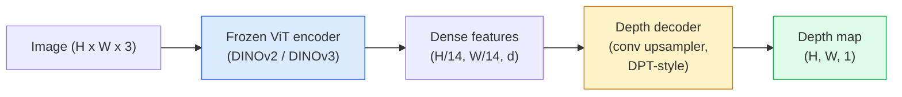

# मोनोकुलर गहराई और ज्यामिति अनुमान

> एक गहराई का नक्शा एक एकल-चैनल छवि है जहां प्रत्येक पिक्सेल कैमरे से दूरी है। RGB फ्रेम के लिए स्टीरियो या LiDAR. 2026 में एक जमे हुए ViT एक encoder प्लस एक हल्के सिर जमीन सत्य के कुछ प्रतिशत के भीतर मिलता है।

**Type:** Build + Use
**Languages:** Python
**Prerequisites:** Phase 4 Lesson 14 (ViT), Phase 4 Lesson 17 (Self-Supervised Vision), Phase 4 Lesson 07 (U-Net)
**Time:** ~60 minutes

## सीखने के लक्ष्य

- प्रत्येक उत्पादन मॉडल में सापेक्ष और मीट्रिक गहराई और स्थिति का अंतर करें (MiDaS, मैरिगोल्ड, गहराई कुछ भी V3, ZoeDepth) हल करता है
- गहराई का प्रयोग करें V3 (DINOv2 कण) बिना किसी माप के मनमाने एकल छवियों के लिए गहराई की भविष्यवाणी करने के लिए
- स्पष्ट करें कि एक ही छवि (प्रदर्शनीय संकेत, बनावट ग्रेडिएंट, सीखे गए पूर्व) से मोनोकुलर गहराई क्यों काम करती है और यह क्या नहीं बहाल कर सकती है (मूर्त पैमाने, अछूता ज्यामिति)
- गहिराई मानचित्र और पिनहोल कैमरा अंतर्निहित का उपयोग करके 2D डिटेक्शन को 3D बिंदुओं पर ले जाएं

## समस्या

गहराई 2 डी कंप्यूटर दृष्टि में गायब अक्ष है. RGBआप जानते हैं कि छवि विमान में चीजें कहां दिखाई देती हैं; आप नहीं जानते कि वे कितनी दूर हैं। LiDAR, उड़ान समय) सीधे इस को हल करते हैं लेकिन महंगे, नाजुक और सीमा में सीमित हैं।

एकाई गहराई का अनुमान  एक एकल से गहराई की भविष्यवाणी RGB फ्रेम  धुंधला, अविश्वसनीय आउटपुट का उत्पादन करने के लिए इस्तेमाल किया। 2026 तक बड़े पूर्व प्रशिक्षित एन्कोडरों ने बदल दिया किः गहराई कुछ भी V3 एक जमे हुए DINOv2 रीढ़ की हड्डी और गहराई के नक्शे का उत्पादन करता है जो इनडोर, आउटडोर, चिकित्सा और उपग्रह डोमेन में सामान्यीकरण करते हैं। मैरिगोल्ड एक सशर्त विसारण समस्या के रूप में गहराई को फिर से फ्रेम करता है। ZoeDepth वास्तविक मीट्रिक दूरी को पीछे हटता है।

गहराई 2D पता लगाने और 3D समझ के बीच की पुल भी हैः एक पता लगाने वाले बॉक्स के पिक्सल को गहराई से गुणा करें और आप 2D वस्तु को 3D बिंदु बादल में उठाएंगे। यह प्रत्येक बिंदु का मूल है AR एक बंद प्रणाली, हर बाधा-बचना पाइपलाइन, और हर "चूसना कप" रोबोट.

## अवधारणा

### सापेक्ष बनाम मीट्रिक गहराई

- **सापेक्ष गहराई** आदेश दिया गया `z` वास्तविक दुनिया की इकाई के बिना मान। "पिक्सेल ए पिक्सेल बी से करीब है, लेकिन दूरी का अनुपात मीटर से लंगड़ा नहीं है। "
- **मीट्रिक गहराई** कैमरे से मीटर में पूर्ण दूरी। मॉडल को छवि संकेतों और वास्तविक दूरी के बीच सांख्यिकीय संबंध सीखना चाहिए।

MiDaS और गहराई कुछ भी V3 मैरिगोल्ड सापेक्ष गहराई का उत्पादन करता है। ZoeDepth, UniDepthऔर Metric3D मैट्रिक मॉडल कैमरा के अंतर्निहित के प्रति संवेदनशील हैं; सापेक्ष मॉडल नहीं हैं।

### एन्कोडर-डेकोडर पैटर्न



गहराई कुछ भी V3 एन्कोडर को फ्रीज करता है और केवल ट्रेनों DPT-style डिकोडर समृद्ध सुविधाएं प्रदान करता है; डिकोडर उन्हें छवि रिज़ॉल्यूशन में वापस इंटरपोला करता है और गहराई को पीछे छोड़ देता है।

### क्यों एक ही छवि गहराई पैदा करती है

2D छवि में कई मोनोकुलर संकेत होते हैं जो गहराई से संबंधित होते हैंः

- **परिप्रेक्ष्य** 3D में समानांतर रेखाएं 2D में अभिसरण करती हैं।
- **बनावट ग्रेडिएंट** दूर की सतहों में छोटे, घने बनावट होती है।
- **अवरुद्ध होने का क्रम** निकटतम वस्तुओं से दूर की वस्तुएं अवरुद्ध होती हैं।
- **आकार स्थिरता** ज्ञात वस्तुओं (कार, मनुष्य) अनुमानित पैमाने देते हैं।
- **वायुमंडलीय परिप्रेक्ष्य** दूर की वस्तुएं बाहरी दृश्यों में धुंधली और नीली दिखाई देती हैं।

A ViT पर्याप्त डेटा और एक मजबूत रीढ़ की हड्डी के साथ, मोनोकुलर गहराई किसी भी स्पष्ट 3D पर्यवेक्षण के बिना उचित सटीकता तक पहुँचता है।

### मोनोकुलर गहराई क्या नहीं कर सकती

- **पूर्ण मीट्रिक पैमाने** नेटवर्क यह जानने के बिना कि कप 1 मीटर या 10 मीटर दूर है, "कप के रूप में दो बार दूर है" भविष्यवाणी कर सकता है।
- **अछूता ज्यामिति** कुर्सी का पीठ अदृश्य है और इसे विश्वसनीय रूप से अनुमान नहीं लगाया जा सकता है।
- **वास्तव में अस्थिर / प्रतिबिंबित सतहें** दर्पण, ग्लास, समान दीवारें। नेटवर्क विश्वसनीय लेकिन गलत गहराई रिपोर्ट करता है।

### गहराई कुछ भी V3 2026 में

- वैनिला DINOv2 ViT-L/14 को एन्कोडर के रूप में (मुश्किल) ।
- DPT डिकोडर.
- विभिन्न स्रोतों से प्रस्तुत चित्र जोड़े पर प्रशिक्षित (फोटोमेट्रिक स्थिरता के अलावा स्पष्ट गहराई पर्यवेक्षण की आवश्यकता नहीं है) ।
- भविष्यवाणी स्थानिक रूप से सुसंगत ज्यामिति से **कैमरा की ज्ञात स्थिति के साथ या बिना दृश्य इनपुट की एक मनमाना संख्या**.
- SOTA मोनोकुलर गहराई, किसी भी दृश्य ज्यामिति, दृश्य रेंडरिंग, कैमरा पोज़ अनुमान।

यह 2026 में गहराई की जरूरत होने पर कॉल करने के लिए ड्रॉप-इन मॉडल है।

### गहराई के लिए मैरिगोल्ड  विसारण

मैरिगोल्ड (Ke et al., CVPR 2024) गहराई अनुमान को छवि-प्रति छवि संबद्ध प्रसार के रूप में पुनः तैयार करता है। RGB. लक्ष्यः गहराई का नक्शा। रीढ़ के रूप में पूर्व प्रशिक्षित स्थिर विसार 2 यू-नेट का उपयोग करता है। आउटपुट गहराई के नक्शे वस्तु सीमाओं पर असाधारण रूप से तेज हैं। व्यापार-बंदः आगे की फ़ीड मॉडल की तुलना में धीमा अनुमान (10-50 denoising कदम) ।

### अंतर्निहित और पिनहोल कैमरा

एक पिक्सेल उठाने के लिए `(u, v)` गहराई से `d` एक 3D बिंदु तक `(X, Y, Z)` कैमरा निर्देशांक मेंः

```
fx, fy, cx, cy = camera intrinsics
X = (u - cx) * d / fx
Y = (v - cy) * d / fy
Z = d
```

अंतर्निहित से आते हैं EXIF मेटाडेटा, एक मापने का पैटर्न, या एक मोनोकुलर आंतरिक अनुमानक (प्रिस्पेक्टिव फील्ड्स, UniDepth) बिना अंतर्निहित, आप अभी भी 60-70 डिग्री परिकल्पना करके एक बिंदु बादल प्रस्तुत कर सकते हैं FOV और मध्यम रिज़ॉल्यूशन के सिद्धांत  जो विज़ुअलाइज़ेशन के लिए उपयोग किए जा सकते हैं, माप के लिए नहीं।

### मूल्यांकन

दो मानक माप:

- **AbsRel** (मूर्त सापेक्ष त्रुटि): `mean(|d_pred - d_gt| / d_gt)`. कम बेहतर है. उत्पादन मॉडल के लिए 0.05-0.1।
- **delta < 1.25** (तारे की सटीकता): पिक्सल का अंश जहां `max(d_pred/d_gt, d_gt/d_pred) < 1.25`. उच्च बेहतर है. 0.9 + के लिए SOTA.

सापेक्ष गहराई के लिए (गंभीरता कुछ भी V3, MiDaS), मूल्यांकन दोनों मापकों के पैमाने और शिफ्ट अपरिवर्तित संस्करणों का उपयोग करता है।

```figure
depth-sweep
```

## इसे बनाओ

### चरण 1: गहराई मीट्रिक

```python
import torch

def abs_rel_error(pred, target, mask=None):
    if mask is not None:
        pred = pred[mask]
        target = target[mask]
    return (torch.abs(pred - target) / target.clamp(min=1e-6)).mean().item()


def delta_accuracy(pred, target, threshold=1.25, mask=None):
    if mask is not None:
        pred = pred[mask]
        target = target[mask]
    ratio = torch.maximum(pred / target.clamp(min=1e-6), target / pred.clamp(min=1e-6))
    return (ratio < threshold).float().mean().item()
```

हमेशा अमान्य गहराई पिक्सल (शून्य, NaNमूल्यांकन से पहले संतृप्त) ।

### चरण 2: स्केल-एंड-शिफ्ट संरेखण

अपेक्षाकृत गहराई वाले मॉडल के लिए, गणना मेट्रिक्स से पहले भविष्यवाणी को मूल सत्य के साथ संरेखित करें। `a * pred + b = target`:

```python
def align_scale_shift(pred, target, mask=None):
    if mask is not None:
        p = pred[mask]
        t = target[mask]
    else:
        p = pred.flatten()
        t = target.flatten()
    A = torch.stack([p, torch.ones_like(p)], dim=1)
    coeffs, *_ = torch.linalg.lstsq(A, t.unsqueeze(-1))
    a, b = coeffs[:2, 0]
    return a * pred + b
```

दौड़ें `align_scale_shift` पहले `abs_rel_error` मूल्यांकन करते समय MiDaS / गहराई कुछ भी.

### चरण 3: गहरी गहराई को बिंदु बादल तक ले जाएं

```python
import numpy as np

def depth_to_point_cloud(depth, intrinsics):
    H, W = depth.shape
    fx, fy, cx, cy = intrinsics
    v, u = np.meshgrid(np.arange(H), np.arange(W), indexing="ij")
    z = depth
    x = (u - cx) * z / fx
    y = (v - cy) * z / fy
    return np.stack([x, y, z], axis=-1)


depth = np.random.uniform(0.5, 4.0, (240, 320))
intr = (320.0, 320.0, 160.0, 120.0)
pc = depth_to_point_cloud(depth, intr)
print(f"point cloud shape: {pc.shape}  (H, W, 3)")
```

एक फ़ंक्शन, प्रत्येक 3 डी-लिफ्ट अनुप्रयोग. बिंदु बादल को निर्यात करने के लिए `.ply` और खोलने में MeshLab या CloudCompare.

### चरण 4: सिंथेटिक गहराई दृश्य के साथ धुआं परीक्षण

```python
def synthetic_depth(size=96):
    yy, xx = np.meshgrid(np.arange(size), np.arange(size), indexing="ij")
    # Floor: linear gradient from near (top) to far (bottom)
    depth = 1.0 + (yy / size) * 4.0
    # Box in the middle: closer
    mask = (np.abs(xx - size / 2) < size / 6) & (np.abs(yy - size * 0.6) < size / 6)
    depth[mask] = 2.0
    return depth.astype(np.float32)


gt = torch.from_numpy(synthetic_depth(96))
pred = gt + 0.3 * torch.randn_like(gt)  # simulated prediction
aligned = align_scale_shift(pred, gt)
print(f"before align  absRel = {abs_rel_error(pred, gt):.3f}")
print(f"after align   absRel = {abs_rel_error(aligned, gt):.3f}")
```

### चरण 5: कुछ भी गहराई से V3 उपयोग (संदर्भ)

```python
import torch
from transformers import pipeline
from PIL import Image

pipe = pipeline(task="depth-estimation", model="LiheYoung/depth-anything-v2-large")

image = Image.open("street.jpg").convert("RGB")
out = pipe(image)
depth_np = np.array(out["depth"])
```

तीन पंक्तियों. `out["depth"]` एक है PIL ग्रे स्केल; गणित के लिए numpy में परिवर्तित. गहराई के लिए कुछ भी V3 विशेष रूप से, मॉडल आईडी को एक बार जारी करने के बाद बदल दें; API अपरिवर्तित है।

## इसका प्रयोग करें

- **गहराई कुछ भी V3** (मेटा AI / ByteDance, 2024-2026)  सापेक्ष गहराई के लिए डिफ़ॉल्ट। सबसे तेज़ ViT-large-backbone उत्पादन में मॉडल।
- **मैरिगोल्ड** (ETH, 2024)  उच्चतम दृश्य गुणवत्ता, धीमा निष्कर्ष।
- **UniDepth** (ETH, 2024)  कैमरा अंतर्निहित अनुमान के साथ मीट्रिक गहराई।
- **ZoeDepth** (इंटेल, 2023)  मीट्रिक गहराई; पुरानी, अभी भी विश्वसनीय।
- **MiDaS v3.1** विरासत लेकिन स्थिर; तुलना के लिए अच्छा आधार।

विशिष्ट समावेशन पैटर्नः

1. RGB फ्रेम आता है।
2. गहराई मॉडल गहराई का नक्शा बनाता है।
3. डिटेक्टर बॉक्स बनाता है।
4. 3D में गहराई से लिफ्ट बॉक्स सेंट्रोइड्स; उपलब्ध होने पर बिंदु बादल के साथ विलय करें।
5. नीचे धाराः AR अन्धेरापन, पथ नियोजन, वस्तु आकार अनुमान, स्टीरियो प्रतिस्थापन।

वास्तविक समय के उपयोग के लिए, गहराई कुछ भी V2 छोटे (INT8 एक उपभोक्ता पर मात्राबद्ध) ~30 fps हिट GPU 518x518 पर।

## इसे भेजें

इस पाठ से उत्पन्न होता हैः

- `outputs/prompt-depth-model-picker.md` गहराई के बीच चयन कुछ भी V3, मैरिगोल्ड, UniDepth, MiDaS विलंबता, मीट्रिक बनाम सापेक्ष आवश्यकता, और दृश्य प्रकार दिया।
- `outputs/skill-depth-to-pointcloud.md` एक कौशल जो सटीक आंतरिक हैंडलिंग और निर्यात के साथ गहराई के नक्शे से बिंदु बादलों का निर्माण करता है `.ply`.

## व्यायाम

1. **(Easy)** कुछ भी गहराई से चलाएं V2 अपने डेस्क के किसी भी 10 छवियों पर. गहराई ग्रे पैमाने के रूप में सहेजें PNGs एक वस्तु की पहचान करें जिसकी अनुमानित गहराई गलत लगती है और समझाएं कि मोनोकुलर संकेत क्यों विफल रहे।
2. **(Medium)** दी गई RGB + गहराई से गहराई कुछ भी V2, एक बिंदु बादल तक उठाने और के साथ रेंडर `open3d`. दो दृश्यों (आंदरूनी / बाहरी) की तुलना करें और ध्यान दें कि कौन सा अधिक विश्वसनीय दिखता है।
3. **(Hard)** पांच जोड़ी छवियों को लें जो केवल एक ज्ञात वस्तु की स्थिति से भिन्न होती हैं (जैसे कि बोतल 30 सेमी करीब ले जाया गया है) प्रयोग करें UniDepth दोनों पर मीट्रिक गहराई की भविष्यवाणी करने के लिए। पूर्वानुमानित दूरी डेल्टा बनाम वास्तविक 30 सेमी की रिपोर्ट करें।

## प्रमुख शर्तें

| अवधि | लोग क्या कहते हैं | इसका क्या मतलब है |
|------|----------------|----------------------|
| एकतरफा गहराई | "एक ही छवि गहराई" | एक से गहराई का अनुमान RGB फ्रेम, कोई स्टीरियो या LiDAR |
| सापेक्ष गहराई | "आदेशित गहराई" | वास्तविक दुनिया की इकाइयों के बिना क्रमबद्ध z-मूल्य |
| मीट्रिक गहराई | "असली दूरी" | मीटर में गहराई; मापने या मीट्रिक निगरानी के साथ प्रशिक्षित मॉडल की आवश्यकता होती है |
| AbsRel | "पूर्ण सापेक्ष त्रुटि" | औसत |d_pre - d_gt| / d_gt; मानक गहराई मीट्रिक |
| डेल्टा सटीकता | "delta < 1.25" | मूल सत्य के 25% के भीतर भविष्यवाणी के साथ पिक्सल का अंश |
| पिनहोल कैमरा | "fx, fy, cx, cy" | (u, v, d) को (X, Y, Z) तक उठाने के लिए इस्तेमाल किया जाने वाला कैमरा मॉडल |
| DPT | "घन भविष्यवाणी ट्रांसफार्मर" | जमे हुए के ऊपर इस्तेमाल किया जाने वाला कन्व-आधारित डिकोडर ViT गहराई के लिए कोडर |
| DINOv2 रीढ़ की हड्डी | "यह काम क्यों करता है" | गहराई लेबल के बिना डोमेन में सामान्यीकृत स्व-निरीक्षण विशेषताएं |

## आगे पढ़ना

- [गहराई कुछ भी V3 कागज पृष्ठ](https://depth-anything.github.io/) — SOTA मोनोकुलर गहराई के साथ DINOv2 एन्कोडर
- [मैरिगोल्ड (Ke et al., CVPR 2024)](https://marigoldmonodepth.github.io/) विसारक आधारित गहराई का अनुमान
- [UniDepth (Piccinelli et al., 2024)](https://arxiv.org/abs/2403.18913) आंतरिक तत्वों के साथ मीट्रिक गहराई
- [MiDaS v3.1 (इंटेल) ISL)](https://github.com/isl-org/MiDaS) कैनोनिक सापेक्ष गहराई की आधार रेखा
- [DINOv3 ब्लॉग पोस्ट (मेटा)](https://ai.meta.com/blog/dinov3-self-supervised-vision-model/) गहिराई सटीकता को बढ़ाने वाले एन्कोडर परिवार
