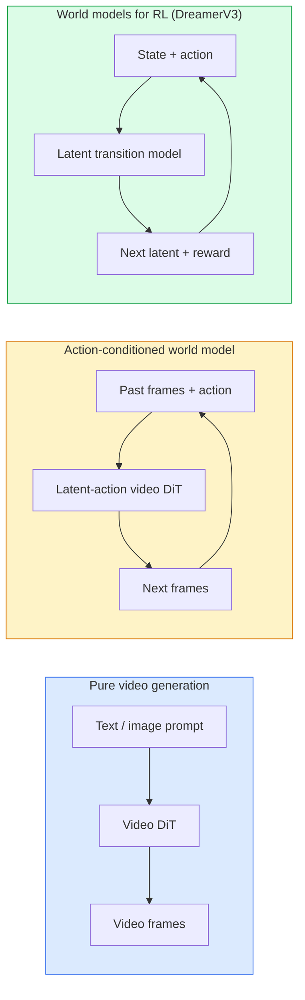

# दुनिया के मॉडल और वीडियो प्रसारण

> एक वीडियो मॉडल जो एक दृश्य के अगले सेकंड की भविष्यवाणी करता है एक दुनिया सिम्युलेटर है। कार्रवाई पर भविष्यवाणी की स्थिति और आप एक सीखे खेल इंजन है।

**Type:** Learn + Build
**Languages:** Python
**Prerequisites:** Phase 4 Lesson 10 (Diffusion), Phase 4 Lesson 12 (Video Understanding), Phase 4 Lesson 23 (DiT + Rectified Flow)
**Time:** ~75 minutes

## सीखने के लक्ष्य

- एक शुद्ध वीडियो जनरेशन मॉडल (सोरा 2) और एक एक्शन-कंडीशनिंग वर्ल्ड मॉडल (जीन 3, DreamerV3)
- एक वीडियो का वर्णन करें DiT: स्थान-समय पैच, 3D स्थिति एन्कोडिंग, (T, H, W) टोकन पर संयुक्त ध्यान
- दुनिया के मॉडल को रोबोटिक्स में कैसे प्लग करता है, इसका पता लगाएं: VLM योजना → वीडियो मॉडल अनुकरण → उल्टा गतिशीलता कार्य करता है
- सोरा 2, जीन 3, रनवे के बीच चयन करें GWM-1 वर्ल्ड्स, वान-वीडियो, और HunyuanVideo एक दिए गए उपयोग के मामले के लिए (क्रिएटिव वीडियो, इंटरैक्टिव सिम, स्वायत्त ड्राइविंग संश्लेषण)

## समस्या

वीडियो पीढ़ी और विश्व मॉडलिंग 2026 में एक साथ आए। एक मॉडल जो एक सुसंगत मिनट का वीडियो उत्पन्न कर सकता है, किसी तरह से, दुनिया कैसे चलती है, यह सीखा हैः वस्तु स्थायित्व, गुरुत्वाकर्षण, कारणता, शैली। यदि आप क्रियाओं पर भविष्यवाणी को शर्त दें (बाएं चलें, दरवाजा खोलें), तो वीडियो मॉडल एक सीखने योग्य सिम्युलेटर बन जाता है जो गेम इंजन, ड्राइविंग सिम्युलेटर या रोबोटिक्स वातावरण की जगह ले सकता है।

जीनी 3 एक ही छवि से प्ले करने योग्य वातावरण उत्पन्न करता है। GWM-1 दुनिया अनंत खोज योग्य दृश्यों को संश्लेषित करती है। सोरा 2 सिंक्रनाइज़्ड ऑडियो और मॉडलित भौतिकी के साथ मिनटों के वीडियो का उत्पादन करता है। NVIDIA कॉस्मोस-ड्राइव, वेव गाया-2 और टेस्ला DrivingWorld विश्व मॉडल मॉडल रोबोटिक्स के लिए सिम-टू-रियल को चुपचाप ले जा रहा है।

यह पाठ चरण 4 के लिए "बड़ी तस्वीर" पाठ है। यह छवि उत्पादन, वीडियो समझ और एजेंटिक तर्क को वास्तुकला पैटर्न में जोड़ता है जिस दिशा में प्रमुख अनुसंधान आगे बढ़ रहा है।

## अवधारणा

### विश्व मॉडल के तीन परिवार



- **सोरा 2** यह शुद्ध वीडियो पीढ़ी है जो संकेतों पर आधारित है. कोई कार्रवाई इंटरफ़ेस नहीं है. आप इसे मध्य रोलआउट में "निर्देशित" नहीं कर सकते.
- **जीनी 3**, **GWM-1 दुनिया**, **मिराज / मैजिक** क्रिया-संशोधित दुनिया मॉडल हैं। अवलोकन वीडियो से लटेंट क्रियाएं इंफेर करें, फिर क्रियाओं पर भविष्य के फ्रेम भविष्यवाणियों को संशोधित करें। इंटरैक्टिव  आप कुंजी दबाएं या कैमरा स्थानांतरित करें और दृश्य प्रतिक्रिया करता है।
- **DreamerV3** और क्लासिक RL दुनिया मॉडल परिवार एक लटेंट अंतरिक्ष में स्पष्ट कार्रवाई कंडीशनिंग के साथ भविष्यवाणी, एक पुरस्कार संकेत पर प्रशिक्षित। कम दृश्य; नमूना-कुशल के लिए अधिक उपयोगी RL.

### वीडियो DiT वास्तुकला

```
Video latent:          (C, T, H, W)
Patchify (spatial):    grid of P_h x P_w patches per frame
Patchify (temporal):   group P_t frames into a temporal patch
Resulting tokens:      (T / P_t) * (H / P_h) * (W / P_w) tokens
```

स्थिति कोडिंग 3D हैः प्रति (t, h, w) निर्देशांक पर एक घूर्णन या सीखा एम्बेडिंग। ध्यान दिया जा सकता हैः

- **पूर्ण जंक्शन** सभी टोकन सभी टोकन पर ध्यान देते हैं। O(N ^ 2) N टोकन के साथ। लंबे वीडियो के लिए प्रतिबंधित।
- **विभाजित** समय पर ध्यान देने का विकल्प (एक ही स्थानिक स्थिति, समय के साथः `(H*W) * T^2`) और स्थानिक ध्यान (एक ही समय चरण, अंतरिक्ष मेंः `T * (H*W)^2`) द्वारा प्रयोग किया जाता है TimeSformer और अधिकांश वीडियो DiTs.
- **खिड़की** स्थानीय विंडो में (t, h, w) । वीडियो स्विन द्वारा उपयोग किया जाता है।

प्रत्येक 2026 वीडियो विसारण मॉडल इन तीन पैटर्न में से एक का उपयोग करता है प्लस AdaLN कंडीशनिंग (पढ़ना 23) और सुधारित प्रवाह।

### कार्य के लिए शर्तेंः लटेंट कार्य मॉडल

जीन एक सीखता है **लट्त क्रिया** प्रति फ्रेम एक जोड़ी के बीच कार्रवाई की भेदभावपूर्ण भविष्यवाणी करके। मॉडल का डिकोडर फिर निष्कर्षित लटेंट कार्रवाई पर शर्तें  स्पष्ट कीबोर्ड कुंजी पर नहीं। निष्कर्षण पर, एक उपयोगकर्ता एक लटेंट कार्रवाई निर्दिष्ट कर सकता है (या एक नए पूर्व से एक नमूना) और मॉडल उस कार्रवाई के अनुरूप अगली फ्रेम उत्पन्न करता है।

सोरा पूरी तरह से एक्शन इंटरफेस को छोड़ देता है। इसका डिकोडर अतीत के स्पेसटाइम टोकन से अगले स्पेसटाइम टोकन की भविष्यवाणी करता है। त्वरित स्थिति शुरुआत; कुछ भी इसे मध्य पीढ़ी को निर्देशित नहीं करता है।

### भौतिक विश्वसनीयता

सोरा 2 की 2026 रिलीज का स्पष्ट रूप से विज्ञापन **भौतिक विश्वसनीयता**: वजन, संतुलन, वस्तु स्थायित्व, कारण-प्रभाव। टीम द्वारा हस्त-मूल्यांकन विश्वसनीयता स्कोर के माध्यम से मापा गया; मॉडल में गिराए गए वस्तुओं, अक्षरों के टकराव और उद्देश्य पर विफलताओं (एक चूक कूद) के खिलाफ स्पष्ट रूप से सुधार होता है।

तर्कसंगतता प्रमुख विफलता मोड बनी हुई है। 2024-2025 वीडियो में लोगों ने स्पैगेटी खाया या चश्मे से पीने से मॉडल की निरंतर वस्तु प्रतिनिधित्व की कमी का पता चला। 2026 मॉडल (सोरा 2, रनवे जेन -5) HunyuanVideo) को कम करना लेकिन उन्मूलन नहीं करना।

### स्वायत्त ड्राइविंग के विश्व मॉडल

ड्राइविंग वर्ल्ड मॉडल ट्रैक, बॉर्डरिंग बॉक्स या नेविगेशन मैप पर आधारित यथार्थवादी सड़क दृश्य उत्पन्न करते हैं। उपयोगः

- **कॉस्मोस ड्राइव-ड्रीम** (NVIDIA)  मिनट ड्राइविंग वीडियो उत्पन्न करता है RL प्रशिक्षण।
- **गायिया-2** (व्यू)  नीति मूल्यांकन के लिए ट्रैकटोरिया-कंडीशनिंग दृश्य संश्लेषण।
- **DrivingWorld** (टेस्ला)  विविध मौसम, दिन के समय, यातायात की स्थिति का अनुकरण करता है।
- **विस्टा** (ByteDance)  प्रतिक्रियाशील ड्राइविंग दृश्य संश्लेषण।

वे कोने के मामलों के लिए महंगे वास्तविक दुनिया डेटा संग्रह की जगह लेते हैं  रात में पैदल यात्री जेयवॉक, बर्फ के चौराहे, असामान्य वाहन प्रकार  जो अन्यथा लाखों मील की ड्राइविंग की आवश्यकता होगी।

### रोबोटिक्स स्टैकः VLM + video model + inverse dynamics

तीन घटक रोबोटिक्स लूप उभर रहा हैः

1. **VLM** लक्ष्य का विश्लेषण करता है ("लाल कप उठाएं"), उच्च स्तर की कार्रवाई अनुक्रम की योजना बनाता है।
2. **वीडियो जनरेशन मॉडल** अनुकरण करता है कि प्रत्येक कार्रवाई को निष्पादित करने के रूप में लग रहा होगा  भविष्यवाणी करता है अवलोकन N फ्रेम आगे.
3. **उल्टा गतिशीलता मॉडल** इन अवलोकनों को उत्पन्न करने वाले ठोस मोटर कमांड को निकालता है।

यह इनाम आकार और नमूना भारी की जगह लेता है RL. दुनिया मॉडल कल्पना करता है; विपरीत गतिशीलता सक्रियण पर लूप बंद करती है। जीन इम्विजनर एक उदाहरण है; कई शोध समूह इस संरचना पर अभिसरण कर रहे हैं।

### मूल्यांकन

- **दृश्य गुणवत्ता** — FVD (Fréchet Video Distance), उपयोगकर्ता अध्ययन।
- **त्वरित संरेखण** — CLIPScore प्रति फ्रेम, VQA-style मूल्यांकन।
- **भौतिक विश्वसनीयता** एक बेंचमार्क सूट पर हस्त रेटेड (सोरा 2 का आंतरिक बेंचमार्क, VBench).
- **नियंत्रण** (आक्रामक दुनिया मॉडल के लिए)  कार्रवाई → अवलोकन सुसंगतता; क्या आप एक पूर्व स्थिति में वापस जा सकते हैं?

### 2026 में मॉडल परिदृश्य

| मॉडल | उपयोग | पैरामीटर | आउटपुट | लाइसेंस |
|-------|-----|------------|--------|---------|
| सोरा 2 | text-to-video, audio | — | 1-min 1080p + audio | API केवल |
| रनवे जेन-5 | पाठ/छवि-वीडियो | — | 10s क्लिप | API |
| रनवे GWM-1 दुनिया | अन्तरक्रियात्मक दुनिया | — | अनंत 3D रोलआउट | API |
| जीनी 3 | छवि से इंटरैक्टिव दुनिया | 11B+ | खेल योग्य फ्रेम | अनुसंधान पूर्वावलोकन |
| Wan-Video 2.1 | पाठ-वीडियो खोलें | 14B | उच्च गुणवत्ता वाले क्लिप | गैर वाणिज्यिक |
| HunyuanVideo | पाठ-वीडियो खोलें | 13B | 10s क्लिप | अनुमत |
| कॉस्मोस / कॉस्मोस-ड्राइव | स्वायत्त ड्राइविंग सिम | 7-14B | ड्राइविंग दृश्य | NVIDIA खुला |
| मैजिक / मिराज 2 | AI-native खेल इंजन | — | परिवर्तनीय दुनिया | उत्पाद |

```figure
v4-world-rollout
```

## इसे बनाओ

### चरण 1: वीडियो के लिए 3D patchify

```python
import torch
import torch.nn as nn


class VideoPatch3D(nn.Module):
    def __init__(self, in_channels=4, dim=64, patch_t=2, patch_h=2, patch_w=2):
        super().__init__()
        self.proj = nn.Conv3d(
            in_channels, dim,
            kernel_size=(patch_t, patch_h, patch_w),
            stride=(patch_t, patch_h, patch_w),
        )
        self.patch_t = patch_t
        self.patch_h = patch_h
        self.patch_w = patch_w

    def forward(self, x):
        # x: (N, C, T, H, W)
        x = self.proj(x)
        n, c, t, h, w = x.shape
        tokens = x.reshape(n, c, t * h * w).transpose(1, 2)
        return tokens, (t, h, w)
```

नाभिक के बराबर कदम के साथ एक 3D conv स्पेस-टाइमरल पैचफायर के रूप में कार्य करता है। `(T, H, W) -> (T/2, H/2, W/2)` टोकन ग्रिड।

### चरण 2: 3D घूर्णन स्थिति एन्कोडिंग

घूर्णन स्थिति सम्मिलित (RoPE) के साथ अलग से लागू किया जाता है `t`, `h`, `w` धुरीः

```python
def rope_3d(tokens, t_dim, h_dim, w_dim, grid):
    """
    tokens: (N, T*H*W, D)
    grid: (T, H, W) sizes
    t_dim + h_dim + w_dim == D
    """
    T, H, W = grid
    n, seq, d = tokens.shape
    if t_dim + h_dim + w_dim != d:
        raise ValueError(f"t_dim+h_dim+w_dim ({t_dim}+{h_dim}+{w_dim}) must equal D={d}")
    assert seq == T * H * W
    t_idx = torch.arange(T, device=tokens.device).repeat_interleave(H * W)
    h_idx = torch.arange(H, device=tokens.device).repeat_interleave(W).repeat(T)
    w_idx = torch.arange(W, device=tokens.device).repeat(T * H)
    # Simplified: just scale channels by frequencies. Real RoPE rotates pairs.
    freqs_t = torch.exp(-torch.log(torch.tensor(10000.0)) * torch.arange(t_dim // 2, device=tokens.device) / (t_dim // 2))
    freqs_h = torch.exp(-torch.log(torch.tensor(10000.0)) * torch.arange(h_dim // 2, device=tokens.device) / (h_dim // 2))
    freqs_w = torch.exp(-torch.log(torch.tensor(10000.0)) * torch.arange(w_dim // 2, device=tokens.device) / (w_dim // 2))
    emb_t = torch.cat([torch.sin(t_idx[:, None] * freqs_t), torch.cos(t_idx[:, None] * freqs_t)], dim=-1)
    emb_h = torch.cat([torch.sin(h_idx[:, None] * freqs_h), torch.cos(h_idx[:, None] * freqs_h)], dim=-1)
    emb_w = torch.cat([torch.sin(w_idx[:, None] * freqs_w), torch.cos(w_idx[:, None] * freqs_w)], dim=-1)
    return tokens + torch.cat([emb_t, emb_h, emb_w], dim=-1)
```

सरल योजक रूप। वास्तविक RoPE आवृत्तियों पर जोड़े हुए चैनलों को घूमता है; स्थिति सूचना समान है।

### चरण 3: ध्यान को विभाजित करना

```python
class DividedAttentionBlock(nn.Module):
    def __init__(self, dim=64, heads=2):
        super().__init__()
        self.time_attn = nn.MultiheadAttention(dim, heads, batch_first=True)
        self.space_attn = nn.MultiheadAttention(dim, heads, batch_first=True)
        self.ln1 = nn.LayerNorm(dim)
        self.ln2 = nn.LayerNorm(dim)
        self.ln3 = nn.LayerNorm(dim)
        self.mlp = nn.Sequential(nn.Linear(dim, 4 * dim), nn.GELU(), nn.Linear(4 * dim, dim))

    def forward(self, x, grid):
        T, H, W = grid
        n, seq, d = x.shape
        # time attention: same (h, w), across t
        xt = x.view(n, T, H * W, d).permute(0, 2, 1, 3).reshape(n * H * W, T, d)
        a, _ = self.time_attn(self.ln1(xt), self.ln1(xt), self.ln1(xt), need_weights=False)
        xt = (xt + a).reshape(n, H * W, T, d).permute(0, 2, 1, 3).reshape(n, seq, d)
        # space attention: same t, across (h, w)
        xs = xt.view(n, T, H * W, d).reshape(n * T, H * W, d)
        a, _ = self.space_attn(self.ln2(xs), self.ln2(xs), self.ln2(xs), need_weights=False)
        xs = (xs + a).reshape(n, T, H * W, d).reshape(n, seq, d)
        xs = xs + self.mlp(self.ln3(xs))
        return xs
```

समय ध्यान समय के साथ प्रत्येक स्थानिक स्थिति के भीतर उपस्थित होता है; अंतरिक्ष ध्यान प्रत्येक फ्रेम के भीतर स्थानों के बीच उपस्थित होता है।HW) ^2) एक O   के बजाय संचालनTHW) ^2) यह मूलभूत है TimeSformer और हर आधुनिक वीडियो DiT.

### चरण 4: एक छोटी सी वीडियो बनाएं DiT

```python
class TinyVideoDiT(nn.Module):
    def __init__(self, in_channels=4, dim=64, depth=2, heads=2):
        super().__init__()
        self.patch = VideoPatch3D(in_channels=in_channels, dim=dim, patch_t=2, patch_h=2, patch_w=2)
        self.blocks = nn.ModuleList([DividedAttentionBlock(dim, heads) for _ in range(depth)])
        self.out = nn.Linear(dim, in_channels * 2 * 2 * 2)

    def forward(self, x):
        tokens, grid = self.patch(x)
        for blk in self.blocks:
            tokens = blk(tokens, grid)
        return self.out(tokens), grid
```

काम करने वाला वीडियो जनरेटर नहीं, बल्कि एक संरचनात्मक डेमो जो प्रत्येक टुकड़े को सही ढंग से आकार देता है।

### चरण 5: आकारों की जांच करें

```python
vid = torch.randn(1, 4, 8, 16, 16)  # (N, C, T, H, W)
model = TinyVideoDiT()
out, grid = model(vid)
print(f"input  {tuple(vid.shape)}")
print(f"tokens grid {grid}")
print(f"output {tuple(out.shape)}")
```

उम्मीद करें `grid = (4, 8, 8)` और `out = (1, 256, 32)` पैचिंग के बाद; सिर फिर प्रति टोकन स्थान-समय पैच पर प्रक्षेपित, एक वीडियो में वापस un-पैचिंग करने के लिए तैयार है।

## इसका प्रयोग करें

2026 के लिए उत्पादन पहुंच पैटर्नः

- **सोरा 2 API** (OpenAI)  पाठ-से-वीडियो, सिंक्रनाइज़्ड ऑडियो. प्रीमियम मूल्य निर्धारण।
- **रैनवे Gen-5 / GWM-1** (रनवे)  छवि से वीडियो, इंटरैक्टिव दुनिया।
- **Wan-Video 2.1 / HunyuanVideo** ओपन सोर्स सेल्फ होस्ट।
- **कॉस्मोस / कॉस्मोस-ड्राइव** (NVIDIA)  ड्राइविंग सिमुलेशन ओपन वेट्स।
- **जीनी 3** अनुसंधान पूर्वावलोकन, प्रवेश का अनुरोध।

इंटरैक्टिव वर्ल्ड मॉडल डेमो बनाने के लिएः गुणवत्ता के लिए वान-वीडियो से शुरू करें, इंटरएक्टिविटी के लिए लोटेंट-एक्शन एडाप्टर पर परतें। स्वायत्त ड्राइविंग सिमुलेशन के लिएः कॉस्मोस-ड्राइव 2026 खुला संदर्भ है।

रोबोटिक्स के लिए, जंगली में ढेरः

1. Language goal -> VLM (Qwen3-VL) -> high-level plan.
2. Plan -> latent-action video model -> imagined rollout.
3. Rollout -> inverse dynamics model -> low-level actions.
4. कार्रवाई निष्पादित -> अवलोकन चरण 1 में वापस डाला गया।

## इसे भेजें

इस पाठ से उत्पन्न होता हैः

- `outputs/prompt-video-model-picker.md` सोरा 2 / रनवे / वान / के बीच पिकअप HunyuanVideo / कॉस्मोस दिया कार्य, लाइसेंस, और विलंबता.
- `outputs/skill-physical-plausibility-checks.md` एक कौशल जो शिपिंग से पहले किसी भी उत्पन्न वीडियो पर चलने के लिए स्वचालित जांच (वस्तु स्थायित्व, गुरुत्वाकर्षण, निरंतरता) को परिभाषित करता है।

## व्यायाम

1. **(Easy)** पैच पर 5 सेकंड के 360p वीडियो के लिए टोकन गिनती की गणना करें-t=2, पैच-h=8, पैच-w=8ध्यान के लिए स्मृति के बारे में तर्क इस आकार में.
2. **(Medium)** ऊपर दिए गए विभाजित ध्यान ब्लॉक को एक पूर्ण संयुक्त ध्यान ब्लॉक के लिए बदलें और आकार और पैरामीटर की गिनती को मापें। समझाएं कि वास्तविक वीडियो मॉडल के लिए विभाजित ध्यान क्यों आवश्यक है।
3. **(Hard)** एक न्यूनतम लटेंट-एक्शन वीडियो मॉडल बनाएंः (फ्रेम_टी, एक्शन_टी, फ्रेम_{t+1}) ट्रिपल (किसी भी सरल 2 डी गेम) का एक डेटासेट लें, एक छोटा वीडियो को प्रशिक्षित करें DiT कार्रवाई के एम्बेडेड पर आधारित, और यह दिखाने के लिए कि विभिन्न कार्यों से अलग-अलग अगले फ्रेम उत्पन्न होते हैं।

## प्रमुख शर्तें

| अवधि | लोग क्या कहते हैं | इसका क्या मतलब है |
|------|----------------|----------------------|
| विश्व मॉडल | "शिक्षित सिम्युलेटर" | एक मॉडल जो भविष्य की अवलोकनों की भविष्यवाणी करता है, राज्य और कार्रवाई को देखते हुए |
| वीडियो DiT | "अंतरिक्ष समय ट्रांसफार्मर" | 3D पैचिंग और विभाजित ध्यान के साथ विसारण ट्रांसफार्मर |
| लटेंट क्रिया | "निहित नियंत्रण" | फ्रेम जोड़े से निकाली गई गुप्त या निरंतर क्रिया लटेंट; अगली फ्रेम पीढ़ी की स्थिति के लिए उपयोग की जाती है |
| विभक्त ध्यान | "समय फिर स्थान" | प्रति ब्लॉक  समय के पार और फिर अंतरिक्ष के पार  के दो ध्यान संचालन  O(N^2) को प्रबंधनीय बनाए रखने के लिए |
| वस्तु स्थायीता | "कुछ सच ही है" | दृश्य गुण जो वीडियो मॉडल को सीखना चाहिए; भोजन, ग्लासवेयर पर क्लासिक विफलता मोड |
| FVD | "फ्रेश वीडियो दूरी" | वीडियो समकक्ष FID; प्राथमिक दृश्य गुणवत्ता मेट्रिक |
| उल्टा गतिशीलता मॉडल | "कर्मों के लिए टिप्पणियाँ" | दी गई (राज्य, अगली स्थिति), निष्पादन कार्रवाई जो उन्हें जोड़ती है; रोबोटिक्स लूप बंद |
| Cosmos-Drive | "NVIDIA ड्राइविंग सिम" | खुले वजन के लिए स्वायत्त ड्राइविंग विश्व मॉडल RL और मूल्यांकन |

## आगे पढ़ना

- [सोरा तकनीकी रिपोर्ट (OpenAI)](https://openai.com/index/video-generation-models-as-world-simulators/)
- [जीनियाः जनरेटिव इंटरएक्टिव एनवायरनमेंट्स (ब्रूस एट अल, 2024)](https://arxiv.org/abs/2402.15391) लटेंट एक्शन वर्ल्ड मॉडल
- [TimeSformer (बर्टसियस एट अल., 2021)](https://arxiv.org/abs/2102.05095) वीडियो ट्रांसफार्मर के लिए विभाजित ध्यान
- [DreamerV3 (हफनर और अन्य, 2023)](https://arxiv.org/abs/2301.04104) विश्व मॉडल RL
- [कॉस्मोस-ड्राइव-ड्रीम (NVIDIA, 2025)](https://research.nvidia.com/labs/toronto-ai/cosmos-drive-dreams/) ड्राइविंग वर्ल्ड मॉडल
- [2026 तक शीर्ष 10 वीडियो पीढ़ी मॉडल (DataCamp)](https://www.datacamp.com/blog/top-video-generation-models)
- [वीडियो जनरेशन से विश्व मॉडल तक  सर्वेक्षण रेपो](https://github.com/ziqihuangg/Awesome-From-Video-Generation-to-World-Model/)
