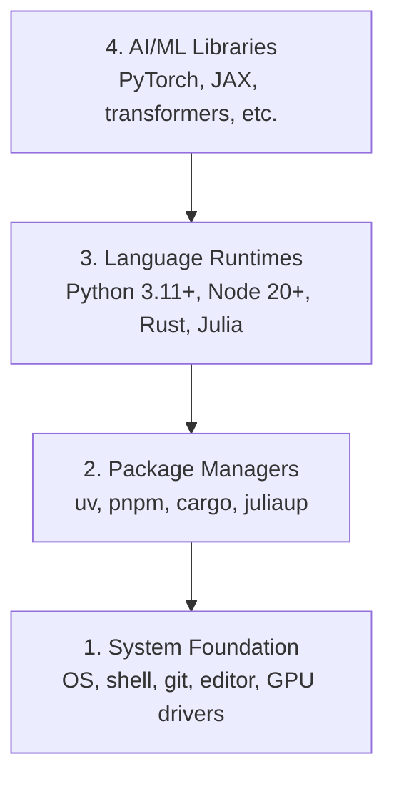

# 开发环境

> 工具会塑造你的思考方式。一次配置到位，并把它配置正确。

**Type:** 构建
**Languages:** Python, Node.js, Rust
**Prerequisites:** 无
**Time:** 约 45 分钟

## 学习目标

- 从零搭建 Python 3.11+、Node.js 20+ 和 Rust 工具链
- 配置虚拟环境和包管理器，实现可复现的构建
- 通过 CUDA/MPS 验证 GPU 访问，并运行一次张量运算测试
- 理解由系统、包管理器、语言运行时和 AI 库组成的四层技术栈

## 问题

接下来，你将在 500 多节课程中使用 Python、TypeScript、Rust 和 Julia 学习 AI 工程。如果开发环境有问题，每一节课都会变成与工具较劲，而不是专注于学习。

很多人会跳过环境配置，随后却花费数小时排查导入错误、版本冲突和缺失的 CUDA 驱动。我们现在一次把它正确配置好。

## 核心概念

一个 AI 工程环境包含四层：



安装时应自底向上进行，因为每一层都依赖它下面的层。

```figure
s0-env-stack
```

## 动手构建

### 第 1 步：系统基础

检查你的系统并安装基础工具。

```bash
# macOS
xcode-select --install
brew install git curl wget

# Ubuntu/Debian
sudo apt update && sudo apt install -y build-essential git curl wget

# Windows (use WSL2)
wsl --install -d Ubuntu-24.04
```

### 第 2 步：使用 uv 管理 Python

我们使用 `uv`：它比 pip 快 10–100 倍，并且能自动管理虚拟环境。

```bash
curl -LsSf https://astral.sh/uv/install.sh | sh

uv python install 3.12

uv venv
source .venv/bin/activate  # or .venv\Scripts\activate on Windows

uv pip install numpy matplotlib jupyter
```

验证安装：

```python
import sys
print(f"Python {sys.version}")

import numpy as np
print(f"NumPy {np.__version__}")
a = np.array([1, 2, 3])
print(f"Vector: {a}, dot product with itself: {np.dot(a, a)}")
```

### 第 3 步：使用 pnpm 管理 Node.js

TypeScript 课程（智能体、MCP 服务器和 Web 应用）会用到它。

```bash
curl -fsSL https://fnm.vercel.app/install | bash
fnm install 22
fnm use 22

npm install -g pnpm

node -e "console.log('Node', process.version)"
```

**macOS / Apple Silicon（M1/M2/M3/M4）：**如果安装器报错 `Error: Cannot install under Rosetta 2 in ARM default prefix (/opt/homebrew)`，说明你的终端运行在 Rosetta 2 下（`arch` 输出 `i386`），而 Homebrew 是原生 arm64 版本。请强制使用 arm64 安装 fnm，将它接入 shell，然后从上面的 `fnm install 22` 开始重新执行命令：

```bash
arch -arm64 brew install fnm
echo 'eval "$(fnm env --use-on-cd)"' >> ~/.zshrc
source ~/.zshrc
```

### 第 4 步：Rust

性能敏感的课程（如推理和系统）会用到 Rust。

```bash
curl --proto '=https' --tlsv1.2 -sSf https://sh.rustup.rs | sh

rustc --version
cargo --version
```

### 第 5 步：Julia（可选）

Julia 很适合数学计算密集型课程。

```bash
curl -fsSL https://install.julialang.org | sh

julia -e 'println("Julia ", VERSION)'
```

### 第 6 步：配置 GPU（如果有）

**NVIDIA（Linux / Windows）：**

```bash
nvidia-smi

# Install PyTorch with CUDA
uv pip install torch torchvision torchaudio --index-url https://download.pytorch.org/whl/cu124
```

**macOS / Apple Silicon（M1/M2/M3/M4）：**Mac 没有 CUDA，这是正常情况，并非配置失败。请**不要**传入 `--index-url .../cuXXX`（这些 wheel 只适用于 Linux/Windows，会导致安装失败）。直接安装普通版本即可，其中已经包含 Apple 的 MPS（Metal）GPU 后端：

```bash
uv pip install torch torchvision torchaudio
```

验证安装（适用于所有平台）：

```python
import torch
print(f"CUDA available: {torch.cuda.is_available()}")           # False on macOS — expected
print(f"MPS available:  {torch.backends.mps.is_available()}")   # True on Apple Silicon
if torch.cuda.is_available():
    print(f"GPU: {torch.cuda.get_device_name(0)}")
```

没有 GPU 也没关系。大多数课程都能在 CPU 上运行；训练量较大的课程可以使用 Google Colab 或云端 GPU。

### 第 7 步：验证你准备开始的学习路线

请从仓库根目录（即包含 `README.md` 和 `phases/` 的目录）运行本课中的所有命令。预检程序只检查启动所选路线所需的内容，默认跳过以后才会使用的工具，让新学习者看到一个明确结论，而不是面对满屏警告。

启动完整的初学者学习序列：

```bash
python3 phases/00-setup-and-tooling/01-dev-environment/code/verify.py --route beginner
```

或者只检查你想学习的路线：

```bash
python3 phases/00-setup-and-tooling/01-dev-environment/code/verify.py --route ml-foundations
python3 phases/00-setup-and-tooling/01-dev-environment/code/verify.py --route llm-engineering
python3 phases/00-setup-and-tooling/01-dev-environment/code/verify.py --route agents
python3 phases/00-setup-and-tooling/01-dev-environment/code/verify.py --route mcp
python3 phases/00-setup-and-tooling/01-dev-environment/code/verify.py --route agent-skills
python3 phases/00-setup-and-tooling/01-dev-environment/code/verify.py --route certification
```

如果希望同一套预检同时检查后续课程使用的可选工具和依赖，请添加 `--show-later`。缺少后续工具绝不会阻止你开始当前选择的路线。

每个未通过的必检项都会给出检测到的路径或导入错误，以及准确的修复命令。Agent Skills 和认证路线还会显示需要人工完成的宿主检查，因为 Python 脚本无法证明 AI 宿主是否已经发现某项技能，也无法证明你选择的技能作用域是否可写。

初学者预检通过后，会输出第一节可直接运行的课程：

```text
Ready to start Beginner course.
Next: python3 phases/01-math-foundations/01-linear-algebra-intuition/code/vectors.py
```

## 实际使用

现在，你的环境已经可以启动刚刚检查的路线。等课程真正需要某项后续工具时再安装，不必为了整个技术栈阻塞第一节课。以下是各语言在课程中的用途：

| 语言 | 使用阶段 | 包管理器 |
|----------|---------|-----------------|
| Python | 第 1–12 阶段（ML、DL、NLP、计算机视觉、音频、LLM） | uv |
| TypeScript | 第 13–17 阶段（工具、智能体、群体智能、基础设施） | pnpm |
| Rust | 第 12、15–17 阶段（性能敏感型系统） | cargo |
| Julia | 第 1 阶段（数学基础） | Pkg |

## 交付成果

本课会产出一个验证脚本，任何人都可以用它检查自己的开发环境。

`outputs/prompt-env-check.md` 中还提供了一份提示词，用于帮助 AI 助手诊断环境问题。

## 练习

1. 运行验证脚本，并修复所有失败项
2. 为本课程创建一个 Python 虚拟环境并安装 PyTorch
3. 分别用四种语言编写并运行一个“Hello, world”程序
