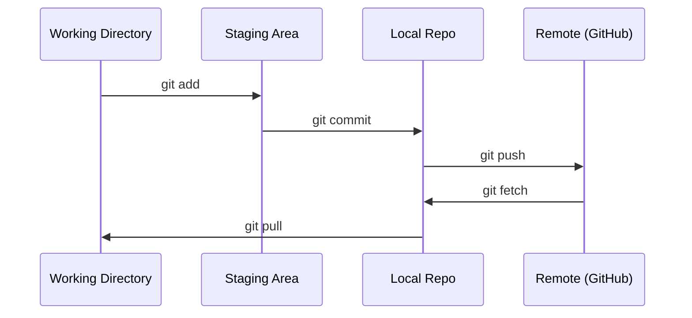

# Git 与协作

> 版本控制不是可选项。你在这里完成的每个实验、每个模型和每节课程都应该留下记录。

**Type:** 学习
**Languages:** --
**Prerequisites:** 第 0 阶段，第 01 课
**Time:** 约 30 分钟

## 学习目标

- 配置 Git 身份，并掌握 add、commit 和 push 的日常工作流
- 为独立实验创建并合并分支，同时避免破坏 main 分支
- 编写 `.gitignore`，排除模型检查点和大型二进制文件
- 使用 `git log` 浏览提交历史，理解项目的演进过程

## 问题

接下来，你将在 20 个阶段中编写数百个代码文件。没有版本控制，你可能会丢失工作成果、造成无法撤销的破坏，也无法与他人协作。

Git 是完成版本控制的工具，GitHub 是托管代码的平台。本课只介绍完成这套课程真正需要的内容。

## 核心概念



需要记住三件事：
1. 经常保存（`git commit`）
2. 推送到远程仓库（`git push`）
3. 为实验创建分支（`git checkout -b experiment`）

```figure
s0-commit-dag
```

## 动手构建

### 第 1 步：配置 Git

```bash
git config --global user.name "Your Name"
git config --global user.email "you@example.com"
```

### 第 2 步：日常工作流

```bash
git status
git add file.py
git commit -m "Add perceptron implementation"
git push origin main
```

### 第 3 步：为实验创建分支

```bash
git checkout -b experiment/new-optimizer

# ... make changes, commit ...

git checkout main
git merge experiment/new-optimizer
```

### 第 4 步：使用本课程仓库

你不能直接向课程仓库推送代码，只有维护者拥有写入权限。请先在 GitHub 上 Fork 仓库（页面右上角的 Fork 按钮），这样 `origin` 就会指向你自己的副本：

```bash
git clone https://github.com/YOUR-USERNAME/ai-engineering-from-scratch.git
cd ai-engineering-from-scratch

git checkout -b my-progress
# work through lessons, commit your code
git push origin my-progress
```

## 实际使用

学习本课程时，你只需要掌握以下命令：

| 命令 | 使用场景 |
|---------|------|
| `git clone` | 获取课程仓库 |
| `git add` + `git commit` | 保存你的工作 |
| `git push` | 将工作备份到 GitHub |
| `git checkout -b` | 在不破坏 main 分支的情况下尝试新内容 |
| `git log --oneline` | 查看自己完成过的工作 |

这些就够了。学习本课程不需要掌握 rebase、cherry-pick 或 submodule。

## 练习

1. Fork 本仓库并克隆自己的副本，创建名为 `my-progress` 的分支，新建一个文件，提交后再推送该分支
2. 创建一个 `.gitignore`，排除模型检查点文件（`.pt`、`.pth`、`.safetensors`）
3. 使用 `git log --oneline` 查看本仓库的提交历史，了解各节课程是如何加入的

## 关键术语

| 术语 | 人们常说 | 准确含义 |
|------|----------------|----------------------|
| Commit | “保存” | 项目在某个时间点的完整快照 |
| Branch | “副本” | 指向某个提交的指针，会随着工作推进而向前移动 |
| Merge | “合并代码” | 获取一个分支中的更改，并将其应用到另一个分支 |
| Remote | “云端” | 托管在其他位置（如 GitHub、GitLab）的仓库副本 |
