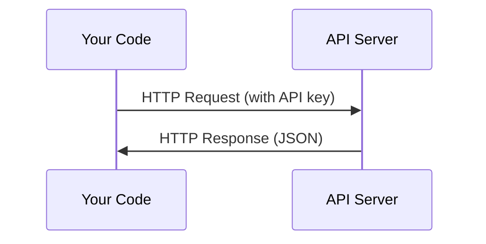

# API 与密钥

> 所有 AI API 的工作方式都一样：发送请求，接收响应。细节会变化，模式始终不变。

**Type:** 构建
**Languages:** Python, TypeScript
**Prerequisites:** 第 0 阶段，第 01 课
**Time:** 约 30 分钟

## 学习目标

- 使用环境变量和 `.env` 文件安全存储 API 密钥
- 分别使用 Anthropic Python SDK 和原始 HTTP 发起 LLM API 调用
- 比较基于 SDK 与原始 HTTP 的请求和响应格式，以便调试
- 识别并处理常见 API 错误，包括身份验证失败和速率限制

## 问题

从第 11 阶段开始，你将调用 Anthropic、OpenAI 和 Google 等提供商的 LLM API。在第 13–16 阶段，你还会构建循环调用这些 API 的智能体。因此，你需要了解 API 密钥如何工作、怎样安全保存密钥，以及如何发起第一次 API 调用。

## 核心概念



每次 API 调用都包含四个部分：
1. 端点（URL）
2. API 密钥（身份验证）
3. 请求体（你希望服务完成什么）
4. 响应体（服务返回的结果）

```figure
s0-secret-inject
```

## 动手构建

### 第 1 步：安全存储 API 密钥

绝不要把 API 密钥直接写进代码。请使用环境变量。

```bash
export ANTHROPIC_API_KEY="sk-ant-..."
export OPENAI_API_KEY="sk-..."
```

也可以使用 `.env` 文件（并将它加入 `.gitignore`）：

```
ANTHROPIC_API_KEY=sk-ant-...
OPENAI_API_KEY=sk-...
```

### 第 2 步：第一次 API 调用（Python）

```python
import os

import anthropic

client = anthropic.Anthropic()

MODEL = os.environ.get("LLM_MODEL", "claude-sonnet-5")

response = client.messages.create(
    model=MODEL,
    max_tokens=256,
    messages=[{"role": "user", "content": "What is a neural network in one sentence?"}]
)

print(response.content[0].text)
```

`LLM_MODEL` 用于选择 Anthropic 模型 ID，默认值是不带日期的 Sonnet 别名。其他提供商（OpenAI、Google 等）也采用“密钥 + 模型 ID”的相同模式，但各自拥有不同的 SDK、端点以及请求/响应数据结构。

### 第 3 步：第一次 API 调用（TypeScript）

```typescript
import Anthropic from "@anthropic-ai/sdk";

const client = new Anthropic();

const MODEL = process.env.LLM_MODEL ?? "claude-sonnet-5";

const response = await client.messages.create({
  model: MODEL,
  max_tokens: 256,
  messages: [{ role: "user", content: "What is a neural network in one sentence?" }],
});

console.log(response.content[0].text);
```

### 第 4 步：原始 HTTP（不使用 SDK）

```python
import os
import urllib.request
import json

url = "https://api.anthropic.com/v1/messages"
headers = {
    "Content-Type": "application/json",
    "x-api-key": os.environ["ANTHROPIC_API_KEY"],
    "anthropic-version": "2023-06-01",
}
body = json.dumps({
    "model": os.environ.get("LLM_MODEL", "claude-sonnet-5"),
    "max_tokens": 256,
    "messages": [{"role": "user", "content": "What is a neural network in one sentence?"}],
}).encode()

req = urllib.request.Request(url, data=body, headers=headers, method="POST")
with urllib.request.urlopen(req) as resp:
    result = json.loads(resp.read())
    print(result["content"][0]["text"])
```

SDK 在底层完成的正是这些操作。理解原始 HTTP 调用，会让你在调试问题时更有把握。

## 实际使用

本课程会在以下阶段使用这些 API：

| API | 使用场景 | 免费额度 |
|-----|-----------------|-----------|
| Anthropic（Claude） | 第 11–16 阶段（智能体、工具） | 注册赠送 5 美元额度 |
| OpenAI | 第 11 阶段（对比） | 注册赠送 5 美元额度 |
| Hugging Face | 第 4–10 阶段（模型、数据集） | 免费 |

你现在不需要把它们全部配置好。等具体课程需要时再进行配置即可。

## 交付成果

本课会产出：
- `outputs/prompt-api-troubleshooter.md`——用于诊断常见 API 错误

## 练习

1. 获取 Anthropic API 密钥，并完成第一次 API 调用
2. 尝试原始 HTTP 版本，并将它的响应格式与 SDK 版本进行比较
3. 故意使用错误的 API 密钥，然后阅读返回的错误消息

## 关键术语

| 术语 | 人们常说 | 准确含义 |
|------|----------------|----------------------|
| API key | “API 的密码” | 用于标识你的账户并授权请求的唯一字符串 |
| Rate limit | “他们在限流” | 为防止滥用并保证公平使用而设置的每分钟或每小时最大请求数 |
| Token | “一个单词”（在 API 语境中） | 计费单位；输入 token 和输出 token 会分别统计并计费 |
| Streaming | “实时响应” | 逐步接收响应内容，而不是等待完整响应生成后再一次性获得结果 |
