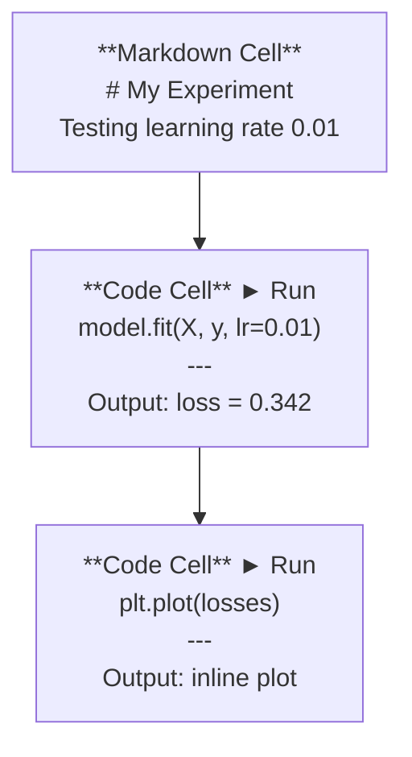
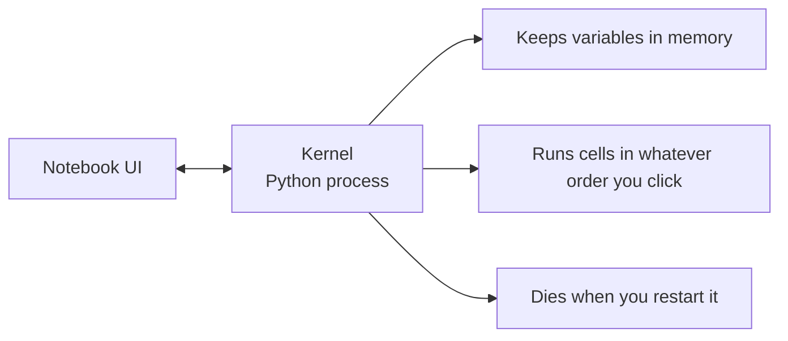

# Jupyter Notebook

> Notebook 是 AI 工程的实验台。你在这里制作原型，再将可行的方案转入生产环境。

**Type:** 构建
**Languages:** Python
**Prerequisites:** 第 0 阶段，第 01 课
**Time:** 约 30 分钟

## 学习目标

- 安装并启动 JupyterLab、Jupyter Notebook，或安装了 Jupyter 扩展的 VS Code
- 使用魔法命令（`%timeit`、`%%time`、`%matplotlib inline`）进行基准测试和内嵌可视化
- 区分何时应使用 Notebook、何时应使用脚本，并采用“在 Notebook 中探索，在脚本中交付”的工作流
- 识别并避开常见的 Notebook 陷阱：乱序执行、隐藏状态和内存泄漏

## 问题

几乎每篇 AI 论文、每份教程和每场 Kaggle 竞赛都会使用 Jupyter Notebook。它让你能够分段运行代码、直接查看内嵌输出、混合编写代码与说明，并快速迭代。如果不用 Notebook 学习 AI，就像做数学作业时不准备草稿纸。

但 Notebook 也有切实存在的陷阱。人们经常把它用于所有事情，包括那些它极不擅长的场景。知道何时使用 Notebook、何时改用脚本，能让你日后避开许多调试噩梦。

## 核心概念

一个 Notebook 由一组单元格组成。每个单元格要么包含代码，要么包含文本。



内核（kernel）是在后台运行的 Python 进程。执行一个单元格时，Notebook 会把代码发送给内核；内核执行代码，再返回结果。所有单元格共享同一个内核，因此变量会在不同单元格之间保留。



这种“按你点击的任意顺序执行”既是 Notebook 的超能力，也是最容易踩中的坑。

```figure
s0-cell-order
```

## 动手构建

### 第 1 步：选择界面

三种界面，共用同一种文件格式：

| 界面 | 安装方式 | 最适合的场景 |
|-----------|---------|----------|
| JupyterLab | `pip install jupyterlab`，然后运行 `jupyter lab` | 完整 IDE 体验、多标签页、文件浏览器和终端 |
| Jupyter Notebook | `pip install notebook`，然后运行 `jupyter notebook` | 简单、轻量，一次专注于一个 Notebook |
| VS Code | 安装 “Jupyter” 扩展 | 直接在已有编辑器中使用，并获得 Git 集成和调试能力 |

三者都能读写相同的 `.ipynb` 文件。选择你喜欢的即可；JupyterLab 是 AI 工作中最常见的选择。

```bash
pip install jupyterlab
jupyter lab
```

### 第 2 步：真正重要的键盘快捷键

Notebook 有两种操作模式。按 `Escape` 进入命令模式（左侧显示蓝色条），按 `Enter` 进入编辑模式（左侧显示绿色条）。

**命令模式（最常用）：**

| 按键 | 操作 |
|-----|--------|
| `Shift+Enter` | 运行当前单元格，并移到下一个单元格 |
| `A` | 在上方插入单元格 |
| `B` | 在下方插入单元格 |
| `DD` | 删除单元格 |
| `M` | 转换为 Markdown 单元格 |
| `Y` | 转换为代码单元格 |
| `Z` | 撤销单元格操作 |
| `Ctrl+Shift+H` | 显示所有快捷键 |

**编辑模式：**

| 按键 | 操作 |
|-----|--------|
| `Tab` | 自动补全 |
| `Shift+Tab` | 显示函数签名 |
| `Ctrl+/` | 切换注释状态 |

`Shift+Enter` 是你每天会用上千次的快捷键，请先掌握它。

### 第 3 步：单元格类型

**代码单元格**会运行 Python 并显示输出：

```python
import numpy as np
data = np.random.randn(1000)
data.mean(), data.std()
```

输出：`(0.0032, 0.9987)`

**Markdown 单元格**会渲染格式化文本。用它记录你在做什么以及为什么这样做。它支持标题、粗体、斜体、LaTeX 数学公式（`$E = mc^2$`）、表格和图片。

### 第 4 步：魔法命令

这些并不是 Python 语法，而是 Jupyter 专用命令：行魔法命令以 `%` 开头，单元格魔法命令以 `%%` 开头。

**测量代码耗时：**

```python
%timeit np.random.randn(10000)
```

输出：`45.2 us +/- 1.3 us per loop`

```python
%%time
model.fit(X_train, y_train, epochs=10)
```

输出：`Wall time: 2.34 s`

`%timeit` 会多次运行代码并计算平均值，`%%time` 则只运行一次。微基准测试使用 `%timeit`，训练任务使用 `%%time`。

**启用内嵌图表：**

```python
%matplotlib inline
```

之后，每次调用 `plt.plot()` 或 `plt.show()` 都会直接在 Notebook 中渲染结果。

**不离开 Notebook 就安装软件包：**

```python
!pip install scikit-learn
```

前缀 `!` 可以运行任意 shell 命令。

**查看环境变量：**

```python
%env CUDA_VISIBLE_DEVICES
```

### 第 5 步：内嵌显示丰富内容

Notebook 会自动显示单元格中的最后一个表达式，你也可以主动控制显示内容：

```python
import pandas as pd

df = pd.DataFrame({
    "model": ["Linear", "Random Forest", "Neural Net"],
    "accuracy": [0.72, 0.89, 0.94],
    "training_time": [0.1, 2.3, 45.6]
})
df
```

这里渲染的是格式化的 HTML 表格，而不是一段纯文本输出。图表也是如此：

```python
import matplotlib.pyplot as plt

plt.figure(figsize=(8, 4))
plt.plot([1, 2, 3, 4], [1, 4, 2, 3])
plt.title("Inline Plot")
plt.show()
```

图表会直接出现在单元格下方。这正是 Notebook 在 AI 工作中占据主流的原因：数据、图表和代码能同时呈现在眼前。

显示图片时可以这样做：

```python
from IPython.display import Image, display
display(Image(filename="architecture.png"))
```

### 第 6 步：Google Colab

Colab 是运行在云端的免费 Jupyter Notebook。它提供 GPU、预装库和 Google Drive 集成，无需本地配置。

1. 打开 [colab.research.google.com](https://colab.research.google.com)
2. 上传本课程中的任意 `.ipynb` 文件
3. 依次选择 Runtime > Change runtime type > T4 GPU（免费）

Colab 与本地 Jupyter 的区别：
- 文件不会跨会话保留（请保存到 Drive 或下载到本地）
- 已预装 numpy、pandas、matplotlib、torch、tensorflow 和 sklearn
- 使用 `from google.colab import files` 上传或下载文件
- 使用 `from google.colab import drive; drive.mount('/content/drive')` 获得持久化存储
- 免费版会话在闲置 90 分钟后超时

## 实际使用

### Notebook 与脚本：分别适合什么场景

| 使用 Notebook | 使用脚本 |
|-------------------|-----------------|
| 探索数据集 | 训练流水线 |
| 制作模型原型 | 可复用工具函数 |
| 可视化结果 | 包含 `if __name__` 的程序 |
| 讲解你的工作 | 按计划周期运行的代码 |
| 快速实验 | 生产代码 |
| 课程练习 | 软件包和库 |

原则是：**在 Notebook 中探索，在脚本中交付**。

一种常见的 AI 工作流是：
1. 在 Notebook 中探索数据
2. 在 Notebook 中制作模型原型
3. 原型可用后，将代码移入 `.py` 文件
4. 再把这些 `.py` 文件导入 Notebook，继续进行实验

### 常见陷阱

**乱序执行。**你先运行第 5 个单元格，再运行第 2 个，最后运行第 7 个。Notebook 在你的机器上可以工作，但别人从上到下运行时却会失败。修复方法：分享前执行 Kernel > Restart & Run All。

**隐藏状态。**你删除了一个单元格，但它创建的变量仍留在内存中。Notebook 表面上很干净，实际上却依赖一个已经消失的单元格。修复方法：定期重启内核。

**内存泄漏。**先加载一个 4GB 数据集并训练模型，又加载另一个数据集，先前占用的内存却没有释放。修复方法：执行 `del variable_name` 和 `gc.collect()`，或直接重启内核。

## 交付成果

本课会产出：
- `outputs/prompt-notebook-helper.md`，用于调试 Notebook 问题

## 练习

1. 打开 JupyterLab，创建一个 Notebook，并使用 `%timeit` 比较列表推导式与 numpy 在生成 100,000 个随机数数组时的性能
2. 创建一个同时包含 Markdown 和代码单元格的 Notebook：加载 CSV、显示 dataframe 并绘制图表。然后执行 Kernel > Restart & Run All，验证它能从上到下正常运行
3. 将 `code/notebook_tips.py` 中的代码粘贴到 Colab Notebook，并使用免费 GPU 运行

## 关键术语

| 术语 | 人们常说 | 准确含义 |
|------|----------------|----------------------|
| Kernel | “运行代码的那个东西” | 执行单元格并将变量保存在内存中的独立 Python 进程 |
| Cell | “代码块” | Notebook 中可独立运行的单元，可以是代码或 Markdown |
| Magic command | “Jupyter 小技巧” | 以 `%` 或 `%%` 为前缀、用于控制 Notebook 环境的特殊命令 |
| `.ipynb` | “Notebook 文件” | 包含单元格、输出和元数据的 JSON 文件；名称来自 IPython Notebook |

## 延伸阅读

- [JupyterLab 文档](https://jupyterlab.readthedocs.io/)：了解完整功能
- [Google Colab 常见问题](https://research.google.com/colaboratory/faq.html)：了解 Colab 特有的限制和功能
- [28 个 Jupyter Notebook 技巧](https://www.dataquest.io/blog/jupyter-notebook-tips-tricks-shortcuts/)：了解高级用户快捷键
