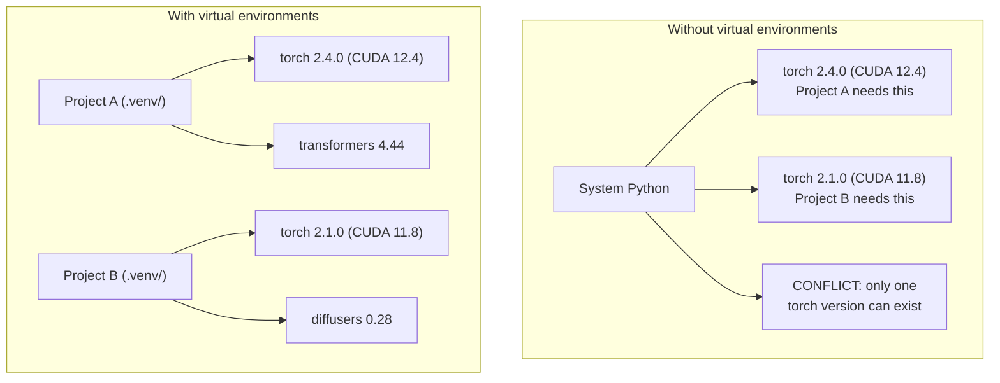

# Python 环境

> 依赖地狱确实存在，而虚拟环境就是解药。

**Type:** 构建
**Languages:** Shell
**Prerequisites:** 第 0 阶段，第 01 课
**Time:** 约 30 分钟

## 学习目标

- 使用 `uv`、`venv` 或 `conda` 创建相互隔离的虚拟环境
- 编写包含可选依赖组的 `pyproject.toml`，并生成锁文件以实现可复现安装
- 诊断并修复常见问题：全局安装、混用 pip 与 conda，以及 CUDA 版本不匹配
- 为依赖存在冲突的项目制定按阶段隔离环境的策略

## 问题

你为一个微调项目安装了 PyTorch 2.4。到了下周，另一个项目因为 CUDA 构建版本固定，必须使用 PyTorch 2.1。你在全局升级后，第一个项目坏了；降级后，第二个项目又坏了。

这就是依赖地狱。它在 AI/ML 工作中频繁发生，原因包括：

- PyTorch、JAX 和 TensorFlow 都附带各自的 CUDA 绑定
- 模型库会固定依赖某些特定版本的框架
- 全局执行 `pip install` 会覆盖此前安装的版本
- CUDA 11.8 构建无法与 CUDA 12.x 驱动配合使用，反之亦然

解决办法是：为每个项目创建独立环境，并在其中安装该项目自己的软件包。

## 核心概念



```figure
s0-env-isolation
```

## 动手构建

### 方案 1：uv venv（推荐）

`uv` 是速度最快的 Python 包管理器之一，比 pip 快 10–100 倍。它可以用一个工具统一管理虚拟环境、Python 版本和依赖解析。

```bash
curl -LsSf https://astral.sh/uv/install.sh | sh

uv python install 3.12

cd your-project
uv venv
source .venv/bin/activate
```

安装软件包：

```bash
uv pip install torch numpy
```

一步创建带有 `pyproject.toml` 的项目：

```bash
uv init my-ai-project
cd my-ai-project
uv add torch numpy matplotlib
```

### 方案 2：venv（内置工具）

如果无法安装 `uv`，可以使用 Python 自带的 `venv`：

```bash
python3 -m venv .venv
source .venv/bin/activate  # Linux/macOS
.venv\Scripts\activate     # Windows

pip install torch numpy
```

它比 `uv` 慢，但只要安装了 Python 就能使用。

### 方案 3：conda（需要时使用）

Conda 能管理 CUDA 工具包、cuDNN 和 C 库等非 Python 依赖。以下情况适合使用它：

- 你需要指定版本的 CUDA 工具包，但不希望将它安装到整个系统
- 你在共享集群上工作，无法安装系统软件包
- 某个库的安装说明明确要求“使用 conda”

```bash
# Install miniconda (not the full Anaconda)
curl -LsSf https://repo.anaconda.com/miniconda/Miniconda3-latest-Linux-x86_64.sh -o miniconda.sh
bash miniconda.sh -b

conda create -n myproject python=3.12
conda activate myproject

conda install pytorch torchvision torchaudio pytorch-cuda=12.4 -c pytorch -c nvidia
```

请遵守一条规则：如果一个环境由 conda 管理，该环境中的所有软件包也应尽量使用 conda 安装。在 conda 环境中混用 `pip install`，容易造成难以排查的依赖冲突。

### 本课程的建议：按阶段划分环境

你当然可以为整套课程只创建一个环境，但不要这样做。不同阶段可能需要不同甚至互相冲突的依赖版本。

建议采用以下结构：

```
ai-engineering-from-scratch/
├── .venv/                    <-- shared lightweight env for phases 0-3
├── phases/
│   ├── 04-neural-networks/
│   │   └── .venv/            <-- PyTorch env
│   ├── 05-cnns/
│   │   └── .venv/            <-- same PyTorch env (symlink or shared)
│   ├── 08-transformers/
│   │   └── .venv/            <-- might need different transformer versions
│   └── 11-llm-apis/
│       └── .venv/            <-- API SDKs, no torch needed
```

`code/env_setup.sh` 中的脚本会为本课程创建基础环境。

## pyproject.toml 基础

每个 Python 项目都应该包含 `pyproject.toml`。它用一个文件取代了 `setup.py`、`setup.cfg` 和 `requirements.txt`。

```toml
[project]
name = "ai-engineering-from-scratch"
version = "0.1.0"
requires-python = ">=3.11"
dependencies = [
    "numpy>=1.26",
    "matplotlib>=3.8",
    "jupyter>=1.0",
    "scikit-learn>=1.4",
]

[project.optional-dependencies]
torch = ["torch>=2.3", "torchvision>=0.18"]
llm = ["anthropic>=0.39", "openai>=1.50"]
```

然后执行安装：

```bash
uv pip install -e ".[torch]"    # base + PyTorch
uv pip install -e ".[llm]"     # base + LLM SDKs
uv pip install -e ".[torch,llm]" # everything
```

## 锁文件

锁文件会把每个依赖（包括传递依赖）固定到精确版本，从而保证可复现性：任何人按照锁文件安装，都会得到完全相同的软件包版本。

```bash
# uv generates uv.lock automatically when using uv add
uv add numpy

# pip-tools approach
uv pip compile pyproject.toml -o requirements.lock
uv pip install -r requirements.lock
```

请把锁文件提交到 Git。其他人克隆仓库后，就能依据锁文件安装完全一致的版本。

## 常见错误

### 1. 全局安装

```bash
pip install torch  # BAD: installs to system Python

source .venv/bin/activate
pip install torch  # GOOD: installs to virtual environment
```

检查软件包将被安装到哪里：

```bash
which python       # should show .venv/bin/python, not /usr/bin/python
which pip           # should show .venv/bin/pip
```

### 2. 混用 pip 与 conda

```bash
conda create -n myenv python=3.12
conda activate myenv
conda install pytorch -c pytorch
pip install some-other-package   # BAD: can break conda's dependency tracking
conda install some-other-package # GOOD: let conda manage everything
```

如果必须在 conda 环境中使用 pip（有些软件包只通过 pip 提供），请先安装全部 conda 软件包，最后再安装 pip 软件包。

### 3. 忘记激活环境

```bash
python train.py           # uses system Python, missing packages
source .venv/bin/activate
python train.py           # uses project Python, packages found
```

你的 shell 提示符应该显示环境名称：

```
(.venv) $ python train.py
```

### 4. 将 .venv 提交到 Git

```bash
echo ".venv/" >> .gitignore
```

虚拟环境通常占用 200MB–2GB。它属于本地环境，不能在不同机器之间移植。应该提交 `pyproject.toml` 和锁文件，而不是虚拟环境本身。

### 5. CUDA 版本不匹配

```bash
nvidia-smi                # shows driver CUDA version (e.g., 12.4)
python -c "import torch; print(torch.version.cuda)"  # shows PyTorch CUDA version

# These must be compatible.
# PyTorch CUDA version must be <= driver CUDA version.
```

## 实际使用

运行设置脚本，创建本课程所需的环境：

```bash
bash phases/00-setup-and-tooling/06-python-environments/code/env_setup.sh
```

该脚本会在仓库根目录创建 `.venv`，安装核心依赖，并验证安装结果。

## 练习

1. 运行 `env_setup.sh`，确认所有检查都通过
2. 创建第二个虚拟环境，在其中安装不同版本的 numpy，并确认两个环境互相隔离
3. 为一个同时需要 PyTorch 和 Anthropic SDK 的项目编写 `pyproject.toml`
4. 在不激活虚拟环境的情况下故意全局安装一个软件包，观察它被安装到哪里，然后将它卸载

## 关键术语

| 术语 | 人们常说 | 准确含义 |
|------|----------------|----------------------|
| Virtual environment | “一个 venv” | 包含 Python 解释器和软件包、与系统 Python 相互隔离的目录 |
| Lockfile | “锁定的依赖” | 列出每个软件包及其精确版本的文件，用于保证不同机器上的安装结果一致 |
| pyproject.toml | “新版 setup.py” | Python 项目的标准配置文件，用于取代 setup.py、setup.cfg 和 requirements.txt |
| Transitive dependency | “依赖的依赖” | 软件包 B 依赖 C；如果安装依赖 B 的 A，那么 C 就是 A 的传递依赖 |
| CUDA mismatch | “我的 GPU 不能用” | PyTorch 编译时使用的 CUDA 版本与 GPU 驱动支持的版本不一致 |
