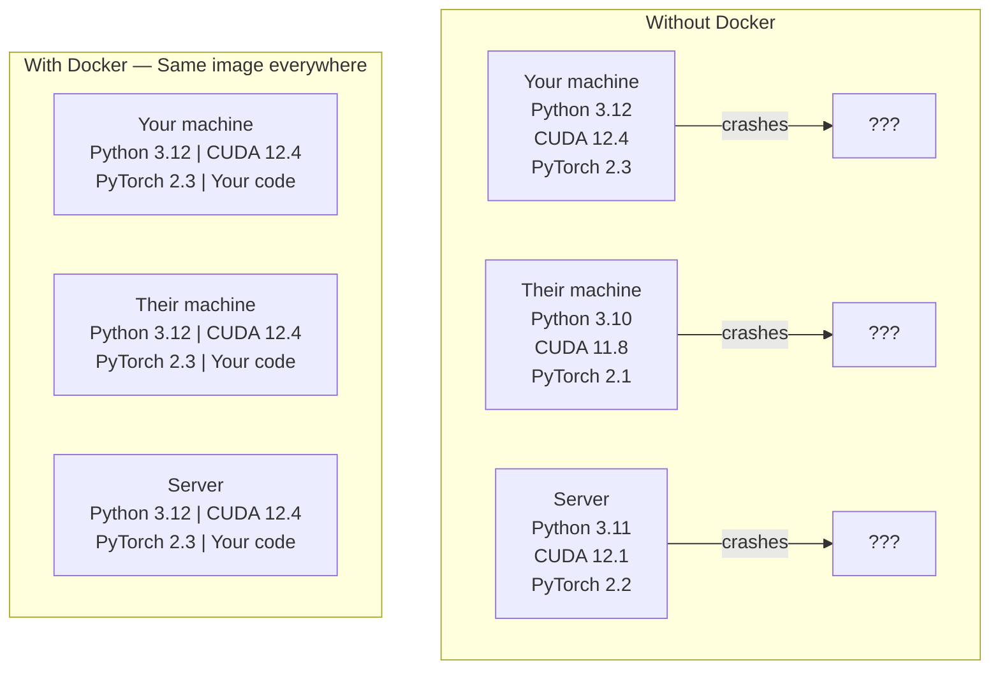

# 面向 AI 的 Docker

> 容器让“在我的机器上明明可以运行”成为过去式。

**Type:** 构建
**Languages:** Docker
**Prerequisites:** 第 0 阶段，第 01 课和第 03 课
**Time:** 约 1 小时

## 学习目标

- 通过 Dockerfile 构建包含 CUDA、PyTorch 和 AI 库且支持 GPU 的 Docker 镜像
- 将宿主机目录挂载为数据卷，使模型、数据集和代码在容器重建后仍然保留
- 配置 NVIDIA Container Toolkit，让容器能够访问 GPU
- 使用 Docker Compose 编排多服务 AI 应用（推理服务器 + 向量数据库）

## 问题

你在笔记本电脑上使用 PyTorch 2.3、CUDA 12.4 和 Python 3.12 训练了一个模型。同事的环境却是 PyTorch 2.1、CUDA 11.8 和 Python 3.10，模型一到对方机器上就崩溃。而同一个 Dockerfile 可以在两台机器上运行。

AI 项目的依赖关系尤其棘手。一套典型技术栈包括 Python、PyTorch、CUDA 驱动、cuDNN、系统级 C 库，以及 flash-attn 这类要求精确编译器版本的专用软件包。Docker 将这些内容封装成单一镜像，使其能够在不同环境中以相同方式运行。

## 核心概念

Docker 会把代码、运行时、库和系统工具封装进一个称为容器的隔离单元。你可以把它理解成轻量级虚拟机；不同之处在于，容器与宿主机共享操作系统内核，而不是运行自己的内核，因此它能在几秒内启动，不需要等待数分钟。



### 为什么 AI 项目比大多数项目更需要 Docker

1. **GPU 驱动很脆弱。**针对 CUDA 12.4 构建的代码无法在 CUDA 11.8 上运行。Docker 把 CUDA 工具包隔离在容器内部，同时通过 NVIDIA Container Toolkit 共享宿主机的 GPU 驱动。

2. **模型权重体积很大。**一个 70 亿参数模型以 fp16 存储时约占 14GB。你不会希望每次重建容器都重新下载它。借助 Docker 数据卷，可以把宿主机上的模型目录挂载进容器。

3. **多服务架构很常见。**真正的 AI 应用并不只是一段 Python 脚本，它通常包含推理服务器、用于 RAG 的向量数据库，可能还包括 Web 前端。Docker Compose 可以用一条命令编排所有这些服务。

### 核心术语

| 术语 | 含义 |
|------|---------------|
| Image | 只读模板，也就是你的构建配方；由 Dockerfile 构建而成 |
| Container | 镜像的运行实例，相当于真正开始工作的厨房 |
| Dockerfile | 按层构建镜像的一组指令 |
| Volume | 容器重启后仍然保留的持久化存储 |
| docker-compose | 使用 YAML 定义多容器应用的工具 |

### AI 中常见的容器模式

```
Dev Container
  Full toolkit. Editor support. Jupyter. Debugging tools.
  Used during development and experimentation.

Training Container
  Minimal. Just the training script and dependencies.
  Runs on GPU clusters. No editor, no Jupyter.

Inference Container
  Optimized for serving. Small image. Fast cold start.
  Runs behind a load balancer in production.
```

```figure
s0-image-layers
```

## 动手构建

### 第 1 步：安装 Docker

```bash
# macOS
brew install --cask docker
open /Applications/Docker.app

# Ubuntu
curl -fsSL https://get.docker.com | sh
sudo usermod -aG docker $USER
# Log out and back in for group change to take effect
```

验证安装：

```bash
docker --version
docker run hello-world
```

### 第 2 步：安装 NVIDIA Container Toolkit（配备 NVIDIA GPU 的 Linux）

它允许 Docker 容器访问 GPU。macOS 和 Windows（WSL2）用户可以跳过本节；这些平台上的 Docker Desktop 会采用不同方式处理 GPU 透传。

```bash
distribution=$(. /etc/os-release;echo $ID$VERSION_ID)
curl -fsSL https://nvidia.github.io/libnvidia-container/gpgkey | sudo gpg --dearmor -o /usr/share/keyrings/nvidia-container-toolkit-keyring.gpg
curl -s -L https://nvidia.github.io/libnvidia-container/$distribution/libnvidia-container.list | \
    sed 's#deb https://#deb [signed-by=/usr/share/keyrings/nvidia-container-toolkit-keyring.gpg] https://#g' | \
    sudo tee /etc/apt/sources.list.d/nvidia-container-toolkit.list

sudo apt-get update
sudo apt-get install -y nvidia-container-toolkit
sudo nvidia-ctk runtime configure --runtime=docker
sudo systemctl restart docker
```

测试容器内的 GPU 访问：

```bash
docker run --rm --gpus all nvidia/cuda:12.4.1-base-ubuntu22.04 nvidia-smi
```

如果能够看到 GPU 信息，就说明工具包工作正常。

### 第 3 步：理解基础镜像

选择正确的基础镜像可以节省数小时的调试时间。

```
nvidia/cuda:12.4.1-devel-ubuntu22.04
  Full CUDA toolkit. Compilers included.
  Use for: building packages that need nvcc (flash-attn, bitsandbytes)
  Size: ~4 GB

nvidia/cuda:12.4.1-runtime-ubuntu22.04
  CUDA runtime only. No compilers.
  Use for: running pre-built code
  Size: ~1.5 GB

pytorch/pytorch:2.6.0-cuda12.4-cudnn9-runtime
  PyTorch pre-installed on top of CUDA.
  Use for: skipping the PyTorch install step
  Size: ~6 GB

python:3.12-slim
  No CUDA. CPU only.
  Use for: inference on CPU, lightweight tools
  Size: ~150 MB
```

### 第 4 步：为 AI 开发编写 Dockerfile

下面是 `code/Dockerfile` 中的 Dockerfile。让我们逐步理解它：

```dockerfile
FROM nvidia/cuda:12.4.1-devel-ubuntu22.04

ENV DEBIAN_FRONTEND=noninteractive
ENV PYTHONUNBUFFERED=1

RUN apt-get update && apt-get install -y --no-install-recommends \
    software-properties-common \
    git \
    curl \
    build-essential \
    && add-apt-repository -y ppa:deadsnakes/ppa \
    && apt-get update && apt-get install -y --no-install-recommends \
    python3.12 \
    python3.12-venv \
    python3.12-dev \
    && rm -rf /var/lib/apt/lists/*

RUN update-alternatives --install /usr/bin/python python /usr/bin/python3.12 1

RUN curl -sSL https://raw.githubusercontent.com/pypa/get-pip/3b73145063be545b649ad9ca83ea8da5fc915a4f/public/get-pip.py -o /tmp/get-pip.py \
    && echo "a341e1a43e38001c551a1508a73ff23636a11970b61d901d9a1cad2a18f57055  /tmp/get-pip.py" | sha256sum -c - \
    && python /tmp/get-pip.py \
    && rm /tmp/get-pip.py \
    && update-alternatives --install /usr/bin/pip pip /usr/local/bin/pip3.12 1

RUN python -m pip install --no-cache-dir --upgrade pip setuptools wheel

RUN python -m pip install --no-cache-dir \
    torch==2.6.0+cu124 \
    torchvision==0.21.0+cu124 \
    torchaudio==2.6.0+cu124 \
    --index-url https://download.pytorch.org/whl/cu124

RUN python -m pip install --no-cache-dir \
    numpy \
    pandas \
    scikit-learn \
    matplotlib \
    jupyter \
    transformers \
    datasets \
    accelerate \
    safetensors

WORKDIR /workspace

VOLUME ["/workspace", "/models"]

EXPOSE 8888

CMD ["python"]
```

构建镜像：

```bash
docker build -t ai-dev -f phases/00-setup-and-tooling/07-docker-for-ai/code/Dockerfile .
```

第一次构建需要下载 CUDA 基础镜像和 PyTorch，因此会花一些时间。后续构建会复用缓存层。

运行镜像：

```bash
docker run --rm -it --gpus all \
    -v $(pwd):/workspace \
    -v ~/models:/models \
    ai-dev python -c "import torch; print(f'PyTorch {torch.__version__}, CUDA: {torch.cuda.is_available()}')"
```

在容器中运行 Jupyter：

```bash
docker run --rm -it --gpus all \
    -v $(pwd):/workspace \
    -v ~/models:/models \
    -p 8888:8888 \
    ai-dev jupyter notebook --ip=0.0.0.0 --port=8888 --no-browser --allow-root
```

### 第 5 步：为数据和模型挂载数据卷

数据卷挂载对 AI 工作至关重要。没有数据卷，下载好的 14GB 模型会在容器停止时消失。

```bash
# Mount your code
-v $(pwd):/workspace

# Mount a shared models directory
-v ~/models:/models

# Mount datasets
-v ~/datasets:/data
```

在训练脚本中，从挂载路径加载模型：

```python
from transformers import AutoModel

model = AutoModel.from_pretrained("/models/llama-7b")
```

模型实际保存在宿主机文件系统中，因此你可以随意重建容器，而无需重新下载。

### 第 6 步：使用 Docker Compose 运行多服务 AI 应用

真正的 RAG 应用需要推理服务器和向量数据库。Docker Compose 可以用一条命令同时运行二者。

请查看 `code/docker-compose.yml`：

```yaml
services:
  ai-dev:
    build:
      context: .
      dockerfile: Dockerfile
    deploy:
      resources:
        reservations:
          devices:
            - driver: nvidia
              count: all
              capabilities: [gpu]
    volumes:
      - ../../../:/workspace
      - ~/models:/models
      - ~/datasets:/data
    ports:
      - "8888:8888"
    stdin_open: true
    tty: true
    command: jupyter notebook --ip=0.0.0.0 --port=8888 --no-browser --allow-root

  qdrant:
    image: qdrant/qdrant:v1.12.5
    ports:
      - "6333:6333"
      - "6334:6334"
    volumes:
      - qdrant_data:/qdrant/storage

volumes:
  qdrant_data:
```

启动所有服务：

```bash
cd phases/00-setup-and-tooling/07-docker-for-ai/code
docker compose up -d
```

此时，AI 开发容器可以使用服务名，通过 `http://qdrant:6333` 访问向量数据库。Docker Compose 会自动创建共享网络。

在 AI 容器内部测试连接：

```python
from qdrant_client import QdrantClient

client = QdrantClient(host="qdrant", port=6333)
print(client.get_collections())
```

停止所有服务：

```bash
docker compose down
```

如果还要删除 qdrant 数据卷，请添加 `-v`：

```bash
docker compose down -v
```

### 第 7 步：AI 工作中的常用 Docker 命令

```bash
# List running containers
docker ps

# List all images and their sizes
docker images

# Remove unused images (reclaim disk space)
docker system prune -a

# Check GPU usage inside a running container
docker exec -it <container_id> nvidia-smi

# Copy a file from container to host
docker cp <container_id>:/workspace/results.csv ./results.csv

# View container logs
docker logs -f <container_id>
```

## 实际使用

现在，你已经拥有一个可复现的 AI 开发环境。在本课程后续内容中：

- 使用 `docker compose up` 同时启动开发环境和向量数据库
- 把代码、模型和数据作为数据卷挂载，确保重建容器时不会丢失内容
- 当课程需要新的 Python 软件包时，把它加入 Dockerfile 并重新构建镜像
- 与团队成员共享 Dockerfile，让每个人都获得完全相同的环境

### 没有 GPU？

移除 `--gpus all` 参数和 NVIDIA deploy 配置块即可。容器仍可用于基于 CPU 的课程；PyTorch 会检测到 CUDA 不可用，并自动回退到 CPU。

## 练习

1. 构建 Dockerfile，并在容器内运行 `python -c "import torch; print(torch.__version__)"`
2. 启动 docker-compose 技术栈，并确认 AI 容器可以通过 `http://qdrant:6333/collections` 访问 Qdrant
3. 将 `flask` 加入 Dockerfile，重新构建镜像，然后在 5000 端口运行一个简单的 API 服务器；使用 `-p 5000:5000` 映射端口
4. 使用 `docker images` 测量镜像大小；尝试将基础镜像从 `devel` 切换为 `runtime`，并比较二者大小

## 关键术语

| 术语 | 人们常说 | 准确含义 |
|------|----------------|----------------------|
| Container | “轻量级虚拟机” | 使用宿主机内核、但拥有独立文件系统和网络的隔离进程 |
| Image layer | “缓存步骤” | 每条 Dockerfile 指令都会创建一层；未变化的层会被缓存，因此重建很快 |
| NVIDIA Container Toolkit | “Docker 中的 GPU” | 通过 `--gpus` 参数把宿主机 GPU 暴露给容器的运行时钩子 |
| Volume mount | “共享文件夹” | 映射到容器内的宿主机目录；容器停止后，其中的更改仍会保留 |
| Base image | “起点” | Dockerfile 在 `FROM` 指定镜像之上继续构建；它决定了预装内容 |
