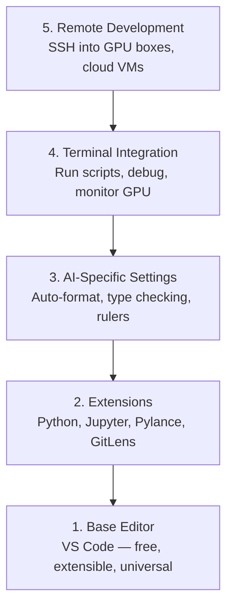

# 编辑器配置

> 编辑器是你的副驾驶。一次配置妥当，让它不再妨碍你，并真正开始发挥作用。

**Type:** 构建
**Languages:** --
**Prerequisites:** 第 0 阶段，第 01 课
**Time:** 约 20 分钟

## 学习目标

- 安装 VS Code，以及 Python、Jupyter、代码检查和远程 SSH 所需的核心扩展
- 为 AI 工作流配置保存时格式化、类型检查和 Notebook 输出滚动
- 配置 Remote SSH，像操作本地代码一样编辑和调试远程 GPU 机器上的代码
- 评估 Cursor、Windsurf、Neovim 等替代编辑器及其在 AI 工作中的取舍

## 问题

你将在编辑器中花费数千小时：编写 Python、运行 Notebook、调试训练循环，以及通过 SSH 连接 GPU 机器。配置不当的编辑器会给每次工作带来阻力：没有自动补全、没有类型提示、看不到行内错误、需要手动格式化，终端工作流也很笨重。

正确配置只需 20 分钟。跳过这一步，可能每天都要多浪费 20 分钟。

## 核心概念

一个面向 AI 工程的编辑器配置需要具备五项能力：



```figure
s0-lsp-roundtrip
```

## 动手构建

### 第 1 步：安装 VS Code

推荐使用 VS Code。它免费、支持所有主流操作系统，拥有一流的 Jupyter Notebook 支持，而且扩展生态覆盖了 AI 工作所需的一切。

请从 [code.visualstudio.com](https://code.visualstudio.com/) 下载。

在终端中验证安装：

```bash
code --version
```

如果 macOS 找不到 `code`，请打开 VS Code，按下 `Cmd+Shift+P`，输入 “Shell Command”，然后选择 “Install 'code' command in PATH”。

### 第 2 步：安装核心扩展

打开 VS Code 的集成终端（所有平台均为 `` Ctrl+` ``），安装 AI 工作需要的扩展：

```bash
code --install-extension ms-python.python
code --install-extension ms-python.vscode-pylance
code --install-extension ms-toolsai.jupyter
code --install-extension eamodio.gitlens
code --install-extension ms-vscode-remote.remote-ssh
code --install-extension ms-python.debugpy
code --install-extension ms-python.black-formatter
code --install-extension charliermarsh.ruff
```

各扩展的作用如下：

| 扩展 | 用途 |
|-----------|-----|
| Python | 提供语言支持、虚拟环境检测以及运行/调试功能 |
| Pylance | 提供快速类型检查、自动补全和导入解析 |
| Jupyter | 在 VS Code 内运行 Notebook，并提供变量查看器 |
| GitLens | 查看每处修改的作者，并在行内显示 Git blame 信息 |
| Remote SSH | 像打开本地目录一样打开远程 GPU 机器上的目录 |
| Debugpy | 对 Python 进行逐步调试 |
| Black Formatter | 保存时自动格式化，保持统一代码风格 |
| Ruff | 高速代码检查，可捕获常见错误 |

本课的 `code/.vscode/extensions.json` 包含完整的推荐扩展列表。打开项目目录时，VS Code 会提示你安装它们。

### 第 3 步：配置设置

复制本课 `code/.vscode/settings.json` 中的设置，或通过 `Settings > Open Settings (JSON)` 手动配置。

AI 工作中的关键设置如下：

```jsonc
{
    "python.analysis.typeCheckingMode": "basic",
    "editor.formatOnSave": true,
    "editor.rulers": [88, 120],
    "notebook.output.scrolling": true,
    "files.autoSave": "afterDelay"
}
```

这些设置很重要，原因如下：

- **基础类型检查**：在运行前发现参数类型错误，减少调试张量形状不匹配和 API 参数错误所花的时间。
- **保存时格式化**：以后无需再操心格式，Black 会自动处理。
- **第 88 列和第 120 列标尺**：Black 会在第 88 列换行；第 120 列标记可提醒你文档字符串或注释过长。
- **Notebook 输出滚动**：训练循环可能打印数千行。如果不启用滚动，输出面板会无限拉长。
- **自动保存**：你难免会忘记保存，导致训练脚本运行旧代码；自动保存可以避免这种情况。

### 第 4 步：终端集成

你会在 VS Code 的集成终端中运行训练脚本、监控 GPU 并管理环境。

请正确配置它：

```jsonc
{
    "terminal.integrated.defaultProfile.osx": "zsh",
    "terminal.integrated.defaultProfile.linux": "bash",
    "terminal.integrated.fontSize": 13,
    "terminal.integrated.scrollback": 10000
}
```

常用快捷键：

| 操作 | macOS | Linux/Windows |
|--------|-------|---------------|
| 显示或隐藏终端 | `` Ctrl+` `` | `` Ctrl+` `` |
| 新建终端 | `` Ctrl+Shift+` `` | `` Ctrl+Shift+` `` |
| 拆分终端 | `Cmd+\` | `Ctrl+Shift+5` |

拆分终端非常实用：一个终端运行脚本，另一个终端通过 `nvidia-smi -l 1` 或 `watch -n 1 nvidia-smi` 监控 GPU。

### 第 5 步：远程开发（通过 SSH 连接 GPU 机器）

这是 AI 工作中最重要的扩展。训练通常运行在远程机器上，例如云主机、实验室服务器、Lambda 或 Vast.ai。Remote SSH 让你可以打开远程文件系统，编辑文件、运行终端和调试代码，操作体验如同本地环境。

配置步骤：

1. 安装 Remote SSH 扩展（已在第 2 步完成）。
2. 按 `Ctrl+Shift+P`（或 `Cmd+Shift+P`），输入 “Remote-SSH: Connect to Host”。
3. 输入 `user@your-gpu-box-ip`。
4. VS Code 会自动在远程机器上安装服务器组件。

如需免密码登录，请配置 SSH 密钥：

```bash
ssh-keygen -t ed25519 -C "your-email@example.com"
ssh-copy-id user@your-gpu-box-ip
```

为了方便连接，请将主机加入 `~/.ssh/config`：

```
Host gpu-box
    HostName 203.0.113.50
    User ubuntu
    IdentityFile ~/.ssh/id_ed25519
    ForwardAgent yes
```

现在，选择 `Remote-SSH: Connect to Host > gpu-box` 即可立即连接。

## 替代方案

### Cursor

[cursor.com](https://cursor.com) 是内置 AI 代码生成功能的 VS Code 分支。它使用相同的扩展生态和设置格式。如果你使用 Cursor，本课中的所有内容仍然适用，可以直接导入相同的 `settings.json` 和 `extensions.json`。

### Windsurf

[windsurf.com](https://windsurf.com) 是另一个以 AI 为先的 VS Code 分支。情况相同：扩展、设置格式和 Remote SSH 支持都与 VS Code 一致。

### Vim/Neovim

如果你已经熟练使用 Vim 或 Neovim，请继续使用。面向 AI Python 工作的最低配置包括：

- 使用 **pyright** 或 **pylsp** 做类型检查（通过 Mason 或手动安装）
- 使用 **nvim-lspconfig** 集成语言服务器
- 使用 **jupyter-vim** 或 **molten-nvim** 获得类似 Notebook 的执行体验
- 使用 **telescope.nvim** 搜索文件和符号
- 使用 **none-ls.nvim**，结合 black 和 ruff 进行格式化及代码检查

如果你此前没有使用过 Vim，现在不要开始。它的学习曲线会与你学习 AI 工程争夺精力，请使用 VS Code。

## 实际使用

完成这些配置后，你的日常工作流如下：

1. 在 VS Code 中打开项目目录（或者通过 Remote SSH 连接 GPU 机器）。
2. 在编辑器中编写 Python，同时获得自动补全、类型提示和行内错误提示。
3. 使用 Jupyter 扩展直接运行 Notebook。
4. 使用集成终端运行训练脚本、执行 `uv pip install` 并监控 GPU。
5. 提交前通过 GitLens 检查改动。

## 练习

1. 安装 VS Code 以及第 2 步列出的所有扩展
2. 将本课的 `settings.json` 复制到你的 VS Code 配置中
3. 打开一个 Python 文件，确认 Pylance 能显示类型提示，并且 Black 会在保存时格式化代码
4. 如果你能使用远程机器，请配置 Remote SSH 并打开远程目录

## 关键术语

| 术语 | 人们常说 | 准确含义 |
|------|----------------|----------------------|
| LSP | “自动补全引擎” | Language Server Protocol（语言服务器协议）：编辑器从特定语言服务器获取类型信息、补全项和诊断信息的标准协议 |
| Pylance | “Python 插件” | Microsoft 的 Python 语言服务器，使用 Pyright 提供类型检查和 IntelliSense |
| Remote SSH | “在服务器上工作” | VS Code 扩展；它在远程机器上运行轻量服务器，并将界面传输到本地编辑器 |
| Format on save | “自动美化” | 每次保存时，编辑器都会运行 Black、Ruff 等格式化工具，使代码风格始终一致 |
