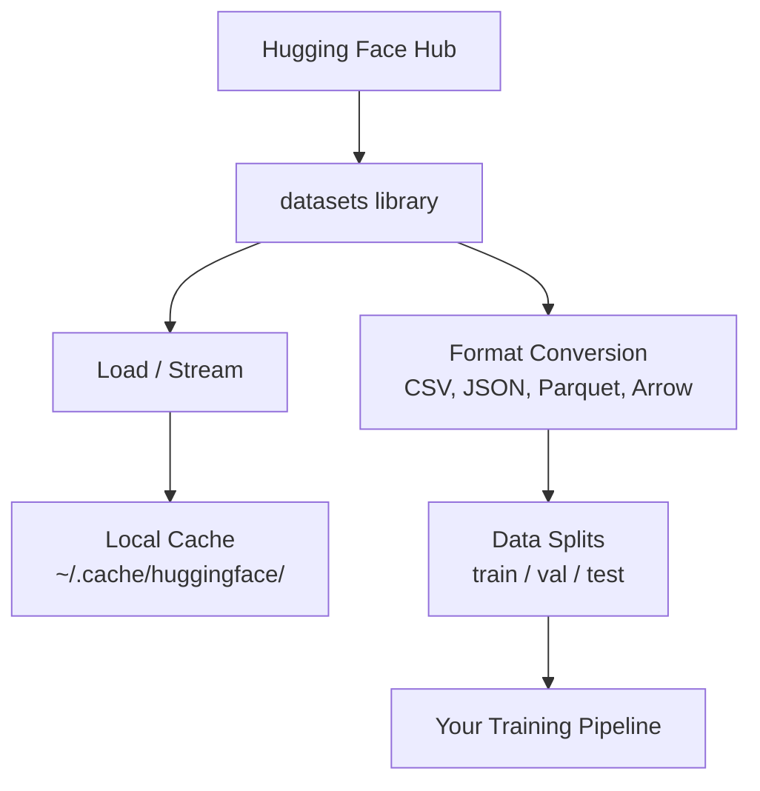

# 数据管理

> 数据是燃料。管理数据的方式决定了你能前进多快。

**Type:** 构建
**Language:** Python
**Prerequisites:** 第 0 阶段，第 01 课
**Time:** 约 45 分钟

## 学习目标

- 使用 Hugging Face `datasets` 库加载、流式读取和缓存数据集
- 在 CSV、JSON、Parquet 和 Arrow 格式之间转换，并说明各自的取舍
- 使用固定随机种子创建可复现的训练集、验证集和测试集划分
- 使用 `.gitignore`、Git LFS 或 DVC 管理大型模型与数据集文件

## 问题

每个 AI 项目都始于数据。你需要寻找并下载数据集、转换格式、划分训练集和评估集，还要对数据进行版本管理，以便复现实验。如果每次都手工完成这些工作，不仅速度慢，也很容易出错。你需要一套可重复执行的流程。

## 核心概念



Hugging Face `datasets` 库是 AI 工作中加载数据的标准方式。下载、缓存、格式转换和流式读取等能力都已内置其中。

```figure
s0-data-pipeline
```

## 动手构建

### 第 1 步：安装 datasets 库

```bash
pip install datasets huggingface_hub
```

### 第 2 步：加载数据集

```python
from datasets import load_dataset

dataset = load_dataset("stanfordnlp/imdb")
print(dataset)
print(dataset["train"][0])
```

这段代码会下载 IMDB 影评数据集。首次下载完成后，后续会从 `~/.cache/huggingface/datasets/` 中的缓存加载。

### 第 3 步：流式读取大型数据集

有些数据集大到无法全部存入磁盘。流式读取无需下载完整数据集，而是逐行加载数据。

```python
dataset = load_dataset("wikimedia/wikipedia", "20220301.en", split="train", streaming=True)

for i, example in enumerate(dataset):
    print(example["title"])
    if i >= 4:
        break
```

流式模式会返回 `IterableDataset`。数据到达一行，就处理一行，因此无论数据集多大，内存占用都能保持稳定。

### 第 4 步：数据集格式

`datasets` 库在底层使用 Apache Arrow。你可以根据流水线的需求，将数据转换为其他格式。

```python
dataset = load_dataset("stanfordnlp/imdb", split="train")

dataset.to_csv("imdb_train.csv")
dataset.to_json("imdb_train.json")
dataset.to_parquet("imdb_train.parquet")
```

格式对比：

| 格式 | 体积 | 读取速度 | 最适合的场景 |
|--------|------|-----------|----------|
| CSV | 大 | 慢 | 便于人工阅读和使用电子表格 |
| JSON | 大 | 慢 | API 和嵌套数据 |
| Parquet | 小 | 快 | 分析和列式查询 |
| Arrow | 小 | 最快 | 内存内处理（`datasets` 内部使用的格式） |

对于 AI 工作，Parquet 通常是最佳存储格式，Arrow 则适合在内存中处理。CSV 和 JSON 更适合数据交换。

### 第 5 步：划分数据集

每个机器学习项目都需要三类数据划分：

- **训练集**：模型从中学习，通常占 80%
- **验证集**：训练期间用来检查进展，通常占 10%
- **测试集**：训练完成后用于最终评估，通常占 10%

有些数据集已经预先完成划分；如果没有，就需要自己划分：

```python
dataset = load_dataset("stanfordnlp/imdb", split="train")

split = dataset.train_test_split(test_size=0.2, seed=42)
train_val = split["train"].train_test_split(test_size=0.125, seed=42)

train_ds = train_val["train"]
val_ds = train_val["test"]
test_ds = split["test"]

print(f"Train: {len(train_ds)}, Val: {len(val_ds)}, Test: {len(test_ds)}")
```

请始终设置随机种子，以保证结果可复现。同一个种子每次都会产生相同的数据划分。

### 第 6 步：下载并缓存模型

模型通常是大型文件。`huggingface_hub` 库负责下载和缓存它们。

```python
from huggingface_hub import hf_hub_download, snapshot_download

model_path = hf_hub_download(
    repo_id="sentence-transformers/all-MiniLM-L6-v2",
    filename="config.json"
)
print(f"Cached at: {model_path}")

model_dir = snapshot_download("sentence-transformers/all-MiniLM-L6-v2")
print(f"Full model at: {model_dir}")
```

模型会缓存在 `~/.cache/huggingface/hub/`。下载一次后，后续运行就能立即从本地加载。

### 第 7 步：处理大文件

模型权重和大型数据集不应该直接加入 Git。你有三种选择：

**方案 A：.gitignore（最简单）**

```
*.bin
*.safetensors
*.pt
*.onnx
data/*.parquet
data/*.csv
models/
```

**方案 B：Git LFS（在 Git 中跟踪大文件）**

```bash
git lfs install
git lfs track "*.bin"
git lfs track "*.safetensors"
git add .gitattributes
```

Git LFS 在仓库中保存指针，把实际文件存放在单独的服务器上。GitHub 免费提供 1GB 配额。

**方案 C：DVC（数据版本控制）**

```bash
pip install dvc
dvc init
dvc add data/training_set.parquet
git add data/training_set.parquet.dvc data/.gitignore
git commit -m "Track training data with DVC"
```

DVC 会创建小型 `.dvc` 文件来指向数据；数据本身存储在 S3、GCS 或其他远程存储后端。

| 方案 | 复杂度 | 最适合的场景 |
|----------|-----------|----------|
| .gitignore | 低 | 个人项目，以及可重新下载的数据 |
| Git LFS | 中 | 团队通过 Git 共享模型权重 |
| DVC | 高 | 可复现实验、大型数据集和团队协作 |

对本课程而言，`.gitignore` 已经足够。需要跨机器精确复现实验时，再使用 DVC。

### 第 8 步：存储模式

**本地存储**适合小于约 10GB 的数据集，HF 缓存会自动处理它们。

**云存储**适合更大的数据集，或需要在多台机器之间共享的数据：

```python
import os

local_path = os.path.expanduser("~/.cache/huggingface/datasets/")

# s3_path = "s3://my-bucket/datasets/"
# gcs_path = "gs://my-bucket/datasets/"
```

DVC 可以直接与 S3 和 GCS 集成：

```bash
dvc remote add -d myremote s3://my-bucket/dvc-store
dvc push
```

本课程使用本地存储即可。当你在远程 GPU 实例上进行微调时，云存储才会变得重要。

## 本课程使用的数据集

| 数据集 | 涉及课程 | 大小 | 学习内容 |
|---------|---------|------|----------------|
| IMDB | 分词、分类 | 84 MB | 文本分类基础 |
| WikiText | 语言建模 | 181 MB | 下一个 token 预测 |
| SQuAD | 问答系统 | 35 MB | 问答与文本跨度 |
| Common Crawl（子集） | 嵌入 | 不定 | 大规模文本处理 |
| MNIST | 视觉基础 | 21 MB | 图像分类基础 |
| COCO（子集） | 多模态 | 不定 | 图文配对 |

现在无需下载所有这些数据集，每节课都会说明自己的具体需求。

## 实际使用

运行工具脚本，验证一切是否正常：

```bash
python code/data_utils.py
```

该脚本会下载一个小型数据集、转换格式、完成划分并输出摘要。

## 交付成果

本课会产出：
- `code/data_utils.py`——可复用的数据加载与缓存工具
- `outputs/prompt-data-helper.md`——帮助你为任务寻找合适数据集的提示词

## 练习

1. 加载 `glue` 数据集的 `mrpc` 配置，并检查前 5 条样本
2. 流式读取 `c4` 数据集，统计 10 秒内能够处理多少条样本
3. 将一个数据集转换为 Parquet，并比较它与 CSV 的文件大小
4. 使用固定随机种子创建 70/15/15 的训练集、验证集和测试集划分，并验证各部分大小

## 关键术语

| 术语 | 人们常说 | 准确含义 |
|------|----------------|----------------------|
| Dataset split | “训练数据” | 在机器学习生命周期的不同阶段使用的命名子集（train/val/test） |
| Streaming | “惰性加载” | 不下载整个数据集，而是从远程来源逐行处理数据 |
| Parquet | “压缩版 CSV” | 针对分析查询和存储效率优化的列式文件格式 |
| Arrow | “高速 dataframe” | datasets 库内部使用的内存列式格式，支持零复制读取 |
| Git LFS | “面向大文件的 Git” | 将大文件存储在 Git 仓库之外、同时在版本控制中保留指针的扩展 |
| DVC | “面向数据的 Git” | 与云存储集成、用于数据集和模型的版本控制系统 |
| Cache | “已经下载过” | 已获取数据的本地副本，默认存储在 ~/.cache/huggingface/ |
