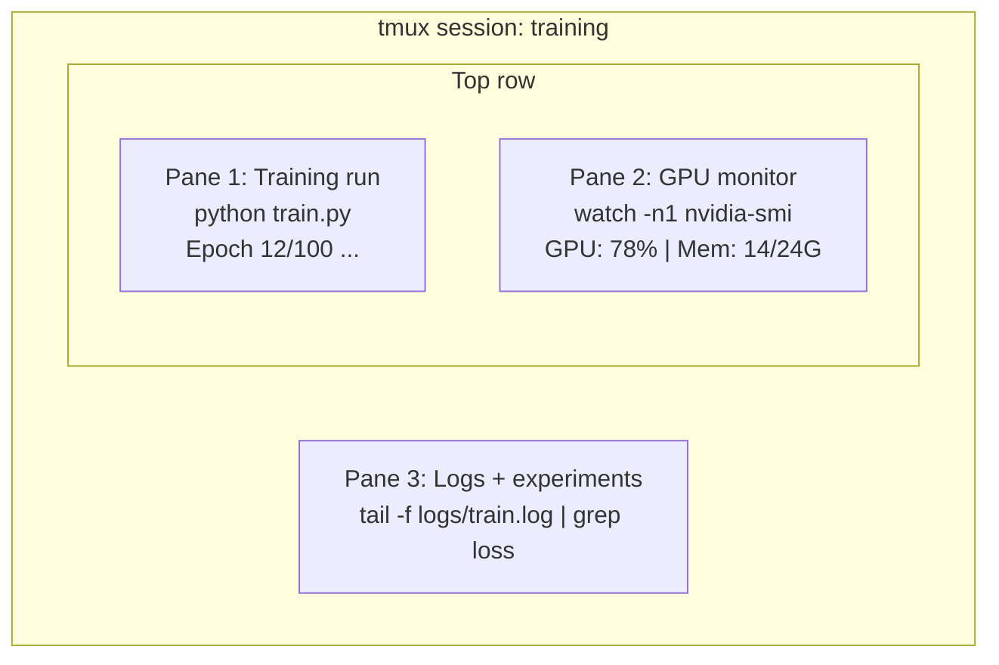

# 终端与 Shell

> 终端是 AI 工程师工作的主场。请熟练掌握它。

**Type:** 学习
**Languages:** --
**Prerequisites:** 第 0 阶段，第 01 课
**Time:** 约 35 分钟

## 学习目标

- 在命令行中使用管道、重定向和 `grep` 筛选及处理训练日志
- 创建包含多个窗格的持久 tmux 会话，同时进行训练与 GPU 监控
- 使用 `htop`、`nvtop` 和 `nvidia-smi` 监控系统及 GPU 资源
- 使用 SSH、`scp` 和 `rsync` 在本地与远程机器之间传输文件

## 问题

你在终端中花费的时间会超过任何编辑器：运行训练、监控 GPU、跟踪日志、保持远程 SSH 会话以及管理环境。每一种 AI 工作流都会接触 shell。如果终端操作很慢，所有工作都会慢下来。

本课只介绍 AI 工作真正需要的终端技能，不讲 Unix 历史，也不深入研究 Bash 脚本。

## 核心概念



三个任务同时运行，却只占用一个终端。你可以断开会话、回家、重新通过 SSH 登录并接回会话，训练任务会一直运行。

```figure
s0-shell-pipeline
```

## 动手构建

### 第 1 步：了解自己的 shell

检查当前正在使用哪个 shell：

```bash
echo $SHELL
```

大多数系统使用 `bash` 或 `zsh`，二者都可以。本课程中的命令在这两种 shell 中均可运行。

需要掌握的关键操作：

```bash
# Move around
cd ~/projects/ai-engineering-from-scratch
pwd
ls -la

# History search (most useful shortcut you'll learn)
# Ctrl+R then type part of a previous command
# Press Ctrl+R again to cycle through matches

# Clear terminal
clear   # or Ctrl+L

# Cancel a running command
# Ctrl+C

# Suspend a running command (resume with fg)
# Ctrl+Z
```

### 第 2 步：管道与重定向

管道把多个命令连接起来。处理日志、筛选输出和串联工具时都会使用它，你会频繁用到这一能力。

```bash
# Count how many times "loss" appears in a log
cat train.log | grep "loss" | wc -l

# Extract just the loss values from training output
grep "loss:" train.log | awk '{print $NF}' > losses.txt

# Watch a log file update in real time, filtering for errors
tail -f train.log | grep --line-buffered "ERROR"

# Sort experiments by final accuracy
grep "final_accuracy" results/*.log | sort -t= -k2 -n -r

# Redirect stdout and stderr to separate files
python train.py > output.log 2> errors.log

# Redirect both to the same file
python train.py > train_full.log 2>&1
```

你需要掌握以下重定向符号：

| 符号 | 作用 |
|--------|-------------|
| `>` | 将标准输出写入文件，并覆盖原内容 |
| `>>` | 将标准输出追加到文件 |
| `2>` | 将标准错误写入文件 |
| `2>&1` | 将标准错误发送到与标准输出相同的位置 |
| `\|` | 把一个命令的标准输出作为下一个命令的标准输入 |

### 第 3 步：后台进程

训练任务往往需要数小时。你不会希望在此期间一直保持终端窗口开启。

```bash
# Run in background (output still goes to terminal)
python train.py &

# Run in background, immune to hangup (closing terminal won't kill it)
nohup python train.py > train.log 2>&1 &

# Check what's running in background
jobs
ps aux | grep train.py

# Bring a background job to foreground
fg %1

# Kill a background process
kill %1
# or find its PID and kill that
kill $(pgrep -f "train.py")
```

`&`、`nohup` 和 `screen`/`tmux` 的区别：

| 方式 | 关闭终端后继续运行？ | 能否重新接入？ |
|--------|-------------------------|---------------|
| `command &` | 否 | 否 |
| `nohup command &` | 是 | 否（只能查看日志文件） |
| `screen` / `tmux` | 是 | 是 |

凡是运行时间超过几分钟的任务，都建议使用 tmux。

### 第 4 步：tmux

tmux 可以创建包含多个窗格的持久终端会话，是管理训练任务最实用的工具之一。

```bash
# Install
# macOS
brew install tmux
# Ubuntu
sudo apt install tmux

# Start a named session
tmux new -s training

# Split horizontally
# Ctrl+B then "

# Split vertically
# Ctrl+B then %

# Navigate between panes
# Ctrl+B then arrow keys

# Detach (session keeps running)
# Ctrl+B then d

# Reattach
tmux attach -t training

# List sessions
tmux ls

# Kill a session
tmux kill-session -t training
```

一个典型的 AI 工作会话如下：

```bash
tmux new -s train

# Pane 1: start training
python train.py --epochs 100 --lr 1e-4

# Ctrl+B, " to split, then run GPU monitor
watch -n1 nvidia-smi

# Ctrl+B, % to split vertically, tail the logs
tail -f logs/experiment.log

# Now detach with Ctrl+B, d
# SSH out, go get coffee, come back
# tmux attach -t train
```

### 第 5 步：使用 htop 和 nvtop 监控资源

```bash
# System processes (better than top)
htop

# GPU processes (if you have NVIDIA GPU)
# Install: sudo apt install nvtop (Ubuntu) or brew install nvtop (macOS)
nvtop

# Quick GPU check without nvtop
nvidia-smi

# Watch GPU usage update every second
watch -n1 nvidia-smi

# See which processes are using the GPU
nvidia-smi --query-compute-apps=pid,name,used_memory --format=csv
```

常用的 `htop` 快捷键：
- 按 `F6` 或 `>` 按列排序（按内存排序可帮助发现内存泄漏）
- 按 `F5` 切换树状视图（查看子进程）
- 按 `F9` 终止进程
- 按 `/` 搜索进程名

### 第 6 步：通过 SSH 连接远程 GPU 机器

租用 Lambda、RunPod 或 Vast.ai 等云端 GPU 后，你需要通过 SSH 连接。

```bash
# Basic connection
ssh user@gpu-box-ip

# With a specific key
ssh -i ~/.ssh/my_gpu_key user@gpu-box-ip

# Copy files to remote
scp model.pt user@gpu-box-ip:~/models/

# Copy files from remote
scp user@gpu-box-ip:~/results/metrics.json ./

# Sync a whole directory (faster for many files)
rsync -avz ./data/ user@gpu-box-ip:~/data/

# Port forward (access remote Jupyter/TensorBoard locally)
ssh -L 8888:localhost:8888 user@gpu-box-ip
# Now open localhost:8888 in your browser

# SSH config for convenience
# Add to ~/.ssh/config:
# Host gpu
#     HostName 192.168.1.100
#     User ubuntu
#     IdentityFile ~/.ssh/gpu_key
#
# Then just:
# ssh gpu
```

### 第 7 步：适合 AI 工作的实用别名

将这些别名加入 `~/.bashrc` 或 `~/.zshrc`：

```bash
source phases/00-setup-and-tooling/10-terminal-and-shell/code/shell_aliases.sh
```

也可以只复制自己需要的部分。关键别名包括：

```bash
# GPU status at a glance
alias gpu='nvidia-smi --query-gpu=index,name,utilization.gpu,memory.used,memory.total,temperature.gpu --format=csv,noheader'

# Kill all Python training processes
alias killtraining='pkill -f "python.*train"'

# Quick virtual environment activate
alias ae='source .venv/bin/activate'

# Watch training loss
alias watchloss='tail -f logs/*.log | grep --line-buffered "loss"'
```

完整列表请查看 `code/shell_aliases.sh`。

### 第 8 步：常见 AI 终端操作模式

以下操作会在实际工作中反复出现：

```bash
# Run training, log everything, notify when done
python train.py 2>&1 | tee train.log; echo "DONE" | mail -s "Training complete" you@email.com

# Compare two experiment logs side by side
diff <(grep "accuracy" exp1.log) <(grep "accuracy" exp2.log)

# Find the largest model files (clean up disk space)
find . -name "*.pt" -o -name "*.safetensors" | xargs du -h | sort -rh | head -20

# Download a model from Hugging Face
wget https://huggingface.co/model/resolve/main/model.safetensors

# Untar a dataset
tar xzf dataset.tar.gz -C ./data/

# Count lines in all Python files (see how big your project is)
find . -name "*.py" | xargs wc -l | tail -1

# Check disk space (training data fills disks fast)
df -h
du -sh ./data/*

# Environment variable check before training
env | grep -i cuda
env | grep -i torch
```

## 实际使用

这些工具会在课程中的以下场景发挥作用：

| 工具 | 使用场景 |
|------|----------------|
| tmux | 每次训练任务（第 3 阶段及以后） |
| `tail -f` + `grep` | 监控训练日志 |
| `nohup` / `&` | 快速后台任务 |
| `htop` / `nvtop` | 调试训练缓慢和 OOM 错误 |
| SSH + `rsync` | 在云端 GPU 上工作 |
| 管道 + 重定向 | 处理实验结果 |
| 别名 | 节省重复输入命令的时间 |

## 练习

1. 安装 tmux，创建一个包含三个窗格的会话：分别运行 `htop`、`watch -n1 date` 和一个 Python 脚本；然后断开并重新接入会话。
2. 将 `code/shell_aliases.sh` 中的别名加入 shell 配置，并用 `source ~/.zshrc`（或 `~/.bashrc`）重新加载。
3. 使用 `for i in $(seq 1 100); do echo "epoch $i loss: $(echo "scale=4; 1/$i" | bc)"; sleep 0.1; done > fake_train.log` 创建一份模拟训练日志，再用 `grep`、`tail` 和 `awk` 只提取损失值。
4. 为你可以访问的服务器添加 SSH 配置项（也可以使用 `localhost` 练习语法）。

## 关键术语

| 术语 | 人们常说 | 准确含义 |
|------|----------------|----------------------|
| Shell | “终端” | 解释命令的程序，例如 bash、zsh 或 fish |
| tmux | “终端复用器” | 在一个窗口中运行多个终端会话，并支持断开和重新接入的程序 |
| Pipe | “那根竖线” | `\|` 运算符，把一个命令的输出作为另一个命令的输入 |
| PID | “进程 ID” | 分配给每个运行中进程的唯一编号，用于监控或终止该进程 |
| nohup | “不挂断” | 让命令不受挂断信号影响，因此关闭终端也不会终止它 |
| SSH | “连接服务器” | Secure Shell，一种用于在远程机器上运行命令的加密协议 |
