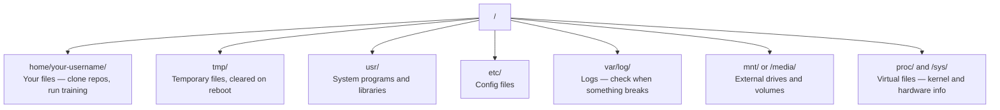

# 面向 AI 的 Linux

> 大多数 AI 工作负载都运行在 Linux 上。你至少要掌握足够的知识，确保自己不会被卡住。

**Type:** 学习
**Languages:** --
**Prerequisites:** 第 0 阶段，第 01 课
**Time:** 约 30 分钟

## 学习目标

- 在命令行中浏览 Linux 文件系统并完成必要的文件操作
- 使用 `chmod` 和 `chown` 管理文件权限，解决“Permission denied”错误
- 使用 `apt` 安装系统软件包，并为 AI 工作配置一台全新的 GPU 机器
- 识别从 macOS 转到 Linux 时，经常困扰远程开发者的差异

## 问题

你可能在 macOS 或 Windows 上开发，但只要通过 SSH 登录云端 GPU 机器、租用 Lambda 实例或启动 EC2 主机，迎面而来的通常就是 Ubuntu。终端是唯一界面，没有 Finder、资源管理器或 GUI。如果无法在命令行中浏览文件系统、安装软件包和管理进程，你就只能一边为空闲的 GPU 小时付费，一边搜索“Linux 怎么解压文件”。

这是一份生存指南，只介绍在远程 Linux 机器上开展 AI 工作所需的内容，不多也不少。

## 文件系统布局

Linux 把所有内容都组织在一个根目录 `/` 下，没有 `C:\` 或 `/Volumes`。你真正会接触的目录如下：



你的主目录是 `~` 或 `/home/your-username`。几乎所有日常操作都在这里完成。

## 必备命令

下面 15 个命令足以覆盖你在远程 GPU 机器上 95% 的操作。

### 浏览目录

```bash
pwd                         # Where am I?
ls                          # What's here?
ls -la                      # What's here, including hidden files with details?
cd /path/to/dir             # Go there
cd ~                        # Go home
cd ..                       # Go up one level
```

### 文件与目录

```bash
mkdir my-project            # Create a directory
mkdir -p a/b/c              # Create nested directories in one shot

cp file.txt backup.txt      # Copy a file
cp -r src/ src-backup/      # Copy a directory (recursive)

mv old.txt new.txt          # Rename a file
mv file.txt /tmp/           # Move a file

rm file.txt                 # Delete a file (no trash, it's gone)
rm -rf my-dir/              # Delete a directory and everything inside
```

`rm -rf` 会永久删除内容，无法撤销。按下回车前务必再次检查路径。

### 读取文件

```bash
cat file.txt                # Print entire file
head -20 file.txt           # First 20 lines
tail -20 file.txt           # Last 20 lines
tail -f log.txt             # Follow a log file in real time (Ctrl+C to stop)
less file.txt               # Scroll through a file (q to quit)
```

### 搜索

```bash
grep "error" training.log           # Find lines containing "error"
grep -r "learning_rate" .           # Search all files in current directory
grep -i "cuda" config.yaml          # Case-insensitive search

find . -name "*.py"                 # Find all Python files under current dir
find . -name "*.ckpt" -size +1G     # Find checkpoint files larger than 1GB
```

## 权限

Linux 中的每个文件都有所有者和权限位。当脚本无法执行，或者你不能向某个目录写入时，就会遇到权限问题。

```bash
ls -l train.py
# -rwxr-xr-- 1 user group 2048 Mar 19 10:00 train.py
#  ^^^             owner permissions: read, write, execute
#     ^^^          group permissions: read, execute
#        ^^        everyone else: read only
```

常用修复命令：

```bash
chmod +x train.sh           # Make a script executable
chmod 755 deploy.sh         # Owner: full, others: read+execute
chmod 644 config.yaml       # Owner: read+write, others: read only

chown user:group file.txt   # Change who owns a file (needs sudo)
```

遇到 “Permission denied” 时，通常是权限设置有问题。多数情况下，`chmod +x` 或 `sudo` 可以解决，但使用前应先确认真正需要的权限范围。

## 软件包管理（apt）

Ubuntu 使用 `apt` 安装和管理系统级软件。

```bash
sudo apt update             # Refresh the package list (always do this first)
sudo apt install -y htop    # Install a package (-y skips confirmation)
sudo apt install -y build-essential  # C compiler, make, etc. Needed by many Python packages
sudo apt install -y tmux    # Terminal multiplexer (keep sessions alive after disconnect)

apt list --installed        # What's installed?
sudo apt remove htop        # Uninstall
```

在全新的 GPU 机器上，通常需要安装以下软件包：

```bash
sudo apt update && sudo apt install -y \
    build-essential \
    git \
    curl \
    wget \
    tmux \
    htop \
    unzip \
    python3-venv
```

## 用户与 sudo

通常情况下，你会以普通用户身份登录；部分操作需要 root（管理员）权限。

```bash
whoami                      # What user am I?
sudo command                # Run a single command as root
sudo su                     # Become root (exit to go back, use sparingly)
```

在云端 GPU 实例上，你通常是唯一用户，并且已经拥有 sudo 权限。不要让所有命令都以 root 身份运行，只在确有需要时使用 sudo。

## 进程与 systemd

当训练任务卡住，或者需要查看当前运行内容时：

```bash
htop                        # Interactive process viewer (q to quit)
ps aux | grep python        # Find running Python processes
kill 12345                  # Gracefully stop process with PID 12345
kill -9 12345               # Force kill (use when graceful doesn't work)
nvidia-smi                  # GPU processes and memory usage
```

systemd 用于管理服务（后台守护进程）。运行推理服务器时，你会使用它：

```bash
sudo systemctl start nginx          # Start a service
sudo systemctl stop nginx           # Stop it
sudo systemctl restart nginx        # Restart it
sudo systemctl status nginx         # Check if it's running
sudo systemctl enable nginx         # Start automatically on boot
```

## 磁盘空间

GPU 机器的磁盘空间通常有限，模型和数据集会很快将其占满。

```bash
df -h                       # Disk usage for all mounted drives
df -h /home                 # Disk usage for /home specifically

du -sh *                    # Size of each item in current directory
du -sh ~/.cache             # Size of your cache (pip, huggingface models land here)
du -sh /data/checkpoints/   # Check how big your checkpoints are

# Find the biggest space hogs
du -h --max-depth=1 / 2>/dev/null | sort -hr | head -20
```

常见的空间清理方法：

```bash
# Clear pip cache
pip cache purge

# Clear apt cache
sudo apt clean

# Remove old checkpoints you don't need
rm -rf checkpoints/epoch_01/ checkpoints/epoch_02/
```

## 网络操作

你会在命令行中下载模型、传输文件和调用 API。

```bash
# Download files
wget https://example.com/model.bin                   # Download a file
curl -O https://example.com/data.tar.gz              # Same thing with curl
curl -s https://api.example.com/health | python3 -m json.tool  # Hit an API, pretty-print JSON

# Transfer files between machines
scp model.bin user@remote:/data/                     # Copy file to remote machine
scp user@remote:/data/results.csv .                  # Copy file from remote to local
scp -r user@remote:/data/checkpoints/ ./local-dir/   # Copy directory

# Sync directories (faster than scp for large transfers, resumes on failure)
rsync -avz --progress ./data/ user@remote:/data/
rsync -avz --progress user@remote:/results/ ./results/
```

传输大文件时应优先使用 `rsync`，而不是 `scp`。它只传输发生变化的字节，并且能在连接中断后继续。

## tmux：让会话持续运行

通过 SSH 登录远程机器时，如果直接合上笔记本电脑，训练任务也会终止。tmux 可以避免这个问题。

```bash
tmux new -s train           # Start a new session named "train"
# ... start your training, then:
# Ctrl+B, then D            # Detach (training keeps running)

tmux ls                     # List sessions
tmux attach -t train        # Reattach to session

# Inside tmux:
# Ctrl+B, then %            # Split pane vertically
# Ctrl+B, then "            # Split pane horizontally
# Ctrl+B, then arrow keys   # Switch between panes
```

长时间训练任务一定要放在 tmux 中运行，每次都应如此。

## Windows 用户使用 WSL2

如果你使用 Windows，WSL2 无需双系统就能提供真正的 Linux 环境。

```bash
# In PowerShell (admin)
wsl --install -d Ubuntu-24.04

# After restart, open Ubuntu from Start menu
sudo apt update && sudo apt upgrade -y
```

WSL2 运行真正的 Linux 内核，因此本课中的所有内容都适用。在 WSL 内部，可以通过 `/mnt/c/Users/YourName/` 访问 Windows 文件。

安装 Windows 端的 NVIDIA 驱动后，即可使用 GPU 透传。请安装 Windows NVIDIA 驱动，而不是 Linux 版驱动；之后 CUDA 会在 WSL2 内可用。

## 从 macOS 切换到 Linux 时的常见陷阱

以下差异经常让 macOS 用户踩坑：

| macOS | Linux | 说明 |
|-------|-------|-------|
| `brew install` | `sudo apt install` | 软件包名称有时不同。`brew install htop` 与 `sudo apt install htop` 效果相同，但 `brew install readline` 与 `sudo apt install libreadline-dev` 并不相同。 |
| `open file.txt` | `xdg-open file.txt` | 远程机器通常没有 GUI，应使用 `cat` 或 `less`。 |
| `pbcopy` / `pbpaste` | 不可用 | 通过 SSH 时不存在与本地剪贴板之间的管道。 |
| `~/.zshrc` | `~/.bashrc` | macOS 默认使用 zsh，大多数 Linux 服务器使用 bash。 |
| `/opt/homebrew/` | `/usr/bin/`、`/usr/local/bin/` | 二进制文件所在位置不同。 |
| `sed -i '' 's/a/b/' file` | `sed -i 's/a/b/' file` | macOS 的 sed 要求在 `-i` 后提供空字符串，Linux 则不需要。 |
| 不区分大小写的文件系统 | 区分大小写的文件系统 | 在 Linux 中，`Model.py` 与 `model.py` 是两个不同的文件。 |
| 换行符 `\n` | 换行符 `\n` | 二者相同，但 Windows 使用 `\r\n`，会破坏 Bash 脚本；可运行 `dos2unix` 修复。 |

## 快速参考卡

```
Navigation:     pwd, ls, cd, find
Files:          cp, mv, rm, mkdir, cat, head, tail, less
Search:         grep, find
Permissions:    chmod, chown, sudo
Packages:       apt update, apt install
Processes:      htop, ps, kill, nvidia-smi
Services:       systemctl start/stop/restart/status
Disk:           df -h, du -sh
Network:        curl, wget, scp, rsync
Sessions:       tmux new/attach/detach
```

```figure
s0-process-fork
```

## 练习

1. 通过 SSH 登录任意 Linux 机器（或打开 WSL2），进入主目录。创建一个项目目录，在其中用 `touch` 创建三个空文件，然后使用 `ls -la` 列出它们。
2. 使用 apt 安装 `htop`，运行它，并找出占用内存最多的进程。
3. 启动一个 tmux 会话，在其中运行 `sleep 300`，然后断开、列出会话并重新接入。
4. 使用 `df -h` 查看可用磁盘空间，再使用 `du -sh ~/.cache/*` 找出缓存中最占空间的内容。
5. 使用 `scp` 将一个文件从本地机器传到远程机器，再使用 `rsync` 完成同样的传输，并比较两者的体验。
