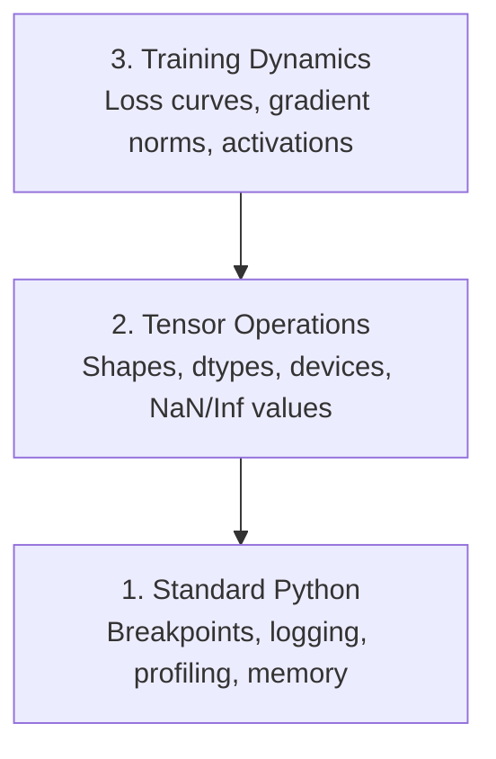

# 调试与性能分析

> 最糟糕的 AI 缺陷不会让程序崩溃，而是悄无声息地用垃圾数据训练，最后给你一条漂亮的损失曲线。

**Type:** 构建
**Language:** Python
**Prerequisites:** 第 1 课（Dev Environment），以及对 PyTorch 的基本了解
**Time:** 约 1 小时

## 学习目标

- 使用条件式 `breakpoint()` 和 `debug_print`，在训练过程中检查张量形状、数据类型和 NaN 值
- 使用 `cProfile`、`line_profiler` 和 `tracemalloc` 分析训练循环，找出性能瓶颈
- 检测常见 AI 缺陷：形状不匹配、NaN 损失、数据泄漏和设备错误的张量
- 配置 TensorBoard，将损失曲线、权重直方图和梯度分布可视化

## 问题

AI 代码的失败方式与普通代码不同。Web 应用崩溃时会留下堆栈跟踪；配置错误的训练循环却可能运行 8 小时、消耗 $200 的 GPU 费用，最后得到一个对所有输入都只预测均值的模型。代码从未报错，真正的问题可能只是某个张量位于错误设备、忘记调用 `.detach()`，或标签泄漏到了特征中。

你需要一套调试工具，在这些静默故障浪费时间和算力之前将它们找出来。

## 核心概念

AI 调试分为三个层级：



大多数人会直接跳到第 3 层（盯着 TensorBoard 看），但 80% 的 AI 缺陷其实位于第 1 层和第 2 层。

```figure
s0-flame-hot
```

## 动手构建

### 第 1 部分：打印调试（没错，它确实有效）

打印调试经常被轻视，其实不应该如此。对于张量代码，有针对性的打印语句往往比单步调试更有效，因为你需要同时看到形状、数据类型和取值范围。

```python
def debug_print(name, tensor):
    print(f"{name}: shape={tensor.shape}, dtype={tensor.dtype}, "
          f"device={tensor.device}, "
          f"min={tensor.min().item():.4f}, max={tensor.max().item():.4f}, "
          f"mean={tensor.mean().item():.4f}, "
          f"has_nan={tensor.isnan().any().item()}")
```

在每个可疑操作后调用它，找到问题后再删除这些打印语句。就是这么简单。

### 第 2 部分：Python 调试器（pdb 与 breakpoint）

内置调试器在 AI 工作中的价值经常被低估。在训练循环中加入 `breakpoint()`，即可交互式检查张量。

```python
def training_step(model, batch, criterion, optimizer):
    inputs, labels = batch
    outputs = model(inputs)
    loss = criterion(outputs, labels)

    if loss.item() > 100 or torch.isnan(loss):
        breakpoint()

    loss.backward()
    optimizer.step()
```

进入调试器后，以下命令很实用：

- 用 `p outputs.shape` 检查形状
- 用 `p loss.item()` 查看损失值
- 用 `p torch.isnan(outputs).sum()` 统计 NaN 数量
- 用 `p model.fc1.weight.grad` 检查梯度
- 用 `c` 继续执行，用 `q` 退出

这就是条件式调试：只有出现异常时程序才会停下。对于包含 10,000 个训练步骤的任务，这一点非常重要。

### 第 3 部分：Python 日志

当调试不再只是快速检查时，应使用日志替代打印语句。

```python
import logging

logging.basicConfig(
    level=logging.INFO,
    format="%(asctime)s [%(levelname)s] %(message)s",
    handlers=[
        logging.FileHandler("training.log"),
        logging.StreamHandler()
    ]
)
logger = logging.getLogger(__name__)

logger.info("Starting training: lr=%.4f, batch_size=%d", lr, batch_size)
logger.warning("Loss spike detected: %.4f at step %d", loss.item(), step)
logger.error("NaN loss at step %d, stopping", step)
```

日志能提供时间戳、严重级别和文件输出。训练任务凌晨 3 点失败时，你需要的是日志文件，而不是已经滚出终端可视区域的输出。

### 第 4 部分：测量代码区段耗时

知道时间花在哪里，是优化的第一步。

```python
import time

class Timer:
    def __init__(self, name=""):
        self.name = name

    def __enter__(self):
        self.start = time.perf_counter()
        return self

    def __exit__(self, *args):
        elapsed = time.perf_counter() - self.start
        print(f"[{self.name}] {elapsed:.4f}s")

with Timer("data loading"):
    batch = next(dataloader_iter)

with Timer("forward pass"):
    outputs = model(batch)

with Timer("backward pass"):
    loss.backward()
```

一个常见发现是：数据加载占据了 60% 的训练时间。此时正确的优化不是换一块更快的 GPU，而是在 DataLoader 中设置 `num_workers > 0`。

### 第 5 部分：cProfile 与 line_profiler

当手动计时已经不够时，可以使用：

```bash
python -m cProfile -s cumtime train.py
```

它会列出所有函数调用，并按累计耗时排序。如需逐行分析：

```bash
pip install line_profiler
```

```python
@profile
def train_step(model, data, target):
    output = model(data)
    loss = F.cross_entropy(output, target)
    loss.backward()
    return loss

# Run with: kernprof -l -v train.py
```

### 第 6 部分：内存分析

#### 使用 tracemalloc 分析 CPU 内存

```python
import tracemalloc

tracemalloc.start()

# your code here
model = build_model()
data = load_dataset()

snapshot = tracemalloc.take_snapshot()
top_stats = snapshot.statistics("lineno")
for stat in top_stats[:10]:
    print(stat)
```

#### 使用 memory_profiler 分析 CPU 内存

```bash
pip install memory_profiler
```

```python
from memory_profiler import profile

@profile
def load_data():
    raw = read_csv("data.csv")       # watch memory jump here
    processed = preprocess(raw)       # and here
    return processed
```

运行 `python -m memory_profiler your_script.py`，即可查看逐行内存用量。

#### 使用 PyTorch 分析 GPU 内存

```python
import torch

if torch.cuda.is_available():
    print(torch.cuda.memory_summary())

    print(f"Allocated: {torch.cuda.memory_allocated() / 1e9:.2f} GB")
    print(f"Cached: {torch.cuda.memory_reserved() / 1e9:.2f} GB")
```

遇到 OOM（内存不足）时：

1. 减小 batch size（永远先尝试这一项）
2. 使用 `torch.cuda.empty_cache()` 释放缓存内存
3. 对大型中间张量执行 `del tensor`，然后调用 `torch.cuda.empty_cache()`
4. 使用混合精度（`torch.cuda.amp`）将内存用量减半
5. 对非常深的模型使用梯度检查点

### 第 7 部分：常见 AI 缺陷及检测方式

#### 形状不匹配

这是最常见的缺陷。某个张量的形状是 `[batch, features]`，而模型预期的却是 `[batch, channels, height, width]`。

```python
def check_shapes(model, sample_input):
    print(f"Input: {sample_input.shape}")
    hooks = []

    def make_hook(name):
        def hook(module, inp, out):
            in_shape = inp[0].shape if isinstance(inp, tuple) else inp.shape
            out_shape = out.shape if hasattr(out, "shape") else type(out)
            print(f"  {name}: {in_shape} -> {out_shape}")
        return hook

    for name, module in model.named_modules():
        hooks.append(module.register_forward_hook(make_hook(name)))

    with torch.no_grad():
        model(sample_input)

    for h in hooks:
        h.remove()
```

使用一批样本运行一次该函数，它会列出模型中的每一次形状变换。

#### NaN 损失

损失变成 NaN，意味着某处数值已经爆炸。常见原因包括：

- 学习率过高
- 自定义损失函数中出现除零
- 对零或负数取对数
- RNN 中出现梯度爆炸

```python
def detect_nan(model, loss, step):
    if torch.isnan(loss):
        print(f"NaN loss at step {step}")
        for name, param in model.named_parameters():
            if param.grad is not None:
                if torch.isnan(param.grad).any():
                    print(f"  NaN gradient in {name}")
                if torch.isinf(param.grad).any():
                    print(f"  Inf gradient in {name}")
        return True
    return False
```

#### 数据泄漏

模型在测试集上的准确率达到 99%，听起来很棒，但这很可能是一个缺陷。

```python
def check_data_leakage(train_set, test_set, id_column="id"):
    train_ids = set(train_set[id_column].tolist())
    test_ids = set(test_set[id_column].tolist())
    overlap = train_ids & test_ids
    if overlap:
        print(f"DATA LEAKAGE: {len(overlap)} samples in both train and test")
        return True
    return False
```

还要检查时间泄漏，即使用未来数据预测过去。划分数据前应先按时间戳排序。

#### 设备错误

位于不同设备（CPU 与 GPU）的张量会造成运行时错误。有时某个张量会悄悄留在 CPU 上，其他内容则都在 GPU 上，结果训练没有报错，却变得非常缓慢。

```python
def check_devices(model, *tensors):
    model_device = next(model.parameters()).device
    print(f"Model device: {model_device}")
    for i, t in enumerate(tensors):
        if t.device != model_device:
            print(f"  WARNING: tensor {i} on {t.device}, model on {model_device}")
```

### 第 8 部分：TensorBoard 基础

TensorBoard 可以展示训练过程中随时间变化的内部状态。

```bash
pip install tensorboard
```

```python
from torch.utils.tensorboard import SummaryWriter

writer = SummaryWriter("runs/experiment_1")

for step in range(num_steps):
    loss = train_step(model, batch)

    writer.add_scalar("loss/train", loss.item(), step)
    writer.add_scalar("lr", optimizer.param_groups[0]["lr"], step)

    if step % 100 == 0:
        for name, param in model.named_parameters():
            writer.add_histogram(f"weights/{name}", param, step)
            if param.grad is not None:
                writer.add_histogram(f"grads/{name}", param.grad, step)

writer.close()
```

启动 TensorBoard：

```bash
tensorboard --logdir=runs
```

需要观察的现象：

- **损失不下降**：学习率过低，或模型架构存在问题
- **损失剧烈振荡**：学习率过高
- **损失变为 NaN**：数值不稳定（参见前面的 NaN 小节）
- **训练损失下降、验证损失上升**：过拟合
- **权重直方图坍缩到零**：梯度消失
- **梯度直方图爆炸**：需要进行梯度裁剪

### 第 9 部分：VS Code 调试器

如需交互式调试，请使用 `launch.json` 配置 VS Code：

```json
{
    "version": "0.2.0",
    "configurations": [
        {
            "name": "Debug Training",
            "type": "debugpy",
            "request": "launch",
            "program": "${file}",
            "console": "integratedTerminal",
            "justMyCode": false
        }
    ]
}
```

点击编辑器边栏即可设置断点。在 Variables 面板中可以检查张量属性；Debug Console 则允许你在执行过程中运行任意 Python 表达式。

这一方式非常适合逐步调试数据预处理流水线，因为你往往需要查看每一步变换的结果。

## 实际使用

下面这套调试流程能够捕获大多数 AI 缺陷：

1. **训练前**：使用一批样本运行 `check_shapes`，确认输入和输出维度符合预期。
2. **前 10 步**：使用 `debug_print` 检查损失、输出和梯度，确认没有 NaN，且数值范围合理。
3. **训练期间**：记录损失、学习率和梯度范数，并用 TensorBoard 可视化。
4. **发生故障时**：在故障点加入 `breakpoint()`，交互式检查张量。
5. **分析性能时**：分别测量数据加载、前向传播和反向传播耗时；接近 OOM 时再分析内存。

## 交付成果

运行调试工具脚本：

```bash
python phases/00-setup-and-tooling/12-debugging-and-profiling/code/debug_tools.py
```

`outputs/prompt-debug-ai-code.md` 提供了一份用于诊断 AI 特有缺陷的提示词。

## 练习

1. 运行 `debug_tools.py` 并阅读各部分输出。修改示例模型以引入 NaN（提示：在前向传播中除以零），观察检测器如何捕获它。
2. 使用 `cProfile` 分析一个训练循环，找出最慢的函数。
3. 使用 `tracemalloc` 找出数据加载流水线中分配内存最多的代码行。
4. 为一个简单训练任务配置 TensorBoard，并判断模型是否过拟合。
5. 在训练循环中使用 `breakpoint()`，练习从调试器提示符检查张量形状、设备和梯度值。
