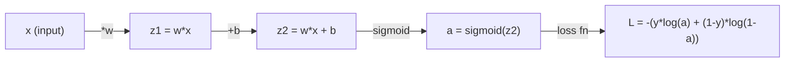
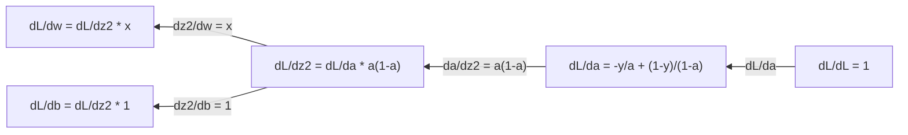
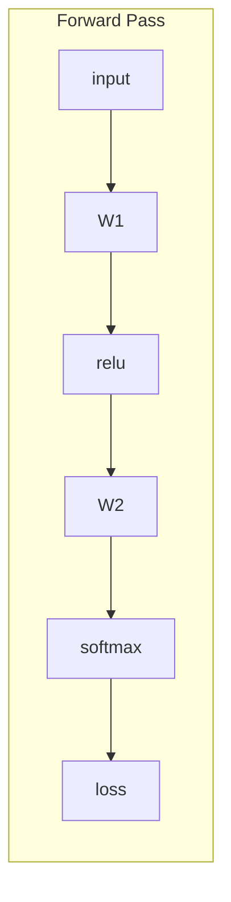
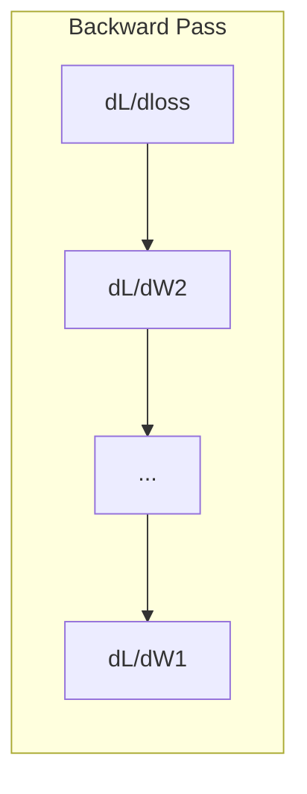

# 机器学习微积分

> 导数告诉你下坡的方向。神经网络学习所需的，不过如此。

**Type:** 学习
**Language:** Python
**Prerequisites:** 第 1 阶段，第 01–03 课
**Time:** 约 1 小时

## 学习目标

- 计算常见机器学习函数（x^2、sigmoid、交叉熵）的数值导数和解析导数
- 从零实现梯度下降，最小化一维和二维损失函数
- 推导线性回归模型的梯度，并通过手动更新权重训练模型
- 解释 Hessian 矩阵、Taylor 级数近似，以及它们与优化方法的联系

## 问题

假设你有一个包含数百万个权重的神经网络。每个权重都像一个旋钮，你需要判断每个旋钮应该朝哪个方向转动，才能让模型的误差稍微减小。微积分会告诉你这个方向。

没有微积分，训练神经网络就只能随机调整参数并祈求结果变好。有了导数，你便能准确知道每个权重如何影响误差，从而每次都把所有旋钮朝正确方向转动。

## 核心概念

### 什么是导数？

导数衡量变化率。对于函数 y = f(x)，导数 f'(x) 告诉你：如果让 x 发生一个极小变化，y 会变化多少？

从几何角度看，导数就是函数曲线在某一点处切线的斜率。

**f(x) = x^2：**

| x | f(x) | f'(x)（斜率） |
|---|------|---------------|
| 0 | 0    | 0（曲线平坦，位于最低点） |
| 1 | 1    | 2 |
| 2 | 4    | 4（该点处切线的斜率） |
| 3 | 9    | 6 |

当 x=2 时，斜率为 4。x 向右移动一个很小的量，y 大约会增加该变化量的 4 倍。当 x=0 时，斜率为 0，此时你位于碗形曲线的底部。

形式化定义如下：

```
f'(x) = lim   f(x + h) - f(x)
        h->0  -----------------
                     h
```

编写代码时，可以跳过取极限的过程，直接使用一个非常小的 h。这就是数值求导。

### 偏导数：每次只改变一个变量

真实函数通常有多个输入。神经网络的损失可能依赖数千个权重。计算偏导数时，除了一个变量以外，其余变量都保持不变，然后只对该变量求导。

```
f(x, y) = x^2 + 3xy + y^2

df/dx = 2x + 3y     (treat y as a constant)
df/dy = 3x + 2y     (treat x as a constant)
```

每个偏导数都回答同一个问题：如果只让这个权重发生微小变化，损失会怎样变化？

### 梯度：所有偏导数组成的向量

梯度把所有偏导数收集到一个向量中。对于函数 f(x, y, z)，梯度为：

```
grad f = [ df/dx, df/dy, df/dz ]
```

梯度指向函数上升最快的方向。要最小化函数，就朝相反方向前进。

**f(x,y) = x^2 + y^2 的等高线图：**

这个函数形成一个碗状曲面，等高线是一组同心圆，最小值位于 (0, 0)。

| 点 | grad f | -grad f（下降方向） |
|-------|--------|----------------------------|
| (1, 1) | [2, 2]（指向上坡，远离最小值） | [-2, -2]（指向下坡，接近最小值） |
| (0, 0) | [0, 0]（曲面平坦，位于最小值） | [0, 0] |

这就是用图形表达的梯度下降：计算梯度、取反，然后向该方向迈出一步。

### 与优化的联系

训练神经网络就是一个优化问题。损失函数 L(w1, w2, ..., wn) 衡量模型错得有多严重，而你的目标是将它最小化。

```
Gradient descent update rule:

  w_new = w_old - learning_rate * dL/dw

For every weight:
  1. Compute the partial derivative of loss with respect to that weight
  2. Subtract a small multiple of it from the weight
  3. Repeat
```

学习率控制每一步的大小。太大就会越过目标，太小则会移动得极其缓慢。

**损失曲面（一维切片）：**

随着权重 w 变化，损失函数 L(w) 会形成一条包含峰和谷的曲线。

| 特征 | 说明 |
|---------|-------------|
| 全局最小值 | 整条曲线上的最低点，也就是最佳解 |
| 局部最小值 | 比相邻位置低，但并非全局最低的谷底 |
| 斜率 | 梯度下降从任意起点沿斜率向下移动 |

梯度下降会沿斜率向下前进。它可能陷入局部最小值，但在包含数百万权重的高维空间中，这通常不是实际工作的主要问题。

### 数值导数与解析导数

计算导数有两种方式。

解析法：手工应用微积分规则。对于 f(x) = x^2，导数是 f'(x) = 2x。结果精确，而且计算速度快。

数值法：使用导数定义进行近似。在很小的 h 下计算 f(x+h) 和 f(x-h)，再求二者之差。

```
Numerical (central difference):

f'(x) ~= f(x + h) - f(x - h)
          -----------------------
                  2h

h = 0.0001 works well in practice
```

数值导数速度较慢，但适用于任何函数。解析导数速度快，却需要先手工推导公式。神经网络框架采用第三种方法：自动微分，它会机械地计算精确导数。你将在第 3 阶段学习它。

### 手工求简单函数的导数

下面这些导数会在机器学习中反复出现。

```
Function        Derivative       Used in
--------        ----------       -------
f(x) = x^2     f'(x) = 2x      Loss functions (MSE)
f(x) = wx + b  f'(w) = x        Linear layer (gradient w.r.t. weight)
                f'(b) = 1        Linear layer (gradient w.r.t. bias)
                f'(x) = w        Linear layer (gradient w.r.t. input)
f(x) = e^x     f'(x) = e^x     Softmax, attention
f(x) = ln(x)   f'(x) = 1/x     Cross-entropy loss
f(x) = 1/(1+e^-x)  f'(x) = f(x)(1-f(x))   Sigmoid activation
```

对于 f(x) = x^2：

```
f(x) = x^2    f'(x) = 2x

  x    f(x)   f'(x)   meaning
  -2    4      -4      slope tilts left (decreasing)
  -1    1      -2      slope tilts left (decreasing)
   0    0       0      flat (minimum!)
   1    1       2      slope tilts right (increasing)
   2    4       4      slope tilts right (increasing)
```

对于 f(w) = wx + b，令 x=3、b=1：

```
f(w) = 3w + 1    f'(w) = 3

The derivative with respect to w is just x.
If x is big, a small change in w causes a big change in output.
```

### 链式法则

当多个函数组合在一起时，链式法则告诉你如何求导。

```
If y = f(g(x)), then dy/dx = f'(g(x)) * g'(x)

Example: y = (3x + 1)^2
  outer: f(u) = u^2       f'(u) = 2u
  inner: g(x) = 3x + 1    g'(x) = 3
  dy/dx = 2(3x + 1) * 3 = 6(3x + 1)
```

神经网络是一条函数链：输入 -> 线性层 -> 激活函数 -> 线性层 -> 激活函数 -> 损失。反向传播就是从输出到输入反复应用链式法则，这就是整个算法。

### Hessian 矩阵

梯度告诉你斜率，Hessian 则告诉你曲率。

Hessian 是由二阶偏导数组成的矩阵。对于函数 f(x1, x2, ..., xn)，Hessian 的第 (i, j) 个元素为：

```
H[i][j] = d^2f / (dx_i * dx_j)
```

对于二元函数 f(x, y)：

```
H = | d^2f/dx^2    d^2f/dxdy |
    | d^2f/dydx    d^2f/dy^2 |
```

**Hessian 在临界点（梯度为 0 的位置）能告诉你什么：**

| Hessian 性质 | 含义 | 曲面示例 |
|-----------------|---------|-----------------|
| 正定（所有特征值 > 0） | 局部最小值 | 开口向上的碗 |
| 负定（所有特征值 < 0） | 局部最大值 | 开口向下的碗 |
| 不定（同时有正负特征值） | 鞍点 | 马鞍形曲面 |

**示例：**f(x, y) = x^2 - y^2（鞍形函数）

```
df/dx = 2x       df/dy = -2y
d^2f/dx^2 = 2    d^2f/dy^2 = -2    d^2f/dxdy = 0

H = | 2   0 |
    | 0  -2 |

Eigenvalues: 2 and -2 (one positive, one negative)
--> Saddle point at (0, 0)
```

再与 f(x, y) = x^2 + y^2（碗形函数）比较：

```
H = | 2  0 |
    | 0  2 |

Eigenvalues: 2 and 2 (both positive)
--> Local minimum at (0, 0)
```

**Hessian 为什么对机器学习很重要：**

Newton 方法使用 Hessian 选择比梯度下降更好的优化步长。它不只沿斜率前进，还会考虑曲率：

```
Newton's update:    w_new = w_old - H^(-1) * gradient
Gradient descent:   w_new = w_old - lr * gradient
```

Newton 方法收敛更快，因为 Hessian 会“重新缩放”梯度：在陡峭方向迈较小的步，在平坦方向迈较大的步。

问题在于：对于包含 N 个参数的神经网络，Hessian 的大小是 N x N。一个拥有 100 万个参数的模型需要一个包含 1 万亿个元素的矩阵，因此实践中会使用近似方法。

| 方法 | 使用的信息 | 成本 | 收敛速度 |
|--------|-------------|------|-------------|
| 梯度下降 | 仅一阶导数 | 每步 O(N) | 慢（线性） |
| Newton 方法 | 完整 Hessian | 每步 O(N^3) | 快（二次） |
| L-BFGS | 根据梯度历史近似 Hessian | 每步 O(N) | 中等（超线性） |
| Adam | 每参数自适应学习率（对角 Hessian 近似） | 每步 O(N) | 中等 |
| 自然梯度 | Fisher 信息矩阵（统计意义上的 Hessian） | 每步 O(N^2) | 快 |

在实践中，Adam 是深度学习的默认优化器。它通过跟踪每个参数梯度的移动均值和方差，以较低成本近似二阶信息。

### Taylor 级数近似

任何光滑函数都可以在局部用多项式近似：

```
f(x + h) = f(x) + f'(x)*h + (1/2)*f''(x)*h^2 + (1/6)*f'''(x)*h^3 + ...
```

包含的项越多，近似通常越精确——但只在点 x 附近成立。

**Taylor 级数为什么对机器学习很重要：**

- **一阶 Taylor 近似 = 梯度下降。**使用 f(x + h) ~ f(x) + f'(x)*h 时，你构造了线性近似。梯度下降通过选择 h = -lr * f'(x) 来最小化这个线性模型。

- **二阶 Taylor 近似 = Newton 方法。**使用 f(x + h) ~ f(x) + f'(x)*h + (1/2)*f''(x)*h^2 时，你构造了二次模型。将其最小化可得 h = -f'(x)/f''(x)，也就是 Newton 步。

- **损失函数设计。**MSE 和交叉熵都是光滑函数，因此其 Taylor 展开性质良好。这并非偶然；光滑损失能让优化过程更可预测。

```
Approximation order    What it captures    Optimization method
-------------------    -----------------   -------------------
0th order (constant)   Just the value      Random search
1st order (linear)     Slope               Gradient descent
2nd order (quadratic)  Curvature           Newton's method
Higher orders          Finer structure     Rarely used in ML
```

核心洞见是：所有基于梯度的优化，本质上都在局部近似损失函数，然后向该近似模型的最小值迈进。

### 机器学习中的积分

导数描述变化率，积分则计算累积量，也就是曲线下方的面积。

在机器学习中，你很少手工计算积分，但积分概念无处不在：

**概率。**对于概率密度为 p(x) 的连续随机变量：
```
P(a < X < b) = integral from a to b of p(x) dx
```
概率密度曲线在 a 与 b 之间的面积，就是随机变量落入该区间的概率。

**期望值。**按照概率加权后的平均结果：
```
E[f(X)] = integral of f(x) * p(x) dx
```
数据分布上的期望损失是一个积分，而训练过程最小化的是它的经验近似。

**KL 散度。**衡量两个分布之间的差异：
```
KL(p || q) = integral of p(x) * log(p(x) / q(x)) dx
```
它用于 VAE、知识蒸馏和贝叶斯推断。

**归一化常数。**在贝叶斯推断中：
```
p(w | data) = p(data | w) * p(w) / integral of p(data | w) * p(w) dw
```
分母是对所有可能参数值求积分。它通常无法精确求解，因此我们会使用 MCMC 和变分推断等近似方法。

| 积分概念 | 在机器学习中的应用 |
|-----------------|----------------------|
| 曲线下面积 | 根据密度函数计算概率 |
| 期望值 | 损失函数、风险最小化 |
| KL 散度 | VAE、策略优化、知识蒸馏 |
| 归一化 | 贝叶斯后验、softmax 分母 |
| 边际似然 | 模型比较、证据下界（ELBO） |

### 计算图中的多元链式法则

链式法则并非只适用于排列成一条直线的标量函数。在神经网络中，变量会发生分支和合并。下面展示导数如何流经一次简单的前向传播：



反向传播从右向左计算梯度：



每条箭头都会乘以对应的局部导数。任意参数的梯度，等于从损失到该参数的路径上所有局部导数之积；当路径发生分支和合并时，则需要把各条路径的贡献相加，这就是多元链式法则。

反向传播的全部含义就在这里：从输出到输入，沿计算图系统地应用链式法则。

### Jacobian 矩阵

当函数把一个向量映射为另一个向量时，它的导数就是一个矩阵。Jacobian 包含每个输出相对于每个输入的全部偏导数。

对于 f: R^n -> R^m，Jacobian J 是一个 m x n 矩阵：

| | x1 | x2 | ... | xn |
|---|---|---|---|---|
| f1 | df1/dx1 | df1/dx2 | ... | df1/dxn |
| f2 | df2/dx1 | df2/dx2 | ... | df2/dxn |
| ... | ... | ... | ... | ... |
| fm | dfm/dx1 | dfm/dx2 | ... | dfm/dxn |

你不会手工计算神经网络的 Jacobian，PyTorch 会替你完成。但知道它的存在有助于理解反向传播中的形状：如果某层把 R^n 映射到 R^m，它的 Jacobian 就是 m x n 矩阵，梯度则通过这个矩阵的转置向后传播。

### 为什么这对神经网络很重要

神经网络中的每个权重都会获得一个梯度。梯度告诉你应如何调整该权重，才能降低损失。





每次权重更新都遵循：
- `W1 = W1 - lr * dL/dW1`
- `W2 = W2 - lr * dL/dW2`

前向传播计算预测和损失，反向传播计算损失相对于每个权重的梯度，然后每个权重都沿下坡方向移动一小步。重复数百万步，这就是深度学习。

```figure
derivative-tangent
```

## 动手构建

### 第 1 步：从零计算数值导数

```python
def numerical_derivative(f, x, h=1e-7):
    return (f(x + h) - f(x - h)) / (2 * h)

def f(x):
    return x ** 2

for x in [-2, -1, 0, 1, 2]:
    numerical = numerical_derivative(f, x)
    analytical = 2 * x
    print(f"x={x:2d}  f'(x) numerical={numerical:.6f}  analytical={analytical:.1f}")
```

数值导数与解析导数能够匹配到小数点后很多位。

### 第 2 步：偏导数与梯度

```python
def numerical_gradient(f, point, h=1e-7):
    gradient = []
    for i in range(len(point)):
        point_plus = list(point)
        point_minus = list(point)
        point_plus[i] += h
        point_minus[i] -= h
        partial = (f(point_plus) - f(point_minus)) / (2 * h)
        gradient.append(partial)
    return gradient

def f_multi(point):
    x, y = point
    return x**2 + 3*x*y + y**2

grad = numerical_gradient(f_multi, [1.0, 2.0])
print(f"Numerical gradient at (1,2): {[f'{g:.4f}' for g in grad]}")
print(f"Analytical gradient at (1,2): [2*1+3*2, 3*1+2*2] = [{2*1+3*2}, {3*1+2*2}]")
```

### 第 3 步：使用梯度下降寻找 f(x) = x^2 的最小值

```python
x = 5.0
lr = 0.1
for step in range(20):
    grad = 2 * x
    x = x - lr * grad
    print(f"step {step:2d}  x={x:8.4f}  f(x)={x**2:10.6f}")
```

从 x=5 开始，每一步都会更接近 x=0，也就是函数的最小值。

### 第 4 步：在二维函数上执行梯度下降

```python
def f_2d(point):
    x, y = point
    return x**2 + y**2

point = [4.0, 3.0]
lr = 0.1
for step in range(30):
    grad = numerical_gradient(f_2d, point)
    point = [p - lr * g for p, g in zip(point, grad)]
    loss = f_2d(point)
    if step % 5 == 0 or step == 29:
        print(f"step {step:2d}  point=({point[0]:7.4f}, {point[1]:7.4f})  f={loss:.6f}")
```

### 第 5 步：比较数值导数与解析导数

```python
import math

test_functions = [
    ("x^2",      lambda x: x**2,          lambda x: 2*x),
    ("x^3",      lambda x: x**3,          lambda x: 3*x**2),
    ("sin(x)",   lambda x: math.sin(x),   lambda x: math.cos(x)),
    ("e^x",      lambda x: math.exp(x),   lambda x: math.exp(x)),
    ("1/x",      lambda x: 1/x,           lambda x: -1/x**2),
]

x = 2.0
print(f"{'Function':<12} {'Numerical':>12} {'Analytical':>12} {'Error':>12}")
print("-" * 50)
for name, f, df in test_functions:
    num = numerical_derivative(f, x)
    ana = df(x)
    err = abs(num - ana)
    print(f"{name:<12} {num:12.6f} {ana:12.6f} {err:12.2e}")
```

### 第 6 步：数值计算 Hessian

```python
def hessian_2d(f, x, y, h=1e-5):
    fxx = (f(x + h, y) - 2 * f(x, y) + f(x - h, y)) / (h ** 2)
    fyy = (f(x, y + h) - 2 * f(x, y) + f(x, y - h)) / (h ** 2)
    fxy = (f(x + h, y + h) - f(x + h, y - h) - f(x - h, y + h) + f(x - h, y - h)) / (4 * h ** 2)
    return [[fxx, fxy], [fxy, fyy]]

def saddle(x, y):
    return x ** 2 - y ** 2

def bowl(x, y):
    return x ** 2 + y ** 2

H_saddle = hessian_2d(saddle, 0.0, 0.0)
H_bowl = hessian_2d(bowl, 0.0, 0.0)
print(f"Saddle Hessian: {H_saddle}")  # [[2, 0], [0, -2]] -- mixed signs
print(f"Bowl Hessian:   {H_bowl}")    # [[2, 0], [0, 2]]  -- both positive
```

鞍形函数的 Hessian 特征值为 2 和 -2（符号不同，因此确认是鞍点）。碗形函数的特征值为 2 和 2（均为正数，因此确认是最小值）。

### 第 7 步：实际观察 Taylor 近似

```python
import math

def taylor_approx(f, f_prime, f_double_prime, x0, h, order=2):
    result = f(x0)
    if order >= 1:
        result += f_prime(x0) * h
    if order >= 2:
        result += 0.5 * f_double_prime(x0) * h ** 2
    return result

x0 = 0.0
for h in [0.1, 0.5, 1.0, 2.0]:
    true_val = math.sin(h)
    t1 = taylor_approx(math.sin, math.cos, lambda x: -math.sin(x), x0, h, order=1)
    t2 = taylor_approx(math.sin, math.cos, lambda x: -math.sin(x), x0, h, order=2)
    print(f"h={h:.1f}  sin(h)={true_val:.4f}  order1={t1:.4f}  order2={t2:.4f}")
```

在 x0=0 附近，sin(x) ~ x，也就是一阶 Taylor 近似。h 很小时近似非常准确，h 变大后就会失效。这就是梯度下降在小学习率下表现最佳的原因：每一步都假设线性近似足够准确。

### 第 8 步：理解它对神经网络的意义

```python
import random

random.seed(42)

w = random.gauss(0, 1)
b = random.gauss(0, 1)
lr = 0.01

xs = [1.0, 2.0, 3.0, 4.0, 5.0]
ys = [3.0, 5.0, 7.0, 9.0, 11.0]

for epoch in range(200):
    total_loss = 0
    dw = 0
    db = 0
    for x, y in zip(xs, ys):
        pred = w * x + b
        error = pred - y
        total_loss += error ** 2
        dw += 2 * error * x
        db += 2 * error
    dw /= len(xs)
    db /= len(xs)
    total_loss /= len(xs)
    w -= lr * dw
    b -= lr * db
    if epoch % 40 == 0 or epoch == 199:
        print(f"epoch {epoch:3d}  w={w:.4f}  b={b:.4f}  loss={total_loss:.6f}")

print(f"\nLearned: y = {w:.2f}x + {b:.2f}")
print(f"Actual:  y = 2x + 1")
```

每一种基于梯度的训练循环都遵循相同模式：预测、计算损失、计算梯度、更新权重。

## 实际使用

使用 NumPy 可以更快、更简洁地完成相同操作：

```python
import numpy as np

x = np.array([1, 2, 3, 4, 5], dtype=float)
y = np.array([3, 5, 7, 9, 11], dtype=float)

w, b = np.random.randn(), np.random.randn()
lr = 0.01

for epoch in range(200):
    pred = w * x + b
    error = pred - y
    loss = np.mean(error ** 2)
    dw = np.mean(2 * error * x)
    db = np.mean(2 * error)
    w -= lr * dw
    b -= lr * db

print(f"Learned: y = {w:.2f}x + {b:.2f}")
```

你刚刚从零实现了梯度下降。PyTorch 会自动计算梯度，但权重更新循环与这里完全相同。

## 练习

1. 实现 `numerical_second_derivative(f, x)`，在其中调用两次 `numerical_derivative`，并验证 x^3 在 x=2 处的二阶导数为 12。
2. 使用梯度下降寻找 f(x, y) = (x - 3)^2 + (y + 1)^2 的最小值，从 (0, 0) 开始，结果应收敛到 (3, -1)。
3. 为梯度下降循环加入动量：维护一个累积过去梯度的速度向量。针对 f(x) = x^4 - 3x^2，比较有动量与无动量时的收敛速度。

## 关键术语

| 术语 | 人们常说 | 准确含义 |
|------|----------------|----------------------|
| Derivative | “斜率” | 函数在某一点的变化率，表示输入每改变一个单位时输出会变化多少 |
| Partial derivative | “对一个变量求导” | 对其中一个变量求导，同时保持其他变量不变 |
| Gradient | “最陡上升方向” | 由所有偏导数组成的向量，指向函数增长最快的方向 |
| Gradient descent | “沿下坡走” | 从参数中减去梯度与学习率的乘积，以降低损失；这是神经网络训练的核心 |
| Learning rate | “步长” | 控制每次梯度下降更新幅度的标量；过大会发散，过小则收敛缓慢 |
| Chain rule | “把导数乘起来” | 对复合函数求导的规则：df/dx = df/dg * dg/dx，也是反向传播的数学基础 |
| Jacobian | “导数组成的矩阵” | 当函数把向量映射到向量时，由所有输出对所有输入的偏导数组成的矩阵 |
| Numerical derivative | “有限差分” | 在两个邻近点求函数值并计算两点之间的斜率，以此近似导数 |
| Backpropagation | “反向模式自动微分” | 利用链式法则，从输出到输入逐层计算梯度；神经网络据此学习 |
| Hessian | “二阶导数组成的矩阵” | 由全部二阶偏导数组成、用于描述函数曲率的矩阵；临界点处 Hessian 正定意味着局部最小值 |
| Taylor series | “多项式近似” | 使用函数导数在某点附近进行近似：f(x+h) ~ f(x) + f'(x)h + (1/2)f''(x)h^2 + ...，可帮助理解梯度下降和 Newton 方法为何有效 |
| Integral | “曲线下的面积” | 一个量在某一区间内的累积；在机器学习中用于定义概率、期望值和 KL 散度 |

## 延伸阅读

- [3Blue1Brown：微积分的本质](https://www.3blue1brown.com/topics/calculus)——导数、积分和链式法则的可视化直觉
- [Stanford CS231n：反向传播](https://cs231n.github.io/optimization-2/)——梯度如何流经神经网络层
