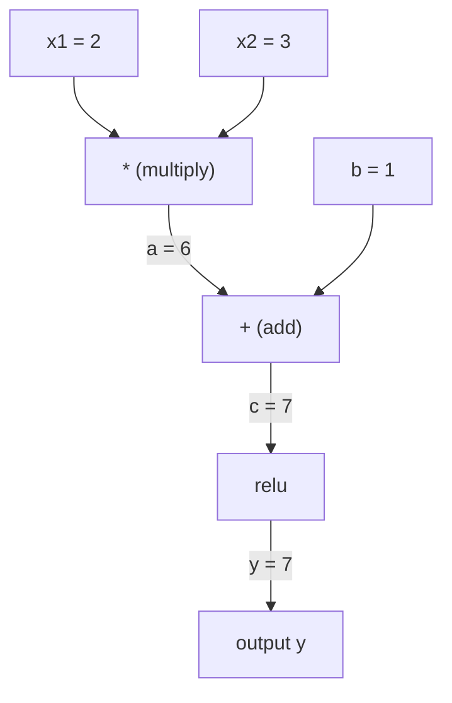
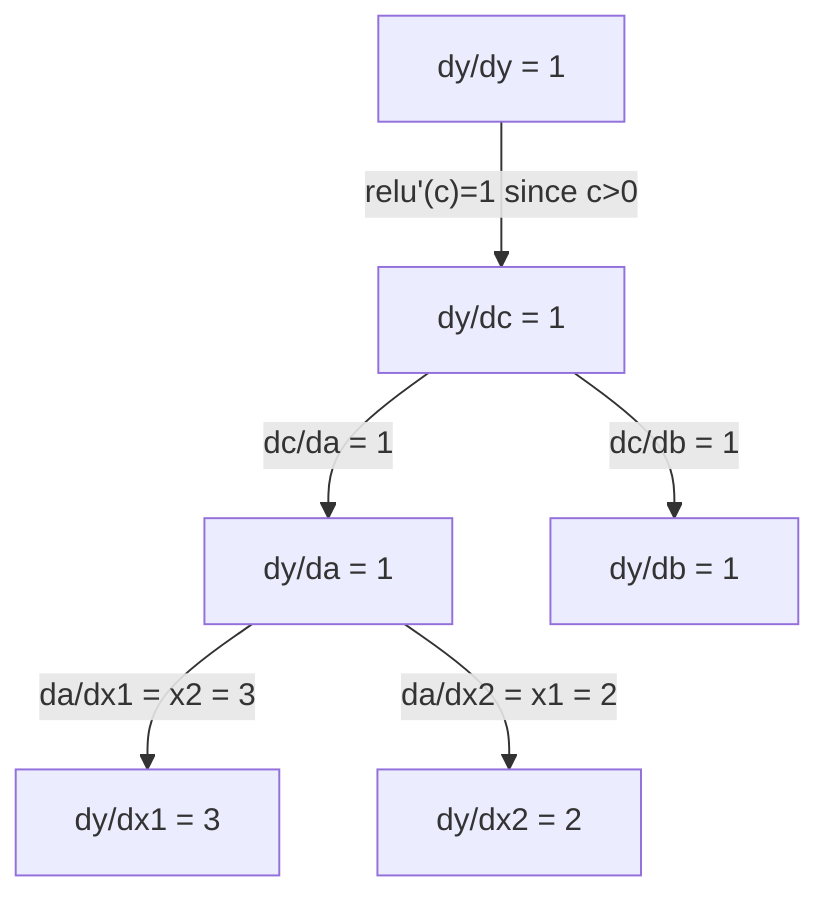

# 链式法则与自动微分

> 链式法则是每个能够学习的神经网络背后的引擎。

**Type:** 构建
**Language:** Python
**Prerequisites:** 第 1 阶段，第 04 课（Derivatives & Gradients）
**Time:** 约 90 分钟

## 学习目标

- 构建一个最小自动微分引擎（Value 类），记录运算并通过反向模式自动微分计算梯度
- 使用拓扑排序实现计算图的前向传播与反向传播
- 仅使用从零实现的自动微分引擎，构建并训练一个解决 XOR 问题的多层感知机
- 将自动微分结果与数值有限差分对照，验证梯度计算是否正确

## 问题

你已经能够计算简单函数的导数，但神经网络并不是简单函数。它由数百个函数组合而成：矩阵乘法、添加偏置、应用激活函数、再次进行矩阵乘法、softmax，再计算交叉熵损失。最终输出是函数的函数的函数。

要训练网络，你必须计算损失相对于每一个权重的梯度。面对数百万个参数，手工计算不可能完成；使用数值方法（有限差分）则慢得无法接受。

链式法则提供数学原理，自动微分提供实现算法。二者结合后，你可以用与一次前向传播成正比的时间，准确计算任意复合函数的梯度。

PyTorch、TensorFlow 和 JAX 都采用这一原理。本课将从零构建一个微型版本。

## 核心概念

### 链式法则

如果 `y = f(g(x))`，那么 `y` 对 `x` 的导数为：

```
dy/dx = dy/dg * dg/dx = f'(g(x)) * g'(x)
```

沿函数链逐项相乘，每个环节都贡献自己的局部导数。

示例：`y = sin(x^2)`

```
g(x) = x^2       g'(x) = 2x
f(g) = sin(g)     f'(g) = cos(g)

dy/dx = cos(x^2) * 2x
```

面对更深的复合关系，链条会继续延伸：

```
y = f(g(h(x)))

dy/dx = f'(g(h(x))) * g'(h(x)) * h'(x)
```

神经网络中的每一层都是这条函数链上的一个环节。

### 计算图

计算图把链式法则直观地呈现出来。每个运算都是一个节点：数据沿图向前流动，梯度则反向传播。

**前向传播（计算数值）：**



**反向传播（计算梯度）：**



反向传播会在每个节点应用链式法则，把梯度从输出传回输入。

### 前向模式与反向模式

沿计算图应用链式法则有两种方式。

**前向模式**从输入出发，将导数向前传递。它先设定 `dx/dx = 1`，再经过每个运算传播导数。输入很少、输出很多时，这种方式更合适。

```
Forward mode: seed dx/dx = 1, propagate forward

  x = 2       (dx/dx = 1)
  a = x^2     (da/dx = 2x = 4)
  y = sin(a)  (dy/dx = cos(a) * da/dx = cos(4) * 4 = -2.615)
```

**反向模式**从输出出发，将梯度向后拉回。它先设定 `dy/dy = 1`，然后按相反顺序经过每个运算传播梯度。输入很多、输出很少时，这种方式更合适。

```
Reverse mode: seed dy/dy = 1, propagate backward

  y = sin(a)  (dy/dy = 1)
  a = x^2     (dy/da = cos(a) = cos(4) = -0.654)
  x = 2       (dy/dx = dy/da * da/dx = -0.654 * 4 = -2.615)
```

神经网络有数百万个输入（权重），却只有一个输出（损失）。反向模式能够在一次反向传播中计算全部梯度，因此反向传播采用这种模式。

| 模式 | 种子 | 方向 | 最适用的场景 |
|------|------|-----------|-----------|
| 前向模式 | `dx_i/dx_i = 1` | 从输入到输出 | 输入少、输出多 |
| 反向模式 | `dy/dy = 1` | 从输出到输入 | 输入多、输出少（神经网络） |

### 用双数实现前向模式

双数能够优雅地实现前向模式。双数的形式是 `a + b*epsilon`，其中 `epsilon^2 = 0`。

```
Dual number: (value, derivative)

(2, 1) means: value is 2, derivative w.r.t. x is 1

Arithmetic rules:
  (a, a') + (b, b') = (a+b, a'+b')
  (a, a') * (b, b') = (a*b, a'*b + a*b')
  sin(a, a')         = (sin(a), cos(a)*a')
```

将输入变量的导数设为 1，导数就会自动经过每一个运算向前传播。

### 构建自动微分引擎

一个自动微分引擎需要三项能力：

1. **封装数值。**把每个数字包装成同时保存数值与梯度的对象。
2. **记录计算图。**每个运算都记录自己的输入和局部梯度函数。
3. **执行反向传播。**对计算图进行拓扑排序，再逆序遍历，在每个节点应用链式法则。

PyTorch 的 `autograd` 所做的正是这些。`torch.Tensor` 类封装数值；当 `requires_grad=True` 时，它会记录运算；调用 `.backward()` 时，它会计算梯度。

### PyTorch Autograd 的底层工作方式

当你编写以下 PyTorch 代码时：

```python
x = torch.tensor(2.0, requires_grad=True)
y = x ** 2 + 3 * x + 1
y.backward()
print(x.grad)  # 7.0 = 2*x + 3 = 2*2 + 3
```

PyTorch 在内部会执行以下步骤：

1. 创建一个 `Tensor` 节点来表示 `x`，并设置 `requires_grad=True`
2. 每个运算（`**`、`*`、`+`）都会创建新节点，并记录反向函数
3. `y.backward()` 触发计算图上的反向模式自动微分
4. 每个节点的 `grad_fn` 计算局部梯度，并将它传递给父节点
5. 梯度通过加法累积到 `.grad` 属性中，而不是覆盖原值

该计算图是动态的（define-by-run）：每次前向传播都会重新构建一张图。因此，PyTorch 模型内部可以使用 if/else 和循环等控制流。

```figure
chain-rule
```

## 动手构建

### 第 1 步：Value 类

```python
class Value:
    def __init__(self, data, children=(), op=''):
        self.data = data
        self.grad = 0.0
        self._backward = lambda: None
        self._prev = set(children)
        self._op = op

    def __repr__(self):
        return f"Value(data={self.data:.4f}, grad={self.grad:.4f})"
```

每个 `Value` 都会保存数值数据、梯度（初始值为零）、反向函数，以及生成它的子节点引用。

### 第 2 步：跟踪梯度的算术运算

```python
    def __add__(self, other):
        other = other if isinstance(other, Value) else Value(other)
        out = Value(self.data + other.data, (self, other), '+')
        def _backward():
            self.grad += out.grad
            other.grad += out.grad
        out._backward = _backward
        return out

    def __mul__(self, other):
        other = other if isinstance(other, Value) else Value(other)
        out = Value(self.data * other.data, (self, other), '*')
        def _backward():
            self.grad += other.data * out.grad
            other.grad += self.data * out.grad
        out._backward = _backward
        return out

    def relu(self):
        out = Value(max(0, self.data), (self,), 'relu')
        def _backward():
            self.grad += (1.0 if out.data > 0 else 0.0) * out.grad
        out._backward = _backward
        return out
```

每个运算都会创建一个闭包，它知道如何计算局部梯度，并将其乘以上游梯度（`out.grad`）。使用 `+=` 是为了正确处理同一个值参与多个运算、需要汇总多路梯度的情况。

### 第 3 步：反向传播

```python
    def backward(self):
        topo = []
        visited = set()
        def build_topo(v):
            if v not in visited:
                visited.add(v)
                for child in v._prev:
                    build_topo(child)
                topo.append(v)
        build_topo(self)

        self.grad = 1.0
        for v in reversed(topo):
            v._backward()
```

拓扑排序确保一个节点的梯度完全计算完成后，才会继续传播到它的子节点。种子梯度设为 1.0（dy/dy = 1）。

### 第 4 步：为完整引擎补充更多运算

基础 Value 类已经支持加法、乘法和 ReLU。真正的自动微分引擎还需要更多操作。以下是构建神经网络所需的运算：

```python
    def __neg__(self):
        return self * -1

    def __sub__(self, other):
        return self + (-other)

    def __radd__(self, other):
        return self + other

    def __rmul__(self, other):
        return self * other

    def __rsub__(self, other):
        return other + (-self)

    def __pow__(self, n):
        out = Value(self.data ** n, (self,), f'**{n}')
        def _backward():
            self.grad += n * (self.data ** (n - 1)) * out.grad
        out._backward = _backward
        return out

    def __truediv__(self, other):
        return self * (other ** -1) if isinstance(other, Value) else self * (Value(other) ** -1)

    def exp(self):
        import math
        e = math.exp(self.data)
        out = Value(e, (self,), 'exp')
        def _backward():
            self.grad += e * out.grad
        out._backward = _backward
        return out

    def log(self):
        import math
        out = Value(math.log(self.data), (self,), 'log')
        def _backward():
            self.grad += (1.0 / self.data) * out.grad
        out._backward = _backward
        return out

    def tanh(self):
        import math
        t = math.tanh(self.data)
        out = Value(t, (self,), 'tanh')
        def _backward():
            self.grad += (1 - t ** 2) * out.grad
        out._backward = _backward
        return out
```

**每项运算的重要性：**

| 运算 | 反向规则 | 用途 |
|-----------|--------------|---------|
| `__sub__` | 复用加法与取负 | 损失计算（pred - target） |
| `__pow__` | n * x^(n-1) | 多项式激活、MSE（error^2） |
| `__truediv__` | 复用乘法与 pow(-1) | 归一化、学习率缩放 |
| `exp` | exp(x) * upstream | softmax、对数似然 |
| `log` | (1/x) * upstream | 交叉熵损失、对数概率 |
| `tanh` | (1 - tanh^2) * upstream | 经典激活函数 |

巧妙之处在于，`__sub__` 和 `__truediv__` 都通过已有运算定义。链式法则会沿底层的 add、mul 和 pow 运算自动组合，因此它们无需额外工作就能获得正确梯度。

### 第 5 步：从零构建迷你 MLP

拥有完整的 Value 类后，就可以构建神经网络。不使用 PyTorch，也不使用 NumPy，只依赖 Value 与链式法则。

```python
import random

class Neuron:
    def __init__(self, n_inputs):
        self.w = [Value(random.uniform(-1, 1)) for _ in range(n_inputs)]
        self.b = Value(0.0)

    def __call__(self, x):
        act = sum((wi * xi for wi, xi in zip(self.w, x)), self.b)
        return act.tanh()

    def parameters(self):
        return self.w + [self.b]

class Layer:
    def __init__(self, n_inputs, n_outputs):
        self.neurons = [Neuron(n_inputs) for _ in range(n_outputs)]

    def __call__(self, x):
        return [n(x) for n in self.neurons]

    def parameters(self):
        return [p for n in self.neurons for p in n.parameters()]

class MLP:
    def __init__(self, sizes):
        self.layers = [Layer(sizes[i], sizes[i+1]) for i in range(len(sizes)-1)]

    def __call__(self, x):
        for layer in self.layers:
            x = layer(x)
        return x[0] if len(x) == 1 else x

    def parameters(self):
        return [p for layer in self.layers for p in layer.parameters()]
```

一个 `Neuron` 计算 `tanh(w1*x1 + w2*x2 + ... + b)`，一个 `Layer` 是一组神经元，一个 `MLP` 则把多层连接起来。每个权重都是 `Value`，因此调用 `loss.backward()` 会把梯度传播到所有参数。

**在 XOR 上训练：**

```python
random.seed(42)
model = MLP([2, 4, 1])  # 2 inputs, 4 hidden neurons, 1 output

xs = [[0, 0], [0, 1], [1, 0], [1, 1]]
ys = [-1, 1, 1, -1]  # XOR pattern (using -1/1 for tanh)

for step in range(100):
    preds = [model(x) for x in xs]
    loss = sum((p - y) ** 2 for p, y in zip(preds, ys))

    for p in model.parameters():
        p.grad = 0.0
    loss.backward()

    lr = 0.05
    for p in model.parameters():
        p.data -= lr * p.grad

    if step % 20 == 0:
        print(f"step {step:3d}  loss = {loss.data:.4f}")

print("\nPredictions after training:")
for x, y in zip(xs, ys):
    print(f"  input={x}  target={y:2d}  pred={model(x).data:6.3f}")
```

这就是 micrograd：一个使用纯 Python 和自动微分实现的完整神经网络训练循环。所有商业深度学习框架在大规模场景中执行的也是同一套原理。

### 第 6 步：梯度检查

怎样确认自动微分实现正确？将结果与数值导数进行比较，这就是梯度检查。

```python
def gradient_check(build_expr, x_val, h=1e-7):
    x = Value(x_val)
    y = build_expr(x)
    y.backward()
    autodiff_grad = x.grad

    y_plus = build_expr(Value(x_val + h)).data
    y_minus = build_expr(Value(x_val - h)).data
    numerical_grad = (y_plus - y_minus) / (2 * h)

    diff = abs(autodiff_grad - numerical_grad)
    return autodiff_grad, numerical_grad, diff
```

用一个复杂表达式测试它：

```python
def expr(x):
    return (x ** 3 + x * 2 + 1).tanh()

ad, num, diff = gradient_check(expr, 0.5)
print(f"Autodiff:  {ad:.8f}")
print(f"Numerical: {num:.8f}")
print(f"Difference: {diff:.2e}")
# Difference should be < 1e-5
```

实现新运算时，梯度检查必不可少。如果反向传播存在缺陷，数值检查就能将它捕获。所有严肃的深度学习实现都会在开发阶段执行梯度检查。

**何时使用梯度检查：**

| 场景 | 是否进行梯度检查？ |
|-----------|-------------------|
| 向自动微分引擎添加新运算 | 是，始终需要 |
| 调试无法收敛的训练循环 | 是，先检查梯度 |
| 生产训练 | 否，速度太慢（每个参数都需要两次前向传播） |
| 自动微分代码的单元测试 | 是，应将其自动化 |

### 第 7 步：与手工计算进行验证

```python
x1 = Value(2.0)
x2 = Value(3.0)
a = x1 * x2          # a = 6.0
b = a + Value(1.0)    # b = 7.0
y = b.relu()          # y = 7.0

y.backward()

print(f"y = {y.data}")          # 7.0
print(f"dy/dx1 = {x1.grad}")   # 3.0 (= x2)
print(f"dy/dx2 = {x2.grad}")   # 2.0 (= x1)
```

手工检查：`y = relu(x1*x2 + 1)`。由于 `x1*x2 + 1 = 7 > 0`，ReLU 等同于恒等函数。
`dy/dx1 = x2 = 3`，`dy/dx2 = x1 = 2`，引擎的结果与之相符。

## 实际使用

### 与 PyTorch 对照验证

```python
import torch

x1 = torch.tensor(2.0, requires_grad=True)
x2 = torch.tensor(3.0, requires_grad=True)
a = x1 * x2
b = a + 1.0
y = torch.relu(b)
y.backward()

print(f"PyTorch dy/dx1 = {x1.grad.item()}")  # 3.0
print(f"PyTorch dy/dx2 = {x2.grad.item()}")  # 2.0
```

梯度完全相同。你的引擎与 PyTorch 得到相同结果，因为二者使用的数学原理一致：通过链式法则执行反向模式自动微分。

### 更复杂的表达式

```python
a = Value(2.0)
b = Value(-3.0)
c = Value(10.0)
f = (a * b + c).relu()  # relu(2*(-3) + 10) = relu(4) = 4

f.backward()
print(f"df/da = {a.grad}")  # -3.0 (= b)
print(f"df/db = {b.grad}")  #  2.0 (= a)
print(f"df/dc = {c.grad}")  #  1.0
```

## 交付成果

本课会产出：
- `outputs/skill-autodiff.md`——用于构建和调试自动微分系统的技能
- `code/autodiff.py`——可以继续扩展的最小自动微分引擎

这里构建的 Value 类，是第 3 阶段神经网络训练循环的基础。

## 练习

1. 为 Value 类添加 `__pow__`，使其能够计算 `x ** n`。验证 `d/dx(x^3)` 在 `x=2` 时等于 `12.0`。

2. 添加 `tanh` 激活函数。验证 `tanh'(0) = 1`，并验证 `tanh'(2) = 0.0707`（近似值）。

3. 为单个神经元构建计算图：`y = relu(w1*x1 + w2*x2 + b)`。计算全部五个梯度，并与 PyTorch 的结果进行验证。

4. 使用双数实现前向模式自动微分。创建一个 `Dual` 类，并验证它得到的导数与反向模式引擎一致。

## 关键术语

| 术语 | 人们常说 | 准确含义 |
|------|----------------|----------------------|
| Chain rule | “把导数乘起来” | 复合函数的导数等于各函数在正确位置的局部导数之积 |
| Computational graph | “网络图” | 节点表示运算、边在前向传播时传递数值并在反向传播时传递梯度的有向无环图 |
| Forward mode | “向前推导数” | 将导数从输入传播到输出的自动微分方式；每个输入变量需要一次传播 |
| Reverse mode | “反向传播” | 将梯度从输出传播到输入的自动微分方式；每个输出变量需要一次传播 |
| Autograd | “自动梯度” | 记录数值上的运算、构建计算图并通过链式法则计算精确梯度的系统 |
| Dual numbers | “数值加导数” | 形如 a + b*epsilon（epsilon^2 = 0）的数，可在算术运算中携带导数信息 |
| Topological sort | “依赖顺序” | 对图节点排序，使每个节点都位于其所有依赖之后；正确传播梯度需要这种顺序 |
| Gradient accumulation | “累加，不要覆盖” | 当一个值进入多个运算时，它的梯度等于所有传入梯度贡献之和 |
| Dynamic graph | “运行时定义” | 每次前向传播都会重建的计算图，使模型内部可以使用 Python 控制流（PyTorch 风格） |
| Gradient checking | “数值验证” | 将自动微分梯度与数值有限差分梯度比较以验证正确性，是重要的调试方法 |
| MLP | “多层感知机” | 包含一个或多个隐藏神经元层的网络；每个神经元计算加权和与偏置，再应用激活函数 |
| Neuron | “加权和 + 激活” | 基本计算单元：output = activation(w1*x1 + w2*x2 + ... + b)，其中权重和偏置是可学习参数 |

## 延伸阅读

- [3Blue1Brown：反向传播微积分](https://www.youtube.com/watch?v=tIeHLnjs5U8)——神经网络中链式法则的可视化解释
- [PyTorch Autograd 机制](https://pytorch.org/docs/stable/notes/autograd.html)——真实系统的工作原理
- [Baydin 等：《机器学习中的自动微分综述》](https://arxiv.org/abs/1502.05767)——全面的参考资料
