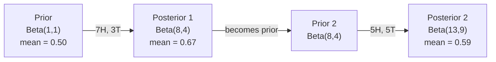

# Bayes 定理

> 概率描述你的预期，Bayes 定理描述你如何根据证据学习。

**Type:** 构建
**Language:** Python
**Prerequisites:** 第 1 阶段，第 06 课（Probability Fundamentals）
**Time:** 约 75 分钟

## 学习目标

- 应用 Bayes 定理，根据先验、似然和证据计算后验概率
- 从零构建使用 Laplace 平滑和对数空间计算的 Naive Bayes 文本分类器
- 比较 MLE 与 MAP 估计，并解释 MAP 与 L2 正则化的对应关系
- 使用 Beta-Binomial 共轭先验，为 A/B 测试实现序贯 Bayesian 更新

## 问题

一项医学检测的准确率为 99%。你的检测结果呈阳性，那么你真正患病的概率是多少？

大多数人会回答 99%，但真正的答案取决于这种疾病有多罕见。如果每 10,000 人中只有 1 人患病，那么一次阳性结果意味着你患病的概率只有约 1%。其余 99% 的阳性结果，都是健康人得到的误报。

这不是一道文字陷阱，而是 Bayes 定理。垃圾邮件过滤器、医学诊断，以及任何量化不确定性的机器学习模型，都使用同样的推理方式：先有一个信念，观察到证据，然后更新信念。

如果在不了解这一点的情况下构建机器学习系统，你会误读模型输出、设置错误的阈值，并交付过度自信的预测。

## 核心概念

### 从联合概率推导 Bayes 定理

你已经在第 06 课学过条件概率：

```
P(A|B) = P(A and B) / P(B)
```

对称地，也有：

```
P(B|A) = P(A and B) / P(A)
```

两个表达式拥有相同的分子 P(A and B)。令它们相等并重新整理：

```
P(A and B) = P(A|B) * P(B) = P(B|A) * P(A)

Therefore:

P(A|B) = P(B|A) * P(A) / P(B)
```

这就是 Bayes 定理：四个量、一个方程。

### 四个组成部分

| 部分 | 名称 | 含义 |
|------|------|---------------|
| P(A\|B) | 后验概率 | 观察到证据 B 后，对 A 更新后的信念 |
| P(B\|A) | 似然 | 如果 A 为真，证据 B 出现的概率 |
| P(A) | 先验概率 | 看到任何证据之前，对 A 的信念 |
| P(B) | 证据 | 在所有可能情况下观察到 B 的总概率 |

证据项 P(B) 起到归一化作用。可以使用全概率公式展开它：

```
P(B) = P(B|A) * P(A) + P(B|not A) * P(not A)
```

### 医学检测示例

某种疾病的患病率是万分之一。检测准确率为 99%：能够检出 99% 的患者，同时有 1% 的健康人会得到假阳性结果。

```
P(sick)          = 0.0001     (prior: disease is rare)
P(positive|sick) = 0.99       (likelihood: test catches it)
P(positive|healthy) = 0.01    (false positive rate)

P(positive) = P(positive|sick) * P(sick) + P(positive|healthy) * P(healthy)
            = 0.99 * 0.0001 + 0.01 * 0.9999
            = 0.000099 + 0.009999
            = 0.010098

P(sick|positive) = P(positive|sick) * P(sick) / P(positive)
                 = 0.99 * 0.0001 / 0.010098
                 = 0.0098
                 = 0.98%
```

结果不到 1%，因为先验概率占据主导地位。当某种情况十分罕见时，即使检测很准确，大多数阳性结果仍可能是假阳性。这就是医生会安排复查的原因。

### 垃圾邮件过滤示例

你收到一封包含 “lottery” 一词的邮件。它是垃圾邮件吗？

```
P(spam)                = 0.3      (30% of email is spam)
P("lottery"|spam)      = 0.05     (5% of spam emails contain "lottery")
P("lottery"|not spam)  = 0.001    (0.1% of legitimate emails contain "lottery")

P("lottery") = 0.05 * 0.3 + 0.001 * 0.7
             = 0.015 + 0.0007
             = 0.0157

P(spam|"lottery") = 0.05 * 0.3 / 0.0157
                  = 0.955
                  = 95.5%
```

仅凭一个词，垃圾邮件概率就从 30% 上升到了 95.5%。真实的垃圾邮件过滤器会同时对数百个词应用 Bayes 推理。

### Naive Bayes：独立性假设

Naive Bayes 假设给定类别后，所有特征条件独立，从而把 Bayes 推理扩展到多个特征：

```
P(class | feature_1, feature_2, ..., feature_n)
  = P(class) * P(feature_1|class) * P(feature_2|class) * ... * P(feature_n|class)
    / P(feature_1, feature_2, ..., feature_n)
```

所谓“朴素”，指的正是这个独立性假设。在文本中，词语的出现并不独立，例如 “New” 与 “York” 彼此相关。但这种假设在实践中出奇地有效，因为分类器只需要对类别排序，并不一定要给出经过校准的概率。

由于分母对所有类别都相同，可以忽略分母，只比较分子：

```
score(class) = P(class) * product of P(feature_i | class)
```

选择分数最高的类别即可。

### 最大似然估计（MLE）

如何从训练数据得到 P(feature|class)？直接计数。

```
P("free"|spam) = (number of spam emails containing "free") / (total spam emails)
```

这就是 MLE：选择让已观测数据出现概率最大的参数值。对于离散计数，它会化为相对频率。

问题在于，如果某个词在训练期间从未出现在垃圾邮件中，MLE 会给它分配零概率。一个未见过的词就会让整个乘积变为零。Laplace 平滑可以解决这个问题：

```
P(word|class) = (count(word, class) + 1) / (total_words_in_class + vocabulary_size)
```

给每个计数加 1，可以确保概率永远不会为零。

### 最大后验估计（MAP）

MLE 的问题是：哪些参数能使 P(data|parameters) 最大？

MAP 的问题是：哪些参数能使 P(parameters|data) 最大？

根据 Bayes 定理：

```
P(parameters|data) proportional to P(data|parameters) * P(parameters)
```

MAP 会为参数本身加入一个先验。如果你认为参数应该较小，就可以用惩罚较大数值的先验表达这一信念。这与机器学习中的 L2 正则化完全等价。岭回归中的“ridge”惩罚，本质上就是权重的 Gaussian 先验。

| 估计方法 | 优化目标 | 机器学习中的对应方法 |
|------------|-----------|---------------|
| MLE | P(data\|params) | 无正则化训练 |
| MAP | P(data\|params) * P(params) | L2 / L1 正则化 |

### Bayesian 与频率学派：实践中的区别

频率学派把参数视为固定但未知的值，并问：“如果把这项实验重复很多次，会发生什么？”

Bayesian 方法把参数视为分布，并问：“根据目前观察到的内容，我对这些参数有怎样的信念？”

在构建机器学习系统时，实际差异如下：

| 方面 | 频率学派 | Bayesian 方法 |
|--------|-------------|----------|
| 输出 | 点估计 | 数值上的分布 |
| 不确定性 | 置信区间（描述统计过程） | 可信区间（描述参数） |
| 小数据 | 可能过拟合 | 先验起到正则化作用 |
| 计算 | 通常更快 | 通常需要采样（MCMC） |

大多数生产级机器学习使用频率学派方法（SGD、点估计）。当你需要校准良好的不确定性（医学决策、安全关键系统），或数据量很少（few-shot 学习、冷启动）时，Bayesian 方法格外有用。

### Bayesian 思维为何对机器学习很重要

二者的联系远不只是类比：

**先验就是正则化。**权重的 Gaussian 先验对应 L2 正则化，Laplace 先验对应 L1。每当你加入正则化项时，实际上都在表达自己预期参数应取什么值。

**后验描述不确定性。**单个预测概率无法告诉你模型对该估计有多大把握。Bayesian 方法会给出一个分布，例如：“我认为 P(spam) 位于 0.8 到 0.95 之间。”

**Bayes 更新就是在线学习。**今天的后验会成为明天的先验。模型看到新数据后，可以增量更新信念，而不必从头重新训练。

**模型比较也可以是 Bayesian 的。**Bayesian 信息准则（BIC）、边际似然和 Bayes 因子都使用 Bayesian 推理，在避免过拟合的同时选择模型。

```figure
bayes-update
```

## 动手构建

### 第 1 步：Bayes 定理函数

```python
def bayes(prior, likelihood, false_positive_rate):
    evidence = likelihood * prior + false_positive_rate * (1 - prior)
    posterior = likelihood * prior / evidence
    return posterior

result = bayes(prior=0.0001, likelihood=0.99, false_positive_rate=0.01)
print(f"P(sick|positive) = {result:.4f}")
```

### 第 2 步：Naive Bayes 分类器

```python
import math
from collections import defaultdict

class NaiveBayes:
    def __init__(self, smoothing=1.0):
        self.smoothing = smoothing
        self.class_counts = defaultdict(int)
        self.word_counts = defaultdict(lambda: defaultdict(int))
        self.class_word_totals = defaultdict(int)
        self.vocab = set()

    def train(self, documents, labels):
        for doc, label in zip(documents, labels):
            self.class_counts[label] += 1
            words = doc.lower().split()
            for word in words:
                self.word_counts[label][word] += 1
                self.class_word_totals[label] += 1
                self.vocab.add(word)

    def predict(self, document):
        words = document.lower().split()
        total_docs = sum(self.class_counts.values())
        vocab_size = len(self.vocab)
        best_class = None
        best_score = float("-inf")
        for cls in self.class_counts:
            score = math.log(self.class_counts[cls] / total_docs)
            for word in words:
                count = self.word_counts[cls].get(word, 0)
                total = self.class_word_totals[cls]
                score += math.log((count + self.smoothing) / (total + self.smoothing * vocab_size))
            if score > best_score:
                best_score = score
                best_class = cls
        return best_class
```

对数概率可以防止数值下溢。许多小概率相乘后会小到超出浮点数能够表示的范围，而对数概率求和既与乘法在数学上等价，又具有良好的数值稳定性。

### 第 3 步：使用垃圾邮件数据训练

```python
train_docs = [
    "win free money now",
    "free lottery ticket winner",
    "claim your prize today free",
    "urgent offer free cash",
    "congratulations you won free",
    "meeting tomorrow at noon",
    "project update attached",
    "can we schedule a call",
    "quarterly report review",
    "lunch on thursday sounds good",
    "team standup notes attached",
    "please review the pull request",
]

train_labels = [
    "spam", "spam", "spam", "spam", "spam",
    "ham", "ham", "ham", "ham", "ham", "ham", "ham",
]

classifier = NaiveBayes()
classifier.train(train_docs, train_labels)

test_messages = [
    "free money waiting for you",
    "meeting rescheduled to friday",
    "you won a free prize",
    "please review the attached report",
]

for msg in test_messages:
    print(f"  '{msg}' -> {classifier.predict(msg)}")
```

### 第 4 步：检查学到的概率

```python
def show_top_words(classifier, cls, n=5):
    vocab_size = len(classifier.vocab)
    total = classifier.class_word_totals[cls]
    probs = {}
    for word in classifier.vocab:
        count = classifier.word_counts[cls].get(word, 0)
        probs[word] = (count + classifier.smoothing) / (total + classifier.smoothing * vocab_size)
    sorted_words = sorted(probs.items(), key=lambda x: x[1], reverse=True)
    for word, prob in sorted_words[:n]:
        print(f"    {word}: {prob:.4f}")

print("\nTop spam words:")
show_top_words(classifier, "spam")
print("\nTop ham words:")
show_top_words(classifier, "ham")
```

## 实际使用

Scikit-learn 提供了可用于生产环境的 Naive Bayes 实现：

```python
from sklearn.feature_extraction.text import CountVectorizer
from sklearn.naive_bayes import MultinomialNB
from sklearn.metrics import classification_report

vectorizer = CountVectorizer()
X_train = vectorizer.fit_transform(train_docs)
clf = MultinomialNB()
clf.fit(X_train, train_labels)

X_test = vectorizer.transform(test_messages)
predictions = clf.predict(X_test)
for msg, pred in zip(test_messages, predictions):
    print(f"  '{msg}' -> {pred}")
```

算法完全相同。CountVectorizer 负责分词和构建词表，MultinomialNB 在内部处理平滑与对数概率。你从零实现的版本用 40 行代码完成了相同工作。

## 交付成果

这里构建的 NaiveBayes 类演示了完整流水线：分词、使用 Laplace 平滑估计概率，以及在对数空间中预测。`code/bayes.py` 中的代码可以端到端运行，除 Python 标准库外不需要任何依赖。

### 共轭先验

如果先验分布和后验分布属于同一个分布族，就称这个先验为“共轭先验”。这样可以简洁地完成 Bayesian 更新——无需数值积分，就能得到闭式后验。

| 似然 | 共轭先验 | 后验 | 示例 |
|-----------|----------------|-----------|---------|
| Bernoulli | Beta(a, b) | Beta(a + successes, b + failures) | 估计硬币的偏置 |
| Normal（方差已知） | Normal(mu_0, sigma_0) | Normal(weighted mean, smaller variance) | 传感器校准 |
| Poisson | Gamma(a, b) | Gamma(a + sum of counts, b + n) | 建模事件到达率 |
| Multinomial | Dirichlet(alpha) | Dirichlet(alpha + counts) | 主题建模、语言模型 |

这为什么重要：没有共轭先验时，需要使用 Monte Carlo 采样或变分推断近似后验；使用共轭先验时，只需更新两个数字。

Beta 分布是实践中最常见的共轭先验。Beta(a, b) 表示你对某个概率参数的信念，其均值为 a/(a+b)。a+b 越大，分布越集中，也表示信念越确定。

Beta 先验的特殊情况：
- Beta(1, 1) = 均匀分布，表示你对参数没有先入之见
- Beta(10, 10) 的峰值位于 0.5，表示你强烈相信参数接近 0.5
- Beta(1, 10) 向 0 偏斜，表示你相信参数较小

更新规则非常简单：

```
Prior:     Beta(a, b)
Data:      s successes, f failures
Posterior: Beta(a + s, b + f)
```

不需要积分，也不需要采样，只需做加法。

### 序贯 Bayesian 更新

Bayesian 推断天然适合按顺序更新。今天的后验会成为明天的先验。真实系统因此能够根据新数据增量更新信念，而不必重新处理所有历史数据。

具体示例：估计一枚硬币是否公平。

**第 1 天：还没有数据。**
从 Beta(1, 1) 均匀先验开始，你暂时没有倾向。
- 先验均值：0.5
- 先验在 [0, 1] 上是平坦的

**第 2 天：观察到 7 次正面、3 次反面。**
后验 = Beta(1 + 7, 1 + 3) = Beta(8, 4)
- 后验均值：8/12 = 0.667
- 证据表明硬币更偏向正面

**第 3 天：又观察到 5 次正面、5 次反面。**
把昨天的后验作为今天的先验。
后验 = Beta(8 + 5, 4 + 5) = Beta(13, 9)
- 后验均值：13/22 = 0.591
- 新的均衡数据把估计拉回到了更接近 0.5 的位置



观测顺序并不影响结果。以 Beta(1,1) 为先验，一次性使用总计 12 次正面和 8 次反面更新，也会得到 Beta(13, 9)。序贯更新与批量更新在数学上等价，但序贯更新允许你在每一步做出决策，而无需保存原始数据。

这正是生产级机器学习系统中在线学习的基础。用于多臂老虎机的 Thompson sampling、增量推荐系统和流式异常检测器都使用这一模式。

### 与 A/B 测试的联系

A/B 测试本质上是一种 Bayesian 推断。

场景：你正在测试两种按钮颜色，变体 A 为蓝色，变体 B 为绿色。你想知道哪一种能获得更多点击。

Bayesian A/B 测试的步骤如下：

1. **先验。**两个变体都从 Beta(1, 1) 开始，不预先偏好任何一方。
2. **数据。**变体 A：1,000 次展示获得 50 次点击；变体 B：1,000 次展示获得 65 次点击。
3. **后验。**
   - A：Beta(1 + 50, 1 + 950) = Beta(51, 951)，均值 = 0.051
   - B：Beta(1 + 65, 1 + 935) = Beta(66, 936)，均值 = 0.066
4. **决策。**计算 P(B > A)，即 B 的真实转化率高于 A 的概率。

直接解析计算 P(B > A) 很困难，但用 Monte Carlo 会非常简单：

```
1. Draw 100,000 samples from Beta(51, 951)  -> samples_A
2. Draw 100,000 samples from Beta(66, 936)  -> samples_B
3. P(B > A) = fraction of samples where B > A
```

如果 P(B > A) > 0.95，就发布变体 B；如果它位于 0.05 到 0.95 之间，就继续收集数据；如果 P(B > A) < 0.05，则发布变体 A。

相较于频率学派 A/B 测试，它具有以下优势：
- 可以直接给出概率陈述：“B 有 97% 的概率更好”
- 不会产生 p 值解释混乱，也无需使用“无法拒绝零假设”这类迂回表述
- 可以随时查看结果，而不会抬高假阳性率（不存在“偷看问题”）
- 可以纳入先验知识，例如历史实验表明转化率通常位于 3%–8%

| 方面 | 频率学派 A/B 测试 | Bayesian A/B 测试 |
|--------|----------------|--------------|
| 输出 | p 值 | P(B > A) |
| 解释 | “如果 A=B，这些数据有多反常？” | “B 优于 A 的可能性有多大？” |
| 提前停止 | 会抬高假阳性率 | 可随时安全停止（前提是先验选择合理、模型设定正确） |
| 先验知识 | 不使用 | 编码为 Beta 先验 |
| 决策规则 | p < 0.05 | P(B > A) > threshold |

## 练习

1. **多次检测。**一名患者在两项相互独立的检测中都呈阳性（两项检测的准确率均为 99%，疾病患病率为万分之一）。两次检测后 P(sick) 是多少？把第一次检测的后验作为第二次检测的先验。

2. **平滑的影响。**分别使用 0.01、0.1、1.0 和 10.0 的 smoothing 值运行垃圾邮件分类器。概率最高的词会如何变化？当 smoothing=0，并遇到只在 ham 中出现的词时会怎样？

3. **添加特征。**扩展 NaiveBayes 类，在词频之外加入消息长度（短/长）特征。从训练数据估计 P(short|spam) 和 P(short|ham)，并将其纳入预测分数。

4. **手工计算 MAP。**给定观测数据（抛硬币 10 次，其中 7 次正面），使用 Beta(2,2) 先验计算偏置的 MAP 估计，并与 MLE 估计（7/10）比较。

## 关键术语

| 术语 | 人们常说 | 准确含义 |
|------|----------------|----------------------|
| Prior | “我的初始猜测” | 观察证据之前的 P(hypothesis)；在机器学习中对应正则化项 |
| Likelihood | “数据拟合得有多好” | P(evidence\|hypothesis)，表示特定假设成立时观测数据出现的概率 |
| Posterior | “更新后的信念” | P(hypothesis\|evidence)，由先验乘以似然后再归一化得到 |
| Evidence | “归一化常数” | 所有假设下的 P(data)，保证后验概率之和为 1 |
| Naive Bayes | “那个简单的文本分类器” | 假设给定类别后各特征相互独立的分类器；虽然假设并不真实，实际效果往往很好 |
| Laplace smoothing | “加一平滑” | 给每个特征增加一个小计数，防止未见数据产生零概率 |
| MLE | “直接使用频率” | 选择使 P(data\|parameters) 最大的参数；不使用先验，在小数据上可能过拟合 |
| MAP | “带先验的 MLE” | 选择使 P(data\|parameters) * P(parameters) 最大的参数，等价于正则化的 MLE |
| Log-probability | “在对数空间中计算” | 使用 log(P) 代替 P，避免大量小概率相乘时出现浮点数下溢 |
| False positive | “误报” | 检测结果为阳性，但真实状态为阴性；这是基础率谬误的主要来源 |

## 延伸阅读

- [3Blue1Brown：Bayes 定理](https://www.youtube.com/watch?v=HZGCoVF3YvM)——使用医学检测示例进行可视化讲解
- [Stanford CS229：生成式学习算法](https://cs229.stanford.edu/notes2022fall/cs229-notes2.pdf)——Naive Bayes 及其与判别式模型的联系
- [Think Bayes](https://greenteapress.com/wp/think-bayes/)——一本结合 Python 代码讲解 Bayesian 统计的免费图书
- [scikit-learn Naive Bayes](https://scikit-learn.org/stable/modules/naive_bayes.html)——生产级实现以及各变体的适用场景
