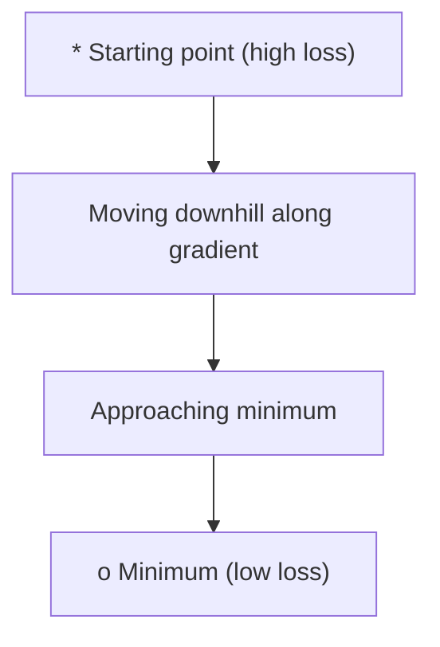
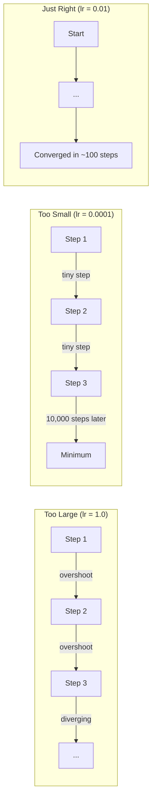
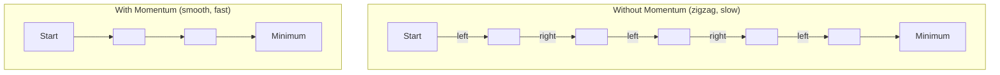
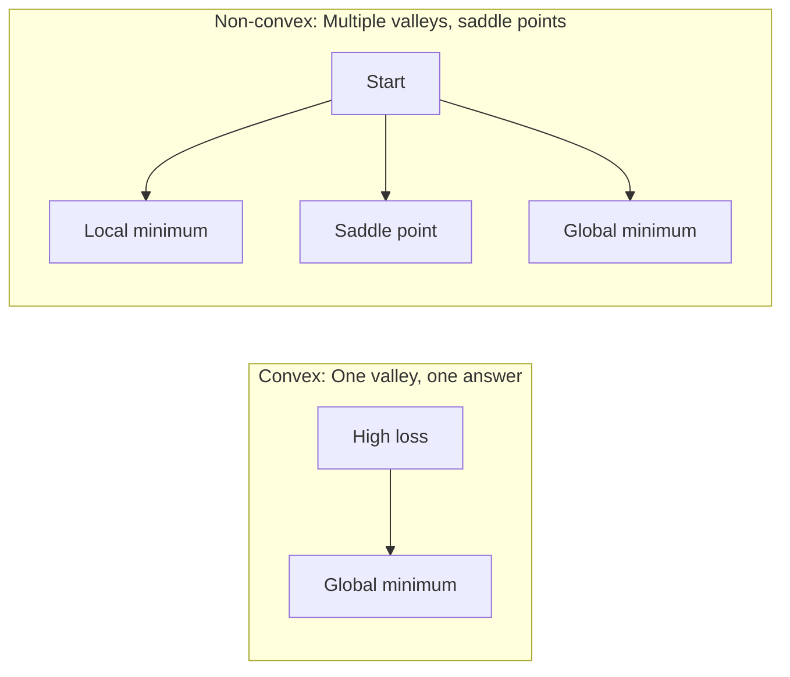
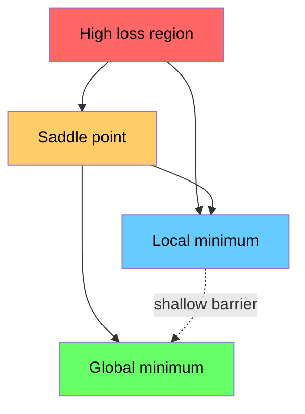

# 优化

> 训练神经网络，不过是在寻找山谷的最低点。

**Type:** 构建
**Language:** Python
**Prerequisites:** 第 1 阶段，第 04–05 课（Derivatives, Gradients）
**Time:** 约 75 分钟

## 学习目标

- 从零实现基础梯度下降、带动量的 SGD 和 Adam
- 比较各优化器在 Rosenbrock 函数上的收敛表现，并解释 Adam 为何会为每个权重自适应调整学习率
- 区分凸损失曲面与非凸损失曲面，并解释鞍点在高维空间中的作用
- 配置学习率调度策略（阶梯衰减、余弦退火和预热），提高训练稳定性

## 问题

你有一个损失函数，它告诉你模型错得有多严重；你也有梯度，它告诉你朝哪个方向会让损失增大。现在，你需要一种沿下坡前进的策略。

最朴素的方法很简单：沿梯度的反方向移动，用一个称为学习率的数值缩放步长，然后不断重复。这就是梯度下降，它确实有效，但“有效”并非没有条件。学习率太大，你会直接越过谷底，在两侧之间来回振荡；学习率太小，你会用数千个不必要的步骤缓慢爬向答案；遇到鞍点时，即使尚未到达最小值，也可能停止移动。

深度学习中的每一种优化器，都在回答同一个问题：怎样更快、更可靠地到达山谷底部？

## 核心概念

### 优化意味着什么

优化就是寻找使一个函数达到最小值（或最大值）的输入。在机器学习中，这个函数是损失函数，输入则是模型权重，因此训练就是优化。

```
minimize L(w) where:
  L = loss function
  w = model weights (could be millions of parameters)
```

### 基础梯度下降

这是最简单的优化器。计算损失相对于每个权重的梯度，让每个权重沿其梯度的反方向移动，并用学习率缩放步长。

```
w = w - lr * gradient
```

整个算法只有这一行。



### 学习率：最重要的超参数

学习率控制步长，几乎决定了收敛过程的一切。



正确的学习率没有现成公式，只能通过实验寻找。常用起点是：Adam 使用 0.001，带动量的 SGD 使用 0.01。

### SGD、全批量与小批量

基础梯度下降在迈出一步之前，会先基于整个数据集计算梯度，这称为全批量梯度下降。它稳定，但速度较慢。

随机梯度下降（SGD）只对一个随机样本计算梯度，然后立即更新。它噪声较大，但速度快。

小批量梯度下降取两者之间的折中：先对一小批样本（32、64、128 或 256 个）计算梯度，再更新参数。这才是实践中普遍使用的方式。

| 变体 | 批量大小 | 梯度质量 | 每步速度 | 噪声 |
|---------|-----------|-----------------|---------------|-------|
| 全批量 GD | 整个数据集 | 精确 | 慢 | 无 |
| SGD | 1 个样本 | 噪声很大 | 快 | 高 |
| 小批量 | 32–256 个样本 | 良好的估计 | 均衡 | 中等 |

SGD 和小批量中的噪声并不是缺陷，它有助于逃离浅层局部最小值和鞍点。

### 动量：沿下坡滚动的小球

基础梯度下降只观察当前梯度。在狭窄山谷中，梯度经常左右摆动，导致前进缓慢。动量通过把过去的梯度累积到速度项中来解决这个问题。

```
v = beta * v + gradient
w = w - lr * v
```

可以把它想象成一颗沿山坡滚落的小球：它不会在每个小凸起处停下并重新起步，而会在方向一致时积累速度，同时抑制来回振荡。



`beta`（通常为 0.9）控制保留多少历史信息。beta 越高，动量越强、路径越平滑，但对方向变化的响应也越慢。

### Adam：自适应学习率

不同权重需要不同的学习率。某个权重很少获得大梯度，那么它终于获得大梯度时应该迈出更大的步；另一个权重总是获得巨大梯度，则应该迈出更小的步。

Adam（Adaptive Moment Estimation，自适应矩估计）会为每个权重跟踪两个量：

1. 一阶矩（m）：梯度的移动平均，类似动量
2. 二阶矩（v）：梯度平方的移动平均，表示梯度幅度

```
m = beta1 * m + (1 - beta1) * gradient
v = beta2 * v + (1 - beta2) * gradient^2

m_hat = m / (1 - beta1^t)    bias correction
v_hat = v / (1 - beta2^t)    bias correction

w = w - lr * m_hat / (sqrt(v_hat) + epsilon)
```

除以 `sqrt(v_hat)` 是关键所在。梯度较大的权重除以较大的数，得到较小的有效步长；梯度较小的权重除以较小的数，得到较大的有效步长。这样，每个权重都有自己的自适应学习率。

默认超参数为 `lr=0.001, beta1=0.9, beta2=0.999, epsilon=1e-8`，它们适用于大多数问题。

### 学习率调度

固定学习率是一种折中。训练初期需要较大的步长来快速前进，训练后期则需要较小的步长，在最小值附近精细调整。

常见调度策略如下：

| 调度策略 | 公式 | 使用场景 |
|----------|---------|----------|
| 阶梯衰减 | 每 N 个 epoch 执行 lr = lr * factor | 简单、便于手动控制 |
| 指数衰减 | lr = lr_0 * decay^t | 平滑降低学习率 |
| 余弦退火 | lr = lr_min + 0.5 * (lr_max - lr_min) * (1 + cos(pi * t / T)) | Transformer、现代训练流程 |
| 预热 + 衰减 | 先线性升高，再逐步衰减 | 大型模型，用于防止训练早期不稳定 |

### 凸与非凸

凸函数只有一个最小值，梯度下降总能找到它。`f(x) = x^2` 这样的二次函数就是凸函数。

神经网络的损失函数是非凸的，包含许多局部最小值、鞍点和平坦区域。



在实践中，高维神经网络里的局部最小值很少成为主要问题，因为大多数局部最小值的损失都接近全局最小值。真正的障碍是鞍点：它在某些方向上平坦，在另一些方向上弯曲。动量和小批量带来的噪声有助于逃离鞍点。

### 损失曲面可视化

损失是所有权重的函数。对于拥有 100 万个权重的模型，损失曲面存在于 1,000,001 维空间中。为了将其可视化，我们会在权重空间中选取两个随机方向，绘制沿这两个方向变化的损失，从而得到二维曲面。



尖锐最小值的泛化能力较差，平坦最小值的泛化能力较好。这也是带动量的 SGD 最终测试准确率经常优于 Adam 的原因之一：它的噪声会阻止优化器停在尖锐最小值中。

```figure
gradient-descent
```

## 动手构建

### 第 1 步：定义测试函数

Rosenbrock 函数是经典优化基准。它的最小值位于 (1, 1)，藏在一条容易找到、却很难沿着前进的狭窄弯曲山谷中。

```
f(x, y) = (1 - x)^2 + 100 * (y - x^2)^2
```

```python
def rosenbrock(params):
    x, y = params
    return (1 - x) ** 2 + 100 * (y - x ** 2) ** 2

def rosenbrock_gradient(params):
    x, y = params
    df_dx = -2 * (1 - x) + 200 * (y - x ** 2) * (-2 * x)
    df_dy = 200 * (y - x ** 2)
    return [df_dx, df_dy]
```

### 第 2 步：基础梯度下降

```python
class GradientDescent:
    def __init__(self, lr=0.001):
        self.lr = lr

    def step(self, params, grads):
        return [p - self.lr * g for p, g in zip(params, grads)]
```

### 第 3 步：带动量的 SGD

```python
class SGDMomentum:
    def __init__(self, lr=0.001, momentum=0.9):
        self.lr = lr
        self.momentum = momentum
        self.velocity = None

    def step(self, params, grads):
        if self.velocity is None:
            self.velocity = [0.0] * len(params)
        self.velocity = [
            self.momentum * v + g
            for v, g in zip(self.velocity, grads)
        ]
        return [p - self.lr * v for p, v in zip(params, self.velocity)]
```

### 第 4 步：Adam

```python
class Adam:
    def __init__(self, lr=0.001, beta1=0.9, beta2=0.999, epsilon=1e-8):
        self.lr = lr
        self.beta1 = beta1
        self.beta2 = beta2
        self.epsilon = epsilon
        self.m = None
        self.v = None
        self.t = 0

    def step(self, params, grads):
        if self.m is None:
            self.m = [0.0] * len(params)
            self.v = [0.0] * len(params)

        self.t += 1

        self.m = [
            self.beta1 * m + (1 - self.beta1) * g
            for m, g in zip(self.m, grads)
        ]
        self.v = [
            self.beta2 * v + (1 - self.beta2) * g ** 2
            for v, g in zip(self.v, grads)
        ]

        m_hat = [m / (1 - self.beta1 ** self.t) for m in self.m]
        v_hat = [v / (1 - self.beta2 ** self.t) for v in self.v]

        return [
            p - self.lr * mh / (vh ** 0.5 + self.epsilon)
            for p, mh, vh in zip(params, m_hat, v_hat)
        ]
```

### 第 5 步：运行并比较

```python
def optimize(optimizer, func, grad_func, start, steps=5000):
    params = list(start)
    history = [params[:]]
    for _ in range(steps):
        grads = grad_func(params)
        params = optimizer.step(params, grads)
        history.append(params[:])
    return history

start = [-1.0, 1.0]

gd_history = optimize(GradientDescent(lr=0.0005), rosenbrock, rosenbrock_gradient, start)
sgd_history = optimize(SGDMomentum(lr=0.0001, momentum=0.9), rosenbrock, rosenbrock_gradient, start)
adam_history = optimize(Adam(lr=0.01), rosenbrock, rosenbrock_gradient, start)

for name, history in [("GD", gd_history), ("SGD+M", sgd_history), ("Adam", adam_history)]:
    final = history[-1]
    loss = rosenbrock(final)
    print(f"{name:6s} -> x={final[0]:.6f}, y={final[1]:.6f}, loss={loss:.8f}")
```

预期结果：Adam 收敛最快，带动量的 SGD 路径更平滑，基础 GD 则在狭窄山谷中缓慢前进。

## 实际使用

实践中应使用 PyTorch 或 JAX 优化器。它们会处理参数组、权重衰减、梯度裁剪和 GPU 加速。

```python
import torch

model = torch.nn.Linear(784, 10)

sgd = torch.optim.SGD(model.parameters(), lr=0.01, momentum=0.9)
adam = torch.optim.Adam(model.parameters(), lr=0.001)
adamw = torch.optim.AdamW(model.parameters(), lr=0.001, weight_decay=0.01)

scheduler = torch.optim.lr_scheduler.CosineAnnealingLR(adam, T_max=100)
```

经验法则：

- 首先尝试 Adam（lr=0.001），大多数问题无需调参就能正常工作。
- 需要获得最佳最终准确率并且可以投入更多调参时间时，切换到带动量的 SGD（lr=0.01，momentum=0.9）。
- Transformer 使用 AdamW（将权重衰减与 Adam 解耦）。
- 训练超过几个 epoch 时，始终使用学习率调度。
- 训练不稳定时降低学习率；训练过慢时提高学习率。

## 交付成果

本课会产出一份帮助选择合适优化器的提示词，参见 `outputs/prompt-optimizer-guide.md`。

这里构建的优化器类将在第 3 阶段再次出现，用于从零训练神经网络。

## 练习

1. **学习率扫描。**使用学习率 [0.0001, 0.0005, 0.001, 0.005, 0.01] 在 Rosenbrock 函数上运行基础梯度下降。绘制或输出每个配置运行 5,000 步后的最终损失，找出仍能收敛的最大学习率。

2. **比较动量。**使用动量值 [0.0, 0.5, 0.9, 0.99] 在 Rosenbrock 函数上运行带动量的 SGD，记录每一步的损失。哪个动量值收敛最快？哪个会越过目标？

3. **逃离鞍点。**定义函数 `f(x, y) = x^2 - y^2`（原点为鞍点），从 (0.01, 0.01) 开始，比较基础 GD、带动量的 SGD 和 Adam 的行为。哪个优化器能逃离鞍点？

4. **实现学习率衰减。**为 GradientDescent 类添加指数衰减调度：`lr = lr_0 * 0.999^step`。在 Rosenbrock 函数上比较使用和不使用衰减时的收敛表现。

## 关键术语

| 术语 | 人们常说 | 准确含义 |
|------|----------------|----------------------|
| Gradient descent | “沿下坡走” | 从权重中减去按学习率缩放后的梯度，是最基础的优化器 |
| Learning rate | “步长” | 控制每次更新让权重移动多远的标量；过大会发散，过小会浪费算力 |
| Momentum | “保持滚动” | 将过去的梯度累积为速度向量，抑制振荡并加快沿一致方向的移动 |
| SGD | “随机采样” | 随机梯度下降；在随机子集而非完整数据集上计算梯度，实践中几乎总是指小批量 SGD |
| Mini-batch | “一小块数据” | 用于估计梯度的一小批训练数据（32–256 个样本），在速度和梯度精度之间取得平衡 |
| Adam | “默认优化器” | 自适应矩估计；跟踪每个权重的梯度与梯度平方移动平均，为各权重提供独立学习率 |
| Bias correction | “修正冷启动” | Adam 的一阶矩和二阶矩初始为零；偏差修正通过除以 (1 - beta^t) 补偿早期步骤 |
| Learning rate schedule | “随时间改变学习率” | 在训练过程中调整学习率的函数：前期大步前进，后期小步微调 |
| Convex function | “只有一个山谷” | 任意局部最小值都是全局最小值的函数；梯度下降总能找到它，神经网络损失并非凸函数 |
| Saddle point | “平坦但不是最小值” | 梯度为零，但在某些方向是最小值、另一些方向是最大值的点；在高维空间中很常见 |
| Loss landscape | “地形” | 把损失函数绘制在权重空间上；通常沿两个随机方向切片后进行可视化 |
| Convergence | “抵达目标” | 优化器到达继续更新也无法显著降低损失的位置 |

## 延伸阅读

- [Sebastian Ruder：梯度下降优化算法综述](https://ruder.io/optimizing-gradient-descent/)——主要优化器的全面综述
- [动量为什么有效（Distill）](https://distill.pub/2017/momentum/)——动量机制的交互式可视化
- [Adam：一种随机优化方法（Kingma 与 Ba，2014）](https://arxiv.org/abs/1412.6980)——篇幅短且易读的 Adam 原始论文
- [神经网络损失曲面的可视化（Li 等，2018）](https://arxiv.org/abs/1712.09913)——展示尖锐与平坦最小值的论文
