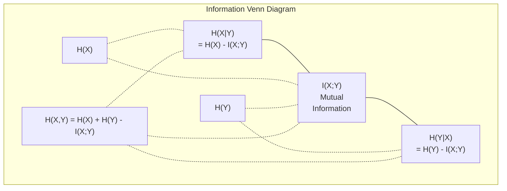

# 信息论

> 信息论衡量意外程度，损失函数就建立在它之上。

**Type:** 学习
**Language:** Python
**Prerequisites:** 第 1 阶段，第 06 课（Probability）
**Time:** 约 1 小时

## 学习目标

- 从零计算熵、交叉熵和 KL 散度，并解释三者之间的关系
- 推导为何最小化交叉熵损失等价于最大化对数似然
- 计算特征与目标之间的互信息，据此排列特征重要性
- 将困惑度解释为语言模型实际面对的候选词表大小

## 问题

训练每个分类模型时，你都会调用 `CrossEntropyLoss()`；每篇语言模型论文都会提到“困惑度”；VAE、知识蒸馏和 RLHF 中又会出现 KL 散度。这些概念并非彼此割裂，它们其实是同一个思想的不同表现形式。

信息论为不确定性、压缩和预测提供了一套推理语言。Claude Shannon 在 1948 年创立了它，用来解决通信问题。事实证明，训练神经网络也是一个通信问题：模型试图通过由学习权重构成的有噪信道，传递正确标签。

本课将从零构建每个公式，让你看清它们从何而来，又为何有效。

## 核心概念

### 信息量（意外程度）

一件低概率事件发生时，它携带的信息更多。硬币落到正面并不意外；彩票中奖则非常意外。

概率为 p 的事件，其信息量为：

```
I(x) = -log(p(x))
```

以 2 为底的对数得到 bit，以自然对数计算则得到 nat。思想相同，只是单位不同。

```
Event              Probability    Surprise (bits)
Fair coin heads    0.5            1.0
Rolling a 6        0.167          2.58
1-in-1000 event    0.001          9.97
Certain event      1.0            0.0
```

必然事件的信息量为零，因为你早就知道它会发生。

### 熵（平均意外程度）

熵是一个分布中所有可能结果的期望意外程度。

```
H(P) = -sum( p(x) * log(p(x)) )  for all x
```

对二元变量而言，公平硬币的熵最大，为 1 bit。偏置硬币（99% 为正面）的熵很低，只有 0.08 bit。你几乎已经知道结果，因此每次抛掷提供的信息很少。

```
Fair coin:    H = -(0.5 * log2(0.5) + 0.5 * log2(0.5)) = 1.0 bit
Biased coin:  H = -(0.99 * log2(0.99) + 0.01 * log2(0.01)) = 0.08 bits
```

熵衡量分布中无法消除的不确定性。任何压缩都不可能突破这一理论下限。

### 交叉熵（每天都会使用的损失函数）

如果真实事件来自分布 P，而你使用分布 Q 对它们编码，交叉熵衡量由此产生的平均意外程度。

```
H(P, Q) = -sum( p(x) * log(q(x)) )  for all x
```

P 是真实分布（标签），Q 是模型的预测。如果 Q 与 P 完全一致，交叉熵就等于熵；任何偏差都会使交叉熵增大。

在分类任务中，P 是 one-hot 向量：真实类别的概率为 1，其余类别为 0。交叉熵因此可以简化为：

```
H(P, Q) = -log(q(true_class))
```

这就是分类任务完整的交叉熵损失公式：让正确类别的预测概率尽可能大。

### KL 散度（分布之间的差异）

KL 散度衡量使用 Q 代替 P 时额外产生了多少意外信息。

```
D_KL(P || Q) = sum( p(x) * log(p(x) / q(x)) )  for all x
             = H(P, Q) - H(P)
```

交叉熵等于熵加 KL 散度。训练期间，真实分布的熵保持不变，因此最小化交叉熵就等价于最小化 KL 散度。你正在把模型分布推向真实分布。

KL 散度不对称：D_KL(P || Q) != D_KL(Q || P)，所以它并不是真正的距离度量。

### 互信息

互信息衡量：知道一个变量后，能够获得多少关于另一个变量的信息。

```
I(X; Y) = H(X) - H(X|Y)
        = H(X) + H(Y) - H(X, Y)
```

如果 X 与 Y 相互独立，互信息为零，因为其中一个变量无法提供另一个变量的信息。如果二者完全相关，互信息就等于任一变量的熵。

在特征选择中，特征与目标之间的互信息较高，意味着这个特征有用；互信息较低，则意味着它更像噪声。

### 条件熵

H(Y|X) 衡量观察到 X 后，关于 Y 还剩多少不确定性。

```
H(Y|X) = H(X,Y) - H(X)
```

来看两个极端情况：
- 如果 X 完全决定 Y，那么 H(Y|X) = 0。知道 X 后，关于 Y 的不确定性全部消失。例如 X 是摄氏温度，Y 是华氏温度。
- 如果 X 无法提供任何关于 Y 的信息，那么 H(Y|X) = H(Y)。知道 X 并不会降低对 Y 的不确定性。例如 X 是一次抛硬币结果，Y 是明天的天气。

条件熵始终非负，并且不会超过 H(Y)：

```
0 <= H(Y|X) <= H(Y)
```

在机器学习中，决策树会用到条件熵。每次分裂时，算法会选择使 H(Y|X) 最小的特征 X，也就是能够消除最多标签 Y 不确定性的特征。

### 联合熵

H(X,Y) 是 X 与 Y 联合分布的熵。

```
H(X,Y) = -sum sum p(x,y) * log(p(x,y))   for all x, y
```

它具有以下重要性质：

```
H(X,Y) <= H(X) + H(Y)
```

当 X 与 Y 相互独立时取等号。如果二者共享信息，联合熵就小于各自熵之和；“缺少”的那部分恰好就是互信息。



这些量之间的关系为：
- H(X,Y) = H(X) + H(Y|X) = H(Y) + H(X|Y)
- I(X;Y) = H(X) - H(X|Y) = H(Y) - H(Y|X)
- H(X,Y) = H(X) + H(Y) - I(X;Y)

### 深入理解互信息

互信息 I(X;Y) 对“知道一个变量后，另一个变量的不确定性减少多少”进行量化。

```
I(X;Y) = H(X) - H(X|Y)
       = H(Y) - H(Y|X)
       = H(X) + H(Y) - H(X,Y)
       = sum sum p(x,y) * log(p(x,y) / (p(x) * p(y)))
```

它具有以下性质：
- I(X;Y) 始终 >= 0。观察某个变量不会使你损失信息。
- 当且仅当 X 与 Y 相互独立时，I(X;Y) = 0。
- I(X;Y) = I(Y;X)。互信息是对称的，这一点与 KL 散度不同。
- I(X;X) = H(X)。一个变量与自身共享全部信息。

**用互信息选择特征。**在机器学习中，你希望找到能够提供目标信息的特征。互信息提供了一种有原则的排序方式：

1. 对每个特征 X_i，计算它与目标变量 Y 之间的 I(X_i; Y)。
2. 按 MI 分数对特征排序。
3. 保留前 k 个特征。

无论特征与目标之间是线性、非线性、单调还是非单调关系，这种方法都适用。相关系数只能发现线性关系，互信息则能发现任何统计依赖。

| 方法 | 能检测的关系 | 计算成本 | 支持类别变量？ |
|--------|---------|-------------------|---------------------|
| Pearson 相关系数 | 线性关系 | O(n) | 否 |
| Spearman 相关系数 | 单调关系 | O(n log n) | 否 |
| 互信息 | 任意统计依赖 | 使用分箱时为 O(n log n) | 是 |

### 标签平滑与交叉熵

标准分类使用硬目标，例如 [0, 0, 1, 0]：真实类别的概率为 1，其他类别为 0。标签平滑会将其替换成软目标：

```
soft_target = (1 - epsilon) * hard_target + epsilon / num_classes
```

当 epsilon = 0.1 且共有 4 个类别时：
- 硬目标：[0, 0, 1, 0]
- 软目标：[0.025, 0.025, 0.925, 0.025]

从信息论角度看，标签平滑提高了目标分布的熵。硬 one-hot 目标的熵为 0，不存在任何不确定性；软目标则具有正熵。

它能带来以下好处：
- 防止模型把 logits 推到极端值（若要让交叉熵下的预测与 one-hot 目标完全一致，就需要无限大的 logits）
- 起到正则化作用：模型无法达到 100% 的置信度
- 改善校准：预测概率能够更准确地反映真实不确定性
- 缩小训练行为与推理行为之间的差距

加入标签平滑后的交叉熵损失为：

```
L = (1 - epsilon) * CE(hard_target, prediction) + epsilon * H_uniform(prediction)
```

第二项会惩罚远离均匀分布的预测，相当于直接对置信度施加正则化。

### 为什么交叉熵是分类任务的核心损失

从三种视角出发，会得到相同结论。

**信息论视角。**交叉熵衡量使用模型分布代替真实分布时浪费了多少 bit。将它最小化，就是让模型成为对现实最高效的编码器。

**最大似然视角。**对于真实类别为 y_i 的 N 个训练样本：

```
Likelihood     = product( q(y_i) )
Log-likelihood = sum( log(q(y_i)) )
Negative log-likelihood = -sum( log(q(y_i)) )
```

最后一行就是交叉熵损失。因此，最小化交叉熵等价于最大化训练数据在模型下的似然。

**梯度视角。**交叉熵相对于 logits 的梯度就是 predicted - true，简洁、稳定，而且计算迅速。这正是它与 softmax 完美搭配的原因。

### Bit 与 Nat

二者唯一的区别是对数底数。

```
log base 2   -> bits      (information theory tradition)
log base e   -> nats      (machine learning convention)
log base 10  -> hartleys  (rarely used)
```

1 nat = 1/ln(2) bit = 1.4427 bit。PyTorch 和 TensorFlow 默认使用自然对数，也就是以 nat 为单位。

### 困惑度

困惑度是交叉熵的指数，用来表示模型实际上在多少个等概率选项之间犹豫。

```
Perplexity = 2^H(P,Q)   (if using bits)
Perplexity = e^H(P,Q)   (if using nats)
```

语言模型的困惑度为 50，表示它在平均意义上就像每一步都要从 50 个概率相等的候选 token 中选择。困惑度越低越好。

GPT-2 在常用基准上的困惑度约为 30；在数据覆盖充分的领域，现代模型已经能达到个位数。

```figure
entropy-kl
```

## 动手构建

### 第 1 步：信息量与熵

```python
import math

def information_content(p, base=2):
    if p <= 0 or p > 1:
        return float('inf') if p <= 0 else 0.0
    return -math.log(p) / math.log(base)

def entropy(probs, base=2):
    return sum(
        p * information_content(p, base)
        for p in probs if p > 0
    )

fair_coin = [0.5, 0.5]
biased_coin = [0.99, 0.01]
fair_die = [1/6] * 6

print(f"Fair coin entropy:   {entropy(fair_coin):.4f} bits")
print(f"Biased coin entropy: {entropy(biased_coin):.4f} bits")
print(f"Fair die entropy:    {entropy(fair_die):.4f} bits")
```

### 第 2 步：交叉熵与 KL 散度

```python
def cross_entropy(p, q, base=2):
    total = 0.0
    for pi, qi in zip(p, q):
        if pi > 0:
            if qi <= 0:
                return float('inf')
            total += pi * (-math.log(qi) / math.log(base))
    return total

def kl_divergence(p, q, base=2):
    return cross_entropy(p, q, base) - entropy(p, base)

true_dist = [0.7, 0.2, 0.1]
good_model = [0.6, 0.25, 0.15]
bad_model = [0.1, 0.1, 0.8]

print(f"Entropy of true dist:     {entropy(true_dist):.4f} bits")
print(f"CE (good model):          {cross_entropy(true_dist, good_model):.4f} bits")
print(f"CE (bad model):           {cross_entropy(true_dist, bad_model):.4f} bits")
print(f"KL divergence (good):     {kl_divergence(true_dist, good_model):.4f} bits")
print(f"KL divergence (bad):      {kl_divergence(true_dist, bad_model):.4f} bits")
```

### 第 3 步：把交叉熵用作分类损失

```python
def softmax(logits):
    max_logit = max(logits)
    exps = [math.exp(z - max_logit) for z in logits]
    total = sum(exps)
    return [e / total for e in exps]

def cross_entropy_loss(true_class, logits):
    probs = softmax(logits)
    return -math.log(probs[true_class])

logits = [2.0, 1.0, 0.1]
true_class = 0

probs = softmax(logits)
loss = cross_entropy_loss(true_class, logits)

print(f"Logits:      {logits}")
print(f"Softmax:     {[f'{p:.4f}' for p in probs]}")
print(f"True class:  {true_class}")
print(f"Loss:        {loss:.4f} nats")
print(f"Perplexity:  {math.exp(loss):.2f}")
```

### 第 4 步：交叉熵等于负对数似然

```python
import random

random.seed(42)

n_samples = 1000
n_classes = 3
true_labels = [random.randint(0, n_classes - 1) for _ in range(n_samples)]
model_logits = [[random.gauss(0, 1) for _ in range(n_classes)] for _ in range(n_samples)]

ce_loss = sum(
    cross_entropy_loss(label, logits)
    for label, logits in zip(true_labels, model_logits)
) / n_samples

nll = -sum(
    math.log(softmax(logits)[label])
    for label, logits in zip(true_labels, model_logits)
) / n_samples

print(f"Cross-entropy loss:      {ce_loss:.6f}")
print(f"Negative log-likelihood: {nll:.6f}")
print(f"Difference:              {abs(ce_loss - nll):.2e}")
```

### 第 5 步：互信息

```python
def mutual_information(joint_probs, base=2):
    rows = len(joint_probs)
    cols = len(joint_probs[0])

    margin_x = [sum(joint_probs[i][j] for j in range(cols)) for i in range(rows)]
    margin_y = [sum(joint_probs[i][j] for i in range(rows)) for j in range(cols)]

    mi = 0.0
    for i in range(rows):
        for j in range(cols):
            pxy = joint_probs[i][j]
            if pxy > 0:
                mi += pxy * math.log(pxy / (margin_x[i] * margin_y[j])) / math.log(base)
    return mi

independent = [[0.25, 0.25], [0.25, 0.25]]
dependent = [[0.45, 0.05], [0.05, 0.45]]

print(f"MI (independent): {mutual_information(independent):.4f} bits")
print(f"MI (dependent):   {mutual_information(dependent):.4f} bits")
```

## 实际使用

下面使用 NumPy 实现相同概念，这也是实践中的常见写法：

```python
import numpy as np

def np_entropy(p):
    p = np.asarray(p, dtype=float)
    mask = p > 0
    result = np.zeros_like(p)
    result[mask] = p[mask] * np.log(p[mask])
    return -result.sum()

def np_cross_entropy(p, q):
    p, q = np.asarray(p, dtype=float), np.asarray(q, dtype=float)
    mask = p > 0
    return -(p[mask] * np.log(q[mask])).sum()

def np_kl_divergence(p, q):
    return np_cross_entropy(p, q) - np_entropy(p)

true = np.array([0.7, 0.2, 0.1])
pred = np.array([0.6, 0.25, 0.15])
print(f"Entropy:    {np_entropy(true):.4f} nats")
print(f"Cross-ent:  {np_cross_entropy(true, pred):.4f} nats")
print(f"KL div:     {np_kl_divergence(true, pred):.4f} nats")
```

你刚刚从零实现了 `torch.nn.CrossEntropyLoss()` 的底层工作。现在你知道训练期间损失为什么会下降：以浪费的信息量（nat）衡量，模型预测分布正在不断接近真实分布。

## 练习

1. 假设英文字母表中的 26 个字母服从均匀分布，计算其熵；再使用真实的字母频率估算熵。哪一个更高？为什么？

2. 对于真实类别为 1 的样本，某模型输出 logits [5.0, 2.0, 0.5]。手工计算交叉熵损失，再使用你的 `cross_entropy_loss` 函数验证。怎样的 logits 才能产生零损失？

3. 证明 KL 散度不对称。任选两个分布 P 和 Q，分别计算 D_KL(P || Q) 与 D_KL(Q || P)，并解释结果为何不同。

4. 编写一个函数，计算一系列 token 预测的困惑度。给定若干 (true_token_index, predicted_logits) 对，返回整个序列的困惑度。

## 关键术语

| 术语 | 人们常说 | 准确含义 |
|------|----------------|----------------------|
| Information content | “意外程度” | 编码一个事件所需的 bit（或 nat）数：-log(p) |
| Entropy | “随机性” | 分布中所有结果的平均意外程度，衡量无法消除的不确定性 |
| Cross-entropy | “损失函数” | 使用模型分布 Q 编码来自真实分布 P 的事件时，产生的平均意外程度 |
| KL divergence | “分布之间的距离” | 使用 Q 代替 P 时浪费的额外 bit，等于交叉熵减熵，并且不对称 |
| Mutual information | “X 与 Y 有多相关” | 知道 Y 后，X 的不确定性减少多少；为零表示二者独立 |
| Softmax | “把 logits 变成概率” | 对数值取指数并归一化，将任意实数向量映射成有效概率分布 |
| Perplexity | “模型有多困惑” | 交叉熵的指数，表示模型在每一步实际面对的候选词表大小 |
| Bits | “Shannon 的单位” | 以 2 为底的对数衡量的信息量；1 bit 可以消除一次公平抛硬币的不确定性 |
| Nats | “机器学习的单位” | 使用自然对数衡量的信息量；PyTorch 和 TensorFlow 默认使用该单位 |
| Negative log-likelihood | “NLL 损失” | 对 one-hot 标签而言与交叉熵损失完全相同；将其最小化就是让正确预测的概率最大化 |

## 延伸阅读

- [Shannon 1948：《通信的数学理论》](https://people.math.harvard.edu/~ctm/home/text/others/shannon/entropy/entropy.pdf)——信息论的原始论文，至今仍很易读
- [可视化信息论（Chris Olah）](https://colah.github.io/posts/2015-09-Visual-Information/)——熵与 KL 散度的优秀可视化讲解
- [PyTorch CrossEntropyLoss 文档](https://pytorch.org/docs/stable/generated/torch.nn.CrossEntropyLoss.html)——框架如何实现你刚刚从零构建的内容
