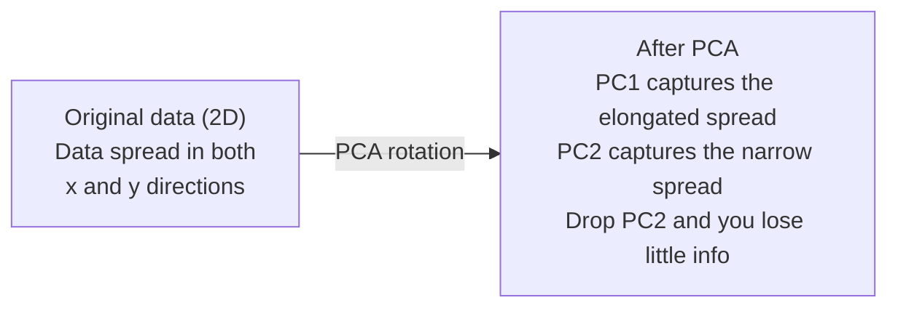

# 降维

> 高维数据自有其结构。你需要从正确的角度观察，才能发现它。

**Type:** 构建
**Language:** Python
**Prerequisites:** 第 1 阶段，第 01 课（Linear Algebra Intuition）、第 02 课（Vectors, Matrices & Operations）、第 03 课（Eigenvalues & Eigenvectors）以及第 06 课（Probability & Distributions）
**Time:** 约 90 分钟

## 学习目标

- 从零实现 PCA：数据中心化、计算协方差矩阵、特征分解并投影
- 使用解释方差比和肘部法选择主成分数量
- 比较 PCA、t-SNE 和 UMAP 对 MNIST 数字进行二维可视化时的表现，并解释各自取舍
- 使用带 RBF 核的核 PCA（Kernel PCA），分离标准 PCA 无法处理的非线性数据结构

## 问题

假设你的数据集中每个样本都有 784 个特征。它们可能是手写数字的像素值、基因表达水平，也可能是用户行为信号。你无法把 784 个维度画出来，也无法真正凭直觉思考它们。

但这 784 个特征大多存在冗余，真正的信息位于一个小得多的曲面上。描述一个手写数字“7”并不需要 784 个相互独立的数字，只需要少数几个因素：笔画角度、横线长度、倾斜程度，其余大多是噪声。

降维会找到这个较小的曲面。它把 784 维数据压缩到 2、10 或 50 维，同时保留真正重要的结构。

## 核心概念

### 维度灾难

高维空间不符合人的直觉。随着维度增加，有三件事会失效。

**距离失去意义。**在高维空间中，任意两个随机点之间的距离会趋近同一个数值。如果每个点到其他点的距离都差不多，最近邻搜索就无法正常工作。

```
Dimension    Avg distance ratio (max/min between random points)
2            ~5.0
10           ~1.8
100          ~1.2
1000         ~1.02
```

**体积集中在角落。**d 维单位超立方体有 2^d 个角。在 100 维空间中，几乎所有体积都位于远离中心的角落。数据点会分散到边缘，空间内部的数据密度则变得极低。

**需要指数级更多的数据。**为了维持相同的样本密度，从二维增加到二十维，就需要多 10^18 倍的数据。现实中永远不会有足够的数据。降低维度能够把数据密度恢复到可用水平。

### PCA：寻找真正重要的方向

主成分分析（PCA）会找到数据变化最大的轴。它旋转坐标系，让第一条轴捕获最多方差，第二条轴捕获次多方差，依此类推。

算法步骤：

```
1. Center the data        (subtract the mean from each feature)
2. Compute covariance     (how features move together)
3. Eigendecomposition     (find the principal directions)
4. Sort by eigenvalue     (biggest variance first)
5. Project               (keep top k eigenvectors, drop the rest)
```

为什么要做特征分解？协方差矩阵是对称半正定矩阵，其特征向量是特征空间中的正交方向，特征值则表示每个方向捕获了多少方差。最大特征值对应的特征向量，指向方差最大的方向。



- **PCA 之前：**数据云沿对角方向同时分布在 x 轴和 y 轴上
- **PCA 之后：**坐标系被旋转，PC1 与最大方差方向（较长的延伸方向）对齐，PC2 与最小方差方向（较窄的延伸方向）对齐
- **降维：**丢弃 PC2 会把数据投影到 PC1 上，只损失很少的信息

### 解释方差比

每个主成分都捕获总方差的一部分。解释方差比会告诉你该部分有多大。

```
Component    Eigenvalue    Explained ratio    Cumulative
PC1          4.73          0.473              0.473
PC2          2.51          0.251              0.724
PC3          1.12          0.112              0.836
PC4          0.89          0.089              0.925
...
```

当累计解释方差达到 0.95 时，你就知道这些主成分已经捕获了 95% 的信息，后面的部分大多是噪声。

### 选择主成分数量

有三种策略：

1. **阈值法。**保留足够多的主成分，使其解释 90%–95% 的方差。
2. **肘部法。**绘制每个主成分的解释方差，寻找曲线明显变缓的位置。
3. **下游性能。**把 PCA 用作预处理，扫描不同的 k 并测量模型准确率。准确率进入平台期的位置，就是合适的 k。

### t-SNE：保留邻域关系

t-Distributed Stochastic Neighbor Embedding（t-SNE）专为可视化而设计。它把高维数据映射到二维（或三维），同时尽量保留点之间的近邻关系。

直观理解如下：先在原始空间中根据点间距离，计算所有点对的概率分布。相邻点获得较高概率，远距离点获得较低概率；然后寻找一种二维排列，使同样的概率关系尽量成立。这样，在 784 维空间中互为邻居的点，在二维空间中仍会靠近。

t-SNE 的关键性质：
- 非线性，可以展开 PCA 无法处理的复杂流形
- 具有随机性，不同运行会产生不同布局
- perplexity 参数控制需要考虑多少个邻居，典型范围为 5–50
- 输出中不同簇之间的距离没有意义，只有簇本身有意义
- 在大型数据集上速度较慢，默认复杂度为 O(n^2)

### UMAP：速度更快，全局结构更好

Uniform Manifold Approximation and Projection（UMAP）的工作方式与 t-SNE 类似，但有两个优势：
- 速度更快：它使用近似最近邻图，而不是计算全部点对距离
- 全局结构更好：输出中不同簇的相对位置，通常比 t-SNE 更有意义

UMAP 会在高维空间中构建加权图，也就是“模糊拓扑表示”，然后寻找一种尽可能保留该图结构的低维布局。

关键参数：
- `n_neighbors`：用多少个邻居定义局部结构，作用类似 perplexity；值越高，保留的全局结构越多
- `min_dist`：输出中的点可以聚得多紧；值越低，形成的簇越密集

### 应该使用哪一种方法

| 方法 | 使用场景 | 保留内容 | 速度 |
|--------|----------|-----------|-------|
| PCA | 训练前预处理 | 全局方差 | 快（精确），可处理数百万样本 |
| PCA | 快速探索性可视化 | 线性结构 | 快 |
| t-SNE | 出版级二维图 | 局部邻域 | 慢（理想样本数 < 10k） |
| UMAP | 大规模二维可视化 | 局部结构 + 部分全局结构 | 中等（可处理数百万样本） |
| PCA | 为模型减少特征 | 按方差排序的特征 | 快 |
| t-SNE / UMAP | 理解簇结构 | 簇的分离情况 | 中等到慢 |

经验法则：预处理和数据压缩使用 PCA；需要在二维空间中观察结构时，使用 t-SNE 或 UMAP。

### 核 PCA（Kernel PCA）

标准 PCA 寻找线性子空间，它只是旋转坐标系并丢弃部分轴。但如果数据位于非线性流形上呢？二维平面中的圆无法被任何直线分开，标准 PCA 对此无能为力。

Kernel PCA 会在核函数诱导的高维特征空间中执行 PCA，却不显式计算该空间中的坐标。这就是核技巧，与 SVM 背后的思想相同。

算法步骤：
1. 计算核矩阵 K，其中 K_ij = k(x_i, x_j)
2. 在特征空间中对核矩阵中心化
3. 对中心化后的核矩阵进行特征分解
4. 最大的几个特征向量（按 1/sqrt(eigenvalue) 缩放）就是投影结果

常见核函数：

| 核函数 | 公式 | 适用场景 |
|--------|---------|----------|
| RBF（Gaussian） | exp(-gamma * \|\|x - y\|\|^2) | 大多数非线性数据、平滑流形 |
| Polynomial | (x . y + c)^d | 多项式关系 |
| Sigmoid | tanh(alpha * x . y + c) | 类似神经网络的映射 |

何时选择 Kernel PCA 而不是标准 PCA：

| 判断标准 | 标准 PCA | Kernel PCA |
|-----------|-------------|------------|
| 数据结构 | 线性子空间 | 非线性流形 |
| 速度 | O(min(n^2 d, d^2 n)) | O(n^2 d + n^3) |
| 可解释性 | 主成分是特征的线性组合 | 主成分无法直接对应原始特征 |
| 可扩展性 | 可处理数百万样本 | 核矩阵大小为 n x n，受内存限制 |
| 重建 | 可直接进行逆变换 | 需要近似求解原像 |

经典示例是二维同心圆：两圈点，一圈在内、一圈在外。标准 PCA 会把两圈投影到同一条直线上，对分类毫无帮助；带 RBF 核的 Kernel PCA 会把内圈和外圈映射到不同区域，使它们线性可分。

### 重建误差

如何判断降维效果好不好？将 784 维压缩为 50 维后，你究竟损失了什么？

重建误差的计算步骤：
1. 把数据投影到 k 维：X_reduced = X @ W_k
2. 重建数据：X_hat = X_reduced @ W_k^T
3. 计算 MSE：mean((X - X_hat)^2)

对于 PCA，重建误差与解释方差之间具有简洁的关系：

```
Reconstruction error = sum of eigenvalues NOT included
Total variance = sum of ALL eigenvalues
Fraction lost = (sum of dropped eigenvalues) / (sum of all eigenvalues)
```

每个主成分的解释方差比为：

```
explained_ratio_k = eigenvalue_k / sum(all eigenvalues)
```

把累计解释方差随主成分数量变化的曲线画出来，就会得到“肘部”曲线。选择主成分数量时，应观察：
- 曲线开始变平的位置（边际收益递减）
- 累计方差超过目标阈值的位置（通常为 0.90 或 0.95）
- 下游任务性能进入平台期的位置

重建误差不仅能用于选择 k，还可以用于异常检测：重建误差较高的样本无法很好地落在学习到的子空间中，因此更可能是异常值。生产系统中的 PCA 异常检测正是基于这一原理。

```figure
pca-axes
```

## 动手构建

### 第 1 步：从零实现 PCA

```python
import numpy as np

class PCA:
    def __init__(self, n_components):
        self.n_components = n_components
        self.components = None
        self.mean = None
        self.eigenvalues = None
        self.explained_variance_ratio_ = None

    def fit(self, X):
        self.mean = np.mean(X, axis=0)
        X_centered = X - self.mean

        cov_matrix = np.cov(X_centered, rowvar=False)

        eigenvalues, eigenvectors = np.linalg.eigh(cov_matrix)

        sorted_idx = np.argsort(eigenvalues)[::-1]
        eigenvalues = eigenvalues[sorted_idx]
        eigenvectors = eigenvectors[:, sorted_idx]

        self.components = eigenvectors[:, :self.n_components].T
        self.eigenvalues = eigenvalues[:self.n_components]
        total_var = np.sum(eigenvalues)
        self.explained_variance_ratio_ = self.eigenvalues / total_var

        return self

    def transform(self, X):
        X_centered = X - self.mean
        return X_centered @ self.components.T

    def fit_transform(self, X):
        self.fit(X)
        return self.transform(X)
```

### 第 2 步：使用合成数据测试

```python
np.random.seed(42)
n_samples = 500

t = np.random.uniform(0, 2 * np.pi, n_samples)
x1 = 3 * np.cos(t) + np.random.normal(0, 0.2, n_samples)
x2 = 3 * np.sin(t) + np.random.normal(0, 0.2, n_samples)
x3 = 0.5 * x1 + 0.3 * x2 + np.random.normal(0, 0.1, n_samples)

X_synthetic = np.column_stack([x1, x2, x3])

pca = PCA(n_components=2)
X_reduced = pca.fit_transform(X_synthetic)

print(f"Original shape: {X_synthetic.shape}")
print(f"Reduced shape:  {X_reduced.shape}")
print(f"Explained variance ratios: {pca.explained_variance_ratio_}")
print(f"Total variance captured: {sum(pca.explained_variance_ratio_):.4f}")
```

### 第 3 步：把 MNIST 数字映射到二维

```python
from sklearn.datasets import fetch_openml

mnist = fetch_openml("mnist_784", version=1, as_frame=False, parser="auto")
X_mnist = mnist.data[:5000].astype(float)
y_mnist = mnist.target[:5000].astype(int)

pca_mnist = PCA(n_components=50)
X_pca50 = pca_mnist.fit_transform(X_mnist)
print(f"50 components capture {sum(pca_mnist.explained_variance_ratio_):.2%} of variance")

pca_2d = PCA(n_components=2)
X_pca2d = pca_2d.fit_transform(X_mnist)
print(f"2 components capture {sum(pca_2d.explained_variance_ratio_):.2%} of variance")
```

### 第 4 步：与 sklearn 对比

```python
from sklearn.decomposition import PCA as SklearnPCA
from sklearn.manifold import TSNE

sklearn_pca = SklearnPCA(n_components=2)
X_sklearn_pca = sklearn_pca.fit_transform(X_mnist)

print(f"\nOur PCA explained variance:     {pca_2d.explained_variance_ratio_}")
print(f"Sklearn PCA explained variance: {sklearn_pca.explained_variance_ratio_}")

diff = np.abs(np.abs(X_pca2d) - np.abs(X_sklearn_pca))
print(f"Max absolute difference: {diff.max():.10f}")

tsne = TSNE(n_components=2, perplexity=30, random_state=42)
X_tsne = tsne.fit_transform(X_mnist)
print(f"\nt-SNE output shape: {X_tsne.shape}")
```

### 第 5 步：与 UMAP 对比

```python
try:
    from umap import UMAP

    reducer = UMAP(n_components=2, n_neighbors=15, min_dist=0.1, random_state=42)
    X_umap = reducer.fit_transform(X_mnist)
    print(f"UMAP output shape: {X_umap.shape}")
except ImportError:
    print("Install umap-learn: pip install umap-learn")
```

## 实际使用

把 PCA 用作分类器的预处理步骤：

```python
from sklearn.decomposition import PCA as SklearnPCA
from sklearn.linear_model import LogisticRegression
from sklearn.model_selection import train_test_split
from sklearn.metrics import accuracy_score

X_train, X_test, y_train, y_test = train_test_split(
    X_mnist, y_mnist, test_size=0.2, random_state=42
)

results = {}
for k in [10, 30, 50, 100, 200]:
    pca_k = SklearnPCA(n_components=k)
    X_tr = pca_k.fit_transform(X_train)
    X_te = pca_k.transform(X_test)

    clf = LogisticRegression(max_iter=1000, random_state=42)
    clf.fit(X_tr, y_train)
    acc = accuracy_score(y_test, clf.predict(X_te))
    var_captured = sum(pca_k.explained_variance_ratio_)
    results[k] = (acc, var_captured)
    print(f"k={k:>3d}  accuracy={acc:.4f}  variance={var_captured:.4f}")
```

模型性能会在远低于 784 维时进入平台期，这个平台期就是你的实际工作点。

## 交付成果

本课会产出：
- `outputs/skill-dimensionality-reduction.md`——帮助你针对具体任务选择合适降维技术的技能

## 练习

1. 扩展 PCA 类以支持 `inverse_transform`。分别使用 10、50 和 200 个主成分重建 MNIST 数字，并输出每种配置的重建误差（与原始数据之间的均方差）。

2. 在同一个 MNIST 子集上运行 t-SNE，并分别把 perplexity 设置为 5、30 和 100。描述输出如何变化，并解释 perplexity 为什么会影响簇的紧密程度。

3. 创建一个包含 50 个特征、但只有 5 个特征真正有信息的数据集（使用 `sklearn.datasets.make_classification` 生成）。应用 PCA，并检查解释方差曲线能否正确识别出数据实际上只有 5 个有效维度。

## 关键术语

| 术语 | 人们常说 | 准确含义 |
|------|----------------|----------------------|
| Curse of dimensionality | “特征太多” | 随着维度增加，距离、体积和数据密度都会出现反直觉行为，模型需要指数级更多的数据作为补偿 |
| PCA | “减少维度” | 旋转坐标系，使坐标轴与方差最大的方向对齐，然后丢弃低方差轴 |
| Principal component | “重要方向” | 协方差矩阵的特征向量，也就是数据在特征空间中变化最大的方向 |
| Explained variance ratio | “该主成分包含多少信息” | 一个主成分捕获的总方差比例；把前 k 个比例求和，可判断 k 个主成分保留了多少信息 |
| Covariance matrix | “特征如何相关” | 对称矩阵，其中第 (i,j) 个元素衡量特征 i 与特征 j 如何共同变化，对角线元素是各特征的方差 |
| t-SNE | “那张簇图” | 通过保留点对邻域概率，把高维数据映射到二维的非线性方法；适合可视化，不适合预处理 |
| UMAP | “更快的 t-SNE” | 基于拓扑数据分析的非线性方法，既保留局部结构，也保留部分全局结构，扩展性优于 t-SNE |
| Perplexity | “t-SNE 的一个旋钮” | 控制每个点考虑的有效邻居数量；低 perplexity 聚焦非常局部的结构，高 perplexity 捕获更广泛的模式 |
| Manifold | “数据所在的曲面” | 嵌入高维空间中的低维曲面；一张在三维空间中揉皱的纸就是二维流形 |

## 延伸阅读

- [主成分分析教程](https://arxiv.org/abs/1404.1100)（Shlens）——从基础出发清晰推导 PCA
- [如何正确使用 t-SNE](https://distill.pub/2016/misread-tsne/)（Wattenberg 等）——t-SNE 常见陷阱与参数选择的交互式指南
- [UMAP 文档](https://umap-learn.readthedocs.io/)——UMAP 作者提供的理论与实践指南
