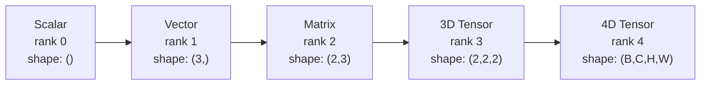
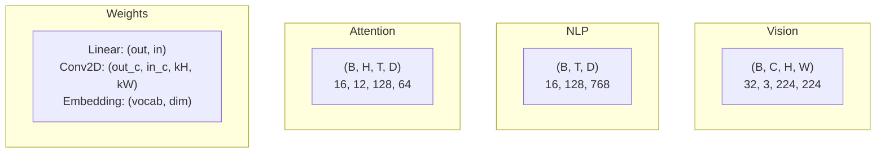
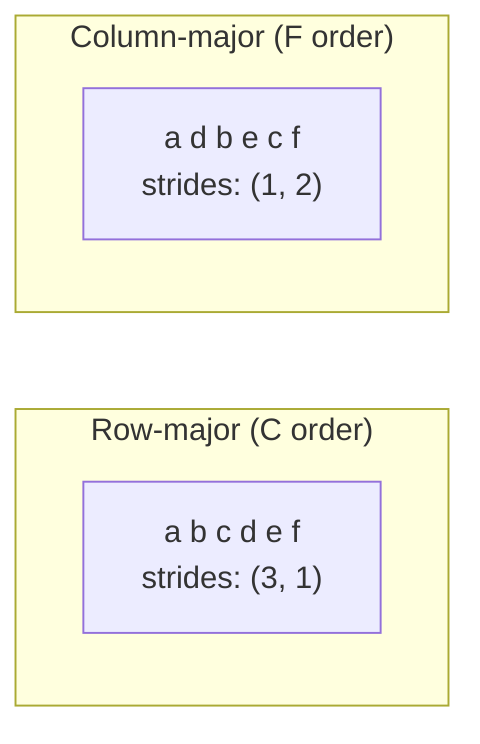
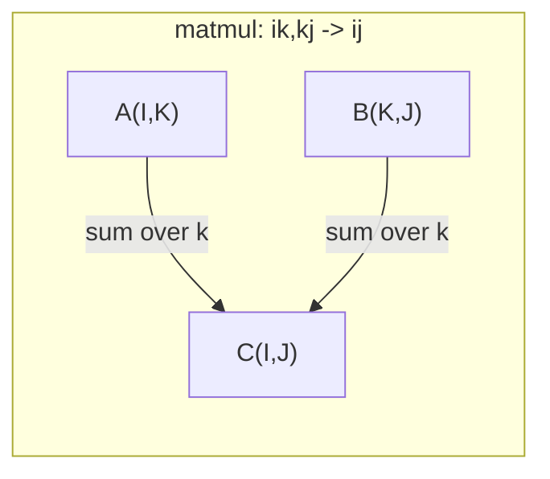

# 张量运算

> 张量是数据与深度学习之间的通用语言。每张图像、每个句子和每份梯度都会流经张量。

**Type:** 构建
**Language:** Python
**Prerequisites:** 第 1 阶段，第 01 课（Linear Algebra Intuition）和第 02 课（Vectors, Matrices & Operations）
**Time:** 约 90 分钟

## 学习目标

- 从零实现一个支持形状、步幅、reshape、transpose 和逐元素运算的张量类
- 应用广播规则，在不复制数据的情况下操作不同形状的张量
- 为点积、矩阵乘法、外积和批量运算编写 einsum 表达式
- 追踪多头注意力每一步的准确张量形状

## 问题

你构建了一个 Transformer，前向传播看起来很整洁。运行后却收到：`RuntimeError: mat1 and mat2 shapes cannot be multiplied (32x768 and 512x768)`。你盯着形状看了一会儿，尝试做一次转置，结果又收到 `Expected 4D input (got 3D input)`。你加了一个 unsqueeze，其他地方又坏了。

形状错误是深度学习代码中最常见的缺陷。它在概念上并不困难——每个运算都有明确的形状契约——但会快速叠加。Transformer 会串联几十次 reshape、transpose 和 broadcast，一个轴出错，就会产生连锁反应。更糟的是，有些形状错误根本不会抛出异常，而是沿错误维度广播或在错误轴上求和，悄无声息地产生垃圾结果。

矩阵只能表达两组对象之间的两两关系，真实数据却无法都塞进二维结构。一个包含 32 张 224x224 RGB 图像的 batch 是四维张量：`(32, 3, 224, 224)`。包含 12 个头的 self-attention 也是四维张量：`(batch, heads, seq_len, head_dim)`。你需要一种能够推广到任意维数、并且在各维度上自然组合运算的数据结构，这就是张量。掌握张量运算后，形状错误会变得非常容易调试。

## 核心概念

### 什么是张量

张量是具有统一数据类型的多维数字数组。维度数量称为 **rank**（秩）或 **order**（阶），每个维度称为一个 **axis**（轴），**shape**（形状）则是列出每条轴大小的元组。



元素总数等于所有维度大小的乘积。形状 `(2, 3, 4)` 包含 `2 * 3 * 4 = 24` 个元素。

### 深度学习中的张量形状

按照惯例，不同数据类型会映射到特定的张量形状。



PyTorch 使用 NCHW（通道在前），TensorFlow 默认使用 NHWC（通道在后）。布局不匹配会造成静默的性能下降或直接报错。

### 内存布局的工作方式

二维数组在内存中实际上是一维字节序列。**Strides**（步幅）告诉你：沿每条轴前进一步，需要跳过多少个元素。



转置不会移动数据，只会交换步幅。这会使张量变成 **non-contiguous**（非连续）：逻辑上属于同一行的元素，在内存中不再相邻。

### 广播规则

广播允许你在不复制数据的情况下操作不同形状的张量。对齐时从右侧开始；两个维度相等，或者其中一个为 1 时，它们才兼容。维度数量较少的形状，会在左侧补 1。

```
Tensor A:     (8, 1, 6, 1)
Tensor B:        (7, 1, 5)
Padded B:     (1, 7, 1, 5)
Result:       (8, 7, 6, 5)
```

### Einsum：通用张量运算

Einstein 求和约定使用字母标记每条轴。出现在输入中却没有出现在输出中的轴会被求和；同时出现在输入和输出中的轴则会保留。



常用模式包括：`i,i->`（点积）、`i,j->ij`（外积）、`ii->`（迹）、`ij->ji`（转置）、`bij,bjk->bik`（批量矩阵乘法）和 `bhtd,bhsd->bhts`（注意力分数）。

```figure
tensor-broadcast
```

## 动手构建

代码位于 `code/tensors.py`，下面每个步骤都对应其中的实现。

### 第 1 步：张量存储与步幅

张量会保存一维数字列表和形状元数据。索引逻辑使用步幅，将多维索引映射到一维位置。

```python
class Tensor:
    def __init__(self, data, shape=None):
        if isinstance(data, (list, tuple)):
            self._data, self._shape = self._flatten_nested(data)
        elif isinstance(data, np.ndarray):
            self._data = data.flatten().tolist()
            self._shape = tuple(data.shape)
        else:
            self._data = [data]
            self._shape = ()

        if shape is not None:
            total = reduce(lambda a, b: a * b, shape, 1)
            if total != len(self._data):
                raise ValueError(
                    f"Cannot reshape {len(self._data)} elements into shape {shape}"
                )
            self._shape = tuple(shape)

        self._strides = self._compute_strides(self._shape)

    @staticmethod
    def _compute_strides(shape):
        if len(shape) == 0:
            return ()
        strides = [1] * len(shape)
        for i in range(len(shape) - 2, -1, -1):
            strides[i] = strides[i + 1] * shape[i + 1]
        return tuple(strides)
```

对于形状 `(3, 4)`，步幅为 `(4, 1)`：前进一行需要跳过 4 个元素，前进一列需要跳过 1 个元素。

### 第 2 步：Reshape、squeeze 与 unsqueeze

Reshape 会改变形状，但不改变元素顺序。元素总数必须保持不变。可以把某一个维度写成 `-1`，让程序自动推断它的大小。

```python
t = Tensor(list(range(12)), shape=(2, 6))
r = t.reshape((3, 4))
r = t.reshape((-1, 3))
```

Squeeze 会移除大小为 1 的轴，unsqueeze 则插入一个轴。Unsqueeze 对广播非常重要：要把偏置向量 `(D,)` 加到 batch `(B, T, D)` 上，需要先将它扩展为 `(1, 1, D)`。

```python
t = Tensor(list(range(6)), shape=(1, 3, 1, 2))
s = t.squeeze()
v = Tensor([1, 2, 3])
u = v.unsqueeze(0)
```

### 第 3 步：Transpose 与 permute

Transpose 交换两条轴，permute 则重新排列所有轴。它们可以用于在 NCHW 与 NHWC 之间转换。

```python
mat = Tensor(list(range(6)), shape=(2, 3))
tr = mat.transpose(0, 1)

t4d = Tensor(list(range(24)), shape=(1, 2, 3, 4))
perm = t4d.permute((0, 2, 3, 1))
```

执行 transpose 或 permute 后，张量在内存中会变得不连续。在 PyTorch 中，`view` 无法用于非连续张量；应改用 `reshape`，或者先调用 `.contiguous()`。

### 第 4 步：逐元素运算与归约

逐元素运算（加、乘、减）独立作用于每个元素，并保持形状不变。归约运算（sum、mean、max）则会折叠一条或多条轴。

```python
a = Tensor([[1, 2], [3, 4]])
b = Tensor([[10, 20], [30, 40]])
c = a + b
d = a * 2
s = a.sum(axis=0)
```

CNN 中的全局平均池化会把 `(B, C, H, W).mean(axis=[2, 3])` 变成 `(B, C)`。NLP 中的序列平均池化会把 `(B, T, D).mean(axis=1)` 变成 `(B, D)`。

### 第 5 步：使用 NumPy 广播

`demo_broadcasting_numpy()` 函数位于 `tensors.py` 中，展示了核心广播模式。

```python
activations = np.random.randn(4, 3)
bias = np.array([0.1, 0.2, 0.3])
result = activations + bias

images = np.random.randn(2, 3, 4, 4)
scale = np.array([0.5, 1.0, 1.5]).reshape(1, 3, 1, 1)
result = images * scale

a = np.array([1, 2, 3]).reshape(-1, 1)
b = np.array([10, 20, 30, 40]).reshape(1, -1)
outer = a * b
```

使用广播计算两两距离：把 `(M, 2)` reshape 为 `(M, 1, 2)`，把 `(N, 2)` reshape 为 `(1, N, 2)`，然后相减、平方、沿最后一条轴求和并开平方。最终形状为 `(M, N)`。

### 第 6 步：Einsum 运算

`demo_einsum()` 和 `demo_einsum_gallery()` 函数会逐一演示常见模式。

```python
a = np.array([1.0, 2.0, 3.0])
b = np.array([4.0, 5.0, 6.0])
dot = np.einsum("i,i->", a, b)

A = np.array([[1, 2], [3, 4], [5, 6]], dtype=float)
B = np.array([[7, 8, 9], [10, 11, 12]], dtype=float)
matmul = np.einsum("ik,kj->ij", A, B)

batch_A = np.random.randn(4, 3, 5)
batch_B = np.random.randn(4, 5, 2)
batch_mm = np.einsum("bij,bjk->bik", batch_A, batch_B)
```

一次 contraction 的计算成本，等于所有索引（保留索引与求和索引）大小的乘积。对于 B=32、I=128、J=64、K=128 的 `bij,bjk->bik`：`32 * 128 * 64 * 128 = 33,554,432` 次乘加运算。

### 第 7 步：用 einsum 实现注意力机制

`demo_attention_einsum()` 函数端到端实现了多头注意力。

```python
B, H, T, D = 2, 4, 8, 16
E = H * D

X = np.random.randn(B, T, E)
W_q = np.random.randn(E, E) * 0.02

Q = np.einsum("bte,ek->btk", X, W_q)
Q = Q.reshape(B, T, H, D).transpose(0, 2, 1, 3)

scores = np.einsum("bhtd,bhsd->bhts", Q, K) / np.sqrt(D)
weights = softmax(scores, axis=-1)
attn_output = np.einsum("bhts,bhsd->bhtd", weights, V)

concat = attn_output.transpose(0, 2, 1, 3).reshape(B, T, E)
output = np.einsum("bte,ek->btk", concat, W_o)
```

每一步都是张量运算：投影（通过 einsum 完成矩阵乘法）、拆分注意力头（reshape + transpose）、计算注意力分数（通过 einsum 完成批量矩阵乘法）、加权求和（通过 einsum 完成批量矩阵乘法）、合并注意力头（transpose + reshape），以及输出投影（通过 einsum 完成矩阵乘法）。

## 实际使用

### 从零实现与 NumPy 的对照

| 运算 | 从零实现（Tensor 类） | NumPy |
|---|---|---|
| 创建 | `Tensor([[1,2],[3,4]])` | `np.array([[1,2],[3,4]])` |
| Reshape | `t.reshape((3,4))` | `a.reshape(3,4)` |
| Transpose | `t.transpose(0,1)` | `a.T` 或 `a.transpose(0,1)` |
| Squeeze | `t.squeeze(0)` | `np.squeeze(a, 0)` |
| Sum | `t.sum(axis=0)` | `a.sum(axis=0)` |
| Einsum | 不支持 | `np.einsum("ij,jk->ik", a, b)` |

### 从零实现与 PyTorch 的对照

```python
import torch

t = torch.tensor([[1, 2, 3], [4, 5, 6]], dtype=torch.float32)
t.shape
t.stride()
t.is_contiguous()

t.reshape(3, 2)
t.unsqueeze(0)
t.transpose(0, 1)
t.transpose(0, 1).contiguous()

torch.einsum("ik,kj->ij", A, B)
```

PyTorch 在此基础上增加了自动微分、GPU 支持和优化的 BLAS 内核，但形状语义完全相同。理解从零实现的版本后，PyTorch 的形状错误就会变得容易阅读。

### 把每个神经网络层理解为张量运算

| 运算 | 张量形式 | Einsum |
|---|---|---|
| 线性层 | `Y = X @ W.T + b` | `"bd,od->bo"` + bias |
| Attention QKV | `Q = X @ W_q` | `"btd,dh->bth"` |
| 注意力分数 | `Q @ K.T / sqrt(d)` | `"bhtd,bhsd->bhts"` |
| 注意力输出 | `softmax(scores) @ V` | `"bhts,bhsd->bhtd"` |
| Batch norm | `(X - mu) / sigma * gamma` | 逐元素运算 + 广播 |
| Softmax | `exp(x) / sum(exp(x))` | 逐元素运算 + 归约 |

## 交付成果

本课会产出两份可复用提示词：

1. **`outputs/prompt-tensor-shapes.md`**——用于系统调试张量形状不匹配，包含常见运算（matmul、broadcast、cat、Linear、Conv2d、BatchNorm、softmax）的决策表和修复查找表。

2. **`outputs/prompt-tensor-debugger.md`**——遇到形状错误时可粘贴给任意 AI 助手的分步调试提示词。提供错误消息和张量形状后，它会返回准确修复方式。

## 练习

1. **简单——Reshape 往返。**取一个形状为 `(2, 3, 4)` 的张量，依次 reshape 为 `(6, 4)`、`(24,)`，再变回 `(2, 3, 4)`。打印平坦数据，验证每一步的元素顺序都保持不变。

2. **中等——实现广播。**为 `Tensor` 类添加 `broadcast_to(shape)` 方法，将大小为 1 的维度扩展到目标形状；再修改 `_elementwise_op`，使它在运算前自动广播。用形状 `(3, 1)` 和 `(1, 4)` 进行测试，结果应为 `(3, 4)`。

3. **困难——从零构建 einsum。**实现基础 `einsum(subscripts, *tensors)` 函数，至少支持点积（`i,i->`）、矩阵乘法（`ij,jk->ik`）、外积（`i,j->ij`）和转置（`ij->ji`）。解析下标字符串，找出 contraction 索引，并遍历全部索引组合。将结果与 `np.einsum` 比较。

4. **困难——注意力形状追踪器。**编写一个函数，接收 `batch_size`、`seq_len`、`embed_dim` 和 `num_heads`，输出多头注意力每一步的准确形状：输入、Q/K/V 投影、拆分注意力头、注意力分数、softmax 权重、加权求和、合并注意力头和输出投影。与 `demo_attention_einsum()` 的输出进行验证。

## 关键术语

| 术语 | 人们常说 | 准确含义 |
|---|---|---|
| Tensor | “维数更多的矩阵” | 具有统一类型、确定形状、步幅和运算的多维数组 |
| Rank | “维度数量” | 轴的数量；矩阵的张量 rank 为 2，不要与矩阵秩混淆 |
| Shape | “张量的大小” | 列出每条轴大小的元组；`(2, 3)` 表示 2 行、3 列 |
| Stride | “内存如何排列” | 沿某条轴前进一步时，需要在内存中跳过的元素数量 |
| Broadcasting | “形状不同也能直接工作” | 一套严格规则：从右侧对齐，各维度必须相等或其中一个为 1 |
| Contiguous | “张量是正常的” | 元素按照逻辑布局连续存储在内存中，没有空隙或重排 |
| Einsum | “矩阵乘法的高级写法” | 能用一行表达任意张量 contraction、外积、迹或转置的通用记法 |
| View | “与 reshape 一样” | 共享同一个内存缓冲区、但拥有不同形状/步幅元数据的张量；非连续数据无法创建 view |
| Contraction | “沿某个索引求和” | 将张量间共享索引对应的元素相乘并求和，得到较低 rank 结果的通用运算 |
| NCHW / NHWC | “PyTorch 与 TensorFlow 格式” | 图像张量的内存布局约定；NCHW 把通道放在空间维度之前，NHWC 则放在之后 |

## 延伸阅读

- [NumPy 广播](https://numpy.org/doc/stable/user/basics.broadcasting.html)——包含可视化示例的权威规则
- [PyTorch 张量视图](https://pytorch.org/docs/stable/tensor_view.html)——何时可以使用 view，以及何时会发生复制
- [einops](https://github.com/arogozhnikov/einops)——让张量 reshape 更易读、更安全的库
- [图解 Transformer](https://jalammar.github.io/illustrated-transformer/)——可视化注意力机制中流动的张量形状
- [NumPy 中的 Einstein 求和](https://numpy.org/doc/stable/reference/generated/numpy.einsum.html)——包含示例的完整 einsum 文档
