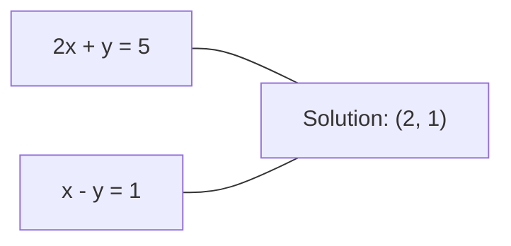
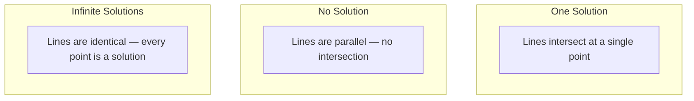

# 线性方程组

> 求解 Ax = b 是数学中最古老的问题之一，却至今仍在驱动你的神经网络。

**Type:** 构建
**Language:** Python
**Prerequisites:** 第 1 阶段，第 01 课（Linear Algebra Intuition）、第 02 课（Vectors & Matrices）和第 03 课（Matrix Transformations）
**Time:** 约 2 小时

## 学习目标

- 使用带部分主元选择的 Gaussian 消元和回代求解 Ax = b
- 使用 LU、QR 和 Cholesky 分解矩阵，并说明各自适用的场景
- 推导最小二乘的正规方程，并将其与线性回归和 Ridge 回归联系起来
- 使用条件数诊断病态系统，并通过正则化提高稳定性

## 问题

每次训练线性回归时，你都在求解线性方程组；每次计算最小二乘拟合时，你也在求解线性方程组；每当神经网络层计算 `y = Wx + b` 时，它就在计算线性方程组的一侧。加入正则化时，你会修改这个系统；使用 Gaussian process 时，你会分解矩阵；为 Mahalanobis 距离求协方差矩阵的逆时，你仍在求解线性方程组。

方程 Ax = b 无处不在。A 是已知系数矩阵，b 是已知输出向量，x 是需要求出的未知向量。在线性回归中，A 是数据矩阵，b 是目标向量，x 是权重向量。整个模型可以归结为：寻找 x，使 Ax 尽可能接近 b。

本课会从零构建求解这一方程的主要方法。你将理解为什么有些方法速度快、另一些方法更稳定，为什么某些方法只适用于方阵，而另一些能够处理超定系统，也会理解矩阵的条件数为何决定你的答案是否值得信任。

## 核心概念

### Ax = b 的几何含义

线性方程组具有几何解释：每个方程定义一个超平面，所有超平面的交点（或交集）就是解。

```
2x + y = 5          Two lines in 2D.
x - y  = 1          They intersect at x=2, y=1.
```



会出现三种情况：



在矩阵形式中，“唯一解”表示 A 可逆；“无解”表示系统不相容；“无穷多解”表示 A 具有零空间。大多数机器学习问题属于“没有精确解”的情况，因为方程数量（数据点）多于未知数（参数），此时就需要最小二乘。

### 行视角与列视角

Ax = b 有两种理解方式。

**行视角。**A 的每一行定义一个方程，每个方程对应一个超平面，所有超平面的交点就是解。

**列视角。**A 的每一列都是一个向量，问题变成：A 的各列应按怎样的线性组合，才能得到 b？

```
A = | 2  1 |    b = | 5 |
    | 1 -1 |        | 1 |

Row picture: solve 2x + y = 5 and x - y = 1 simultaneously.

Column picture: find x1, x2 such that:
  x1 * [2, 1] + x2 * [1, -1] = [5, 1]
  2 * [2, 1] + 1 * [1, -1] = [4+1, 2-1] = [5, 1]   check.
```

列视角更加基础。如果 b 位于 A 的列空间内，方程组就有解；如果不在，则寻找列空间中距离 b 最近的点，这个点就是最小二乘解。

### Gaussian 消元

Gaussian 消元把 Ax = b 转换为上三角系统 Ux = c，再通过回代求解，是最直接的方法。

算法步骤：

```
1. For each column k (the pivot column):
   a. Find the largest entry in column k at or below row k (partial pivoting).
   b. Swap that row with row k.
   c. For each row i below k:
      - Compute multiplier m = A[i][k] / A[k][k]
      - Subtract m times row k from row i.
2. Back substitute: solve from the last equation upward.
```

示例：

```
Original:
| 2  1  1 | 8 |       R2 = R2 - (2)R1     | 2  1   1 |  8 |
| 4  3  3 |20 |  -->  R3 = R3 - (1)R1 --> | 0  1   1 |  4 |
| 2  3  1 |12 |                            | 0  2   0 |  4 |

                       R3 = R3 - (2)R2     | 2  1   1 |  8 |
                                       --> | 0  1   1 |  4 |
                                           | 0  0  -2 | -4 |

Back substitute:
  -2 * x3 = -4    -->  x3 = 2
  x2 + 2  = 4     -->  x2 = 2
  2*x1 + 2 + 2 = 8 --> x1 = 2
```

Gaussian 消元需要 O(n^3) 次运算。对于 1000x1000 系统，大约是十亿次浮点运算。它速度不慢，但如果需要使用同一个 A 求解多个系统，还可以做得更好。

### 部分主元选择为何重要

不选择主元时，Gaussian 消元可能失败或产生垃圾结果。主元为零时会发生除零；主元很小时，会放大舍入误差。

```
Bad pivot:                       With partial pivoting:
| 0.001  1 | 1.001 |            Swap rows first:
| 1      1 | 2     |            | 1      1 | 2     |
                                 | 0.001  1 | 1.001 |
m = 1/0.001 = 1000              m = 0.001/1 = 0.001
R2 = R2 - 1000*R1               R2 = R2 - 0.001*R1
| 0.001  1     | 1.001   |      | 1      1     | 2     |
| 0     -999   | -999.0  |      | 0      0.999 | 0.999 |

x2 = 1.000 (correct)            x2 = 1.000 (correct)
x1 = (1.001 - 1)/0.001          x1 = (2 - 1)/1 = 1.000 (correct)
   = 0.001/0.001 = 1.000        Stable because the multiplier is small.
```

在精度有限的浮点运算中，不选择主元的版本可能损失大量有效数字。部分主元选择会始终使用当前可选的最大元素作为主元，从而尽量减少误差放大。

### LU 分解

LU 分解把 A 分解为下三角矩阵 L 和上三角矩阵 U，即 A = LU。L 保存 Gaussian 消元时使用的乘子，U 则是消元结果。

```
A = L @ U

| 2  1  1 |   | 1  0  0 |   | 2  1   1 |
| 4  3  3 | = | 2  1  0 | @ | 0  1   1 |
| 2  3  1 |   | 1  2  1 |   | 0  0  -2 |
```

为什么要分解，而不是直接消元？因为一旦得到 L 和 U，针对任意新 b 求解 Ax = b 都只需 O(n^2)：

```
Ax = b
LUx = b
Let y = Ux:
  Ly = b    (forward substitution, O(n^2))
  Ux = y    (back substitution, O(n^2))
```

O(n^3) 成本只在分解时支付一次，后续每次求解都是 O(n^2)。如果需要对同一个 A、不同的 b 求解 1,000 个系统，LU 能让总工作量减少约 1000/3 倍。

加入部分主元选择后，会得到 PA = LU，其中 P 是记录行交换的置换矩阵。

### QR 分解

QR 分解把 A 分解为正交矩阵 Q 和上三角矩阵 R，即 A = QR。

正交矩阵满足 Q^T Q = I，其各列是标准正交向量。乘以 Q 会保持长度和角度。

```
A = Q @ R

Q has orthonormal columns: Q^T Q = I
R is upper triangular

To solve Ax = b:
  QRx = b
  Rx = Q^T b    (just multiply by Q^T, no inversion needed)
  Back substitute to get x.
```

求解最小二乘问题时，QR 在数值上比 LU 更稳定。Gram-Schmidt 过程会逐列构建 Q：

```
Given columns a1, a2, ... of A:

q1 = a1 / ||a1||

q2 = a2 - (a2 . q1) * q1        (subtract projection onto q1)
q2 = q2 / ||q2||                (normalize)

q3 = a3 - (a3 . q1) * q1 - (a3 . q2) * q2
q3 = q3 / ||q3||

R[i][j] = qi . aj    for i <= j
```

每一步都会去掉当前列在此前所有 q 向量上的分量，只留下新的正交方向。

### Cholesky 分解

当 A 对称（A = A^T）且正定（所有特征值均为正）时，可以写成 A = L L^T，其中 L 为下三角矩阵，这就是 Cholesky 分解。

```
A = L @ L^T

| 4  2 |   | 2  0 |   | 2  1 |
| 2  5 | = | 1  2 | @ | 0  2 |

L[i][i] = sqrt(A[i][i] - sum(L[i][k]^2 for k < i))
L[i][j] = (A[i][j] - sum(L[i][k]*L[j][k] for k < j)) / L[j][j]    for i > j
```

Cholesky 的速度约为 LU 的两倍，存储需求只有一半。它只能用于对称正定矩阵，但这类矩阵非常常见：

- 协方差矩阵是对称半正定的，加入正则化后可变为正定
- Gaussian process 的核矩阵是对称正定的
- 凸函数在最小值处的 Hessian 是对称正定的
- A^T A 始终是对称半正定的

在 Gaussian process 中，会先对核矩阵 K 做 Cholesky 分解，再求解 K alpha = y，以得到预测均值。Cholesky 因子还可以给出边际似然所需的对数行列式：log det(K) = 2 * sum(log(diag(L)))。

### 最小二乘：当 Ax = b 没有精确解

如果 A 是 m x n 矩阵，且 m > n（方程多于未知数），系统就是超定的，通常没有精确解。此时应最小化平方误差：

```
minimize ||Ax - b||^2

This is the sum of squared residuals:
  sum((A[i,:] @ x - b[i])^2 for i in range(m))
```

最小值满足正规方程：

```
A^T A x = A^T b
```

推导过程：展开 ||Ax - b||^2 = (Ax - b)^T (Ax - b) = x^T A^T A x - 2 x^T A^T b + b^T b；对 x 求梯度并令其为零，可得 2 A^T A x - 2 A^T b = 0。

```
Original system (overdetermined, 4 equations, 2 unknowns):
| 1  1 |         | 3 |
| 1  2 | x     = | 5 |       No exact x satisfies all 4 equations.
| 1  3 |         | 6 |
| 1  4 |         | 8 |

Normal equations:
A^T A = | 4  10 |    A^T b = | 22 |
        | 10 30 |            | 63 |

Solve: x = [1.5, 1.7]

This is linear regression. x[0] is the intercept, x[1] is the slope.
```

### 正规方程就是线性回归

二者的联系是严格等价的。在线性回归中，数据矩阵 X 每行对应一个样本，每列对应一个特征；目标向量 y 每个元素对应一个样本；权重向量 w 满足：

```
X^T X w = X^T y
w = (X^T X)^(-1) X^T y
```

这就是线性回归的闭式解。每次调用 `sklearn.linear_model.LinearRegression.fit()`，都会执行这一计算，或者使用 QR/SVD 等价求解。

向矩阵加入正则化项 lambda * I，就会得到 Ridge 回归：

```
(X^T X + lambda * I) w = X^T y
w = (X^T X + lambda * I)^(-1) X^T y
```

正则化会改善矩阵条件，使其更容易准确求逆；同时将权重推向零，防止过拟合。当 lambda > 0 时，X^T X + lambda * I 始终是对称正定矩阵，因此可以使用 Cholesky 求解。

### 伪逆（Moore-Penrose）

伪逆 A+ 把矩阵求逆推广到非方阵和奇异矩阵。对于任意矩阵 A：

```
x = A+ b

where A+ = V Sigma+ U^T    (computed via SVD)
```

Sigma+ 的构造方式是：将所有非零奇异值取倒数，再转置结果。如果 A = U Sigma V^T，则 A+ = V Sigma+ U^T。

```
A = U Sigma V^T        (SVD)

Sigma = | 5  0 |       Sigma+ = | 1/5  0  0 |
        | 0  2 |                | 0  1/2  0 |
        | 0  0 |

A+ = V Sigma+ U^T
```

伪逆会给出最小范数最小二乘解：
- 系统只有一个解时，A+ b 会给出该解
- 系统无解时，A+ b 会给出最小二乘解
- 系统有无穷多个解时，A+ b 会给出 ||x|| 最小的解

NumPy 的 `np.linalg.lstsq` 和 `np.linalg.pinv` 内部都使用 SVD。

### 条件数

条件数衡量解对输入微小变化有多敏感。矩阵 A 的条件数为：

```
kappa(A) = ||A|| * ||A^(-1)|| = sigma_max / sigma_min
```

其中 sigma_max 和 sigma_min 是最大与最小奇异值。

```
Well-conditioned (kappa ~ 1):        Ill-conditioned (kappa ~ 10^15):
Small change in b -->                Small change in b -->
small change in x                    huge change in x

| 2  0 |   kappa = 2/1 = 2          | 1   1          |   kappa ~ 10^15
| 0  1 |   safe to solve            | 1   1+10^(-15) |   solution is garbage
```

经验判断：
- kappa < 100：安全，解较准确
- kappa ~ 10^k：浮点运算大约会损失 k 位精度
- 对 float64 而言，kappa ~ 10^16：解已经没有意义，矩阵实际上接近奇异

机器学习中的病态问题常由特征近似共线引起。正则化（加入 lambda * I）会把条件数从 sigma_max / sigma_min 改善为 (sigma_max + lambda) / (sigma_min + lambda)。

### 迭代方法：共轭梯度

对于包含数百万未知数的大型稀疏系统，LU 或 Cholesky 等直接方法成本过高。迭代方法会通过多轮改进一个初始猜测，逐步近似真实解。

共轭梯度（CG）用于求解 A 对称正定时的 Ax = b。在精确算术下，它最多 n 次迭代就能找到精确解；如果 A 的特征值高度聚集，通常会更快收敛。

```
Algorithm sketch:
  x0 = initial guess (often zero)
  r0 = b - A x0           (residual)
  p0 = r0                 (search direction)

  For k = 0, 1, 2, ...:
    alpha = (rk . rk) / (pk . A pk)
    x_{k+1} = xk + alpha * pk
    r_{k+1} = rk - alpha * A pk
    beta = (r_{k+1} . r_{k+1}) / (rk . rk)
    p_{k+1} = r_{k+1} + beta * pk
    if ||r_{k+1}|| < tolerance: stop
```

CG 用于：
- 大规模优化（Newton-CG 方法）
- 求解 PDE 离散系统
- 核矩阵大到无法分解的核方法
- 作为其他迭代求解器的预条件方法

收敛速度取决于条件数；条件越好，收敛越快，这也是正则化有效的另一个原因。

### 全景：何时使用哪种方法

| 方法 | 要求 | 成本 | 使用场景 |
|--------|-------------|------|----------|
| Gaussian 消元 | A 为非奇异方阵 | O(n^3) | 一次性求解方形系统 |
| LU 分解 | A 为非奇异方阵 | O(n^3) 分解 + O(n^2) 求解 | 使用同一个 A 进行多次求解 |
| QR 分解 | 任意 A（m >= n） | O(mn^2) | 数值稳定的最小二乘 |
| Cholesky | A 对称正定 | O(n^3/3) | 协方差矩阵、Gaussian process、Ridge 回归 |
| 正规方程 | 超定系统（m > n） | O(mn^2 + n^3) | 线性回归（n 较小） |
| SVD / 伪逆 | 任意 A | O(mn^2) | 秩亏系统、最小范数解 |
| 共轭梯度 | A 对称正定且稀疏 | O(n * k * nnz) | 大型稀疏系统，k 为迭代次数 |

### 与机器学习的联系

本课的每种方法都会出现在生产级机器学习中：

**线性回归。**闭式解通过正规方程 X^T X w = X^T y 求解。n 较小时可使用 Cholesky；数值稳定性重要时使用 QR；矩阵可能秩亏时使用 SVD。

**Ridge 回归。**向 X^T X 加入 lambda * I。正则化系统 (X^T X + lambda * I) w = X^T y 始终可以使用 Cholesky 求解，因为 lambda > 0 时 X^T X + lambda * I 对称正定。

**Gaussian process。**预测均值需要求解 K alpha = y，其中 K 是核矩阵。标准做法是对 K 做 Cholesky 分解；对数边际似然使用 log det(K) = 2 sum(log(diag(L)))。

**神经网络初始化。**正交初始化使用 QR 分解，创建列向量标准正交的权重矩阵，防止信号在深层网络中坍缩。

**预条件。**大规模优化器会使用不完全 Cholesky 或不完全 LU，作为共轭梯度求解器的预条件器。

**特征工程。**X^T X 的条件数可以判断特征是否共线；如果 kappa 很大，应删除特征或添加正则化。

```figure
linear-system-conditioning
```

## 动手构建

### 第 1 步：带部分主元选择的 Gaussian 消元

```python
import numpy as np

def gaussian_elimination(A, b):
    n = len(b)
    Ab = np.hstack([A.astype(float), b.reshape(-1, 1).astype(float)])

    for k in range(n):
        max_row = k + np.argmax(np.abs(Ab[k:, k]))
        Ab[[k, max_row]] = Ab[[max_row, k]]

        if abs(Ab[k, k]) < 1e-12:
            raise ValueError(f"Matrix is singular or nearly singular at pivot {k}")

        for i in range(k + 1, n):
            m = Ab[i, k] / Ab[k, k]
            Ab[i, k:] -= m * Ab[k, k:]

    x = np.zeros(n)
    for i in range(n - 1, -1, -1):
        x[i] = (Ab[i, -1] - Ab[i, i+1:n] @ x[i+1:n]) / Ab[i, i]

    return x
```

### 第 2 步：LU 分解

```python
def lu_decompose(A):
    n = A.shape[0]
    L = np.eye(n)
    U = A.astype(float).copy()
    P = np.eye(n)

    for k in range(n):
        max_row = k + np.argmax(np.abs(U[k:, k]))
        if max_row != k:
            U[[k, max_row]] = U[[max_row, k]]
            P[[k, max_row]] = P[[max_row, k]]
            if k > 0:
                L[[k, max_row], :k] = L[[max_row, k], :k]

        for i in range(k + 1, n):
            L[i, k] = U[i, k] / U[k, k]
            U[i, k:] -= L[i, k] * U[k, k:]

    return P, L, U

def lu_solve(P, L, U, b):
    n = len(b)
    Pb = P @ b.astype(float)

    y = np.zeros(n)
    for i in range(n):
        y[i] = Pb[i] - L[i, :i] @ y[:i]

    x = np.zeros(n)
    for i in range(n - 1, -1, -1):
        x[i] = (y[i] - U[i, i+1:] @ x[i+1:]) / U[i, i]

    return x
```

### 第 3 步：Cholesky 分解

```python
def cholesky(A):
    n = A.shape[0]
    L = np.zeros_like(A, dtype=float)

    for i in range(n):
        for j in range(i + 1):
            s = A[i, j] - L[i, :j] @ L[j, :j]
            if i == j:
                if s <= 0:
                    raise ValueError("Matrix is not positive definite")
                L[i, j] = np.sqrt(s)
            else:
                L[i, j] = s / L[j, j]

    return L
```

### 第 4 步：通过正规方程求最小二乘

```python
def least_squares_normal(A, b):
    AtA = A.T @ A
    Atb = A.T @ b
    return gaussian_elimination(AtA, Atb)

def ridge_regression(A, b, lam):
    n = A.shape[1]
    AtA = A.T @ A + lam * np.eye(n)
    Atb = A.T @ b
    L = cholesky(AtA)
    y = np.zeros(n)
    for i in range(n):
        y[i] = (Atb[i] - L[i, :i] @ y[:i]) / L[i, i]
    x = np.zeros(n)
    for i in range(n - 1, -1, -1):
        x[i] = (y[i] - L.T[i, i+1:] @ x[i+1:]) / L.T[i, i]
    return x
```

### 第 5 步：条件数

```python
def condition_number(A):
    U, S, Vt = np.linalg.svd(A)
    return S[0] / S[-1]
```

## 实际使用

下面把各部分组合起来，在真实数据上进行线性回归和 Ridge 回归：

```python
np.random.seed(42)
X_raw = np.random.randn(100, 3)
w_true = np.array([2.0, -1.0, 0.5])
y = X_raw @ w_true + np.random.randn(100) * 0.1

X = np.column_stack([np.ones(100), X_raw])

w_ols = least_squares_normal(X, y)
print(f"OLS weights (ours):    {w_ols}")

w_np = np.linalg.lstsq(X, y, rcond=None)[0]
print(f"OLS weights (numpy):   {w_np}")
print(f"Max difference: {np.max(np.abs(w_ols - w_np)):.2e}")

w_ridge = ridge_regression(X, y, lam=1.0)
print(f"Ridge weights (ours):  {w_ridge}")

from sklearn.linear_model import Ridge
ridge_sk = Ridge(alpha=1.0, fit_intercept=False)
ridge_sk.fit(X, y)
print(f"Ridge weights (sklearn): {ridge_sk.coef_}")
```

## 交付成果

本课会产出：
- `code/linear_systems.py`，包含从零实现的 Gaussian 消元、LU 分解、Cholesky 分解、最小二乘和 Ridge 回归
- 一个可运行演示，证明正规方程与 sklearn 的 LinearRegression 会得到相同权重

## 练习

1. 求解方程组 `[[1,2,3],[4,5,6],[7,8,10]] x = [6, 15, 27]`，分别使用你的 Gaussian 消元、LU 求解器和 `np.linalg.solve`，验证三者的答案在浮点容差内一致。

2. 生成一个 50x5 随机矩阵 X，以及目标 y = X @ w_true + noise。分别使用正规方程、QR（通过 `np.linalg.qr`）、SVD（通过 `np.linalg.svd`）和 `np.linalg.lstsq` 求解 w，比较四种结果。测量 X^T X 的条件数，并解释它如何影响你对各方法的信任。

3. 让两列几乎完全相同，例如 column 2 = column 1 + 1e-10 * noise，构造一个接近奇异的矩阵。计算条件数，分别在不加和加入正则化（添加 0.01 * I）的情况下求解 Ax = b，比较解与残差，并解释正则化为何有帮助。

4. 为一个 100x100 随机对称正定矩阵实现共轭梯度算法，统计收敛到 1e-8 容差所需的迭代次数，并与最多 n 次迭代的理论上限比较。

5. 在大小为 10、50、200、500 的对称正定矩阵上，对 Cholesky 求解器、LU 求解器和 `np.linalg.solve` 计时并绘制结果，验证 Cholesky 大约比 LU 快两倍。

## 关键术语

| 术语 | 人们常说 | 准确含义 |
|------|----------------|----------------------|
| Linear system | “求解 x” | 一组线性方程 Ax = b；寻找 x，就是寻找经变换 A 后产生输出 b 的输入 |
| Gaussian elimination | “行化简” | 使用行运算系统地把对角线下方元素变为零，得到可通过回代求解的上三角系统，复杂度 O(n^3) |
| Partial pivoting | “交换行以保持稳定” | 在第 k 列消元前，将该列绝对值最大的行交换到主元位置，避免除以很小的数 |
| LU decomposition | “分解成两个三角矩阵” | 写成 A = LU，其中 L 为保存乘子的下三角矩阵，U 为消元后的上三角矩阵；把 O(n^3) 成本分摊到多次求解中 |
| QR decomposition | “正交分解” | 写成 A = QR，其中 Q 的列标准正交，R 为上三角矩阵；求解最小二乘时比 LU 更稳定 |
| Cholesky decomposition | “矩阵的平方根” | 对对称正定 A，写成 A = LL^T；成本只有 LU 的一半，用于协方差矩阵、核矩阵和 Ridge 回归 |
| Least squares | “无精确解时的最佳拟合” | 超定系统（方程数多于未知数）中，最小化平方残差和 ||Ax - b||^2 |
| Normal equations | “微积分捷径” | A^T A x = A^T b，即把 ||Ax - b||^2 的梯度设为零；这正是线性回归的闭式解 |
| Pseudoinverse | “非方阵的逆” | 通过 SVD 得到 A+ = V Sigma+ U^T，为任意方阵或矩形矩阵、奇异或非奇异矩阵给出最小范数最小二乘解 |
| Condition number | “答案有多可信” | kappa = sigma_max / sigma_min，衡量解对输入扰动的敏感程度；大约会损失 log10(kappa) 位精度 |
| Ridge regression | “正则化最小二乘” | 求解 (X^T X + lambda I) w = X^T y；加入 lambda I 可改善条件并让权重趋近零，防止过拟合 |
| Conjugate gradient | “大型矩阵的迭代 Ax=b” | 用于对称正定系统的迭代求解器，最多 n 步收敛，适合分解成本过高的大型稀疏系统 |
| Overdetermined system | “数据多于参数” | m x n 系统中 m > n，通常没有精确解；最小二乘会找到最佳近似，这是每个回归问题的情况 |
| Back substitution | “从下往上求解” | 给定上三角系统，先解最后一个方程，再向上代入，复杂度 O(n^2) |
| Forward substitution | “从上往下求解” | 给定下三角系统，先解第一个方程，再向下代入，复杂度 O(n^2)，用于 LU 求解中的 L 步 |

## 延伸阅读

- [MIT 18.06：线性代数](https://ocw.mit.edu/courses/18-06-linear-algebra-spring-2010/)（Gilbert Strang）——关于线性方程组和矩阵分解的经典课程
- [数值线性代数](https://people.maths.ox.ac.uk/trefethen/text.html)（Trefethen 与 Bau）——理解数值稳定性、条件数和算法失效原因的标准参考
- [矩阵计算](https://www.cs.cornell.edu/cv/GolubVanLoan4/golubandvanloan.htm)（Golub 与 Van Loan）——涵盖各种矩阵算法的百科全书式参考
- [3Blue1Brown：逆矩阵](https://www.3blue1brown.com/lessons/inverse-matrices)——从几何角度理解求解 Ax = b
