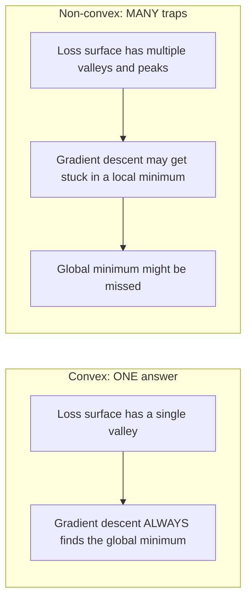
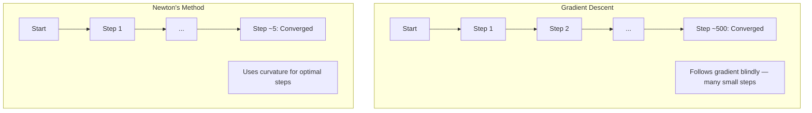
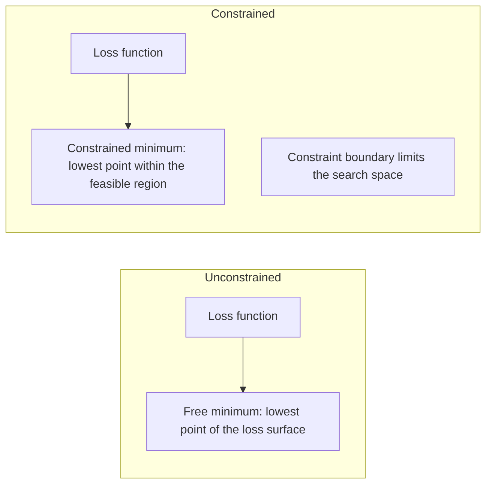
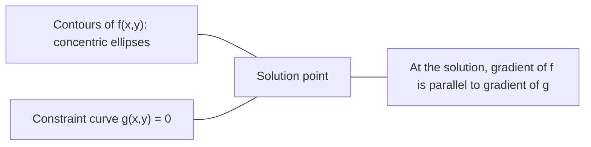

# 凸优化

> 凸问题只有一个山谷，神经网络却有数百万个。理解二者的区别十分重要。

**Type:** 构建
**Language:** Python
**Prerequisites:** 第 1 阶段，第 04 课（Calculus for ML）和第 08 课（Optimization）
**Time:** 约 90 分钟

## 学习目标

- 使用定义、二阶导数与 Hessian 判据检验函数是否凸
- 实现 Newton 方法，并将其二次收敛与梯度下降进行比较
- 使用 Lagrange 乘子求解约束优化问题，并解释 KKT 条件
- 解释神经网络损失曲面为何非凸，而 SGD 仍能找到良好解

## 问题

第 08 课介绍了梯度下降、动量和 Adam。这些优化器可以在任何曲面上沿下坡行走，却不给出任何保证。在非凸曲面上，梯度下降可能落入糟糕的局部最小值、卡在鞍点，或永远来回振荡。你仍然使用它，因为神经网络是非凸问题，没有其他普适选择。

但机器学习中的许多问题其实是凸的：线性回归、逻辑回归、SVM、LASSO、Ridge 回归。对于这些问题，存在更强的工具——带数学保证的优化。凸问题只有一个山谷，任何沿下坡移动的算法最终都会到达全局最小值。不需要随机重启，不需要学习率调度，也不需要祈祷。

理解凸性有三方面作用。第一，它告诉你问题是容易的（凸）还是困难的（非凸）。第二，它为凸问题提供 Newton 方法等更快工具。第三，它解释了贯穿机器学习的概念：把正则化理解为约束、SVM 中的对偶，以及深度学习为何能在不具备凸性良好性质的情况下仍然有效。

## 核心概念

### 凸集

如果集合 S 中任意两点之间的线段都完全位于 S 内，那么 S 是凸集。

| 凸集 | 非凸集 |
|---|---|
| **矩形**：内部任意两点的连线始终位于矩形内 | **星形/月牙形**：两个内部点之间的线段可能穿出集合 |
| **三角形**：所有内部点都满足相同性质 | **圆环**：中间的孔会让某些线段离开集合 |
| 任意两点之间的线段都留在集合内 | 某些点对之间的线段会离开集合 |

形式化判据：对 S 中任意点 x、y，以及任意 t in [0, 1]，点 tx + (1-t)y 仍属于 S。

凸集示例：
- 一条直线、一个平面、整个 R^n
- 一个球（圆、球体、超球体）
- 半空间：{x : a^T x <= b}
- 任意数量凸集的交集

非凸集示例：
- 圆环
- 两个互不相交圆的并集
- 任何带“凹口”或“孔洞”的集合

### 凸函数

如果函数 f 的定义域是凸集，并且对定义域内任意两点 x、y 以及任意 t in [0, 1]，都有：

```
f(tx + (1-t)y) <= t*f(x) + (1-t)*f(y)
```

那么 f 是凸函数。

从几何上看，函数图像上任意两点之间的线段，都位于图像上方或与图像重合。

| 性质 | 凸函数 | 非凸函数 |
|---|---|---|
| **线段判据** | 图像上任意两点之间的线段位于曲线**上方或与之重合** | 某些点之间的线段会落到曲线**下方** |
| **形状** | 单个开口向上的碗或山谷 | 多个峰谷，曲率方向混杂 |
| **局部最小值** | 每个局部最小值都是全局最小值 | 可能存在高度不同的多个局部最小值 |

常见凸函数：
- f(x) = x^2（抛物线）
- f(x) = |x|（绝对值）
- f(x) = e^x（指数函数）
- f(x) = max(0, x)（ReLU，虽然它是分段线性的）
- x > 0 时的 f(x) = -log(x)（负对数）
- 任意线性函数 f(x) = a^T x + b（同时为凸函数和凹函数）

### 检验凸性

有三种实用判据，从最简单到最严格排列如下。

**判据 1：二阶导数判据（一维）。**如果对所有 x 都有 f''(x) >= 0，那么 f 是凸函数。

- f(x) = x^2：f''(x) = 2 >= 0，为凸函数。
- f(x) = x^3：f''(x) = 6x，在 x < 0 时为负，不是凸函数。
- f(x) = e^x：f''(x) = e^x > 0，为凸函数。

**判据 2：Hessian 判据（多元）。**如果 Hessian 矩阵 H(x) 对所有 x 都是半正定矩阵，那么 f 是凸函数。Hessian 是由二阶偏导数组成的矩阵。

**判据 3：定义判据。**直接检查不等式 f(tx + (1-t)y) <= t*f(x) + (1-t)*f(y)。对于难以求导的函数，这一判据很实用。

### 凸性为何重要

凸优化的核心定理是：

**对于凸函数，每个局部最小值都是全局最小值。**

这意味着梯度下降不会被困住，任意下坡路径都会到达同一个答案，算法能够保证收敛到最优解。



由此得到：
- 不需要随机重启
- 不需要复杂的学习率调度
- 可以证明收敛性，收敛速度取决于函数性质
- 除平坦区域外，解是唯一的

### 机器学习中的凸问题与非凸问题

| 问题 | 是否凸 | 原因 |
|---------|---------|-----|
| 线性回归（MSE） | 是 | 损失关于权重是二次函数 |
| 逻辑回归 | 是 | 对数损失关于权重是凸的 |
| SVM（hinge loss） | 是 | 线性函数的最大值 |
| LASSO（L1 回归） | 是 | 凸函数之和仍是凸函数 |
| Ridge 回归（L2） | 是 | 二次函数 + 二次函数仍为凸函数 |
| 神经网络（任意损失） | 否 | 非线性激活产生非凸曲面 |
| k-means 聚类 | 否 | 包含离散分配步骤 |
| 矩阵分解 | 否 | 未知量彼此相乘 |

使用凸损失的线性模型是凸问题；一旦加入带非线性激活的隐藏层，凸性就会被破坏。

### Hessian 矩阵

函数 f: R^n -> R 的 Hessian H，是由二阶偏导数组成的 n x n 矩阵。

```
H[i][j] = d^2 f / (dx_i dx_j)
```

对于 f(x, y) = x^2 + 3xy + y^2：

```
df/dx = 2x + 3y       d^2f/dx^2 = 2      d^2f/dxdy = 3
df/dy = 3x + 2y       d^2f/dydx = 3      d^2f/dy^2 = 2

H = [ 2  3 ]
    [ 3  2 ]
```

Hessian 描述曲率：
- 所有特征值为正：函数在每个方向都向上弯曲，在该点为凸
- 所有特征值为负：函数在每个方向都向下弯曲，对应局部最大值
- 特征值有正有负：鞍点，在一些方向向上弯曲，在另一些方向向下弯曲
- 存在零特征值：对应方向平坦，属于退化情况

要证明函数凸，Hessian 必须在所有位置都半正定，而不能只检查某一个点。

### Newton 方法

梯度下降使用一阶信息（梯度），Newton 方法使用二阶信息（Hessian）。它会在当前位置拟合一个二次近似，并直接跳向这个二次函数的最小值。

```
Update rule:
  x_new = x - H^(-1) * gradient

Compare to gradient descent:
  x_new = x - lr * gradient
```

Newton 方法用逆 Hessian 取代标量学习率，根据局部曲率自动调整步长和方向。



优点：
- 接近最小值时二次收敛，每一步会把误差平方
- 无需调整学习率
- 对尺度不敏感，无论如何参数化问题都能工作

缺点：
- 计算 Hessian 需要 O(n^2) 内存，求逆需要 O(n^3) 时间
- 对含 100 万个权重的神经网络而言，需要存储 10^12 个元素并执行 10^18 次运算
- 不适用于深度学习

### 约束优化

无约束优化：在所有 x 中最小化 f(x)。
约束优化：在满足约束的 x 中最小化 f(x)。

真实问题总有约束。你想最小化成本，但预算有限；想最小化误差，但模型复杂度有上限。



### Lagrange 乘子

Lagrange 乘子法会把约束优化转换为无约束优化。

问题：在约束 g(x) = 0 下最小化 f(x)。

解法：引入新变量 Lagrange 乘子 lambda，并求解无约束问题：

```
L(x, lambda) = f(x) + lambda * g(x)
```

在解处，L 的梯度为零：

```
dL/dx = df/dx + lambda * dg/dx = 0
dL/dlambda = g(x) = 0
```

几何直觉是：在约束最小值处，f 的梯度必须与约束 g 的梯度平行。如果不平行，就可以沿约束曲面继续移动，使 f 进一步减小。



示例：在 x + y = 1 的约束下，最小化 f(x,y) = x^2 + y^2。

```
L = x^2 + y^2 + lambda(x + y - 1)

dL/dx = 2x + lambda = 0  =>  x = -lambda/2
dL/dy = 2y + lambda = 0  =>  y = -lambda/2
dL/dlambda = x + y - 1 = 0

From first two: x = y
Substituting: 2x = 1, so x = y = 0.5, lambda = -1
```

直线 x + y = 1 上距离原点最近的点就是 (0.5, 0.5)。

### KKT 条件

Karush-Kuhn-Tucker 条件把 Lagrange 乘子法推广到不等式约束。

问题：在约束 g_i(x) <= 0（i = 1, ..., m）下最小化 f(x)。

KKT 条件是最优解必须满足的条件：

```
1. Stationarity:    df/dx + sum(lambda_i * dg_i/dx) = 0
2. Primal feasibility:  g_i(x) <= 0  for all i
3. Dual feasibility:    lambda_i >= 0  for all i
4. Complementary slackness:  lambda_i * g_i(x) = 0  for all i
```

互补松弛是其中的关键：要么约束处于激活状态（g_i = 0，解位于边界上），要么对应乘子为零（该约束不影响解）。两者不会同时非零。

KKT 条件是 SVM 的核心。支持向量就是约束处于激活状态的数据点（lambda > 0）；其他数据点的 lambda = 0，不会影响决策边界。

### 把正则化理解为约束优化

L1 与 L2 正则化并不是随意发明的技巧，而是约束优化问题的另一种形式。

**L2 正则化（Ridge）：**

```
minimize  Loss(w)  subject to  ||w||^2 <= t

Equivalent unconstrained form:
minimize  Loss(w) + lambda * ||w||^2
```

约束 ||w||^2 <= t 定义了一个球体，在二维中是圆，三维中是球面。解位于损失等高线第一次接触这个球的位置。

**L1 正则化（LASSO）：**

```
minimize  Loss(w)  subject to  ||w||_1 <= t

Equivalent unconstrained form:
minimize  Loss(w) + lambda * ||w||_1
```

约束 ||w||_1 <= t 定义了一个菱形，在二维中是旋转后的正方形。

| 性质 | L2 约束（圆） | L1 约束（菱形） |
|---|---|---|
| **约束形状** | 圆，高维中为球 | 菱形，二维中为旋转后的正方形 |
| **损失等高线接触位置** | 光滑边界，即圆周上的任意点 | 顶角，与坐标轴对齐 |
| **解的行为** | 权重较小，但不为零 | 某些权重恰好为零，产生稀疏性 |
| **结果** | 权重收缩 | 特征选择 |

这解释了 L1 为什么能产生稀疏模型，而 L2 只能缩小权重。菱形有与坐标轴对齐的顶角，损失等高线更容易在顶角处相切，使一个或多个权重恰好为零。

### 对偶性

每个约束优化问题（原问题）都有一个配套的对偶问题。对于凸问题，原问题和对偶问题具有相同的最优值，这称为强对偶。

Lagrangian 对偶函数为：

```
Primal: minimize f(x) subject to g(x) <= 0
Lagrangian: L(x, lambda) = f(x) + lambda * g(x)
Dual function: d(lambda) = min_x L(x, lambda)
Dual problem: maximize d(lambda) subject to lambda >= 0
```

对偶性的重要性：
- 对偶问题有时比原问题更容易求解
- SVM 会在对偶形式中求解，此时问题只依赖数据点之间的点积，从而能够使用核技巧
- 对偶问题为原问题最优值提供下界，可用于检查解的质量

对 SVM 而言：

```
Primal: find w, b that maximize the margin 2/||w|| subject to
        y_i(w^T x_i + b) >= 1 for all i

Dual:   maximize sum(alpha_i) - 0.5 * sum_ij(alpha_i * alpha_j * y_i * y_j * x_i^T x_j)
        subject to alpha_i >= 0 and sum(alpha_i * y_i) = 0

The dual only involves dot products x_i^T x_j.
Replace x_i^T x_j with K(x_i, x_j) to get the kernel trick.
```

### 深度学习为何能在非凸条件下工作

神经网络损失函数高度非凸。按照经典优化理论，它们似乎很难成功优化，但随机梯度下降却能稳定找到良好解，原因包括以下几点。

**大多数局部最小值已经足够好。**在高维空间中，梯度为零的随机临界点绝大多数是鞍点，而不是局部最小值。少数局部最小值的损失通常也接近全局最小值。在数百万维参数空间中，陷入非常糟糕的局部最小值极不可能。

**真正的障碍是鞍点，而不是局部最小值。**在包含 n 个参数的函数中，鞍点在一些方向具有正曲率、另一些方向具有负曲率。高维随机临界点的 n 个特征值全部为正，也就是成为局部最小值的概率大约为 2^(-n)。几乎所有临界点都是鞍点，而 SGD 噪声有助于逃离它们。

**过参数化会让损失曲面更平滑。**参数数量超过训练样本的网络，会形成更平滑、连通性更好的损失曲面。网络越宽，糟糕的局部最小值越少。这个结论虽然反直觉，却得到一致的经验支持。

**损失曲面的结构：**

| 性质 | 低维空间 | 高维空间 |
|---|---|---|
| **曲面** | 许多彼此隔离的峰谷 | 平滑连通的山谷 |
| **最小值** | 许多孤立局部最小值 | 糟糕局部最小值很少，大多数接近最优 |
| **导航** | 很难找到全局最小值 | 许多路径都能到达良好解 |
| **临界点** | 局部最小值与鞍点混杂 | 绝大多数是鞍点，而非局部最小值 |

**随机噪声充当隐式正则化。**小批量 SGD 会加入噪声，防止优化器停在尖锐最小值。尖锐最小值容易过拟合，平坦最小值泛化更好，因此噪声会让优化过程偏向损失曲面的平坦区域。

### 实践中的二阶方法

纯 Newton 方法不适用于大型模型，但若干近似方法能够让二阶信息变得可用。

**L-BFGS（Limited-memory BFGS）：**使用最近 m 次梯度差近似逆 Hessian，只需要 O(mn) 内存，而不是 O(n^2)。它适合参数数量不超过约 10,000 的问题，常用于逻辑回归、CRF 等经典机器学习，但很少用于深度学习。

**自然梯度：**使用 Fisher 信息矩阵，也就是对数似然的期望 Hessian，取代普通 Hessian，从而考虑概率分布的几何结构。K-FAC（Kronecker-Factored Approximate Curvature）把 Fisher 矩阵近似为 Kronecker 积，使其可以用于神经网络。

**Hessian-free 优化：**使用共轭梯度求解 Hx = g，从不显式构造 H。它只需要 Hessian-vector product，而自动微分可以用 O(n) 时间计算该乘积。

**对角近似：**Adam 的二阶矩相当于对 Hessian 对角线的近似；AdaHessian 则通过 Hutchinson 估计器使用真实 Hessian 对角元素。

| 方法 | 内存 | 每步成本 | 适用场景 |
|--------|--------|--------------|-------------|
| 梯度下降 | O(n) | O(n) | 基线、大型模型 |
| Newton 方法 | O(n^2) | O(n^3) | 小型凸问题 |
| L-BFGS | O(mn) | O(mn) | 中型凸问题 |
| Adam | O(n) | O(n) | 深度学习默认选择 |
| K-FAC | O(n) | 每层 O(n) | 研究、大批量训练 |

```figure
convex-vs-nonconvex
```

## 动手构建

### 第 1 步：凸性检查器

构建一个函数，通过采样点并检查定义来经验性判断凸性。

```python
import random
import math

def check_convexity(f, dim, bounds=(-5, 5), samples=1000):
    violations = 0
    for _ in range(samples):
        x = [random.uniform(*bounds) for _ in range(dim)]
        y = [random.uniform(*bounds) for _ in range(dim)]
        t = random.uniform(0, 1)
        mid = [t * xi + (1 - t) * yi for xi, yi in zip(x, y)]
        lhs = f(mid)
        rhs = t * f(x) + (1 - t) * f(y)
        if lhs > rhs + 1e-10:
            violations += 1
    return violations == 0, violations
```

### 第 2 步：二维 Newton 方法

使用显式 Hessian 实现 Newton 方法，并将收敛速度与梯度下降比较。

```python
def newtons_method(f, grad_f, hessian_f, x0, steps=50, tol=1e-12):
    x = list(x0)
    history = [x[:]]
    for _ in range(steps):
        g = grad_f(x)
        H = hessian_f(x)
        det = H[0][0] * H[1][1] - H[0][1] * H[1][0]
        if abs(det) < 1e-15:
            break
        H_inv = [
            [H[1][1] / det, -H[0][1] / det],
            [-H[1][0] / det, H[0][0] / det],
        ]
        dx = [
            H_inv[0][0] * g[0] + H_inv[0][1] * g[1],
            H_inv[1][0] * g[0] + H_inv[1][1] * g[1],
        ]
        x = [x[0] - dx[0], x[1] - dx[1]]
        history.append(x[:])
        if sum(gi ** 2 for gi in g) < tol:
            break
    return history
```

### 第 3 步：Lagrange 乘子求解器

对 Lagrangian 执行梯度下降，求解约束优化问题。

```python
def lagrange_solve(f_grad, g_val, g_grad, x0, lr=0.01,
                   lr_lambda=0.01, steps=5000):
    x = list(x0)
    lam = 0.0
    history = []
    for _ in range(steps):
        fg = f_grad(x)
        gv = g_val(x)
        gg = g_grad(x)
        x = [
            xi - lr * (fgi + lam * ggi)
            for xi, fgi, ggi in zip(x, fg, gg)
        ]
        lam = lam + lr_lambda * gv
        history.append((x[:], lam, gv))
    return history
```

### 第 4 步：比较一阶方法与二阶方法

在同一个二次函数上运行梯度下降和 Newton 方法，统计收敛所需步骤数。

```python
def quadratic(x):
    return 5 * x[0] ** 2 + x[1] ** 2

def quadratic_grad(x):
    return [10 * x[0], 2 * x[1]]

def quadratic_hessian(x):
    return [[10, 0], [0, 2]]
```

Newton 方法会在一步内收敛，因为它对二次函数是精确的；梯度下降则需要数百步，因为 Hessian 特征值相差 5 倍，形成了狭长山谷。

## 实际使用

选择机器学习模型和求解器时，可以直接应用凸性分析。

对于凸问题（逻辑回归、SVM、LASSO）：
- 使用专用求解器（liblinear、CVXPY、scipy.optimize.minimize 且 method='L-BFGS-B'）
- 可以预期获得唯一全局解
- 二阶方法实用且快速

对于非凸问题（神经网络）：
- 使用一阶方法（SGD、Adam）
- 接受解会依赖初始化和随机性
- 使用过参数化、噪声和学习率调度作为隐式正则化
- 不要浪费时间寻找全局最小值，一个良好的局部最小值已经足够

```python
from scipy.optimize import minimize

result = minimize(
    fun=lambda w: sum((y - X @ w) ** 2) + 0.1 * sum(w ** 2),
    x0=np.zeros(d),
    method='L-BFGS-B',
    jac=lambda w: -2 * X.T @ (y - X @ w) + 0.2 * w,
)
```

对于 SVM，对偶形式能够使用核技巧：

```python
from sklearn.svm import SVC

svm = SVC(kernel='rbf', C=1.0)
svm.fit(X_train, y_train)
print(f"Support vectors: {svm.n_support_}")
```

## 练习

1. **凸性图鉴。**使用检查器测试以下函数的凸性：f(x) = x^4、f(x) = sin(x)、f(x,y) = x^2 + y^2、f(x,y) = x*y、f(x) = max(x, 0)。解释每个结果为何合理。

2. **Newton 与梯度下降竞速。**从起点 (10, 10) 出发，对 f(x,y) = 50*x^2 + y^2 运行两种方法。各自需要多少步才能达到 loss < 1e-10？当条件数，也就是 Hessian 最大与最小特征值之比，增大时，梯度下降会发生什么？

3. **Lagrange 乘子的几何意义。**在约束 x + 2y = 4 下最小化 f(x,y) = (x-3)^2 + (y-3)^2。检查解处 f 的梯度是否与 g 的梯度平行，以验证答案。

4. **正则化约束。**实现 L1 约束优化：在 |x| + |y| <= 1 下最小化 (x-3)^2 + (y-2)^2。展示解中有一个坐标等于零，也就是菱形约束产生的稀疏性。

5. **Hessian 特征值分析。**分别计算 Rosenbrock 函数在 (1,1) 和 (-1,1) 处的 Hessian 与特征值。特征值如何反映最小值附近与远离最小值时的曲率？

## 关键术语

| 术语 | 含义 |
|------|---------------|
| Convex set | 集合中任意两点之间的线段都完全位于集合内 |
| Convex function | 图像上任意两点之间的线段位于图像上方或与之重合；等价地，Hessian 在所有位置都半正定 |
| Local minimum | 低于周围所有点的位置；对于凸函数，每个局部最小值都是全局最小值 |
| Global minimum | 函数在整个定义域内的最低点 |
| Hessian matrix | 由所有二阶偏导数组成的矩阵，编码曲率信息 |
| Positive semidefinite | 所有特征值都非负的矩阵，是“二阶导数 >= 0”在多维空间中的对应概念 |
| Condition number | Hessian 最大特征值与最小特征值之比；条件数高意味着山谷狭长，梯度下降速度缓慢 |
| Newton's method | 使用逆 Hessian 决定步长和方向的二阶优化器，在最小值附近具有二次收敛 |
| Lagrange multiplier | 为把约束优化转换成无约束优化而引入的变量 |
| KKT conditions | 含不等式约束问题达到最优解的必要条件，是 Lagrange 乘子法的推广 |
| Complementary slackness | 在解处，约束要么处于激活状态，要么对应乘子为零，不会二者同时非零 |
| Duality | 每个约束问题都有一个配套对偶问题；对凸问题而言，两者最优值相同 |
| Strong duality | 原问题与对偶问题的最优值相等；满足 Slater 条件的凸问题具有这一性质 |
| L-BFGS | 近似二阶方法，保存最近 m 次梯度差，而不是完整 Hessian |
| Saddle point | 梯度为零，但在一些方向是最小值、另一些方向是最大值的点 |
| Overparameterization | 使用比训练样本更多的参数，可以平滑损失曲面并减少糟糕局部最小值 |

## 延伸阅读

- [Boyd 与 Vandenberghe：《凸优化》](https://web.stanford.edu/~boyd/cvxbook/)——可免费在线阅读的标准教材
- [Bottou、Curtis、Nocedal：大规模机器学习优化方法（2018）](https://arxiv.org/abs/1606.04838)——连接凸优化理论与深度学习实践
- [Choromanska 等：多层网络的损失曲面（2015）](https://arxiv.org/abs/1412.0233)——解释神经网络非凸曲面为何没有看起来那么糟糕
- [Nocedal 与 Wright：《数值优化》](https://link.springer.com/book/10.1007/978-0-387-40065-5)——Newton 方法、L-BFGS 与约束优化的全面参考
