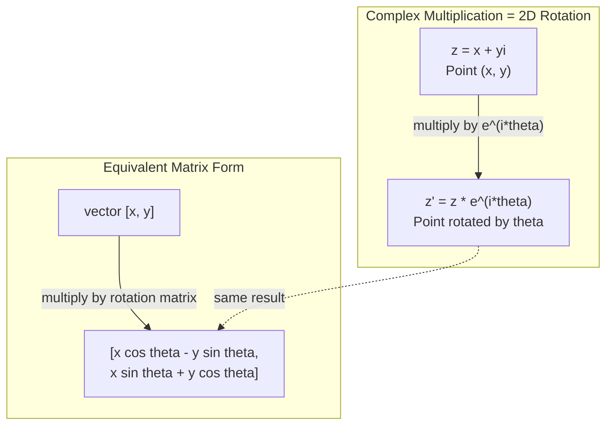
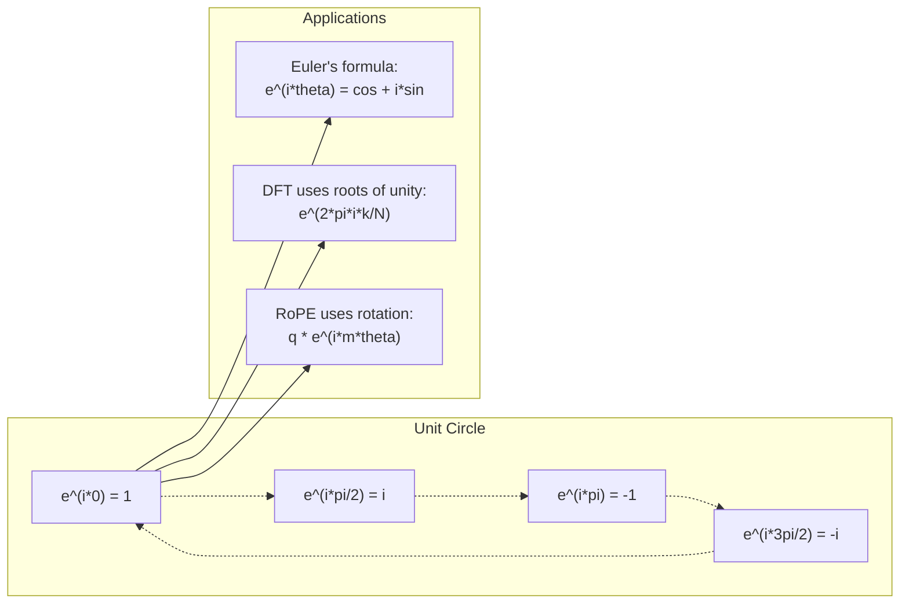

# AI 中的复数

> -1 的平方根并非虚幻之物，而是旋转、频率以及半个信号处理领域的关键。

**Type:** 学习
**Language:** Python
**Prerequisites:** 第 1 阶段，第 01–04 课（linear algebra, calculus）
**Time:** 约 1 小时

## 学习目标

- 分别使用直角坐标形式和极坐标形式执行复数运算（加、乘、除、共轭）
- 应用 Euler 公式，在复指数函数与三角函数之间转换
- 使用复数单位根实现离散 Fourier 变换
- 解释复数旋转如何构成 Transformer 中 RoPE 和正弦位置编码的基础

## 问题

打开一篇 Fourier 变换论文，你会看到随处可见的 `i`。查看 Transformer 位置编码，会看到不同频率的 `sin` 和 `cos`——它们正是复指数函数的实部与虚部。阅读量子计算资料，又会发现一切都在复向量空间中表达。

复数看起来很抽象。把一个数系建立在 -1 的平方根上，似乎只是数学技巧，但它并不是技巧，而是描述旋转与振荡的自然语言。凡是发生旋转、振动或周期运动的地方，复数就是正确工具。

不了解复数，就无法真正理解离散 Fourier 变换和 FFT，也无法理解现代语言模型中的 RoPE（Rotary Position Embedding）如何工作，更无法理解原始 Transformer 论文为何在正弦位置编码中使用那些频率。

本课将从零构建复数运算，把它与几何联系起来，并准确展示复数在机器学习中的应用位置。

## 核心概念

### 什么是复数？

复数由两部分组成：实部和虚部。

```
z = a + bi

where:
  a is the real part
  b is the imaginary part
  i is the imaginary unit, defined by i^2 = -1
```

仅此而已。你只是把数轴扩展成了平面：实数位于一条轴上，虚数位于另一条轴上，每个复数都是该平面中的一个点。

### 复数运算

**加法。**实部分别相加，虚部分别相加。

```
(a + bi) + (c + di) = (a + c) + (b + d)i

Example: (3 + 2i) + (1 + 4i) = 4 + 6i
```

**乘法。**应用分配律，并记住 i^2 = -1。

```
(a + bi)(c + di) = ac + adi + bci + bdi^2
                 = ac + adi + bci - bd
                 = (ac - bd) + (ad + bc)i

Example: (3 + 2i)(1 + 4i) = 3 + 12i + 2i + 8i^2
                            = 3 + 14i - 8
                            = -5 + 14i
```

**共轭。**把虚部的符号反转。

```
conjugate of (a + bi) = a - bi
```

复数与其共轭的乘积始终为实数：

```
(a + bi)(a - bi) = a^2 + b^2
```

**除法。**让分子和分母同时乘以分母的共轭。

```
(a + bi) / (c + di) = (a + bi)(c - di) / (c^2 + d^2)
```

这样可以消去分母中的虚部，得到形式整洁的复数。

### 复平面

复平面把每个复数映射到二维点。水平轴为实轴，垂直轴为虚轴。

```
z = 3 + 2i  corresponds to the point (3, 2)
z = -1 + 0i corresponds to the point (-1, 0) on the real axis
z = 0 + 4i  corresponds to the point (0, 4) on the imaginary axis
```

一个复数既是一个点，也是从原点出发的向量。这种双重解释，让复数在几何中非常有用。

### 极坐标形式

平面中的任意点，都可以用它到原点的距离，以及它相对于正实轴的夹角来描述。

```
z = r * (cos(theta) + i*sin(theta))

where:
  r = |z| = sqrt(a^2 + b^2)     (magnitude, or modulus)
  theta = atan2(b, a)             (phase, or argument)
```

直角坐标形式（a + bi）适合加法，极坐标形式（r, theta）适合乘法。

**极坐标形式中的乘法。**模相乘，角度相加。

```
z1 = r1 * e^(i*theta1)
z2 = r2 * e^(i*theta2)

z1 * z2 = (r1 * r2) * e^(i*(theta1 + theta2))
```

这就是复数特别适合表示旋转的原因：乘以模为 1 的复数，就是一次纯旋转。

### Euler 公式

它连接了复指数与三角函数：

```
e^(i*theta) = cos(theta) + i*sin(theta)
```

这是本课最重要的公式。当 theta = pi 时：

```
e^(i*pi) = cos(pi) + i*sin(pi) = -1 + 0i = -1

Therefore: e^(i*pi) + 1 = 0
```

五个基本常数 e、i、pi、1、0 被一个方程联系起来。

### Euler 公式为何对机器学习重要

Euler 公式表示 `e^(i*theta)` 会随 theta 变化沿单位圆运动。theta = 0 时位于 (1, 0)，theta = pi/2 时位于 (0, 1)，theta = pi 时位于 (-1, 0)，theta = 3*pi/2 时位于 (0, -1)，完整旋转一周对应 theta = 2*pi。

因此，复指数本身就是旋转，而旋转在信号处理与机器学习中无处不在。

### 与二维旋转的联系

让复数 (x + yi) 乘以 e^(i*theta)，就会把点 (x, y) 绕原点旋转 theta 角。

```
Rotation via complex multiplication:
  (x + yi) * (cos(theta) + i*sin(theta))
  = (x*cos(theta) - y*sin(theta)) + (x*sin(theta) + y*cos(theta))i

Rotation via matrix multiplication:
  [cos(theta)  -sin(theta)] [x]   [x*cos(theta) - y*sin(theta)]
  [sin(theta)   cos(theta)] [y] = [x*sin(theta) + y*cos(theta)]
```

二者产生完全相同的结果。复数乘法就是二维旋转，旋转矩阵不过是用矩阵记法写出的复数乘法。



### 相量与旋转信号

复指数 e^(i*omega*t) 是一个以角频率 omega 沿单位圆旋转的点。随着 t 增加，这个点会绕圆周运动。

旋转点的实部是 cos(omega*t)，虚部是 sin(omega*t)。正弦信号就是旋转复数投下的影子。

```
e^(i*omega*t) = cos(omega*t) + i*sin(omega*t)

Real part:      cos(omega*t)    -- a cosine wave
Imaginary part: sin(omega*t)    -- a sine wave
```

这就是相量表示。你不必跟踪上下波动的正弦曲线，而是跟踪平滑旋转的箭头。相位偏移变成角度偏移，振幅变化变成模的变化，信号相加则变成向量相加。

### 单位根

N 次单位根是单位圆上均匀分布的 N 个点：

```
w_k = e^(2*pi*i*k/N)    for k = 0, 1, 2, ..., N-1
```

N = 4 时，单位根为 1、i、-1、-i，也就是四个正方向点；N = 8 时，除了这四点，还包括四条对角线方向。

单位根是离散 Fourier 变换的基础。DFT 会把信号分解成这 N 个等间隔频率上的分量。

### 与 DFT 的联系

信号 x[0], x[1], ..., x[N-1] 的离散 Fourier 变换为：

```
X[k] = sum_{n=0}^{N-1} x[n] * e^(-2*pi*i*k*n/N)
```

每个 X[k] 衡量信号与第 k 个单位根——频率为 k 的复正弦波——之间的相关程度。DFT 会把信号拆成 N 个旋转相量，并告诉你每个相量的振幅与相位。

### 为什么 i 并不“虚幻”

“虚数”这个名称只是历史偶然。Descartes 最初用它表达轻蔑，但 i 并不比人们曾经拒绝接受的负数更“虚幻”。负数回答“从 3 中减去什么会得到 5？”；虚数单位则回答“哪个数平方后得到 -1？”

更实用的理解是：i 是一个旋转 90 度的运算符。实数乘以 i 一次，会旋转 90 度到虚轴；再乘一次 i，也就是 i^2，会再旋转 90 度，此时指向负实轴。这就是 i^2 = -1 的原因。它并不神秘，只是由两次四分之一圈旋转组成的半圈旋转。

这解释了复数为何遍布工程领域。凡是旋转的对象——电磁波、量子态、信号振荡、位置编码——都能用复数自然描述。

### 复指数与三角函数

在 Euler 公式出现前，工程师把信号写成 A*cos(omega*t + phi)，其中 A 是振幅、omega 是频率、phi 是相位。这种写法可行，却让运算十分痛苦；两个相位不同的余弦相加，需要使用三角恒等式。

使用复指数后，同一个信号可以写成 A*e^(i*(omega*t + phi))。两个信号相加就是两个复数相加，调制则只是模相乘、角度相加；相位偏移变成角度相加，频率偏移则变成乘以相量。

整个信号处理领域都转向了复指数记法，因为数学更简洁。“真实信号”始终只是复数表示的实部，虚部作为辅助信息保留下来，让所有代数运算自然成立。

### 与 Transformer 的联系

**正弦位置编码**（原始 Transformer 论文）：

```
PE(pos, 2i) = sin(pos / 10000^(2i/d))
PE(pos, 2i+1) = cos(pos / 10000^(2i/d))
```

每一对 sin 与 cos，都是不同频率复指数的虚部和实部。每个频率为位置编码提供不同“分辨率”：低频变化缓慢，编码粗粒度位置；高频变化迅速，编码细粒度位置。所有频率结合，为每个位置生成唯一的频率指纹。

**RoPE（Rotary Position Embedding）** 更进一步，明确使用复旋转矩阵乘以 query 和 key 向量。两个 token 的相对位置会变成旋转角度，注意力使用旋转后的向量计算，从而通过复数乘法让模型感知相对位置。

| 运算 | 代数形式 | 几何含义 |
|-----------|---------------|-------------------|
| 加法 | (a+c) + (b+d)i | 平面中的向量加法 |
| 乘法 | (ac-bd) + (ad+bc)i | 旋转并缩放 |
| 共轭 | a - bi | 关于实轴反射 |
| 模 | sqrt(a^2 + b^2) | 到原点的距离 |
| 相位 | atan2(b, a) | 相对正实轴的角度 |
| 除法 | 乘以共轭 | 反向旋转并重新缩放 |
| 幂 | r^n * e^(i*n*theta) | 旋转 n 次，并按 r^n 缩放 |



```figure
roots-of-unity
```

## 动手构建

### 第 1 步：Complex 类

构建支持算术运算、模、相位以及直角坐标与极坐标转换的 Complex 类。

```python
import math

class Complex:
    def __init__(self, real, imag=0.0):
        self.real = real
        self.imag = imag

    def __add__(self, other):
        return Complex(self.real + other.real, self.imag + other.imag)

    def __mul__(self, other):
        r = self.real * other.real - self.imag * other.imag
        i = self.real * other.imag + self.imag * other.real
        return Complex(r, i)

    def __truediv__(self, other):
        denom = other.real ** 2 + other.imag ** 2
        r = (self.real * other.real + self.imag * other.imag) / denom
        i = (self.imag * other.real - self.real * other.imag) / denom
        return Complex(r, i)

    def magnitude(self):
        return math.sqrt(self.real ** 2 + self.imag ** 2)

    def phase(self):
        return math.atan2(self.imag, self.real)

    def conjugate(self):
        return Complex(self.real, -self.imag)
```

### 第 2 步：极坐标转换与 Euler 公式

```python
def to_polar(z):
    return z.magnitude(), z.phase()

def from_polar(r, theta):
    return Complex(r * math.cos(theta), r * math.sin(theta))

def euler(theta):
    return Complex(math.cos(theta), math.sin(theta))
```

验证：`euler(theta).magnitude()` 应始终为 1.0；`euler(0)` 应得到 (1, 0)；`euler(pi)` 应得到 (-1, 0)。

### 第 3 步：旋转

让点 (x, y) 旋转 theta 角，只需执行一次复数乘法：

```python
point = Complex(3, 4)
rotated = point * euler(math.pi / 4)
```

模保持不变，只有角度发生变化。

### 第 4 步：使用复数运算实现 DFT

```python
def dft(signal):
    N = len(signal)
    result = []
    for k in range(N):
        total = Complex(0, 0)
        for n in range(N):
            angle = -2 * math.pi * k * n / N
            total = total + Complex(signal[n], 0) * euler(angle)
        result.append(total)
    return result
```

这是复杂度为 O(N^2) 的 DFT。每个输出 X[k] 都是信号样本与单位根相乘后的总和。

### 第 5 步：逆 DFT

逆 DFT 根据频谱重建原始信号。与正向 DFT 相比，只有两点变化：反转指数符号，并除以 N。

```python
def idft(spectrum):
    N = len(spectrum)
    result = []
    for n in range(N):
        total = Complex(0, 0)
        for k in range(N):
            angle = 2 * math.pi * k * n / N
            total = total + spectrum[k] * euler(angle)
        result.append(Complex(total.real / N, total.imag / N))
    return result
```

这会实现完美重建。先执行 DFT，再执行 IDFT，就能在机器精度范围内恢复原始信号，不会丢失信息。

### 第 6 步：单位根

```python
def roots_of_unity(N):
    return [euler(2 * math.pi * k / N) for k in range(N)]
```

验证两项性质：
- 每个单位根的模都恰好为 1
- N 个单位根之和为零，因为它们因对称性互相抵消

正是这些性质让 DFT 可逆。单位根构成频域中的一组正交基。

## 实际使用

Python 原生支持复数，字面量 `j` 表示虚数单位。

```python
z = 3 + 2j
w = 1 + 4j

print(z + w)
print(z * w)
print(abs(z))

import cmath
print(cmath.phase(z))
print(cmath.exp(1j * cmath.pi))
```

对于数组，NumPy 原生支持复数：

```python
import numpy as np

z = np.array([1+2j, 3+4j, 5+6j])
print(np.abs(z))
print(np.angle(z))
print(np.conj(z))
print(np.real(z))
print(np.imag(z))

signal = np.sin(2 * np.pi * 5 * np.linspace(0, 1, 128))
spectrum = np.fft.fft(signal)
freqs = np.fft.fftfreq(128, d=1/128)
```

## 交付成果

运行 `code/complex_numbers.py`，生成 `outputs/skill-complex-arithmetic.md`。

## 练习

1. **手工复数运算。**计算 (2 + 3i) * (4 - i)，并用代码验证；再计算 (5 + 2i) / (1 - 3i)。在复平面上画出两个结果，检查乘法是否旋转并缩放了第一个数。

2. **连续旋转。**从点 (1, 0) 开始，连续 12 次乘以 e^(i*pi/6)。验证 12 次后回到 (1, 0)，输出每一步坐标，并确认这些点描绘出一个正十二边形。

3. **已知信号的 DFT。**创建一个信号，它是 sin(2*pi*3*t) 与 0.5*sin(2*pi*7*t) 之和，并在 32 个点采样。运行你的 DFT，验证幅度频谱在频率 3 和 7 处出现峰值，且频率 7 的峰值高度是频率 3 的一半。

4. **单位根可视化。**计算 8 次单位根，验证它们之和为零；再验证任意单位根乘以本原单位根 e^(2*pi*i/8)，都会得到下一个单位根。

5. **与旋转矩阵等价。**对 10 个随机角度和 10 个随机点，验证复数乘法与使用 2x2 旋转矩阵进行矩阵—向量乘法会得到相同结果，并输出最大数值差异。

## 关键术语

| 术语 | 含义 |
|------|---------------|
| Complex number | 形如 a + bi 的数，其中 a 是实部，b 是虚部，并且 i^2 = -1 |
| Imaginary unit | 数 i，由 i^2 = -1 定义；它并非哲学意义上的“虚假”，而是旋转运算符 |
| Complex plane | x 轴为实轴、y 轴为虚轴的二维平面，也称 Argand 平面 |
| Magnitude (modulus) | 到原点的距离：sqrt(a^2 + b^2)，记作 \|z\| |
| Phase (argument) | 相对于正实轴的角度：atan2(b, a)，记作 arg(z) |
| Conjugate | 关于实轴的镜像；a + bi 的共轭为 a - bi |
| Polar form | 用 r * e^(i*theta) 而不是 a + bi 表示 z，使乘法更简单 |
| Euler's formula | e^(i*theta) = cos(theta) + i*sin(theta)，连接指数函数与三角函数 |
| Phasor | 表示正弦信号的旋转复数 e^(i*omega*t) |
| Roots of unity | k 从 0 到 N-1 时的 N 个复数 e^(2*pi*i*k/N)，也就是单位圆上等间隔分布的 N 个点 |
| DFT | 离散 Fourier 变换，使用单位根把信号分解成复正弦分量 |
| RoPE | Rotary Position Embedding，使用复数乘法编码 Transformer 注意力中的相对位置 |

## 延伸阅读

- [Euler 公式的可视化入门](https://betterexplained.com/articles/intuitive-understanding-of-eulers-formula/)——无需复杂符号即可建立几何直觉
- [Su 等：RoFormer（2021）](https://arxiv.org/abs/2104.09864)——使用复旋转引入 Rotary Position Embedding 的论文
- [Vaswani 等：Attention Is All You Need（2017）](https://arxiv.org/abs/1706.03762)——使用正弦位置编码的原始 Transformer 论文
- [3Blue1Brown：结合群论入门讲解 Euler 公式](https://www.youtube.com/watch?v=mvmuCPvRoWQ)——解释 e^(i*pi) = -1 的可视化资料
- [Needham：《Visual Complex Analysis》](https://global.oup.com/academic/product/visual-complex-analysis-9780198534464)——包含大量几何直觉的优秀复分析可视化教材
- [Strang：《Introduction to Linear Algebra》第 10 章](https://math.mit.edu/~gs/linearalgebra/)——线性代数与特征值语境中的复数
