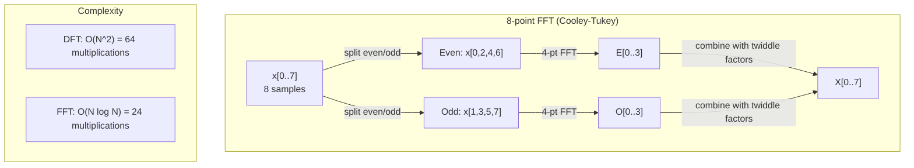
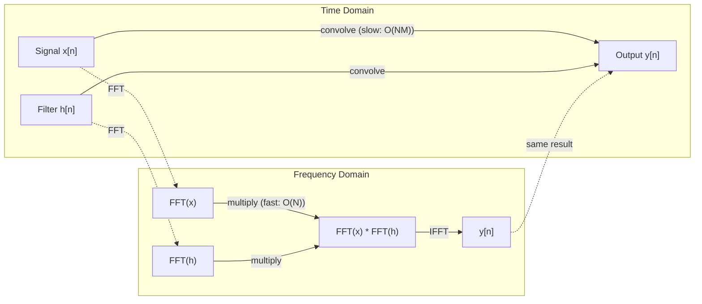

# Fourier 变换

> 每个信号都是若干正弦波之和，Fourier 变换会告诉你其中有哪些波。

**Type:** 构建
**Language:** Python
**Prerequisites:** 第 1 阶段，第 01–04 课，以及第 19 课（complex numbers）
**Time:** 约 90 分钟

## 学习目标

- 从零实现 DFT，并与复杂度为 O(N log N) 的 Cooley-Tukey FFT 对照验证
- 解读频率系数，从信号中提取振幅、相位和功率谱
- 应用卷积定理，通过 FFT 乘法执行卷积
- 将 Fourier 频率分解与 Transformer 位置编码及 CNN 卷积层联系起来

## 问题

音频录音是压力随时间变化的一串测量值，股票价格是数值随日期变化的序列，图像则是像素强度在空间中的网格。它们都属于时域（或空间域）数据：你看到的是数值沿某个索引发生变化。

但许多模式在时域中不可见。这段音频是纯音还是和弦？这组股价是否存在每周周期？这张图像中是否包含重复纹理？这些问题都与频率成分有关，而时域会把它们隐藏起来。

Fourier 变换把数据从时域转换到频域。它将一个信号分解成多个不同频率的正弦波，每个正弦波都有振幅（强度）和相位（起始位置），Fourier 变换会同时告诉你二者。

这对机器学习很重要，因为频域思维无处不在。卷积神经网络执行卷积，而卷积在频域中就是乘法；Transformer 位置编码用频率分解表示位置；语音识别、音乐生成等音频模型使用频谱图，也就是声音的频率表示；时间序列模型会寻找周期模式。理解 Fourier 变换，能让你掌握处理这些问题的共同语言。

## 核心概念

### DFT 的定义

给定 N 个样本 x[0], x[1], ..., x[N-1]，离散 Fourier 变换会产生 N 个频率系数 X[0], X[1], ..., X[N-1]：

```
X[k] = sum_{n=0}^{N-1} x[n] * e^(-2*pi*i*k*n/N)

for k = 0, 1, ..., N-1
```

每个 X[k] 都是复数。其模 |X[k]| 表示频率 k 的振幅，相位 angle(X[k]) 表示该频率的相位偏移。

关键洞见是：`e^(-2*pi*i*k*n/N)` 是一个以频率 k 旋转的相量。DFT 会计算信号与 N 个等间隔频率之间的相关性。如果信号在频率 k 上包含能量，相关性就很大；否则接近零。

### 每个系数表示什么

**X[0]：直流分量。**它是全部样本之和，与均值成正比，表示信号中恒定的零频偏移。

```
X[0] = sum_{n=0}^{N-1} x[n] * e^0 = sum of all samples
```

**当 1 <= k <= N/2 时的 X[k]：正频率。**X[k] 表示每 N 个样本完成 k 个周期的频率。k 越大，频率越高，振荡越快。

**X[N/2]：Nyquist 频率。**这是 N 个样本能够表示的最高频率。超过该频率会发生 aliasing，高频会伪装成低频。

**当 N/2 < k < N 时的 X[k]：负频率。**对于实值信号，X[N-k] = conj(X[k])，负频率是正频率的镜像。因此，有效信息位于前 N/2 + 1 个系数中。

### 逆 DFT

逆 DFT 根据频率系数重建原始信号：

```
x[n] = (1/N) * sum_{k=0}^{N-1} X[k] * e^(2*pi*i*k*n/N)

for n = 0, 1, ..., N-1
```

它与正向 DFT 只有两处不同：指数中的符号为正而非负，并且多出一个 1/N 归一化因子。

逆 DFT 能够完美重建信号，不会损失信息。你可以从时域进入频域，再返回时域而不产生误差。DFT 本质上是一次基变换：使用不同坐标系重新表达相同的信息。

### FFT：让计算变快

按照定义直接计算 DFT，复杂度为 O(N^2)：N 个输出系数中的每一个都需要遍历 N 个输入样本。N 为 100 万时，这意味着 10^12 次运算。

快速 Fourier 变换（FFT）可以用 O(N log N) 复杂度得到完全相同的结果。N 为 100 万时，只需要约 2,000 万次运算，而不是一万亿次。正因如此，频率分析才具有实践可行性。

最常见的 FFT 算法 Cooley-Tukey 使用分治法：

1. 把信号拆成偶数索引样本和奇数索引样本。
2. 递归计算两个半序列的 DFT。
3. 使用旋转因子 e^(-2*pi*i*k/N) 合并两个半尺寸 DFT。

```
X[k] = E[k] + e^(-2*pi*i*k/N) * O[k]          for k = 0, ..., N/2 - 1
X[k + N/2] = E[k] - e^(-2*pi*i*k/N) * O[k]    for k = 0, ..., N/2 - 1

where E = DFT of even-indexed samples
      O = DFT of odd-indexed samples
```

这种对称性让每层递归只需 O(N) 工作，而递归一共有 log2(N) 层，因此总复杂度为 O(N log N)。



FFT 要求信号长度为 2 的幂。实践中通常会用零把信号补到下一个 2 的幂。

### 频谱分析

**功率谱**是 |X[k]|^2，也就是每个频率系数模的平方，表示各频率包含多少能量。

**相位谱**是 angle(X[k])，表示各频率的相位偏移。在大多数分析任务中，你主要关心功率谱，而会忽略相位。

```
Power at frequency k:  P[k] = |X[k]|^2 = X[k].real^2 + X[k].imag^2
Phase at frequency k:  phi[k] = atan2(X[k].imag, X[k].real)
```

### 频率分辨率

DFT 的频率分辨率取决于样本数量 N 和采样率 fs。

```
Frequency of bin k:      f_k = k * fs / N
Frequency resolution:    delta_f = fs / N
Maximum frequency:       f_max = fs / 2  (Nyquist)
```

要区分两个非常接近的频率，需要更多样本；要捕获更高频率，则需要更高采样率。

### 卷积定理

这是信号处理领域最重要的结论之一，也与 CNN 直接相关。

**时域卷积等于频域逐元素乘法。**

```
x * h = IFFT(FFT(x) . FFT(h))

where * is convolution and . is element-wise multiplication
```

它的重要性在于：

- 直接对长度分别为 N 和 M 的两个信号做卷积，需要 O(N*M) 次运算。
- 基于 FFT 的卷积只需 O(N log N)：分别变换、相乘，再执行逆变换。
- 对大型卷积核而言，FFT 卷积快得多。
- 使用大感受野的卷积层正会利用这一性质。

注意：DFT 天然计算循环卷积，也就是信号首尾相接。要计算不循环的线性卷积，应在变换前把两个信号都补零到 N + M - 1 的长度。



### 加窗

DFT 假设信号是周期性的，会把 N 个样本视为无限重复信号的一个周期。如果信号起点与终点数值不同，周期边界会产生不连续，并表现为虚假的高频成分，这称为谱泄漏。

加窗会在计算 DFT 前，让信号两端逐渐衰减到零，从而降低谱泄漏。

常见窗函数：

| 窗函数 | 形状 | 主瓣宽度 | 旁瓣水平 | 使用场景 |
|--------|-------|----------------|-----------------|----------|
| Rectangular | 平坦（不加窗） | 最窄 | 最高（-13 dB） | 信号在 N 个样本中恰好周期完整时 |
| Hann | 升余弦 | 中等 | 低（-31 dB） | 通用频谱分析 |
| Hamming | 修正余弦 | 中等 | 更低（-42 dB） | 音频处理、语音分析 |
| Blackman | 三项余弦 | 宽 | 非常低（-58 dB） | 旁瓣抑制至关重要时 |

```
Hann window:    w[n] = 0.5 * (1 - cos(2*pi*n / (N-1)))
Hamming window: w[n] = 0.54 - 0.46 * cos(2*pi*n / (N-1))
```

在执行 DFT 前，用窗函数逐元素乘以信号：`X = DFT(x * w)`。

### DFT 的性质

| 性质 | 时域 | 频域 |
|----------|-------------|-----------------|
| 线性 | a*x + b*y | a*X + b*Y |
| 时移 | x[n - k] | X[f] * e^(-2*pi*i*f*k/N) |
| 频移 | x[n] * e^(2*pi*i*f0*n/N) | X[f - f0] |
| 卷积 | x * h | X * H（逐元素） |
| 乘法 | x * h（逐元素） | X * H（循环卷积，并按 1/N 缩放） |
| Parseval 定理 | sum \|x[n]\|^2 | (1/N) * sum \|X[k]\|^2 |
| 共轭对称（实值输入） | x[n] 为实数 | X[k] = conj(X[N-k]) |

Parseval 定理表示时域和频域中的总能量相同，变换过程中能量守恒。

### 与位置编码的联系

原始 Transformer 使用正弦位置编码：

```
PE(pos, 2i)   = sin(pos / 10000^(2i/d_model))
PE(pos, 2i+1) = cos(pos / 10000^(2i/d_model))
```

每一对维度 (2i, 2i+1) 都以不同频率振荡，频率从高频（第 0、1 维）到低频（最后几维）按几何级数排列。这为每个位置提供跨全部频带的唯一模式，类似 Fourier 系数能够唯一标识信号。

它带来以下关键性质：

- **唯一性：**没有两个位置拥有完全相同的编码。
- **有界性：**sin 和 cos 始终位于 [-1, 1]。
- **相对位置：**位置 p+k 的编码可以表示成位置 p 编码的线性函数，因此模型能够学习关注相对位置。

### 与 CNN 的联系

卷积层会让学习到的滤波器（卷积核）在信号或图像上滑动，这在数学上就是卷积运算。

根据卷积定理，它等价于：
1. 对输入执行 FFT
2. 对卷积核执行 FFT
3. 在频域中相乘
4. 对结果执行 IFFT

标准 CNN 实现使用直接卷积，因为较小的 3x3 卷积核这样更快；对于大卷积核或全局卷积，基于 FFT 的方法会明显更快。FNet 等架构甚至用 FFT 完全替代注意力，以 O(N log N) 复杂度取得接近 O(N^2) 注意力的准确率。

### 频谱图与短时 Fourier 变换

一次 FFT 可以给出整个信号的频率成分，却无法告诉你这些频率何时出现。Chirp（频率随时间增加的信号）与 chord（所有频率同时出现）可能拥有相同的幅度谱。

短时 Fourier 变换（STFT）会在信号的重叠窗口上分别计算 FFT，从而解决这一问题。输出是一张频谱图：一条轴表示时间，另一条轴表示频率，每个点的强度表示该时刻、该频率上的能量。

```
STFT procedure:
1. Choose a window size (e.g., 1024 samples)
2. Choose a hop size (e.g., 256 samples -- 75% overlap)
3. For each window position:
   a. Extract the windowed segment
   b. Apply a Hann/Hamming window
   c. Compute FFT
   d. Store the magnitude spectrum as one column of the spectrogram
```

频谱图是音频机器学习模型的标准输入表示。Whisper、DeepSpeech 等语音识别模型使用 mel-spectrogram：把频率映射到更符合人类音高感知的 mel 尺度后的频谱图。

### 混叠（Aliasing）

如果信号包含高于 fs/2（Nyquist 频率）的成分，以 fs 采样就会产生混叠副本。一个 90 Hz 信号以 100 Hz 采样时，看起来与 10 Hz 信号完全相同，仅凭样本无法区分二者。

```
Example:
  True signal: 90 Hz sine wave
  Sampling rate: 100 Hz
  Apparent frequency: 100 - 90 = 10 Hz

  The samples from the 90 Hz signal at 100 Hz sampling rate
  are identical to the samples from a 10 Hz signal.
  No amount of math can recover the original 90 Hz.
```

因此，模数转换器会在采样前使用抗混叠滤波器，移除高于 Nyquist 频率的成分。在机器学习中，如果下采样特征图时没有先正确进行低通滤波，也会发生 aliasing；一些架构使用抗混叠池化层来处理它。

### 补零不会提高分辨率

一个常见误解是：FFT 前给信号补零可以提高频率分辨率。事实并非如此。补零只会在已有频率 bin 之间插值，使频谱看起来更平滑，却无法揭示原始样本中不存在的频率细节。

真正的频率分辨率只取决于观测时间 T = N / fs。要分辨相差 delta_f 的两个频率，至少需要 T = 1 / delta_f 秒数据。补多少零都无法改变这个根本限制。

```figure
fourier-synthesis
```

## 动手构建

### 第 1 步：从零实现 DFT

复杂度为 O(N^2) 的 DFT 直接来自定义。

```python
import math

class Complex:
    ...

def dft(x):
    N = len(x)
    result = []
    for k in range(N):
        total = Complex(0, 0)
        for n in range(N):
            angle = -2 * math.pi * k * n / N
            w = Complex(math.cos(angle), math.sin(angle))
            xn = x[n] if isinstance(x[n], Complex) else Complex(x[n])
            total = total + xn * w
        result.append(total)
    return result
```

### 第 2 步：逆 DFT

结构相同，只需使用正指数并除以 N。

```python
def idft(X):
    N = len(X)
    result = []
    for n in range(N):
        total = Complex(0, 0)
        for k in range(N):
            angle = 2 * math.pi * k * n / N
            w = Complex(math.cos(angle), math.sin(angle))
            total = total + X[k] * w
        result.append(Complex(total.real / N, total.imag / N))
    return result
```

### 第 3 步：FFT（Cooley-Tukey）

递归 FFT 要求长度为 2 的幂。把信号分成偶数索引与奇数索引，递归求解，再用旋转因子合并。

```python
def fft(x):
    N = len(x)
    if N <= 1:
        return [x[0] if isinstance(x[0], Complex) else Complex(x[0])]
    if N % 2 != 0:
        return dft(x)

    even = fft([x[i] for i in range(0, N, 2)])
    odd = fft([x[i] for i in range(1, N, 2)])

    result = [Complex(0)] * N
    for k in range(N // 2):
        angle = -2 * math.pi * k / N
        twiddle = Complex(math.cos(angle), math.sin(angle))
        t = twiddle * odd[k]
        result[k] = even[k] + t
        result[k + N // 2] = even[k] - t
    return result
```

### 第 4 步：频谱分析辅助函数

```python
def power_spectrum(X):
    return [xk.real ** 2 + xk.imag ** 2 for xk in X]

def convolve_fft(x, h):
    N = len(x) + len(h) - 1
    padded_N = 1
    while padded_N < N:
        padded_N *= 2

    x_padded = x + [0.0] * (padded_N - len(x))
    h_padded = h + [0.0] * (padded_N - len(h))

    X = fft(x_padded)
    H = fft(h_padded)

    Y = [xk * hk for xk, hk in zip(X, H)]

    y = idft(Y)
    return [y[n].real for n in range(N)]
```

## 实际使用

实际工作应使用 NumPy 的 FFT，它由高度优化的 C 库实现。

```python
import numpy as np

signal = np.sin(2 * np.pi * 5 * np.arange(256) / 256)
spectrum = np.fft.fft(signal)
freqs = np.fft.fftfreq(256, d=1/256)

power = np.abs(spectrum) ** 2

positive_freqs = freqs[:len(freqs)//2]
positive_power = power[:len(power)//2]
```

窗函数及更高级的频谱分析：

```python
from scipy.signal import windows, stft

window = windows.hann(256)
windowed = signal * window
spectrum = np.fft.fft(windowed)
```

卷积：

```python
from scipy.signal import fftconvolve

result = fftconvolve(signal, kernel, mode='full')
```

频谱图：

```python
from scipy.signal import stft

frequencies, times, Zxx = stft(signal, fs=sample_rate, nperseg=256)
spectrogram = np.abs(Zxx) ** 2
```

频谱图矩阵的形状为 (n_frequencies, n_time_frames)。每一列都是一个时间窗口中的功率谱，这正是音频机器学习模型接收的输入。

## 交付成果

运行 `code/fourier.py`，生成 `outputs/prompt-spectral-analyzer.md`。

## 练习

1. **识别纯音。**创建一个频率未知、范围为 1–50 Hz 的单一正弦波，以 128 Hz 采样 1 秒。使用你的 DFT 识别频率并验证答案。随后加入标准差为 0.5 的 Gaussian 噪声，再次运行。噪声会怎样影响频谱？

2. **验证 FFT 与 DFT。**生成长度为 64 的随机信号，分别计算 DFT（O(N^2)）和 FFT，验证全部系数在 1e-10 内一致。对长度 256、512、1024、2048 的信号分别计时，绘制 DFT 耗时与 FFT 耗时之比。

3. **用实例证明卷积定理。**创建信号 x = [1, 2, 3, 4, 0, 0, 0, 0] 和滤波器 h = [1, 1, 1, 0, 0, 0, 0, 0]。先使用嵌套循环直接计算循环卷积，再使用 FFT（变换、相乘、逆变换）计算，验证结果相同；然后通过适当补零计算线性卷积。

4. **加窗效果。**创建由 10 Hz 与 12 Hz 两个非常接近的正弦波相加而成的信号，以 128 Hz 采样 1 秒。分别在不加窗、使用 Hann 窗和使用 Hamming 窗时计算功率谱。哪个窗最容易区分两个峰值？为什么？

5. **分析位置编码。**为 d_model = 128、max_pos = 512 生成正弦位置编码。对每一对位置 (p1, p2)，计算编码点积。证明点积只依赖 |p1 - p2|，而与绝对位置无关。距离增大时，点积会怎样变化？

## 关键术语

| 术语 | 含义 |
|------|---------------|
| DFT（离散傅里叶变换） | 把 N 个时域样本转换成 N 个频域系数；每个系数表示信号与对应频率复正弦波的相关性 |
| FFT（快速傅里叶变换） | 以 O(N log N) 复杂度计算 DFT 的算法；Cooley-Tukey 算法会递归拆分偶数与奇数索引 |
| Inverse DFT | 根据频率系数重建时域信号；公式与 DFT 相同，但指数符号相反并乘以 1/N |
| Frequency bin | DFT 输出中的每个索引 k 表示频率 k*fs/N Hz；bin 就是离散频率槽 |
| DC component | X[0]，零频系数，与信号均值成正比 |
| Nyquist frequency | fs/2，在采样率 fs 下能够表示的最高频率；超过它的频率会发生混叠 |
| Power spectrum | \|X[k]\|^2，即每个频率系数模的平方，表示能量在频率间的分布 |
| Phase spectrum | angle(X[k])，每个频率分量的相位偏移，分析中经常忽略 |
| Spectral leakage | 把非周期信号当作周期信号引发的虚假频率成分，可通过加窗减少 |
| Window function | DFT 前应用的渐消函数（Hann、Hamming、Blackman），用于降低谱泄漏 |
| Twiddle factor | FFT 蝶形计算中用于合并子 DFT 的复指数 e^(-2*pi*i*k/N) |
| Convolution theorem | 时域卷积等于频域逐元素乘法，是信号处理与 CNN 的基础 |
| Circular convolution | 信号首尾相接的卷积，也是 DFT 天然计算的卷积 |
| Linear convolution | 不发生首尾回绕的标准卷积，通过 DFT 前补零实现 |
| Parseval's theorem | Fourier 变换保持总能量：sum \|x[n]\|^2 = (1/N) sum \|X[k]\|^2 |
| Aliasing | 采样率不足时，高于 Nyquist 的频率表现为更低频率的现象 |

## 延伸阅读

- [Cooley 与 Tukey：复 Fourier 级数的机器计算算法（1965）](https://www.ams.org/journals/mcom/1965-19-090/S0025-5718-1965-0178586-1/)——改变计算领域的原始 FFT 论文
- [3Blue1Brown：Fourier 变换究竟是什么？](https://www.youtube.com/watch?v=spUNpyF58BY)——优秀的 Fourier 变换可视化入门
- [Lee-Thorp 等：FNet——使用 Fourier 变换混合 token（2021）](https://arxiv.org/abs/2105.03824)——在 Transformer 中使用 FFT 替代 self-attention
- [Smith：《科学家与工程师的数字信号处理指南》](http://www.dspguide.com/)——免费在线教材，深入讲解 FFT、窗函数和频谱分析
- [Vaswani 等：Attention Is All You Need（2017）](https://arxiv.org/abs/1706.03762)——从 Fourier 频率分解得到正弦位置编码的原始论文
- [Radford 等：Whisper（2022）](https://arxiv.org/abs/2212.04356)——使用 mel-spectrogram 作为输入表示的语音识别模型
