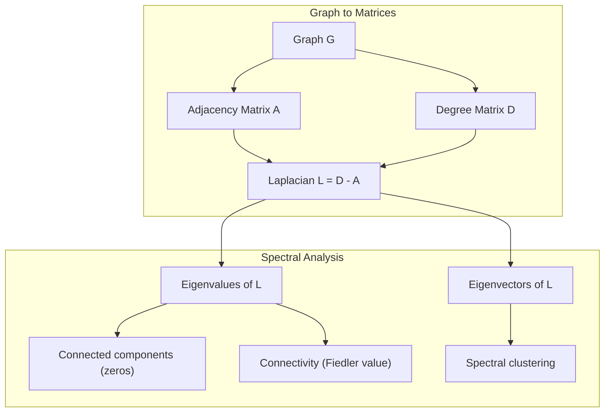
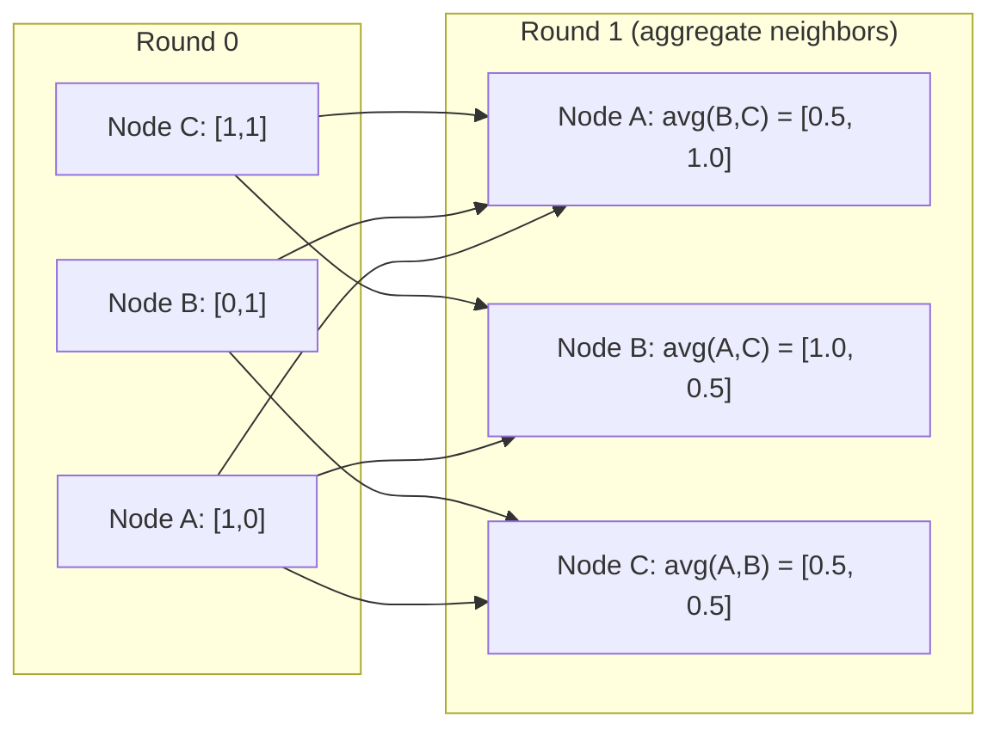

# 机器学习图论

> 图是表达关系的数据结构。只要数据中存在连接，就需要图论。

**Type:** 构建
**Language:** Python
**Prerequisites:** 第 1 阶段，第 01–03 课（linear algebra, matrices）
**Time:** 约 90 分钟

## 学习目标

- 构建支持邻接矩阵/邻接表表示的图类，并实现 BFS 和 DFS 遍历
- 计算图 Laplacian，使用其特征值检测连通分量并对节点聚类
- 把一次 GNN 风格消息传递实现为归一化邻接矩阵乘法
- 使用 Fiedler 向量应用谱聚类，对图进行划分

## 问题

社交网络、分子、知识库、引用网络、道路地图都是图。传统机器学习把数据当作扁平表格，每一行彼此独立，每个特征占一列。但当连接结构本身很重要时，表格就无法胜任。

以社交网络为例：你想预测用户会购买什么产品，个人购买历史固然重要，但朋友的购买历史可能更重要，连接本身携带着信号。

再考虑分子：你想预测它能否与某种蛋白质结合。原子本身重要，但真正关键的是原子之间如何成键，结构就是数据。

图神经网络（GNN）是深度学习中增长最快的领域之一，驱动着药物发现、社交推荐、欺诈检测和知识图谱推理。每种 GNN 都建立在同一个基础上：基本图论。

你需要四项能力：
1. 把图表示成矩阵，以便执行矩阵乘法
2. 使用遍历算法探索图结构
3. 理解 Laplacian——谱图论中最重要的矩阵
4. 理解消息传递——让 GNN 工作的核心运算

## 核心概念

### 图：节点与边

图 G = (V, E) 由顶点（节点）集合 V 和边集合 E 构成，每条边连接两个节点。

**有向与无向。**在无向图中，边 (u, v) 表示 u 连接 v，同时 v 也连接 u；在有向图中，边 (u, v) 表示 u 指向 v，但反向关系不一定存在。

**加权与无权。**无权图中，边只有存在或不存在；加权图中，每条边还带有数值权重，例如距离、成本或强度。

| 图类型 | 示例 |
|-----------|---------|
| 无向、无权 | Facebook 好友网络 |
| 有向、无权 | Twitter 关注网络 |
| 无向、加权 | 道路地图（距离） |
| 有向、加权 | 网页链接（PageRank 分数） |

### 邻接矩阵

邻接矩阵 A 是核心表示。对于含 n 个节点的图：

```
A[i][j] = 1    if there is an edge from node i to node j
A[i][j] = 0    otherwise
```

无向图的 A 对称：A[i][j] = A[j][i]。加权图中的 A[i][j] 等于边 (i, j) 的权重。

**示例——三角形：**

```
Nodes: 0, 1, 2
Edges: (0,1), (1,2), (0,2)

A = [[0, 1, 1],
     [1, 0, 1],
     [1, 1, 0]]
```

邻接矩阵是每种 GNN 的输入。对 A 执行矩阵运算，就对应在图上执行操作。

### 度

节点的度等于与它相连的边数。有向图还会区分入度（指向该节点的边）与出度（从该节点出发的边）。

度矩阵 D 是对角矩阵：

```
D[i][i] = degree of node i
D[i][j] = 0    for i != j
```

在三角形示例中，D = diag(2, 2, 2)，因为每个节点都连接另外两个节点。

度能够反映节点重要性。高度节点是枢纽节点，网络的度分布则揭示网络结构。社交网络遵循幂律分布，只有少数枢纽、大量叶节点；随机图的度近似服从 Poisson 分布。

### BFS 与 DFS

这是两种基本图遍历算法，都需要掌握。

**广度优先搜索（BFS）：**先探索所有邻居，再探索邻居的邻居，使用队列（FIFO）。

```
BFS from node 0:
  Visit 0
  Queue: [1, 2]        (neighbors of 0)
  Visit 1
  Queue: [2, 3]        (add neighbors of 1)
  Visit 2
  Queue: [3]           (neighbors of 2 already visited)
  Visit 3
  Queue: []            (done)
```

BFS 能找到无权图中的最短路径。从起点到任意节点的距离，就等于该节点第一次被发现时所在的 BFS 层级。因此，社交网络中的跳数距离会使用 BFS 计算。

**深度优先搜索（DFS）：**沿一条路径尽可能深入，再回溯，使用栈（LIFO）或递归。

```
DFS from node 0:
  Visit 0
  Stack: [1, 2]        (neighbors of 0)
  Visit 2               (pop from stack)
  Stack: [1, 3]         (add neighbors of 2)
  Visit 3               (pop from stack)
  Stack: [1]
  Visit 1               (pop from stack)
  Stack: []             (done)
```

DFS 适用于：
- 寻找连通分量（从尚未访问的节点启动 DFS）
- 检测环（DFS 树中的回边）
- 拓扑排序（反转 DFS 完成顺序）

| 算法 | 数据结构 | 找到的内容 | 使用场景 |
|-----------|---------------|-------|----------|
| BFS | 队列 | 最短路径 | 社交网络距离、知识图谱遍历 |
| DFS | 栈 | 连通分量、环 | 连通性、拓扑排序 |

### 图 Laplacian

L = D - A，是谱图论中最重要的矩阵。

对于三角形：

```
D = [[2, 0, 0],    A = [[0, 1, 1],    L = [[2, -1, -1],
     [0, 2, 0],         [1, 0, 1],         [-1, 2, -1],
     [0, 0, 2]]         [1, 1, 0]]         [-1, -1,  2]]
```

Laplacian 具有一些非凡性质：

1. **L 为半正定矩阵。**所有特征值都 >= 0。

2. **零特征值的数量等于连通分量数量。**连通图恰好有一个零特征值，包含 3 个不连通分量的图则有 3 个零特征值。

3. **最小非零特征值（Fiedler value）衡量连通性。**Fiedler value 大，说明图连通良好；值很小，说明图存在薄弱位置或瓶颈。

4. **Fiedler value 对应的特征向量（Fiedler vector）揭示最佳划分。**特征向量值为正的节点归入一组，值为负的节点归入另一组，这就是谱聚类。



### 谱性质

邻接矩阵与 Laplacian 的特征值，无需遍历图就能揭示结构性质。

**谱聚类**的步骤如下：
1. 计算 Laplacian L
2. 找到 L 最小的 k 个特征向量；对于连通图，跳过第一个全 1 特征向量
3. 把这些特征向量作为每个节点的新坐标
4. 在这些坐标上运行 k-means

为什么有效？L 的特征向量编码图上最“平滑”的函数。连通良好的节点会得到相近的特征向量值，被瓶颈分开的节点则会得到不同值，特征向量因此自然地分隔簇。

**与随机游走的联系。**归一化 Laplacian 与图上的随机游走有关。随机游走的平稳分布与节点度成正比，而混合时间——随机游走收敛的速度——取决于谱隙。

### 消息传递

这是图神经网络的核心操作。每个节点从邻居收集消息、聚合消息，再更新自己的状态。

```
h_v^(k+1) = UPDATE(h_v^(k), AGGREGATE({h_u^(k) : u in neighbors(v)}))
```

最简单的形式中，AGGREGATE = mean，UPDATE = 线性变换 + 激活函数：

```
h_v^(k+1) = sigma(W * mean({h_u^(k) : u in neighbors(v)}))
```

这实际上就是矩阵乘法。如果 H 是所有节点特征组成的矩阵，A 是邻接矩阵：

```
H^(k+1) = sigma(A_norm * H^(k) * W)
```

其中 A_norm 是归一化邻接矩阵，每行之和为 1。

一轮消息传递让每个节点“看到”直接邻居；两轮让它看到邻居的邻居；K 轮则让每个节点获得 K-hop 邻域的信息。



### 概念与机器学习应用

| 概念 | 机器学习应用 |
|---------|---------------|
| 邻接矩阵 | GNN 输入表示 |
| 图 Laplacian | 谱聚类、社区检测 |
| BFS/DFS | 知识图谱遍历、路径查找 |
| 度分布 | 节点重要性、特征工程 |
| 消息传递 | GNN 层（GCN、GAT、GraphSAGE） |
| L 的特征值 | 社区检测、图划分 |
| 谱聚类 | 无监督节点分组 |
| PageRank | 节点重要性、网页搜索 |

```figure
graph-degree-distribution
```

## 动手构建

### 第 1 步：从零构建 Graph 类

```python
class Graph:
    def __init__(self, n_nodes, directed=False):
        self.n = n_nodes
        self.directed = directed
        self.adj = {i: {} for i in range(n_nodes)}

    def add_edge(self, u, v, weight=1.0):
        self.adj[u][v] = weight
        if not self.directed:
            self.adj[v][u] = weight

    def neighbors(self, node):
        return list(self.adj[node].keys())

    def degree(self, node):
        return len(self.adj[node])

    def adjacency_matrix(self):
        import numpy as np
        A = np.zeros((self.n, self.n))
        for u in range(self.n):
            for v, w in self.adj[u].items():
                A[u][v] = w
        return A

    def degree_matrix(self):
        import numpy as np
        D = np.zeros((self.n, self.n))
        for i in range(self.n):
            D[i][i] = self.degree(i)
        return D

    def laplacian(self):
        return self.degree_matrix() - self.adjacency_matrix()
```

邻接表（`self.adj`）能够高效存储邻居。邻接矩阵转换使用 NumPy，因为后续谱运算都需要它。

### 第 2 步：BFS 与 DFS

```python
from collections import deque

def bfs(graph, start):
    visited = set()
    order = []
    distances = {}
    queue = deque([(start, 0)])
    visited.add(start)
    while queue:
        node, dist = queue.popleft()
        order.append(node)
        distances[node] = dist
        for neighbor in graph.neighbors(node):
            if neighbor not in visited:
                visited.add(neighbor)
                queue.append((neighbor, dist + 1))
    return order, distances


def dfs(graph, start):
    visited = set()
    order = []
    stack = [start]
    while stack:
        node = stack.pop()
        if node in visited:
            continue
        visited.add(node)
        order.append(node)
        for neighbor in reversed(graph.neighbors(node)):
            if neighbor not in visited:
                stack.append(neighbor)
    return order
```

BFS 使用 deque（双端队列），使 popleft 的复杂度为 O(1)；DFS 使用列表作为栈。二者都会恰好访问每个节点一次，时间复杂度都是 O(V + E)。

### 第 3 步：连通分量与 Laplacian 特征值

```python
def connected_components(graph):
    visited = set()
    components = []
    for node in range(graph.n):
        if node not in visited:
            order, _ = bfs(graph, node)
            visited.update(order)
            components.append(order)
    return components


def laplacian_eigenvalues(graph):
    import numpy as np
    L = graph.laplacian()
    eigenvalues = np.linalg.eigvalsh(L)
    return eigenvalues
```

`eigvalsh` 适用于对称矩阵；无向图的 Laplacian 始终对称。它会按升序返回特征值，统计零值数量即可得到连通分量数量。

### 第 4 步：谱聚类

```python
def spectral_clustering(graph, k=2):
    import numpy as np
    L = graph.laplacian()
    eigenvalues, eigenvectors = np.linalg.eigh(L)
    features = eigenvectors[:, 1:k+1]

    labels = np.zeros(graph.n, dtype=int)
    for i in range(graph.n):
        if features[i, 0] >= 0:
            labels[i] = 0
        else:
            labels[i] = 1
    return labels
```

k=2 时，Fiedler 向量的符号会把图分成两个簇。k>2 时，应在前 k 个特征向量上运行 k-means，但要排除平凡的全 1 特征向量。

### 第 5 步：消息传递

```python
def message_passing(graph, features, weight_matrix):
    import numpy as np
    A = graph.adjacency_matrix()
    row_sums = A.sum(axis=1, keepdims=True)
    row_sums[row_sums == 0] = 1
    A_norm = A / row_sums
    aggregated = A_norm @ features
    output = aggregated @ weight_matrix
    return output
```

这就是一轮 GNN 消息传递。每个节点的新特征等于邻居特征的加权平均，再经过权重矩阵变换。堆叠多轮即可让信息传播到更远位置。

## 实际使用

使用 networkx 和 NumPy，上述操作都可以用一行函数调用完成：

```python
import networkx as nx
import numpy as np

G = nx.karate_club_graph()

A = nx.adjacency_matrix(G).toarray()
L = nx.laplacian_matrix(G).toarray()

eigenvalues = np.linalg.eigvalsh(L.astype(float))
print(f"Smallest eigenvalues: {eigenvalues[:5]}")
print(f"Connected components: {nx.number_connected_components(G)}")

communities = nx.community.greedy_modularity_communities(G)
print(f"Communities found: {len(communities)}")

pr = nx.pagerank(G)
top_nodes = sorted(pr.items(), key=lambda x: x[1], reverse=True)[:5]
print(f"Top 5 PageRank nodes: {top_nodes}")
```

networkx 通过优化的 C 后端处理任意规模的图。生产环境应使用它，从零实现则用于理解底层原理。

### NumPy 谱分析

```python
import numpy as np

A = np.array([
    [0, 1, 1, 0, 0],
    [1, 0, 1, 0, 0],
    [1, 1, 0, 1, 0],
    [0, 0, 1, 0, 1],
    [0, 0, 0, 1, 0]
])

D = np.diag(A.sum(axis=1))
L = D - A

eigenvalues, eigenvectors = np.linalg.eigh(L)
print(f"Eigenvalues: {np.round(eigenvalues, 4)}")
print(f"Fiedler value: {eigenvalues[1]:.4f}")
print(f"Fiedler vector: {np.round(eigenvectors[:, 1], 4)}")

fiedler = eigenvectors[:, 1]
group_a = np.where(fiedler >= 0)[0]
group_b = np.where(fiedler < 0)[0]
print(f"Cluster A: {group_a}")
print(f"Cluster B: {group_b}")
```

真正承担划分工作的就是 Fiedler 向量：正值进入一个簇，负值进入另一个簇。无需迭代优化，只需一次特征分解。

## 交付成果

本课会产出：
- `outputs/skill-graph-analysis.md`——分析图结构数据的技能参考

## 知识关联

| 概念 | 出现位置 |
|---------|------------------|
| 邻接矩阵 | GCN、GAT、GraphSAGE 输入 |
| Laplacian | 谱聚类、ChebNet 滤波器 |
| BFS | 知识图谱遍历、最短路径查询 |
| 消息传递 | 每一种 GNN 层、神经消息传递 |
| 谱隙 | 图连通性、随机游走混合时间 |
| 度分布 | 幂律网络、节点特征工程 |
| 连通分量 | 预处理、处理不连通图 |
| PageRank | 节点重要性排序、注意力初始化 |

GNN 值得特别说明。GCN（Kipf 与 Welling，2017）中的图卷积会使用加入自环的邻接矩阵 A_hat = A + I：

```text
H^(l+1) = sigma(D_hat^(-1/2) * A_hat * D_hat^(-1/2) * H^(l) * W^(l))
```

其中 A_hat = A + I，也就是邻接矩阵加自环；D_hat 是 A_hat 的度矩阵。自环保证每个节点在聚合时也包含自身特征。这正是带对称归一化的消息传递。D_hat^(-1/2) * A_hat * D_hat^(-1/2) 是归一化邻接矩阵。Laplacian 会出现，是因为这种归一化与 L_sym = I - D^(-1/2) * A * D^(-1/2) 有关。理解 Laplacian，也就理解了 GCN 为什么有效。

## 练习

1. **从零实现 PageRank。**从均匀分数开始，每一步计算：score(v) = (1-d)/n + d * sum(score(u)/out_degree(u))，其中求和遍历所有指向 v 的 u。使用 d=0.85，直到变化量 < 1e-6 时停止，并在一个小型网页图上测试。

2. **使用谱聚类寻找社区。**创建一个包含两个明显簇的图，例如两个 clique 只由一条边连接。运行谱聚类并验证划分是否正确。逐渐增加跨簇边时会发生什么？

3. **实现 Dijkstra 算法，**计算加权图的最短路径。把结果与同一个图在权重统一时的 BFS 结果进行比较。

4. **构建两层消息传递网络。**使用不同权重矩阵连续执行两次消息传递，展示两轮后每个节点都获得了 2-hop 邻域的信息。

5. **分析真实图。**使用 Karate Club 图（34 个节点、78 条边），计算度分布、Laplacian 特征值和谱聚类，再与已知真实划分比较。

## 关键术语

| 术语 | 人们常说 | 准确含义 |
|------|----------------|----------------------|
| Graph | “节点和边” | 用于编码成对关系的数学结构 G=(V,E) |
| Adjacency matrix | “连接表” | n x n 矩阵；节点 i 与 j 相连时 A[i][j] = 1 |
| Degree | “节点有多连通” | 与节点相接的边数 |
| Laplacian | “D 减 A” | L = D - A，其特征值会揭示图结构 |
| Fiedler value | “代数连通度” | L 的最小非零特征值，衡量图的连通程度 |
| BFS | “逐层搜索” | 先访问所有邻居再深入的遍历，可以找到最短路径 |
| DFS | “先深入” | 沿一条路径走到底，再回溯的遍历 |
| Message passing | “节点与邻居交流” | 每个节点聚合邻居信息，是 GNN 的核心 |
| Spectral clustering | “使用特征向量聚类” | 使用图 Laplacian 的特征向量划分图 |
| Connected component | “独立的一块” | 其中任意节点都能到达其他节点的极大子图 |

## 延伸阅读

- **Kipf 与 Welling（2017）**——《使用图卷积网络进行半监督分类》。这篇论文开启了现代 GNN，展示谱图卷积如何简化为消息传递。
- **Spielman（2012）**——《谱图论》课程笔记，是 Laplacian、谱隙和图划分的权威入门。
- **Hamilton（2020）**——《Graph Representation Learning》，涵盖从 GNN 基础到应用的完整内容。
- **Bronstein 等（2021）**——《Geometric Deep Learning: Grids, Groups, Graphs, Geodesics, and Gauges》，提出统一框架。
- **Veličković 等（2018）**——《Graph Attention Networks》，使用注意力机制扩展消息传递。
